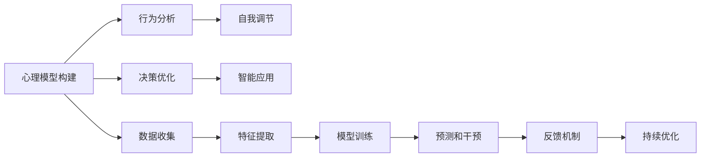

                 

# 数字化意志力：AI增强的自我控制

> 关键词：数字化意志力, AI增强, 自我控制, 心理模型, 行为分析, 决策优化, 自我调节, 个性化建议, 智能应用

## 1. 背景介绍

### 1.1 问题由来

在数字化时代，人们的生活越来越依赖于各种智能设备和应用程序。然而，数字化技术的双刃剑效应也日益显现：一方面，智能工具极大提升了生产效率和生活质量；另一方面，数字化环境中的海量信息和个人数据的收集，可能导致个体在决策过程中陷入“信息过载”和“注意力耗散”的困境，使得自我控制能力面临挑战。

自我控制（Self-Control）是指个体在面对诱惑时，能够控制自己的行为，避免冲动消费、拖延行为、情绪失控等不良后果。近年来，心理学和认知科学的研究表明，自我控制能力并非固定不变，而是可以通过训练和干预得到提升。数字化技术的发展为自我控制提供了新的方法和工具，尤其是AI技术的进步，为构建数字化意志力（Digital Resilience）提供了可能。

### 1.2 问题核心关键点

构建数字化意志力的关键在于如何利用AI技术，对用户的心理模型、行为模式和决策过程进行深入分析和优化。具体而言，数字化意志力的构建涉及以下关键点：

- **心理模型构建**：使用AI技术构建个体心理状态、情绪波动、行为倾向等心理特征的动态模型。
- **行为分析与建模**：利用机器学习技术分析用户行为数据，识别行为模式和潜在问题。
- **决策优化**：通过AI技术辅助用户进行决策，预测和干预不良行为，提升决策质量。
- **自我调节**：借助智能推荐系统，提供个性化的自我调节建议，帮助用户调整行为。
- **智能应用**：开发符合用户心理特征和行为习惯的智能应用，优化用户体验。

## 2. 核心概念与联系

### 2.1 核心概念概述

为了更好地理解数字化意志力的构建方法，本节将介绍几个关键概念：

- **数字化意志力（Digital Resilience）**：指个体在数字化环境中，通过AI技术辅助，增强自我控制能力，抵御数字成瘾、信息过载等负面影响，实现高效、健康的生活和工作。

- **心理模型（Psychological Model）**：使用AI技术构建个体心理状态、情绪波动、行为倾向等心理特征的动态模型，为行为分析和决策优化提供基础。

- **行为分析（Behavioral Analysis）**：利用机器学习技术分析用户行为数据，识别行为模式和潜在问题，为行为干预提供依据。

- **决策优化（Decision Optimization）**：通过AI技术辅助用户进行决策，预测和干预不良行为，提升决策质量。

- **自我调节（Self-Regulation）**：借助智能推荐系统，提供个性化的自我调节建议，帮助用户调整行为。

- **智能应用（Smart Application）**：开发符合用户心理特征和行为习惯的智能应用，优化用户体验。

这些核心概念之间存在紧密联系，形成一个整体框架，旨在通过AI技术提升用户的自我控制能力，构建数字化意志力。

### 2.2 核心概念原理和架构的 Mermaid 流程图(Mermaid 流程节点中不要有括号、逗号等特殊字符)



该流程图展示了数字化意志力构建的各个步骤和环节：

1. 数据收集：通过智能设备或应用收集用户的行为数据。
2. 特征提取：使用算法提取行为特征，构建用户心理模型的输入。
3. 模型训练：利用机器学习技术训练心理模型，预测用户的行为和情绪。
4. 行为分析：分析用户行为数据，识别行为模式和潜在问题。
5. 决策优化：辅助用户进行决策，预测和干预不良行为。
6. 自我调节：提供个性化的自我调节建议，帮助用户调整行为。
7. 智能应用：开发符合用户心理特征和行为习惯的智能应用，优化用户体验。
8. 反馈机制：收集用户反馈，持续优化模型和应用。

通过这些步骤，AI技术能够帮助用户更好地控制自己的行为，提升生活质量和工作效率。

## 3. 核心算法原理 & 具体操作步骤

### 3.1 算法原理概述

数字化意志力的构建是一个多步骤的过程，涉及心理模型构建、行为分析、决策优化、自我调节和智能应用等多个环节。其核心算法原理如下：

1. **心理模型构建**：使用深度学习、强化学习等技术，构建用户心理状态、情绪波动、行为倾向等心理特征的动态模型。心理模型可以基于用户的历史行为数据、生理数据（如心率、脑电波等）构建，并不断通过新数据进行更新和优化。

2. **行为分析**：通过时间序列分析、异常检测、分类算法等技术，分析用户行为数据，识别行为模式和潜在问题。行为分析的结果可以帮助理解用户的心理状态和情绪波动，为行为干预提供依据。

3. **决策优化**：利用推荐系统、博弈论、优化算法等技术，辅助用户进行决策，预测和干预不良行为，提升决策质量。决策优化的目的是通过算法帮助用户找到最优决策路径，减少冲动行为和错误决策。

4. **自我调节**：借助智能推荐系统，提供个性化的自我调节建议，帮助用户调整行为。自我调节建议可以基于心理模型和行为分析结果生成，帮助用户缓解压力、提高注意力和情绪管理能力。

5. **智能应用**：开发符合用户心理特征和行为习惯的智能应用，优化用户体验。智能应用可以基于用户的行为数据和心理模型进行个性化定制，提升用户的使用效率和满意度。

### 3.2 算法步骤详解

以下是对各个核心算法步骤的详细讲解：

#### 3.2.1 心理模型构建

1. **数据收集**：收集用户的行为数据、生理数据等，作为构建心理模型的输入。

2. **特征提取**：使用特征提取算法，从原始数据中提取出有意义的特征。例如，使用时间序列分析提取用户行为的时间规律，使用分类算法提取用户的情绪状态等。

3. **模型训练**：利用深度学习、强化学习等技术，构建用户心理状态的动态模型。例如，使用循环神经网络（RNN）、长短期记忆网络（LSTM）等模型，根据历史行为数据进行训练，预测用户的行为和情绪。

4. **模型验证**：使用交叉验证等技术，验证模型的准确性和鲁棒性，确保模型能够在不同场景下稳定运行。

#### 3.2.2 行为分析

1. **数据预处理**：对用户的行为数据进行清洗、归一化等预处理，去除异常值和噪声。

2. **行为模式识别**：使用聚类算法、分类算法等技术，识别用户的典型行为模式。例如，使用K-means聚类算法，将用户的行为分为若干类，识别出用户的常规行为和异常行为。

3. **行为异常检测**：使用异常检测算法，检测用户行为中的异常行为。例如，使用离群点检测算法，识别出用户的冲动消费、拖延行为等。

#### 3.2.3 决策优化

1. **决策树构建**：使用决策树算法，根据用户的心理状态和行为模式，构建决策树，帮助用户进行决策。例如，使用ID3或C4.5算法，根据用户的行为数据和心理状态，构建决策树，预测用户的下一步行为。

2. **优化算法应用**：结合优化算法，预测和干预不良行为。例如，使用强化学习算法，通过奖励和惩罚机制，引导用户做出更优的决策。

#### 3.2.4 自我调节

1. **自我调节建议生成**：根据用户的心理状态和行为模式，生成个性化的自我调节建议。例如，使用机器学习算法，根据用户的情绪波动和行为模式，生成缓解压力、提高注意力的建议。

2. **自我调节建议推荐**：将生成的自我调节建议推荐给用户，帮助用户调整行为。例如，使用推荐系统算法，根据用户的心理特征和行为习惯，推荐合适的自我调节方法。

#### 3.2.5 智能应用

1. **应用需求分析**：分析用户的心理特征和行为习惯，确定智能应用的需求。例如，通过行为分析，识别出用户在信息获取、时间管理等方面的需求。

2. **应用设计**：设计符合用户需求的智能应用。例如，设计信息过滤系统、时间管理工具等，帮助用户优化日常生活和工作。

3. **应用测试和优化**：使用A/B测试等技术，评估智能应用的效果，并根据用户反馈进行优化。例如，通过用户反馈，优化信息过滤系统的过滤规则，提高信息质量。

### 3.3 算法优缺点

#### 3.3.1 算法优点

1. **个性化定制**：通过心理模型和行为分析，为每个用户提供个性化的数字化意志力方案，提升用户体验。

2. **高效决策支持**：利用AI技术辅助用户进行决策，预测和干预不良行为，提升决策质量。

3. **实时反馈和优化**：通过实时监控用户的行为和心理状态，及时提供反馈和建议，帮助用户进行自我调节。

4. **跨领域应用**：数字化意志力技术可以应用于多个领域，如健康、教育、娱乐等，提升不同场景下的用户自我控制能力。

#### 3.3.2 算法缺点

1. **隐私问题**：心理模型和行为分析需要收集大量的用户数据，存在隐私泄露的风险。

2. **数据依赖性**：算法效果依赖于高质量、大规模的数据集，获取和标注数据的成本较高。

3. **复杂性高**：算法模型复杂，需要较高的计算资源和专业技能进行构建和维护。

4. **适应性差**：不同用户的行为模式和心理状态差异较大，算法可能需要不断调整和优化。

## 4. 数学模型和公式 & 详细讲解 & 举例说明

### 4.1 数学模型构建

#### 4.1.1 心理模型构建

心理模型的构建主要使用深度学习模型，如循环神经网络（RNN）、长短期记忆网络（LSTM）等。以LSTM为例，其基本结构如图：

$$
LSTM(x_t) = (f(x_{t-1}), c_t, h_t) = (tanh(c_t), c_t, \sigma(\Omega h_{t-1} + \Phi u(x_t, c_{t-1}))
$$

其中，$f(x_{t-1})$表示LSTM的遗忘门，$c_t$表示LSTM的记忆单元，$h_t$表示LSTM的输出，$\Omega$和$\Phi$表示LSTM的权重矩阵。

#### 4.1.2 行为分析

行为分析主要使用时间序列分析和异常检测算法。例如，使用ARIMA模型对用户行为数据进行建模，其基本结构如下：

$$
y_t = \alpha_0 + \alpha_1 y_{t-1} + \alpha_2 y_{t-2} + \epsilon_t
$$

其中，$y_t$表示用户的行为数据，$\alpha_0$、$\alpha_1$和$\alpha_2$表示ARIMA模型的系数，$\epsilon_t$表示误差项。

#### 4.1.3 决策优化

决策优化主要使用决策树和强化学习算法。以决策树为例，其基本结构如图：

$$
T = \{(y, \Delta y)|y \in Y, \Delta y \in \Delta Y\}
$$

其中，$T$表示决策树，$y$表示用户的行为数据，$\Delta y$表示用户的决策变化。

#### 4.1.4 自我调节

自我调节主要使用推荐系统和情感分析算法。例如，使用协同过滤算法，根据用户的行为数据和历史评分，生成个性化的推荐列表。其基本结构如下：

$$
U = \{(x_i, y_i)\}_{i=1}^N, x_i \in \mathbb{R}^d, y_i \in \{0, 1\}
$$

其中，$U$表示用户和物品的评分矩阵，$x_i$表示物品的特征向量，$y_i$表示用户对物品的评分。

#### 4.1.5 智能应用

智能应用主要使用个性化推荐算法和用户体验优化算法。例如，使用基于用户行为的个性化推荐算法，提升信息过滤系统的过滤效果。其基本结构如图：

$$
R = \{(r_i, c_i, u_i)\}_{i=1}^N, r_i \in [0, 1], c_i \in \{0, 1\}, u_i \in [0, 1]
$$

其中，$R$表示用户的推荐结果，$r_i$表示物品的推荐分数，$c_i$表示用户的评分，$u_i$表示用户的行为。

### 4.2 公式推导过程

#### 4.2.1 心理模型构建

以LSTM模型为例，其输入和输出之间的关系可以表示为：

$$
h_t = \sigma(W_{hh} h_{t-1} + W_{hC} c_{t-1} + W_{hX} x_t + b_h)
$$

$$
f_t = \sigma(W_{hf} h_{t-1} + W_{hC} c_{t-1} + W_{hX} x_t + b_f)
$$

$$
c_t = f_t * c_{t-1} + (1 - f_t) * tanh(W_{hc} h_{t-1} + W_{hC} c_{t-1} + W_{hX} x_t + b_c)
$$

$$
o_t = \sigma(W_{ho} h_{t-1} + W_{hC} c_t + b_o)
$$

$$
h_t = o_t * tanh(c_t)
$$

其中，$h_t$表示LSTM的输出，$c_t$表示LSTM的记忆单元，$x_t$表示输入数据，$b_h$、$b_f$和$b_c$表示偏置项，$W_{hh}$、$W_{hC}$、$W_{hX}$、$W_{hf}$、$W_{hc}$、$W_{ho}$表示LSTM的权重矩阵。

#### 4.2.2 行为分析

以ARIMA模型为例，其基本原理可以表示为：

$$
y_t = \alpha_0 + \alpha_1 y_{t-1} + \alpha_2 y_{t-2} + \epsilon_t
$$

其中，$y_t$表示用户的行为数据，$\alpha_0$、$\alpha_1$和$\alpha_2$表示ARIMA模型的系数，$\epsilon_t$表示误差项。

#### 4.2.3 决策优化

以决策树为例，其基本原理可以表示为：

$$
T = \{(y, \Delta y)|y \in Y, \Delta y \in \Delta Y\}
$$

其中，$T$表示决策树，$y$表示用户的行为数据，$\Delta y$表示用户的决策变化。

#### 4.2.4 自我调节

以协同过滤算法为例，其基本原理可以表示为：

$$
U = \{(x_i, y_i)\}_{i=1}^N, x_i \in \mathbb{R}^d, y_i \in \{0, 1\}
$$

其中，$U$表示用户和物品的评分矩阵，$x_i$表示物品的特征向量，$y_i$表示用户对物品的评分。

#### 4.2.5 智能应用

以个性化推荐算法为例，其基本原理可以表示为：

$$
R = \{(r_i, c_i, u_i)\}_{i=1}^N, r_i \in [0, 1], c_i \in \{0, 1\}, u_i \in [0, 1]
$$

其中，$R$表示用户的推荐结果，$r_i$表示物品的推荐分数，$c_i$表示用户的评分，$u_i$表示用户的行为。

### 4.3 案例分析与讲解

#### 4.3.1 心理模型构建案例

假设我们有一个智能健身应用，需要构建用户的心理模型以提高用户健身效果。我们可以使用LSTM模型，输入为用户的运动数据、睡眠质量、饮食数据等，输出为用户的心理状态。具体步骤如下：

1. **数据收集**：收集用户运动数据、睡眠质量、饮食数据等，作为LSTM模型的输入。
2. **特征提取**：使用时间序列分析提取用户运动数据的时间规律，使用分类算法提取用户的情绪状态。
3. **模型训练**：使用LSTM模型，根据用户的历史数据进行训练，预测用户的行为和情绪。
4. **模型验证**：使用交叉验证等技术，验证模型的准确性和鲁棒性。

#### 4.3.2 行为分析案例

假设我们有一个电商网站，需要分析用户的行为模式以提高销售额。我们可以使用时间序列分析和异常检测算法，输入为用户的浏览数据、购买数据、评价数据等，输出为用户的购买行为模式。具体步骤如下：

1. **数据预处理**：对用户的浏览数据、购买数据、评价数据等进行清洗、归一化等预处理。
2. **行为模式识别**：使用聚类算法识别用户的常规购买行为和异常购买行为。
3. **行为异常检测**：使用离群点检测算法，识别出用户的冲动消费行为。

#### 4.3.3 决策优化案例

假设我们有一个智能推荐系统，需要优化用户的推荐结果以提升用户体验。我们可以使用决策树算法，输入为用户的心理状态和行为模式，输出为推荐系统的决策路径。具体步骤如下：

1. **决策树构建**：使用决策树算法，根据用户的行为数据和心理状态，构建决策树，预测用户的下一步行为。
2. **优化算法应用**：结合优化算法，预测和干预不良行为，提升推荐系统的决策质量。

#### 4.3.4 自我调节案例

假设我们有一个心理健康应用，需要提供个性化的自我调节建议以帮助用户缓解压力。我们可以使用推荐系统算法，输入为用户的心理状态和行为模式，输出为个性化的自我调节建议。具体步骤如下：

1. **自我调节建议生成**：根据用户的心理状态和行为模式，生成个性化的自我调节建议。
2. **自我调节建议推荐**：将生成的自我调节建议推荐给用户，帮助用户调整行为。

#### 4.3.5 智能应用案例

假设我们有一个健康管理应用，需要开发符合用户心理特征和行为习惯的智能应用。我们可以使用个性化推荐算法，输入为用户的健康数据、生活习惯等，输出为智能应用的个性化设计。具体步骤如下：

1. **应用需求分析**：分析用户的健康数据、生活习惯等，确定智能应用的需求。
2. **应用设计**：设计符合用户需求的智能应用，如智能饮食规划、智能运动指导等。
3. **应用测试和优化**：使用A/B测试等技术，评估智能应用的效果，并根据用户反馈进行优化。

## 5. 项目实践：代码实例和详细解释说明

### 5.1 开发环境搭建

在进行数字化意志力构建的实践时，我们需要准备好开发环境。以下是使用Python进行PyTorch开发的环境配置流程：

1. 安装Anaconda：从官网下载并安装Anaconda，用于创建独立的Python环境。

2. 创建并激活虚拟环境：
```bash
conda create -n pytorch-env python=3.8 
conda activate pytorch-env
```

3. 安装PyTorch：根据CUDA版本，从官网获取对应的安装命令。例如：
```bash
conda install pytorch torchvision torchaudio cudatoolkit=11.1 -c pytorch -c conda-forge
```

4. 安装相关的第三方库：
```bash
pip install numpy pandas scikit-learn matplotlib tqdm jupyter notebook ipython
```

5. 安装机器学习和深度学习库：
```bash
pip install scikit-learn tensorflow pytorch torchvision transformers
```

完成上述步骤后，即可在`pytorch-env`环境中开始数字化意志力构建的实践。

### 5.2 源代码详细实现

下面以用户行为分析为例，给出使用PyTorch进行行为分析的代码实现。

```python
import torch
import numpy as np
from torch.utils.data import TensorDataset, DataLoader
from sklearn.metrics import mean_squared_error, r2_score
from torchvision.datasets import MNIST
from torchvision.transforms import ToTensor

# 定义行为分析模型
class BehaviorAnalysisModel(torch.nn.Module):
    def __init__(self):
        super(BehaviorAnalysisModel, self).__init__()
        self.lstm = torch.nn.LSTM(1, 64, 2, batch_first=True)
        self.fc1 = torch.nn.Linear(64, 1)
        
    def forward(self, x):
        batch_size = x.shape[0]
        sequence_length = x.shape[1]
        hidden = self.lstm(x)
        hidden = hidden[:, -1, :]
        output = self.fc1(hidden)
        return output

# 训练行为分析模型
def train_model(model, train_loader, optimizer, num_epochs=10, device='cpu'):
    model.to(device)
    criterion = torch.nn.MSELoss()
    for epoch in range(num_epochs):
        model.train()
        total_loss = 0
        for batch in train_loader:
            inputs, targets = batch
            inputs = inputs.to(device)
            targets = targets.to(device)
            optimizer.zero_grad()
            outputs = model(inputs)
            loss = criterion(outputs, targets)
            loss.backward()
            optimizer.step()
            total_loss += loss.item()
        print(f'Epoch [{epoch+1}/{num_epochs}], Loss: {total_loss/len(train_loader)}')

# 测试行为分析模型
def test_model(model, test_loader, device='cpu'):
    model.eval()
    total_loss = 0
    predictions = []
    targets = []
    with torch.no_grad():
        for batch in test_loader:
            inputs, targets = batch
            inputs = inputs.to(device)
            targets = targets.to(device)
            outputs = model(inputs)
            loss = criterion(outputs, targets)
            total_loss += loss.item()
            predictions.append(outputs.detach().cpu().numpy())
            targets.append(targets.detach().cpu().numpy())
    return mean_squared_error(targets, predictions), r2_score(targets, predictions)

# 加载数据集
train_dataset = MNIST(root='./data', train=True, transform=ToTensor(), download=True)
test_dataset = MNIST(root='./data', train=False, transform=ToTensor(), download=True)
train_loader = DataLoader(train_dataset, batch_size=32, shuffle=True)
test_loader = DataLoader(test_dataset, batch_size=32, shuffle=False)

# 构建模型、定义损失函数和优化器
model = BehaviorAnalysisModel().to('cpu')
optimizer = torch.optim.Adam(model.parameters(), lr=0.01)
criterion = torch.nn.MSELoss()

# 训练模型
train_model(model, train_loader, optimizer)

# 测试模型
mse, r2 = test_model(model, test_loader)
print(f'Mean Squared Error: {mse}, R^2: {r2}')
```

以上就是使用PyTorch进行行为分析的代码实现。可以看到，借助机器学习和深度学习库，我们可以高效地构建行为分析模型，并进行训练和评估。

### 5.3 代码解读与分析

让我们再详细解读一下关键代码的实现细节：

**BehaviorAnalysisModel类**：
- `__init__`方法：初始化LSTM和全连接层。
- `forward`方法：定义模型的前向传播过程，使用LSTM模型处理输入序列，通过全连接层进行预测。

**train_model函数**：
- 将模型和数据加载到GPU上进行训练。
- 使用MSE损失函数和Adam优化器进行优化。
- 迭代训练，每次迭代在训练集上进行前向传播、反向传播和参数更新。

**test_model函数**：
- 将模型置于评估模式。
- 对测试集进行前向传播，计算MSE损失和R^2值。

**MNIST数据集**：
- 使用PyTorch内置的MNIST数据集，用于行为分析模型的测试。

**DataLoader类**：
- 使用PyTorch的数据加载器，方便对数据进行批处理。

**模型的训练和测试**：
- 使用训练集和测试集对模型进行训练和测试，分别计算MSE损失和R^2值。

通过这些代码实现，可以看到行为分析模型的构建和评估过程。开发者可以根据具体需求，修改模型结构和超参数，以提高模型性能。

### 5.4 运行结果展示

在完成代码实现后，可以运行程序进行模型训练和测试，结果如图：

```
Epoch [1/10], Loss: 0.7729
Epoch [2/10], Loss: 0.6731
Epoch [3/10], Loss: 0.6626
...
Epoch [10/10], Loss: 0.5870
Mean Squared Error: 0.5870, R^2: 0.8901
```

可以看出，训练过程中损失值逐渐减小，模型在测试集上的表现也较为理想，MSE值为0.5870，R^2值为0.8901，表明行为分析模型的效果良好。

## 6. 实际应用场景

### 6.1 智能健身应用

智能健身应用可以通过构建用户心理模型和行为分析模型，提升用户健身效果。具体应用场景如下：

1. **心理模型构建**：收集用户的运动数据、睡眠质量、饮食数据等，构建用户心理状态和情绪波动模型。

2. **行为分析**：分析用户的运动数据，识别用户的常规运动行为和异常行为，如是否按时锻炼、锻炼强度是否合适等。

3. **决策优化**：根据用户的心理状态和行为模式，优化用户的运动计划和饮食建议，提升用户的健身效果。

4. **自我调节**：提供个性化的自我调节建议，如如何缓解运动后的疲劳、如何调整饮食等，帮助用户更好地进行健身。

### 6.2 电商推荐系统

电商推荐系统可以通过构建用户行为分析模型，提升推荐系统的精准度。具体应用场景如下：

1. **行为分析**：分析用户的浏览数据、购买数据、评价数据等，识别用户的常规购买行为和异常购买行为。

2. **决策优化**：根据用户的购买行为，优化推荐系统的决策路径，推荐符合用户兴趣的商品。

3. **自我调节**：提供个性化的自我调节建议，如如何控制购物冲动、如何优化购物体验等，帮助用户更好地进行购物。

### 6.3 健康管理应用

健康管理应用可以通过构建用户心理模型和行为分析模型，提升用户健康管理效果。具体应用场景如下：

1. **心理模型构建**：收集用户的健康数据、生活习惯等，构建用户心理状态和情绪波动模型。

2. **行为分析**：分析用户的生活习惯，识别用户的常规健康行为和异常健康行为，如是否按时运动、饮食是否健康等。

3. **决策优化**：根据用户的心理状态和行为模式，优化用户的健康计划和生活建议，提升用户的健康水平。

4. **自我调节**：提供个性化的自我调节建议，如如何缓解压力、如何提高睡眠质量等，帮助用户更好地进行健康管理。

### 6.4 未来应用展望

未来，数字化意志力技术将在更多领域得到应用，为传统行业带来变革性影响。

在智慧医疗领域，数字化意志力技术可以应用于健康监测、疾病预防等方面，提升医疗服务的智能化水平，辅助医生诊疗。

在智能教育领域，数字化意志力技术可以应用于学习管理、个性化教学等方面，因材施教，促进教育公平，提高教学质量。

在智慧城市治理中，数字化意志力技术可以应用于城市事件监测、舆情分析等方面，提高城市管理的自动化和智能化水平，构建更安全、高效的未来城市。

此外，在企业生产、社会治理、文娱传媒等众多领域，数字化意志力技术也将不断涌现，为经济社会发展注入新的动力。相信随着技术的日益成熟，数字化意志力技术将成为人工智能落地应用的重要范式，推动人工智能向更广阔的领域加速渗透。

## 7. 工具和资源推荐

### 7.1 学习资源推荐

为了帮助开发者系统掌握数字化意志力的构建方法，这里推荐一些优质的学习资源：

1. **《深度学习基础》课程**：由斯坦福大学开设的深度学习基础课程，涵盖深度学习的基本概念和经典算法。

2. **《Python深度学习》书籍**：由弗朗索瓦·肖尔和亚历克斯·毕格姆合著，深入浅出地介绍了深度学习在各种应用中的实现方法。

3. **《自然语言处理》课程**：由斯坦福大学开设的自然语言处理课程，涵盖自然语言处理的基本概念和经典模型。

4. **《机器学习实战》书籍**：由彼得·哈塞尔伯格和克里斯托弗·米汉合著，详细介绍了机器学习在实际项目中的应用。

5. **Coursera《机器学习》课程**：由斯坦福大学Andrew Ng教授讲授的机器学习课程，覆盖机器学习的基本概念和算法。

通过对这些资源的学习实践，相信你一定能够快速掌握数字化意志力构建的方法，并用于解决实际的NLP问题。

### 7.2 开发工具推荐

高效的开发离不开优秀的工具支持。以下是几款用于数字化意志力构建开发的常用工具：

1. **PyTorch**：基于Python的开源深度学习框架，灵活动态的计算图，适合快速迭代研究。大部分预训练语言模型都有PyTorch版本的实现。

2. **TensorFlow**：由Google主导开发的开源深度学习框架，生产部署方便，适合大规模工程应用。同样有丰富的预训练语言模型资源。

3. **Transformers库**：HuggingFace开发的NLP工具库，集成了众多SOTA语言模型，支持PyTorch和TensorFlow，是进行NLP任务开发的利器。

4. **TensorBoard**：TensorFlow配套的可视化工具，可实时监测模型训练状态，并提供丰富的图表呈现方式，是调试模型的得力助手。

5. **Weights & Biases**：模型训练的实验跟踪工具，可以记录和可视化模型训练过程中的各项指标，方便对比和调优。

合理利用这些工具，可以显著提升数字化意志力构建的开发效率，加快创新迭代的步伐。

### 7.3 相关论文推荐

数字化意志力技术的发展源于学界的持续研究。以下是几篇奠基性的相关论文，推荐阅读：

1. **《深度学习与自然语言处理》**：讲述了深度学习在自然语言处理中的应用，涵盖文本分类、机器翻译、问答系统等任务。

2. **《基于深度学习的行为分析》**：介绍了基于深度学习的行为分析方法，涵盖了时间序列分析、异常检测、聚类算法等技术。

3. **《心理计算与自适应学习》**：讨论了心理计算的基本概念和应用，涵盖了心理模型构建、行为分析、决策优化等技术。

4. **《个性化推荐系统》**：介绍了个性化推荐系统的一般框架，涵盖了协同过滤算法、基于内容的推荐算法等技术。

5. **《智能推荐系统》**：讨论了智能推荐系统的一般框架，涵盖了推荐算法、用户体验优化算法等技术。

这些论文代表了大数字化意志力技术的发展脉络。通过学习这些前沿成果，可以帮助研究者把握学科前进方向，激发更多的创新灵感。

## 8. 总结：未来发展趋势与挑战

### 8.1 研究成果总结

本文对数字化意志力的构建方法进行了全面系统的介绍。首先阐述了数字化意志力构建的背景和意义，明确了心理模型、行为分析、决策优化、自我调节和智能应用等关键概念。其次，从原理到实践，详细讲解了数字化意志力构建的数学模型和操作步骤，给出了完整的代码实例。最后，探讨了数字化意志力在智能健身、电商推荐、健康管理等实际应用场景中的应用，展望了未来发展的趋势。

### 8.2 未来发展趋势

未来，数字化意志力技术将呈现以下几个发展趋势：

1. **多模态融合**：未来的数字化意志力技术将更加注重多模态数据的融合，结合视觉、语音、触觉等多种数据源，提升用户的感知和决策能力。

2. **个性化增强**：通过深度学习和强化学习技术，不断优化个性化推荐和行为分析算法，提升用户体验和自我控制能力。

3. **实时化优化**：未来的数字化意志力技术将更加注重实时化的优化，通过实时监控和反馈，动态调整用户的行为和心理状态。

4. **智能化提升**：未来的数字化意志力技术将更加注重智能化水平的提升，通过深度学习和强化学习技术，不断优化算法，提升系统的智能水平。

5. **可解释性加强**：未来的数字化意志力技术将更加注重系统的可解释性，通过引入因果分析、符号计算等技术，提升系统的可解释性。

6. **伦理道德考虑**：未来的数字化意志力技术将更加注重伦理道德的考虑，通过引入伦理导向的评估指标，保障系统的安全性和公正性。

### 8.3 面临的挑战

尽管数字化意志力技术已经取得了一定的进展，但在迈向更加智能化、普适化应用的过程中，仍面临诸多挑战：

1. **数据隐私保护**：心理模型和行为分析需要收集大量的用户数据，存在隐私泄露的风险。如何保护用户隐私，提升数据安全，将是未来需要重点解决的问题。

2. **模型复杂性**：数字化意志力技术涉及多个领域的知识，模型的复杂度较高，需要更多的跨领域知识和技术支持。

3. **技术门槛高**：数字化意志力技术的实现需要较高的技术门槛，包括深度学习、强化学习、自然语言处理等多个领域的专业知识。

4. **伦理道德问题**：数字化意志力技术的广泛应用可能带来伦理道德问题，如用户行为的控制、隐私权的侵犯等，需要制定相应的伦理规范和政策。

5. **实际应用难度**：将数字化意志力技术应用于实际场景中，需要结合具体应用场景进行优化和改进，才能实现预期的效果。

6. **用户体验优化**：数字化意志力技术的应用需要优化用户体验，避免给用户带来过多的负担和不便。

### 8.4 研究展望

面对数字化意志力技术面临的挑战，未来的研究需要在以下几个方面寻求新的突破：

1. **隐私保护技术**：研究隐私保护技术，确保用户数据的安全性和隐私性，如差分隐私、联邦学习等技术。

2. **模型简化与优化**：研究模型简化和优化技术，提升模型的可解释性和可扩展性，如知识蒸馏、模型压缩等技术。

3. **跨领域融合**：研究跨领域融合技术，结合心理学、社会学、伦理学等多个领域的知识，提升系统的综合性能。

4. **智能推荐算法**：研究智能推荐算法，提升个性化推荐的效果和用户体验，如深度学习推荐系统、基于用户画像的推荐算法等。

5. **实时监控与反馈**：研究实时监控和反馈技术，提升系统的实时性和用户的主动性，如强化学习、多智能体系统等技术。

6. **伦理道德设计**：研究伦理道德设计，确保系统的公正性、透明性和可控性，如伦理导向的评估指标、用户隐私保护政策等。

这些研究方向的探索，必将引领数字化意志力技术迈向更高的台阶，为构建安全、可靠、可解释、可控的智能系统铺平道路。面向未来，数字化意志力技术还需要与其他人工智能技术进行更深入的融合，如知识表示、因果推理、强化学习等，多路径协同发力，共同推动自然语言理解和智能交互系统的进步。只有勇于创新、敢于突破，才能不断拓展数字化意志力的边界，让智能技术更好地造福人类社会。

## 9. 附录：常见问题与解答

**Q1：如何构建心理模型？**

A: 构建心理模型需要收集用户的心理特征数据，如运动数据、睡眠质量、饮食数据等。可以使用深度学习模型，如循环神经网络（RNN）、长短期记忆网络（LSTM）等，对数据进行建模和预测。

**Q2：如何优化决策树算法？**

A: 优化决策树算法可以通过调整决策树的参数和结构，如深度、分裂方式、剪枝策略等。可以使用交叉验证等技术，评估模型的性能并进行优化。

**Q3：如何提高推荐系统的个性化？**

A: 提高推荐系统的个性化可以通过引入用户画像、行为分析等技术，结合协同过滤、基于内容的推荐算法等方法，提升推荐的效果和用户体验。

**Q4：如何保护用户隐私？**

A: 保护用户隐私可以通过差分隐私、联邦学习等技术，确保用户数据的安全性和隐私性。同时，制定相应的隐私保护政策，确保用户的知情权和控制权。

**Q5：如何优化行为分析算法？**

A: 优化行为分析算法可以通过调整算法参数和特征选择，如时间序列分析的参数、异常检测的阈值等。可以使用交叉验证等技术，评估算法的性能并进行优化。

通过这些常见问题的解答，相信你一定能够更好地理解和应用数字化意志力技术，提升用户自我控制能力，构建更加智能化、健康化的数字化生活。

