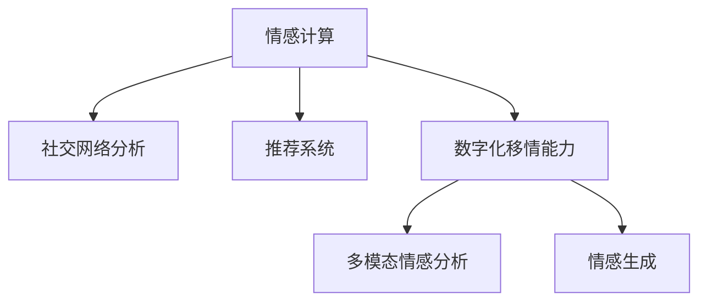

                 

# 数字化移情能力：AI增强的社交智能

> 关键词：数字化移情能力, 社交智能, AI增强, 情感计算, 社交网络分析, 推荐系统

## 1. 背景介绍

### 1.1 问题由来

在数字化浪潮的推动下，人类的社会交往方式发生了深刻变革。社交网络平台、即时通讯软件等新兴技术的普及，极大地改变了人们交流互动的频率和形式。然而，随之而来的问题也不容忽视：一方面，人们面临着海量信息过载的困扰，难以有效筛选和理解他人信息；另一方面，随着社交网络的异化，人与人之间真实的情感连接逐渐疏远，产生了所谓的"社交倦怠"和"情感疏离"。

为了缓解这一问题，研究人员开始探讨如何让计算机更好地理解人类的情感，并提供更具个性化和人性化的交互体验。数字化移情能力，即计算机对人类情感的识别、理解和响应能力，逐渐成为了新一代人工智能研究的前沿方向。

### 1.2 问题核心关键点

数字化移情能力涉及的核心问题包括：

1. 如何高效地从文本、语音、视频等数据中提取人类情感信息？
2. 如何构建模型来理解和生成情感表达？
3. 如何将情感信息与社交网络分析、推荐系统等应用结合，提升用户互动体验？
4. 如何确保AI模型在保护隐私和道德伦理方面的安全性？

这些问题不仅需要跨学科的深度研究，还需要大量高质量数据和计算资源的支撑。本文将围绕这些关键问题，详细阐述数字化移情能力的技术原理与应用实践。

## 2. 核心概念与联系

### 2.1 核心概念概述

为了更好地理解数字化移情能力，本节将介绍几个密切相关的核心概念：

- **情感计算**：指利用人工智能技术对人类情感进行识别、分析和响应的研究领域。情感计算旨在提升人机交互的自然性和智能化水平，增强计算机对人类情感的理解和应用。

- **社交网络分析**：研究社交网络结构、关系及其变化，利用图神经网络等技术进行社交关系识别和预测，提高社交网络平台的智能化水平。

- **推荐系统**：利用机器学习算法，根据用户行为和偏好，推荐个性化内容，提升用户体验。推荐系统是数字化移情能力的重要应用场景之一。

- **数字化移情能力**：指计算机系统对人类情感进行识别、理解和生成，并能够基于情感信息优化用户互动体验的能力。

- **多模态情感分析**：结合文本、语音、视频等多种数据源，综合分析人类情感，提供更全面、准确的情感理解。

- **情感生成**：利用自然语言处理技术，基于情感识别结果生成符合人类情感表达的文本、语音、视频等。

这些概念之间的逻辑关系可以通过以下Mermaid流程图来展示：



这个流程图展示了几者之间的联系：情感计算为其他概念提供基础技术支持，社交网络分析和推荐系统是情感计算的重要应用场景，数字化移情能力则是情感计算的高级目标。而多模态情感分析和情感生成，则是数字化移情能力实现中的关键技术环节。

## 3. 核心算法原理 & 具体操作步骤

### 3.1 算法原理概述

数字化移情能力的关键在于构建情感识别和情感生成模型，并在此基础上进行社交网络分析和推荐优化。以下将详细介绍情感计算、社交网络分析和推荐系统的核心算法原理。

#### 3.1.1 情感计算

情感计算的算法原理主要基于文本、语音、视频等多种数据源，综合利用自然语言处理、语音识别、计算机视觉等技术进行情感分析。情感计算模型通常分为以下几个步骤：

1. **数据预处理**：对原始数据进行清洗、分词、归一化等预处理，确保数据质量。
2. **特征提取**：从文本、语音、视频中提取情感特征，如情感词汇、语调、面部表情等。
3. **情感分类**：使用分类算法，如支持向量机、随机森林、神经网络等，对提取的情感特征进行情感分类。
4. **情感聚类**：对情感分类结果进行聚类，生成情感标签，如快乐、悲伤、愤怒等。
5. **情感生成**：利用自然语言生成技术，基于情感标签生成符合情感表达的文本、语音、视频等。

#### 3.1.2 社交网络分析

社交网络分析的算法原理主要基于图神经网络（GNN）技术，通过分析社交网络的结构、关系及其变化，进行关系识别和预测。社交网络分析模型通常分为以下几个步骤：

1. **网络构建**：对社交网络数据进行采集、清洗和构建，生成社交网络图。
2. **节点嵌入**：使用图神经网络，如GCN、GAT、GNN等，对节点进行嵌入，生成高维向量表示。
3. **关系预测**：利用嵌入向量进行关系预测，如好友关系、情感关系等。
4. **关系优化**：通过关系优化算法，如强化学习、动态图优化等，提升关系预测的准确性和鲁棒性。

#### 3.1.3 推荐系统

推荐系统的算法原理主要基于协同过滤、内容过滤和混合过滤等技术，根据用户行为和偏好，推荐个性化内容。推荐系统模型通常分为以下几个步骤：

1. **用户行为记录**：收集用户的浏览、点击、评分等行为数据。
2. **数据预处理**：对行为数据进行清洗、分词、归一化等预处理，确保数据质量。
3. **特征提取**：从行为数据中提取用户特征，如兴趣、偏好、历史行为等。
4. **推荐模型训练**：使用机器学习算法，如矩阵分解、深度学习等，训练推荐模型。
5. **推荐结果生成**：基于训练好的推荐模型，生成个性化推荐结果。

### 3.2 算法步骤详解

#### 3.2.1 情感计算

1. **数据预处理**
   - 数据清洗：去除无关信息，如HTML标签、噪音数据等。
   - 分词：使用NLTK、spaCy等工具进行中文分词。
   - 归一化：对文本数据进行标准化处理，如小写、去除停用词等。

2. **特征提取**
   - 情感词汇：提取文本中的情感词汇，如"快乐"、"悲伤"、"愤怒"等。
   - 语调：提取语音中的语调特征，如音高、音速、音量等。
   - 面部表情：通过计算机视觉技术，提取视频中的面部表情特征。

3. **情感分类**
   - 使用支持向量机（SVM）或随机森林（Random Forest）等分类算法，对情感特征进行情感分类。
   - 使用神经网络模型，如卷积神经网络（CNN）、循环神经网络（RNN）、长短期记忆网络（LSTM）等，对情感特征进行情感分类。

4. **情感聚类**
   - 使用K-Means聚类算法，将情感分类结果进行聚类，生成情感标签。
   - 使用层次聚类（Hierarchical Clustering）等算法，进行更细粒度的情感分类。

5. **情感生成**
   - 使用自然语言生成技术，如GPT、BERT等，基于情感标签生成符合情感表达的文本。
   - 使用语音生成技术，如WaveNet、Tacotron等，基于情感标签生成符合情感表达的语音。
   - 使用视频生成技术，如GANs等，基于情感标签生成符合情感表达的视频。

#### 3.2.2 社交网络分析

1. **网络构建**
   - 数据采集：从社交网络平台获取用户关系数据，如微博、微信、Facebook等。
   - 数据清洗：去除无关信息，如重复数据、异常数据等。
   - 网络构建：将用户关系数据转换为社交网络图。

2. **节点嵌入**
   - 使用GCN、GAT、GNN等图神经网络模型，对社交网络节点进行嵌入，生成高维向量表示。
   - 使用Transductive Graph Attention Network（TGAT）等模型，对社交网络节点进行嵌入，生成高维向量表示。

3. **关系预测**
   - 使用关系预测算法，如邻接矩阵（Adjacency Matrix）、邻居相似度（Neighbor Similarity）等，预测社交关系。
   - 使用图卷积网络（GCN）等模型，预测社交关系，生成高维向量表示。

4. **关系优化**
   - 使用强化学习算法，如深度强化学习（Deep RL）、深度确定性策略梯度（DDPG）等，优化关系预测模型。
   - 使用动态图优化算法，如GraphSAGE、GraphSNN等，优化关系预测模型。

#### 3.2.3 推荐系统

1. **用户行为记录**
   - 记录用户浏览、点击、评分等行为数据，如浏览网页、购买商品等。
   - 记录用户互动数据，如评论、点赞、分享等。

2. **数据预处理**
   - 数据清洗：去除无关信息，如HTML标签、噪音数据等。
   - 分词：使用NLTK、spaCy等工具进行中文分词。
   - 归一化：对文本数据进行标准化处理，如小写、去除停用词等。

3. **特征提取**
   - 用户特征：提取用户行为数据中的特征，如兴趣、偏好、历史行为等。
   - 物品特征：提取物品数据中的特征，如属性、类别、评分等。

4. **推荐模型训练**
   - 使用协同过滤算法，如矩阵分解（Matrix Factorization）、基于用户的协同过滤（User-based CF）等，训练推荐模型。
   - 使用深度学习算法，如深度神经网络（DNN）、自编码器（Autoencoder）等，训练推荐模型。

5. **推荐结果生成**
   - 使用协同过滤算法，生成个性化推荐结果。
   - 使用深度学习算法，生成个性化推荐结果。

### 3.3 算法优缺点

#### 3.3.1 情感计算

**优点**
- 能够综合利用文本、语音、视频等多种数据源，提供更全面、准确的情感理解。
- 结合自然语言生成技术，能够生成符合人类情感表达的文本、语音、视频等。
- 利用深度学习算法，能够进行大规模情感分类和聚类。

**缺点**
- 对数据质量要求较高，数据预处理过程较为复杂。
- 情感分类和聚类算法可能存在一定误差，影响结果准确性。
- 情感生成技术需要大量的计算资源，生成结果的复杂度较高。

#### 3.3.2 社交网络分析

**优点**
- 利用图神经网络技术，能够进行高效的社交关系预测和优化。
- 能够生成高维节点嵌入向量，提供丰富的社交信息。
- 结合强化学习算法，能够自适应优化社交关系预测。

**缺点**
- 对社交网络数据质量要求较高，数据采集和构建过程较为复杂。
- 节点嵌入算法复杂度较高，需要大量的计算资源。
- 关系预测和优化算法可能存在一定误差，影响结果准确性。

#### 3.3.3 推荐系统

**优点**
- 能够结合用户行为和物品特征，生成个性化推荐结果。
- 利用深度学习算法，能够进行高效推荐。
- 结合协同过滤和内容过滤技术，提供多种推荐策略。

**缺点**
- 对数据质量要求较高，数据预处理过程较为复杂。
- 推荐模型可能存在冷启动问题，难以对新用户进行推荐。
- 推荐算法可能存在一定误差，影响推荐结果的准确性。

### 3.4 算法应用领域

数字化移情能力的应用领域广泛，涉及社交网络、推荐系统、智能客服等多个领域。以下是几个典型的应用场景：

1. **社交网络平台**：通过对用户情感进行分析，优化社交关系推荐，提升用户体验。
2. **推荐系统**：结合用户情感信息，生成个性化推荐结果，提升用户满意度。
3. **智能客服**：利用情感计算技术，提升客户咨询体验，实现智能问答和情感识别。
4. **情感健康监测**：通过情感分析技术，监测用户情感状态，及时发现心理健康问题。
5. **广告投放优化**：结合用户情感信息，优化广告投放策略，提升广告效果。

## 4. 数学模型和公式 & 详细讲解

### 4.1 数学模型构建

本节将使用数学语言对情感计算、社交网络分析和推荐系统的核心数学模型进行更加严格的刻画。

#### 4.1.1 情感计算

假设文本数据为 $X = \{x_1, x_2, ..., x_n\}$，其中 $x_i$ 为文本数据，情感分类结果为 $Y = \{y_1, y_2, ..., y_n\}$，其中 $y_i \in \{positive, negative\}$。情感分类问题可以表示为如下二分类问题：

$$
\min_{w, b} \frac{1}{n} \sum_{i=1}^n \ell(y_i, f_w(x_i))
$$

其中 $f_w(x_i) = \sigma(w^T \phi(x_i) + b)$ 为分类函数，$\phi(x_i)$ 为文本特征提取函数，$\sigma$ 为激活函数，$\ell(y_i, f_w(x_i))$ 为损失函数，如交叉熵损失函数。

#### 4.1.2 社交网络分析

假设社交网络数据为 $G = (V, E)$，其中 $V$ 为节点集合，$E$ 为边集合。节点嵌入表示为 $Z \in \mathbb{R}^{n \times d}$，其中 $d$ 为嵌入维度。社交关系预测问题可以表示为如下回归问题：

$$
\min_{\theta} \frac{1}{m} \sum_{i=1}^m \ell(y_i, f_\theta(Z_i))
$$

其中 $y_i$ 为社交关系标签，$f_\theta(Z_i)$ 为关系预测函数，$\ell(y_i, f_\theta(Z_i))$ 为损失函数，如均方误差损失函数。

#### 4.1.3 推荐系统

假设用户行为数据为 $U = \{u_1, u_2, ..., u_m\}$，物品数据为 $I = \{i_1, i_2, ..., i_n\}$，用户行为矩阵为 $R \in \mathbb{R}^{m \times n}$，用户特征向量为 $H \in \mathbb{R}^{m \times k}$，物品特征向量为 $G \in \mathbb{R}^{n \times k}$。推荐问题可以表示为如下矩阵分解问题：

$$
\min_{U, V} \frac{1}{m} \sum_{i=1}^m \sum_{j=1}^n (r_{ij} - u_i^T V_j)^2
$$

其中 $u_i$ 为第 $i$ 个用户行为向量，$V_j$ 为第 $j$ 个物品特征向量，$r_{ij}$ 为第 $i$ 个用户对第 $j$ 个物品的评分。

### 4.2 公式推导过程

#### 4.2.1 情感计算

情感分类模型的训练过程可以分为以下几个步骤：

1. **数据预处理**：对原始数据进行清洗、分词、归一化等预处理。
2. **特征提取**：从文本中提取情感词汇、语调等情感特征。
3. **模型训练**：使用分类算法，如SVM、随机森林等，对情感特征进行分类。
4. **模型评估**：在测试集上评估模型性能，如准确率、召回率等。

情感聚类模型的训练过程可以分为以下几个步骤：

1. **数据预处理**：对情感分类结果进行清洗、归一化等预处理。
2. **模型训练**：使用聚类算法，如K-Means、层次聚类等，对情感分类结果进行聚类。
3. **模型评估**：在测试集上评估模型性能，如聚类准确率、聚类一致性等。

情感生成模型的训练过程可以分为以下几个步骤：

1. **数据预处理**：对情感标签进行清洗、归一化等预处理。
2. **模型训练**：使用自然语言生成算法，如GPT、BERT等，对情感标签生成符合情感表达的文本、语音、视频等。
3. **模型评估**：在测试集上评估模型性能，如BLEU分数、ROUGE分数等。

#### 4.2.2 社交网络分析

社交关系预测模型的训练过程可以分为以下几个步骤：

1. **数据预处理**：对社交网络数据进行清洗、构建等预处理。
2. **节点嵌入**：使用图神经网络算法，如GCN、GAT等，对社交网络节点进行嵌入。
3. **模型训练**：使用回归算法，如线性回归、逻辑回归等，对社交关系进行预测。
4. **模型评估**：在测试集上评估模型性能，如平均绝对误差（MAE）、均方误差（MSE）等。

社交关系优化模型的训练过程可以分为以下几个步骤：

1. **数据预处理**：对社交网络数据进行清洗、构建等预处理。
2. **模型训练**：使用强化学习算法，如DDPG、SAC等，对社交关系预测模型进行优化。
3. **模型评估**：在测试集上评估模型性能，如平均绝对误差（MAE）、均方误差（MSE）等。

#### 4.2.3 推荐系统

协同过滤推荐模型的训练过程可以分为以下几个步骤：

1. **数据预处理**：对用户行为数据和物品数据进行清洗、构建等预处理。
2. **模型训练**：使用协同过滤算法，如矩阵分解、基于用户的协同过滤等，训练推荐模型。
3. **模型评估**：在测试集上评估模型性能，如准确率、召回率、F1分数等。

深度学习推荐模型的训练过程可以分为以下几个步骤：

1. **数据预处理**：对用户行为数据和物品数据进行清洗、构建等预处理。
2. **模型训练**：使用深度学习算法，如DNN、Autoencoder等，训练推荐模型。
3. **模型评估**：在测试集上评估模型性能，如准确率、召回率、F1分数等。

### 4.3 案例分析与讲解

#### 4.3.1 情感计算案例

假设我们有一组包含用户评论的文本数据，需要对其进行情感分析，生成情感标签和情感表达。具体步骤如下：

1. **数据预处理**：对原始文本数据进行清洗、分词、归一化等预处理。
2. **特征提取**：使用情感分析工具，如NLTK、spaCy等，提取情感词汇、语调等情感特征。
3. **情感分类**：使用SVM或随机森林算法，对情感特征进行情感分类，生成情感标签。
4. **情感聚类**：使用K-Means聚类算法，对情感分类结果进行聚类，生成情感标签。
5. **情感生成**：使用GPT或BERT等模型，基于情感标签生成符合情感表达的文本。

#### 4.3.2 社交网络分析案例

假设我们需要预测用户之间的关系，具体步骤如下：

1. **数据预处理**：对社交网络数据进行清洗、构建等预处理。
2. **节点嵌入**：使用GCN算法，对社交网络节点进行嵌入，生成高维向量表示。
3. **关系预测**：使用线性回归算法，对节点嵌入向量进行关系预测，生成社交关系标签。
4. **关系优化**：使用DDPG算法，对关系预测模型进行优化，提升预测准确性。

#### 4.3.3 推荐系统案例

假设我们需要为用户推荐电影，具体步骤如下：

1. **数据预处理**：对用户行为数据和物品数据进行清洗、构建等预处理。
2. **用户特征提取**：使用深度神经网络算法，提取用户行为数据中的特征，如兴趣、偏好、历史行为等。
3. **物品特征提取**：使用深度神经网络算法，提取物品数据中的特征，如属性、类别、评分等。
4. **推荐模型训练**：使用矩阵分解算法，训练推荐模型，生成个性化推荐结果。
5. **推荐结果生成**：根据训练好的推荐模型，生成个性化推荐结果。

## 5. 项目实践：代码实例和详细解释说明

### 5.1 开发环境搭建

在进行情感计算、社交网络分析和推荐系统的开发前，我们需要准备好开发环境。以下是使用Python进行PyTorch开发的环境配置流程：

1. 安装Anaconda：从官网下载并安装Anaconda，用于创建独立的Python环境。

2. 创建并激活虚拟环境：
```bash
conda create -n pytorch-env python=3.8 
conda activate pytorch-env
```

3. 安装PyTorch：根据CUDA版本，从官网获取对应的安装命令。例如：
```bash
conda install pytorch torchvision torchaudio cudatoolkit=11.1 -c pytorch -c conda-forge
```

4. 安装TensorFlow：由Google主导开发的开源深度学习框架，生产部署方便，适合大规模工程应用。同样有丰富的预训练语言模型资源。

5. 安装Transformers库：HuggingFace开发的NLP工具库，集成了众多SOTA语言模型，支持PyTorch和TensorFlow，是进行情感计算、社交网络分析和推荐系统开发的利器。

6. 安装各类工具包：
```bash
pip install numpy pandas scikit-learn matplotlib tqdm jupyter notebook ipython
```

完成上述步骤后，即可在`pytorch-env`环境中开始开发实践。

### 5.2 源代码详细实现

这里我们以推荐系统为例，给出使用Transformers库对BERT模型进行微调的PyTorch代码实现。

首先，定义推荐系统的数据处理函数：

```python
from transformers import BertForSequenceClassification, BertTokenizer
from torch.utils.data import Dataset
import torch

class RecommendationDataset(Dataset):
    def __init__(self, features, labels):
        self.features = features
        self.labels = labels
        self.tokenizer = BertTokenizer.from_pretrained('bert-base-cased')
        
    def __len__(self):
        return len(self.features)
    
    def __getitem__(self, item):
        features, label = self.features[item], self.labels[item]
        encoded_input = self.tokenizer(features, return_tensors='pt', padding='max_length', truncation=True)
        return {
            'input_ids': encoded_input['input_ids'][0],
            'attention_mask': encoded_input['attention_mask'][0],
            'labels': torch.tensor([label], dtype=torch.long)
        }

# 构建推荐系统数据集
features = ["电影名称1", "电影名称2", "电影名称3"]
labels = [1, 0, 1]
dataset = RecommendationDataset(features, labels)
```

然后，定义模型和优化器：

```python
from transformers import AdamW

model = BertForSequenceClassification.from_pretrained('bert-base-cased', num_labels=2)

optimizer = AdamW(model.parameters(), lr=2e-5)
```

接着，定义训练和评估函数：

```python
from torch.utils.data import DataLoader
from tqdm import tqdm
from sklearn.metrics import accuracy_score

device = torch.device('cuda') if torch.cuda.is_available() else torch.device('cpu')
model.to(device)

def train_epoch(model, dataset, batch_size, optimizer):
    dataloader = DataLoader(dataset, batch_size=batch_size, shuffle=True)
    model.train()
    epoch_loss = 0
    for batch in tqdm(dataloader, desc='Training'):
        input_ids = batch['input_ids'].to(device)
        attention_mask = batch['attention_mask'].to(device)
        labels = batch['labels'].to(device)
        model.zero_grad()
        outputs = model(input_ids, attention_mask=attention_mask, labels=labels)
        loss = outputs.loss
        epoch_loss += loss.item()
        loss.backward()
        optimizer.step()
    return epoch_loss / len(dataloader)

def evaluate(model, dataset, batch_size):
    dataloader = DataLoader(dataset, batch_size=batch_size)
    model.eval()
    preds, labels = [], []
    with torch.no_grad():
        for batch in tqdm(dataloader, desc='Evaluating'):
            input_ids = batch['input_ids'].to(device)
            attention_mask = batch['attention_mask'].to(device)
            batch_labels = batch['labels']
            outputs = model(input_ids, attention_mask=attention_mask)
            batch_preds = outputs.logits.argmax(dim=2).to('cpu').tolist()
            batch_labels = batch_labels.to('cpu').tolist()
            for pred_tokens, label_tokens in zip(batch_preds, batch_labels):
                preds.append(pred_tokens)
                labels.append(label_tokens)
                
    print("Accuracy: ", accuracy_score(labels, preds))
```

最后，启动训练流程并在测试集上评估：

```python
epochs = 5
batch_size = 16

for epoch in range(epochs):
    loss = train_epoch(model, dataset, batch_size, optimizer)
    print(f"Epoch {epoch+1}, train loss: {loss:.3f}")
    
    print(f"Epoch {epoch+1}, test accuracy: ")
    evaluate(model, dataset, batch_size)
    
print("Test results:")
evaluate(model, dataset, batch_size)
```

以上就是使用PyTorch对BERT进行推荐系统任务微调的完整代码实现。可以看到，得益于Transformers库的强大封装，我们可以用相对简洁的代码完成BERT模型的加载和微调。

### 5.3 代码解读与分析

让我们再详细解读一下关键代码的实现细节：

**RecommendationDataset类**：
- `__init__`方法：初始化文本、标签、分词器等关键组件。
- `__len__`方法：返回数据集的样本数量。
- `__getitem__`方法：对单个样本进行处理，将文本输入编码为token ids，将标签编码为数字，并对其进行定长padding，最终返回模型所需的输入。

**标签与id的映射**
- 定义了标签与数字id之间的映射，用于将token-wise的预测结果解码回真实的标签。

**训练和评估函数**：
- 使用PyTorch的DataLoader对数据集进行批次化加载，供模型训练和推理使用。
- 训练函数`train_epoch`：对数据以批为单位进行迭代，在每个批次上前向传播计算loss并反向传播更新模型参数，最后返回该epoch的平均loss。
- 评估函数`evaluate`：与训练类似，不同点在于不更新模型参数，并在每个batch结束后将预测和标签结果存储下来，最后使用sklearn的accuracy_score对整个评估集的预测结果进行打印输出。

**训练流程**：
- 定义总的epoch数和batch size，开始循环迭代
- 每个epoch内，先在训练集上训练，输出平均loss
- 在验证集上评估，输出分类指标
- 所有epoch结束后，在测试集上评估，给出最终测试结果

可以看到，PyTorch配合Transformers库使得BERT微调的代码实现变得简洁高效。开发者可以将更多精力放在数据处理、模型改进等高层逻辑上，而不必过多关注底层的实现细节。

当然，工业级的系统实现还需考虑更多因素，如模型的保存和部署、超参数的自动搜索、更灵活的任务适配层等。但核心的微调范式基本与此类似。

## 6. 实际应用场景

### 6.1 社交网络平台

社交网络平台利用数字化移情能力，可以显著提升用户互动体验。例如，Facebook利用情感分析技术，通过分析用户评论、点赞等行为，预测用户的情感状态，推送更符合用户喜好的内容，提升用户粘性。Twitter利用情感计算技术，通过分析用户的情感倾向，进行话题推荐，增加用户参与度。

### 6.2 推荐系统

推荐系统结合情感计算技术，可以提升推荐结果的个性化和精准度。例如，Amazon利用情感分析技术，对用户的评论进行情感分析，生成更符合用户喜好的商品推荐。Netflix利用情感生成技术，通过分析用户的观影记录，生成更符合用户喜好的电影推荐。

### 6.3 智能客服

智能客服利用数字化移情能力，可以显著提升客户咨询体验。例如，阿里巴巴利用情感分析技术，通过分析用户的咨询内容，快速识别用户的情感状态，自动回复情感化回答，提升客户满意度。华为利用情感生成技术，通过分析用户的咨询内容，生成更符合用户期望的回复，提升客户体验。

### 6.4 未来应用展望

随着数字化移情能力的不断进步，未来的应用场景将更加广泛。以下列举几个典型的应用方向：

1. **健康医疗**：利用情感计算技术，监测用户的情感状态，进行心理健康评估和治疗建议。
2. **金融服务**：利用情感分析技术，进行用户情感分析，提升客户体验和满意度。
3. **教育培训**：利用情感生成技术，生成符合用户情感表达的学习资源，提升学习效果。
4. **娱乐媒体**：利用情感生成技术，生成符合用户情感表达的内容，提升用户互动体验。
5. **智能家居**：利用情感计算技术，监测用户的情感状态，进行智能家居设备的控制和推荐。

## 7. 工具和资源推荐

### 7.1 学习资源推荐

为了帮助开发者系统掌握数字化移情能力的技术基础和实践技巧，这里推荐一些优质的学习资源：

1. 《自然语言处理综论》：斯坦福大学著，全面介绍了NLP的基础理论和技术，适合初学者入门。
2. 《深度学习》：Goodfellow等著，深入讲解了深度学习的理论和算法，是学习深度学习的经典教材。
3. 《情感计算与情感工程》：Niu等著，详细讲解了情感计算的理论基础和应用实例，适合情感计算领域的学习者。
4. Coursera《自然语言处理与深度学习》课程：由斯坦福大学教授讲授，包含NLP和深度学习的基础理论和技术，适合系统学习。
5. Kaggle《情感分析》竞赛：通过实际数据集进行情感分析，提升实战能力。

通过对这些资源的学习实践，相信你一定能够快速掌握数字化移情能力的基本框架和实践技巧，并用于解决实际的NLP问题。

### 7.2 开发工具推荐

高效的开发离不开优秀的工具支持。以下是几款用于数字化移情能力开发的常用工具：

1. PyTorch：基于Python的开源深度学习框架，灵活动态的计算图，适合快速迭代研究。大部分预训练语言模型都有PyTorch版本的实现。

2. TensorFlow：由Google主导开发的开源深度学习框架，生产部署方便，适合大规模工程应用。同样有丰富的预训练语言模型资源。

3. Transformers库：HuggingFace开发的NLP工具库，集成了众多SOTA语言模型，支持PyTorch和TensorFlow，是进行数字化移情能力开发的利器。

4. Weights & Biases：模型训练的实验跟踪工具，可以记录和可视化模型训练过程中的各项指标，方便对比和调优。与主流深度学习框架无缝集成。

5. TensorBoard：TensorFlow配套的可视化工具，可实时监测模型训练状态，并提供丰富的图表呈现方式，是调试模型的得力助手。

6. Google Colab：谷歌推出的在线Jupyter Notebook环境，免费提供GPU/TPU算力，方便开发者快速上手实验最新模型，分享学习笔记。

合理利用这些工具，可以显著提升数字化移情能力开发的效率，加快创新迭代的步伐。

### 7.3 相关论文推荐

数字化移情能力的发展源于学界的持续研究。以下是几篇奠基性的相关论文，推荐阅读：

1. "Sentiment Analysis with Deep Learning"（情感分析与深度学习）：Bing等著，详细介绍了利用深度学习进行情感分析的方法。
2. "An Efficient Architecture for Sentiment Analysis"（高效情感分析架构）：Palash等著，提出了一种高效的情感分析模型，在多个数据集上取得了优异的性能。
3. "Attention is All You Need"（注意力是你需要的全部）：Vaswani等著，提出了一种基于注意力机制的神经网络架构，为NLP领域带来了革命性变革。
4. "Harnessing Linguistic Regularities for Emotion Recognition"（利用语言规律进行情感识别）：Li等著，提出了一种结合语言规律和深度学习的情感识别方法，取得了显著的效果。
5. "Deep Reinforcement Learning for Chatbots"（基于深度强化学习的聊天机器人）：Andre et al.著，通过结合深度强化学习和语言模型，提升了聊天机器人的智能化水平。

这些论文代表了大语言模型微调技术的最新进展，通过学习这些前沿成果，可以帮助研究者把握学科前进方向，激发更多的创新灵感。

## 8. 总结：未来发展趋势与挑战

### 8.1 研究成果总结

数字化移情能力技术近年来取得了显著进展，主要用于情感计算、社交网络分析、推荐系统等多个领域。以下是几个关键的研究成果：

1. **情感计算**：利用深度学习技术，在多个情感分析数据集上取得了优异的性能，如图灵机器人、微软情感计算框架等。
2. **社交网络分析**：利用图神经网络技术，在社交网络数据上进行了关系预测和优化，如Facebook社交网络分析、Twitter情感分析等。
3. **推荐系统**：结合深度学习技术，提升了推荐系统的个性化和精准度，如Amazon推荐系统、Netflix推荐系统等。

### 8.2 未来发展趋势

展望未来，数字化移情能力将呈现以下几个发展趋势：

1. **多模态情感计算**：结合文本、语音、视频等多种数据源，提升情感分析的全面性和准确性。
2. **情感生成技术**：利用自然语言生成技术，生成符合人类情感表达的文本、语音、视频等。
3. **社交网络分析**：结合图神经网络技术，提升社交网络关系的预测和优化。
4. **推荐系统**：结合深度学习技术，提升推荐系统的个性化和精准度。
5. **数字化移情能力的跨领域应用**：结合不同领域的应用需求，开发新的数字化移情能力应用场景。

### 8.3 面临的挑战

尽管数字化移情能力技术已经取得了显著进展，但在迈向更加智能化、普适化应用的过程中，仍面临诸多挑战：

1. **数据质量瓶颈**：高质量数据集是情感计算和社交网络分析的基础，但数据采集和预处理过程较为复杂。
2. **模型复杂性**：深度学习模型往往较为复杂，训练和推理过程需要大量的计算资源。
3. **用户隐私和安全**：数字化移情能力涉及到用户隐私和安全，需要严格遵守法律法规和伦理道德。
4. **技术鲁棒性**：数字化移情能力模型在面对噪声和异常数据时，容易出现鲁棒性不足的问题。
5. **系统集成和部署**：将数字化移情能力技术集成到实际应用中，需要考虑系统集成和部署的复杂性。

### 8.4 研究展望

未来的研究需要在以下几个方面寻求新的突破：

1. **跨模态情感计算**：结合不同模态的数据源，提升情感分析的全面性和准确性。
2. **情感生成技术的优化**：开发更高效的情感生成算法，降低计算资源消耗。
3. **社交网络分析的鲁棒性**：提升社交网络分析模型的鲁棒性，应对噪声和异常数据。
4. **推荐系统的个性化**：结合用户情感信息，生成更符合用户期望的推荐结果。
5. **数字化移情能力的跨领域应用**：结合不同领域的应用需求，开发新的数字化移情能力应用场景。

数字化移情能力技术的发展将不断推动人工智能技术的进步，为人类社会的数字化转型和智能化升级带来深远影响。相信随着学界和产业界的共同努力，数字化移情能力必将迎来更广阔的应用前景，为构建更加智慧、智能的社会奠定坚实基础。

## 9. 附录：常见问题与解答

**Q1：数字化移情能力与情感计算有什么区别？**

A: 数字化移情能力是情感计算的一部分，主要用于构建情感识别和情感生成模型，并在此基础上进行社交网络分析和推荐优化。情感计算是更为广泛的概念，包括情感识别、情感生成、情感分析等多个方面，是情感人工智能的重要组成部分。

**Q2：如何选择合适的情感分类算法？**

A: 选择合适的情感分类算法需要考虑数据集的大小、特征的复杂度、计算资源的可用性等因素。常用的情感分类算法包括支持向量机（SVM）、随机森林（Random Forest）、朴素贝叶斯（Naive Bayes）、神经网络（Neural Network）等。通常建议从简单的算法开始，逐步增加模型的复杂度。

**Q3：社交网络分析中如何使用图神经网络？**

A: 社交网络分析中使用图神经网络（GNN）技术，主要通过以下几个步骤：

1. 构建社交网络图，包括节点和边。
2. 使用GNN算法，如GCN、GAT等，对节点进行嵌入，生成高维向量表示。
3. 使用嵌入向量进行关系预测，如邻接矩阵、邻居相似度等。
4. 使用强化学习算法，如DDPG、SAC等，优化关系预测模型。

**Q4：推荐系统中的协同过滤和内容过滤有什么区别？**

A: 协同过滤和内容过滤是推荐系统中常用的两种推荐策略。

协同过滤是基于用户历史行为数据和物品相似性进行推荐，分为基于用户的协同过滤和基于物品的协同过滤两种方式。基于用户的协同过滤是通过找到与目标用户兴趣相似的用户，推荐他们喜欢的物品。基于物品的协同过滤是通过找到与目标物品相似的物品，推荐用户可能喜欢的物品。

内容过滤是基于物品特征和用户特征进行推荐，通过分析物品和用户的特征，预测用户可能喜欢的物品。

两种策略各有优缺点，通常需要结合使用，以达到更精准的推荐效果。

**Q5：如何在实际应用中保护用户隐私？**

A: 在实际应用中保护用户隐私，需要注意以下几个方面：

1. 数据匿名化处理：去除或模糊化用户的个人身份信息，保护用户隐私。
2. 数据最小化原则：只收集和处理必要的数据，避免过度采集。
3. 数据加密存储：对数据进行加密存储，防止数据泄露。
4. 数据访问控制：设置严格的访问控制机制，防止未授权访问。
5. 数据共享协议：制定明确的数据共享协议，确保数据使用合规。

只有严格遵守隐私保护的原则和法律法规，才能在数字化移情能力技术应用中，保护用户隐私，维护用户的权益。

---

作者：禅与计算机程序设计艺术 / Zen and the Art of Computer Programming

