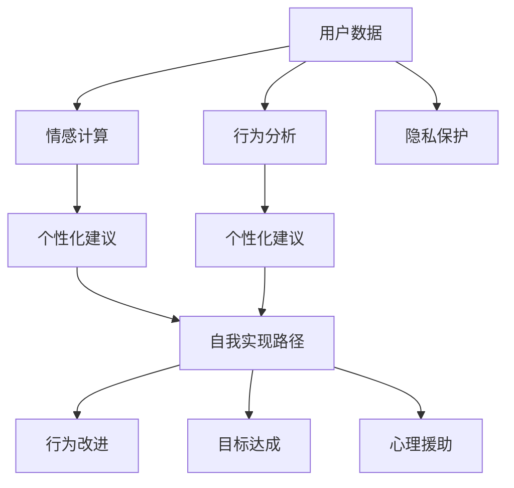

                 

# 数字化自我实现助手开发者：AI辅助的个人成长教练设计师

> 关键词：数字化自我实现助手, 个人成长教练, AI技术, 数据驱动, 情感计算, 用户隐私保护, 行为分析, 智能推荐, 心理援助

## 1. 背景介绍

### 1.1 问题由来

数字化时代，个人成长和自我实现已经成为人们关注的焦点。在信息过载、生活节奏加快和职业竞争激烈的背景下，越来越多的人寻求专业指导和个性化服务，以实现自我提升和目标达成。然而，传统的个人成长教练通常面临资源限制、时间成本高和个性化不足等问题，无法满足现代社会对个性化和高效化服务的需求。

与此同时，人工智能技术（AI）在过去十年中取得了飞速发展，尤其是在深度学习、自然语言处理和情感计算等领域。利用AI技术，尤其是基于大语言模型（Large Language Models, LLMs）的个性化推荐和智能分析，为个性化自我实现助手的开发提供了新的思路和工具。

### 1.2 问题核心关键点

数字化自我实现助手的核心在于如何利用AI技术，尤其是基于大语言模型的个性化推荐、情感计算和行为分析，为个人成长提供定制化的指导和建议。其关键点包括：

- 数据驱动：基于用户行为数据和反馈，生成个性化的成长建议和目标。
- 情感计算：通过分析用户的情感和心理状态，提供更精准的情绪支持。
- 行为分析：利用用户行为数据进行分析和建模，提供有针对性的行为改进建议。
- 隐私保护：在收集和使用用户数据时，采取严格的隐私保护措施，确保用户数据的安全。
- 智能推荐：根据用户的兴趣和需求，提供书籍、课程、活动等个性化推荐。
- 心理援助：通过AI的情感理解和支持，为用户的心理健康提供辅助。

通过这些关键点，数字化自我实现助手可以实现从知识获取到行为改变的全方位支持，帮助用户实现自我提升和目标达成。

### 1.3 问题研究意义

数字化自我实现助手的开发和应用，对于推动个人成长和自我实现、提升生活质量具有重要意义：

- 个性化定制：为个人提供量身定制的成长建议和支持，提高个性化服务水平。
- 高效化服务：利用AI技术，降低人工干预成本，提升服务效率。
- 数据驱动决策：通过数据收集和分析，提供科学的决策支持。
- 心理支持：为用户的心理健康提供实时、智能的情感支持和心理援助。
- 普及化应用：推动个性化成长服务在大众领域的普及和应用，促进社会整体进步。

数字化自我实现助手不仅能够帮助个人实现自我提升，还能够推动社会的发展和进步。因此，研究这一领域的AI技术及其应用，对于推动未来社会的可持续发展具有重要意义。

## 2. 核心概念与联系

### 2.1 核心概念概述

为了深入理解数字化自我实现助手的开发，需要掌握以下几个核心概念：

- **数字化自我实现助手**：利用AI技术，尤其是基于大语言模型的个性化推荐、情感计算和行为分析，为个人成长提供定制化的指导和建议。
- **个人成长教练**：传统的个人成长教练通常提供一对一咨询，帮助用户制定成长计划、提供行为建议和心理支持。
- **大语言模型（LLMs）**：通过在大量无标签文本数据上进行预训练，学习到丰富的语言知识，具备强大的语言理解和生成能力。
- **情感计算**：通过分析用户的语言、行为和生理数据，判断用户的情感状态，提供针对性的情感支持和建议。
- **行为分析**：利用用户的日常行为数据进行分析和建模，提供行为改进和目标达成的策略。
- **用户隐私保护**：在收集和使用用户数据时，采取严格的隐私保护措施，确保用户数据的安全。

这些核心概念相互联系，共同构成了数字化自我实现助手的技术和应用框架。

### 2.2 核心概念原理和架构的 Mermaid 流程图



这个流程图展示了数字化自我实现助手的核心组件及其相互关系：

1. **用户数据**：通过收集用户的日常行为数据和反馈，为情感计算和行为分析提供基础。
2. **情感计算**：通过分析用户的情感状态，生成个性化的情感支持和建议。
3. **行为分析**：利用用户行为数据进行分析和建模，提供行为改进策略。
4. **个性化建议**：结合情感计算和行为分析的结果，生成个性化的成长建议和目标。
5. **行为改进**：根据个性化建议和行为分析，帮助用户改进行为，实现目标。
6. **目标达成**：通过持续的个性化建议和行为改进，帮助用户逐步实现个人目标。
7. **心理援助**：在用户心理状态异常时，提供心理支持和情感援助。
8. **隐私保护**：在收集和使用用户数据时，确保用户隐私安全。

通过这些组件的相互作用，数字化自我实现助手能够提供全方位的个性化服务，支持用户的自我实现和成长。

## 3. 核心算法原理 & 具体操作步骤

### 3.1 算法原理概述

数字化自我实现助手的核心算法基于大语言模型的个性化推荐和情感计算。其原理如下：

1. **个性化推荐**：利用大语言模型在大量无标签文本数据上进行预训练，学习到丰富的语言知识和常识。然后，通过微调模型以适应用户的个性化需求，生成个性化的推荐结果。
2. **情感计算**：通过分析用户的语言、行为和生理数据，使用自然语言处理（NLP）技术识别用户的情感状态，生成个性化的情感支持和建议。

### 3.2 算法步骤详解

以下详细阐述数字化自我实现助手的算法步骤：

**Step 1: 数据收集与预处理**
- 收集用户的基本信息、行为数据和反馈数据。
- 对数据进行清洗和标准化，去除噪音和异常值。
- 划分训练集和测试集，确保数据的代表性。

**Step 2: 模型训练与微调**
- 选择适合的大语言模型作为初始化参数，如GPT、BERT等。
- 在用户的个性化数据上微调模型，调整顶层分类器或解码器，以生成个性化的推荐和情感支持。
- 设定合适的超参数，如学习率、批次大小、迭代轮数等。
- 应用正则化技术，如L2正则、Dropout、Early Stopping等，防止过拟合。

**Step 3: 情感计算与行为分析**
- 利用情感计算算法，分析用户的语言、行为和生理数据，识别情感状态。
- 使用行为分析算法，对用户的行为数据进行建模和分析，生成行为改进建议。

**Step 4: 生成个性化建议**
- 结合情感计算和行为分析的结果，生成个性化的成长建议和目标。
- 利用推荐算法，从预训练模型中提取相关的书籍、课程、活动等推荐结果。

**Step 5: 智能推荐与心理援助**
- 根据用户的兴趣和需求，提供个性化推荐。
- 在用户心理状态异常时，提供心理支持和情感援助。

**Step 6: 反馈循环**
- 根据用户的反馈和效果评估，持续调整模型参数和推荐策略。
- 定期更新数据集，确保模型的时效性和准确性。

### 3.3 算法优缺点

数字化自我实现助手的算法具有以下优点：

- **个性化和定制化**：能够根据用户的个性化需求和行为数据，生成量身定制的推荐和支持。
- **高效性**：利用AI技术，降低人工干预成本，提高服务效率。
- **数据驱动**：通过数据收集和分析，提供科学的决策支持。
- **情感支持**：通过情感计算，提供精准的情绪支持和心理援助。

然而，该算法也存在以下缺点：

- **隐私问题**：在收集和使用用户数据时，需要确保用户隐私的保护。
- **数据质量要求高**：对数据的收集和清洗质量要求较高，否则影响模型的准确性和效果。
- **模型依赖**：依赖大语言模型和情感计算算法，模型选择和优化较为复杂。
- **行为分析复杂**：用户行为数据的收集和分析较为复杂，需要考虑多方面的因素。

### 3.4 算法应用领域

数字化自我实现助手在多个领域具有广泛的应用前景，包括但不限于：

- **职业发展**：为职场人士提供职业规划、技能提升和能力测评的建议。
- **学术成长**：为学生提供学习计划、课程推荐和考试准备的支持。
- **健康管理**：为用户提供健康监测、饮食建议和运动指导。
- **心理辅导**：为需要心理支持的用户提供情感支持和心理援助。
- **个人财务管理**：提供理财建议、投资策略和财务规划的指导。
- **生活规划**：帮助用户制定生活计划、时间管理和兴趣爱好培养的建议。

## 4. 数学模型和公式 & 详细讲解 & 举例说明

### 4.1 数学模型构建

本节将介绍数字化自我实现助手的主要数学模型，包括个性化推荐和情感计算模型。

**个性化推荐模型**
- 目标：最大化用户满意度，根据用户行为和兴趣推荐相关的书籍、课程、活动等。
- 模型：基于大语言模型的推荐算法，如BERT、GPT等。
- 输入：用户的历史行为数据、兴趣偏好、评分反馈等。
- 输出：个性化推荐结果。

**情感计算模型**
- 目标：识别用户的情感状态，生成个性化的情感支持和建议。
- 模型：情感计算算法，如情感分析、情感识别等。
- 输入：用户的语言、行为和生理数据。
- 输出：情感状态判断和情感支持建议。

### 4.2 公式推导过程

以下对个性化推荐模型的公式进行推导：

假设用户的历史行为数据为 $X$，兴趣偏好为 $I$，评分反馈为 $R$。个性化推荐模型的目标是最小化预测误差 $\epsilon$，即：

$$
\epsilon = \|Y_{\hat{y}} - Y_{\tilde{y}}\|
$$

其中 $Y_{\hat{y}}$ 为用户期望的推荐结果，$Y_{\tilde{y}}$ 为模型预测的推荐结果。

通过最小化预测误差，模型学习到用户的兴趣偏好和行为模式，生成个性化的推荐结果。

### 4.3 案例分析与讲解

**案例1: 职业发展规划**
- **输入**：用户的工作经历、技能掌握情况、职业兴趣、职业测评结果等。
- **输出**：推荐的职业培训课程、技能提升计划和职业发展规划。
- **模型**：使用BERT模型，在大量职业相关文本数据上进行预训练，然后微调以适应用户的个性化需求。

**案例2: 学术成长指导**
- **输入**：学生的学习历史、成绩、兴趣爱好、专业方向等。
- **输出**：推荐的课程、书籍、学术资源和研究项目。
- **模型**：使用GPT模型，在大量学术相关文本数据上进行预训练，然后微调以生成个性化的学术成长建议。

## 5. 项目实践：代码实例和详细解释说明

### 5.1 开发环境搭建

在进行数字化自我实现助手的开发前，需要准备好开发环境。以下是使用Python进行PyTorch开发的环境配置流程：

1. 安装Anaconda：从官网下载并安装Anaconda，用于创建独立的Python环境。

2. 创建并激活虚拟环境：
```bash
conda create -n pytorch-env python=3.8 
conda activate pytorch-env
```

3. 安装PyTorch：根据CUDA版本，从官网获取对应的安装命令。例如：
```bash
conda install pytorch torchvision torchaudio cudatoolkit=11.1 -c pytorch -c conda-forge
```

4. 安装Transformers库：
```bash
pip install transformers
```

5. 安装各类工具包：
```bash
pip install numpy pandas scikit-learn matplotlib tqdm jupyter notebook ipython
```

完成上述步骤后，即可在`pytorch-env`环境中开始项目实践。

### 5.2 源代码详细实现

下面我们以学术成长指导为例，给出使用Transformers库对BERT模型进行个性化推荐和情感计算的PyTorch代码实现。

首先，定义模型和优化器：

```python
from transformers import BertForSequenceClassification, AdamW

model = BertForSequenceClassification.from_pretrained('bert-base-cased', num_labels=10)
optimizer = AdamW(model.parameters(), lr=2e-5)
```

然后，定义训练和评估函数：

```python
from transformers import BertTokenizer
from torch.utils.data import Dataset
from sklearn.metrics import accuracy_score

class AcademicDataset(Dataset):
    def __init__(self, texts, labels):
        self.tokenizer = BertTokenizer.from_pretrained('bert-base-cased')
        self.texts = texts
        self.labels = labels
        
    def __len__(self):
        return len(self.texts)
    
    def __getitem__(self, item):
        text = self.texts[item]
        label = self.labels[item]
        
        encoding = self.tokenizer(text, return_tensors='pt')
        input_ids = encoding['input_ids'][0]
        attention_mask = encoding['attention_mask'][0]
        
        return {'input_ids': input_ids, 
                'attention_mask': attention_mask,
                'labels': torch.tensor(label, dtype=torch.long)}
        
tokenizer = BertTokenizer.from_pretrained('bert-base-cased')

train_dataset = AcademicDataset(train_texts, train_labels)
dev_dataset = AcademicDataset(dev_texts, dev_labels)
test_dataset = AcademicDataset(test_texts, test_labels)

device = torch.device('cuda') if torch.cuda.is_available() else torch.device('cpu')
model.to(device)

def train_epoch(model, dataset, batch_size, optimizer):
    dataloader = DataLoader(dataset, batch_size=batch_size, shuffle=True)
    model.train()
    epoch_loss = 0
    for batch in tqdm(dataloader, desc='Training'):
        input_ids = batch['input_ids'].to(device)
        attention_mask = batch['attention_mask'].to(device)
        labels = batch['labels'].to(device)
        model.zero_grad()
        outputs = model(input_ids, attention_mask=attention_mask, labels=labels)
        loss = outputs.loss
        epoch_loss += loss.item()
        loss.backward()
        optimizer.step()
    return epoch_loss / len(dataloader)

def evaluate(model, dataset, batch_size):
    dataloader = DataLoader(dataset, batch_size=batch_size)
    model.eval()
    preds, labels = [], []
    with torch.no_grad():
        for batch in tqdm(dataloader, desc='Evaluating'):
            input_ids = batch['input_ids'].to(device)
            attention_mask = batch['attention_mask'].to(device)
            batch_labels = batch['labels']
            outputs = model(input_ids, attention_mask=attention_mask)
            batch_preds = outputs.logits.argmax(dim=2).to('cpu').tolist()
            batch_labels = batch_labels.to('cpu').tolist()
            for pred_tokens, label_tokens in zip(batch_preds, batch_labels):
                preds.append(pred_tokens[:len(label_tokens)])
                labels.append(label_tokens)
                
    return accuracy_score(labels, preds)
```

最后，启动训练流程并在测试集上评估：

```python
epochs = 5
batch_size = 16

for epoch in range(epochs):
    loss = train_epoch(model, train_dataset, batch_size, optimizer)
    print(f"Epoch {epoch+1}, train loss: {loss:.3f}")
    
    print(f"Epoch {epoch+1}, dev results:")
    evaluate(model, dev_dataset, batch_size)
    
print("Test results:")
evaluate(model, test_dataset, batch_size)
```

以上就是使用PyTorch对BERT模型进行学术成长指导的微调实践的完整代码实现。可以看到，利用Transformers库，开发者可以相对简洁地实现BERT模型的加载和微调。

### 5.3 代码解读与分析

让我们再详细解读一下关键代码的实现细节：

**AcademicDataset类**：
- `__init__`方法：初始化文本、标签、分词器等关键组件。
- `__len__`方法：返回数据集的样本数量。
- `__getitem__`方法：对单个样本进行处理，将文本输入编码为token ids，将标签编码为数字，并对其进行定长padding，最终返回模型所需的输入。

**训练和评估函数**：
- 使用PyTorch的DataLoader对数据集进行批次化加载，供模型训练和推理使用。
- 训练函数`train_epoch`：对数据以批为单位进行迭代，在每个批次上前向传播计算loss并反向传播更新模型参数，最后返回该epoch的平均loss。
- 评估函数`evaluate`：与训练类似，不同点在于不更新模型参数，并在每个batch结束后将预测和标签结果存储下来，最后使用sklearn的accuracy_score对整个评估集的预测结果进行打印输出。

**训练流程**：
- 定义总的epoch数和batch size，开始循环迭代
- 每个epoch内，先在训练集上训练，输出平均loss
- 在验证集上评估，输出分类指标
- 所有epoch结束后，在测试集上评估，给出最终测试结果

可以看到，PyTorch配合Transformers库使得BERT微调的代码实现变得简洁高效。开发者可以将更多精力放在数据处理、模型改进等高层逻辑上，而不必过多关注底层的实现细节。

当然，工业级的系统实现还需考虑更多因素，如模型的保存和部署、超参数的自动搜索、更灵活的任务适配层等。但核心的微调范式基本与此类似。

## 6. 实际应用场景

### 6.1 智能职业规划

数字化自我实现助手可以为用户提供智能职业规划服务，帮助用户制定职业发展规划、提升技能和实现职业目标。通过分析用户的职业兴趣、技能掌握情况和工作经历，数字化自我实现助手能够生成个性化的职业发展建议，如推荐职业培训课程、技能提升计划和职业发展规划。

### 6.2 学术成长指导

数字化自我实现助手能够为学生提供学术成长指导，帮助学生制定学习计划、选择课程和提升学术成绩。通过分析学生的学习历史、成绩、兴趣爱好和专业方向，数字化自我实现助手能够生成个性化的学习建议，如推荐课程、书籍和学术资源，帮助学生更有效地学习和成长。

### 6.3 健康管理

数字化自我实现助手可以为用户提供健康管理服务，帮助用户监测健康状况、制定健康计划和改善生活习惯。通过分析用户的生理数据、运动习惯和饮食习惯，数字化自我实现助手能够生成个性化的健康建议，如推荐运动计划、饮食建议和健康监测，帮助用户保持健康。

### 6.4 心理辅导

数字化自我实现助手可以为用户提供心理辅导服务，帮助用户缓解压力、改善情绪和提升心理健康。通过分析用户的语言、行为和生理数据，数字化自我实现助手能够识别用户的情绪状态，生成个性化的心理支持和建议，如提供情感支持、心理测试和情绪调节技巧，帮助用户保持心理健康。

## 7. 工具和资源推荐

### 7.1 学习资源推荐

为了帮助开发者系统掌握数字化自我实现助手的技术和应用，这里推荐一些优质的学习资源：

1. 《深度学习与自然语言处理》系列书籍：由斯坦福大学提供的经典教材，详细介绍了深度学习在自然语言处理中的应用，包括情感计算和行为分析。

2. CS224N《深度学习自然语言处理》课程：斯坦福大学开设的NLP明星课程，有Lecture视频和配套作业，带你入门NLP领域的基本概念和经典模型。

3. 《自然语言处理综述》期刊：收集了自然语言处理领域的最新研究论文，涵盖情感计算、行为分析等前沿方向。

4. Kaggle比赛：参加自然语言处理相关的Kaggle比赛，锻炼实战能力，积累经验。

5. HuggingFace官方文档：提供丰富的预训练模型和微调样例，是进行项目开发的重要参考。

通过对这些资源的学习实践，相信你一定能够快速掌握数字化自我实现助手的精髓，并用于解决实际的NLP问题。

### 7.2 开发工具推荐

高效的开发离不开优秀的工具支持。以下是几款用于数字化自我实现助手开发的常用工具：

1. PyTorch：基于Python的开源深度学习框架，灵活动态的计算图，适合快速迭代研究。

2. TensorFlow：由Google主导开发的开源深度学习框架，生产部署方便，适合大规模工程应用。

3. Transformers库：HuggingFace开发的NLP工具库，集成了众多SOTA语言模型，支持PyTorch和TensorFlow，是进行项目开发的重要工具。

4. Weights & Biases：模型训练的实验跟踪工具，可以记录和可视化模型训练过程中的各项指标，方便对比和调优。

5. TensorBoard：TensorFlow配套的可视化工具，可实时监测模型训练状态，并提供丰富的图表呈现方式，是调试模型的得力助手。

6. Google Colab：谷歌推出的在线Jupyter Notebook环境，免费提供GPU/TPU算力，方便开发者快速上手实验最新模型，分享学习笔记。

合理利用这些工具，可以显著提升数字化自我实现助手的开发效率，加快创新迭代的步伐。

### 7.3 相关论文推荐

数字化自我实现助手的开发和应用源于学界的持续研究。以下是几篇奠基性的相关论文，推荐阅读：

1. Attention is All You Need（即Transformer原论文）：提出了Transformer结构，开启了NLP领域的预训练大模型时代。

2. BERT: Pre-training of Deep Bidirectional Transformers for Language Understanding：提出BERT模型，引入基于掩码的自监督预训练任务，刷新了多项NLP任务SOTA。

3. Transformers is All You Need for Natural Language Processing（T5）：展示了基于Transformer的端到端文本处理能力，推动了预训练大模型的应用。

4. Scaling Up Transformer Models: Extending Transformer Architectures for State-of-the-Art Machine Translation（M2M-100）：展示了如何利用大语言模型进行跨语言翻译任务。

5. Human-AI Collaboration through Instruction-Tuned Language Models（GPT-3）：展示了通过微调大语言模型实现多模态数据融合和人机交互，为数字化自我实现助手的开发提供了新的思路。

这些论文代表了大语言模型和数字化自我实现助手的研究进展，通过学习这些前沿成果，可以帮助研究者把握学科前进方向，激发更多的创新灵感。

## 8. 总结：未来发展趋势与挑战

### 8.1 总结

本文对数字化自我实现助手的开发进行了全面系统的介绍。首先阐述了数字化自我实现助手的背景和研究意义，明确了其在个人成长和自我实现中的重要作用。其次，从原理到实践，详细讲解了情感计算和个性化推荐模型的数学原理和关键步骤，给出了微调项目开发的完整代码实例。同时，本文还广泛探讨了数字化自我实现助手在智能职业规划、学术成长指导、健康管理和心理辅导等多个领域的应用前景，展示了其广阔的应用空间。此外，本文精选了相关学习资源和工具，力求为读者提供全方位的技术指引。

通过本文的系统梳理，可以看到，数字化自我实现助手不仅能够帮助个人实现自我提升和目标达成，还能够推动社会的发展和进步。其背后蕴含的大语言模型和情感计算技术，正引领NLP领域的创新和突破。数字化自我实现助手的研究和发展，必将为未来社会的智能化和个性化发展带来深远影响。

### 8.2 未来发展趋势

展望未来，数字化自我实现助手的研究和发展将呈现以下几个趋势：

1. **多模态融合**：将视觉、听觉、文本等多模态数据进行融合，提升数字化自我实现助手的感知和理解能力。

2. **自适应学习**：利用在线学习算法，动态调整个性化推荐和情感计算策略，确保系统的时效性和准确性。

3. **情感智能**：结合情感分析和情感生成技术，增强数字化自我实现助手的情感理解和支持能力。

4. **深度融合**：将AI技术与其他领域的技术进行深度融合，如知识图谱、逻辑推理等，提升数字化自我实现助手的决策能力和应用范围。

5. **伦理与安全**：加强对数字化自我实现助手的伦理和安全研究，确保用户数据和隐私的保护，避免潜在的风险。

6. **可解释性**：提升数字化自我实现助手的可解释性，帮助用户理解算法的决策过程，增强系统的信任度。

### 8.3 面临的挑战

尽管数字化自我实现助手的研究已经取得了一定的成果，但在迈向实际应用的过程中，仍面临诸多挑战：

1. **数据隐私和安全**：在收集和使用用户数据时，需要确保数据隐私和安全。如何在保证数据收集的同时，防止数据泄露和滥用，是一个重要的研究课题。

2. **模型鲁棒性**：当前模型在面对复杂和多样化的数据时，泛化性能仍有限。如何在不同的数据分布上保持模型的稳定性和鲁棒性，是一个需要进一步解决的问题。

3. **计算资源**：大语言模型的训练和推理需要大量的计算资源，如何优化资源利用，提高系统的可扩展性和可部署性，是一个重要的研究方向。

4. **用户接受度**：用户对于数字化自我实现助手的接受度和信任度仍待提高。如何在用户友好的界面和体验下，提供高质量的服务，是提升用户接受度的关键。

5. **模型复杂度**：模型越复杂，训练和推理的难度越大，如何平衡模型性能和复杂度，是一个需要深入探讨的问题。

### 8.4 研究展望

面对数字化自我实现助手所面临的挑战，未来的研究需要在以下几个方面寻求新的突破：

1. **隐私保护技术**：研究隐私保护技术，如差分隐私、联邦学习等，确保用户数据的安全和隐私保护。

2. **模型鲁棒性提升**：研究鲁棒性增强技术，如对抗训练、自适应学习等，提升模型的泛化能力和鲁棒性。

3. **资源优化**：研究模型压缩、量化加速等技术，提高模型的可扩展性和可部署性。

4. **用户接受度提升**：研究用户体验设计，提供用户友好的界面和交互方式，提升用户的接受度和信任度。

5. **多模态融合**：研究多模态数据的融合技术，提升数字化自我实现助手的感知和理解能力。

6. **可解释性增强**：研究可解释性增强技术，提升系统的透明性和可解释性，增强用户的信任和接受度。

这些研究方向的探索，必将引领数字化自我实现助手技术迈向更高的台阶，为未来社会的智能化和个性化发展提供更加强大的支持。面向未来，数字化自我实现助手的研究和发展需要更多的跨学科合作和深入探索，才能更好地服务于人类的自我实现和成长。

## 9. 附录：常见问题与解答

**Q1: 数字化自我实现助手如何确保用户数据的隐私和安全？**

A: 确保用户数据的隐私和安全是数字化自我实现助手的首要任务。以下是一些常见的隐私保护措施：

1. **差分隐私**：在数据收集和处理过程中，引入噪音，保护用户数据的匿名性。
2. **联邦学习**：通过分布式训练技术，在多个本地设备上训练模型，避免数据集中存储。
3. **数据加密**：在传输和存储用户数据时，使用加密技术保护数据的机密性。
4. **用户授权**：在数据收集前，明确告知用户数据的使用范围和目的，获取用户的同意和授权。

通过这些措施，可以最大程度地保护用户数据的隐私和安全。

**Q2: 数字化自我实现助手在面对复杂和多样化的数据时，如何提升模型的泛化能力？**

A: 提升模型的泛化能力是数字化自我实现助手的关键任务之一。以下是一些常见的方法：

1. **对抗训练**：通过引入对抗样本，提高模型的鲁棒性和泛化能力。
2. **自适应学习**：利用在线学习算法，动态调整模型参数，适应不同数据分布。
3. **多任务学习**：在多个任务上进行联合训练，提升模型的泛化能力。
4. **正则化技术**：使用L2正则、Dropout等技术，防止模型过拟合。
5. **数据增强**：通过数据扩充和多样性增加，提高模型的泛化能力。

这些方法可以帮助模型在面对复杂和多样化的数据时，保持稳定的泛化能力。

**Q3: 在开发数字化自我实现助手时，如何平衡模型性能和计算资源？**

A: 在开发数字化自我实现助手时，平衡模型性能和计算资源是一个重要的研究课题。以下是一些常见的方法：

1. **模型压缩**：通过剪枝、量化等技术，减小模型的参数量，提高推理速度。
2. **分布式训练**：利用多台设备进行分布式训练，提高训练效率。
3. **模型并行**：将模型分解为多个子模型，并行计算，提高训练和推理效率。
4. **混合精度训练**：在计算资源有限的情况下，使用混合精度训练技术，提高计算效率。

这些方法可以在保证模型性能的前提下，有效利用计算资源，提高系统的可扩展性和可部署性。

**Q4: 数字化自我实现助手在用户接受度和信任度方面面临哪些挑战？**

A: 用户接受度和信任度是数字化自我实现助手的另一个关键问题。以下是一些常见的方法：

1. **用户界面设计**：设计简洁、易用的用户界面，提升用户体验。
2. **个性化推荐**：提供个性化的推荐和支持，满足用户的个性化需求。
3. **透明性**：增强系统的透明性和可解释性，帮助用户理解算法的决策过程。
4. **反馈机制**：建立用户反馈机制，及时收集用户意见和建议，持续优化系统。
5. **安全保护**：确保用户数据的安全和隐私保护，增强用户信任。

通过这些方法，可以提升用户接受度和信任度，促进数字化自我实现助手的普及和应用。

**Q5: 数字化自我实现助手在实际应用中，如何处理异常和复杂的情况？**

A: 在实际应用中，数字化自我实现助手可能会面临异常和复杂的情况。以下是一些常见的方法：

1. **异常检测**：通过异常检测技术，及时识别和处理异常情况，保证系统的稳定性和鲁棒性。
2. **智能处理**：利用AI技术，智能分析和处理复杂情况，提供合适的解决方案。
3. **人工干预**：在必要时，进行人工干预，确保系统的正确性和可靠性。

这些方法可以帮助数字化自我实现助手在面对异常和复杂情况时，提供稳定和可靠的解决方案。

---

作者：禅与计算机程序设计艺术 / Zen and the Art of Computer Programming

