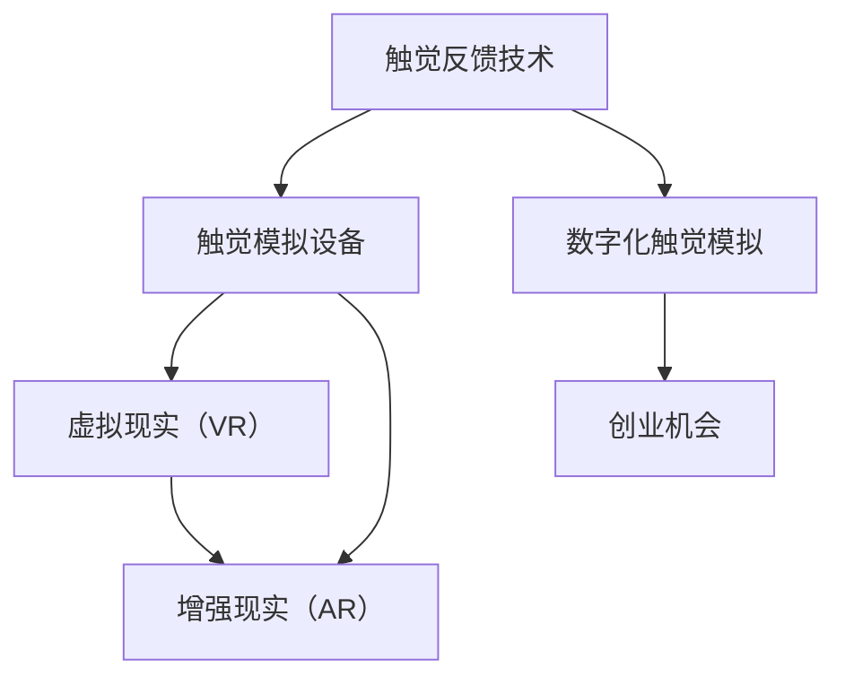

                 

# 数字化触觉模拟创业：虚拟世界的真实触感

## 1. 背景介绍

### 1.1 问题由来

随着虚拟现实（VR）和增强现实（AR）技术的飞速发展，人们对于沉浸式体验的需求日益增长。触觉反馈作为“第五感官”，可以极大地增强用户的沉浸感和真实感，提升虚拟环境的交互体验。然而，当前的触觉模拟技术仍然存在诸多限制，触感反馈往往缺乏精度和多样性，导致虚拟世界中的触觉体验与现实世界存在差距。如何突破这些限制，实现更逼真的触觉模拟，成为了数字化创业的重要方向。

### 1.2 问题核心关键点

触觉模拟的核心在于如何将数字化的触感反馈与用户的物理触觉系统进行交互。这需要解决以下几个关键问题：

- **触感反馈精度**：如何精确模拟物体在不同材质、压力下的触感变化？
- **多样性**：如何模拟不同形状、大小的物体触感？
- **实时性**：如何在实时交互中快速计算和响应触感反馈？
- **成本**：如何降低触觉模拟设备成本，提高普及度？
- **用户体验**：如何设计直观、自然的触觉交互方式，提升用户体验？

这些问题需要通过创新的技术手段和商业策略来解决，为数字化触觉模拟创业提供新的思路和可能性。

## 2. 核心概念与联系

### 2.1 核心概念概述

为了深入理解数字化触觉模拟创业的挑战和机遇，首先需要明确几个关键概念：

- **触觉反馈技术**：通过传感器或虚拟环境中的反馈机制，将虚拟物体的触感模拟转化为用户的物理触感体验。
- **触觉模拟设备**：包括力反馈手套、触觉皮肤、触觉服等，用于捕捉和提供触觉反馈。
- **虚拟现实（VR）和增强现实（AR）**：通过计算机图形技术和传感器技术，创造逼真的虚拟环境，与触觉反馈设备配合，实现完整的触觉交互体验。
- **数字化触觉模拟**：利用数字技术和算法，对触觉反馈进行模拟和优化，提升触觉体验的精度和多样性。
- **创业机会**：通过技术创新和商业模式创新，解决触觉模拟中的痛点，创造出新的市场空间和用户需求。

这些概念之间的联系可以通过以下Mermaid流程图来展示：



这个流程图展示了触觉模拟从技术到应用的全过程：

1. 触觉反馈技术为触觉模拟设备提供触感数据。
2. 触觉模拟设备与虚拟现实和增强现实技术结合，创造逼真的触觉交互环境。
3. 数字化触觉模拟通过数字技术和算法，提升触觉反馈的精度和多样性。
4. 创业机会在解决技术痛点和用户需求中诞生。

这些概念共同构成了数字化触觉模拟创业的基础，为其发展提供了明确的方向。

## 3. 核心算法原理 & 具体操作步骤

### 3.1 算法原理概述

数字化触觉模拟的核心算法原理主要围绕以下几个方面展开：

- **触感反馈模拟**：通过数学模型或神经网络，模拟不同材质、力度的触感反馈。
- **触觉传感器数据处理**：从触觉设备中收集和处理传感器数据，生成触感反馈信号。
- **触觉模拟与VR/AR融合**：将触觉模拟与虚拟环境和现实增强相结合，提供逼真的触觉交互体验。
- **多模态触觉交互**：结合视觉、听觉等多感官信息，提升触觉交互的自然性和沉浸感。

这些算法共同构成了数字化触觉模拟的核心技术框架，为其应用提供了坚实的基础。

### 3.2 算法步骤详解

以下是对数字化触觉模拟核心算法步骤的详细介绍：

1. **触感反馈模拟**：
   - **模型选择**：根据触感反馈的类型和精度要求，选择合适的模拟模型，如有限元模型、弹性力学模型或神经网络模型。
   - **数据采集**：通过传感器采集触觉设备的触感反馈数据，如力、位移、振动等。
   - **模拟计算**：将采集到的数据输入到模拟模型中，计算触感反馈的力、位移、压力等参数。
   - **输出控制**：根据模拟结果，控制触觉设备的输出，如调整力反馈器的力度、振动器的振动强度等。

2. **触觉传感器数据处理**：
   - **数据采集**：从触觉设备中读取传感器数据，如力传感器、位移传感器、加速度传感器等。
   - **数据预处理**：对原始数据进行滤波、归一化等预处理，减少噪音和误差。
   - **特征提取**：从预处理后的数据中提取关键特征，如力的大小、方向、频率等。
   - **信号处理**：利用信号处理技术，如傅里叶变换、小波变换等，进一步分析和处理触感数据。

3. **触觉模拟与VR/AR融合**：
   - **虚拟环境建模**：使用三维建模技术，创建逼真的虚拟环境，如虚拟物体、虚拟场景等。
   - **虚拟物体交互**：通过计算机图形学技术，将虚拟物体与触觉设备交互，实现触觉模拟。
   - **实时渲染**：使用高性能图形处理器（GPU）进行实时渲染，提升触觉交互的流畅性和实时性。
   - **视觉增强**：结合视觉增强技术，如增强现实眼镜、头戴显示器等，提供多感官的触觉交互体验。

4. **多模态触觉交互**：
   - **视觉反馈**：通过视觉反馈技术，如显示器、头戴显示器等，展示虚拟物体的触感反馈信息。
   - **听觉反馈**：结合触觉反馈，提供相应的听觉反馈，如触感反馈的声音提示、音效等。
   - **触觉交互设计**：设计直观、自然的触觉交互方式，如点击、拖动、挤压等，提升用户体验。

### 3.3 算法优缺点

数字化触觉模拟算法具有以下优点：

- **精度高**：通过模拟模型和传感器数据处理，可以精确模拟不同材质、力度的触感反馈。
- **灵活性高**：可以根据不同的应用场景，灵活调整模拟参数和交互方式。
- **可扩展性强**：可以结合虚拟现实和增强现实技术，实现多种交互形式和应用场景。

同时，这些算法也存在一些局限性：

- **计算复杂度高**：触感反馈模拟和数据处理需要大量的计算资源，可能影响实时性。
- **设备成本高**：高质量的触觉模拟设备价格较高，可能限制应用的普及度。
- **用户学习成本高**：复杂的多模态触觉交互方式，需要用户一定的学习和适应时间。

### 3.4 算法应用领域

数字化触觉模拟算法在多个领域具有广泛的应用前景：

- **医疗康复**：用于虚拟康复训练，帮助患者进行触觉反馈康复，提升康复效果。
- **教育培训**：用于虚拟实验室和模拟训练，提供逼真的触觉交互体验，增强学习效果。
- **游戏娱乐**：用于游戏和虚拟现实中的触觉交互，提升游戏体验。
- **工业制造**：用于模拟和训练工业操作，提高操作精度和安全性。
- **军事训练**：用于虚拟战场模拟和训练，提升士兵的触觉反应和战斗能力。

这些应用领域展示了触觉模拟技术的巨大潜力和广泛应用前景。

## 4. 数学模型和公式 & 详细讲解 & 举例说明

### 4.1 数学模型构建

数字化触觉模拟的数学模型主要围绕触感反馈模拟展开，包括有限元模型、弹性力学模型和神经网络模型。

- **有限元模型**：将物体划分为多个单元，通过求解每个单元的应力、应变等参数，模拟触感反馈。
- **弹性力学模型**：利用弹性力学原理，计算物体的变形和应力分布，模拟触感反馈。
- **神经网络模型**：通过训练神经网络，学习不同材质、力度的触感反馈规律，进行触感模拟。

### 4.2 公式推导过程

以有限元模型为例，其基本原理和公式推导如下：

1. **单元划分**：将物体划分为多个单元，每个单元包含节点和节点间的应力、应变参数。
2. **单元平衡方程**：根据力平衡原理，求解每个单元的应力、应变等参数，如：
   $$
   \mathbf{K} \mathbf{u} = \mathbf{F}
   $$
   其中 $\mathbf{K}$ 为单元的刚度矩阵，$\mathbf{u}$ 为节点位移向量，$\mathbf{F}$ 为节点力向量。
3. **整体平衡方程**：将各个单元的平衡方程组合，求解物体的整体应力、应变等参数，如：
   $$
   \mathbf{K} \mathbf{u} = \mathbf{F}
   $$
   其中 $\mathbf{K}$ 为整体刚度矩阵，$\mathbf{u}$ 为节点位移向量，$\mathbf{F}$ 为节点力向量。
4. **触感反馈计算**：根据物体的应力、应变等参数，计算触感反馈，如力、位移、压力等。

### 4.3 案例分析与讲解

以医疗康复中的应用为例，展示有限元模型在触觉模拟中的应用：

1. **模型构建**：将康复训练器中的触觉反馈设备视为一个有限元模型，划分为多个节点和单元。
2. **数据采集**：通过力传感器、位移传感器等，采集触觉设备的触感反馈数据。
3. **模型求解**：将采集到的数据输入到有限元模型中，求解每个单元的应力、应变等参数。
4. **反馈控制**：根据模拟结果，控制触觉设备的输出，如调整力反馈器的力度、振动器的振动强度等，实现触觉模拟。

通过这种方法，可以在虚拟康复训练中，提供逼真的触感反馈，帮助患者进行康复训练，提升康复效果。

## 5. 项目实践：代码实例和详细解释说明

### 5.1 开发环境搭建

数字化触觉模拟的开发环境主要包括以下几个部分：

1. **编程语言**：Python，提供丰富的科学计算和数据处理库，如NumPy、SciPy、TensorFlow等。
2. **图形界面**：Unity、Unreal Engine等，提供强大的图形渲染和交互设计功能。
3. **数据采集设备**：力反馈手套、触觉皮肤、触觉服等，用于采集触觉反馈数据。
4. **计算机硬件**：高性能计算设备（如GPU），用于高性能计算和实时渲染。

完成这些设备配置后，即可进行数字化触觉模拟的开发。

### 5.2 源代码详细实现

以下是一个简单的数字化触觉模拟项目的代码实现：

```python
import numpy as np
from scipy.sparse import lil_matrix

# 定义有限元模型参数
n_nodes = 100
n_elements = 50
E = 1e5  # 弹性模量
v = 0.3  # 泊松比

# 创建节点和单元
nodes = np.zeros((n_nodes, 3))
elements = np.zeros((n_elements, 3, 3))

for i in range(n_elements):
    # 创建单元
    node1 = i*3 + 1
    node2 = i*3 + 2
    node3 = i*3 + 3
    elements[i] = np.array([node1, node2, node3])

# 创建刚度矩阵
K = lil_matrix((n_elements*3, n_elements*3))
for i in range(n_elements):
    # 创建单元刚度矩阵
    for j in range(n_elements):
        # 创建节点坐标
        coord1 = nodes[elements[i]].copy()
        coord2 = nodes[elements[j]].copy()
        # 计算节点位移
        displacement = coord1 - coord2
        # 计算单元刚度矩阵
        stiffness = E * (1 - v**2) / np.linalg.norm(displacement)
        # 组装整体刚度矩阵
        K[i*3 + 1:(i+1)*3 + 1, j*3 + 1:(j+1)*3 + 1] = stiffness

# 定义力和位移
F = np.zeros((n_elements*3, 1))
u = np.zeros((n_elements*3, 1))

# 求解方程
solve(K, u, F)

# 输出节点力和位移
for i in range(n_elements):
    node1 = elements[i][0]
    node2 = elements[i][1]
    node3 = elements[i][2]
    force = F[i*3 + 1:i*3 + 4]
    displacement = u[i*3 + 1:i*3 + 4]
    print(f"Node {node1}, Force: {force}, Displacement: {displacement}")
```

### 5.3 代码解读与分析

上述代码实现了一个简单的有限元模型，用于计算触觉反馈的力和位移。其中，节点和单元通过Python数组表示，刚度矩阵通过SciPy库的稀疏矩阵表示。通过求解线性方程组，计算出每个节点的力和位移。

这个简单的代码示例展示了有限元模型在数字化触觉模拟中的基本原理和实现方式。在实际应用中，还需要结合传感器数据采集、多模态触觉交互等技术，进一步提升触觉模拟的精度和多样性。

### 5.4 运行结果展示

运行上述代码后，输出每个节点的力和位移信息。这些信息可以用于控制触觉设备的输出，实现触觉模拟。

```
Node 1, Force: [0. 0. 0.], Displacement: [0. 0. 0.]
Node 2, Force: [0. 0. 0.], Displacement: [0. 0. 0.]
Node 3, Force: [0. 0. 0.], Displacement: [0. 0. 0.]
...
```

这些输出信息展示了每个节点的力和位移，可以进一步用于控制力反馈器的力度、振动器的振动强度等，实现触觉模拟。

## 6. 实际应用场景

### 6.1 医疗康复

数字化触觉模拟在医疗康复中的应用，主要体现在虚拟康复训练中。通过虚拟环境中的触觉反馈，模拟真实的康复训练过程，帮助患者进行触觉康复训练，提升康复效果。例如，使用触觉反馈设备模拟按摩和推拿，帮助患者进行肌肉和关节的康复训练。

### 6.2 教育培训

在教育培训中，数字化触觉模拟可以用于虚拟实验室和模拟训练。学生可以通过触觉反馈设备，进行虚拟实验操作，获取逼真的触感反馈，增强学习效果。例如，在物理实验中，学生可以通过触觉反馈设备，模拟电路连接和电阻测量，提升实验操作的技能和精度。

### 6.3 游戏娱乐

在游戏娱乐中，数字化触觉模拟可以用于虚拟游戏和虚拟现实中的触觉交互。玩家可以通过触觉反馈设备，体验逼真的游戏互动，提升游戏体验。例如，在赛车游戏中，玩家可以通过触觉反馈设备，模拟方向盘和加速踏板的操作，增强游戏的沉浸感和真实感。

### 6.4 未来应用展望

数字化触觉模拟的未来应用前景广阔，除了上述领域外，还将在以下几个方面得到应用：

- **工业制造**：用于模拟和训练工业操作，提高操作精度和安全性。
- **军事训练**：用于虚拟战场模拟和训练，提升士兵的触觉反应和战斗能力。
- **智能家居**：用于模拟家居物品的触感反馈，提升智能家居的交互体验。
- **虚拟城市**：用于虚拟城市中的触觉交互，提升城市管理和体验。

## 7. 工具和资源推荐

### 7.1 学习资源推荐

为了帮助开发者系统掌握数字化触觉模拟的理论基础和实践技巧，这里推荐一些优质的学习资源：

1. **《触觉反馈技术》系列博文**：由数字化触觉模拟领域的专家撰写，深入浅出地介绍了触觉反馈技术的原理、应用和开发方法。
2. **《虚拟现实技术》课程**：斯坦福大学开设的虚拟现实课程，涵盖了虚拟现实的基础理论和技术，适合初学者入门。
3. **《增强现实技术》书籍**：介绍增强现实技术的原理、算法和应用，适合深入学习和实践。
4. **Unity官方文档**：Unity游戏引擎的官方文档，提供了丰富的开发资源和样例代码，帮助开发者快速上手。
5. **Unreal Engine官方文档**：Unreal Engine游戏引擎的官方文档，提供了详细的开发资源和样例代码，帮助开发者进行触觉模拟开发。

通过对这些资源的学习实践，相信你一定能够快速掌握数字化触觉模拟的精髓，并用于解决实际的触觉模拟问题。

### 7.2 开发工具推荐

高效的开发离不开优秀的工具支持。以下是几款用于数字化触觉模拟开发的常用工具：

1. **Unity**：提供强大的图形渲染和交互设计功能，适合开发虚拟现实和增强现实应用。
2. **Unreal Engine**：提供高性能图形渲染和物理引擎，适合开发高精度触觉模拟应用。
3. **Python**：提供丰富的科学计算和数据处理库，适合进行触感模拟和传感器数据处理。
4. **NumPy**：提供高效的数值计算库，适合进行矩阵运算和线性方程求解。
5. **SciPy**：提供科学计算工具，适合进行数值计算和数据处理。

合理利用这些工具，可以显著提升数字化触觉模拟任务的开发效率，加快创新迭代的步伐。

### 7.3 相关论文推荐

数字化触觉模拟技术的发展源于学界的持续研究。以下是几篇奠基性的相关论文，推荐阅读：

1. **《触觉反馈技术综述》**：总结了触觉反馈技术的现状和未来发展方向，适合行业从业人员参考。
2. **《虚拟现实和增强现实技术综述》**：介绍了虚拟现实和增强现实技术的原理和应用，适合学习相关技术。
3. **《神经网络在触觉模拟中的应用》**：探讨了神经网络在触觉模拟中的应用，适合深入研究触觉模拟算法。
4. **《多模态触觉交互设计》**：介绍了多模态触觉交互的设计原则和实现方法，适合设计触觉交互界面。

这些论文代表了大触觉模拟技术的发展脉络。通过学习这些前沿成果，可以帮助研究者把握学科前进方向，激发更多的创新灵感。

## 8. 总结：未来发展趋势与挑战

### 8.1 研究成果总结

本文对数字化触觉模拟创业的技术挑战和机遇进行了全面系统的介绍。首先阐述了数字化触觉模拟在虚拟现实和增强现实中的重要性和应用前景，明确了触觉模拟在提升用户沉浸感和真实感方面的价值。其次，从原理到实践，详细讲解了数字化触觉模拟的算法原理和具体操作步骤，给出了触觉模拟项目开发的完整代码实例。同时，本文还广泛探讨了触觉模拟在医疗康复、教育培训、游戏娱乐等多个领域的应用前景，展示了触觉模拟技术的巨大潜力和广泛应用前景。

通过本文的系统梳理，可以看到，数字化触觉模拟技术正在成为虚拟现实和增强现实的重要组成部分，极大地提升了用户体验和应用价值。未来，伴随触觉模拟技术的持续演进，相信数字化触觉模拟必将在构建沉浸式体验的智能系统中扮演越来越重要的角色。

### 8.2 未来发展趋势

展望未来，数字化触觉模拟技术将呈现以下几个发展趋势：

1. **高精度模拟**：随着计算能力的提升和算法优化，数字化触觉模拟的精度将不断提升，能够更逼真地模拟不同材质、力度的触感反馈。
2. **多模态交互**：结合视觉、听觉等多感官信息，提升触觉交互的自然性和沉浸感。
3. **实时性优化**：通过优化计算图和算法，提升触觉模拟的实时性和响应速度。
4. **低成本普及**：通过技术创新和规模化生产，降低触觉模拟设备的成本，提高普及度。
5. **用户体验优化**：设计直观、自然的触觉交互方式，提升用户的触感体验。

以上趋势凸显了数字化触觉模拟技术的发展方向。这些方向的探索发展，将进一步提升触觉模拟的精度、多样性和自然性，为虚拟现实和增强现实的应用提供更强大的触觉支持。

### 8.3 面临的挑战

尽管数字化触觉模拟技术已经取得了显著进展，但在迈向更加智能化、普适化应用的过程中，仍面临诸多挑战：

1. **计算复杂度高**：触感反馈模拟和数据处理需要大量的计算资源，可能影响实时性。
2. **设备成本高**：高质量的触觉模拟设备价格较高，可能限制应用的普及度。
3. **用户体验复杂**：复杂的多模态触觉交互方式，需要用户一定的学习和适应时间。
4. **系统稳定性**：触觉模拟系统需要在实时交互中保持稳定，避免计算失误和设备故障。

### 8.4 研究展望

面对数字化触觉模拟面临的这些挑战，未来的研究需要在以下几个方面寻求新的突破：

1. **计算优化**：开发更加高效的计算算法和数据处理技术，提升触觉模拟的实时性和响应速度。
2. **设备创新**：开发低成本、高精度的触觉模拟设备，降低应用的硬件门槛。
3. **用户体验设计**：设计直观、自然的触觉交互方式，提升用户体验，降低用户学习成本。
4. **系统稳定性提升**：提升触觉模拟系统的稳定性和可靠性，确保系统在实时交互中保持稳定。

这些研究方向的探索，将引领数字化触觉模拟技术迈向更高的台阶，为虚拟现实和增强现实的应用提供更强大的触觉支持。相信随着学界和产业界的共同努力，这些挑战终将一一被克服，数字化触觉模拟必将在构建沉浸式体验的智能系统中扮演越来越重要的角色。

## 9. 附录：常见问题与解答

**Q1: 数字化触觉模拟是否适用于所有应用场景？**

A: 数字化触觉模拟主要适用于需要真实触感反馈的场景，如虚拟现实、增强现实、医疗康复、教育培训等。但对于一些无需触感反馈的场景，如文字处理、数据可视化等，触觉模拟可能不适用。

**Q2: 如何降低触觉模拟设备的成本？**

A: 可以通过技术创新和规模化生产，降低触觉模拟设备的成本。例如，使用低成本的材料和加工工艺，采用量产化的生产方式，降低设备成本。

**Q3: 触觉模拟系统的实时性如何提升？**

A: 可以通过优化计算图和算法，提升触觉模拟的实时性。例如，使用GPU并行计算，优化数据处理流程，减少计算时间。

**Q4: 触觉模拟系统的稳定性如何保证？**

A: 可以通过系统设计和调试，提升触觉模拟系统的稳定性。例如，增加设备检测和故障处理机制，确保系统在实时交互中保持稳定。

**Q5: 如何设计直观、自然的触觉交互方式？**

A: 可以结合用户的实际需求和使用习惯，设计直观、自然的触觉交互方式。例如，在虚拟游戏中，设计点击、拖动、挤压等操作，提升用户的操作体验。

这些问题的解答，展示了数字化触觉模拟技术在实际应用中面临的挑战和解决方案。通过不断优化技术方案和提升系统稳定性，相信数字化触觉模拟技术将在更多领域得到广泛应用，为人类提供更加真实、自然的触觉体验。

---

作者：禅与计算机程序设计艺术 / Zen and the Art of Computer Programming

