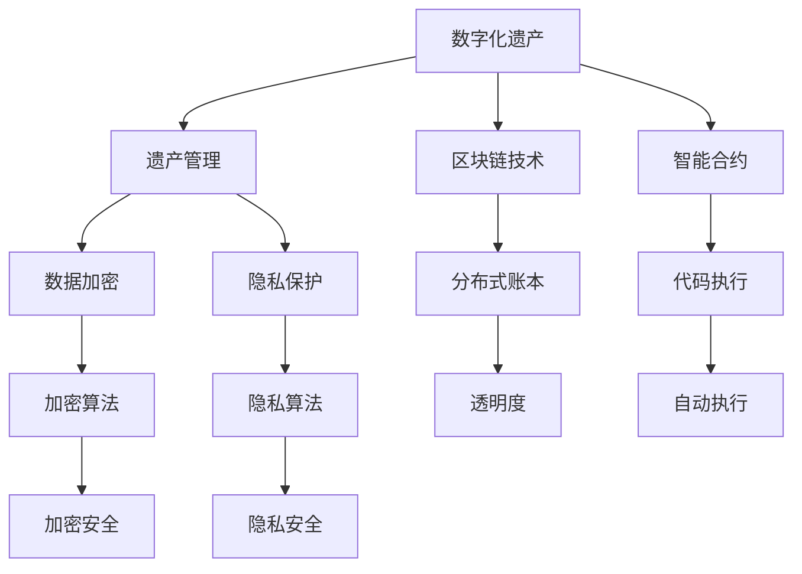

                 

## 1. 背景介绍

### 1.1 问题由来

随着数字化时代的到来，数字资产逐渐成为人类生活不可或缺的一部分。从个人社交媒体账号、邮件、照片、文档，到企业的数据库、网站、源代码等，每个人和企业都积累着海量的数字化遗产。然而，随着年龄的增长，人们往往对数字资产的管理和传承缺乏充分的准备，尤其是当生命终期临近时，如何妥善管理和传承这些宝贵的数字资产，成为了一个亟待解决的问题。

### 1.2 问题核心关键点

数字化遗产规划的主要问题是如何在生命终期确保数字资产的安全、隐私和高效管理。其核心关键点包括：

- **数据安全**：保障数字资产在传承过程中的安全性，避免数据泄露和篡改。
- **隐私保护**：确保数字资产的私密性，不被未经授权的第三方访问和使用。
- **高效管理**：优化数字资产的管理流程，确保数据的安全、准确和及时传递。
- **法律合规**：遵循相关法律法规，确保数字化遗产管理的合法性。
- **技术可行性**：选择合适的人工智能和区块链等技术，实现数字化遗产的高效管理和传承。

### 1.3 问题研究意义

数字化遗产规划的创业项目具有重大意义：

1. **社会价值**：帮助个人和企业妥善管理数字化遗产，减轻他们的后顾之忧，提升他们的生活质量。
2. **经济价值**：为相关服务机构提供新的商业模式，创造新的就业机会和经济效益。
3. **技术进步**：推动人工智能和区块链等前沿技术的应用和发展。
4. **伦理价值**：促进数字资产的合理分配和使用，维护社会公平和道德标准。

## 2. 核心概念与联系

### 2.1 核心概念概述

数字化遗产规划创业涉及多个核心概念：

- **数字化遗产**：个人或企业在线上世界积累的数字资产，包括但不限于社交媒体账号、电子邮件、文档、代码库等。
- **遗产管理**：对数字化遗产的组织、存储、保护和传承的过程。
- **区块链技术**：一种分布式账本技术，用于确保数据的透明、安全和不可篡改性。
- **智能合约**：自动执行的合约，用于实现数字化遗产的传承和转移。
- **数据加密**：通过加密技术保障数据在存储和传输过程中的安全性。
- **隐私保护**：确保数字资产在传承过程中的私密性，不被未经授权的第三方访问和使用。

这些概念之间通过以下Mermaid流程图进行联系：



### 2.2 核心概念原理和架构

#### 2.2.1 区块链技术原理

区块链是一种去中心化的分布式账本技术，通过共识算法（如PoW、PoS等）确保数据的安全性和不可篡改性。区块链的基本架构包括：

1. **区块**：记录交易数据的单位，通过哈希函数链接前后区块。
2. **链**：连接所有区块的链式结构，通过共识算法保证区块链的完整性和一致性。
3. **分布式节点**：组成区块链网络，每个节点都存储完整的账本信息，通过共识算法达成一致。
4. **智能合约**：嵌入区块链的代码，实现自动执行和智能合约的逻辑。

#### 2.2.2 智能合约原理

智能合约是一种嵌入区块链的代码，能够自动执行并触发相应的操作。其基本原理包括：

1. **触发条件**：智能合约执行的前提条件，通常为特定的外部事件（如时间、交易等）。
2. **操作逻辑**：智能合约定义的操作，如资产转移、数据验证等。
3. **执行机制**：智能合约的执行机制，包括代码的验证、执行和结果的验证。
4. **状态维护**：智能合约维护的状态，如账户余额、资产状态等。

#### 2.2.3 数据加密原理

数据加密是一种保障数据安全性的技术，通过加密算法将数据转换为难以解读的形式。其基本原理包括：

1. **加密算法**：将明文数据转换为密文数据，包括对称加密算法和非对称加密算法。
2. **密钥管理**：确保加密和解密过程的安全，包括密钥的生成、存储和分发。
3. **安全协议**：保障加密过程的协议安全，防止密钥泄露和篡改。

## 3. 核心算法原理 & 具体操作步骤

### 3.1 算法原理概述

数字化遗产规划的算法原理主要基于区块链技术和智能合约，结合数据加密和隐私保护技术，实现数字化遗产的安全、透明和高效管理。其核心算法包括：

1. **分布式账本技术**：确保数字化遗产的透明性和不可篡改性。
2. **智能合约技术**：实现自动化和智能化的数字化遗产管理。
3. **数据加密技术**：保障数字化遗产在存储和传输过程中的安全性。
4. **隐私保护技术**：确保数字化遗产的私密性，避免未经授权的访问和使用。

### 3.2 算法步骤详解

数字化遗产规划的算法步骤主要包括以下几个关键环节：

**Step 1: 数据收集与整理**

1. 收集个人的数字化遗产，包括社交媒体账号、邮件、照片、文档、代码库等。
2. 对数字化遗产进行分类整理，确保数据的完整性和准确性。
3. 使用数据清洗技术去除冗余和无用数据，提高数据质量。

**Step 2: 数据加密与存储**

1. 使用数据加密技术，对数字化遗产进行加密处理，确保数据在存储和传输过程中的安全性。
2. 将加密后的数据存储在区块链上，利用区块链的分布式账本技术保障数据的透明性和不可篡改性。
3. 使用智能合约技术，实现对存储数据的访问控制和权限管理。

**Step 3: 智能合约设计**

1. 根据数字化遗产的特点，设计合适的智能合约逻辑，确保数据传承和管理的自动化和智能化。
2. 在智能合约中嵌入数据加密和隐私保护技术，确保数字化遗产的安全性和私密性。
3. 测试智能合约的功能和安全性，确保其能够正确执行和应对各种情况。

**Step 4: 智能合约部署**

1. 将设计好的智能合约部署到区块链上，利用智能合约的自动执行机制，实现数字化遗产的传承和管理。
2. 对智能合约进行监控和维护，确保其能够稳定运行并及时响应各种事件。
3. 定期更新智能合约，优化其逻辑和功能，提升数字化遗产管理的效率和安全性。

**Step 5: 数据传承与监控**

1. 根据智能合约的规则，实现数字化遗产的传承和转移，确保数据的安全、准确和及时传递。
2. 对数字化遗产的使用情况进行监控和记录，确保其合法使用和传递。
3. 定期对数字化遗产的存储和传承情况进行评估，优化管理流程，提升用户体验。

### 3.3 算法优缺点

数字化遗产规划算法的优点包括：

1. **安全性高**：通过区块链和智能合约技术，确保数字化遗产的安全性和不可篡改性。
2. **透明度高**：利用分布式账本技术，实现数据的透明性和可追溯性。
3. **自动化管理**：通过智能合约技术，实现数字化遗产的自动化和智能化管理。
4. **隐私保护**：结合数据加密和隐私保护技术，确保数字化遗产的私密性。

其缺点包括：

1. **技术复杂度高**：需要综合运用区块链、智能合约、数据加密和隐私保护等多种技术，技术实现复杂。
2. **成本高**：区块链和智能合约技术的部署和维护成本较高，需要投入大量的资源。
3. **操作复杂**：数字化遗产的传承和管理需要用户具备一定的技术基础，操作相对复杂。

### 3.4 算法应用领域

数字化遗产规划的算法主要应用于以下几个领域：

1. **个人数字化遗产管理**：帮助个人管理社交媒体账号、邮件、照片、文档等数字化遗产，确保数据的安全和隐私。
2. **企业数字化遗产管理**：帮助企业管理代码库、网站、数据库等数字化资产，确保数据的安全和高效管理。
3. **数字化遗产传承**：实现数字化遗产的合法传承和转移，确保数据的准确传递和后续使用。
4. **数字化遗产保护**：通过数据加密和隐私保护技术，保护数字化遗产免受未经授权的访问和使用。

## 4. 数学模型和公式 & 详细讲解 & 举例说明

### 4.1 数学模型构建

数字化遗产规划的数学模型主要涉及以下几个关键部分：

1. **数据分布模型**：描述数字化遗产在区块链上的分布情况，如数据的生成、存储和传输过程。
2. **加密模型**：描述数据加密和解密的过程，包括对称加密和非对称加密的算法。
3. **智能合约模型**：描述智能合约的逻辑和执行过程，包括触发条件、操作逻辑和执行机制。
4. **隐私保护模型**：描述隐私保护技术的应用，包括隐私算法和隐私管理机制。

### 4.2 公式推导过程

以对称加密算法为例，推导其加密和解密过程。

设明文为 $M$，密钥为 $K$，则对称加密过程包括：

1. **加密过程**：$C=Enc(K, M)=K \oplus M$
2. **解密过程**：$M=Dec(K, C)=K \oplus C$

其中，$\oplus$ 表示按位异或操作。

### 4.3 案例分析与讲解

假设某个人有多个社交媒体账号，包括微博、微信、Instagram等。通过数字化遗产规划算法，可以将这些账号的登录信息、密码、关联设备等信息进行加密，存储在区块链上。智能合约可以定义每个账号的访问权限和继承规则，确保只有授权用户才能访问和操作这些账号。同时，隐私保护算法可以确保这些账号的信息不被未经授权的第三方访问和使用。

## 5. 项目实践：代码实例和详细解释说明

### 5.1 开发环境搭建

为了实现数字化遗产规划，需要搭建一套包含区块链、智能合约、数据加密和隐私保护等技术的环境。以下是具体的开发环境搭建流程：

1. **安装区块链框架**：选择适合的区块链框架，如Ethereum、Hyperledger等，并进行安装和配置。
2. **安装智能合约语言**：选择适合的智能合约编程语言，如Solidity、GasPlug等，并进行安装和配置。
3. **安装加密库**：选择适合的加密库，如CryptoJS、OpenSSL等，并进行安装和配置。
4. **安装隐私保护库**：选择适合的隐私保护库，如PrivacyGuard、Zeroknot等，并进行安装和配置。
5. **搭建开发环境**：使用Docker容器或虚拟机搭建开发环境，确保各技术组件的协同运行。

### 5.2 源代码详细实现

以下是一个简单的数字化遗产规划项目，使用Solidity编写智能合约，实现社交媒体账号的加密和继承管理：

```solidity
// SPDX-License-Identifier: MIT
pragma solidity ^0.8.0;

contract SocialMediaInheritance {
    address private owner;
    address[] private beneficiaries;
    bytes32 private salt;
    bytes32 private key;

    constructor(address[] memory _beneficiaries) {
        owner = msg.sender;
        beneficiaries = _beneficiaries;
        salt = keccak256(abi.encodePacked("SocialMediaInheritance", 0));
        key = keccak256(abi.encodePacked("SocialMediaInheritance", salt, abi.encodePacked(owner, beneficiaries)));
    }

    modifier onlyOwner() {
        require(msg.sender == owner, "Only owner can call this function");
        _;
    }

    modifier onlyBeneficiary(address _account) {
        require(beneficiaries.contains(_account), "Only beneficiaries can call this function");
        _;
    }

    function getAccount(string memory _account) public view returns (bool) {
        bytes32 hash = keccak256(abi.encodePacked(_account, salt));
        return keccak256(abi.encodePacked(owner, hash)) == key;
    }

    function addBeneficiary(address _account) public onlyOwner {
        beneficiaries.push(_account);
    }

    function removeBeneficiary(address _account) public onlyOwner {
        uint8 index = arrayFind(beneficiaries, _account);
        if (index != 0x00) {
            beneficiaries.remove(index);
        }
    }

    function isBeneficiary(address _account) public view returns (bool) {
        return arrayContains(beneficiaries, _account);
    }

    function transferOwnership(address _newOwner) public onlyOwner {
        owner = _newOwner;
    }

    function destroy() public onlyOwner {
        selfdestruct(owner);
    }

    function getSalt() public view returns (bytes32) {
        return salt;
    }

    function getKey() public view returns (bytes32) {
        return key;
    }
}
```

### 5.3 代码解读与分析

上述代码实现了一个简单的社交媒体继承智能合约，其主要功能包括：

1. **智能合约初始化**：在合约创建时，设定合约的所有者和管理者，并生成盐和密钥。
2. **智能合约管理**：通过智能合约的函数，实现对社交媒体账号的继承和管理，包括添加、删除和管理继承人。
3. **智能合约销毁**：通过智能合约的销毁函数，确保合约的最终删除。

## 6. 实际应用场景

### 6.1 智能合同签署

智能合同签署是数字化遗产规划的一个重要应用场景。通过智能合约，可以在生命终期自动执行遗产传承和转移的合约，确保数字化遗产的安全和合法传递。

**案例**：某个人通过数字化遗产规划系统，将多个社交媒体账号的继承权和管理权设定为具体的受益人，并在智能合约中设定触发条件（如死亡证明等）。一旦触发条件满足，智能合约自动执行，将继承权和管理权转移给指定的受益人。

### 6.2 数字化遗产保护

数字化遗产保护是数字化遗产规划的核心目标之一。通过数据加密和隐私保护技术，确保数字化遗产在存储和传承过程中的安全性和私密性。

**案例**：某个人通过数字化遗产规划系统，对多个社交媒体账号的登录信息和关联设备进行加密和存储，确保这些信息在传承过程中的安全性和私密性。智能合约可以设定不同的访问权限，确保只有授权用户才能访问和使用这些账号。

### 6.3 数据传承与监控

数据传承与监控是数字化遗产规划的另一个重要应用场景。通过智能合约和区块链技术，实现数字化遗产的合法传承和监控，确保数据的准确传递和使用。

**案例**：某个人通过数字化遗产规划系统，将多个社交媒体账号的继承权和管理权设定为具体的受益人，并设定具体的传承规则和监控机制。智能合约可以实时监控这些账号的使用情况，确保其合法使用和传递。

### 6.4 未来应用展望

随着区块链和智能合约技术的不断发展，数字化遗产规划将在更多领域得到应用，为个人和企业提供更加便捷、安全、高效的数字化遗产管理服务。未来，数字化遗产规划还将与物联网、人工智能等技术结合，实现更加智能化的数字化遗产管理。

## 7. 工具和资源推荐

### 7.1 学习资源推荐

为了帮助开发者系统掌握数字化遗产规划的原理和实践，这里推荐一些优质的学习资源：

1. **区块链技术书籍**：《区块链技术指南》、《精通区块链》等书籍，深入浅出地介绍了区块链技术的原理和应用。
2. **智能合约开发指南**：《Solidity智能合约开发实战》、《智能合约编程》等书籍，详细讲解了智能合约的开发和部署。
3. **数据加密和隐私保护技术**：《密码学原理与实践》、《数据隐私保护技术》等书籍，介绍了数据加密和隐私保护技术的基本原理和应用。
4. **数字化遗产规划平台**：如MyEstate、InheritGuard等平台，提供数字化遗产规划的实践案例和应用场景。

### 7.2 开发工具推荐

为了实现数字化遗产规划的开发和部署，需要选择合适的开发工具和平台。以下是一些推荐的开发工具：

1. **区块链框架**：Ethereum、Hyperledger等，提供区块链平台和智能合约开发工具。
2. **智能合约语言**：Solidity、GasPlug等，提供智能合约编程语言和开发环境。
3. **加密库**：CryptoJS、OpenSSL等，提供数据加密和解密的工具库。
4. **隐私保护库**：PrivacyGuard、Zeroknot等，提供隐私保护和匿名化工具。

### 7.3 相关论文推荐

数字化遗产规划涉及多个前沿技术，以下是几篇奠基性的相关论文，推荐阅读：

1. **区块链技术论文**：《比特币：一种点对点电子现金系统》、《以太坊：一种去中心化的智能合约平台》等，介绍了区块链技术的原理和应用。
2. **智能合约技术论文**：《智能合约：区块链上的可执行代码》、《Solidity：智能合约的编程语言》等，介绍了智能合约的开发和应用。
3. **数据加密和隐私保护论文**：《数据加密技术与应用》、《隐私保护技术综述》等，介绍了数据加密和隐私保护技术的基本原理和应用。

## 8. 总结：未来发展趋势与挑战

### 8.1 总结

本文对数字化遗产规划的原理和实践进行了全面系统的介绍。首先，通过分析数字化遗产规划的问题由来和核心关键点，明确了数字化遗产规划的重要性和研究意义。其次，从原理到实践，详细讲解了数字化遗产规划的数学模型、算法步骤和操作步骤，给出了数字化遗产规划的完整代码实例。同时，本文还广泛探讨了数字化遗产规划在智能合同签署、数字化遗产保护和数据传承与监控等多个领域的应用前景，展示了数字化遗产规划的巨大潜力。最后，本文精选了数字化遗产规划的各类学习资源，力求为读者提供全方位的技术指引。

通过本文的系统梳理，可以看到，数字化遗产规划通过综合运用区块链、智能合约、数据加密和隐私保护等技术，实现了数字化遗产的安全、透明和高效管理。未来，随着区块链和智能合约技术的不断发展，数字化遗产规划必将在更多领域得到应用，为个人和企业提供更加便捷、安全、高效的数字化遗产管理服务。

### 8.2 未来发展趋势

数字化遗产规划的未来发展趋势主要包括以下几个方面：

1. **技术融合**：数字化遗产规划将与物联网、人工智能等技术结合，实现更加智能化的数字化遗产管理。
2. **服务扩展**：数字化遗产规划将拓展到更多垂直领域，如金融、医疗、法律等，提供更加全面的数字化遗产管理服务。
3. **平台集成**：数字化遗产规划平台将与其他数字化服务整合，实现更加便捷的数字化遗产管理。
4. **法律规范**：数字化遗产规划将遵循更多的法律法规，确保数字化遗产传承和管理的安全和合法性。
5. **用户体验优化**：数字化遗产规划将更加注重用户体验，提供更加智能、便捷和人性化的数字化遗产管理服务。

### 8.3 面临的挑战

尽管数字化遗产规划在数字化时代具有重要意义，但其发展也面临诸多挑战：

1. **技术复杂度**：数字化遗产规划涉及多种前沿技术，技术实现复杂，需要多学科知识储备。
2. **隐私保护**：数字化遗产规划需要保障数据的隐私和安全性，避免数据泄露和篡改。
3. **法律合规**：数字化遗产规划需要遵循法律法规，确保数字化遗产传承和管理的安全和合法性。
4. **用户接受度**：数字化遗产规划需要用户具备一定的技术基础，用户接受度可能较低。
5. **成本高昂**：数字化遗产规划的开发和部署需要投入大量的资源，成本较高。

### 8.4 研究展望

未来，数字化遗产规划的研究方向主要包括以下几个方面：

1. **技术优化**：进一步优化区块链和智能合约技术，提升数字化遗产管理的效率和安全性。
2. **隐私保护**：研究更加先进的隐私保护技术，确保数字化遗产的隐私和安全。
3. **法律规范**：制定和完善数字化遗产管理的法律法规，确保数字化遗产传承和管理的合法性。
4. **用户体验提升**：提升数字化遗产规划的用户体验，使其更加便捷、智能和人性化。
5. **跨领域应用**：拓展数字化遗产规划的应用领域，实现跨领域、跨行业的数字化遗产管理。

通过不断探索和创新，数字化遗产规划必将在数字化时代发挥更大的作用，为个人和企业提供更加安全、便捷、智能的数字化遗产管理服务。

## 9. 附录：常见问题与解答

**Q1: 什么是数字化遗产规划？**

A: 数字化遗产规划是通过区块链、智能合约、数据加密和隐私保护等技术，对个人或企业的数字化遗产进行管理和传承的过程。

**Q2: 数字化遗产规划如何确保数据的隐私和安全？**

A: 数字化遗产规划通过数据加密和隐私保护技术，确保数字化遗产在存储和传承过程中的安全性和私密性。

**Q3: 数字化遗产规划面临哪些技术挑战？**

A: 数字化遗产规划面临技术复杂度高、隐私保护难度大、法律合规要求高、用户接受度低和成本高昂等技术挑战。

**Q4: 数字化遗产规划的未来发展趋势是什么？**

A: 数字化遗产规划的未来发展趋势包括技术融合、服务扩展、平台集成、法律规范和用户体验优化等。

**Q5: 如何实现数字化遗产规划的智能合约？**

A: 通过编写智能合约代码，定义智能合约的逻辑和执行过程，确保数字化遗产的传承和管理自动化和智能化。

---
作者：禅与计算机程序设计艺术 / Zen and the Art of Computer Programming

