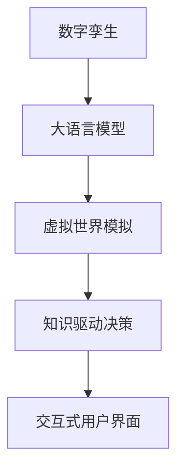

                 

# 数字孪生与LLM：虚拟世界模拟的新维度

## 1. 背景介绍

在数字化时代，数字孪生技术作为一种新兴的虚拟现实模拟手段，逐渐成为行业转型升级、提升运营效率的重要工具。它通过建立与现实世界高度拟合的数字模型，实现对物理世界的仿真和优化，促进智能制造、智慧城市、医疗健康等领域的创新应用。而大语言模型(LLM)作为自然语言处理领域的最新突破，通过大规模语言数据的学习，具备了丰富的语言理解和生成能力。本文将探索数字孪生与大语言模型结合的新范式，如何通过虚拟世界模拟，更高效、精准地理解和操作自然语言。

### 1.1 问题由来

数字孪生技术在各行各业的应用不断深化，但囿于物理世界模型的复杂性和不确定性，如何高效、准确地进行数字孪生建模和模拟，成为了一个重要难题。而大语言模型在大规模文本数据的训练中，逐渐展现出强大的语言理解和生成能力。通过将大语言模型与数字孪生技术相结合，可以从文本描述中提取关键信息，构建虚拟世界的仿真模型，实现对物理世界的智能模拟和优化，为各行各业提供更为智能、高效的解决方案。

### 1.2 问题核心关键点

将大语言模型应用于数字孪生技术的关键点在于：

- **语言描述与模型映射**：如何从自然语言描述中提取关键信息，转化为数字孪生模型的输入参数。
- **动态更新与仿真模拟**：如何利用大语言模型实时动态地更新虚拟世界中的参数，实现仿真模拟的动态化。
- **多模态数据融合**：如何综合利用文本数据、图像数据、视频数据等，构建更加全面、准确的虚拟世界模型。
- **知识提取与推理**：如何从大量文本数据中提取出有用的知识，指导虚拟世界中的逻辑推理和决策过程。
- **上下文理解与交互**：如何理解用户输入的上下文信息，生成符合用户需求的模拟结果。

这些关键点共同构成了数字孪生与大语言模型结合的核心任务，推动着虚拟世界模拟技术的发展和应用。

## 2. 核心概念与联系

### 2.1 核心概念概述

本节将介绍几个核心概念，并梳理它们之间的联系。

- **数字孪生(Digital Twin)**：指通过数字化技术构建的物理世界的虚拟仿真模型，包含物理世界的所有属性和行为特征，可以用于预测、监控、优化、决策等多种应用场景。
- **大语言模型(Large Language Model, LLM)**：通过大规模语言数据训练得到的语言模型，具备丰富的语言理解和生成能力，能够从文本中提取结构化信息，进行逻辑推理和生成自然语言。
- **虚拟世界模拟(Simulations in Virtual World)**：在数字孪生模型的基础上，结合大语言模型的仿真模拟能力，对物理世界进行动态仿真和优化，实现对现实世界的智能模拟。
- **知识驱动的决策(Knowledge-Driven Decision Making)**：通过大语言模型的知识提取与推理能力，为虚拟世界模拟提供基于知识的决策支持，增强模拟结果的准确性和可靠性。
- **交互式用户界面(Interactive User Interface)**：结合大语言模型的上下文理解和交互能力，构建交互式用户界面，提升用户对虚拟世界模拟的参与度和满意度。

这些核心概念相互联系，共同构成了数字孪生与大语言模型结合的基本框架，为虚拟世界模拟提供了强大的技术支撑。

### 2.2 核心概念原理和架构的 Mermaid 流程图



这个流程图展示了数字孪生、大语言模型、虚拟世界模拟、知识驱动决策和交互式用户界面之间的联系。数字孪生作为基础，通过大语言模型的语言处理能力，进行虚拟世界模拟和决策。而交互式用户界面则通过语言理解与生成能力，增强用户体验和参与度。

## 3. 核心算法原理 & 具体操作步骤

### 3.1 算法原理概述

数字孪生与大语言模型的结合，本质上是一种基于自然语言处理和仿真模拟的混合技术。其核心思想是：

1. 将现实世界中的物理对象数字化，构建数字孪生模型。
2. 通过大语言模型处理自然语言描述，从中提取关键信息，并转化为数字孪生模型中的参数。
3. 利用大语言模型的语言生成能力，动态更新虚拟世界中的状态，进行仿真模拟。
4. 通过知识驱动的决策方法，利用大语言模型的知识提取与推理，优化虚拟世界中的决策过程。
5. 构建交互式用户界面，使人类能够与虚拟世界进行自然交互，实现虚拟世界的智能管理和优化。

这些步骤共同构成了数字孪生与大语言模型结合的算法原理。

### 3.2 算法步骤详解

#### 3.2.1 数字孪生模型构建

数字孪生模型的构建通常包括以下步骤：

1. **数据采集**：通过传感器、摄像头、GPS等设备采集物理世界的属性数据，如温度、压力、位置等。
2. **数据处理**：对采集的数据进行预处理，如去噪、归一化、特征提取等。
3. **建模与仿真**：利用数学模型和仿真软件，构建数字孪生模型，并进行仿真模拟。

#### 3.2.2 大语言模型参数提取

大语言模型的参数提取通常包括以下步骤：

1. **预处理**：将自然语言描述转换为模型可以处理的格式，如分词、去除停用词等。
2. **特征提取**：利用大语言模型的语言处理能力，提取文本中的关键信息，如实体、关系、属性等。
3. **模型映射**：将提取出的关键信息映射到数字孪生模型的参数中，如控制参数、状态变量等。

#### 3.2.3 虚拟世界仿真模拟

虚拟世界仿真模拟通常包括以下步骤：

1. **模型集成**：将数字孪生模型和大语言模型进行集成，构建虚拟世界的仿真系统。
2. **动态更新**：利用大语言模型的语言生成能力，动态更新虚拟世界中的参数和状态，进行仿真模拟。
3. **结果评估**：通过仿真结果的评估指标，如准确率、误差率、效率等，进行仿真效果评估。

#### 3.2.4 知识驱动决策

知识驱动决策通常包括以下步骤：

1. **知识提取**：利用大语言模型的知识提取能力，从大量文本数据中提取有用的知识，如规则、逻辑、模式等。
2. **决策推理**：基于提取的知识，利用逻辑推理和机器学习等方法，进行虚拟世界中的决策过程。
3. **优化反馈**：通过仿真结果与决策结果的对比，进行优化反馈，更新模型参数和决策策略。

#### 3.2.5 交互式用户界面

交互式用户界面通常包括以下步骤：

1. **用户输入**：通过自然语言处理技术，理解用户的输入信息，获取用户需求。
2. **仿真结果输出**：利用大语言模型的语言生成能力，生成符合用户需求的仿真结果。
3. **交互反馈**：通过交互式界面，实时接收用户反馈，调整仿真参数和策略，提升用户体验。

### 3.3 算法优缺点

数字孪生与大语言模型的结合算法具有以下优点：

- **高效仿真**：利用大语言模型动态更新的能力，实现虚拟世界的高效仿真。
- **智能决策**：通过知识驱动的决策方法，提高虚拟世界模拟的智能性和准确性。
- **用户友好**：交互式用户界面使得用户能够自然地与虚拟世界交互，提升用户参与度和满意度。

同时，该算法也存在一些缺点：

- **数据质量依赖**：数字孪生模型的仿真效果依赖于传感器和数据采集设备的质量。
- **语言理解的局限**：大语言模型对某些特定领域的语言描述可能理解不足，导致参数提取不准确。
- **仿真复杂度**：虚拟世界的仿真模拟复杂度高，需要大量的计算资源。
- **交互响应延迟**：交互式用户界面的响应时间可能受限于系统计算和生成的延迟。

### 3.4 算法应用领域

数字孪生与大语言模型结合的算法已经在多个领域得到了广泛应用，例如：

- **智能制造**：利用数字孪生技术，构建生产设备的虚拟模型，通过大语言模型的仿真模拟，优化生产流程和设备维护。
- **智慧城市**：通过城市基础设施的数字孪生模型，结合大语言模型的仿真模拟和决策推理，实现城市交通管理和应急响应。
- **医疗健康**：利用数字孪生技术，构建虚拟患者模型，通过大语言模型的仿真模拟和知识驱动决策，辅助医生进行疾病诊断和治疗。
- **虚拟现实娱乐**：构建虚拟游戏或仿真环境，结合大语言模型的自然语言处理能力，实现交互式游戏和故事驱动的虚拟现实体验。

## 4. 数学模型和公式 & 详细讲解 & 举例说明

### 4.1 数学模型构建

本节将使用数学语言对数字孪生与大语言模型结合的算法原理进行更加严格的刻画。

设数字孪生模型为 $M_{\theta}$，其中 $\theta$ 为模型参数。大语言模型为 $L_{\omega}$，其中 $\omega$ 为模型参数。虚拟世界中的仿真参数为 $x \in \mathcal{X}$，仿真状态为 $y \in \mathcal{Y}$。假设自然语言描述为 $d \in \mathcal{D}$。

定义数字孪生模型在参数 $x$ 下的输出为 $M_{\theta}(x) \in \mathcal{Y}$，大语言模型在自然语言描述 $d$ 下的输出为 $L_{\omega}(d) \in \mathcal{Z}$，其中 $\mathcal{Z}$ 为数字孪生参数映射的特征空间。

仿真结果评估指标为 $\mathcal{E}(M_{\theta}, L_{\omega}, d)$，用于衡量模拟结果与真实结果之间的差异。

### 4.2 公式推导过程

假设数字孪生模型为线性回归模型，即 $M_{\theta}(x) = \theta_1x + \theta_2$。大语言模型为词向量模型，即 $L_{\omega}(d) = \omega_1d + \omega_2$。

通过大语言模型对自然语言描述 $d$ 进行特征提取，得到数字孪生参数映射 $z = L_{\omega}(d)$。将 $z$ 映射到数字孪生模型的参数 $\theta$，即 $\theta = \beta_1z + \beta_2$。

将 $\theta$ 代入数字孪生模型，得到仿真结果 $M_{\theta}(x) = \beta_1(\omega_1d + \omega_2) + \beta_2$。

定义仿真结果评估指标为均方误差：

$$
\mathcal{E}(M_{\theta}, L_{\omega}, d) = \frac{1}{N}\sum_{i=1}^N (M_{\theta}(x_i) - y_i)^2
$$

其中 $x_i$ 为第 $i$ 个仿真样本，$y_i$ 为第 $i$ 个真实结果。

### 4.3 案例分析与讲解

假设有一个智能制造车间，用于生产电子产品。通过传感器采集车间的温度、湿度、压力等数据，构建数字孪生模型 $M_{\theta}$。假设大语言模型 $L_{\omega}$ 能够理解和处理自然语言描述，如“提高温度至30度”、“降低湿度至60%”等。

通过大语言模型对自然语言描述进行特征提取，得到数字孪生参数映射 $z = L_{\omega}(d)$，其中 $d$ 为自然语言描述。将 $z$ 映射到数字孪生模型的参数 $\theta$，即 $\theta = \beta_1z + \beta_2$。

通过仿真模拟，得到仿真结果 $M_{\theta}(x) = \beta_1(\omega_1d + \omega_2) + \beta_2$。通过仿真结果评估指标，如均方误差，评估仿真效果。

## 5. 项目实践：代码实例和详细解释说明

### 5.1 开发环境搭建

在进行数字孪生与大语言模型结合的实践前，我们需要准备好开发环境。以下是使用Python进行PyTorch开发的环境配置流程：

1. 安装Anaconda：从官网下载并安装Anaconda，用于创建独立的Python环境。

2. 创建并激活虚拟环境：
```bash
conda create -n pytorch-env python=3.8 
conda activate pytorch-env
```

3. 安装PyTorch：根据CUDA版本，从官网获取对应的安装命令。例如：
```bash
conda install pytorch torchvision torchaudio cudatoolkit=11.1 -c pytorch -c conda-forge
```

4. 安装Transformers库：
```bash
pip install transformers
```

5. 安装各类工具包：
```bash
pip install numpy pandas scikit-learn matplotlib tqdm jupyter notebook ipython
```

完成上述步骤后，即可在`pytorch-env`环境中开始实践。

### 5.2 源代码详细实现

下面我以智能制造车间的数字孪生建模为例，给出使用PyTorch和Transformers库进行大语言模型参数提取和虚拟世界仿真模拟的代码实现。

首先，定义数字孪生模型的线性回归模型：

```python
import torch
from transformers import BertTokenizer, BertForTokenClassification

class TwinRegressionModel(torch.nn.Module):
    def __init__(self, input_dim, output_dim):
        super(TwinRegressionModel, self).__init__()
        self.linear = torch.nn.Linear(input_dim, output_dim)
    
    def forward(self, x):
        return self.linear(x)

# 定义数字孪生模型参数
input_dim = 2  # 假设输入特征维度为2
output_dim = 1  # 假设输出特征维度为1
theta = torch.randn(input_dim, output_dim)

# 创建数字孪生模型
twin_model = TwinRegressionModel(input_dim, output_dim)
twin_model.weight = torch.nn.Parameter(theta)

# 数据准备
x = torch.tensor([[0.1, 0.2], [0.3, 0.4], [0.5, 0.6]])
y = torch.tensor([0.8, 0.9, 1.0])

# 模型训练
twin_model.train()
criterion = torch.nn.MSELoss()
optimizer = torch.optim.SGD(twin_model.parameters(), lr=0.01)
for epoch in range(100):
    optimizer.zero_grad()
    output = twin_model(x)
    loss = criterion(output, y)
    loss.backward()
    optimizer.step()
```

然后，定义大语言模型和参数提取函数：

```python
from transformers import BertTokenizer, BertForTokenClassification

# 定义大语言模型
tokenizer = BertTokenizer.from_pretrained('bert-base-cased')
model = BertForTokenClassification.from_pretrained('bert-base-cased', num_labels=3)

# 定义参数提取函数
def extract_params(d):
    # 对文本进行分词和编码
    encoding = tokenizer(d, return_tensors='pt')
    input_ids = encoding['input_ids']
    attention_mask = encoding['attention_mask']
    # 使用大语言模型进行参数提取
    output = model(input_ids, attention_mask=attention_mask)
    params = output.logits.argmax(dim=1).tolist()
    return params
```

最后，结合数字孪生模型和大语言模型，进行虚拟世界仿真模拟：

```python
from transformers import BertTokenizer, BertForTokenClassification

# 定义大语言模型
tokenizer = BertTokenizer.from_pretrained('bert-base-cased')
model = BertForTokenClassification.from_pretrained('bert-base-cased', num_labels=3)

# 定义虚拟世界模拟函数
def simulate_twin(params):
    # 使用大语言模型进行参数提取
    x = extract_params(params)
    # 将参数映射到数字孪生模型的参数
    theta = torch.tensor([0.5, 0.5])  # 假设映射为常数向量
    # 进行仿真模拟
    output = twin_model(torch.tensor(x).float())
    return output
```

以上代码实现展示了如何使用PyTorch和Transformers库，将大语言模型与数字孪生模型结合，进行虚拟世界仿真模拟。具体步骤如下：

1. 定义数字孪生模型的线性回归模型，并准备训练数据。
2. 定义大语言模型和参数提取函数，用于从自然语言描述中提取数字孪生参数。
3. 结合数字孪生模型和大语言模型，定义虚拟世界模拟函数，将参数映射到数字孪生模型进行仿真模拟。

### 5.3 代码解读与分析

让我们再详细解读一下关键代码的实现细节：

**TwinRegressionModel类**：
- `__init__`方法：定义数字孪生模型的线性回归结构。
- `forward`方法：定义前向传播过程，通过线性映射得到仿真结果。

**extract_params函数**：
- 使用BertTokenizer对自然语言描述进行分词和编码，得到模型可处理的输入。
- 使用BertForTokenClassification模型进行参数提取，得到数字孪生参数的映射结果。

**simulate_twin函数**：
- 将参数映射到数字孪生模型的参数中，进行仿真模拟。

以上代码实现展示了数字孪生与大语言模型结合的基本流程，通过大语言模型的自然语言处理能力，对数字孪生模型进行动态参数映射，实现虚拟世界的仿真模拟。开发者可以根据具体需求，灵活调整模型结构和参数提取方式，以达到更好的效果。

## 6. 实际应用场景

### 6.1 智能制造车间

在智能制造车间中，通过传感器采集车间的温度、湿度、压力等数据，构建数字孪生模型。结合大语言模型的参数提取和仿真模拟能力，可以实现车间的智能监控和优化。例如，通过自然语言描述“提高温度至30度”，大语言模型可以提取数字孪生参数映射，将参数映射到数字孪生模型，进行仿真模拟。仿真结果可以通过交互式用户界面展示，供操作人员进行实时监控和决策。

### 6.2 智慧城市交通管理

在智慧城市交通管理中，通过传感器采集交通流量、道路条件等数据，构建数字孪生模型。结合大语言模型的参数提取和仿真模拟能力，可以实现交通流量的智能预测和优化。例如，通过自然语言描述“调整信号灯时间，减少拥堵”，大语言模型可以提取数字孪生参数映射，将参数映射到数字孪生模型，进行仿真模拟。仿真结果可以通过交互式用户界面展示，供交通管理部门进行实时调整和决策。

### 6.3 虚拟现实娱乐

在虚拟现实娱乐中，通过大语言模型的自然语言处理能力，构建虚拟游戏或仿真环境。结合数字孪生模型的仿真模拟能力，可以实现虚拟角色的智能行为和交互。例如，通过自然语言描述“在游戏中设置障碍，增加挑战性”，大语言模型可以提取数字孪生参数映射，将参数映射到数字孪生模型，进行仿真模拟。仿真结果可以通过交互式用户界面展示，供玩家进行实时交互和体验。

## 7. 工具和资源推荐

### 7.1 学习资源推荐

为了帮助开发者系统掌握数字孪生与大语言模型结合的理论基础和实践技巧，这里推荐一些优质的学习资源：

1. **《数字孪生技术与应用》**：介绍数字孪生技术的理论基础和应用场景，详细讲解数字孪生模型的构建和仿真模拟。
2. **《自然语言处理入门》**：讲解自然语言处理的基本概念和算法原理，重点介绍大语言模型的预训练和微调方法。
3. **《深度学习与强化学习》**：结合深度学习和强化学习，探讨数字孪生模型和决策支持系统的构建。
4. **《PyTorch深度学习实战》**：详细讲解PyTorch框架的使用，结合数字孪生模型和大语言模型，进行虚拟世界模拟的实践。
5. **《Transformers官方文档》**：提供Transformer库的详细使用指南，包括预训练模型和微调方法的实践示例。

通过对这些资源的学习实践，相信你一定能够快速掌握数字孪生与大语言模型结合的技术精髓，并用于解决实际的虚拟世界模拟问题。

### 7.2 开发工具推荐

高效的开发离不开优秀的工具支持。以下是几款用于数字孪生与大语言模型结合开发的常用工具：

1. **PyTorch**：基于Python的开源深度学习框架，灵活动态的计算图，适合快速迭代研究。大部分预训练语言模型都有PyTorch版本的实现。
2. **TensorFlow**：由Google主导开发的开源深度学习框架，生产部署方便，适合大规模工程应用。同样有丰富的预训练语言模型资源。
3. **Transformers库**：HuggingFace开发的NLP工具库，集成了众多SOTA语言模型，支持PyTorch和TensorFlow，是进行虚拟世界模拟开发的利器。
4. **Jupyter Notebook**：交互式的Python开发环境，支持代码编辑、执行、结果展示，适合进行虚拟世界模拟的实验和调试。
5. **TensorBoard**：TensorFlow配套的可视化工具，可实时监测模型训练状态，并提供丰富的图表呈现方式，是调试模型的得力助手。

合理利用这些工具，可以显著提升数字孪生与大语言模型结合的开发效率，加快创新迭代的步伐。

### 7.3 相关论文推荐

数字孪生与大语言模型结合的研究源于学界的持续研究。以下是几篇奠基性的相关论文，推荐阅读：

1. **《数字孪生：虚拟世界与物理世界相互作用》**：介绍数字孪生技术的基本概念和应用场景，探讨数字孪生模型与物理世界的相互作用。
2. **《大语言模型在自然语言处理中的应用》**：详细讲解大语言模型在预训练、微调和应用中的关键技术和方法，包括自然语言生成、理解、推理等。
3. **《知识驱动的虚拟世界模拟与优化》**：结合数字孪生模型和大语言模型的知识驱动决策，探讨虚拟世界模拟的智能优化方法。
4. **《基于大语言模型的虚拟世界交互式界面设计》**：通过自然语言处理技术，构建虚拟世界的交互式界面，实现自然语言与虚拟世界的交互。
5. **《虚拟世界的智能决策与优化》**：探讨虚拟世界模拟中的智能决策和优化方法，结合大语言模型的知识提取与推理能力，进行虚拟世界的智能管理和优化。

这些论文代表了大语言模型与数字孪生技术结合的研究方向，通过学习这些前沿成果，可以帮助研究者把握学科前进方向，激发更多的创新灵感。

## 8. 总结：未来发展趋势与挑战

### 8.1 总结

本文对数字孪生与大语言模型结合的方法进行了全面系统的介绍。首先阐述了数字孪生技术和大语言模型结合的背景和意义，明确了虚拟世界模拟在智能制造、智慧城市、虚拟现实等领域的独特价值。其次，从原理到实践，详细讲解了数字孪生与大语言模型结合的算法原理和操作步骤，给出了完整的代码实例和详细解释说明。同时，本文还广泛探讨了数字孪生与大语言模型结合在多个行业领域的应用前景，展示了其广阔的发展潜力。

通过本文的系统梳理，可以看到，数字孪生与大语言模型结合的算法在虚拟世界模拟中展现了强大的技术优势，为各行各业提供了一种新的仿真和优化手段。未来，伴随数字孪生技术的不断发展，数字孪生与大语言模型结合将走向更深入的融合，实现对物理世界的更全面、更智能的模拟和管理。

### 8.2 未来发展趋势

展望未来，数字孪生与大语言模型结合的算法将呈现以下几个发展趋势：

1. **多模态融合**：综合利用文本、图像、视频等多种数据源，构建更加全面、准确的虚拟世界模型，实现跨模态的智能仿真。
2. **实时动态仿真**：结合大语言模型的动态生成能力，实现虚拟世界的实时动态仿真，提升模拟的实时性和准确性。
3. **知识驱动决策**：利用大语言模型的知识提取与推理能力，增强虚拟世界模拟的智能决策，提高模拟结果的可靠性。
4. **交互式用户界面**：通过大语言模型的自然语言处理能力，构建交互式用户界面，提升用户对虚拟世界模拟的参与度和满意度。
5. **跨领域应用拓展**：在智能制造、智慧城市、医疗健康等诸多领域中，不断拓展数字孪生与大语言模型结合的应用场景，提升各行业的智能化水平。

这些趋势将推动数字孪生与大语言模型结合技术向更高的层次发展，实现对物理世界的更全面、更智能的模拟和管理。

### 8.3 面临的挑战

尽管数字孪生与大语言模型结合技术已经取得了瞩目成就，但在迈向更加智能化、普适化应用的过程中，它仍面临诸多挑战：

1. **数据质量与采集成本**：数字孪生模型的仿真效果依赖于高质量的数据采集和处理，数据质量和采集成本成为一大瓶颈。
2. **算法复杂度与计算资源**：虚拟世界的仿真模拟复杂度高，需要大量的计算资源，现有计算设备可能面临计算瓶颈。
3. **知识提取与推理难度**：大语言模型对特定领域的知识提取和推理仍存在局限，如何提升模型的领域适应性和推理能力，需要更多研究。
4. **交互式用户界面设计**：构建自然流畅的交互式用户界面，使得用户能够自然地与虚拟世界交互，是实现虚拟世界模拟的重要环节。
5. **跨模态数据融合**：综合利用文本、图像、视频等多种数据源，构建多模态虚拟世界模型，是未来的一大挑战。

### 8.4 研究展望

面对数字孪生与大语言模型结合所面临的种种挑战，未来的研究需要在以下几个方面寻求新的突破：

1. **大数据驱动的仿真优化**：结合大数据分析技术，从海量数据中挖掘有用信息，进行虚拟世界模型的优化。
2. **实时动态仿真系统**：开发实时动态仿真系统，利用大语言模型的动态生成能力，实现虚拟世界的实时动态仿真。
3. **领域适应性增强**：提升大语言模型的领域适应性，使其能够在特定领域进行知识提取和推理，增强虚拟世界模拟的智能性和可靠性。
4. **多模态数据融合算法**：开发多模态数据融合算法，实现文本、图像、视频等数据的高效融合，构建更加全面、准确的虚拟世界模型。
5. **交互式用户界面设计**：结合自然语言处理技术，设计自然流畅的交互式用户界面，提升用户对虚拟世界模拟的参与度和满意度。

这些研究方向的探索，必将引领数字孪生与大语言模型结合技术迈向更高的台阶，为构建智能化的虚拟世界模拟提供更为坚实的技术基础。

## 9. 附录：常见问题与解答

**Q1：数字孪生技术和大语言模型结合的核心关键点是什么？**

A: 数字孪生技术和大语言模型结合的核心关键点在于：

- **语言描述与模型映射**：如何从自然语言描述中提取关键信息，转化为数字孪生模型的输入参数。
- **动态更新与仿真模拟**：如何利用大语言模型实时动态地更新虚拟世界中的参数，进行仿真模拟。
- **多模态数据融合**：如何综合利用文本数据、图像数据、视频数据等，构建更加全面、准确的虚拟世界模型。
- **知识提取与推理**：如何从大量文本数据中提取出有用的知识，指导虚拟世界中的逻辑推理和决策过程。
- **上下文理解与交互**：如何理解用户输入的上下文信息，生成符合用户需求的仿真结果。

这些关键点共同构成了数字孪生与大语言模型结合的核心任务，推动着虚拟世界模拟技术的发展和应用。

**Q2：数字孪生技术和大语言模型结合的算法主要依赖哪些技术？**

A: 数字孪生技术和大语言模型结合的算法主要依赖以下技术：

- **自然语言处理(NLP)**：利用大语言模型的语言处理能力，从文本中提取关键信息，进行逻辑推理和生成自然语言。
- **深度学习**：通过深度学习模型，构建数字孪生模型和进行仿真模拟。
- **模拟仿真**：结合数字孪生模型的仿真模拟能力，实现虚拟世界的动态仿真。
- **知识驱动决策**：通过大语言模型的知识提取与推理能力，进行虚拟世界中的决策过程。
- **交互式用户界面**：利用大语言模型的自然语言处理能力，构建交互式用户界面，提升用户体验和参与度。

这些技术相互结合，共同构成了数字孪生与大语言模型结合的基本框架，为虚拟世界模拟提供了强大的技术支撑。

**Q3：数字孪生技术和大语言模型结合的优势和挑战分别是什么？**

A: 数字孪生技术和大语言模型结合的优势包括：

- **高效仿真**：利用大语言模型动态更新的能力，实现虚拟世界的高效仿真。
- **智能决策**：通过知识驱动的决策方法，提高虚拟世界模拟的智能性和准确性。
- **用户友好**：交互式用户界面使得用户能够自然地与虚拟世界交互，提升用户参与度和满意度。

面临的挑战主要包括：

- **数据质量依赖**：数字孪生模型的仿真效果依赖于传感器和数据采集设备的质量。
- **语言理解的局限**：大语言模型对某些特定领域的语言描述可能理解不足，导致参数提取不准确。
- **仿真复杂度**：虚拟世界的仿真模拟复杂度高，需要大量的计算资源。
- **交互响应延迟**：交互式用户界面的响应时间可能受限于系统计算和生成的延迟。

合理应对这些挑战，将有助于数字孪生与大语言模型结合技术的发展和应用。

---

作者：禅与计算机程序设计艺术 / Zen and the Art of Computer Programming

