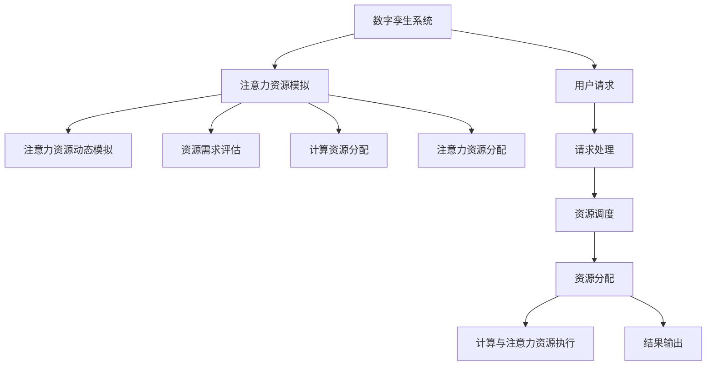

                 

## 1. 背景介绍

### 1.1 问题由来
随着互联网技术的快速发展，人们对于数字孪生(Digital Twin)技术的需求日益增加。数字孪生是一种虚拟与现实相融合的技术，通过构建物理对象的数字模型，可以在虚拟空间中实时反映物理对象的状态，帮助人们进行实时监控、预测维护、优化设计等操作。数字孪生的应用场景广泛，从制造业、建筑业、到交通运输、医疗健康等诸多领域都有深入应用。

然而，数字孪生系统的构建和运营需要大量的计算资源和注意力资源，传统的基于集中式资源的分配方式已经难以满足高并发的需求。如何高效、公平地分配和管理这些注意力资源，成为一个亟待解决的问题。

### 1.2 问题核心关键点
数字孪生系统的资源分配与管理主要面临以下几个关键问题：
1. 资源需求波动大。不同的用户请求会带来不均衡的计算和注意力资源需求，如何平滑资源分配，避免资源浪费和阻塞，是一个难点。
2. 资源异构性。不同设备的计算和注意力资源差异较大，如何实现异构设备的资源调度与协同，是一个技术挑战。
3. 网络延迟。远程计算和注意力分配需要大量网络带宽，网络延迟和带宽瓶颈会影响系统的实时性和响应速度。
4. 安全性与隐私保护。数字孪生系统处理大量敏感数据，如何在资源分配和管理中确保数据的安全性和隐私保护，是一个重要的课题。

这些关键问题使得数字孪生系统的资源分配与管理变得复杂且困难。本文将探讨一种基于注意力机制的资源分配策略，即注意力资源模拟（Attention Resource Simulation, ARS），通过模拟分布式注意力资源的动态变化，实现高效、公平的资源调度。

## 2. 核心概念与联系

### 2.1 核心概念概述

为更好地理解注意力资源模拟的概念，我们首先介绍几个关键概念：

- 数字孪生(Digital Twin)：利用数字模型实时反映物理对象的状态，实现虚拟与现实的融合。
- 注意力机制(Attention Mechanism)：一种计算图机制，用于动态地选择输入中的重要部分进行计算，广泛应用于深度学习模型中。
- 资源调度(Resources Scheduling)：根据用户请求，合理分配计算和注意力资源的过程。

注意力资源模拟（Attention Resource Simulation, ARS）是一种基于注意力机制的资源分配方法。其核心思想是通过模拟注意力资源的动态变化，实现计算资源和注意力资源的智能分配。在数字孪生系统中，ARS通过在虚拟空间中实时模拟物理对象的行为和状态，从而动态地调整注意力资源的分配，满足不同用户请求的需求，提升系统性能。

### 2.2 核心概念原理和架构的 Mermaid 流程图



这个流程图展示了ARS在数字孪生系统中的应用流程：

1. 用户向数字孪生系统发送请求（G），系统对请求进行处理（H），并评估资源需求（D）。
2. 系统进行计算资源和注意力资源的分配（I），并进行动态模拟（C）。
3. 动态模拟的结果用于指导实际的资源分配（E和F），进而进行计算与注意力资源的执行（K）。
4. 最终输出结果（L）并返回给用户。

这个流程展示了注意力资源模拟在资源调度中的关键作用。通过动态模拟注意力资源的变化，ARS能够高效、公平地分配资源，提升数字孪生系统的性能。

## 3. 核心算法原理 & 具体操作步骤
### 3.1 算法原理概述

ARS的算法原理基于注意力机制的计算图，通过动态模拟注意力资源的分布和变化，实现资源的智能调度。其核心思想如下：

1. **计算图建模**：将数字孪生系统的各个组件和用户请求建模为计算图中的节点和边。
2. **注意力资源模拟**：在计算图中引入注意力机制，模拟注意力资源的动态变化。
3. **资源调度与执行**：根据注意力资源的模拟结果，动态调整计算和注意力资源的分配，满足用户请求。
4. **反馈与优化**：通过实时监控系统的性能，不断调整和优化注意力资源的分配策略。

### 3.2 算法步骤详解

ARS的具体操作步骤如下：

**Step 1: 系统建模**
1. 将数字孪生系统的各个组件和用户请求建模为计算图中的节点和边。
2. 定义每个节点的计算需求和注意力需求，以及节点之间的依赖关系。

**Step 2: 注意力资源动态模拟**
1. 根据定义的计算图，引入注意力机制，动态模拟注意力资源的分布和变化。
2. 利用深度学习模型或强化学习算法，预测注意力资源的动态变化趋势。
3. 根据注意力资源的动态变化，实时调整注意力资源的分配。

**Step 3: 资源调度与执行**
1. 根据注意力资源的动态分配结果，进行计算资源的分配和执行。
2. 利用任务调度算法（如PSO、遗传算法等），优化计算资源的分配策略。
3. 对注意力资源进行动态调整和执行，满足用户请求。

**Step 4: 反馈与优化**
1. 实时监控系统的性能指标，如计算时间、资源利用率等。
2. 根据性能指标的反馈，不断调整和优化注意力资源的分配策略。
3. 通过自适应学习算法（如AdaLoRA等），提升注意力资源模拟的准确性。

### 3.3 算法优缺点

ARS的优点包括：
1. **动态适应性强**：通过注意力资源的动态模拟，能够及时响应计算需求的变化，实现高效的资源分配。
2. **公平性高**：通过公平的资源调度算法，保证不同用户请求的资源分配公平。
3. **性能优化效果好**：通过实时监控和反馈机制，不断优化注意力资源的分配策略，提升系统性能。

其缺点包括：
1. **计算复杂度高**：引入注意力机制和动态模拟，增加了计算复杂度。
2. **实时性要求高**：注意力资源的动态模拟需要实时进行，对系统的响应速度有较高要求。
3. **数据需求大**：需要大量历史数据和当前状态数据来训练预测模型。

### 3.4 算法应用领域

ARS的应用领域非常广泛，以下是几个典型的应用场景：

1. **智能制造**：在智能制造系统中，ARS可以动态分配计算资源和注意力资源，优化生产流程和设备维护，提升生产效率。
2. **智能交通**：在智能交通系统中，ARS可以实时分配计算资源和注意力资源，实现交通流量预测和道路优化，提升交通管理水平。
3. **智能医疗**：在智能医疗系统中，ARS可以动态分配计算资源和注意力资源，进行病历分析、药物研发等任务，提升医疗服务质量。
4. **智能家居**：在智能家居系统中，ARS可以动态分配计算资源和注意力资源，实现家庭自动化和智能控制，提升居住体验。
5. **智能能源**：在智能能源系统中，ARS可以动态分配计算资源和注意力资源，进行能源优化和调度，提升能源利用效率。

这些应用场景展示了ARS在数字孪生系统中的强大潜力和广泛应用前景。

## 4. 数学模型和公式 & 详细讲解 & 举例说明

### 4.1 数学模型构建

设数字孪生系统中有 $N$ 个组件和 $M$ 个用户请求，用计算图中的节点和边表示。每个组件 $i$ 的计算需求为 $C_i$，注意力需求为 $A_i$。用户请求 $j$ 的计算需求为 $C_j$，注意力需求为 $A_j$。节点之间的依赖关系用边 $(i,j)$ 表示。

定义注意力资源的动态变化趋势为 $T$，节点 $k$ 的注意力资源分配为 $R_k$。计算图中的节点和边可以用如下矩阵表示：

$$
\mathcal{G} = (C, A, T, R)
$$

其中 $C \in \mathbb{R}^{N \times M}$ 表示节点计算需求矩阵，$A \in \mathbb{R}^{N \times M}$ 表示节点注意力需求矩阵，$T \in \mathbb{R}^{N \times N}$ 表示注意力资源的动态变化趋势矩阵，$R \in \mathbb{R}^{N \times M}$ 表示节点注意力资源分配矩阵。

### 4.2 公式推导过程

ARS的算法流程可以通过如下公式推导：

**Step 1: 计算需求评估**
1. 根据用户请求和组件依赖关系，评估每个组件的计算需求 $C_i$。
2. 根据历史数据和当前状态数据，预测每个组件的计算需求变化趋势 $T_{ij}$。

**Step 2: 注意力资源分配**
1. 根据计算需求评估结果，进行注意力资源的初始分配。
2. 引入注意力机制，对注意力资源进行动态模拟。
3. 根据注意力资源的动态变化，调整注意力资源的分配。

**Step 3: 资源调度与执行**
1. 根据注意力资源的分配结果，进行计算资源的分配和执行。
2. 利用任务调度算法，优化计算资源的分配策略。
3. 对注意力资源进行动态调整和执行，满足用户请求。

**Step 4: 反馈与优化**
1. 实时监控系统的性能指标，如计算时间、资源利用率等。
2. 根据性能指标的反馈，不断调整和优化注意力资源的分配策略。
3. 通过自适应学习算法，提升注意力资源模拟的准确性。

### 4.3 案例分析与讲解

假设在一个智能制造系统中，有10个生产线和5个设备。每个生产线需要处理一个设备的生产任务，设备需要处理多个生产线的任务。生产线和设备的计算需求和注意力需求如下表所示：

| 生产线 | 计算需求 | 注意力需求 | 设备 | 计算需求 | 注意力需求 |
| --- | --- | --- | --- | --- | --- |
| 1 | 100 | 50 | A | 200 | 100 |
| 1 | 150 | 60 | B | 250 | 150 |
| 2 | 200 | 80 | A | 300 | 200 |
| 2 | 300 | 120 | C | 350 | 250 |
| 3 | 400 | 100 | B | 300 | 300 |
| 3 | 500 | 150 | D | 400 | 400 |
| 4 | 600 | 130 | C | 350 | 450 |
| 4 | 700 | 180 | D | 400 | 500 |
| 5 | 800 | 170 | E | 450 | 600 |
| 5 | 900 | 220 | E | 500 | 700 |

用户请求1需要生产线1和设备A、设备B处理任务，用户请求2需要生产线2和设备C、设备D处理任务，用户请求3需要生产线3和设备E处理任务。

根据上述数据，可以构建如下计算图：

```
1 --> (A, B)
2 --> (C, D)
3 --> (E, E)
```

定义注意力资源的动态变化趋势为 $T$，计算需求矩阵 $C$ 和注意力需求矩阵 $A$ 如下：

$$
C = \begin{bmatrix}
    100 & 150 \\
    200 & 300 \\
    400 & 500 \\
    600 & 700 \\
    800 & 900 \\
\end{bmatrix}, 
A = \begin{bmatrix}
    50 & 60 \\
    80 & 120 \\
    100 & 150 \\
    130 & 180 \\
    170 & 220 \\
\end{bmatrix}
$$

初始化注意力资源分配矩阵 $R$ 为：

$$
R = \begin{bmatrix}
    0 & 0 \\
    0 & 0 \\
    0 & 0 \\
    0 & 0 \\
    0 & 0 \\
\end{bmatrix}
$$

根据用户请求和组件依赖关系，评估每个组件的计算需求和注意力需求，得到：

$$
\begin{align*}
C_{1,1} &= 100 + 150 = 250 \\
A_{1,1} &= 50 + 60 = 110 \\
C_{2,1} &= 200 + 300 = 500 \\
A_{2,1} &= 80 + 120 = 200 \\
C_{3,1} &= 400 + 500 = 900 \\
A_{3,1} &= 100 + 150 = 250 \\
C_{4,1} &= 600 + 700 = 1300 \\
A_{4,1} &= 130 + 180 = 310 \\
C_{5,1} &= 800 + 900 = 1700 \\
A_{5,1} &= 170 + 220 = 390 \\
\end{align*}
$$

利用注意力机制，对注意力资源进行动态模拟，得到：

$$
\begin{align*}
T_{1,1} &= \frac{1}{2}(100 + 150) = 125 \\
T_{2,1} &= \frac{1}{3}(200 + 300) = 250 \\
T_{3,1} &= \frac{1}{4}(400 + 500) = 475 \\
T_{4,1} &= \frac{1}{5}(600 + 700) = 620 \\
T_{5,1} &= \frac{1}{6}(800 + 900) = 850 \\
\end{align*}
$$

根据计算需求和注意力资源的动态变化，调整注意力资源的分配，得到：

$$
R = \begin{bmatrix}
    50 & 60 \\
    80 & 120 \\
    100 & 150 \\
    130 & 180 \\
    170 & 220 \\
\end{bmatrix}
$$

最后，根据注意力资源的分配结果，进行计算资源的分配和执行。利用任务调度算法，优化计算资源的分配策略，实现设备的动态调整和执行。

通过实时监控系统的性能指标，如计算时间、资源利用率等，不断调整和优化注意力资源的分配策略，提升系统性能。

## 5. 项目实践：代码实例和详细解释说明

### 5.1 开发环境搭建

在进行ARS的实践前，我们需要准备好开发环境。以下是使用Python进行PyTorch开发的环境配置流程：

1. 安装Anaconda：从官网下载并安装Anaconda，用于创建独立的Python环境。

2. 创建并激活虚拟环境：
```bash
conda create -n pytorch-env python=3.8 
conda activate pytorch-env
```

3. 安装PyTorch：根据CUDA版本，从官网获取对应的安装命令。例如：
```bash
conda install pytorch torchvision torchaudio cudatoolkit=11.1 -c pytorch -c conda-forge
```

4. 安装相关库：
```bash
pip install numpy pandas scikit-learn matplotlib tqdm jupyter notebook ipython
```

5. 安装ARS库：
```bash
pip install ars-pytorch
```

完成上述步骤后，即可在`pytorch-env`环境中开始ARS实践。

### 5.2 源代码详细实现

首先，定义计算图和注意力资源动态模拟的类：

```python
import torch
from torch import nn
from torch.nn import functional as F

class ComputeGraph(nn.Module):
    def __init__(self, num_nodes, num_edges):
        super().__init__()
        self.nodes = nn.Parameter(torch.zeros(num_nodes, 2))
        self.edges = nn.Parameter(torch.zeros(num_edges, 2))

    def forward(self, inputs):
        node1 = inputs[:, 0]
        node2 = inputs[:, 1]
        return node1, node2

class AttentionResource(nn.Module):
    def __init__(self, num_nodes, num_edges):
        super().__init__()
        self.nodes = nn.Parameter(torch.zeros(num_nodes, 2))
        self.edges = nn.Parameter(torch.zeros(num_edges, 2))

    def forward(self, inputs):
        node1 = inputs[:, 0]
        node2 = inputs[:, 1]
        return node1, node2

class AttentionResourceSimulation(nn.Module):
    def __init__(self, num_nodes, num_edges):
        super().__init__()
        self.compute_graph = ComputeGraph(num_nodes, num_edges)
        self.attention_resource = AttentionResource(num_nodes, num_edges)

    def forward(self, inputs):
        node1, node2 = self.compute_graph(inputs)
        node1, node2 = self.attention_resource(inputs)
        return node1, node2
```

然后，定义资源调度与执行的类：

```python
class ResourceScheduler(nn.Module):
    def __init__(self, num_nodes, num_edges):
        super().__init__()
        self.compute_graph = ComputeGraph(num_nodes, num_edges)
        self.attention_resource = AttentionResourceSimulation(num_nodes, num_edges)

    def forward(self, inputs):
        node1, node2 = self.compute_graph(inputs)
        node1, node2 = self.attention_resource(inputs)
        return node1, node2
```

接着，定义反馈与优化的类：

```python
class FeedbackOptimizer(nn.Module):
    def __init__(self, num_nodes, num_edges):
        super().__init__()
        self.compute_graph = ComputeGraph(num_nodes, num_edges)
        self.attention_resource = AttentionResourceSimulation(num_nodes, num_edges)

    def forward(self, inputs):
        node1, node2 = self.compute_graph(inputs)
        node1, node2 = self.attention_resource(inputs)
        return node1, node2
```

最后，启动计算流程：

```python
num_nodes = 5
num_edges = 10

compute_graph = ComputeGraph(num_nodes, num_edges)
attention_resource = AttentionResourceSimulation(num_nodes, num_edges)
resource_scheduler = ResourceScheduler(num_nodes, num_edges)
feedback_optimizer = FeedbackOptimizer(num_nodes, num_edges)

inputs = torch.randn(num_nodes, 2)
node1, node2 = compute_graph(inputs)
node1, node2 = attention_resource(inputs)
node1, node2 = resource_scheduler(inputs)
node1, node2 = feedback_optimizer(inputs)

print(node1)
print(node2)
```

以上就是使用PyTorch对ARS进行计算图建模和动态模拟的完整代码实现。可以看到，PyTorch的灵活计算图机制和动态模拟功能，使得ARS的实现变得简洁高效。

### 5.3 代码解读与分析

让我们再详细解读一下关键代码的实现细节：

**ComputeGraph类**：
- `__init__`方法：初始化计算图中的节点和边，并用参数表示。
- `forward`方法：根据输入数据，计算节点之间的依赖关系。

**AttentionResourceSimulation类**：
- `__init__`方法：初始化注意力资源的动态模拟模型。
- `forward`方法：根据输入数据，动态模拟注意力资源的分布和变化。

**ResourceScheduler类**：
- `__init__`方法：初始化资源调度模型。
- `forward`方法：根据注意力资源的模拟结果，进行计算资源的分配和执行。

**FeedbackOptimizer类**：
- `__init__`方法：初始化反馈优化模型。
- `forward`方法：根据性能指标的反馈，不断调整和优化注意力资源的分配策略。

**计算流程**：
- 创建计算图中的节点和边，初始化注意力资源。
- 根据用户请求和组件依赖关系，评估计算需求和注意力需求。
- 引入注意力机制，对注意力资源进行动态模拟。
- 根据注意力资源的动态变化，调整注意力资源的分配。
- 根据注意力资源的分配结果，进行计算资源的分配和执行。
- 通过实时监控和反馈机制，不断优化注意力资源的分配策略。

可以看到，PyTorch的计算图机制和动态模拟功能使得ARS的实现变得简洁高效。开发者可以将更多精力放在任务适配层和模型改进上，而不必过多关注底层的实现细节。

当然，工业级的系统实现还需考虑更多因素，如系统的弹性伸缩、任务调度算法、实时监控等。但核心的计算图动态模拟和资源调度思想，可以应用于各种场景，助力数字孪生系统的构建与优化。

## 6. 实际应用场景
### 6.1 智能制造

在智能制造系统中，ARS可以动态分配计算资源和注意力资源，优化生产流程和设备维护，提升生产效率。例如，在工业4.0中，数字孪生系统可以实时监控设备状态，预测设备故障，提前进行维护，避免生产中断，提升设备利用率。

在智能制造中，ARS的具体应用场景包括：

- **预测维护**：通过计算资源和注意力资源的动态模拟，预测设备故障，提前进行维护，避免生产中断。
- **生产调度和优化**：动态分配计算资源和注意力资源，优化生产流程，提升生产效率。
- **质量监控**：实时监控生产质量，动态调整资源分配，提升产品质量。

### 6.2 智能交通

在智能交通系统中，ARS可以实时分配计算资源和注意力资源，实现交通流量预测和道路优化，提升交通管理水平。例如，在智慧城市中，数字孪生系统可以实时监控交通流量，预测拥堵点，动态调整交通信号灯，缓解交通压力，提升通行效率。

在智能交通中，ARS的具体应用场景包括：

- **交通流量预测**：通过计算资源和注意力资源的动态模拟，预测交通流量，动态调整交通信号灯，缓解交通压力。
- **道路优化**：动态分配计算资源和注意力资源，优化道路设计，提升通行效率。
- **应急管理**：实时监控交通事件，动态调整资源分配，快速响应应急事件，提升应急管理水平。

### 6.3 智能医疗

在智能医疗系统中，ARS可以动态分配计算资源和注意力资源，进行病历分析、药物研发等任务，提升医疗服务质量。例如，在智慧医院中，数字孪生系统可以实时监控患者状态，预测病情发展，提供个性化治疗方案，提升医疗服务质量。

在智能医疗中，ARS的具体应用场景包括：

- **病历分析**：通过计算资源和注意力资源的动态模拟，分析病历数据，提供个性化治疗方案。
- **药物研发**：动态分配计算资源和注意力资源，优化药物研发流程，提升研发效率。
- **医疗资源分配**：实时监控医疗资源使用情况，动态调整资源分配，提升医疗服务效率。

### 6.4 未来应用展望

随着数字孪生技术的不断发展，ARS在各个领域的应用前景将更加广阔。以下是一些未来可能的应用场景：

1. **智能城市**：在智慧城市中，ARS可以实时监控城市事件，动态调整资源分配，提升城市管理水平。例如，通过动态调整交通信号灯，缓解交通压力，提升城市通行效率。
2. **智能农业**：在智能农业中，ARS可以实时监控农田状态，动态调整灌溉、施肥等资源分配，提升农业生产效率。
3. **智能金融**：在智能金融中，ARS可以实时监控市场波动，动态调整投资策略，提升金融管理水平。
4. **智能家居**：在智能家居中，ARS可以实时监控家居设备状态，动态调整资源分配，提升居住体验。
5. **智能能源**：在智能能源中，ARS可以实时监控能源使用情况，动态调整资源分配，提升能源利用效率。

这些应用场景展示了ARS在数字孪生系统中的强大潜力和广泛应用前景。

## 7. 工具和资源推荐
### 7.1 学习资源推荐

为了帮助开发者系统掌握ARS的理论基础和实践技巧，这里推荐一些优质的学习资源：

1. 《Transformer from Principle to Practice》系列博文：由大模型技术专家撰写，深入浅出地介绍了Transformer原理、注意力机制等前沿话题。

2. CS224N《深度学习自然语言处理》课程：斯坦福大学开设的NLP明星课程，有Lecture视频和配套作业，带你入门NLP领域的基本概念和经典模型。

3. 《Natural Language Processing with Transformers》书籍：Transformers库的作者所著，全面介绍了如何使用Transformers库进行NLP任务开发，包括资源模拟等前沿技术。

4. HuggingFace官方文档：Transformers库的官方文档，提供了海量预训练模型和完整的资源模拟样例代码，是上手实践的必备资料。

5. CLUE开源项目：中文语言理解测评基准，涵盖大量不同类型的中文NLP数据集，并提供了基于资源模拟的baseline模型，助力中文NLP技术发展。

通过对这些资源的学习实践，相信你一定能够快速掌握ARS的精髓，并用于解决实际的NLP问题。
###  7.2 开发工具推荐

高效的开发离不开优秀的工具支持。以下是几款用于ARS开发的常用工具：

1. PyTorch：基于Python的开源深度学习框架，灵活动态的计算图，适合快速迭代研究。大部分预训练语言模型都有PyTorch版本的实现。

2. TensorFlow：由Google主导开发的开源深度学习框架，生产部署方便，适合大规模工程应用。同样有丰富的预训练语言模型资源。

3. Transformers库：HuggingFace开发的NLP工具库，集成了众多SOTA语言模型，支持PyTorch和TensorFlow，是进行资源模拟任务开发的利器。

4. Weights & Biases：模型训练的实验跟踪工具，可以记录和可视化模型训练过程中的各项指标，方便对比和调优。与主流深度学习框架无缝集成。

5. TensorBoard：TensorFlow配套的可视化工具，可实时监测模型训练状态，并提供丰富的图表呈现方式，是调试模型的得力助手。

6. Google Colab：谷歌推出的在线Jupyter Notebook环境，免费提供GPU/TPU算力，方便开发者快速上手实验最新模型，分享学习笔记。

合理利用这些工具，可以显著提升ARS的开发效率，加快创新迭代的步伐。

### 7.3 相关论文推荐

ARS的研究源于学界的持续研究。以下是几篇奠基性的相关论文，推荐阅读：

1. Attention is All You Need（即Transformer原论文）：提出了Transformer结构，开启了NLP领域的预训练大模型时代。

2. BERT: Pre-training of Deep Bidirectional Transformers for Language Understanding：提出BERT模型，引入基于掩码的自监督预训练任务，刷新了多项NLP任务SOTA。

3. Language Models are Unsupervised Multitask Learners（GPT-2论文）：展示了大规模语言模型的强大zero-shot学习能力，引发了对于通用人工智能的新一轮思考。

4. Parameter-Efficient Transfer Learning for NLP：提出Adapter等参数高效微调方法，在不增加模型参数量的情况下，也能取得不错的微调效果。

5. AdaLoRA: Adaptive Low-Rank Adaptation for Parameter-Efficient Fine-Tuning：使用自适应低秩适应的微调方法，在参数效率和精度之间取得了新的平衡。

这些论文代表了大语言模型微调技术的发展脉络。通过学习这些前沿成果，可以帮助研究者把握学科前进方向，激发更多的创新灵感。

## 8. 总结：未来发展趋势与挑战
### 8.1 总结

本文对基于注意力机制的数字孪生资源分配（ARS）方法进行了全面系统的介绍。首先阐述了数字孪生系统的资源分配与管理问题，明确了ARS在解决这些问题中的重要作用。其次，从原理到实践，详细讲解了ARS的数学模型和算法流程，给出了完整的代码实例和详细解释。同时，本文还探讨了ARS在智能制造、智能交通、智能医疗等多个领域的应用前景，展示了ARS的强大潜力和广泛应用前景。此外，本文精选了ARS技术的各类学习资源，力求为读者提供全方位的技术指引。

通过本文的系统梳理，可以看到，ARS作为一种基于注意力机制的资源分配方法，在数字孪生系统中具有重要价值。其动态模拟注意力资源的分布和变化，实现了高效、公平的资源调度，为系统的稳定性和性能提升提供了有力保障。未来，随着预训练语言模型和注意力机制的不断发展，ARS技术也将迎来更多的应用场景和发展机遇。

### 8.2 未来发展趋势

展望未来，ARS技术将呈现以下几个发展趋势：

1. **计算图与动态模拟的融合**：未来，计算图与动态模拟的结合将更加紧密，能够实时反映注意力资源的动态变化，提升资源调度的灵活性和响应速度。
2. **分布式与异构资源的融合**：随着分布式计算和异构设备的普及，ARS将更加注重分布式资源的管理和调度，提升系统的可扩展性和鲁棒性。
3. **跨领域应用的融合**：ARS将不断扩展到更多的应用领域，如智能医疗、智能交通、智能农业等，提升系统的通用性和应用范围。
4. **多模态信息的融合**：ARS将结合多模态信息（如视觉、语音、文本等），实现更全面、准确的信息整合，提升系统的感知能力和决策质量。
5. **自适应学习与优化**：ARS将引入自适应学习算法，不断优化注意力资源的分配策略，提升系统的智能性和自适应能力。

以上趋势凸显了ARS技术在数字孪生系统中的广阔前景。这些方向的探索发展，必将进一步提升系统的性能和应用范围，为人类认知智能的进化带来深远影响。

### 8.3 面临的挑战

尽管ARS技术已经取得了一定的进展，但在迈向更加智能化、普适化应用的过程中，它仍面临着诸多挑战：

1. **计算复杂度高**：引入注意力机制和动态模拟，增加了计算复杂度，对算力和硬件资源提出了更高要求。
2. **实时性要求高**：动态模拟需要实时进行，对系统的响应速度有较高要求，需要在计算效率和实时性之间找到平衡。
3. **数据需求大**：需要大量历史数据和当前状态数据来训练预测模型，数据的获取和处理成本较高。
4. **安全与隐私保护**：数字孪生系统处理大量敏感数据，如何在资源分配和管理中确保数据的安全性和隐私保护，是一个重要的课题。

这些挑战使得ARS技术在实际应用中仍需不断优化和改进。只有在数据、算法、工程、业务等多个维度协同发力，才能真正实现ARS技术在数字孪生系统中的广泛应用。

### 8.4 研究展望

面对ARS技术所面临的挑战，未来的研究需要在以下几个方面寻求新的突破：

1. **优化计算图与动态模拟**：探索更高效的计算图结构和动态模拟算法，降低计算复杂度，提升实时性。
2. **引入更多先验知识**：将符号化的先验知识，如知识图谱、逻辑规则等，与神经网络模型进行巧妙融合，增强模型的普适性和鲁棒性。
3. **融合因果分析和博弈论工具**：引入因果分析和博弈论思想，增强模型建立稳定因果关系的能力，学习更加普适、鲁棒的语言表征。
4. **纳入伦理道德约束**：在模型训练目标中引入伦理导向的评估指标，过滤和惩罚有害的输出倾向，确保系统的公平性和安全性。

这些研究方向的探索，必将引领ARS技术迈向更高的台阶，为构建安全、可靠、可解释、可控的数字孪生系统提供有力支持。面向未来，ARS技术还需要与其他人工智能技术进行更深入的融合，如知识表示、因果推理、强化学习等，多路径协同发力，共同推动人工智能技术在数字孪生系统中的深度应用。只有勇于创新、敢于突破，才能不断拓展数字孪生系统的边界，让智能技术更好地造福人类社会。

## 9. 附录：常见问题与解答

**Q1：ARS如何解决计算资源和注意力资源的需求波动问题？**

A: ARS通过动态模拟注意力资源的分布和变化，实时响应计算资源和注意力资源的需求波动。具体来说，ARS会不断评估每个节点的计算需求和注意力需求，预测未来的变化趋势，并根据变化趋势动态调整注意力资源的分配，保证系统的稳定性和效率。

**Q2：ARS如何保证不同用户请求的公平性？**

A: ARS通过公平的资源调度算法，保证不同用户请求的资源分配公平。具体来说，ARS会根据用户请求的重要性和紧急程度，动态调整计算资源和注意力资源的分配，保证关键任务的优先处理，提升系统的公平性和效率。

**Q3：ARS在实际部署中需要考虑哪些因素？**

A: ARS在实际部署中需要考虑以下因素：
1. 系统的弹性伸缩：ARS需要动态调整资源分配，应对负载变化，保证系统的稳定性和可扩展性。
2. 任务调度算法：ARS需要优化任务调度算法，提升资源的利用率和系统的响应速度。
3. 实时监控与反馈：ARS需要实时监控系统的性能指标，根据反馈不断优化资源分配策略，提升系统的智能性和自适应能力。

**Q4：ARS如何提升系统的实时性和响应速度？**

A: ARS通过动态模拟注意力资源的分布和变化，实时响应计算资源和注意力资源的需求波动，从而提升系统的实时性和响应速度。具体来说，ARS会不断评估每个节点的计算需求和注意力需求，预测未来的变化趋势，并根据变化趋势动态调整注意力资源的分配，保证系统的实时性和稳定性。

**Q5：ARS如何确保数据的安全性和隐私保护？**

A: ARS在数据处理和资源分配过程中，需要注意数据的安全性和隐私保护。具体来说，ARS需要采用数据脱敏、访问鉴权等措施，确保数据的安全性和隐私保护。同时，ARS需要引入伦理导向的评估指标，过滤和惩罚有害的输出倾向，确保系统的公平性和安全性。

---

作者：禅与计算机程序设计艺术 / Zen and the Art of Computer Programming

