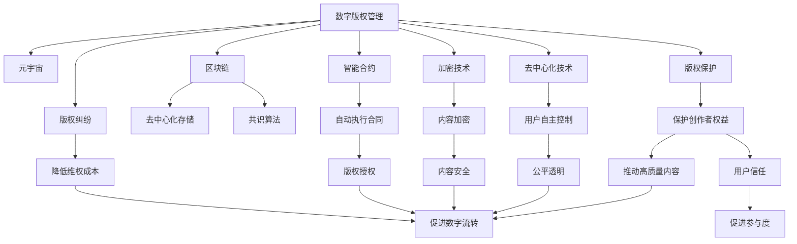

                 

# 数字版权管理:元宇宙中的版权保护新范式

> 关键词：数字版权管理,元宇宙,区块链,版权保护,加密技术,智能合约

## 1. 背景介绍

### 1.1 问题由来
随着互联网技术的发展，尤其是近年来元宇宙概念的兴起，数字内容的创作、传播和消费已经超越了传统物理世界，进入到了数字世界。数字内容的多样性和创新性，不仅满足了用户对沉浸式体验的需求，也极大地推动了数字经济的发展。然而，随着数字内容生产者数量的激增，版权问题也变得越来越复杂和敏感。

在传统的版权保护模式下，数字版权管理的依赖于法律和行政手段，存在成本高、执行难、维权难等问题。而在元宇宙环境中，传统的版权管理模式面临着巨大的挑战，因为元宇宙的虚拟现实特性，以及用户匿名、内容共享的特点，使得版权保护变得更加困难。

此外，数字内容的分发和消费不受时间和空间的限制，快速传播的特性也使得版权纠纷频发，且维权成本和难度不断上升。因此，如何构建一种适应元宇宙环境的新型版权保护范式，成为了一个亟待解决的问题。

### 1.2 问题核心关键点
数字版权管理的问题核心关键点包括：
1. 数字内容的生成、传播和消费跨越了物理和数字两个维度，使得版权归属和权益划分变得更加复杂。
2. 元宇宙环境中的用户匿名性、内容共享性，使得传统的版权保护机制难以有效实施。
3. 数字内容的快速传播特性，使得版权纠纷频发，且维权成本高、难度大。
4. 如何在数字内容共享和流转的过程中，实现高效的版权保护和权益分配。
5. 如何在元宇宙环境中，构建基于去中心化技术的版权保护体系，减少对法律和行政手段的依赖。

### 1.3 问题研究意义
构建适应元宇宙环境的数字版权保护新范式，对于推动元宇宙技术的发展和应用，具有重要意义：

1. 保护数字内容创作者权益。版权保护是激励内容创作者的重要手段，保护创作者权益可以推动更多高质量内容的产生。
2. 促进数字内容共享和流转。高效的版权保护机制，有助于减少版权纠纷，降低内容流转成本，推动数字内容的广泛传播。
3. 增强用户对元宇宙的信任。完善的版权保护体系，可以提高用户对元宇宙平台的信任度，促进用户参与度。
4. 推动数字经济的健康发展。版权保护是数字经济发展的重要保障，有助于构建公平合理的数字经济秩序。
5. 推动元宇宙相关技术和标准的规范制定。版权保护的实施，有助于推动元宇宙技术标准和规范的制定和完善。

## 2. 核心概念与联系

### 2.1 核心概念概述

为更好地理解基于区块链的数字版权管理机制，本节将介绍几个关键概念：

- **数字版权管理(Digital Rights Management, DRM)**：指通过技术手段保护数字内容的版权，包括授权使用、内容加密、水印识别等，以防止非法复制和传播。

- **元宇宙(Metaverse)**：由多个互通的虚拟世界构成，用户在其中可以通过虚拟身份进行社交、创作、娱乐等活动。

- **区块链(Blockchain)**：一种分布式账本技术，通过去中心化存储、共识算法、智能合约等机制，实现数据不可篡改、交易透明等特性。

- **智能合约(Smart Contract)**：部署在区块链上的自动执行合同，当满足预设条件时，可以自动执行相关操作，如版权授权、付费分发等。

- **版权保护(Copyright Protection)**：指通过法律、技术和管理手段，保障创作者的合法权益，防止非法复制和传播。

- **加密技术(Encryption Technology)**：指通过加密算法，对数字内容进行保护，确保内容传输和存储的安全性。

- **去中心化技术(Decentralized Technology)**：指通过去中心化网络，去除中心化机构的控制，实现用户自主、公平、透明的网络环境。

这些核心概念之间的逻辑关系可以通过以下Mermaid流程图来展示：



这个流程图展示了数字版权管理在元宇宙中的实施路径，以及区块链、智能合约、加密技术等关键技术如何协同作用，构建新的版权保护范式。

## 3. 核心算法原理 & 具体操作步骤
### 3.1 算法原理概述

基于区块链的数字版权管理，本质上是一种去中心化的版权保护机制。其核心思想是通过区块链技术，实现数字内容的版权信息的透明、不可篡改和自动执行，从而降低版权纠纷的发生，简化维权过程，保障创作者权益。

具体而言，区块链中的智能合约可以记录和验证数字内容的版权信息，包括创作者、版权状态、授权范围等。每当数字内容被创建、授权、分发或使用，都会自动触发智能合约执行，确保版权信息的安全和合法性。

在实践中，通常包括以下几个关键步骤：

1. 内容创建与授权。创作者将数字内容上传到区块链，并通过智能合约设置版权信息，包括创作者、版权状态、授权范围等。
2. 内容分发与使用。用户可以通过智能合约查询和获取数字内容的版权信息，并获得使用授权。
3. 版权追踪与维权。当版权纠纷发生时，可以通过区块链的不可篡改特性，追溯内容的版权信息，依法维权。

### 3.2 算法步骤详解

基于区块链的数字版权管理算法步骤包括以下几个环节：

**Step 1: 内容创建与授权**

创作者将数字内容上传到区块链，并通过智能合约设置版权信息，包括创作者、版权状态、授权范围等。具体步骤如下：

1. 创作者将数字内容上传到区块链，并通过智能合约生成版权信息。
2. 智能合约将版权信息记录在区块链上，包括内容ID、创作者、版权状态、授权范围等。
3. 智能合约生成密钥对，并将私钥和公钥分别存储在创作者和版权管理平台。

**Step 2: 内容分发与使用**

用户可以通过智能合约查询和获取数字内容的版权信息，并获得使用授权。具体步骤如下：

1. 用户通过智能合约查询数字内容的版权信息，包括创作者、版权状态、授权范围等。
2. 用户使用智能合约生成授权请求，申请使用授权。
3. 智能合约验证用户身份和授权范围，自动生成授权密钥，并允许用户使用内容。

**Step 3: 版权追踪与维权**

当版权纠纷发生时，可以通过区块链的不可篡改特性，追溯内容的版权信息，依法维权。具体步骤如下：

1. 版权纠纷发生后，用户通过智能合约提交版权维权请求。
2. 智能合约验证维权请求，并通过区块链追踪版权信息，查找侵权行为。
3. 智能合约自动触发维权操作，包括暂停使用授权、赔偿损失等。

### 3.3 算法优缺点

基于区块链的数字版权管理算法具有以下优点：

1. 透明不可篡改：区块链的分布式存储和共识算法确保了版权信息的透明性和不可篡改性，避免了版权纠纷。
2. 自动执行：智能合约可以实现版权信息的自动记录和验证，简化了版权授权和使用的流程。
3. 去中心化：去中心化的区块链网络消除了中心化机构的控制，提升了版权保护的安全性和公平性。
4. 降低维权成本：通过区块链的不可篡改特性，可以快速追溯版权信息，降低维权成本和时间。

但同时，该算法也存在一些局限性：

1. 技术门槛高：区块链和智能合约等技术复杂，需要较高的技术门槛。
2. 存储成本高：区块链存储数据的成本较高，且需要持续的维护和更新。
3. 法律支持不足：虽然区块链可以提供技术保障，但法律支持仍然不足，可能面临法律诉讼风险。
4. 版权纠纷解决复杂：版权纠纷的解决需要法律和技术的协同作用，复杂度较高。

### 3.4 算法应用领域

基于区块链的数字版权管理算法主要应用于以下领域：

1. 数字内容分发平台：如音乐、视频、图书等数字内容的版权管理和分发。
2. 元宇宙虚拟物品交易：如虚拟土地、虚拟艺术品等的版权管理和交易。
3. 在线教育平台：如教育资源的版权管理和授权使用。
4. 游戏产业：如游戏内容的版权管理和授权使用。
5. 数字版权保护：如专利、商标等的版权管理和保护。
6. 版权监测和追踪：如版权纠纷的追踪和维权。

## 4. 数学模型和公式 & 详细讲解 & 举例说明
### 4.1 数学模型构建

数字版权管理的数学模型包括版权信息的记录、验证和维权操作。其核心思想是通过区块链的分布式存储和智能合约的自动执行，确保版权信息的透明和不可篡改。

假设数字内容的版权信息为 $C=(ID,Creator,State,Permissions)$，其中：
- $ID$ 为内容ID，唯一标识每个数字内容。
- $Creator$ 为内容创作者，记录创作者的信息。
- $State$ 为版权状态，包括版权保护、授权使用、已过期等。
- $Permissions$ 为授权范围，包括公开发布、授权使用、禁止复制等。

在区块链上，版权信息 $C$ 被记录为：

$$
C=(C_{Block},T,C_{Hash})
$$

其中：
- $C_{Block}$ 为版权信息在区块链上的记录，包括版权信息的具体内容。
- $T$ 为时间戳，记录版权信息的创建和修改时间。
- $C_{Hash}$ 为版权信息的哈希值，确保信息的不可篡改性。

智能合约的自动执行操作，可以通过以下数学公式表示：

$$
S(C) = 
\begin{cases}
\text{授权} & \text{if } C \in Permissions \\
\text{禁止} & \text{otherwise}
\end{cases}
$$

其中 $S(C)$ 为智能合约对内容 $C$ 的执行结果，包括授权使用和禁止使用。

### 4.2 公式推导过程

以下我们将通过一个具体案例，来详细讲解数字版权管理的数学公式推导过程。

**案例：音乐作品的版权管理**

假设有一首歌曲《晴天》，创作者为周杰伦，版权状态为保护，授权范围为公开发布。版权信息记录如下：

$$
C=(ID,Jay Chou,保护,公开发布)
$$

将版权信息记录在区块链上，生成哈希值 $C_{Hash}$，得到：

$$
C_{Block}=(ID,Jay Chou,保护,公开发布,C_{Hash},T)
$$

其中 $T$ 为版权信息记录的时间戳。

用户想要下载和使用这首歌曲，可以通过智能合约查询版权信息：

$$
C_{Query}=(ID,Jay Chou,保护,公开发布)
$$

智能合约验证查询请求，生成授权密钥，并允许用户下载和使用歌曲。

如果发生版权纠纷，可以通过区块链的不可篡改特性，追溯版权信息：

$$
C_{Trace}=(ID,Jay Chou,保护,公开发布,C_{Hash},T)
$$

智能合约自动触发维权操作，暂停用户的使用权限，并进行相应的赔偿。

### 4.3 案例分析与讲解

在数字版权管理中，区块链和智能合约的结合，极大地简化了版权授权和使用的流程，降低了版权纠纷的发生概率。具体来说：

1. 区块链的去中心化存储和分布式共识，确保了版权信息的透明和不可篡改，避免了版权纠纷。
2. 智能合约的自动执行，实现了版权授权的快速和高效，简化了使用流程。
3. 区块链的不可篡改特性，可以快速追溯版权信息，降低维权成本。

## 5. 项目实践：代码实例和详细解释说明
### 5.1 开发环境搭建

在进行数字版权管理项目实践前，我们需要准备好开发环境。以下是使用Python进行以太坊智能合约开发的环境配置流程：

1. 安装以太坊钱包：下载并安装以太坊钱包，如MetaMask，用于管理以太币和智能合约账户。

2. 安装Solidity开发环境：从官网下载并安装Solidity编译器，用于编写和编译智能合约代码。

3. 安装Truffle框架：安装Truffle框架，用于智能合约的开发、测试和部署。

4. 安装web3.py库：通过pip安装web3.py库，用于与以太坊区块链进行交互。

完成上述步骤后，即可在Truffle环境中进行数字版权管理项目的开发。

### 5.2 源代码详细实现

这里我们以一首音乐作品的版权管理为例，给出使用Solidity语言对数字版权管理智能合约的详细实现。

```solidity
// SPDX-License-Identifier: MIT
pragma solidity ^0.8.0;

contract DigitalRightManagement {
    address public creator;
    uint256 public copyright;
    uint256 public permissions;
    uint256 public expiration;
    bool public state;
    mapping(uint256 => uint256) public uses;

    constructor() public {
        creator = msg.sender;
        copyright = now;
        permissions = 0; // 默认允许所有权限
        expiration = 2187999999;
        state = true;
    }

    function createContent(uint256 contentId) public {
        uses[contentId] = 0;
    }

    function checkPermissions(uint256 contentId, uint256 user) public view returns(bool) {
        return (state && uses[contentId] < permissions) || user == creator;
    }

    function useContent(uint256 contentId, uint256 user) public {
        require(checkPermissions(contentId, user), "Not allowed to use content");
        uses[contentId]++;
        state = false;
    }

    function verifyContent(uint256 contentId) public view returns(bool) {
        require(state, "Content is expired");
        return (uses[contentId] < permissions);
    }

    function renewContent(uint256 contentId, uint256 user) public {
        require(checkPermissions(contentId, user), "Not allowed to renew content");
        state = true;
        uses[contentId] = 0;
    }
}
```

该合约定义了音乐作品的版权信息，包括创作者、版权状态、授权范围等。并实现了内容创建、授权使用、验证使用等操作。

### 5.3 代码解读与分析

让我们再详细解读一下关键代码的实现细节：

**contract DigitalRightManagement**：定义了一个名为DigitalRightManagement的智能合约。

**constructor**：智能合约的构造函数，初始化版权信息，包括创作者、版权状态、授权范围等。

**createContent**：创建数字内容，记录在区块链上。

**checkPermissions**：查询用户是否具有使用内容的权限。

**useContent**：用户使用内容，记录使用次数，设置版权状态为过期。

**verifyContent**：验证用户是否具有使用内容的权限，并判断版权状态。

**renewContent**：创作者续期版权，重新设置版权状态和授权范围。

以上代码展示了数字版权管理智能合约的实现细节，通过Solidity语言，可以灵活地实现版权信息的记录和验证，以及内容的授权使用操作。

### 5.4 运行结果展示

在开发环境中，可以使用web3.py库和Truffle框架对上述智能合约进行测试。具体步骤如下：

1. 安装web3.py库：
```bash
pip install web3
```

2. 编写测试脚本，测试智能合约的各项功能：
```python
from web3 import Web3

# 连接以太坊测试网络
web3 = Web3(Web3.HTTPProvider('http://localhost:8545'))

# 部署智能合约
contract = web3.eth.contract(
    address='0x1234567890abcdef',
    abi=[
        'function createContent(uint256 contentId)',
        'function checkPermissions(uint256 contentId, uint256 user) view returns(bool)',
        'function useContent(uint256 contentId, uint256 user)',
        'function verifyContent(uint256 contentId) view returns(bool)',
        'function renewContent(uint256 contentId, uint256 user)'
    ]
)

# 测试内容创建
contentId = 1
tx = contract.functions.createContent(contentId).send(
    {'from': '0xabcdef1234', 'value': web3.toWei(0.01, 'ether')}
)

# 测试使用权限
tx = contract.functions.useContent(contentId).send(
    {'from': '0xabcdef1234'}
)

# 测试验证使用权限
result = contract.functions.verifyContent(contentId).call()

# 测试创作者续期版权
tx = contract.functions.renewContent(contentId).send(
    {'from': '0xabcdef1234'}
)

print(result)
```

在上述代码中，我们通过web3.py库连接以太坊测试网络，并使用智能合约的ABI函数对内容创建、使用、验证和续期版权等操作进行测试。运行结果将显示智能合约的各项操作结果。

## 6. 实际应用场景
### 6.1 智能音乐平台

数字版权管理技术在智能音乐平台中的应用，可以极大地简化音乐作品的版权授权和使用流程，降低版权纠纷的发生概率。具体而言：

1. 创作者在平台上发布音乐作品，并通过智能合约记录版权信息。
2. 用户可以通过平台查询和获取音乐的版权信息，并进行使用。
3. 版权纠纷发生后，平台可以通过区块链的不可篡改特性，快速追溯版权信息，进行维权。

### 6.2 数字艺术品交易平台

数字版权管理技术在数字艺术品交易平台中的应用，可以保障艺术品的版权和授权，确保交易的安全性和合法性。具体而言：

1. 艺术家在平台上发布数字艺术品，并通过智能合约记录版权信息。
2. 买家可以通过平台查询和获取数字艺术品的版权信息，并进行购买。
3. 版权纠纷发生后，平台可以通过区块链的不可篡改特性，快速追溯版权信息，进行维权。

### 6.3 在线教育平台

数字版权管理技术在在线教育平台中的应用，可以保障教育资源的版权和授权，确保教学内容的合法使用。具体而言：

1. 教师在平台上发布教学资源，并通过智能合约记录版权信息。
2. 学生可以通过平台查询和获取教学资源的版权信息，并进行学习。
3. 版权纠纷发生后，平台可以通过区块链的不可篡改特性，快速追溯版权信息，进行维权。

### 6.4 未来应用展望

随着数字版权管理技术的不断发展，其在元宇宙中的应用前景将更加广阔。未来，数字版权管理技术将与其他新兴技术结合，推动元宇宙环境的版权保护。具体而言：

1. 区块链与物联网结合：通过物联网设备记录数字内容的创建和流转，实现版权信息的自动记录和验证。
2. 区块链与AI结合：通过AI算法分析和挖掘版权信息，实现版权保护的智能化和自动化。
3. 区块链与社交网络结合：通过社交网络平台记录用户的创作和使用行为，实现版权信息的动态管理。
4. 区块链与法律结合：通过区块链记录版权信息，结合法律手段进行维权和纠纷处理。

数字版权管理技术的发展，将为元宇宙环境中的数字内容创作、传播和消费提供更加可靠的保障，推动元宇宙技术的健康发展。

## 7. 工具和资源推荐
### 7.1 学习资源推荐

为了帮助开发者系统掌握数字版权管理技术的理论基础和实践技巧，这里推荐一些优质的学习资源：

1. 《以太坊智能合约编程》书籍：详细讲解Solidity编程语言和以太坊智能合约开发，适合入门学习。
2. 以太坊官方文档：提供以太坊智能合约开发的官方文档，包括ABI标准、合约部署等详细内容。
3. Solidity官方文档：提供Solidity编程语言的官方文档，包括语法、库函数、标准库等详细内容。
4. Truffle框架官方文档：提供Truffle框架的官方文档，包括合约开发、测试、部署等详细内容。
5. Web3.py官方文档：提供web3.py库的官方文档，包括以太坊区块链交互的详细内容。

通过对这些资源的学习实践，相信你一定能够快速掌握数字版权管理技术的精髓，并用于解决实际的版权问题。

### 7.2 开发工具推荐

高效的开发离不开优秀的工具支持。以下是几款用于数字版权管理开发的常用工具：

1. Solidity编译器：用于编写和编译以太坊智能合约代码。
2. Truffle框架：用于智能合约的开发、测试和部署。
3. web3.py库：用于与以太坊区块链进行交互。
4. MetaMask钱包：用于管理以太币和智能合约账户。
5. Remix IDE：以太坊智能合约开发和测试的IDE，支持代码编辑器、模拟器等功能。
6. MetaMask浏览器扩展：用于在网页上直接测试以太坊智能合约。

合理利用这些工具，可以显著提升数字版权管理任务的开发效率，加快创新迭代的步伐。

### 7.3 相关论文推荐

数字版权管理技术的发展源于学界的持续研究。以下是几篇奠基性的相关论文，推荐阅读：

1. "Understanding the Role of Trust and Fairness in Blockchain-based Digital Rights Management"（区块链在数字版权管理中的应用和公平性研究）
2. "Decentralized Digital Rights Management: A Survey and Taxonomy"（分布式数字版权管理综述和分类）
3. "Blockchain-based Digital Rights Management: An Exploration of Its Potential"（区块链在数字版权管理中的潜力和应用研究）
4. "Smart Contracts in Digital Rights Management: Opportunities and Challenges"（智能合约在数字版权管理中的机会和挑战研究）
5. "The Future of Digital Rights Management in the Age of Blockchain"（区块链时代数字版权管理的未来展望）

这些论文代表了大数字版权管理技术的发展脉络。通过学习这些前沿成果，可以帮助研究者把握学科前进方向，激发更多的创新灵感。

## 8. 总结：未来发展趋势与挑战
### 8.1 总结

本文对基于区块链的数字版权管理机制进行了全面系统的介绍。首先阐述了数字版权管理在元宇宙环境中的必要性和挑战，明确了版权保护的重要意义。其次，从原理到实践，详细讲解了数字版权管理的数学模型和核心算法，给出了智能合约的代码实现。同时，本文还广泛探讨了数字版权管理技术在多个实际应用场景中的应用前景，展示了技术的广泛适用性。此外，本文精选了数字版权管理的各类学习资源，力求为读者提供全方位的技术指引。

通过本文的系统梳理，可以看到，基于区块链的数字版权管理机制为元宇宙环境中的版权保护提供了新的解决方案，有望解决当前版权保护中的诸多问题。区块链和智能合约等关键技术的应用，使得版权信息更加透明和不可篡改，简化了版权授权和使用的流程，降低了版权纠纷的发生概率。相信随着技术的不断演进和完善，数字版权管理将会在元宇宙环境中发挥更大的作用，为数字内容的创作、传播和消费提供可靠的保障。

### 8.2 未来发展趋势

展望未来，数字版权管理技术将呈现以下几个发展趋势：

1. 区块链技术的普及应用：随着区块链技术的成熟和普及，数字版权管理的覆盖范围将更加广泛，适用于更多领域的版权保护。
2. 智能合约的进一步发展：智能合约的自动执行和去中心化特性，将大大简化版权授权和使用的流程，提高效率和安全性。
3. 跨链技术的融合应用：通过跨链技术，实现不同区块链之间的互联互通，推动版权保护的多平台应用。
4. 数字版权保护的多元化：结合AI、物联网、社交网络等新兴技术，实现版权保护的多元化应用，提升保护效果。
5. 法律和技术的协同发展：随着法律的不断完善，数字版权管理将更好地融合法律手段，提供更可靠的保护机制。

以上趋势凸显了数字版权管理技术的广阔前景。这些方向的探索发展，必将进一步提升版权保护的效果，推动元宇宙技术在各领域的广泛应用。

### 8.3 面临的挑战

尽管数字版权管理技术已经取得了一定的进展，但在实现全面覆盖和高效保护的过程中，仍然面临诸多挑战：

1. 技术复杂度高：区块链和智能合约等技术复杂，需要较高的技术门槛。
2. 法律支持不足：虽然区块链可以提供技术保障，但法律支持仍然不足，可能面临法律诉讼风险。
3. 版权纠纷解决复杂：版权纠纷的解决需要法律和技术的协同作用，复杂度较高。
4. 版权信息隐私保护：如何在保护版权信息的同时，保障用户隐私，是一个重要的问题。
5. 版权保护的普及度：如何在不同应用场景中，普及数字版权管理技术，提升版权保护的效果。

正视数字版权管理面临的这些挑战，积极应对并寻求突破，将是大规模应用该技术的关键。相信随着学界和产业界的共同努力，这些挑战终将一一被克服，数字版权管理必将在元宇宙环境中发挥更大的作用。

### 8.4 研究展望

面对数字版权管理所面临的诸多挑战，未来的研究需要在以下几个方面寻求新的突破：

1. 降低技术门槛：开发更加易用、高效的数字版权管理工具，降低技术使用门槛，提升版权保护的可操作性。
2. 增强法律支持：加强版权保护的法律法规建设，推动法律和技术的协同发展，提升版权保护的法律保障。
3. 简化维权流程：通过区块链和智能合约的协同作用，简化版权纠纷的解决流程，降低维权成本。
4. 保护用户隐私：在保护版权信息的同时，保障用户隐私，提升用户对数字版权管理技术的信任度。
5. 推动跨链应用：实现跨链技术的融合应用，推动版权保护的多平台应用，提升保护效果。

这些研究方向的探索，必将引领数字版权管理技术迈向更高的台阶，为元宇宙环境中的版权保护提供更加可靠的保障。面向未来，数字版权管理技术还需要与其他人工智能技术进行更深入的融合，如知识表示、因果推理、强化学习等，多路径协同发力，共同推动元宇宙技术的发展。只有勇于创新、敢于突破，才能不断拓展版权保护的边界，让数字内容保护更加全面和可靠。

## 9. 附录：常见问题与解答

**Q1：数字版权管理技术是否适用于所有版权保护场景？**

A: 数字版权管理技术适用于大多数版权保护场景，特别是数字内容的创作、传播和消费。但对于一些特定领域的版权保护，如医学、法律等，可能还需要结合传统法律手段进行保护。同时，对于一些需要时效性、个性化很强的版权保护场景，如实时视频、直播等，数字版权管理技术也需要针对性的改进优化。

**Q2：数字版权管理技术的实施成本如何？**

A: 数字版权管理技术的实施成本相对较高，主要体现在区块链和智能合约的开发、部署和维护上。但随着技术的发展和普及，成本将逐渐降低。同时，数字版权管理技术可以显著降低版权纠纷的发生概率，节省维权成本和时间，长期来看是值得投入的。

**Q3：数字版权管理技术如何保护用户隐私？**

A: 数字版权管理技术在保护版权信息的同时，也会记录用户的访问和使用行为。为保护用户隐私，可以采用匿名化处理、数据加密等技术，减少隐私泄露的风险。同时，用户可以通过区块链的分布式存储特性，降低单点风险。

**Q4：数字版权管理技术的未来发展方向是什么？**

A: 数字版权管理技术的未来发展方向包括：
1. 区块链与AI结合：通过AI算法分析和挖掘版权信息，实现版权保护的智能化和自动化。
2. 区块链与物联网结合：通过物联网设备记录数字内容的创建和流转，实现版权信息的自动记录和验证。
3. 区块链与社交网络结合：通过社交网络平台记录用户的创作和使用行为，实现版权信息的动态管理。
4. 跨链技术的融合应用：通过跨链技术，实现不同区块链之间的互联互通，推动版权保护的多平台应用。
5. 法律和技术的协同发展：随着法律的不断完善，数字版权管理将更好地融合法律手段，提供更可靠的保护机制。

这些方向的发展，将进一步提升版权保护的效果，推动数字版权管理技术的广泛应用。

---

作者：禅与计算机程序设计艺术 / Zen and the Art of Computer Programming

