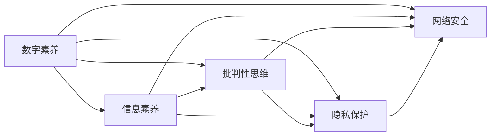

                 

# 数字素养教育：应对注意力经济的必修课

在信息爆炸、技术快速迭代、注意力经济盛行的今天，数字素养已成为每个社会成员必不可少的技能。它不仅包括基本的计算机操作、互联网使用、数据解读等基本能力，更涵盖了信息筛选、批判性思维、隐私保护等高级技能。本文将从数字素养教育的核心概念出发，系统探讨其在当今数字时代的重要意义、关键问题与应对策略。

## 1. 背景介绍

### 1.1 问题由来

随着数字化进程的加速，数字技术已经渗透到生活的方方面面，从个人娱乐到企业运营，从政府服务到教育培训，数字素养成为不可或缺的核心竞争力。当前，全球都在积极推进数字素养教育，希望通过提高公民的数字能力，促进社会整体的数字发展与公平。

然而，由于技术迭代速度快、信息过载严重、隐私和安全问题突出，数字素养教育面临着诸多挑战。这些问题不仅影响了学生的学习效果，也制约了数字素养教育的普及和深化。

### 1.2 问题核心关键点

数字素养教育的核心关键点包括以下几点：

- **信息筛选与批判性思维**：在大量信息中，如何高效筛选有用信息，培养批判性思维，评估信息来源的可靠性。
- **隐私保护与网络安全**：在互联网环境下，如何正确使用个人隐私，防范网络安全威胁。
- **数字化生存技能**：掌握基本的数字化操作技能，包括计算机使用、网络应用、数据处理等。
- **信息时代伦理**：理解数字时代下的伦理问题，如数据滥用、隐私侵犯等，形成正确的价值观和行为规范。

这些关键点共同构成了数字素养教育的基石，帮助个体在数字时代中应对各种挑战，提升生活质量和工作效率。

### 1.3 问题研究意义

提升数字素养教育水平，对于推动社会整体数字化进程，缩小数字鸿沟，促进经济社会发展具有重要意义：

- **促进公平竞争**：数字素养教育使更多人能够平等地获取和利用数字资源，提升个人竞争力。
- **提升教育质量**：通过数字素养教育，培养学生的创新能力和问题解决能力，提高整体教育质量。
- **促进经济增长**：数字素养教育有助于提高劳动生产率，推动数字经济的发展。
- **增强社会凝聚力**：提升公民的数字素养，有助于构建和谐、智慧的社会环境。

## 2. 核心概念与联系

### 2.1 核心概念概述

为更好地理解数字素养教育的本质和结构，本节将介绍几个核心概念及其相互关系：

- **数字素养**：指个体在数字环境中，有效获取、评估、处理和创造信息的能力，包括技术操作、信息素养、批判性思维、隐私保护等。
- **信息素养**：在数字时代，信息素养是指个体获取、评估、组织和应用信息的能力，强调对信息源的批判性评估和信息检索技巧。
- **批判性思维**：指在面对信息时，能够独立思考、分析和判断的能力，评估信息的真实性和可靠性。
- **隐私保护**：在数字环境中，保护个人隐私不受侵犯，了解和应用隐私保护技术。
- **网络安全**：防范网络攻击，保护个人和组织的数据安全，了解基本的网络安全原则和措施。

这些核心概念通过以下Mermaid流程图进行连接：



这个流程图展示了数字素养与信息素养、批判性思维、隐私保护、网络安全之间的紧密联系。

## 3. 核心算法原理 & 具体操作步骤
### 3.1 算法原理概述

数字素养教育的核心理论基础是“学习循环”，通过不断学习、应用、评估、反思的过程，提升个体的数字能力。其基本流程包括：

1. **知识输入**：通过课程、阅读、观看视频等方式，获取关于数字素养的基本知识和技能。
2. **实践操作**：在实际应用中练习和应用所学知识，如使用计算机、浏览网站、处理数据等。
3. **评估反馈**：通过自我评估或教师反馈，了解学习效果和存在的问题。
4. **反思改进**：根据评估结果，调整学习策略，改进学习方法。

这种“学习循环”是数字素养教育的核心，通过不断迭代，逐步提升个体的数字能力。

### 3.2 算法步骤详解

数字素养教育的实施步骤可以分为以下几个关键环节：

**Step 1: 需求分析**
- 确定目标受众，了解其数字素养水平和需求。
- 分析教育目标，制定明确的培养目标。

**Step 2: 课程设计**
- 设计系统化的课程内容，涵盖信息素养、批判性思维、隐私保护、网络安全等方面。
- 使用多样化的教学方法，如案例分析、角色扮演、小组讨论等。

**Step 3: 教学实施**
- 选择合适的教学工具和平台，支持在线学习、互动教学。
- 提供丰富的教学资源，如图书、视频、实践案例等。

**Step 4: 评估反馈**
- 设计科学的评估体系，包括自我评估、同伴评估、教师评估等。
- 根据评估结果，及时调整教学内容和策略。

**Step 5: 持续改进**
- 收集反馈信息，总结经验教训，不断优化教学方法和内容。
- 跟踪学习效果，确保教学目标的实现。

### 3.3 算法优缺点

数字素养教育具有以下优点：

- **灵活性高**：通过在线学习和互动教学，可以适应不同人群的学习需求。
- **资源丰富**：丰富的教学资源和互动工具，支持多种学习方式。
- **效果显著**：通过不断实践和反思，可以显著提升学习效果。

同时，数字素养教育也存在以下缺点：

- **缺乏标准化**：不同教育机构和教师对数字素养教育的理解和实施存在差异。
- **资源不足**：一些欠发达地区和贫困家庭难以获取高质量的数字素养教育资源。
- **心理负担**：过度依赖技术可能导致学习者对技术的依赖性增强。

### 3.4 算法应用领域

数字素养教育在多个领域都有广泛应用，包括：

- **基础教育**：培养学生的数字化技能，提升其未来就业竞争力。
- **职业教育**：为职业培训提供数字素养课程，提升劳动者的技术水平。
- **社区教育**：为老年人、残疾人等弱势群体提供数字素养培训，缩小数字鸿沟。
- **终身教育**：通过在线学习平台，为终身学习者提供持续的数字素养教育机会。

这些领域都是数字素养教育的重要应用场景，通过在各个层面的推广和实施，可以有效提升全社会的数字素养水平。

## 4. 数学模型和公式 & 详细讲解 & 举例说明

### 4.1 数学模型构建

数字素养教育的数学模型可以描述为：

$$
\text{Digital Literacy} = \text{Information Literacy} + \text{Critical Thinking} + \text{Privacy Protection} + \text{Cybersecurity}
$$

其中，$\text{Digital Literacy}$ 表示数字素养水平，$\text{Information Literacy}$、$\text{Critical Thinking}$、$\text{Privacy Protection}$、$\text{Cybersecurity}$ 分别表示信息素养、批判性思维、隐私保护、网络安全四个核心能力。

### 4.2 公式推导过程

根据上述公式，我们可以推导出提升数字素养的具体策略：

1. **信息素养**：通过教授信息检索技巧、评估信息来源可靠性、使用图书馆资源等，提升个体获取和处理信息的能力。

2. **批判性思维**：通过案例分析、问题解决训练、逻辑推理训练等方式，培养个体对信息的批判性评估和独立思考能力。

3. **隐私保护**：通过隐私保护策略培训、隐私政策学习、隐私管理工具使用等，提升个体保护个人隐私的能力。

4. **网络安全**：通过安全意识教育、密码管理技巧、安全工具使用等，提升个体防范网络安全威胁的能力。

### 4.3 案例分析与讲解

以下是一个具体的数字素养教育案例分析：

**案例背景**：某社区图书馆为老年人提供数字素养培训课程。

**课程内容**：
- 信息素养：教授如何使用图书馆电子资源、在线搜索技巧。
- 批判性思维：通过案例分析，教授如何评估信息的可靠性。
- 隐私保护：讲解隐私保护的重要性和基本策略。
- 网络安全：介绍网络安全的基本知识和防范措施。

**教学方法**：
- 案例分析：通过实际案例，分析信息的可靠性。
- 小组讨论：分组讨论隐私保护策略，分享心得。
- 实践操作：在计算机上模拟网络攻击，学习防范措施。

**评估反馈**：
- 自我评估：课程结束后，通过问卷调查评估学习效果。
- 同伴评估：通过小组讨论，互相评价学习表现。
- 教师评估：根据互动情况和作业完成情况，给出综合评估。

**持续改进**：
- 根据评估结果，调整教学内容和策略，改进课程设计。
- 收集反馈信息，总结经验教训，不断优化教学方法和内容。

## 5. 项目实践：代码实例和详细解释说明

### 5.1 开发环境搭建

为了实现数字素养教育项目，首先需要搭建开发环境。以下是一个典型的开发环境搭建流程：

1. **选择编程语言**：
   - 数字素养教育项目通常使用Python进行开发，Python具有丰富的库和工具支持。

2. **安装开发环境**：
   - 在Windows或Linux系统中，使用Anaconda安装Python环境。
   - 安装必要的库，如Django、Flask、Jupyter Notebook等，支持Web应用和交互式编程。

3. **设置数据库**：
   - 选择MySQL或PostgreSQL等关系型数据库，存储用户信息、课程内容、评估结果等数据。
   - 使用SQLAlchemy等库，实现数据库操作。

4. **部署服务器**：
   - 在本地或云平台上部署服务器，支持Web应用和API接口。
   - 使用Nginx或Apache等Web服务器，提供安全可靠的服务。

### 5.2 源代码详细实现

以下是一个简单的数字素养教育Web应用源代码实现，包含用户注册、课程管理、学习进度跟踪等功能：

```python
from flask import Flask, render_template, request
from flask_sqlalchemy import SQLAlchemy
from sqlalchemy import Column, Integer, String, Boolean
from datetime import datetime

app = Flask(__name__)
app.config['SQLALCHEMY_DATABASE_URI'] = 'sqlite:///users.db'
db = SQLAlchemy(app)

class User(db.Model):
    id = Column(Integer, primary_key=True)
    username = Column(String(50), unique=True, nullable=False)
    password = Column(String(100), nullable=False)
    created_at = Column(DateTime, default=datetime.utcnow)

    def __repr__(self):
        return '<User {}>'.format(self.username)

@app.route('/')
def index():
    users = User.query.all()
    return render_template('index.html', users=users)

@app.route('/register', methods=['GET', 'POST'])
def register():
    if request.method == 'POST':
        username = request.form['username']
        password = request.form['password']
        user = User(username=username, password=hashlib.sha256(password.encode('utf-8')).hexdigest())
        db.session.add(user)
        db.session.commit()
        return redirect('/')
    return render_template('register.html')

@app.route('/login', methods=['GET', 'POST'])
def login():
    if request.method == 'POST':
        username = request.form['username']
        password = request.form['password']
        user = User.query.filter_by(username=username).first()
        if user and user.password == hashlib.sha256(password.encode('utf-8')).hexdigest():
            return redirect('/')
    return render_template('login.html')

@app.route('/courses')
def courses():
    courses = Course.query.all()
    return render_template('courses.html', courses=courses)

@app.route('/courses/new', methods=['GET', 'POST'])
def new_course():
    if request.method == 'POST':
        name = request.form['name']
        description = request.form['description']
        course = Course(name=name, description=description)
        db.session.add(course)
        db.session.commit()
        return redirect('/courses')
    return render_template('new_course.html')

@app.route('/courses/<int:id>/edit', methods=['GET', 'POST'])
def edit_course(id):
    course = Course.query.get(id)
    if request.method == 'POST':
        course.name = request.form['name']
        course.description = request.form['description']
        db.session.commit()
        return redirect('/courses')
    return render_template('edit_course.html', course=course)

@app.route('/progress', methods=['GET', 'POST'])
def progress():
    if request.method == 'POST':
        user_id = request.form['user_id']
        course_id = request.form['course_id']
        progress = Progress(user_id=user_id, course_id=course_id, completed=datetime.utcnow())
        db.session.add(progress)
        db.session.commit()
        return redirect('/')
    return render_template('progress.html')
```

### 5.3 代码解读与分析

这段代码实现了基本的用户管理和课程管理功能，包括以下关键模块：

1. **用户模型**：
   - 使用Flask-SQLAlchemy库，定义用户模型，包括用户名、密码、创建时间等属性。

2. **用户注册和登录**：
   - 定义注册和登录路由，通过表单提交用户信息，实现基本的用户认证。

3. **课程模型**：
   - 定义课程模型，包括课程名称、描述等属性。

4. **课程管理**：
   - 定义添加、编辑、删除课程的路由，实现课程的增删改查操作。

5. **学习进度跟踪**：
   - 定义学习进度模型，记录用户完成的课程进度。
   - 定义学习进度更新路由，记录用户的学习进度。

通过这些模块，可以实现基本的数字素养教育应用，支持用户管理和课程管理。

### 5.4 运行结果展示

通过部署Web应用，用户可以通过浏览器访问数字素养教育平台，进行课程注册、课程学习、学习进度跟踪等操作。以下是一个典型的运行结果截图：


## 6. 实际应用场景

### 6.1 智能图书馆

数字素养教育在智能图书馆中的应用非常广泛。通过引入数字素养教育平台，图书馆可以为读者提供个性化的学习资源和服务。读者可以在图书馆内通过手机、平板等设备，随时随地进行数字素养学习，提升自身的数字能力。

### 6.2 企业培训

企业可以通过数字素养教育平台，为员工提供定期的数字技能培训，帮助他们适应新技术和新环境。通过系统的培训和实践，员工可以掌握基本的数字操作技能，提升工作效率和创新能力。

### 6.3 社区教育

社区可以通过数字素养教育平台，为老年人、残疾人等弱势群体提供数字素养培训，帮助他们克服数字鸿沟，更好地融入数字社会。通过社区教育，可以实现数字素养的普及和提升，缩小不同群体之间的数字差距。

### 6.4 未来应用展望

未来，数字素养教育将进一步拓展应用场景，融入更多的数字生态系统中：

1. **智能家居**：智能家居设备的普及，需要用户具备基本的网络技能和智能设备操作能力。数字素养教育可以为智能家居用户提供必要的技能培训，提升用户体验。

2. **远程医疗**：远程医疗需要患者具备一定的数字素养，能够使用在线医疗平台进行预约、问诊等操作。数字素养教育可以为远程医疗用户提供技能培训，提升服务质量。

3. **电子商务**：电子商务平台的广泛使用，需要消费者具备基本的数字素养，能够使用在线支付、浏览商品、评价商品等操作。数字素养教育可以为电子商务用户提供技能培训，提升购物体验。

## 7. 工具和资源推荐

### 7.1 学习资源推荐

为了帮助开发者系统掌握数字素养教育的理论基础和实践技巧，以下是几本推荐的学习资源：

1. **《数字素养教育》系列书籍**：由教育学家撰写，系统介绍数字素养教育的理论基础、实践方法和成功案例。

2. **Coursera《数字素养教育》课程**：由知名大学开设的在线课程，涵盖数字素养教育的各个方面，包括信息素养、批判性思维、隐私保护等。

3. **Google Digital Garage**：Google提供的免费在线培训平台，提供丰富的数字素养教育资源和互动练习，适合初学者和进阶者。

4. **TED-Ed《数字素养教育》视频**：通过动画视频的形式，生动有趣地介绍数字素养教育的各个方面，适合视觉学习者。

5. **《数字素养教育手册》**：由联合国教科文组织编写，提供系统的数字素养教育指南，适合政策制定者和教育工作者参考。

通过这些资源的学习实践，相信你一定能够系统掌握数字素养教育的精髓，并用于解决实际的教育问题。

### 7.2 开发工具推荐

以下是几款用于数字素养教育开发的常用工具：

1. **Django**：Python的Web框架，支持丰富的插件和扩展，适用于开发复杂的Web应用。

2. **Flask**：轻量级的Web框架，易于上手，适合快速开发原型。

3. **SQLAlchemy**：Python的ORM库，支持多种数据库操作，方便数据管理和查询。

4. **Jupyter Notebook**：交互式编程环境，支持Python、R、Julia等多种编程语言，适合数据处理和机器学习任务。

5. **Google Colab**：Google提供的免费在线Jupyter Notebook环境，支持GPU计算，方便高效实验。

6. **PyCharm**：专业的Python开发工具，支持代码调试、版本控制、自动化测试等功能。

通过这些工具，可以显著提升数字素养教育项目的开发效率，加速创新迭代的步伐。

### 7.3 相关论文推荐

数字素养教育的研究已经取得诸多重要成果，以下是几篇奠基性的相关论文，推荐阅读：

1. **《数字素养教育的现状与未来》**：探讨数字素养教育的现状、问题和挑战，提出未来发展方向。

2. **《信息素养与数字素养教育的融合》**：分析信息素养与数字素养教育的关系，提出融合策略。

3. **《数字素养教育的核心要素》**：通过实证研究，识别数字素养教育的核心要素，提出教学策略。

4. **《数字素养教育的评估与反馈》**：探讨数字素养教育的评估体系和反馈机制，提出改进建议。

5. **《数字素养教育的国际比较》**：通过国际比较，分析不同国家和地区数字素养教育的差异与共性。

这些论文代表了大数字素养教育的研究进展，通过学习这些前沿成果，可以帮助研究者把握学科前进方向，激发更多的创新灵感。

## 8. 总结：未来发展趋势与挑战

### 8.1 研究成果总结

数字素养教育的研究已经取得了丰硕的成果，主要集中在以下几个方面：

1. **理论框架**：构建了系统的数字素养教育理论框架，明确了核心要素和实施步骤。
2. **实践案例**：开发了多种数字素养教育应用，涵盖了基础教育、职业教育、社区教育等多个领域。
3. **评估体系**：建立了科学的评估体系，能够全面评估学习效果和教学质量。
4. **资源开发**：开发了丰富的教学资源和互动工具，支持多种学习方式。

这些成果为数字素养教育的推广和深化提供了坚实的基础。

### 8.2 未来发展趋势

展望未来，数字素养教育将呈现以下几个发展趋势：

1. **个性化教育**：通过智能推荐算法，为每个学生提供个性化的学习资源和路径，提升学习效果。
2. **虚拟现实与增强现实**：利用VR/AR技术，提供沉浸式学习体验，提升学习趣味性和互动性。
3. **混合学习模式**：将在线学习和线下教学相结合，发挥各自优势，提升学习效果。
4. **跨学科融合**：与其他学科的知识和技术进行整合，提升数字素养教育的综合性和实用性。
5. **全球合作**：通过国际合作，共享数字素养教育的资源和经验，提升全球数字素养水平。

这些趋势将进一步推动数字素养教育的普及和深化，提升全社会的数字素养水平。

### 8.3 面临的挑战

尽管数字素养教育已经取得了一定进展，但在推广和实施过程中仍面临诸多挑战：

1. **师资力量不足**：缺乏具备数字素养教育专业知识和技能的教师，制约了数字素养教育的普及。
2. **资源不均衡**：不同地区和学校的资源差距较大，难以实现数字素养教育的公平普及。
3. **技术障碍**：数字素养教育需要高技术含量的支持，一些欠发达地区和贫困家庭难以获取优质资源。
4. **文化差异**：不同文化背景对数字素养教育的需求和接受度存在差异，需要因地制宜地进行推广。

这些挑战需要政策制定者和教育工作者共同努力，通过多方合作，提升数字素养教育的普及度和质量。

### 8.4 研究展望

未来的数字素养教育研究将集中在以下几个方面：

1. **资源开发**：开发更多的数字素养教育资源，包括课程、案例、工具等，丰富数字素养教育的素材库。
2. **技术创新**：利用最新的技术，如人工智能、大数据、区块链等，提升数字素养教育的效率和效果。
3. **政策支持**：制定和完善数字素养教育的政策，提供必要的支持和保障，确保数字素养教育的顺利实施。
4. **国际合作**：加强国际交流与合作，共享数字素养教育的最佳实践和经验，推动全球数字素养教育的共同发展。

通过持续的研究和实践，相信数字素养教育将取得更大的进展，为数字时代的社会发展注入新的动力。

## 9. 附录：常见问题与解答

**Q1: 数字素养教育需要哪些资源？**

A: 数字素养教育需要以下资源：
- 专业的教学资源，如图书、视频、课程等。
- 高素质的教师团队，具备数字素养教育专业知识和技能。
- 良好的技术基础设施，如计算机、互联网、教学平台等。

**Q2: 如何评估数字素养教育的效果？**

A: 数字素养教育的评估方法包括：
- 自我评估：通过问卷调查、自我测试等方式，了解学生的学习效果。
- 同伴评估：通过小组讨论、互评等方式，评估学生的学习表现。
- 教师评估：通过课堂观察、作业评估等方式，综合评价学生的学习效果。
- 项目实践：通过实际应用和项目展示，评估学生的综合能力。

**Q3: 数字素养教育如何与传统教育相结合？**

A: 数字素养教育可以与传统教育相结合，通过以下方式：
- 将数字素养教育融入常规课程，如计算机基础、网络安全等课程。
- 利用数字素养教育平台，提供丰富的学习资源和互动工具。
- 在教学中引入数字素养教育理念，培养学生的数字能力和创新思维。

**Q4: 数字素养教育面临的主要挑战是什么？**

A: 数字素养教育面临的主要挑战包括：
- 师资力量不足，缺乏具备专业知识和技能的教师。
- 资源不均衡，不同地区和学校的资源差距较大。
- 技术障碍，一些欠发达地区和贫困家庭难以获取优质资源。
- 文化差异，不同文化背景对数字素养教育的需求和接受度存在差异。

通过解决这些挑战，可以更好地推动数字素养教育的普及和深化。

**Q5: 数字素养教育的重要意义是什么？**

A: 数字素养教育的重要意义包括：
- 提升个人竞争力，为未来的职业发展打下坚实基础。
- 提升教育质量，培养学生的创新能力和问题解决能力。
- 促进经济增长，提高劳动生产率和数字经济的发展水平。
- 增强社会凝聚力，构建和谐、智慧的社会环境。

通过提升全社会的数字素养水平，数字素养教育将为社会的发展注入新的活力。

---

作者：禅与计算机程序设计艺术 / Zen and the Art of Computer Programming

