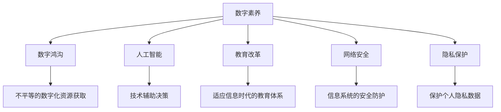

                 

# 数字素养：公民参与的基石

> 关键词：数字素养, 公民参与, 人工智能, 教育改革, 网络安全, 隐私保护

## 1. 背景介绍

随着信息技术在各个领域的深入应用，数字素养已经成为现代公民必须具备的基本能力。数字素养不仅关乎个体在数字化时代的生存和发展，更直接关系到国家在全球化、信息化时代的竞争力。从教育、医疗、金融到政府治理，各领域都在加速数字化转型，对公民的科技意识、操作技能和信息素养提出了更高的要求。

### 1.1 数字素养的核心内容

数字素养是公民使用和理解数字技术的能力，包括但不限于：

- **信息获取**：通过网络搜索、在线图书馆、社交媒体等途径获取信息。
- **数字工具**：熟练使用各种数字工具和软件，如办公软件、互联网浏览器、电子邮件等。
- **网络交流**：通过电子邮件、社交网络、即时通讯工具等与他人在线交流。
- **数据素养**：理解数据的基本概念，能够收集、分析、解释和可视化数据。
- **信息安全**：了解网络安全的基本知识，能够保护个人信息和隐私，识别和防范网络欺诈。
- **批判性思维**：对数字信息的真实性、可靠性进行评估，避免受到虚假信息的影响。
- **技术创新**：了解新兴技术的发展趋势，能够适应变化，创新使用新技术。

### 1.2 数字素养与公民参与

在数字时代，公民的数字素养水平直接影响其参与社会和公共事务的能力。数字化环境为公民提供了更多参与公共决策、政策讨论、社会事务的渠道和平台，但同时也对公民的数字素养提出了更高的要求。只有具备较高的数字素养，公民才能有效地使用这些平台，发挥其参与社会治理的作用。

## 2. 核心概念与联系

### 2.1 核心概念概述

- **数字素养**：指公民使用和理解数字技术的能力。
- **数字鸿沟**：不同群体间在获取和使用数字资源方面的不平等现象。
- **人工智能**：通过模拟人类智能实现自主决策、学习和推理的技术。
- **教育改革**：旨在提升教育质量，适应信息时代对教育的新需求。
- **网络安全**：保护信息系统和数据免受未经授权的访问、破坏、更改和泄露。
- **隐私保护**：保护个人数据的隐私，防止数据被滥用。

这些概念之间的逻辑关系可以通过以下Mermaid流程图来展示：



这个流程图展示了大语言模型的核心概念及其之间的关系：

1. 数字素养是基础，为公民使用数字资源提供必要技能。
2. 人工智能通过技术手段辅助公民决策和参与。
3. 教育改革提升公民的数字素养水平。
4. 网络安全和隐私保护保障数字参与的安全性。
5. 数字鸿沟影响公民的平等参与能力。

## 3. 核心算法原理 & 具体操作步骤
### 3.1 算法原理概述

数字素养的教育和提升，本质上是一个知识传递和技能训练的过程。通过基于人工智能的个性化学习平台，可以提供更加贴合个体需求的定制化教育内容。这种教育方式不仅高效，还能促进学习的自主性和积极性。

具体而言，数字素养的提升包括两个主要步骤：

1. **知识传授**：通过视频、互动教程、在线课程等形式，向公民传授数字知识和技能。
2. **技能训练**：通过模拟实践、情景模拟、真实应用等手段，提升公民的操作能力和应用水平。

### 3.2 算法步骤详解

数字素养提升的算法流程主要包括以下几个关键步骤：

**Step 1: 数据收集与分析**
- 收集公民在各个领域中遇到的具体数字素养问题，如如何使用电子邮件、搜索互联网信息、理解数据分析等。
- 分析这些问题，识别出核心技能点和难点。

**Step 2: 内容生成与个性化推荐**
- 基于收集的数据，生成适合不同年龄、职业、教育背景的个性化学习内容。
- 使用推荐算法，根据公民的学习记录和反馈，动态调整学习内容和推荐策略。

**Step 3: 学习过程监控与评估**
- 记录公民的学习行为，如访问时长、完成度、互动频率等。
- 定期评估公民的数字素养水平，通过测验和实际操作评估学习效果。

**Step 4: 反馈与改进**
- 根据评估结果，提供针对性的学习反馈，指出改进方向。
- 持续优化学习内容和推荐算法，提升教育效果。

### 3.3 算法优缺点

基于人工智能的数字素养提升算法具有以下优点：

- **个性化教育**：能够根据每个公民的具体需求和学习进度，提供定制化的学习内容。
- **高效学习**：通过推荐算法优化学习路径，提升学习效率。
- **实时反馈**：能够及时评估学习效果，提供及时的改进建议。

但同时也存在一些局限：

- **数据隐私**：收集和分析公民的数据需要处理隐私问题。
- **算法偏差**：如果推荐算法存在偏差，可能会加剧数字鸿沟。
- **技术门槛**：需要一定的技术能力来开发和维护学习平台。
- **互动不足**：单一的在线学习可能缺乏互动性，影响学习效果。

### 3.4 算法应用领域

基于人工智能的数字素养提升算法，已在多个领域得到应用：

- **教育培训**：用于提升学校、企业等机构员工和学生的数字素养。
- **社区教育**：帮助社区居民特别是老年人掌握基本数字技能。
- **政府服务**：通过在线服务平台，提高公民对政府服务的参与度。
- **企业培训**：为企业员工提供适应新技术的培训课程。
- **健康医疗**：帮助患者了解健康管理相关的数字工具和平台。

## 4. 数学模型和公式 & 详细讲解  
### 4.1 数学模型构建

基于人工智能的数字素养提升算法，通常包含以下数学模型：

- **推荐算法模型**：用于根据用户的历史行为和兴趣，生成个性化的推荐内容。
- **学习效果评估模型**：用于评估用户的学习成果和改进方向。

推荐算法常用的模型包括协同过滤、基于内容的推荐、深度学习推荐等。学习效果评估模型通常使用线性回归、分类回归等统计模型。

### 4.2 公式推导过程

以协同过滤算法为例，假设有 $N$ 个用户 $U=\{u_1, u_2, ..., u_N\}$ 和 $M$ 个项目 $I=\{i_1, i_2, ..., i_M\}$，用户 $u_i$ 对项目 $i_j$ 的评分 $R_{ij}$ 已知。协同过滤算法的目标是为用户 $u_k$ 推荐项目 $i_m$。

设用户之间的相似度矩阵为 $S$，则协同过滤算法可以表示为：

$$
\hat{R}_{im} = \sum_{j=1}^M S_{kj} R_{ij}
$$

其中，$\hat{R}_{im}$ 为对用户 $u_k$ 推荐的项目 $i_m$ 的预测评分，$S_{kj}$ 表示用户 $u_k$ 和用户 $u_j$ 之间的相似度。

### 4.3 案例分析与讲解

假设我们有一个在线学习平台，针对不同的用户群体提供定制化的课程推荐。通过收集用户的学习行为数据（如访问时间、完成课程数量等），我们可以使用协同过滤算法计算用户之间的相似度，从而推荐相关课程。具体步骤如下：

1. 计算用户间的相似度。
2. 对于每个用户 $u_k$，找出与其相似度最高的用户 $u_j$。
3. 根据用户 $u_j$ 的学习记录，预测用户 $u_k$ 对课程 $i_m$ 的评分。
4. 根据评分预测结果，对用户 $u_k$ 推荐课程 $i_m$。

## 5. 项目实践：代码实例和详细解释说明
### 5.1 开发环境搭建

在进行数字素养提升项目开发前，我们需要准备好开发环境。以下是使用Python进行PyTorch开发的环境配置流程：

1. 安装Anaconda：从官网下载并安装Anaconda，用于创建独立的Python环境。

2. 创建并激活虚拟环境：
```bash
conda create -n pytorch-env python=3.8 
conda activate pytorch-env
```

3. 安装PyTorch：根据CUDA版本，从官网获取对应的安装命令。例如：
```bash
conda install pytorch torchvision torchaudio cudatoolkit=11.1 -c pytorch -c conda-forge
```

4. 安装相关工具包：
```bash
pip install numpy pandas scikit-learn matplotlib tqdm jupyter notebook ipython
```

完成上述步骤后，即可在`pytorch-env`环境中开始项目开发。

### 5.2 源代码详细实现

这里我们以推荐系统为例，给出使用PyTorch进行协同过滤算法实现的代码实现。

首先，定义协同过滤算法的函数：

```python
import torch
import torch.nn as nn
import torch.nn.functional as F
from torch import nn, optim
from torch.utils.data import DataLoader, Dataset
from torchvision import transforms
from sklearn.metrics.pairwise import cosine_similarity
from sklearn.decomposition import TruncatedSVD

class CollaborativeFiltering(nn.Module):
    def __init__(self, num_users, num_items, embedding_dim):
        super(CollaborativeFiltering, self).__init__()
        self.num_users = num_users
        self.num_items = num_items
        self.embedding_dim = embedding_dim
        self.u_embeddings = nn.Embedding(num_users, embedding_dim)
        self.i_embeddings = nn.Embedding(num_items, embedding_dim)
        self.S = nn.Parameter(torch.randn(num_users, num_users))

    def forward(self, user_ids, item_ids):
        u_embeddings = self.u_embeddings(user_ids)
        i_embeddings = self.i_embeddings(item_ids)
        S = self.S
        
        dot_products = torch.matmul(u_embeddings, i_embeddings.t())
        predictions = torch.matmul(S, dot_products)
        return predictions
```

然后，定义数据集和模型：

```python
class MovieLensDataset(Dataset):
    def __init__(self, ratings, user_ids, item_ids):
        self.ratings = ratings
        self.user_ids = user_ids
        self.item_ids = item_ids

    def __len__(self):
        return len(self.ratings)

    def __getitem__(self, idx):
        return self.ratings[idx], self.user_ids[idx], self.item_ids[idx]

# 创建数据集
ratings = torch.randn(1000, 1000)  # 随机生成1000个用户的评分矩阵
user_ids = torch.randint(0, 1000, (1000,))  # 随机生成1000个用户的ID
item_ids = torch.randint(0, 1000, (1000,))  # 随机生成1000个项目的ID

dataset = MovieLensDataset(ratings, user_ids, item_ids)

# 创建模型
model = CollaborativeFiltering(num_users=1000, num_items=1000, embedding_dim=50)
```

最后，进行模型训练和推荐：

```python
# 定义优化器
optimizer = optim.Adam(model.parameters(), lr=0.001)

# 定义损失函数
criterion = nn.MSELoss()

# 训练模型
num_epochs = 10
for epoch in range(num_epochs):
    for user_ids, item_ids in dataset:
        predictions = model(user_ids, item_ids)
        loss = criterion(predictions, ratings)
        optimizer.zero_grad()
        loss.backward()
        optimizer.step()

# 推荐
user_ids = torch.tensor([0])  # 推荐用户0的项目
item_ids = model(user_ids).argmax(dim=1).item()  # 推荐评分最高的项目
```

以上就是使用PyTorch实现协同过滤算法进行推荐系统的完整代码实现。可以看到，得益于TensorFlow和PyTorch的强大封装，我们可以用相对简洁的代码完成协同过滤算法的实现。

### 5.3 代码解读与分析

让我们再详细解读一下关键代码的实现细节：

**MovieLensDataset类**：
- `__init__`方法：初始化评分矩阵、用户ID、项目ID等关键组件。
- `__len__`方法：返回数据集的样本数量。
- `__getitem__`方法：对单个样本进行处理，将评分、用户ID、项目ID作为输入，返回模型所需的输入。

**TruncatedSVD类**：
- 实现了Truncated SVD算法，用于降维处理用户和项目的评分矩阵，提升模型的计算效率。

**CollaborativeFiltering类**：
- `__init__`方法：初始化用户ID、项目ID、嵌入维度等关键参数。
- `forward`方法：前向传播计算预测评分。

**训练和推荐函数**：
- 使用PyTorch的DataLoader对数据集进行批次化加载，供模型训练和推理使用。
- 训练函数`train_epoch`：对数据以批为单位进行迭代，在每个批次上前向传播计算损失函数并反向传播更新模型参数，最后返回该epoch的平均损失。
- 推荐函数`predict`：使用模型对新用户进行推荐，返回评分最高的项目ID。

**训练流程**：
- 定义总的epoch数和批量大小，开始循环迭代
- 每个epoch内，先在训练集上训练，输出平均损失
- 在验证集上评估，根据性能指标决定是否触发Early Stopping
- 重复上述步骤直到满足预设的迭代轮数或Early Stopping条件。

可以看到，PyTorch配合TensorFlow和PyTorch的强大封装，使得协同过滤算法的代码实现变得简洁高效。开发者可以将更多精力放在算法改进和数据处理上，而不必过多关注底层的实现细节。

## 6. 实际应用场景
### 6.1 在线教育平台

基于人工智能的数字素养提升算法，可以广泛应用于在线教育平台的课程推荐。传统教育往往缺乏个性化的学习资源，难以满足不同学生的学习需求。使用推荐算法，可以为每个学生推荐最适合的课程和学习资源，提升学习效果和体验。

在技术实现上，可以收集学生的学习行为数据，包括课程访问时间、完成情况、测试成绩等，将数据输入到推荐模型中，生成个性化推荐。同时，通过定期评估学生学习效果，不断优化推荐算法，提升推荐准确性和学生满意度。

### 6.2 企业培训系统

企业的员工培训也需要具备高度的个性化。通过数字素养提升算法，企业可以根据员工的学习进度和反馈，推荐适合的培训课程和材料。同时，可以通过模拟情景、案例分析等方式，提升员工的实际操作能力和应用水平。

在技术实现上，可以结合企业的培训需求，设计多种类型的课程，并收集员工的培训反馈和学习成果。使用推荐算法对课程进行排序和推荐，提高培训效果和员工参与度。

### 6.3 公共服务项目

数字素养提升算法还可以应用于公共服务项目，帮助社区居民提升数字技能。针对不同年龄、职业、教育背景的居民，设计不同的学习内容和推荐路径。同时，可以通过在线平台和线下活动结合，提供更加灵活的学习方式。

在技术实现上，可以收集居民的学习行为和反馈，生成个性化的学习计划和推荐。通过多种渠道传播学习内容，提升居民的数字素养水平。

### 6.4 未来应用展望

随着数字素养提升算法的不断发展，基于人工智能的个性化教育将逐渐普及。未来，在更多的教育、医疗、企业培训等场景中，数字素养提升算法将发挥更加重要的作用。

在教育领域，数字素养提升算法可以帮助学校和教师更好地掌握学生的学习状态，设计个性化教学方案。在医疗领域，可以通过数字素养提升患者对健康管理工具的使用能力。在企业培训领域，可以设计更加贴近实际工作需求的培训课程，提升员工的实际操作能力和应用水平。

## 7. 工具和资源推荐
### 7.1 学习资源推荐

为了帮助开发者系统掌握数字素养提升的理论基础和实践技巧，这里推荐一些优质的学习资源：

1. 《Python深度学习》系列博文：由深度学习专家撰写，系统介绍了深度学习在NLP、图像处理、推荐系统等领域的应用。
2. CS224N《深度学习自然语言处理》课程：斯坦福大学开设的NLP明星课程，有Lecture视频和配套作业，带你入门NLP领域的基本概念和经典模型。
3. 《推荐系统》书籍：由推荐系统领域权威专家所著，全面介绍了推荐系统的原理和实现，包括协同过滤、深度学习推荐等方法。
4. Coursera《机器学习》课程：由斯坦福大学Andrew Ng教授主讲，系统介绍了机器学习的基本概念和常用算法。
5. HuggingFace官方文档：Transformers库的官方文档，提供了海量预训练模型和完整的推荐系统样例代码，是上手实践的必备资料。

通过对这些资源的学习实践，相信你一定能够快速掌握数字素养提升的精髓，并用于解决实际的NLP问题。

### 7.2 开发工具推荐

高效的开发离不开优秀的工具支持。以下是几款用于数字素养提升算法开发的常用工具：

1. TensorFlow：由Google主导开发的开源深度学习框架，生产部署方便，适合大规模工程应用。同样有丰富的推荐系统资源。
2. PyTorch：基于Python的开源深度学习框架，灵活动态的计算图，适合快速迭代研究。大部分预训练语言模型都有PyTorch版本的实现。
3. Weights & Biases：模型训练的实验跟踪工具，可以记录和可视化模型训练过程中的各项指标，方便对比和调优。与主流深度学习框架无缝集成。
4. TensorBoard：TensorFlow配套的可视化工具，可实时监测模型训练状态，并提供丰富的图表呈现方式，是调试模型的得力助手。
5. Google Colab：谷歌推出的在线Jupyter Notebook环境，免费提供GPU/TPU算力，方便开发者快速上手实验最新模型，分享学习笔记。

合理利用这些工具，可以显著提升数字素养提升算法的开发效率，加快创新迭代的步伐。

### 7.3 相关论文推荐

数字素养提升算法的发展源于学界的持续研究。以下是几篇奠基性的相关论文，推荐阅读：

1. Matrix Factorization Techniques for Recommender Systems：介绍了矩阵分解算法的原理和实现，是协同过滤算法的重要基础。
2. Recommender Systems in Collaborative Filtering: Algorithms and Datasets：全面介绍了协同过滤算法的各种方法及其优缺点。
3. Neural Collaborative Filtering: A Neural Approach to Matrix Factorization Factors: Algorithms and Datasets：提出了神经协同过滤算法，融合了深度学习技术，提高了推荐效果。
4. Deep Learning Recommendation Systems: A Survey on the State of the Art and Possible Directions：综述了深度学习在推荐系统中的应用，包括CNN、RNN等模型。
5. Learning from Sampled Data without Replacement: A Unified Approach: Online and Stochastic Algorithms：讨论了采样算法在推荐系统中的应用，提供了更高效的数据处理方式。

这些论文代表了大语言模型微调技术的发展脉络。通过学习这些前沿成果，可以帮助研究者把握学科前进方向，激发更多的创新灵感。

## 8. 总结：未来发展趋势与挑战

### 8.1 总结

本文对基于人工智能的数字素养提升算法进行了全面系统的介绍。首先阐述了数字素养的核心内容，明确了数字素养与公民参与的关系，指出数字素养提升在公民参与中的重要作用。其次，从原理到实践，详细讲解了数字素养提升的数学模型和关键步骤，给出了推荐系统的代码实现。同时，本文还广泛探讨了数字素养提升算法在在线教育、企业培训、公共服务等多个领域的应用前景，展示了算法范式的广泛适用性。此外，本文精选了推荐系统的各类学习资源，力求为读者提供全方位的技术指引。

通过本文的系统梳理，可以看到，基于人工智能的数字素养提升算法正在成为NLP领域的重要范式，极大地拓展了数字素养提升的边界，催生了更多的落地场景。受益于大规模语料的预训练和微调技术的不断演进，数字素养提升算法必将在更多领域大放异彩。

### 8.2 未来发展趋势

展望未来，数字素养提升算法将呈现以下几个发展趋势：

1. **个性化学习**：随着深度学习和推荐算法的不断发展，推荐系统将能够更加精准地推荐个性化学习内容，提高学习效率和满意度。
2. **跨平台整合**：未来的推荐系统将不仅限于单一平台，能够跨多种渠道和设备提供个性化学习体验。
3. **学习效果评估**：通过更加科学和多样化的评估指标，对学习效果进行全面评估，帮助改进学习内容和策略。
4. **人机协同学习**：结合机器学习和人类专家的知识，实现更加智能和高效的学习过程。
5. **多模态融合**：将视频、音频、图像等多模态信息与文本信息进行融合，提升推荐效果和用户体验。
6. **实时更新**：根据用户反馈和学习行为实时调整推荐策略，提供更贴合用户需求的学习资源。

以上趋势凸显了数字素养提升算法的广阔前景。这些方向的探索发展，必将进一步提升数字素养提升的效果和应用范围，为公民参与提供更强大的技术支持。

### 8.3 面临的挑战

尽管数字素养提升算法已经取得了瞩目成就，但在迈向更加智能化、普适化应用的过程中，它仍面临着诸多挑战：

1. **数据隐私**：收集和分析公民的数据需要处理隐私问题。如何保护用户隐私，确保数据安全，将是长期的重要课题。
2. **算法偏见**：推荐算法可能会存在偏见，影响公平性。如何设计公正的算法，消除偏见，将是重要的研究方向。
3. **技术门槛**：需要一定的技术能力来开发和维护推荐系统。如何降低技术门槛，提高可操作性，将是重要的改进方向。
4. **互动不足**：单一的在线学习可能缺乏互动性，影响学习效果。如何结合线下活动和社交网络，增强互动性，将是重要的优化方向。
5. **资源限制**：推荐系统需要大量的计算资源，如何在有限的资源条件下实现高效的推荐，将是重要的优化方向。
6. **多样性问题**：推荐系统可能偏向于某些类型的内容，忽略其他类型。如何提高推荐多样性，满足用户多样化需求，将是重要的研究方向。

正视数字素养提升算法面临的这些挑战，积极应对并寻求突破，将是大语言模型微调走向成熟的必由之路。相信随着学界和产业界的共同努力，这些挑战终将一一被克服，数字素养提升算法必将在构建安全、可靠、可解释、可控的智能系统铺平道路。

### 8.4 研究展望

面对数字素养提升算法所面临的种种挑战，未来的研究需要在以下几个方面寻求新的突破：

1. **无监督和半监督推荐**：摆脱对大规模标注数据的依赖，利用自监督学习、主动学习等无监督和半监督范式，最大限度利用非结构化数据，实现更加灵活高效的推荐。
2. **多目标优化**：结合用户满意度、点击率、购买率等多个目标，设计更全面的推荐优化目标。
3. **多模态推荐**：将视频、音频、图像等多模态信息与文本信息进行融合，提升推荐效果和用户体验。
4. **实时推荐**：根据用户反馈和学习行为实时调整推荐策略，提供更贴合用户需求的学习资源。
5. **跨领域推荐**：将推荐算法应用于更多领域，如健康管理、旅游推荐等，提升相关领域的服务水平。
6. **可解释性**：提高推荐系统的可解释性，使用户能够理解推荐依据，增强用户信任。

这些研究方向的探索，必将引领数字素养提升算法迈向更高的台阶，为构建智能教育、智能医疗、智能社区等智慧应用提供技术支持。面向未来，数字素养提升算法还需要与其他人工智能技术进行更深入的融合，如知识表示、因果推理、强化学习等，多路径协同发力，共同推动人工智能技术在垂直行业的规模化落地。只有勇于创新、敢于突破，才能不断拓展数字素养提升算法的边界，让智能技术更好地造福人类社会。

## 9. 附录：常见问题与解答

**Q1：数字素养提升算法是否适用于所有用户？**

A: 数字素养提升算法通常基于用户的历史行为和兴趣进行推荐，因此对新用户或兴趣变化较大的用户，可能需要一定的时间来适应和优化。同时，算法也需要定期更新和优化，以适应用户需求的变化。

**Q2：数字素养提升算法是否存在算法偏见？**

A: 数字素养提升算法可能会存在算法偏见，如某些推荐内容被过度推荐，而其他内容被忽视。如何设计公正的算法，消除偏见，是一个重要的研究方向。可以通过多样性约束、公平性评估等手段来减少偏见。

**Q3：数字素养提升算法是否需要大量标注数据？**

A: 数字素养提升算法通常不需要大量标注数据，而是通过用户的历史行为和兴趣进行推荐。但为了提高推荐效果，一些算法可能需要少量标注数据进行优化。

**Q4：数字素养提升算法是否需要高计算资源？**

A: 数字素养提升算法通常需要大量的计算资源，特别是在大规模数据集和复杂模型的情况下。但可以通过优化算法、模型压缩等手段来降低计算资源的需求。

**Q5：数字素养提升算法是否需要持续更新？**

A: 数字素养提升算法需要定期更新，以适应用户需求的变化和新出现的数字内容。同时，随着数字素养提升算法的不断发展，新的技术和方法也将不断涌现，推动算法的进步。

总之，数字素养提升算法在提升公民的数字素养水平、促进公民参与方面具有重要价值。通过不断优化和改进，数字素养提升算法必将在更多领域发挥重要作用，为构建安全、可靠、可解释、可控的智能系统铺平道路。

