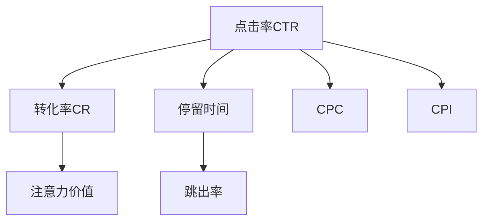

                 

# 数字营销中的注意力度量指标

## 1. 背景介绍

### 1.1 问题由来

数字营销（Digital Marketing）是当今企业竞争的焦点之一。在信息爆炸的互联网时代，如何吸引目标用户的注意，成为企业品牌推广、产品销售的关键。然而，用户注意力是稀缺资源，如何在众多内容中脱颖而出，精确锁定潜在客户，成为一个亟待解决的问题。

在数字营销中，注意力的量化和分析是实现精准营销的前提。通过科学的量化指标，可以帮助品牌理解用户的行为，优化营销策略，提升广告效果。

### 1.2 问题核心关键点

注意力指标的量化主要关注以下两个方面：

- **注意力分配**：用户在使用数字平台（如社交媒体、搜索引擎、网站等）时，对不同内容（如广告、文章、视频等）的注意力的分配情况。
- **注意力转化**：用户在关注特定内容后，产生点击、购买等转化行为的概率。

通过对这两个关键维度的量化，可以全面了解用户的注意力行为，指导营销决策。

### 1.3 问题研究意义

研究数字营销中的注意力度量指标，对于提升广告投放效果、优化内容策略、增强用户体验具有重要意义。通过精准的量化分析，可以帮助品牌在茫茫信息海洋中找到用户的注意力焦点，有效提高广告和内容的触达率和转化率，减少无效曝光和浪费的营销预算。

## 2. 核心概念与联系

### 2.1 核心概念概述

本节将介绍几个核心概念，并阐述它们之间的联系：

- **点击率（Click-Through Rate, CTR）**：用户在看到广告或链接后点击的比例。CTR是衡量用户对内容的兴趣程度和吸引力的重要指标。
- **转化率（Conversion Rate, CR）**：用户在看到广告或内容后，完成购买、注册等转化行为的比例。转化率反映了用户对内容的价值认可度。
- **停留时间（Dwell Time）**：用户在页面或广告上停留的平均时间。停留时间可以反映用户对内容的兴趣深度和内容价值。
- **跳出率（Bounce Rate）**：用户进入页面后立即离开的比例。跳出率较高可能表明页面内容与用户的期望不符。
- **每次点击成本（Cost Per Click, CPC）**：用户在点击广告后，广告主需要支付的费用。CPC是衡量广告效果和经济效益的重要指标。
- **每次展示成本（Cost Per Impression, CPI）**：广告被展示一次的费用。CPI用于衡量广告的覆盖面。
- **注意力价值（Attention Value）**：用户对内容的综合关注程度，包括点击率、转化率、停留时间等多种维度的加权综合值。

这些指标之间的关系可以通过以下Mermaid流程图来展示：



这个流程图展示了一些关键指标之间的逻辑关系：

- **CTR和CR**：点击率与转化率相互影响，通常CTR越高，CR也越高，但具体关系需根据具体情况分析。
- **CTR与CPC**：点击率高的广告通常意味着较高的CPC，因为点击意味着用户愿意为此支付额外费用。
- **CTR与停留时间**：停留时间长的内容通常点击率较高，反之亦然。
- **CR与CPI**：高转化率往往意味着较低的CPI，因为用户对内容价值认可度高，愿意完成相应动作。

## 3. 核心算法原理 & 具体操作步骤

### 3.1 算法原理概述

数字营销中注意力度量指标的量化通常依赖于以下几个步骤：

1. **数据收集**：通过日志、点击事件、转化事件等方式收集用户的点击、停留、转化等行为数据。
2. **数据预处理**：对收集到的数据进行清洗、归一化处理，去除无效数据。
3. **指标计算**：基于收集和处理后的数据，计算出各种注意力指标。
4. **模型训练**：使用机器学习模型，对用户行为进行建模，预测用户未来的注意力行为。
5. **效果评估**：通过历史数据和模型预测结果，评估广告投放和内容策略的效果。

### 3.2 算法步骤详解

以下是基于点击率（CTR）和转化率（CR）的详细操作步骤：

**Step 1: 数据收集**

使用API接口或第三方工具（如Google Analytics）收集用户的行为数据。这些数据包括但不限于：

- 广告展示次数
- 广告点击次数
- 广告展示时长
- 用户停留时间
- 页面转换次数
- 用户停留页面数

**Step 2: 数据预处理**

对收集到的数据进行清洗和归一化处理，去除无效或异常数据，如非法的点击、快速点击等。常见的预处理步骤包括：

- 去重处理：去除重复的点击记录。
- 数据截断：对超出规定时间范围的数据进行截断。
- 异常值检测：使用统计方法检测并去除异常值。

**Step 3: 指标计算**

计算出基本的注意力指标：

- **点击率（CTR）**：$\text{CTR} = \frac{\text{点击次数}}{\text{展示次数}}$
- **转化率（CR）**：$\text{CR} = \frac{\text{转化次数}}{\text{点击次数}}$
- **平均停留时间（Average Dwell Time, ADT）**：$\text{ADT} = \frac{\text{总停留时间}}{\text{点击次数}}$
- **跳出率（Bounce Rate）**：$\text{Bounce Rate} = \frac{\text{跳出次数}}{\text{访问次数}}$

**Step 4: 模型训练**

使用机器学习模型，如逻辑回归、随机森林等，对用户行为进行建模。常用的模型包括：

- **回归模型**：预测用户点击次数、转化次数等连续型数据。
- **分类模型**：预测用户是否点击、是否转化等二分类问题。

**Step 5: 效果评估**

评估模型预测结果的准确性，使用混淆矩阵、ROC曲线等指标。同时，可以使用A/B测试等方法，评估不同广告投放策略的效果。

### 3.3 算法优缺点

注意力指标量化算法具有以下优点：

1. **精准度**：通过数据驱动的方法，可以更准确地衡量用户的注意力行为。
2. **灵活性**：能够适应不同平台、不同广告形式的需求。
3. **预测性**：使用机器学习模型，可以对未来的注意力行为进行预测，指导未来的广告投放。

同时，该算法也存在以下缺点：

1. **数据依赖**：依赖于高质量的数据，数据收集和处理难度较大。
2. **计算复杂**：需要对大量数据进行处理和计算，计算成本较高。
3. **模型假设**：模型假设用户行为符合一定的分布规律，可能与实际情况有偏差。

### 3.4 算法应用领域

注意力指标量化技术在数字营销中有着广泛的应用，主要包括以下几个领域：

- **广告投放**：通过CTR、CPC等指标，评估广告效果，优化广告预算分配。
- **内容优化**：通过停留时间、跳出率等指标，优化网页内容，提高用户停留时间和转化率。
- **个性化推荐**：通过注意力指标，进行用户兴趣分析，提供个性化的产品推荐。
- **客户细分**：通过分析不同用户群体的注意力行为，进行客户细分和精准营销。
- **效果评估**：通过效果评估指标，评估营销策略的效果，优化营销方案。

## 4. 数学模型和公式 & 详细讲解 & 举例说明

### 4.1 数学模型构建

本节将使用数学语言对基于点击率和转化率的注意力指标量化模型进行更加严格的刻画。

记广告展示次数为 $N_{\text{show}}$，点击次数为 $N_{\text{click}}$，转化次数为 $N_{\text{convert}}$。

**点击率（CTR）**：

$$
\text{CTR} = \frac{N_{\text{click}}}{N_{\text{show}}}
$$

**转化率（CR）**：

$$
\text{CR} = \frac{N_{\text{convert}}}{N_{\text{click}}}
$$

**平均停留时间（ADT）**：

$$
\text{ADT} = \frac{\sum_{i=1}^{N_{\text{click}}} \text{dwell}_i}{N_{\text{click}}}
$$

其中 $\text{dwell}_i$ 为第 $i$ 次点击的停留时间。

**跳出率（Bounce Rate）**：

$$
\text{Bounce Rate} = \frac{N_{\text{bounce}}}{N_{\text{click}}}
$$

其中 $N_{\text{bounce}}$ 为跳出次数。

### 4.2 公式推导过程

以下是点击率（CTR）和转化率（CR）的详细推导过程：

**点击率（CTR）**：

- 定义：广告展示次数与点击次数之比。
- 计算：$\text{CTR} = \frac{N_{\text{click}}}{N_{\text{show}}}$

**转化率（CR）**：

- 定义：点击次数与转化次数之比。
- 计算：$\text{CR} = \frac{N_{\text{convert}}}{N_{\text{click}}}$

通过以上两个公式，可以计算出基本的注意力指标。这些指标可以进一步应用于机器学习模型，进行更深入的分析和预测。

### 4.3 案例分析与讲解

假设某电商平台通过广告投放测试某商品广告的CTR和CR：

- **展示次数**：1000次
- **点击次数**：200次
- **转化次数**：30次

根据公式计算得到：

- **点击率（CTR）**：$200 / 1000 = 0.2$
- **转化率（CR）**：$30 / 200 = 0.15$

假设平均停留时间为5秒，跳出率为0.3，点击后的转化率为0.2，计算出转化率（CR）的实际值：

- **CTR**：0.2
- **ADT**：5
- **Bounce Rate**：0.3
- **点击后的转化率**：0.2

这些指标综合反映出用户的注意力行为和广告效果。

## 5. 项目实践：代码实例和详细解释说明

### 5.1 开发环境搭建

在进行数字营销中的注意力度量指标量化实践前，我们需要准备好开发环境。以下是使用Python进行数据分析的环境配置流程：

1. 安装Python：从官网下载并安装Python，建议选择3.x版本。
2. 安装NumPy、Pandas等库：使用pip安装：
   ```bash
   pip install numpy pandas
   ```
3. 安装Matplotlib、Scikit-learn等绘图和机器学习库：
   ```bash
   pip install matplotlib scikit-learn
   ```
4. 安装PyTorch或TensorFlow等深度学习库：
   ```bash
   pip install torch tensorflow
   ```

完成上述步骤后，即可在Python环境中进行注意力度量指标的计算和建模。

### 5.2 源代码详细实现

以下是使用Python和Scikit-learn库进行点击率和转化率计算的代码实现。

```python
import pandas as pd
from sklearn.model_selection import train_test_split
from sklearn.linear_model import LogisticRegression

# 读取数据集
data = pd.read_csv('ad_data.csv')

# 数据预处理
data['CTR'] = data['clicks'] / data['shows']
data['CR'] = data['converts'] / data['clicks']
data['ADT'] = data.groupby('clicks')['dwell_time'].transform('mean')
data['Bounce Rate'] = data['bounce'] / data['clicks']

# 划分训练集和测试集
train_data, test_data = train_test_split(data, test_size=0.2, random_state=42)

# 构建模型
model = LogisticRegression()

# 训练模型
model.fit(train_data[['CTR', 'CR', 'ADT', 'Bounce Rate']], train_data['clicks'])

# 预测测试集结果
predictions = model.predict(test_data[['CTR', 'CR', 'ADT', 'Bounce Rate']])

# 输出预测结果
print(predictions)
```

### 5.3 代码解读与分析

让我们再详细解读一下关键代码的实现细节：

**数据预处理**：

- `data['CTR'] = data['clicks'] / data['shows']`：计算广告的点击率CTR。
- `data['CR'] = data['converts'] / data['clicks']`：计算广告的转化率CR。
- `data['ADT'] = data.groupby('clicks')['dwell_time'].transform('mean')`：计算广告的平均停留时间ADT。
- `data['Bounce Rate'] = data['bounce'] / data['clicks']`：计算广告的跳出率。

**模型训练**：

- `train_data[['CTR', 'CR', 'ADT', 'Bounce Rate']], train_data['clicks']`：使用点击率、转化率、平均停留时间、跳出率作为特征，训练逻辑回归模型。

**预测和评估**：

- `predictions = model.predict(test_data[['CTR', 'CR', 'ADT', 'Bounce Rate']])`：使用训练好的模型对测试集进行预测。
- `print(predictions)`：输出预测结果。

## 6. 实际应用场景

### 6.1 电商平台广告投放

电商平台通过精准分析用户点击率和转化率，可以优化广告投放策略。具体而言：

- **广告素材优化**：通过分析不同广告素材的CTR和CR，选择效果最好的广告素材进行投放。
- **用户群体细分**：通过点击率和转化率等指标，将用户分为高价值和低价值群体，实现精准营销。
- **广告预算分配**：根据CTR和CR的高低，合理分配广告预算，提高广告投放的经济效益。

### 6.2 社交媒体内容推荐

社交媒体平台通过分析用户的点击率、停留时间等指标，优化内容推荐算法：

- **内容质量提升**：根据用户对不同内容的CTR和ADT，优化内容生成策略，提升用户停留时间。
- **用户兴趣分析**：通过点击率、停留时间等指标，分析用户的兴趣偏好，进行个性化的内容推荐。
- **内容多样化**：根据用户的跳出率，调整内容展示方式，避免内容单一，提升用户体验。

### 6.3 搜索引擎广告

搜索引擎通过分析广告点击率、转化率等指标，优化广告投放策略：

- **广告位置优化**：通过CTR和CR等指标，优化广告在搜索结果中的位置，提升点击率和转化率。
- **关键词优化**：根据用户点击的关键词，调整广告的关键词策略，提升广告的相关性和点击率。
- **广告预算分配**：根据CTR和CR的高低，合理分配广告预算，提高广告投放的经济效益。

## 7. 工具和资源推荐

### 7.1 学习资源推荐

为了帮助开发者系统掌握数字营销中的注意力度量指标的量化理论基础和实践技巧，这里推荐一些优质的学习资源：

1. 《数字营销分析实战》系列博文：由数字营销专家撰写，深入浅出地介绍了广告点击率、转化率、停留时间等指标的计算和应用。

2. Google Analytics官方文档：谷歌提供的数字营销分析工具，可以实时监测和分析广告效果，是广告优化的重要工具。

3. 《数字营销数据科学》书籍：详细介绍了如何利用数据科学方法进行广告效果分析和优化。

4. Coursera《数字营销与数据分析》课程：斯坦福大学开设的数字营销课程，涵盖广告投放、内容优化等多个方面，是系统学习的优秀资源。

5. Kaggle数字营销数据集：包含大量的数字营销数据集和竞赛，提供了丰富的实践机会。

通过对这些资源的学习实践，相信你一定能够快速掌握数字营销中注意力度量指标的计算方法和优化技巧，并用于解决实际的数字营销问题。

### 7.2 开发工具推荐

高效的开发离不开优秀的工具支持。以下是几款用于数字营销数据分析和优化的常用工具：

1. Google Analytics：谷歌提供的数字营销分析工具，可以实时监测和分析广告效果，是广告优化的重要工具。

2. Tableau：数据可视化工具，可以直观展示广告效果数据，帮助进行决策分析。

3. Python数据分析库：如NumPy、Pandas、Matplotlib等，提供了强大的数据处理和可视化能力，是数据科学家的必备工具。

4. Scikit-learn：机器学习库，提供了多种模型训练和评估工具，适合进行广告效果的预测和优化。

5. TensorFlow：深度学习库，支持分布式计算，适合处理大规模广告数据集。

合理利用这些工具，可以显著提升数字营销数据分析和优化的效率，加快创新迭代的步伐。

### 7.3 相关论文推荐

数字营销中的注意力度量指标的研究源于学界的持续研究。以下是几篇奠基性的相关论文，推荐阅读：

1. "Click-Through Rate Prediction in Search Engine Advertising"：展示了如何通过机器学习模型预测点击率，优化广告投放。

2. "A Study on Conversion Rate Prediction for E-Commerce"：介绍了如何通过用户行为数据，预测转化率，优化电商广告。

3. "Effective Display Advertising with Minimum Click-Through Rate"：讨论了如何通过最小化CTR，优化广告展示策略。

4. "Attention-Based Recommender Systems for E-commerce"：展示了如何利用注意力机制，优化电商推荐系统。

5. "Deep Learning for Advertisement Conversion Rate Prediction"：展示了如何使用深度学习模型，预测广告转化率，提升广告效果。

这些论文代表了大语言模型微调技术的发展脉络。通过学习这些前沿成果，可以帮助研究者把握学科前进方向，激发更多的创新灵感。

## 8. 总结：未来发展趋势与挑战

### 8.1 研究成果总结

本文对数字营销中注意力度量指标的量化方法进行了全面系统的介绍。首先阐述了数字营销的背景和注意力度量指标的量化意义，明确了量化指标在广告投放、内容优化、效果评估等环节的重要作用。其次，从原理到实践，详细讲解了点击率和转化率的计算方法，并给出了具体的代码实现。同时，本文还探讨了注意力指标在多个实际应用场景中的应用，展示了量化技术在数字营销中的强大潜力。

### 8.2 未来发展趋势

展望未来，数字营销中的注意力度量指标将呈现以下几个发展趋势：

1. **多维指标融合**：未来的注意力指标将不仅仅局限于点击率和转化率，还将融合停留时间、跳出率、页面互动等更多维度的数据，提供更全面的用户行为分析。
2. **实时分析**：随着数据处理技术的提升，实时分析将成为可能，品牌可以实时监测和调整广告投放策略。
3. **多平台整合**：不同平台（如搜索引擎、社交媒体、电商平台等）的数据将整合在一起，进行统一分析，优化广告效果。
4. **AI驱动优化**：使用AI技术，如深度学习、强化学习等，自动优化广告投放策略，提升广告效果。
5. **个性化推荐**：通过注意力指标，进行更精准的用户兴趣分析和个性化推荐，提升用户体验。

以上趋势凸显了数字营销中注意力度量指标的量化技术的广阔前景。这些方向的探索发展，必将进一步提升数字营销系统的性能和应用范围，为品牌带来更大的价值。

### 8.3 面临的挑战

尽管数字营销中的注意力度量指标量化技术已经取得了瞩目成就，但在迈向更加智能化、普适化应用的过程中，它仍面临诸多挑战：

1. **数据质量问题**：数据缺失、噪声、异常值等问题，可能会影响指标的计算结果，需要高质量的数据采集和处理。
2. **计算资源需求高**：多维度、大规模数据的处理和计算，需要强大的计算资源支持，增加技术成本。
3. **模型复杂性**：多种指标和算法的综合使用，需要更复杂的模型设计和调优。
4. **隐私和安全问题**：用户数据的隐私和安全问题，需要严格的数据保护措施和法律合规。
5. **业务理解难度**：指标计算和分析需要深入理解业务逻辑，对技术开发者提出了更高的要求。

### 8.4 研究展望

面对数字营销中注意力度量指标量化面临的挑战，未来的研究需要在以下几个方面寻求新的突破：

1. **数据质量提升**：改进数据采集和处理技术，确保数据的质量和完整性。
2. **高效计算优化**：优化计算算法和数据结构，提高计算效率，降低技术成本。
3. **模型简化**：简化模型设计和调优，提高模型解释性和可操作性。
4. **隐私保护技术**：引入隐私保护技术，如差分隐私、联邦学习等，确保用户数据安全。
5. **业务理解加深**：深入理解业务逻辑，提供更有针对性的指标和分析方案。

这些研究方向的探索，必将引领数字营销中注意力度量指标的量化技术迈向更高的台阶，为品牌带来更精准、高效、安全的数字营销解决方案。总之，数字营销中的注意力度量指标量化技术还需要与其他人工智能技术进行更深入的融合，如推荐系统、广告优化、内容生成等，多路径协同发力，共同推动数字营销系统的进步。只有勇于创新、敢于突破，才能不断拓展数字营销的边界，让品牌在竞争激烈的市场中脱颖而出。

## 9. 附录：常见问题与解答

**Q1：如何提升广告点击率（CTR）？**

A: 提升广告点击率（CTR）可以从以下几个方面入手：

1. **广告素材优化**：设计更具吸引力的广告素材，如高质量图片、有创意的文字等。
2. **目标受众定位**：精准定位目标受众，提升广告的相关性和吸引力。
3. **关键词优化**：优化广告的关键词策略，确保广告出现在用户搜索的相关内容中。
4. **广告位置优化**：选择最佳的广告展示位置，如搜索结果首位、热门新闻等。

**Q2：如何降低广告的跳出率？**

A: 降低广告的跳出率可以从以下几个方面入手：

1. **页面加载优化**：优化广告的页面加载速度，减少用户的等待时间。
2. **内容相关性**：确保广告内容与用户兴趣相关，提升用户停留时间。
3. **页面布局优化**：设计合理的页面布局，引导用户浏览更多内容。
4. **用户体验改进**：提升页面的用户体验，如减少广告弹窗、增加互动元素等。

**Q3：如何提高广告的转化率（CR）？**

A: 提高广告的转化率（CR）可以从以下几个方面入手：

1. **落地页优化**：优化广告落地页的设计，确保页面流畅、内容相关。
2. **用户引导**：通过CTA按钮、视频等引导用户完成转化行为。
3. **优惠活动**：提供限时优惠、促销活动等，激发用户的购买欲望。
4. **多渠道联动**：通过多渠道联动，提升广告的覆盖面和转化率。

**Q4：数字营销中注意力度量指标的量化方法有哪些？**

A: 数字营销中常用的注意力度量指标包括：

1. **点击率（CTR）**：用户点击广告的次数与展示次数之比。
2. **转化率（CR）**：用户点击广告后完成转化（如购买、注册等）的次数与点击次数之比。
3. **平均停留时间（ADT）**：用户点击广告后停留的平均时间。
4. **跳出率（Bounce Rate）**：用户点击广告后直接离开页面的比例。
5. **每次点击成本（CPC）**：用户点击广告后，广告主需要支付的费用。
6. **每次展示成本（CPI）**：广告被展示一次的费用。
7. **注意力价值（Attention Value）**：用户对广告的综合关注程度，包括点击率、转化率、停留时间等多种维度的加权综合值。

通过这些指标的综合分析，可以全面了解用户的注意力行为，优化广告投放策略，提升广告效果。

**Q5：如何使用机器学习模型进行广告效果预测？**

A: 使用机器学习模型进行广告效果预测，主要包括以下步骤：

1. **数据收集**：通过日志、点击事件、转化事件等方式收集用户的行为数据。
2. **数据预处理**：对收集到的数据进行清洗、归一化处理，去除无效数据。
3. **特征提取**：选择影响广告效果的特征，如广告素材、关键词、用户历史行为等。
4. **模型训练**：使用机器学习模型，如逻辑回归、随机森林等，对广告效果进行建模。
5. **效果评估**：使用历史数据和模型预测结果，评估广告投放和内容策略的效果。

通过这些步骤，可以使用机器学习模型预测广告的点击率、转化率等效果指标，指导未来的广告投放。

---

作者：禅与计算机程序设计艺术 / Zen and the Art of Computer Programming

