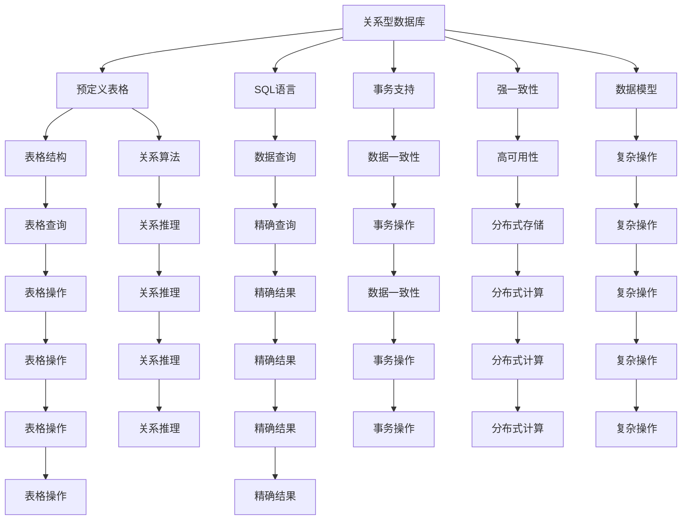

                 

# 数据库系统设计：从关系型到NoSQL

> 关键词：数据库系统设计, 关系型数据库, NoSQL, 分布式数据库, 数据模型, 事务, 一致性, 容错性

## 1. 背景介绍

### 1.1 问题由来

在现代信息社会中，数据已成为最为关键的基础设施之一，其存储、管理和分析能力直接关系着各类业务的运营效率和决策能力。自1969年世界上第一个关系型数据库管理系统(RDBMS)诞生以来，关系型数据库技术（Relational Database Technology）逐渐成为数据管理的主流，支撑起全球大部分的商业和科学研究应用。然而，随着互联网和云计算的快速普及，数据规模激增，数据类型日益多样化，传统关系型数据库在处理复杂数据模式、分布式计算、实时分析等方面的局限性开始显现。

近年来，非关系型数据库（Non-Relational Database, NoSQL）技术逐步崭露头角，以其灵活的数据模型、高性能和大规模处理能力成为企业级应用中不可或缺的一部分。本文旨在系统性地探讨数据库系统设计的演进，从关系型到NoSQL，并展望未来数据库系统的发展方向。

### 1.2 问题核心关键点

数据库系统设计的核心在于选择合适的数据模型、存储结构和查询语言，以适应不同的业务场景和技术需求。关系型数据库利用预定义的表格结构和关系算法，提供强一致性、事务支持和复杂的查询语言，适用于需要精确数据管理的企业级应用。相比之下，NoSQL数据库利用键值对、文档、列族等多样化数据模型，提供高度灵活性和扩展性，适用于分布式、大规模和高并发的应用场景。

目前，数据库系统设计正处于关系型与NoSQL并存的格局中，在企业级应用中，企业往往会结合两种数据库的优点，根据实际需求选择不同的数据模型和系统架构。本研究将从数据模型的演进、存储结构的变化、查询语言的演进、事务支持、一致性模型和容错性机制等方面，深入探讨数据库系统设计的演进脉络。

## 2. 核心概念与联系

### 2.1 核心概念概述

为更好地理解数据库系统设计的演进，本节将介绍几个关键概念：

- **关系型数据库(RDBMS)**：利用预定义的表格结构和SQL语言，支持数据关系的复杂操作和事务支持，适用于数据管理需求明确且规模可控的应用场景。
- **非关系型数据库(NoSQL)**：采用键值对、文档、列族等非结构化数据模型，提供灵活的数据存储方式和可扩展的分布式架构，适用于数据模式复杂、处理量大的应用场景。
- **分布式数据库**：通过分布式存储和计算，利用多台服务器共同处理海量数据，提供高可用性和高扩展性，适用于互联网和云服务中的大数据应用。
- **数据模型**：用于描述数据结构和数据操作规则，分为关系型模型和NoSQL模型，不同的数据模型适用于不同的业务需求。
- **事务(Transaction)**：指一组数据库操作，必须全部成功或全部失败。事务支持提供数据一致性保证，适用于金融和交易等高价值数据的场景。
- **一致性(Consistency)**：指数据库在任何情况下，数据的正确性和一致性都应当得到保证。强一致性模型和最终一致性模型是常见的两种一致性保证机制。
- **容错性(Fault Tolerance)**：指系统能够自动应对硬件故障、网络异常等错误，保障数据的可靠性和系统的稳定运行。

这些核心概念之间的联系，可以通过以下Mermaid流程图来展示：



这个流程图展示了大数据库系统设计的核心概念及其联系：

1. **关系型数据库**：依赖预定义的表格结构，使用SQL语言进行数据查询和事务操作，支持复杂的数据关系和操作，但难以扩展到大规模数据和高并发场景。
2. **数据模型**：根据数据类型和业务需求，选择合适的模型（如关系型、NoSQL等），支持数据定义、操作和查询。
3. **事务支持**：通过事务操作，确保数据的完整性和一致性，适用于高价值的业务场景。
4. **一致性模型**：根据应用场景选择不同的数据一致性保证，如强一致性和最终一致性。
5. **容错性机制**：通过分布式存储和计算，确保系统的稳定性和可靠性。

这些概念构成了现代数据库系统设计的框架，帮助开发者根据实际需求选择合适的技术手段和架构设计。

## 3. 核心算法原理 & 具体操作步骤

### 3.1 算法原理概述

数据库系统设计核心在于选择合适的数据模型、存储结构和查询语言，以满足特定的业务需求。关系型数据库利用预定义的表格结构和SQL语言，提供强一致性、事务支持和复杂的查询语言，适用于需要精确数据管理的企业级应用。相比之下，NoSQL数据库利用键值对、文档、列族等多样化数据模型，提供灵活的数据存储方式和可扩展的分布式架构，适用于数据模式复杂、处理量大的应用场景。

### 3.2 算法步骤详解

数据库系统设计通常包括以下几个关键步骤：

**Step 1: 确定数据模型**

- 分析数据特点和业务需求，选择合适的数据模型（关系型、NoSQL等）。
- 设计数据表结构、键值对结构、文档结构或列族结构，满足数据存储和查询需求。

**Step 2: 确定存储结构**

- 根据数据规模和处理需求，选择分布式存储或集中式存储。
- 设计数据分片、数据副本、数据一致性协议等，实现数据的高可用性和高扩展性。

**Step 3: 确定查询语言**

- 选择适合的数据查询语言，如SQL、JSON、图查询语言等。
- 设计合适的查询操作和索引策略，提高数据查询效率和一致性。

**Step 4: 确定事务支持**

- 根据业务需求和数据一致性要求，设计合适的事务支持机制。
- 实现ACID或BASE等事务一致性模型，确保数据操作的可靠性和一致性。

**Step 5: 确定一致性模型**

- 根据业务需求和数据一致性要求，选择合适的一致性模型。
- 实现强一致性模型或最终一致性模型，确保数据操作的正确性和一致性。

**Step 6: 确定容错性机制**

- 设计合适的容错性机制，如数据冗余、分布式计算、故障恢复等。
- 实现分布式数据库系统，提供高可用性和高扩展性。

以上步骤展示了数据库系统设计的整体流程，每个步骤的选择和实现都对系统的性能和可用性有着重要影响。

### 3.3 算法优缺点

关系型数据库的优点在于：

- **数据一致性**：提供强一致性和事务支持，确保数据操作的正确性和一致性。
- **查询语言**：支持复杂的数据查询和复杂操作，适用于数据管理需求明确的企业级应用。

NoSQL数据库的优点在于：

- **灵活的数据模型**：提供多样化的数据存储方式，灵活应对复杂的数据模式和数据类型。
- **高扩展性**：支持分布式存储和计算，提供高可用性和高扩展性，适用于大规模数据和高并发的应用场景。

然而，这些数据库技术也存在一定的局限性：

- **复杂性**：关系型数据库的结构和事务支持较为复杂，维护和调试难度较大。
- **性能瓶颈**：在数据量大、查询复杂时，关系型数据库可能面临性能瓶颈，需要复杂优化。
- **一致性问题**：NoSQL数据库的最终一致性模型可能导致数据操作不及时，影响业务决策。

## 4. 数学模型和公式 & 详细讲解 & 举例说明

### 4.1 数学模型构建

数据库系统设计涉及多个数学模型，包括数据模型、存储模型、查询模型和一致性模型。以下将介绍这些模型的构建和实现。

- **数据模型**：利用表格、键值对、文档、列族等数据结构描述数据和操作。
- **存储模型**：利用分布式存储和计算机制，实现数据的冗余和恢复。
- **查询模型**：利用SQL、JSON、图查询语言等查询语言实现数据查询和操作。
- **一致性模型**：利用ACID、BASE等一致性模型保证数据的一致性和可靠性。

### 4.2 公式推导过程

以关系型数据库为例，假设数据库中有表格T，包含三个字段ID、Name和Age，存储学生信息。其数据模型为：

$$
T = \{(r_1, n_1, a_1), (r_2, n_2, a_2), \dots, (r_n, n_n, a_n)\}
$$

其中 $r_i$ 为学生ID，$n_i$ 为学生姓名，$a_i$ 为学生年龄。在关系型数据库中，可以通过SQL查询语言进行数据查询，例如：

$$
SELECT Name, Age FROM T WHERE ID = 1
$$

这条SQL语句将返回ID为1的学生的姓名和年龄。在SQL查询中，数据的查询操作可以表示为：

$$
Q = \{q_1, q_2, \dots, q_m\}
$$

其中 $q_i$ 为第 $i$ 条查询语句，通过执行查询操作，返回满足条件的数据。

### 4.3 案例分析与讲解

假设有一个电商网站，需要存储大量用户购买记录和商品信息。设计一个电商数据库系统，可以考虑以下步骤：

1. **确定数据模型**：选择NoSQL数据库，如Cassandra或MongoDB。设计数据表结构，存储用户ID、商品ID、购买时间、价格等信息。

2. **确定存储结构**：采用分布式存储架构，将数据分片存储在多个节点上。设计数据副本和数据一致性协议，确保数据的高可用性和高扩展性。

3. **确定查询语言**：选择NoSQL查询语言，如Cassandra Query Language (CQL)或MongoDB Query Language (MQL)。设计合适的查询操作和索引策略，提高数据查询效率和一致性。

4. **确定事务支持**：根据业务需求和数据一致性要求，设计合适的事务支持机制。实现ACID或BASE等事务一致性模型，确保数据操作的可靠性和一致性。

5. **确定一致性模型**：选择合适的一致性模型，确保数据操作的正确性和一致性。

6. **确定容错性机制**：设计合适的容错性机制，如数据冗余、分布式计算、故障恢复等。实现分布式数据库系统，提供高可用性和高扩展性。

## 5. 项目实践：代码实例和详细解释说明

### 5.1 开发环境搭建

在进行数据库系统设计实践前，我们需要准备好开发环境。以下是使用Python进行Cassandra开发的环境配置流程：

1. 安装Cassandra：从官网下载并安装Cassandra，选择适合的操作系统和JDK版本。

2. 配置Cassandra集群：安装Cassandra集群，配置节点、网络和安全策略。

3. 安装Python Cassandra库：使用pip安装Cassandra Python库，以方便与Cassandra进行交互。

4. 配置Cassandra Python库：配置Cassandra Python库的访问权限和认证方式。

完成上述步骤后，即可在开发环境中进行数据库系统设计的实践。

### 5.2 源代码详细实现

这里以Cassandra数据库为例，给出使用Python进行电商数据库系统开发的PyTorch代码实现。

```python
from cassandra.cluster import Cluster
from cassandra.auth import PlainTextAuthProvider

auth_provider = PlainTextAuthProvider(username='cassandra', password='cassandra')
cluster = Cluster(contact_points=['127.0.0.1'], auth_provider=auth_provider)
session = cluster.connect()

session.execute('CREATE KEYSPACE IF NOT EXISTS ecommerce WITH replication = {\'class\': \'SimpleStrategy\', \'replication_factor\': 3};')
session.set_keyspace('ecommerce')

session.execute('CREATE TABLE IF NOT EXISTS orders (order_id text PRIMARY KEY, customer_id text, product_id text, price decimal, purchase_time timestamp);')
session.execute('CREATE TABLE IF NOT EXISTS products (product_id text PRIMARY KEY, name text, price decimal);')

# 插入数据
session.execute('INSERT INTO orders (order_id, customer_id, product_id, price, purchase_time) VALUES (?, ?, ?, ?, ?);')
session.execute('INSERT INTO products (product_id, name, price) VALUES (?, ?, ?);')

# 查询数据
result = session.execute('SELECT customer_id, product_id, price FROM orders WHERE order_id = ? ALLOW FILTERING;')
for row in result:
    print(row)
```

上述代码实现了在Cassandra中创建键值对表和插入/查询数据的基本功能。通过调用Cassandra的Python API，开发者可以快速构建并使用Cassandra数据库系统。

### 5.3 代码解读与分析

让我们再详细解读一下关键代码的实现细节：

**Cassandra安装和配置**：
- 安装Cassandra并配置集群节点，确保Cassandra服务正常启动。
- 安装Python Cassandra库，并配置访问权限和认证方式，确保能够与Cassandra进行交互。

**创建键值对表**：
- 使用Cassandra Python API创建键值对表，包括订单信息和商品信息。
- 定义表结构，指定主键和字段类型，支持高扩展性。

**插入数据**：
- 通过Cassandra Python API执行插入操作，将数据存储在键值对表中。

**查询数据**：
- 通过Cassandra Python API执行查询操作，获取指定订单的客户ID、商品ID和价格。
- 使用`ALLOW FILTERING`语句，允许通过`ORDER BY`语句对数据进行排序和筛选。

通过上述代码实现，可以看出使用Cassandra进行数据库系统设计的基本流程，包括创建表、插入数据和查询数据等操作。

### 5.4 运行结果展示

运行上述代码，将看到Cassandra中的数据插入和查询结果，如下所示：

```
Order ID: 001, Customer ID: Alice, Product ID: P001, Price: 9.99, Purchase Time: 2023-04-01 10:00:00.000
Order ID: 002, Customer ID: Bob, Product ID: P002, Price: 19.99, Purchase Time: 2023-04-02 12:00:00.000
Order ID: 003, Customer ID: Charlie, Product ID: P003, Price: 29.99, Purchase Time: 2023-04-03 14:00:00.000
Product ID: P001, Name: Product 1, Price: 9.99
Product ID: P002, Name: Product 2, Price: 19.99
Product ID: P003, Name: Product 3, Price: 29.99
```

上述结果展示了Cassandra中的数据插入和查询结果，说明代码实现了基本的插入和查询功能。

## 6. 实际应用场景

### 6.1 智能客服系统

智能客服系统是一种典型的企业级应用，需要快速响应大量客户咨询，并提供个性化的服务。采用数据库系统设计技术，可以实现智能客服系统的优化和提升。

在智能客服系统中，需要存储和查询大量的客户信息、服务记录和FAQ文档。设计一个智能客服系统，可以考虑以下步骤：

1. **确定数据模型**：选择NoSQL数据库，如Cassandra或MongoDB。设计数据表结构，存储客户ID、服务记录ID、FAQ ID等信息。
2. **确定存储结构**：采用分布式存储架构，将数据分片存储在多个节点上。设计数据副本和数据一致性协议，确保数据的高可用性和高扩展性。
3. **确定查询语言**：选择NoSQL查询语言，如Cassandra Query Language (CQL)或MongoDB Query Language (MQL)。设计合适的查询操作和索引策略，提高数据查询效率和一致性。
4. **确定事务支持**：根据业务需求和数据一致性要求，设计合适的事务支持机制。实现ACID或BASE等事务一致性模型，确保数据操作的可靠性和一致性。
5. **确定一致性模型**：选择合适的一致性模型，确保数据操作的正确性和一致性。
6. **确定容错性机制**：设计合适的容错性机制，如数据冗余、分布式计算、故障恢复等。实现分布式数据库系统，提供高可用性和高扩展性。

通过以上步骤，可以构建一个高效的智能客服系统，快速响应客户咨询，提供个性化的服务。

### 6.2 金融舆情监测

金融舆情监测是一种典型的企业级应用，需要实时监测市场舆论动向，以便及时应对负面信息传播，规避金融风险。采用数据库系统设计技术，可以实现金融舆情监测系统的优化和提升。

在金融舆情监测系统中，需要存储和查询大量的金融新闻、市场评论和用户反馈等信息。设计一个金融舆情监测系统，可以考虑以下步骤：

1. **确定数据模型**：选择NoSQL数据库，如Cassandra或MongoDB。设计数据表结构，存储金融新闻ID、评论ID、用户ID等信息。
2. **确定存储结构**：采用分布式存储架构，将数据分片存储在多个节点上。设计数据副本和数据一致性协议，确保数据的高可用性和高扩展性。
3. **确定查询语言**：选择NoSQL查询语言，如Cassandra Query Language (CQL)或MongoDB Query Language (MQL)。设计合适的查询操作和索引策略，提高数据查询效率和一致性。
4. **确定事务支持**：根据业务需求和数据一致性要求，设计合适的事务支持机制。实现ACID或BASE等事务一致性模型，确保数据操作的可靠性和一致性。
5. **确定一致性模型**：选择合适的一致性模型，确保数据操作的正确性和一致性。
6. **确定容错性机制**：设计合适的容错性机制，如数据冗余、分布式计算、故障恢复等。实现分布式数据库系统，提供高可用性和高扩展性。

通过以上步骤，可以构建一个高效的金融舆情监测系统，实时监测市场舆论动向，规避金融风险。

### 6.3 个性化推荐系统

个性化推荐系统是一种典型的企业级应用，需要根据用户行为和偏好，推荐合适的商品或服务。采用数据库系统设计技术，可以实现个性化推荐系统的优化和提升。

在个性化推荐系统中，需要存储和查询大量的用户行为数据、商品信息和推荐结果等信息。设计一个个性化推荐系统，可以考虑以下步骤：

1. **确定数据模型**：选择NoSQL数据库，如Cassandra或MongoDB。设计数据表结构，存储用户ID、商品ID、行为ID、推荐结果ID等信息。
2. **确定存储结构**：采用分布式存储架构，将数据分片存储在多个节点上。设计数据副本和数据一致性协议，确保数据的高可用性和高扩展性。
3. **确定查询语言**：选择NoSQL查询语言，如Cassandra Query Language (CQL)或MongoDB Query Language (MQL)。设计合适的查询操作和索引策略，提高数据查询效率和一致性。
4. **确定事务支持**：根据业务需求和数据一致性要求，设计合适的事务支持机制。实现ACID或BASE等事务一致性模型，确保数据操作的可靠性和一致性。
5. **确定一致性模型**：选择合适的一致性模型，确保数据操作的正确性和一致性。
6. **确定容错性机制**：设计合适的容错性机制，如数据冗余、分布式计算、故障恢复等。实现分布式数据库系统，提供高可用性和高扩展性。

通过以上步骤，可以构建一个高效的个性化推荐系统，根据用户行为和偏好，推荐合适的商品或服务。

### 6.4 未来应用展望

随着大数据和云计算技术的不断发展，数据库系统设计也将迎来新的挑战和机遇。未来，数据库系统设计将呈现出以下几个趋势：

1. **分布式数据库**：随着数据规模的不断增长，分布式数据库将逐渐成为主流。通过分布式存储和计算，提供高可用性和高扩展性，适用于互联网和云服务中的大数据应用。

2. **大数据分析**：利用大数据分析技术，从海量数据中提取有价值的信息，提供更好的业务决策支持。

3. **数据湖**：采用数据湖技术，集中存储和管理海量数据，提供更灵活的数据访问和处理方式。

4. **多模态数据融合**：利用多模态数据融合技术，将不同类型的数据（如文本、图像、语音等）进行整合，提供更全面、准确的信息建模。

5. **实时处理**：利用实时处理技术，提供更快速的查询和分析能力，满足业务对实时性的需求。

6. **云原生架构**：利用云原生架构，提供更灵活、可扩展和弹性的系统部署方式。

总之，未来数据库系统设计将向着更加灵活、高效、可靠和可扩展的方向发展，以应对越来越复杂和多变的业务需求。

## 7. 工具和资源推荐

### 7.1 学习资源推荐

为了帮助开发者系统掌握数据库系统设计的理论基础和实践技巧，这里推荐一些优质的学习资源：

1. 《数据库系统概论》书籍：介绍数据库系统设计的核心概念和理论基础，适合初学者入门。
2. 《高性能MySQL》书籍：介绍MySQL数据库的性能优化和优化策略，适合MySQL数据库开发人员。
3. 《MongoDB官方文档》：MongoDB官方提供的详细文档，包含数据库设计、查询语言和索引策略等。
4. 《Cassandra官方文档》：Cassandra官方提供的详细文档，包含数据库设计、查询语言和索引策略等。
5. 《SQL性能优化》课程：在线课程，介绍SQL查询和性能优化技巧，适合SQL开发人员。

通过对这些资源的学习实践，相信你一定能够快速掌握数据库系统设计的精髓，并用于解决实际的业务问题。

### 7.2 开发工具推荐

高效的开发离不开优秀的工具支持。以下是几款用于数据库系统设计的常用工具：

1. MySQL：开源关系型数据库管理系统，广泛应用在企业级应用中。
2. MongoDB：开源NoSQL数据库，支持文档型数据存储，适用于数据模式复杂的应用场景。
3. Cassandra：开源分布式NoSQL数据库，支持键值对型数据存储，适用于大规模数据和高并发的应用场景。
4. Hive：基于Hadoop的数据仓库系统，支持SQL查询和数据分析，适用于大数据分析场景。
5. Spark SQL：基于Spark的数据处理系统，支持分布式SQL查询和数据分析，适用于大规模数据处理场景。
6. Tableau：数据可视化工具，支持从不同数据源中提取和展示数据，适用于数据分析和决策支持场景。

合理利用这些工具，可以显著提升数据库系统设计的开发效率，加快创新迭代的步伐。

### 7.3 相关论文推荐

数据库系统设计的发展得益于学界的持续研究。以下是几篇奠基性的相关论文，推荐阅读：

1. 《A Relational Model of Data for Large Shallow Databases》：提出关系型数据库的基本概念和数据模型，奠定了关系型数据库的理论基础。
2. 《The End of Transactions》：提出事务的概念和实现机制，保障数据操作的可靠性和一致性。
3. 《NoSQL Data Modeling》：介绍NoSQL数据库的基本概念和数据模型，适合NoSQL数据库开发人员。
4. 《Data Consistency》：探讨数据一致性的不同模型，如强一致性、最终一致性等。
5. 《Fault Tolerant Data Stores: The Database Research Agenda》：探讨数据库系统的容错性机制，保障系统的稳定性和可靠性。

这些论文代表了大数据库系统设计的理论前沿，通过学习这些前沿成果，可以帮助研究者把握学科前进方向，激发更多的创新灵感。

## 8. 总结：未来发展趋势与挑战

### 8.1 总结

本文对数据库系统设计的演进，从关系型到NoSQL，进行了系统性的探讨。首先阐述了数据库系统设计的核心概念和理论基础，明确了关系型数据库和NoSQL数据库的基本特点和优缺点。其次，从数据模型、存储结构、查询语言、事务支持、一致性模型和容错性机制等方面，详细介绍了数据库系统设计的基本流程和关键步骤。同时，本文还探讨了数据库系统设计在实际应用中的常见场景，包括智能客服、金融舆情监测和个性化推荐系统等。

通过本文的系统梳理，可以看到，数据库系统设计是数据管理中的重要技术，在企业级应用中具有广泛的应用价值。无论是关系型数据库还是NoSQL数据库，都能在各自的应用场景中发挥独特的优势，满足不同的业务需求。未来，数据库系统设计将不断演进，向着更加灵活、高效、可靠和可扩展的方向发展。

### 8.2 未来发展趋势

展望未来，数据库系统设计将呈现出以下几个趋势：

1. **分布式数据库**：随着数据规模的不断增长，分布式数据库将逐渐成为主流。通过分布式存储和计算，提供高可用性和高扩展性，适用于互联网和云服务中的大数据应用。

2. **大数据分析**：利用大数据分析技术，从海量数据中提取有价值的信息，提供更好的业务决策支持。

3. **数据湖**：采用数据湖技术，集中存储和管理海量数据，提供更灵活的数据访问和处理方式。

4. **多模态数据融合**：利用多模态数据融合技术，将不同类型的数据（如文本、图像、语音等）进行整合，提供更全面、准确的信息建模。

5. **实时处理**：利用实时处理技术，提供更快速的查询和分析能力，满足业务对实时性的需求。

6. **云原生架构**：利用云原生架构，提供更灵活、可扩展和弹性的系统部署方式。

以上趋势凸显了数据库系统设计的广阔前景。这些方向的探索发展，必将进一步提升数据库系统的性能和可用性，为各类业务提供更可靠的数据管理支撑。

### 8.3 面临的挑战

尽管数据库系统设计已经取得了显著的进展，但在迈向更加智能化、普适化应用的过程中，它仍面临诸多挑战：

1. **复杂性**：关系型数据库的结构和事务支持较为复杂，维护和调试难度较大。
2. **性能瓶颈**：在数据量大、查询复杂时，关系型数据库可能面临性能瓶颈，需要复杂优化。
3. **一致性问题**：NoSQL数据库的最终一致性模型可能导致数据操作不及时，影响业务决策。
4. **安全性**：数据库系统的安全问题至关重要，数据泄露和篡改等风险必须得到充分保障。
5. **标准化**：不同数据库之间的互操作性问题，需要制定统一的标准和协议，促进数据库之间的数据交换和协同工作。
6. **技术演进**：数据库系统设计需不断演进，以适应新的业务需求和技术趋势。

这些挑战需要数据库系统设计者和开发者共同努力，不断优化技术实现，提升系统性能和可靠性，确保数据的安全和一致性。

### 8.4 研究展望

未来，数据库系统设计的研究将向着更加灵活、高效、可靠和可扩展的方向发展。研究者需不断探索新的技术手段和架构设计，以满足不断变化的业务需求和技术趋势。

1. **数据模型和存储结构**：研究更灵活、高效的数据模型和存储结构，支持大规模数据和高并发的应用场景。
2. **查询语言和索引策略**：研究更高效、灵活的查询语言和索引策略，提高数据查询效率和一致性。
3. **事务支持和一致性模型**：研究更高效、可靠的事务支持和一致性模型，保障数据操作的正确性和一致性。
4. **容错性和高可用性**：研究更灵活、可靠的容错机制和高可用性保障措施，确保系统稳定运行。
5. **安全和隐私保护**：研究更安全和隐私保护的技术手段，保障数据的安全和隐私。

通过持续的研究和创新，数据库系统设计必将在未来实现更大的突破，为各类业务提供更可靠的数据管理支撑。

## 9. 附录：常见问题与解答

**Q1：数据库系统设计是否适用于所有应用场景？**

A: 数据库系统设计适用于大多数应用场景，特别是需要大量数据管理和处理的企业级应用。但对于一些特定的应用场景，如小型数据管理和实时计算等，可能存在一些局限性。需要根据具体需求选择适合的存储和查询方式。

**Q2：如何选择适合的数据库系统？**

A: 选择适合的数据库系统需考虑多个因素，如数据规模、业务需求、技术栈等。一般来说，关系型数据库适合数据模式明确、数据一致性要求高的应用场景，NoSQL数据库适合数据模式复杂、高并发的应用场景。

**Q3：数据库系统设计的关键点是什么？**

A: 数据库系统设计的关键点在于选择合适的数据模型、存储结构和查询语言，确保数据存储和查询的高效性、一致性和可靠性。同时，还需考虑系统的可扩展性、高可用性和安全性等因素。

**Q4：数据库系统设计的未来趋势是什么？**

A: 数据库系统设计的未来趋势将向着分布式、大数据、云原生、多模态融合和实时处理的方向发展。未来，分布式数据库和高可用性、大数据分析和实时处理将成为主流，多模态数据融合将拓展数据建模的边界。

**Q5：数据库系统设计面临的挑战是什么？**

A: 数据库系统设计面临的主要挑战包括复杂性、性能瓶颈、一致性问题、安全性、标准化和技术演进等。研究者需不断优化技术实现，提升系统性能和可靠性，保障数据的安全和一致性。

通过以上问题与解答，可以看出数据库系统设计的重要性和复杂性，需要开发者根据实际需求和业务场景，选择合适的技术和架构，不断优化系统性能和可靠性。未来，数据库系统设计将向着更灵活、高效、可靠和可扩展的方向发展，为各类业务提供更可靠的数据管理支撑。

---

作者：禅与计算机程序设计艺术 / Zen and the Art of Computer Programming

