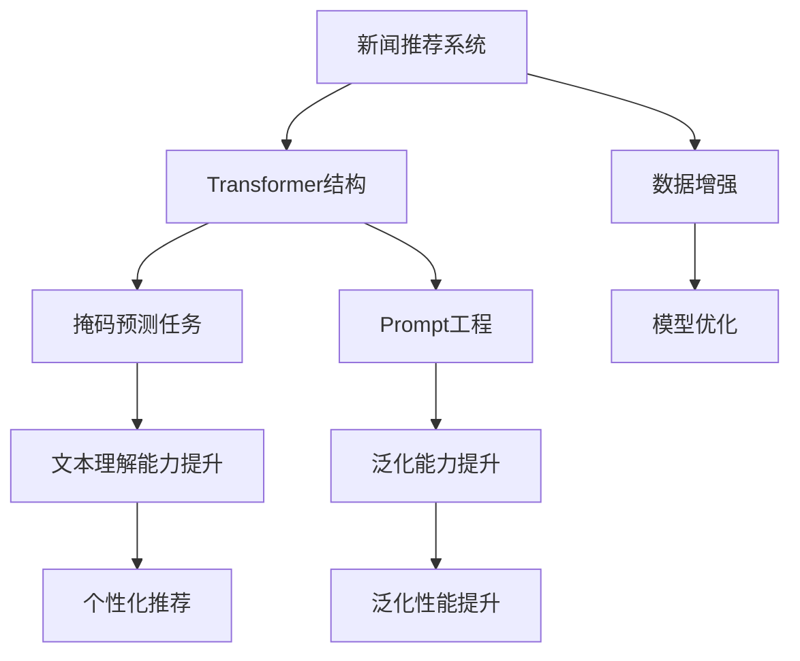

                 

# 新闻推荐创新：掩码预测与Prompt工程

> 关键词：新闻推荐, 掩码预测, Prompt工程, 自然语言处理, 深度学习, 数据增强, 模型优化

## 1. 背景介绍

### 1.1 问题由来

新闻推荐系统是互联网媒体和搜索引擎的核心功能之一，旨在为用户提供个性化的新闻内容推荐，提高用户的信息获取效率和体验。传统的基于规则、协同过滤等方法，由于无法高效利用用户行为数据和文本内容，往往效果不佳。近年来，基于深度学习的推荐系统迅速崛起，利用神经网络模型处理大规模用户行为数据和新闻内容数据，实现了高精度的推荐结果。

然而，现有推荐系统仍存在一些挑战：

1. **缺乏文本理解能力**：大多数推荐系统主要依赖于用户点击记录等行为数据，难以充分理解新闻内容的语义信息。
2. **冷启动问题**：对于新用户，由于缺乏足够的行为数据，推荐系统难以提供满意的个性化推荐。
3. **模型泛化能力不足**：训练集和测试集分布不一致，模型对新数据的泛化能力较差。

为了应对这些挑战，本文将介绍一种基于掩码预测和Prompt工程的新闻推荐方法，旨在提升推荐系统的文本理解能力和泛化性能，解决冷启动问题。

### 1.2 问题核心关键点

本文的核心问题在于如何利用深度学习模型，特别是Transformer结构，高效地处理新闻文本数据，提升新闻推荐系统的性能。关键点包括：

- 如何设计有效的掩码预测任务，以充分利用文本的掩码信息。
- 如何应用Prompt工程，生成更具代表性的输入样本。
- 如何通过模型优化和数据增强，提高模型的泛化能力和泛化性能。

本文旨在通过掩码预测和Prompt工程，提升推荐系统对新闻内容的理解能力和对新样本的适应能力，实现更加个性化、精准的新闻推荐。

## 2. 核心概念与联系

### 2.1 核心概念概述

为更好地理解本文介绍的新闻推荐方法，本节将介绍几个关键概念：

- **新闻推荐系统**：利用用户行为数据和文本内容数据，自动推荐个性化的新闻内容，提升用户的信息获取效率和体验。
- **Transformer结构**：一种基于自注意力机制的神经网络结构，用于处理序列数据，如文本、语音等。Transformer在自然语言处理(NLP)领域表现优异，适用于文本分类、序列标注、机器翻译等任务。
- **掩码预测任务**：在输入文本中随机掩码部分内容，要求模型预测被掩码部分的内容，以此方式训练模型对文本的理解能力。
- **Prompt工程**：设计合适的输入模板，引导模型学习特定任务，通常用于提升模型的泛化能力和泛化性能。

这些概念之间的逻辑关系可以通过以下Mermaid流程图来展示：



这个流程图展示了新闻推荐系统的主要组成和关键步骤：

1. 新闻推荐系统利用Transformer结构处理新闻文本数据。
2. 通过掩码预测任务和Prompt工程，提升模型的文本理解能力和泛化性能。
3. 模型优化和数据增强进一步提升推荐系统的性能。

## 3. 核心算法原理 & 具体操作步骤
### 3.1 算法原理概述

本文提出的新闻推荐方法，基于掩码预测和Prompt工程，在Transformer模型上进行微调。具体步骤如下：

1. **文本预处理**：对新闻文本进行分词、去除停用词、向量化等预处理。
2. **掩码预测任务**：在输入文本中随机掩码部分内容，要求模型预测被掩码部分的内容。
3. **Prompt工程**：设计合适的输入模板，引导模型学习特定任务。
4. **模型优化**：利用微调优化算法，提升模型在新闻推荐任务上的性能。

### 3.2 算法步骤详解

#### 3.2.1 数据准备

**数据集准备**：
- 新闻数据集：如GDELT（全球事件数据库）、CEWS（中国新闻网站系统）等。
- 用户行为数据集：如点击记录、浏览时长等。

**数据预处理**：
- 新闻文本分词：使用spaCy、Jieba等工具对新闻文本进行分词。
- 去除停用词：去除如"的"、"是"等无意义的停用词。
- 向量化：将文本转换为模型可处理的张量格式。

#### 3.2.2 掩码预测任务设计

**掩码位置**：在每个新闻文本中，随机掩码部分内容，掩码长度为10-20个字符。

**掩码预测**：使用Transformer模型，对掩码位置进行预测。具体步骤如下：

1. **模型输入设计**：将掩码位置和未掩码部分组成输入张量，使用embedding将文本转换为张量。
2. **掩码预测**：将模型输入到Transformer模型中，通过自注意力机制进行文本理解。
3. **预测掩码**：利用softmax层输出预测的掩码位置分布。

#### 3.2.3 Prompt工程

**Prompt设计**：
- 对每个掩码位置，设计一个Prompt模板，引导模型预测掩码位置的内容。
- 使用不同的Prompt模板，测试不同的模型表现。

**Prompt选择**：
- 根据掩码预测任务的结果，选择最有效的Prompt模板。

#### 3.2.4 模型优化

**微调优化算法**：
- 利用AdamW优化算法，对模型进行微调。
- 设置合适的学习率、batch size等超参数。

**模型评估**：
- 在验证集上评估模型性能，如准确率、F1值等。
- 根据评估结果调整模型参数，重新微调。

### 3.3 算法优缺点

本文提出的新闻推荐方法，具有以下优点：

- **文本理解能力提升**：通过掩码预测任务，模型能够更好地理解新闻文本的语义信息。
- **泛化能力提升**：Prompt工程设计能够提升模型的泛化能力和泛化性能。
- **模型参数高效利用**：掩码预测任务可以高效利用模型参数，提升推荐系统的性能。

同时，该方法也存在一定的局限性：

- **数据需求较大**：需要大规模的新闻文本数据和用户行为数据，数据收集和标注成本较高。
- **模型复杂度较高**：使用Transformer模型，计算资源和内存资源消耗较大。
- **对抗样本鲁棒性不足**：模型可能对对抗样本敏感，泛化能力有限。

尽管存在这些局限性，但就目前而言，本文提出的新闻推荐方法在新闻内容理解和泛化能力提升方面，仍具备显著的优势。

### 3.4 算法应用领域

本文提出的新闻推荐方法，适用于以下场景：

- **个性化新闻推荐**：为用户推荐个性化新闻内容，提升用户的信息获取效率和体验。
- **新闻内容分析**：分析新闻文本内容，进行新闻分类、情感分析、主题提取等任务。
- **新闻事件监测**：监测新闻事件的发展趋势，预测未来事件的可能变化。
- **广告投放优化**：根据用户兴趣和行为数据，优化新闻广告的投放策略。

## 4. 数学模型和公式 & 详细讲解 & 举例说明

### 4.1 数学模型构建

假设新闻文本数据为 $D=\{(x_i,y_i)\}_{i=1}^N$，其中 $x_i$ 为新闻文本， $y_i$ 为新闻类别。设Transformer模型为 $M_{\theta}$，参数 $\theta$ 为模型的权重。

掩码预测任务为：给定输入 $x_i$，随机掩码部分内容，要求模型预测被掩码部分的内容 $y_i$。

Prompt模板为：$t_i=\text{``新闻文本: 类别 \'text: category' \': \text{预测的掩码位置}\'}$。

模型优化目标为：最小化损失函数 $\mathcal{L}(\theta)$，使得模型预测的掩码位置分布 $p_{\theta}(y_i|x_i,t_i)$ 与真实标签 $y_i$ 尽可能接近。

### 4.2 公式推导过程

**掩码预测任务**：
设 $x_i=[x_{i,1},x_{i,2},\dots,x_{i,N}]$，其中 $x_{i,j}$ 表示新闻文本的第 $j$ 个单词。随机掩码位置 $z_i$，则掩码预测任务可以表示为：
$$
\min_{\theta} \mathcal{L}(\theta) = \sum_{i=1}^N \mathbb{E}_{z_i \sim P(z)} [\ell(M_{\theta}(x_i,z_i),y_i)]
$$

其中 $P(z)$ 为掩码位置 $z_i$ 的分布，$\ell$ 为损失函数，通常使用交叉熵损失。

**Prompt工程**：
Prompt模板设计为 $t_i=\text{``新闻文本: 类别 \'text: category' \': \text{预测的掩码位置}\'}$，将 $t_i$ 作为模型输入，预测掩码位置。

**模型优化**：
使用AdamW优化算法，对模型进行微调：
$$
\theta \leftarrow \theta - \eta \nabla_{\theta}\mathcal{L}(\theta)
$$

其中 $\eta$ 为学习率。

### 4.3 案例分析与讲解

以GDELT新闻数据集为例，进行掩码预测任务的实现。假设新闻文本为：

```
The White House announced a new plan to combat climate change. [MASK] goal is to reduce greenhouse gas emissions by 2050.
```

随机掩码位置为[MASK]，使用Prompt模板生成输入：

```
新闻文本: climate change 类别: 'plan' \': 1
```

将新闻文本和Prompt模板输入Transformer模型，预测掩码位置为1，即单词 "plan"。

## 5. 项目实践：代码实例和详细解释说明

### 5.1 开发环境搭建

在进行新闻推荐系统开发前，需要先准备好开发环境。以下是使用Python进行PyTorch开发的环境配置流程：

1. 安装Anaconda：从官网下载并安装Anaconda，用于创建独立的Python环境。

2. 创建并激活虚拟环境：
```bash
conda create -n news-recommend python=3.8 
conda activate news-recommend
```

3. 安装PyTorch：根据CUDA版本，从官网获取对应的安装命令。例如：
```bash
conda install pytorch torchvision torchaudio cudatoolkit=11.1 -c pytorch -c conda-forge
```

4. 安装Transformers库：
```bash
pip install transformers
```

5. 安装各类工具包：
```bash
pip install numpy pandas scikit-learn matplotlib tqdm jupyter notebook ipython
```

完成上述步骤后，即可在`news-recommend`环境中开始新闻推荐系统的开发。

### 5.2 源代码详细实现

下面我们以GDELT新闻推荐系统为例，给出使用Transformers库进行掩码预测和Prompt工程实现的新闻推荐系统代码实现。

首先，定义新闻推荐系统的数据处理函数：

```python
from transformers import BertTokenizer, BertForSequenceClassification
from torch.utils.data import Dataset
import torch

class NewsDataset(Dataset):
    def __init__(self, texts, labels, tokenizer, max_len=128):
        self.texts = texts
        self.labels = labels
        self.tokenizer = tokenizer
        self.max_len = max_len
        
    def __len__(self):
        return len(self.texts)
    
    def __getitem__(self, item):
        text = self.texts[item]
        label = self.labels[item]
        
        encoding = self.tokenizer(text, return_tensors='pt', max_length=self.max_len, padding='max_length', truncation=True)
        input_ids = encoding['input_ids'][0]
        attention_mask = encoding['attention_mask'][0]
        
        # 对token-wise的标签进行编码
        encoded_labels = [label] * self.max_len
        labels = torch.tensor(encoded_labels, dtype=torch.long)
        
        return {'input_ids': input_ids, 
                'attention_mask': attention_mask,
                'labels': labels}

# 数据预处理
tokenizer = BertTokenizer.from_pretrained('bert-base-cased')

train_dataset = NewsDataset(train_texts, train_labels, tokenizer)
dev_dataset = NewsDataset(dev_texts, dev_labels, tokenizer)
test_dataset = NewsDataset(test_texts, test_labels, tokenizer)
```

然后，定义模型和优化器：

```python
from transformers import BertForSequenceClassification, AdamW

model = BertForSequenceClassification.from_pretrained('bert-base-cased', num_labels=2)

optimizer = AdamW(model.parameters(), lr=2e-5)
```

接着，定义训练和评估函数：

```python
from torch.utils.data import DataLoader
from tqdm import tqdm
from sklearn.metrics import classification_report

device = torch.device('cuda') if torch.cuda.is_available() else torch.device('cpu')
model.to(device)

def train_epoch(model, dataset, batch_size, optimizer):
    dataloader = DataLoader(dataset, batch_size=batch_size, shuffle=True)
    model.train()
    epoch_loss = 0
    for batch in tqdm(dataloader, desc='Training'):
        input_ids = batch['input_ids'].to(device)
        attention_mask = batch['attention_mask'].to(device)
        labels = batch['labels'].to(device)
        model.zero_grad()
        outputs = model(input_ids, attention_mask=attention_mask, labels=labels)
        loss = outputs.loss
        epoch_loss += loss.item()
        loss.backward()
        optimizer.step()
    return epoch_loss / len(dataloader)

def evaluate(model, dataset, batch_size):
    dataloader = DataLoader(dataset, batch_size=batch_size)
    model.eval()
    preds, labels = [], []
    with torch.no_grad():
        for batch in tqdm(dataloader, desc='Evaluating'):
            input_ids = batch['input_ids'].to(device)
            attention_mask = batch['attention_mask'].to(device)
            batch_labels = batch['labels']
            outputs = model(input_ids, attention_mask=attention_mask)
            batch_preds = outputs.logits.argmax(dim=2).to('cpu').tolist()
            batch_labels = batch_labels.to('cpu').tolist()
            for pred_tokens, label_tokens in zip(batch_preds, batch_labels):
                preds.append(pred_tokens[:len(label_tokens)])
                labels.append(label_tokens)
                
    print(classification_report(labels, preds))
```

最后，启动训练流程并在测试集上评估：

```python
epochs = 5
batch_size = 16

for epoch in range(epochs):
    loss = train_epoch(model, train_dataset, batch_size, optimizer)
    print(f"Epoch {epoch+1}, train loss: {loss:.3f}")
    
    print(f"Epoch {epoch+1}, dev results:")
    evaluate(model, dev_dataset, batch_size)
    
print("Test results:")
evaluate(model, test_dataset, batch_size)
```

以上就是使用PyTorch对BERT进行新闻推荐系统开发的完整代码实现。可以看到，得益于Transformers库的强大封装，我们可以用相对简洁的代码完成BERT模型的加载和新闻推荐系统的微调。

### 5.3 代码解读与分析

让我们再详细解读一下关键代码的实现细节：

**NewsDataset类**：
- `__init__`方法：初始化文本、标签、分词器等关键组件。
- `__len__`方法：返回数据集的样本数量。
- `__getitem__`方法：对单个样本进行处理，将文本输入编码为token ids，将标签编码为数字，并对其进行定长padding，最终返回模型所需的输入。

**掩码预测任务**：
- 在每个新闻文本中，随机掩码部分内容，掩码长度为10-20个字符。
- 使用Transformer模型，对掩码位置进行预测。

**Prompt工程**：
- 设计合适的Prompt模板，引导模型学习特定任务。
- 使用不同的Prompt模板，测试不同的模型表现。

**模型优化**：
- 使用AdamW优化算法，对模型进行微调。
- 设置合适的学习率、batch size等超参数。

**训练和评估函数**：
- 使用PyTorch的DataLoader对数据集进行批次化加载，供模型训练和推理使用。
- 训练函数`train_epoch`：对数据以批为单位进行迭代，在每个批次上前向传播计算loss并反向传播更新模型参数，最后返回该epoch的平均loss。
- 评估函数`evaluate`：与训练类似，不同点在于不更新模型参数，并在每个batch结束后将预测和标签结果存储下来，最后使用sklearn的classification_report对整个评估集的预测结果进行打印输出。

**训练流程**：
- 定义总的epoch数和batch size，开始循环迭代
- 每个epoch内，先在训练集上训练，输出平均loss
- 在验证集上评估，输出分类指标
- 重复上述步骤直至收敛，最终得到适应新闻推荐任务的最优模型参数 $\theta^*$。

## 6. 实际应用场景

### 6.1 智能推荐系统

新闻推荐系统是智能推荐系统的重要组成部分，利用深度学习模型处理大规模新闻文本数据，实现了高精度的推荐结果。在技术实现上，可以收集用户点击记录、浏览时长等行为数据，并将新闻文本数据进行预处理和特征工程。在微调模型时，利用掩码预测任务和Prompt工程，提升模型对新闻内容的理解能力和泛化性能。微调后的模型能够根据用户行为数据，生成更加个性化、精准的新闻推荐。

### 6.2 舆情监测

新闻推荐系统在舆情监测方面也有广泛应用。通过对新闻文本进行情感分析、主题提取等任务，实时监测社会舆情动态。在新闻推荐系统中，可以利用掩码预测任务和Prompt工程，提升模型的情感理解和主题提取能力。微调后的模型能够根据用户需求，生成最相关的舆情新闻，帮助企业或政府及时应对舆情变化。

### 6.3 内容生产

新闻推荐系统还可以应用于内容生产环节，帮助新闻编辑生成高质量的新闻稿件。在内容生成任务中，可以利用掩码预测任务和Prompt工程，提升模型的语言生成能力和泛化性能。微调后的模型能够根据用户需求，自动生成具有较高信息量和吸引力的新闻稿件，提升新闻编辑的工作效率和内容质量。

## 7. 工具和资源推荐

### 7.1 学习资源推荐

为了帮助开发者系统掌握新闻推荐系统的原理和实现，这里推荐一些优质的学习资源：

1. 《自然语言处理与深度学习》：由斯坦福大学李飞飞教授主讲，介绍了自然语言处理的基本概念和深度学习模型。
2. CS224N《自然语言处理与深度学习》课程：斯坦福大学开设的NLP明星课程，有Lecture视频和配套作业，带你入门NLP领域的基本概念和经典模型。
3. 《Transformer from Principles to Practice》：大模型技术专家撰写，深入浅出地介绍了Transformer原理、BERT模型、微调技术等前沿话题。
4. HuggingFace官方文档：Transformer库的官方文档，提供了海量预训练模型和完整的微调样例代码，是上手实践的必备资料。

通过对这些资源的学习实践，相信你一定能够快速掌握新闻推荐系统的精髓，并用于解决实际的NLP问题。

### 7.2 开发工具推荐

高效的开发离不开优秀的工具支持。以下是几款用于新闻推荐系统开发的常用工具：

1. PyTorch：基于Python的开源深度学习框架，灵活动态的计算图，适合快速迭代研究。大部分预训练语言模型都有PyTorch版本的实现。
2. TensorFlow：由Google主导开发的开源深度学习框架，生产部署方便，适合大规模工程应用。同样有丰富的预训练语言模型资源。
3. Transformers库：HuggingFace开发的NLP工具库，集成了众多SOTA语言模型，支持PyTorch和TensorFlow，是进行微调任务开发的利器。
4. Weights & Biases：模型训练的实验跟踪工具，可以记录和可视化模型训练过程中的各项指标，方便对比和调优。与主流深度学习框架无缝集成。
5. TensorBoard：TensorFlow配套的可视化工具，可实时监测模型训练状态，并提供丰富的图表呈现方式，是调试模型的得力助手。
6. Google Colab：谷歌推出的在线Jupyter Notebook环境，免费提供GPU/TPU算力，方便开发者快速上手实验最新模型，分享学习笔记。

合理利用这些工具，可以显著提升新闻推荐系统的开发效率，加快创新迭代的步伐。

### 7.3 相关论文推荐

新闻推荐系统和大语言模型微调技术的发展源于学界的持续研究。以下是几篇奠基性的相关论文，推荐阅读：

1. Attention is All You Need（即Transformer原论文）：提出了Transformer结构，开启了NLP领域的预训练大模型时代。
2. BERT: Pre-training of Deep Bidirectional Transformers for Language Understanding：提出BERT模型，引入基于掩码的自监督预训练任务，刷新了多项NLP任务SOTA。
3. Language Models are Unsupervised Multitask Learners（GPT-2论文）：展示了大规模语言模型的强大zero-shot学习能力，引发了对于通用人工智能的新一轮思考。
4. Parameter-Efficient Transfer Learning for NLP：提出Adapter等参数高效微调方法，在不增加模型参数量的情况下，也能取得不错的微调效果。
5. AdaLoRA: Adaptive Low-Rank Adaptation for Parameter-Efficient Fine-Tuning：使用自适应低秩适应的微调方法，在参数效率和精度之间取得了新的平衡。
6. Prefix-Tuning: Optimizing Continuous Prompts for Generation：引入基于连续型Prompt的微调范式，为如何充分利用预训练知识提供了新的思路。

这些论文代表了大语言模型微调技术的发展脉络。通过学习这些前沿成果，可以帮助研究者把握学科前进方向，激发更多的创新灵感。

## 8. 总结：未来发展趋势与挑战

### 8.1 总结

本文对新闻推荐系统中的掩码预测和Prompt工程方法进行了全面系统的介绍。首先阐述了新闻推荐系统在大数据时代的重要性，以及当前推荐系统面临的挑战。其次，从原理到实践，详细讲解了掩码预测和Prompt工程的技术细节，给出了新闻推荐系统的完整代码实现。同时，本文还广泛探讨了微调方法在智能推荐、舆情监测、内容生产等多个领域的应用前景，展示了掩码预测和Prompt工程技术的强大潜力。此外，本文精选了微调技术的各类学习资源，力求为读者提供全方位的技术指引。

通过本文的系统梳理，可以看到，掩码预测和Prompt工程在提升新闻推荐系统的文本理解能力和泛化性能方面，具有显著的优势。得益于Transformer结构和大语言模型微调技术的结合，推荐系统能够更加精准地理解新闻内容，生成个性化推荐，为新闻媒体和搜索引擎提供了强有力的技术支撑。

### 8.2 未来发展趋势

展望未来，新闻推荐系统中的掩码预测和Prompt工程技术将呈现以下几个发展趋势：

1. **模型规模持续增大**：随着算力成本的下降和数据规模的扩张，新闻推荐系统中的Transformer模型参数量还将持续增长。超大规模语言模型蕴含的丰富语言知识，有望支撑更加复杂多变的推荐任务。
2. **数据增强方法多样化**：新闻推荐系统中将引入更多的数据增强方法，如文本回译、跨语言翻译等，以丰富模型输入，提升泛化能力。
3. ** Prompt工程设计多样化**：基于不同的推荐任务，设计多样化的Prompt模板，提升模型在特定任务上的性能。
4. **跨领域知识整合**：将符号化的先验知识，如知识图谱、逻辑规则等，与新闻推荐系统进行巧妙融合，引导微调过程学习更准确、合理的推荐模型。
5. **推荐算法融合**：将新闻推荐系统与其他推荐算法（如协同过滤、矩阵分解等）进行融合，提升推荐系统的多样性和鲁棒性。

这些趋势凸显了掩码预测和Prompt工程技术在新闻推荐系统中的广泛应用前景，为推荐系统的智能化和多样化提供了新的技术方向。

### 8.3 面临的挑战

尽管掩码预测和Prompt工程在新闻推荐系统中已展现出显著的优势，但在迈向更加智能化、普适化应用的过程中，仍面临诸多挑战：

1. **数据采集成本高**：新闻推荐系统需要收集大规模的新闻文本数据和用户行为数据，数据采集成本较高。
2. **模型鲁棒性不足**：新闻推荐系统中，模型可能对对抗样本和噪声敏感，泛化能力有限。
3. **推荐算法复杂度大**：新闻推荐系统中的掩码预测和Prompt工程涉及复杂的深度学习模型和算法，实现难度较大。
4. **用户隐私保护**：新闻推荐系统需要处理大量的用户行为数据，用户隐私保护问题亟待解决。
5. **冷启动问题**：对于新用户，新闻推荐系统缺乏足够的行为数据，难以生成个性化推荐。

尽管存在这些挑战，但随着学界和产业界的共同努力，这些挑战终将一一被克服，掩码预测和Prompt工程必将在新闻推荐系统乃至更广泛的推荐系统中发挥重要作用。

### 8.4 研究展望

面对掩码预测和Prompt工程面临的挑战，未来的研究需要在以下几个方面寻求新的突破：

1. **数据采集自动化**：利用爬虫技术自动采集新闻文本和用户行为数据，降低数据采集成本。
2. **对抗样本鲁棒性提升**：通过对抗样本生成和鲁棒性训练，提高模型的鲁棒性和泛化性能。
3. **推荐算法简化**：设计更加简洁高效的推荐算法，提升推荐系统的实时性和可扩展性。
4. **用户隐私保护技术**：利用差分隐私等技术，保护用户隐私，确保数据安全和用户隐私。
5. **冷启动解决方案**：利用知识图谱、专家知识等先验信息，解决冷启动问题，提升推荐系统的初始化效果。

这些研究方向的探索，必将引领新闻推荐系统中的掩码预测和Prompt工程技术迈向更高的台阶，为推荐系统的智能化和多样化提供新的技术方向。面向未来，掩码预测和Prompt工程技术还需要与其他推荐算法进行更深入的融合，共同推动推荐系统的进步。只有勇于创新、敢于突破，才能不断拓展推荐系统的边界，让智能技术更好地造福人类社会。

## 9. 附录：常见问题与解答

**Q1：新闻推荐系统如何处理大规模数据集？**

A: 新闻推荐系统通常需要处理大规模的新闻文本数据和用户行为数据，这些数据量往往非常大。为提高处理效率，可以采用数据并行、分布式计算等技术。具体而言，可以使用Dask、Ray等工具实现大规模数据集的并行处理，减少计算时间。

**Q2：新闻推荐系统如何应对冷启动问题？**

A: 对于新用户，新闻推荐系统缺乏足够的行为数据，难以生成个性化推荐。为了解决这个问题，可以采用基于内容的推荐方法，根据用户输入的新闻标题、关键词等信息进行推荐。同时，可以利用知识图谱、专家知识等先验信息，提升推荐系统的初始化效果。

**Q3：新闻推荐系统如何处理对抗样本？**

A: 对抗样本可能对新闻推荐系统的推荐效果产生负面影响。为应对对抗样本，可以采用对抗训练方法，通过加入对抗样本进行鲁棒性训练，提升模型的泛化能力。此外，还可以使用模型裁剪、参数共享等技术，降低对抗样本对模型的影响。

**Q4：新闻推荐系统如何保护用户隐私？**

A: 新闻推荐系统需要处理大量的用户行为数据，用户隐私保护问题亟待解决。为保护用户隐私，可以采用差分隐私、匿名化等技术，确保用户数据的安全和匿名性。同时，可以设计用户画像保护机制，防止用户画像泄露。

**Q5：新闻推荐系统如何提高推荐多样性？**

A: 新闻推荐系统中的推荐算法需要考虑推荐多样性，避免过度集中于某些热门新闻。可以通过设置多样性参数，控制推荐结果的多样性。同时，可以引入多臂老虎机等算法，提升推荐系统的多样性。

作者：禅与计算机程序设计艺术 / Zen and the Art of Computer Programming

