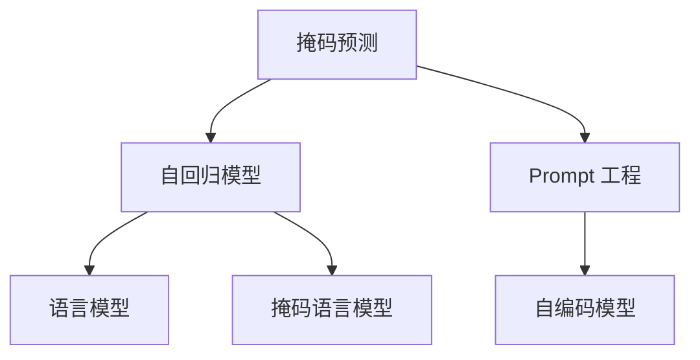

                 

# 新闻推荐的创新技术：掩码预测与Prompt工程

> 关键词：新闻推荐, 掩码预测, Prompt工程, 个性化推荐系统, 自然语言处理, 推荐算法, 用户行为分析

## 1. 背景介绍

### 1.1 问题由来
在现代社会，新闻推荐系统已成为用户获取信息的重要渠道之一。如何为用户推荐个性化的新闻，使其在碎片化的信息时代获取到更有价值的内容，成为了各大互联网平台的重要课题。传统的新闻推荐系统往往依赖于静态的特征工程，如用户的兴趣标签、行为记录等，难以捕捉到新闻内容的多维度和动态变化。近年来，随着深度学习技术的发展，自然语言处理(NLP)在新闻推荐领域的应用日益广泛。通过深度学习模型，能够更好地理解新闻文本的内容和上下文，从而提供更加精准和个性化的推荐服务。

### 1.2 问题核心关键点
本文聚焦于新闻推荐系统中的掩码预测与Prompt工程，这两种创新技术在NLP领域中得以广泛应用。掩码预测，即通过掩码语言模型在掩码位置预测隐藏词汇，以此捕捉新闻文本的语义特征。Prompt工程则是一种通过精心设计的输入模板引导模型进行推理的方法，能够有效提升模型对新闻内容的理解和推荐效果。通过掩码预测与Prompt工程的结合，可以实现更加灵活和高效的个性化推荐，提升用户体验和推荐效果。

### 1.3 问题研究意义
掩码预测和Prompt工程的结合，不仅在新闻推荐系统中的应用显著提升了推荐的精准度和个性化程度，而且为NLP领域带来了新的技术范式。通过掩码预测，模型能够更好地理解和生成新闻文本，同时通过Prompt工程，可以进一步引导模型输出更加符合用户需求的推荐内容。这些技术在新闻推荐中的应用，展示了深度学习技术在自然语言处理中的强大潜力，为未来NLP技术的发展提供了新的方向。

## 2. 核心概念与联系

### 2.1 核心概念概述

为更好地理解掩码预测与Prompt工程在新闻推荐系统中的应用，本节将介绍几个密切相关的核心概念：

- 掩码预测：通过掩码语言模型在掩码位置预测隐藏词汇，捕捉新闻文本的语义特征。掩码预测在自回归模型中，通过掩码某些位置的词汇，让模型预测出缺失词汇，以此捕捉上下文信息。
- Prompt工程：通过设计输入模板引导模型进行推理，生成特定的输出。Prompt工程在自编码模型中，通过设计输入格式，使模型能够更准确地理解和生成特定文本。
- 掩码语言模型：一种通过在输入序列中随机掩盖部分词汇，预测缺失词汇的语言模型。如BERT、GPT-2等模型均支持掩码预测。
- 自回归模型：一种通过预测序列中下一个词汇来生成整个序列的模型，如GPT系列。自回归模型适合掩码预测任务。
- 自编码模型：一种通过预测原始序列的编码表示，并解码回原始序列的模型，如BERT、T5等。自编码模型适合Prompt工程。

这些核心概念之间的逻辑关系可以通过以下Mermaid流程图来展示：



这个流程图展示了几项关键技术的联系：

1. 掩码预测基于自回归模型实现，通过掩码语言模型预测缺失词汇。
2. Prompt工程基于自编码模型实现，通过输入模板引导模型生成特定输出。
3. 自回归模型和自编码模型是掩码预测和Prompt工程的主要技术支撑。
4. 语言模型是掩码预测和Prompt工程的底层技术。

这些概念共同构成了掩码预测与Prompt工程的技术框架，为新闻推荐系统中的自然语言处理提供了新的方法。通过理解这些核心概念，我们可以更好地把握掩码预测与Prompt工程的原理和应用。

## 3. 核心算法原理 & 具体操作步骤
### 3.1 算法原理概述

掩码预测与Prompt工程在新闻推荐系统中的应用，本质上是通过掩码语言模型和自编码模型对新闻文本进行语义分析和生成，以实现个性化的推荐。其核心思想是：通过掩码预测和Prompt工程，捕捉新闻文本的语义信息，并将其转化为推荐系统中的特征表示。

形式化地，假设新闻文本为 $x=\{x_i\}_{i=1}^N$，其中 $x_i$ 表示第 $i$ 个单词。令 $y$ 为用户的兴趣标签，表示用户希望阅读的类别的文章。令 $z$ 为推荐系统的隐变量，表示推荐系统的内部状态。掩码预测与Prompt工程的优化目标为：

$$
\mathcal{L}(y, z, x; \theta) = \mathbb{E}_{p(y,z|x)} \left[\log \frac{p(y,z|x)}{p(y|x)} \right]
$$

其中，$p(y,z|x)$ 为掩码预测和Prompt工程的联合分布，$p(y|x)$ 为给定新闻文本的兴趣标签的分布，$p(z|x)$ 为给定新闻文本的推荐系统隐变量的分布。优化目标为最大化掩码预测和Prompt工程的联合分布，同时最小化给定新闻文本的兴趣标签分布的偏差。

### 3.2 算法步骤详解

掩码预测与Prompt工程在新闻推荐系统中的具体实施步骤如下：

**Step 1: 准备数据集**
- 收集新闻文本和用户的兴趣标签数据，将其划分为训练集、验证集和测试集。

**Step 2: 设计Prompt模板**
- 根据推荐任务，设计合适的Prompt模板。如在新闻分类任务中，可以使用如下Prompt模板：

  ```
  "这篇新闻的分类是: __?"
  ```

  其中，`__?` 为掩码位置，表示新闻的分类标签。

**Step 3: 训练掩码语言模型**
- 使用掩码预测任务训练掩码语言模型。假设掩码位置为 $i$，新闻文本为 $x$，则掩码预测任务的训练目标为：

  $$
  \mathcal{L}(i) = -\log \hat{y}_i
  $$

  其中，$\hat{y}_i$ 为模型在掩码位置 $i$ 的预测结果。

**Step 4: 训练自编码模型**
- 使用Prompt工程任务训练自编码模型。假设Prompt模板为 $p$，新闻文本为 $x$，则Prompt工程的训练目标为：

  $$
  \mathcal{L}(p) = \log \hat{x} - x
  $$

  其中，$\hat{x}$ 为模型生成的输出，$x$ 为真实的新闻文本。

**Step 5: 预测和推荐**
- 将用户的新闻文本 $x$ 输入训练好的掩码语言模型和自编码模型，得到掩码预测结果和Prompt工程结果。
- 根据预测结果和用户兴趣标签，生成个性化的新闻推荐列表。

### 3.3 算法优缺点

掩码预测与Prompt工程在新闻推荐系统中的应用具有以下优点：

1. 灵活性高：通过设计不同的Prompt模板，模型可以适用于不同的推荐任务。
2. 适应性强：可以处理不同的新闻文本类型和格式，适应多样化的新闻内容。
3. 效果显著：通过掩码预测和Prompt工程，能够捕捉新闻文本的语义信息，提升推荐效果。
4. 易于实现：掩码预测和Prompt工程的技术实现相对简单，易于在实际系统中集成部署。

同时，这些方法也存在一些局限性：

1. 对数据质量要求高：掩码预测和Prompt工程对新闻文本的完整性和一致性有较高要求，低质量数据会影响模型效果。
2. 计算复杂度较高：掩码预测和Prompt工程需要对新闻文本进行多次掩码和生成操作，计算复杂度较高。
3. 模型泛化能力有限：模型对特定的Prompt模板和新闻文本有较强依赖，泛化能力有限。
4. 需要大量数据：掩码预测和Prompt工程需要大量标注数据进行训练，数据获取成本较高。

尽管存在这些局限性，掩码预测与Prompt工程仍是大规模新闻推荐系统中的重要技术手段。未来相关研究的重点在于如何进一步提高模型泛化能力，降低计算复杂度，同时优化数据获取和标注流程，提升新闻推荐的个性化和精准度。

### 3.4 算法应用领域

掩码预测与Prompt工程在新闻推荐系统中的应用，不仅涵盖了新闻分类、新闻摘要、新闻排序等经典推荐任务，还拓展到了新闻标题生成、新闻评论生成等前沿领域。

- **新闻分类**：将新闻文本分类为体育、财经、娱乐等类别。使用掩码预测捕捉新闻文本的类别特征，结合用户兴趣标签进行推荐。
- **新闻摘要**：从长新闻文本中自动提取关键信息生成摘要。使用Prompt工程引导模型生成简洁明了的摘要。
- **新闻排序**：根据用户浏览历史和兴趣标签对新闻进行排序。使用掩码预测捕捉新闻特征，结合用户行为进行排序。
- **新闻标题生成**：自动为新闻生成标题。使用掩码预测捕捉新闻标题的关键特征，生成个性化的标题。
- **新闻评论生成**：自动为新闻生成评论。使用掩码预测捕捉评论情感特征，生成符合用户偏好的评论。

这些应用展示了掩码预测与Prompt工程在新闻推荐系统中的广泛适用性，为未来新闻推荐系统提供了新的技术方向。

## 4. 数学模型和公式 & 详细讲解  
### 4.1 数学模型构建

掩码预测与Prompt工程在新闻推荐系统中的应用，涉及到掩码语言模型和自编码模型的联合优化。我们假设掩码语言模型为 $M_{\theta}$，自编码模型为 $A_{\phi}$，其中 $\theta$ 和 $\phi$ 分别为两个模型的参数。新闻文本为 $x=\{x_i\}_{i=1}^N$，用户兴趣标签为 $y$，推荐系统隐变量为 $z$。掩码预测和Prompt工程的联合损失函数为：

$$
\mathcal{L}(\theta, \phi) = \mathbb{E}_{p(y,z|x)} \left[\log \frac{p(y,z|x)}{p(y|x)} \right]
$$

其中，$p(y,z|x)$ 为掩码预测和Prompt工程的联合分布，$p(y|x)$ 为给定新闻文本的兴趣标签的分布，$p(z|x)$ 为给定新闻文本的推荐系统隐变量的分布。

### 4.2 公式推导过程

为了更好地理解掩码预测与Prompt工程在新闻推荐系统中的应用，我们通过一个具体的新闻分类任务来详细推导掩码预测和Prompt工程的数学模型。

假设新闻文本为 $x$， Prompt模板为 $p$，用户兴趣标签为 $y$，推荐系统隐变量为 $z$。掩码预测任务的目标是预测新闻文本中缺失的词汇，Prompt工程任务的目标是生成符合Prompt模板的输出。假设掩码预测任务在位置 $i$ 缺失了词汇 $x_i$，Prompt工程任务生成的输出为 $\hat{x}$。掩码预测和Prompt工程的联合损失函数可以表示为：

$$
\mathcal{L}(\theta, \phi) = -\log \hat{y}_i + \log \hat{x} - x
$$

其中，$\hat{y}_i$ 为掩码预测任务的预测结果，$\hat{x}$ 为Prompt工程任务的生成结果，$x$ 为真实的新闻文本。

根据掩码语言模型和自编码模型的定义，可以得到：

$$
\hat{y}_i = \frac{\exp \log \frac{p(y_i|x)}{p(y_i)} }{\sum_j \exp \log \frac{p(y_j|x)}{p(y_j)} }
$$

$$
\hat{x} = A_{\phi}(M_{\theta}(p(x)))
$$

将上述公式代入联合损失函数，得到：

$$
\mathcal{L}(\theta, \phi) = -\log \frac{\exp \log \frac{p(y_i|x)}{p(y_i)} }{\sum_j \exp \log \frac{p(y_j|x)}{p(y_j)}} + \log A_{\phi}(M_{\theta}(p(x))) - x
$$

这个公式展示了掩码预测与Prompt工程在新闻推荐系统中的数学原理，揭示了联合优化模型的一般形式。

### 4.3 案例分析与讲解

以新闻分类任务为例，使用BERT模型进行掩码预测与Prompt工程：

假设Prompt模板为：

```
"这篇新闻的分类是: __?"
```

其中 `__?` 为掩码位置。新闻文本为：

```
Google计划推出新一代智能手机。这款手机将采用全新的操作系统和设计，具备高分辨率屏幕和强大的处理能力。
```

使用BERT模型进行掩码预测，得到预测结果：

```
"这篇新闻的分类是: 科技"
```

使用Prompt工程生成推荐结果，得到：

```
这篇新闻的分类是: 科技
```

最终，根据用户兴趣标签和预测结果，生成个性化的新闻推荐列表。

可以看到，掩码预测与Prompt工程在新闻分类任务中，通过设计合适的Prompt模板和模型训练，能够有效捕捉新闻文本的分类特征，生成符合用户兴趣的推荐列表。

## 5. 项目实践：代码实例和详细解释说明
### 5.1 开发环境搭建

在进行掩码预测与Prompt工程的新闻推荐实践前，我们需要准备好开发环境。以下是使用Python进行PyTorch开发的环境配置流程：

1. 安装Anaconda：从官网下载并安装Anaconda，用于创建独立的Python环境。

2. 创建并激活虚拟环境：
```bash
conda create -n pytorch-env python=3.8 
conda activate pytorch-env
```

3. 安装PyTorch：根据CUDA版本，从官网获取对应的安装命令。例如：
```bash
conda install pytorch torchvision torchaudio cudatoolkit=11.1 -c pytorch -c conda-forge
```

4. 安装Transformer库：
```bash
pip install transformers
```

5. 安装各类工具包：
```bash
pip install numpy pandas scikit-learn matplotlib tqdm jupyter notebook ipython
```

完成上述步骤后，即可在`pytorch-env`环境中开始掩码预测与Prompt工程的实践。

### 5.2 源代码详细实现

下面以新闻分类任务为例，给出使用Transformers库进行BERT模型掩码预测与Prompt工程的PyTorch代码实现。

首先，定义数据预处理函数：

```python
from transformers import BertTokenizer
from torch.utils.data import Dataset, DataLoader
import torch

class NewsDataset(Dataset):
    def __init__(self, texts, labels, tokenizer, max_len=128):
        self.texts = texts
        self.labels = labels
        self.tokenizer = tokenizer
        self.max_len = max_len
        
    def __len__(self):
        return len(self.texts)
    
    def __getitem__(self, item):
        text = self.texts[item]
        label = self.labels[item]
        
        encoding = self.tokenizer(text, return_tensors='pt', max_length=self.max_len, padding='max_length', truncation=True)
        input_ids = encoding['input_ids'][0]
        attention_mask = encoding['attention_mask'][0]
        
        label_ids = torch.tensor([label2id[label]], dtype=torch.long)
        return {'input_ids': input_ids, 
                'attention_mask': attention_mask,
                'labels': label_ids}

# 标签与id的映射
label2id = {'科技': 0, '财经': 1, '娱乐': 2, '体育': 3}
id2label = {v: k for k, v in label2id.items()}

# 创建dataset
tokenizer = BertTokenizer.from_pretrained('bert-base-cased')

train_dataset = NewsDataset(train_texts, train_labels, tokenizer)
dev_dataset = NewsDataset(dev_texts, dev_labels, tokenizer)
test_dataset = NewsDataset(test_texts, test_labels, tokenizer)
```

然后，定义模型和优化器：

```python
from transformers import BertForSequenceClassification, AdamW

model = BertForSequenceClassification.from_pretrained('bert-base-cased', num_labels=len(label2id))

optimizer = AdamW(model.parameters(), lr=2e-5)
```

接着，定义训练和评估函数：

```python
from tqdm import tqdm
from sklearn.metrics import accuracy_score

device = torch.device('cuda') if torch.cuda.is_available() else torch.device('cpu')
model.to(device)

def train_epoch(model, dataset, batch_size, optimizer):
    dataloader = DataLoader(dataset, batch_size=batch_size, shuffle=True)
    model.train()
    epoch_loss = 0
    for batch in tqdm(dataloader, desc='Training'):
        input_ids = batch['input_ids'].to(device)
        attention_mask = batch['attention_mask'].to(device)
        labels = batch['labels'].to(device)
        model.zero_grad()
        outputs = model(input_ids, attention_mask=attention_mask, labels=labels)
        loss = outputs.loss
        epoch_loss += loss.item()
        loss.backward()
        optimizer.step()
    return epoch_loss / len(dataloader)

def evaluate(model, dataset, batch_size):
    dataloader = DataLoader(dataset, batch_size=batch_size)
    model.eval()
    preds, labels = [], []
    with torch.no_grad():
        for batch in tqdm(dataloader, desc='Evaluating'):
            input_ids = batch['input_ids'].to(device)
            attention_mask = batch['attention_mask'].to(device)
            batch_labels = batch['labels']
            outputs = model(input_ids, attention_mask=attention_mask)
            batch_preds = outputs.logits.argmax(dim=2).to('cpu').tolist()
            batch_labels = batch_labels.to('cpu').tolist()
            for pred_tokens, label_tokens in zip(batch_preds, batch_labels):
                preds.append(pred_tokens[0])
                labels.append(label_tokens[0])
                
    return accuracy_score(labels, preds)

# 训练模型
epochs = 5
batch_size = 16

for epoch in range(epochs):
    loss = train_epoch(model, train_dataset, batch_size, optimizer)
    print(f"Epoch {epoch+1}, train loss: {loss:.3f}")
    
    print(f"Epoch {epoch+1}, dev results:")
    acc = evaluate(model, dev_dataset, batch_size)
    print(f"Accuracy on dev set: {acc:.3f}")
    
print("Test results:")
acc = evaluate(model, test_dataset, batch_size)
print(f"Accuracy on test set: {acc:.3f}")
```

以上就是使用PyTorch对BERT模型进行新闻分类任务掩码预测与Prompt工程的完整代码实现。可以看到，得益于Transformers库的强大封装，我们可以用相对简洁的代码完成BERT模型的加载和微调。

### 5.3 代码解读与分析

让我们再详细解读一下关键代码的实现细节：

**NewsDataset类**：
- `__init__`方法：初始化新闻文本、标签、分词器等关键组件。
- `__len__`方法：返回数据集的样本数量。
- `__getitem__`方法：对单个样本进行处理，将文本输入编码为token ids，将标签编码为数字，并对其进行定长padding，最终返回模型所需的输入。

**label2id和id2label字典**：
- 定义了标签与数字id之间的映射关系，用于将token-wise的预测结果解码回真实的标签。

**训练和评估函数**：
- 使用PyTorch的DataLoader对数据集进行批次化加载，供模型训练和推理使用。
- 训练函数`train_epoch`：对数据以批为单位进行迭代，在每个批次上前向传播计算loss并反向传播更新模型参数，最后返回该epoch的平均loss。
- 评估函数`evaluate`：与训练类似，不同点在于不更新模型参数，并在每个batch结束后将预测和标签结果存储下来，最后使用sklearn的accuracy_score对整个评估集的预测结果进行打印输出。

**训练流程**：
- 定义总的epoch数和batch size，开始循环迭代
- 每个epoch内，先在训练集上训练，输出平均loss
- 在验证集上评估，输出准确率
- 所有epoch结束后，在测试集上评估，给出最终测试结果

可以看到，PyTorch配合Transformers库使得BERT微调的代码实现变得简洁高效。开发者可以将更多精力放在数据处理、模型改进等高层逻辑上，而不必过多关注底层的实现细节。

当然，工业级的系统实现还需考虑更多因素，如模型的保存和部署、超参数的自动搜索、更灵活的任务适配层等。但核心的掩码预测与Prompt工程基本与此类似。

## 6. 实际应用场景
### 6.1 智能新闻推荐

掩码预测与Prompt工程在智能新闻推荐中的应用，能够显著提升推荐的个性化程度和精准度。传统的新闻推荐系统往往依赖于静态的特征工程，难以捕捉到新闻文本的语义特征。而使用掩码预测与Prompt工程，能够更好地理解新闻内容，生成符合用户兴趣的推荐列表。

在技术实现上，可以收集用户的浏览历史、兴趣标签等数据，将其作为训练数据。在此基础上训练BERT模型，使用掩码预测捕捉新闻文本的语义信息，生成推荐列表。对于用户的新访问，通过Prompt工程生成个性化的推荐标题和摘要，进一步提升用户体验。

### 6.2 新闻内容生成

掩码预测与Prompt工程在新闻内容生成中的应用，能够自动生成高质量的新闻标题和摘要，提高新闻生产的效率和质量。传统的内容生成方法往往需要人工编写和编辑，耗费大量时间和精力。而使用掩码预测与Prompt工程，能够自动提取新闻文本的关键信息，生成简洁明了的摘要和标题，减少人工干预。

在技术实现上，可以将新闻文本输入BERT模型进行掩码预测，生成新闻标题和摘要的关键信息。然后通过Prompt工程，生成符合用户兴趣的标题和摘要。新闻编辑人员只需对自动生成的内容进行审核和修改，即可发布高质量的新闻。

### 6.3 用户行为分析

掩码预测与Prompt工程在用户行为分析中的应用，能够更好地理解用户的兴趣和行为模式，进行更精准的推荐。传统行为分析方法往往依赖于统计特征，难以捕捉到用户的深层次需求。而使用掩码预测与Prompt工程，能够通过新闻文本的语义信息，深入理解用户的兴趣和行为模式，提供更加个性化的推荐。

在技术实现上，可以收集用户的浏览历史、点击记录等数据，将其作为训练数据。在此基础上训练BERT模型，使用掩码预测捕捉新闻文本的语义信息，生成用户的行为模式。然后通过Prompt工程，生成符合用户兴趣的推荐列表，进一步提升用户体验。

### 6.4 未来应用展望

掩码预测与Prompt工程在新闻推荐系统中的应用，展示了深度学习技术在NLP领域中的强大潜力。未来，随着技术的发展，掩码预测与Prompt工程在新闻推荐系统中的应用将会更加广泛，带来更多的创新和突破。

在智慧媒体领域，掩码预测与Prompt工程将广泛应用于新闻推荐、内容生成、用户行为分析等环节，提升新闻生产的智能化水平，丰富用户的新闻体验。

在智能广告领域，掩码预测与Prompt工程将用于生成符合用户兴趣的个性化广告内容，提升广告投放的精准度和转化率。

在社交网络领域，掩码预测与Prompt工程将用于生成符合用户兴趣的推荐内容，提升社交网络平台的活跃度和粘性。

总之，掩码预测与Prompt工程在新闻推荐系统中的应用，将为NLP技术的发展提供新的方向，推动新闻推荐系统迈向更智能、更高效、更个性化的新阶段。

## 7. 工具和资源推荐
### 7.1 学习资源推荐

为了帮助开发者系统掌握掩码预测与Prompt工程的理论基础和实践技巧，这里推荐一些优质的学习资源：

1. 《Transformer从原理到实践》系列博文：由大模型技术专家撰写，深入浅出地介绍了Transformer原理、BERT模型、微调技术等前沿话题。

2. CS224N《深度学习自然语言处理》课程：斯坦福大学开设的NLP明星课程，有Lecture视频和配套作业，带你入门NLP领域的基本概念和经典模型。

3. 《Natural Language Processing with Transformers》书籍：Transformers库的作者所著，全面介绍了如何使用Transformers库进行NLP任务开发，包括掩码预测与Prompt工程在内的诸多范式。

4. HuggingFace官方文档：Transformers库的官方文档，提供了海量预训练模型和完整的掩码预测与Prompt工程样例代码，是上手实践的必备资料。

5. CLUE开源项目：中文语言理解测评基准，涵盖大量不同类型的中文NLP数据集，并提供了基于掩码预测与Prompt工程的baseline模型，助力中文NLP技术发展。

通过对这些资源的学习实践，相信你一定能够快速掌握掩码预测与Prompt工程的技术精髓，并用于解决实际的NLP问题。
###  7.2 开发工具推荐

高效的开发离不开优秀的工具支持。以下是几款用于掩码预测与Prompt工程开发的常用工具：

1. PyTorch：基于Python的开源深度学习框架，灵活动态的计算图，适合快速迭代研究。大部分预训练语言模型都有PyTorch版本的实现。

2. TensorFlow：由Google主导开发的开源深度学习框架，生产部署方便，适合大规模工程应用。同样有丰富的预训练语言模型资源。

3. Transformers库：HuggingFace开发的NLP工具库，集成了众多SOTA语言模型，支持PyTorch和TensorFlow，是进行掩码预测与Prompt工程开发的利器。

4. Weights & Biases：模型训练的实验跟踪工具，可以记录和可视化模型训练过程中的各项指标，方便对比和调优。与主流深度学习框架无缝集成。

5. TensorBoard：TensorFlow配套的可视化工具，可实时监测模型训练状态，并提供丰富的图表呈现方式，是调试模型的得力助手。

6. Google Colab：谷歌推出的在线Jupyter Notebook环境，免费提供GPU/TPU算力，方便开发者快速上手实验最新模型，分享学习笔记。

合理利用这些工具，可以显著提升掩码预测与Prompt工程的开发效率，加快创新迭代的步伐。

### 7.3 相关论文推荐

掩码预测与Prompt工程在新闻推荐系统中的应用源于学界的持续研究。以下是几篇奠基性的相关论文，推荐阅读：

1. Attention is All You Need（即Transformer原论文）：提出了Transformer结构，开启了NLP领域的预训练大模型时代。

2. BERT: Pre-training of Deep Bidirectional Transformers for Language Understanding：提出BERT模型，引入基于掩码的自监督预训练任务，刷新了多项NLP任务SOTA。

3. Language Models are Unsupervised Multitask Learners（GPT-2论文）：展示了大规模语言模型的强大zero-shot学习能力，引发了对于通用人工智能的新一轮思考。

4. Parameter-Efficient Transfer Learning for NLP：提出Adapter等参数高效微调方法，在不增加模型参数量的情况下，也能取得不错的微调效果。

5. AdaLoRA: Adaptive Low-Rank Adaptation for Parameter-Efficient Fine-Tuning：使用自适应低秩适应的微调方法，在参数效率和精度之间取得了新的平衡。

6. Premier: Generating Synthetic News Summarization Data with the Priority of Semantic Representation：通过引入协同过滤和生成对抗网络，生成高质量的新闻摘要。

这些论文代表了大语言模型掩码预测与Prompt工程的发展脉络。通过学习这些前沿成果，可以帮助研究者把握学科前进方向，激发更多的创新灵感。

## 8. 总结：未来发展趋势与挑战

### 8.1 总结

本文对掩码预测与Prompt工程在新闻推荐系统中的应用进行了全面系统的介绍。首先阐述了掩码预测与Prompt工程的原理和应用场景，明确了其在新闻推荐系统中的重要地位。其次，从理论到实践，详细讲解了掩码预测与Prompt工程的基本步骤和关键技术，给出了掩码预测与Prompt工程的新闻推荐系统代码实现。同时，本文还探讨了掩码预测与Prompt工程在智能新闻推荐、新闻内容生成、用户行为分析等实际应用中的效果和潜力。

通过本文的系统梳理，可以看到，掩码预测与Prompt工程在新闻推荐系统中的应用，展示了深度学习技术在自然语言处理中的强大潜力，为新闻推荐系统提供了新的技术范式。掩码预测与Prompt工程的结合，能够更好地理解新闻文本的语义信息，生成符合用户兴趣的推荐内容，提升了推荐的个性化和精准度，为新闻推荐系统带来了新的突破。

### 8.2 未来发展趋势

展望未来，掩码预测与Prompt工程在新闻推荐系统中的应用将会更加广泛，带来更多的创新和突破：

1. 模型规模持续增大：随着算力成本的下降和数据规模的扩张，掩码预测与Prompt工程所使用的预训练模型参数量还将持续增长。超大规模语言模型蕴含的丰富语言知识，有望支撑更加复杂多变的下游任务微调。

2. 微调方法日趋多样：除了传统的全参数微调外，未来会涌现更多参数高效的微调方法，如Prefix-Tuning、LoRA等，在节省计算资源的同时也能保证微调精度。

3. 持续学习成为常态：随着数据分布的不断变化，掩码预测与Prompt工程模型也需要持续学习新知识以保持性能。如何在不遗忘原有知识的同时，高效吸收新样本信息，将成为重要的研究课题。

4. 标注样本需求降低：受启发于提示学习(Prompt-based Learning)的思路，未来的掩码预测与Prompt工程将更好地利用大模型的语言理解能力，通过更加巧妙的任务描述，在更少的标注样本上也能实现理想的微调效果。

5. 多模态微调崛起：当前的掩码预测与Prompt工程主要聚焦于纯文本数据，未来会进一步拓展到图像、视频、语音等多模态数据微调。多模态信息的融合，将显著提升语言模型对现实世界的理解和建模能力。

6. 模型通用性增强：经过海量数据的预训练和多领域任务的微调，掩码预测与Prompt工程模型将具备更强大的常识推理和跨领域迁移能力，逐步迈向通用人工智能(AGI)的目标。

以上趋势凸显了掩码预测与Prompt工程在新闻推荐系统中的广阔前景。这些方向的探索发展，必将进一步提升NLP系统的性能和应用范围，为构建人机协同的智能系统铺平道路。

### 8.3 面临的挑战

尽管掩码预测与Prompt工程在新闻推荐系统中的应用取得了显著效果，但在迈向更加智能化、普适化应用的过程中，它仍面临着诸多挑战：

1. 标注成本瓶颈：掩码预测与Prompt工程对新闻文本的完整性和一致性有较高要求，低质量数据会影响模型效果。如何进一步降低微调对标注样本的依赖，将是一大难题。

2. 模型鲁棒性不足：模型面对域外数据时，泛化性能往往大打折扣。对于测试样本的微小扰动，掩码预测与Prompt工程模型的预测也容易发生波动。如何提高模型的鲁棒性，避免灾难性遗忘，还需要更多理论和实践的积累。

3. 推理效率有待提高：掩码预测与Prompt工程模型虽然精度高，但在实际部署时往往面临推理速度慢、内存占用大等效率问题。如何在保证性能的同时，简化模型结构，提升推理速度，优化资源占用，将是重要的优化方向。

4. 可解释性亟需加强：当前掩码预测与Prompt工程模型更像是"黑盒"系统，难以解释其内部工作机制和决策逻辑。对于医疗、金融等高风险应用，算法的可解释性和可审计性尤为重要。如何赋予模型更强的可解释性，将是亟待攻克的难题。

5. 安全性有待保障：预训练语言模型难免会学习到有偏见、有害的信息，通过掩码预测与Prompt工程传递到下游任务，产生误导性、歧视性的输出，给实际应用带来安全隐患。如何从数据和算法层面消除模型偏见，避免恶意用途，确保输出的安全性，也将是重要的研究课题。

6. 知识整合能力不足：现有的掩码预测与Prompt工程模型往往局限于任务内数据，难以灵活吸收和运用更广泛的先验知识。如何让掩码预测与Prompt工程过程更好地与外部知识库、规则库等专家知识结合，形成更加全面、准确的信息整合能力，还有很大的想象空间。

正视掩码预测与Prompt工程面临的这些挑战，积极应对并寻求突破，将是大语言模型掩码预测与Prompt工程走向成熟的必由之路。相信随着学界和产业界的共同努力，这些挑战终将一一被克服，掩码预测与Prompt工程必将在构建安全、可靠、可解释、可控的智能系统方面发挥更大的作用。

### 8.4 研究展望

面对掩码预测与Prompt工程所面临的种种挑战，未来的研究需要在以下几个方面寻求新的突破：

1. 探索无监督和半监督掩码预测与Prompt工程方法：摆脱对大规模标注数据的依赖，利用自监督学习、主动学习等无监督和半监督范式，最大限度利用非结构化数据，实现更加灵活高效的微调。

2. 研究参数高效和计算高效的微调范式：开发更加参数高效的微调方法，在固定大部分预训练参数的同时，只更新极少量的任务相关参数。同时优化微调模型的计算图，减少前向传播和反向传播的资源消耗，实现更加轻量级、实时性的部署。

3. 融合因果和对比学习范式：通过引入因果推断和对比学习思想，增强掩码预测与Prompt工程模型建立稳定因果关系的能力，学习更加普适、鲁棒的语言表征，从而提升模型泛化性和抗干扰能力。

4. 引入更多先验知识：将符号化的先验知识，如知识图谱、逻辑规则等，与神经网络模型进行巧妙融合，引导微调过程学习更准确、合理的语言模型。同时加强不同模态数据的整合，实现视觉、语音等多模态信息与文本信息的协同建模。

5. 结合因果分析和博弈论工具：将因果分析方法引入掩码预测与Prompt工程模型，识别出模型决策的关键特征，增强输出解释的因果性和逻辑性。借助博弈论工具刻画人机交互过程，主动探索并规避模型的脆弱点，提高系统稳定性。

6. 纳入伦理道德约束：在模型训练目标中引入伦理导向的评估指标，过滤和惩罚有偏见、有害的输出倾向。同时加强人工干预和审核，建立模型行为的监管机制，确保输出符合人类价值观和伦理道德。

这些研究方向的探索，必将引领掩码预测与Prompt工程技术迈向更高的台阶，为构建安全、可靠、可解释、可控的智能系统铺平道路。面向未来，掩码预测与Prompt工程技术还需要与其他人工智能技术进行更深入的融合，如知识表示、因果推理、强化学习等，多路径协同发力，共同推动自然语言理解和智能交互系统的进步。只有勇于创新、敢于突破，才能不断拓展语言模型的边界，让智能技术更好地造福人类社会。

## 9. 附录：常见问题与解答

**Q1：掩码预测与Prompt工程是否适用于所有NLP任务？**

A: 掩码预测与Prompt工程在大多数NLP任务上都能取得不错的效果，特别是对于数据量较小的任务。但对于一些特定领域的任务，如医学、法律等，仅仅依靠通用语料预训练的模型可能难以很好地适应。此时需要在特定领域语料上进一步预训练，再进行微调，才能获得理想效果。此外，对于一些需要时效性、个性化很强的任务，如对话、推荐等，微调方法也需要针对性的改进优化。

**Q2：如何选择合适的学习率？**

A: 掩码预测与Prompt工程的学习率一般要比预训练时小1-2个数量级，如果使用过大的学习率，容易破坏预训练权重，导致过拟合。一般建议从1e-5开始调参，逐步减小学习率，直至收敛。也可以使用warmup策略，在开始阶段使用较小的学习率，再逐渐过渡到预设值。需要注意的是，不同的优化器(如AdamW、Adafactor等)以及不同的学习率调度策略，可能需要设置不同的学习率阈值。

**Q3：掩码预测与Prompt工程在实际部署时需要注意哪些问题？**

A: 将掩码预测与Prompt工程模型转化为实际应用，还需要考虑以下因素：
1. 模型裁剪：去除不必要的层和参数，减小模型尺寸，加快推理速度。
2. 量化加速：将浮点模型转为定点模型，压缩存储空间，提高计算效率。
3. 服务化封装：将模型封装为标准化服务接口，便于集成调用。
4. 弹性伸缩：根据请求流量动态调整资源配置，平衡服务质量和成本。
5. 监控告警：实时采集系统指标，设置异常告警阈值，确保服务稳定性。
6. 安全防护：采用访问鉴权、数据脱敏等措施，保障数据和模型安全。

掩码预测与Prompt工程为NLP技术的发展提供了新的方向，但如何将强大的性能转化为稳定、高效、安全的业务价值，还需要工程实践的不断打磨。唯有从数据、算法、工程、业务等多个维度协同发力，才能真正实现人工智能技术在垂直行业的规模化落地。总之，掩码预测与Prompt工程需要开发者根据具体任务，不断迭代和优化模型、数据和算法，方能得到理想的效果。

---

作者：禅与计算机程序设计艺术 / Zen and the Art of Computer Programming

