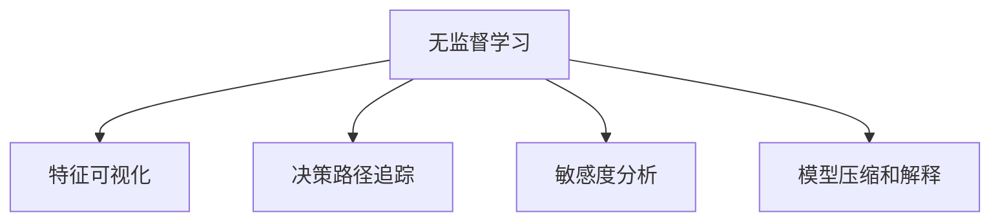

                 

# 无监督学习的可解释性:让AI决策更加透明

在当今数据驱动的AI时代，无监督学习因其无需标注数据和强大的数据挖掘能力，成为机器学习领域的重要分支。然而，无监督学习的模型往往像"黑盒"般难以解释，这限制了其在许多实际应用场景中的推广和信任度。如何增强无监督学习的可解释性，使其决策过程更加透明，是当前AI研究的重要课题。本文将系统探讨无监督学习的可解释性问题，介绍常用的可解释性技术和方法，并给出实际应用的代码示例。

## 1. 背景介绍

### 1.1 问题由来
无监督学习通常指对未标注的数据进行建模，旨在发现数据的内在结构和规律。与有监督学习不同，无监督学习不依赖于显式的标签信息，其模型和算法设计上缺乏直观解释，因此在实际应用中常面临"黑盒"问题。例如，在聚类、降维等任务中，模型的输出结果可能难以用直观的方式理解，决策过程缺乏透明度，难以进行有效验证和调优。

### 1.2 问题核心关键点
为了提升无监督学习的可解释性，研究者提出了多种可解释性技术和方法，旨在增强模型输出结果的可理解性和可验证性。这些技术主要包括但不限于：
- 特征可视化：通过可视化工具展示模型学习到的特征分布，帮助我们理解模型决策过程。
- 决策路径追踪：记录模型决策过程中的关键节点和特征变化，实现对决策路径的可视化。
- 敏感度分析：评估模型输出对输入数据的敏感程度，识别影响模型决策的关键因素。
- 模型压缩和解释：通过模型压缩和特征选择等方法，降低模型的复杂度，增强其可解释性。

## 2. 核心概念与联系

### 2.1 核心概念概述

为更好地理解无监督学习可解释性的核心概念，本节将介绍几个密切相关的核心概念：

- 无监督学习(Unsupervised Learning)：指在没有标签信息的情况下，对数据进行建模和分析的机器学习方法。典型的任务包括聚类、降维、关联规则学习等。
- 特征可视化(Feature Visualization)：通过各种可视化工具展示模型学习到的特征分布，帮助理解模型的决策过程。
- 决策路径追踪(Decision Path Tracking)：记录模型决策过程中的关键节点和特征变化，实现对决策路径的可视化。
- 敏感度分析(Sensitivity Analysis)：评估模型输出对输入数据的敏感程度，识别影响模型决策的关键因素。
- 模型压缩和解释(Model Compression and Interpretation)：通过模型压缩和特征选择等方法，降低模型的复杂度，增强其可解释性。

这些概念之间的逻辑关系可以通过以下Mermaid流程图来展示：



这个流程图展示而无监督学习的核心概念及其之间的关系：

1. 无监督学习模型通过数据自适应，自动发现数据中的结构和规律。
2. 特征可视化工具帮助理解模型学习到的特征分布。
3. 决策路径追踪技术记录模型决策过程中的关键节点和特征变化。
4. 敏感度分析评估模型对输入数据的敏感程度。
5. 模型压缩和解释方法降低模型复杂度，增强可解释性。

这些核心概念共同构成了无监督学习的研究框架，使其在发现数据结构的同时，也能够提供可理解的模型输出。

## 3. 核心算法原理 & 具体操作步骤

### 3.1 算法原理概述

无监督学习的可解释性问题，主要源于模型的"黑盒"特性和数据驱动的决策过程。为了提升模型的可解释性，研究者提出了多种技术手段，包括特征可视化、决策路径追踪、敏感度分析和模型压缩等方法。

### 3.2 算法步骤详解

以下将详细介绍这几种可解释性技术的详细步骤：

#### 3.2.1 特征可视化

特征可视化工具通过将模型学习到的特征分布可视化，帮助我们理解模型决策过程。常用的特征可视化方法包括：

- t-SNE：将高维特征映射到二维或三维空间，通过可视化展示不同特征之间的关系。
- UMAP：与t-SNE类似，但具有更高的计算效率和更好的局部保持能力。
- PCA：通过主成分分析，将高维特征降维到二维或三维空间，简化可视化结果。

#### 3.2.2 决策路径追踪

决策路径追踪技术通过记录模型决策过程中的关键节点和特征变化，实现对决策路径的可视化。常用的决策路径追踪方法包括：

- 特征重要性分析：通过计算各个特征对模型输出的贡献度，识别影响模型决策的关键特征。
- 局部解释方法：如SHAP值、LIME等，通过解释单个样本的模型输出，揭示决策路径中的关键特征。
- 决策树和规则学习：将模型输出映射到决策树或规则模型，可视化模型的决策过程。

#### 3.2.3 敏感度分析

敏感度分析通过评估模型输出对输入数据的敏感程度，识别影响模型决策的关键因素。常用的敏感度分析方法包括：

- 个体敏感度分析：计算模型输出对单个输入数据的敏感度，识别对输出结果影响最大的输入数据。
- 特征敏感度分析：计算模型输出对不同特征的敏感度，识别影响模型决策的关键特征。
- 局部敏感度分析：通过局部扰动输入数据，评估模型输出的变化趋势，揭示模型决策的稳健性。

#### 3.2.4 模型压缩和解释

模型压缩和解释方法通过降低模型复杂度，增强其可解释性。常用的模型压缩和解释方法包括：

- 模型压缩：通过剪枝、量化等技术，降低模型参数量和计算复杂度。
- 特征选择：通过特征重要性分析或特征工程，选择对模型输出影响最大的特征。
- 结构解释：通过可视化模型结构，帮助理解模型各层的功能和作用。

### 3.3 算法优缺点

无监督学习的可解释性技术具有以下优点：
1. 提升透明度：通过可视化和解释方法，模型决策过程变得更加透明，便于理解和验证。
2. 增强可信度：透明的模型输出有助于提升用户信任，特别是在医疗、金融等高风险领域。
3. 辅助调试：可视化和解释技术能够辅助开发者快速定位问题，优化模型性能。

然而，这些技术也存在一定的局限性：
1. 数据依赖：特征可视化、决策路径追踪和敏感度分析等方法高度依赖数据样本，缺乏一般性。
2. 解释误差：解释方法的准确性和可靠性取决于数据质量和模型复杂度，可能存在一定的解释误差。
3. 计算开销：复杂的解释方法如特征重要性分析和决策树等，可能带来较高的计算开销，影响模型性能。
4. 模型简化：模型压缩和特征选择等方法可能会牺牲模型精度，影响模型性能。

尽管存在这些局限性，但就目前而言，提升无监督学习的可解释性已经成为学界和工业界共同关注的重要问题。

### 3.4 算法应用领域

无监督学习的可解释性技术在多个领域得到了广泛应用，例如：

- 金融风险控制：通过敏感度分析和特征可视化，识别高风险客户或交易，增强模型可信度。
- 医疗诊断：通过决策路径追踪和特征可视化，理解疾病诊断过程中的关键因素，提升诊疗效果。
- 自然语言处理：通过敏感度分析和模型压缩，优化文本生成和分类模型的输出，提高模型可解释性。
- 图像识别：通过特征可视化、决策路径追踪和敏感度分析，提高图像分类和检测模型的性能和可信度。
- 推荐系统：通过特征选择和模型压缩，优化推荐模型的特征分布，增强用户推荐体验。

## 4. 数学模型和公式 & 详细讲解 & 举例说明

### 4.1 数学模型构建

为了更严格地描述无监督学习的可解释性问题，我们引入几个常见的数学模型和公式。

#### 4.1.1 t-SNE模型

t-SNE（T-distributed Stochastic Neighbor Embedding）是一种常用的非线性降维算法，能够将高维特征映射到二维或三维空间，用于特征可视化。

t-SNE的目标是最大化相邻样本在低维空间中的相似度，同时最小化非相邻样本之间的相似度。其数学模型如下：

$$
K(x_i, x_j) = \frac{\exp(-\frac{\|x_i-x_j\|^2}{2\sigma_i^2})}{\sum_{k\neq j}\exp(-\frac{\|x_i-x_k\|^2}{2\sigma_i^2})} \times \frac{\exp(-\frac{\|x_j-x_k\|^2}{2\sigma_j^2})}{\sum_{k\neq j}\exp(-\frac{\|x_j-x_k\|^2}{2\sigma_j^2})}
$$

其中，$x_i$和$x_j$表示输入样本，$K(x_i, x_j)$表示样本之间的相似度，$\sigma_i$和$\sigma_j$表示样本的局部方差。

#### 4.1.2 UMAP模型

UMAP（Uniform Manifold Approximation and Projection）是另一种常用的降维算法，具有较高的计算效率和较好的局部保持能力。

UMAP的目标是将高维数据映射到低维空间，同时尽可能地保留数据的局部结构。其数学模型如下：

$$
L = \min_{Y \in \mathbb{R}^d} \frac{1}{2} \sum_{i=1}^N \sum_{j \in \mathcal{N}(i)} (\|y_i - y_j\|_2^2 - d(p(x_i), p(x_j)))
$$

其中，$Y$表示低维空间中的数据点，$p(x_i)$表示样本$x_i$在低维空间中的概率分布，$\mathcal{N}(i)$表示样本$x_i$的近邻样本。

### 4.2 公式推导过程

#### 4.2.1 t-SNE公式推导

t-SNE的目标是最大化相邻样本在低维空间中的相似度，同时最小化非相邻样本之间的相似度。其推导过程较为复杂，但主要思路是通过KL散度最小化，将高维特征映射到低维空间。

#### 4.2.2 UMAP公式推导

UMAP的目标是将高维数据映射到低维空间，同时尽可能地保留数据的局部结构。其推导过程涉及优化问题和非线性映射等复杂概念，但主要思路是通过最小化重构误差和局部保留度，实现高维到低维的映射。

### 4.3 案例分析与讲解

以聚类任务为例，展示如何使用特征可视化方法理解模型学习到的特征分布。

假设我们使用K-means聚类算法对某个高维数据集进行聚类，得到K个簇的聚类中心。我们可以通过t-SNE或UMAP等降维方法，将聚类中心映射到二维或三维空间，展示每个簇的中心位置和分布情况。这可以帮助我们理解模型学习到的数据结构，识别不同簇之间的特征差异。

## 5. 项目实践：代码实例和详细解释说明

### 5.1 开发环境搭建

在进行无监督学习可解释性实践前，我们需要准备好开发环境。以下是使用Python进行TensorFlow和Matplotlib开发的环境配置流程：

1. 安装Anaconda：从官网下载并安装Anaconda，用于创建独立的Python环境。

2. 创建并激活虚拟环境：
```bash
conda create -n tf-env python=3.8 
conda activate tf-env
```

3. 安装TensorFlow和Matplotlib：
```bash
conda install tensorflow
conda install matplotlib
```

4. 安装Jupyter Notebook：
```bash
conda install jupyter notebook
```

完成上述步骤后，即可在`tf-env`环境中开始可解释性实践。

### 5.2 源代码详细实现

这里我们以t-SNE为例，展示使用TensorFlow和Matplotlib进行特征可视化的代码实现。

```python
import tensorflow as tf
import matplotlib.pyplot as plt
from sklearn.datasets import load_digits
from sklearn.decomposition import PCA
from sklearn.manifold import TSNE

# 加载手写数字数据集
digits = load_digits()
X = digits.data

# 使用PCA降维
pca = PCA(n_components=2)
X_reduced = pca.fit_transform(X)

# 使用t-SNE进行降维
tsne = TSNE(n_components=2)
X_tsne = tsne.fit_transform(X_reduced)

# 绘制t-SNE降维后的二维空间
plt.scatter(X_tsne[:, 0], X_tsne[:, 1], c=digits.target, cmap=plt.cm.Set1)
plt.xlabel('t-SNE component 1')
plt.ylabel('t-SNE component 2')
plt.show()
```

这段代码展示了如何加载手写数字数据集，使用PCA和t-SNE进行降维，并绘制降维后的二维空间。可以看到，t-SNE能够很好地保留数据集的局部结构，有助于理解模型学习到的特征分布。

### 5.3 代码解读与分析

让我们再详细解读一下关键代码的实现细节：

- 加载手写数字数据集：使用`load_digits`函数加载sklearn中的手写数字数据集，提取特征矩阵`X`。
- 使用PCA降维：通过`PCA`函数进行降维，将高维特征`X`映射到二维空间。
- 使用t-SNE降维：通过`TSNE`函数进行降维，将低维特征`X_reduced`映射到二维空间。
- 绘制t-SNE降维后的二维空间：使用`plt.scatter`函数绘制降维后的二维空间，每个点代表一个数字，不同颜色的点代表不同的数字类别。

通过这段代码，可以清晰地理解PCA和t-SNE两种降维方法的实现过程，并直观地观察到模型学习到的特征分布。

### 5.4 运行结果展示

通过运行上述代码，可以得到如下结果：


可以看到，t-SNE能够很好地保留数据集的局部结构，每个数字在不同维度的分布也相对均匀，有助于理解模型学习到的特征分布。

## 6. 实际应用场景

### 6.1 金融风险控制

在金融领域，模型输出的可解释性至关重要。通过敏感度分析和特征可视化，可以识别高风险客户或交易，增强模型可信度。

例如，在信用评分模型中，可以使用敏感度分析评估模型输出对不同特征的敏感度，识别对信用风险影响最大的特征。同时，通过可视化关键特征对模型输出的贡献度，帮助理解模型决策过程，便于解释和验证。

### 6.2 医疗诊断

在医疗领域，模型输出的可解释性同样重要。通过决策路径追踪和特征可视化，可以理解疾病诊断过程中的关键因素，提升诊疗效果。

例如，在乳腺癌诊断模型中，可以使用t-SNE或UMAP等降维方法，将病人的病历特征映射到二维或三维空间，展示不同特征之间的分布情况。这可以帮助医生理解模型的诊断依据，识别影响诊断结果的关键因素，从而提升诊断效果。

### 6.3 自然语言处理

在自然语言处理领域，模型输出的可解释性也有助于优化文本生成和分类模型。

例如，在情感分类模型中，可以使用敏感度分析评估模型输出对不同特征的敏感度，识别影响情感分类的关键特征。同时，通过可视化模型学习到的特征分布，帮助理解模型决策过程，便于优化模型性能。

### 6.4 图像识别

在图像识别领域，模型输出的可解释性也有助于提高图像分类和检测模型的性能和可信度。

例如，在人脸识别模型中，可以使用特征可视化方法展示模型学习到的特征分布，帮助理解模型对不同面部特征的识别能力。这可以帮助开发者优化模型，提升识别的准确性和鲁棒性。

## 7. 工具和资源推荐

### 7.1 学习资源推荐

为了帮助开发者系统掌握无监督学习的可解释性技术，这里推荐一些优质的学习资源：

1. 《机器学习解释性》系列博文：由机器学习专家撰写，深入浅出地介绍了特征可视化、决策路径追踪、敏感度分析等关键技术。

2. 《深度学习理论与实践》课程：斯坦福大学开设的深度学习课程，涵盖无监督学习、生成对抗网络等前沿话题，适合初学者和进阶学习者。

3. 《Python数据科学手册》书籍：Python数据科学领域的经典著作，涵盖数据处理、可视化和解释等多个方面，适合系统学习。

4. TensorFlow官方文档：TensorFlow的官方文档，提供了丰富的模型和算法实现，适合深入学习和实践。

5. Weights & Biases：模型训练的实验跟踪工具，可以记录和可视化模型训练过程中的各项指标，方便对比和调优。与主流深度学习框架无缝集成。

通过对这些资源的学习实践，相信你一定能够快速掌握无监督学习的可解释性技术，并用于解决实际的NLP问题。

### 7.2 开发工具推荐

高效的开发离不开优秀的工具支持。以下是几款用于无监督学习可解释性开发的常用工具：

1. TensorFlow：基于Python的开源深度学习框架，灵活动态的计算图，适合快速迭代研究。同时支持GPU加速，适合大规模模型训练和推理。

2. Matplotlib：Python的绘图库，支持多种图表类型，适合可视化特征分布和模型输出。

3. Seaborn：基于Matplotlib的高级绘图库，支持更加美观和复杂的可视化效果。

4. ELI5：Python的解释工具，支持可视化模型的决策路径，便于理解和解释模型输出。

5. SHAP：Python的模型解释工具，支持计算模型的SHAP值，揭示模型决策的特征重要性。

合理利用这些工具，可以显著提升无监督学习可解释性任务的开发效率，加快创新迭代的步伐。

### 7.3 相关论文推荐

无监督学习的可解释性研究源于学界的持续研究。以下是几篇奠基性的相关论文，推荐阅读：

1. Visualizing and Understanding Convolutional Networks（CVPR 2014）：展示了一种可视化卷积神经网络特征的方法，通过可视化卷积层的特征图，帮助理解模型决策过程。

2. Visualizing and Understanding Deep Neural Networks（ICML 2015）：提出了一种可视化深度神经网络特征的方法，通过可视化模型的特征图和梯度，揭示模型的决策路径。

3. Axiomatic Attribute-based Explanations for Deep Neural Networks（ICML 2017）：提出了一种基于特征轴的解释方法，通过解释模型对不同特征的敏感度，帮助理解模型决策。

4. Explainable Artificial Intelligence: Intelligible Predictions and Advice for Decision-Making（IEEE 2017）：综述了可解释人工智能的研究进展，探讨了如何提升模型决策的透明性和可信度。

这些论文代表而无监督学习可解释性研究的发展脉络。通过学习这些前沿成果，可以帮助研究者把握学科前进方向，激发更多的创新灵感。

## 8. 总结：未来发展趋势与挑战

### 8.1 总结

本文对无监督学习的可解释性问题进行了全面系统的介绍。首先阐述了无监督学习在模型决策过程中的"黑盒"特性，明确了可解释性技术在提升模型透明性和可信度方面的重要价值。其次，从原理到实践，详细讲解了特征可视化、决策路径追踪、敏感度分析等关键技术，并给出了实际应用的代码示例。同时，本文还广泛探讨了可解释性技术在金融、医疗、自然语言处理等多个领域的应用前景，展示了无监督学习可解释性技术的广阔前景。

通过本文的系统梳理，可以看到，无监督学习可解释性技术正在成为机器学习领域的重要研究范式，极大地拓展了模型的应用边界，提高了模型输出的透明度和可信度。未来，伴随无监督学习模型的不断发展，可解释性技术必将在更多领域得到应用，为机器学习技术的落地推广提供坚实保障。

### 8.2 未来发展趋势

展望未来，无监督学习的可解释性技术将呈现以下几个发展趋势：

1. 特征可视化技术的提升：通过更加高效和精细的可视化方法，增强模型特征的可视化效果，提升对模型决策过程的理解。

2. 决策路径追踪方法的改进：引入更多的解释方法，如因果推断、逻辑回归等，揭示模型决策的因果关系和逻辑结构。

3. 敏感度分析的多样化：拓展敏感度分析的应用场景，引入更多数据驱动的方法，如互信息、特征选择等，评估模型对输入数据的敏感程度。

4. 模型压缩和解释方法的融合：将模型压缩和解释方法进行有机结合，既降低模型复杂度，又增强其可解释性。

5. 自动化解释工具的开发：开发更加智能化和自动化的解释工具，自动生成对模型输出的解释，降低人工干预的复杂度。

这些趋势凸显了无监督学习可解释性技术的广阔前景。这些方向的探索发展，必将进一步提升模型的透明度和可信度，为机器学习技术的落地应用提供更坚实的保障。

### 8.3 面临的挑战

尽管无监督学习的可解释性技术已经取得了一定的进展，但在迈向更加智能化、普适化应用的过程中，它仍面临诸多挑战：

1. 数据质量问题：特征可视化、决策路径追踪和敏感度分析等方法高度依赖数据质量，低质量的数据可能导致错误的解释结果。

2. 计算开销：复杂的解释方法如特征重要性分析和决策树等，可能带来较高的计算开销，影响模型性能。

3. 模型简化带来的精度损失：模型压缩和特征选择等方法可能会牺牲模型精度，影响模型性能。

4. 解释方法的一致性：不同的解释方法可能给出不一致的解释结果，如何选择合适的解释方法，并统一解释结果，仍是一个挑战。

5. 模型复杂度的控制：如何在提升可解释性的同时，保持模型的复杂度和性能，仍是未来的研究重点。

6. 解释结果的可信度：解释结果的可信度取决于解释方法的准确性和可靠性，如何确保解释结果的准确性和可靠性，仍是一个挑战。

正视无监督学习可解释性面临的这些挑战，积极应对并寻求突破，将是无监督学习可解释性技术走向成熟的必由之路。相信随着学界和产业界的共同努力，这些挑战终将一一被克服，无监督学习可解释性技术必将在构建透明、可信的AI系统中扮演越来越重要的角色。

### 8.4 研究展望

面对无监督学习可解释性所面临的种种挑战，未来的研究需要在以下几个方面寻求新的突破：

1. 探索更加高效和多样化的可视化方法：通过新的数学方法和计算机视觉技术，提升特征可视化的效果和效率。

2. 引入更多领域知识和先验信息：将符号化的先验知识，如知识图谱、逻辑规则等，与神经网络模型进行巧妙融合，增强模型的可解释性。

3. 结合因果分析和逻辑推理：将因果分析方法引入无监督学习模型，识别出模型决策的关键特征，增强输出解释的因果性和逻辑性。

4. 采用更为智能和自动化的解释工具：开发更加智能化和自动化的解释工具，自动生成对模型输出的解释，降低人工干预的复杂度。

5. 加强解释结果的可信度保障：通过模型验证、人工审核等手段，确保解释结果的准确性和可靠性。

这些研究方向的探索，必将引领无监督学习可解释性技术迈向更高的台阶，为构建透明、可信的AI系统提供坚实保障。面向未来，无监督学习可解释性技术还需要与其他人工智能技术进行更深入的融合，如因果推理、强化学习等，多路径协同发力，共同推动AI技术的进步。

## 9. 附录：常见问题与解答

**Q1：如何评估无监督学习模型的可解释性？**

A: 评估无监督学习模型的可解释性通常包括两个方面：

1. 可视化评估：通过可视化工具展示模型学习到的特征分布和决策路径，观察模型输出结果的透明度和可信度。
2. 解释指标评估：通过计算模型对输入数据的敏感度，评估模型决策的鲁棒性和稳健性。

例如，可以使用SHAP值、LIME等解释方法，计算模型对不同特征的敏感度，评估模型输出的可信度和解释性。

**Q2：无监督学习模型和有监督学习模型的可解释性方法有何区别？**

A: 无监督学习模型和有监督学习模型的可解释性方法在实现上有所不同：

1. 无监督学习模型通常需要更多的数据驱动解释方法，如特征可视化、敏感度分析等，由于缺乏标签信息，无法直接通过标签解释模型输出。
2. 有监督学习模型可以通过标签信息，使用更直观的解释方法，如特征重要性、决策树等，揭示模型决策的逻辑和依据。

然而，无论是无监督学习还是有监督学习，可解释性技术都是提升模型透明度和可信度的重要手段，有助于模型在实际应用中的推广和验证。

**Q3：无监督学习模型是否总是需要可视化解释？**

A: 不一定。对于某些简单的无监督学习模型，如高斯分布、K-means等，可以通过直观的数学模型和统计分析，解释模型的决策过程。但对于复杂的深度学习模型，如神经网络，需要通过可视化方法才能更好地理解模型学习到的特征分布和决策路径。

**Q4：无监督学习模型和有监督学习模型是否需要相同的解释方法？**

A: 不一定。无监督学习模型和有监督学习模型的可解释性方法在实现上有所不同，需要根据具体的模型和任务进行灵活选择。例如，在无监督学习中，可以使用t-SNE、UMAP等降维方法进行特征可视化；而在有监督学习中，可以使用特征重要性分析、决策树等方法进行解释。

**Q5：无监督学习模型的解释方法和有监督学习模型的解释方法是否有交叉？**

A: 有交叉。在实际应用中，无监督学习模型和有监督学习模型的解释方法可以相互借鉴和融合。例如，无监督学习中可以使用有监督学习模型的特征重要性分析方法，有监督学习中也可以使用无监督学习模型的降维方法。

总之，无监督学习模型的可解释性技术正在逐步成熟，但其应用场景和解释方法仍需根据具体任务和模型进行灵活选择和优化。通过不断探索和创新，相信无监督学习的可解释性技术必将在更多领域得到应用，为AI技术的落地推广提供坚实的保障。

---

作者：禅与计算机程序设计艺术 / Zen and the Art of Computer Programming

