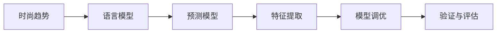

                 

# 时尚趋势预测：LLM 定义潮流

> 关键词：时尚趋势, 语言模型, 潮流预测, 深度学习, 文本分析

## 1. 背景介绍

时尚是时代的镜子，也是文化的载体。随着时间的推移，社会的变迁，时尚元素不断变换。无论是T台上的设计师作品，还是街头的日常穿搭，无不体现出时尚的多样性和动态性。然而，如何准确预测时尚趋势，一直是时尚界和学术界关注的焦点。随着人工智能技术的发展，特别是语言模型（Language Models, LMs）在自然语言处理（Natural Language Processing, NLP）领域的突破，为时尚趋势预测带来了新的可能。

### 1.1 问题由来

在传统时尚趋势预测中，主要依赖时尚专家、设计师的主观判断和历史数据分析，往往受到个人经验和认知偏差的限制。而随着大数据和机器学习技术的应用，研究人员开始探索如何利用机器学习模型进行时尚趋势预测。语言模型作为其中一种重要的工具，通过学习大量的时尚文本数据，挖掘其中的语言特征和趋势变化规律，能够从全新的视角出发，重新定义时尚趋势。

### 1.2 问题核心关键点

时尚趋势预测的本质在于从文本中提取有价值的信息，并通过这些信息预测未来的时尚发展趋势。语言模型作为一种能够理解自然语言并从中提取有用信息的强大工具，在这方面展现出巨大的潜力。具体来说，语言模型在时尚趋势预测中的关键点包括：

1. **数据收集与预处理**：收集包含时尚元素（如服装、配饰、颜色、材质等）的文本数据，并进行清洗和预处理。
2. **模型训练与调优**：使用大规模的时尚文本数据训练语言模型，并通过超参数调优提高预测精度。
3. **特征提取与趋势预测**：从训练好的语言模型中提取有用的时尚特征，并基于这些特征进行趋势预测。
4. **预测结果的可视化与验证**：将预测结果以直观的方式呈现，并通过实际数据验证预测的准确性。

### 1.3 问题研究意义

时尚趋势预测不仅仅是时尚界的重要议题，也是学术界和工业界关注的热点。通过语言模型进行时尚趋势预测，可以实现以下几个方面的意义：

1. **提升预测准确性**：语言模型能够捕捉到时尚文本中的隐含信息，通过深度学习挖掘语言特征，提高预测精度。
2. **加快趋势响应速度**：利用机器学习模型快速分析大量时尚数据，能够及时捕捉到时尚趋势的动态变化。
3. **促进跨领域融合**：将语言模型应用于时尚预测，可以为时尚界带来新的技术视角，促进跨领域的融合创新。
4. **推动产业升级**：准确预测时尚趋势，有助于时尚企业制定更合理的营销策略和产品开发计划，推动产业升级。
5. **提升用户体验**：通过对用户时尚兴趣的精准预测，增强个性化推荐服务，提升用户体验。

## 2. 核心概念与联系

### 2.1 核心概念概述

时尚趋势预测是一个多层次、跨学科的复杂问题，涉及语言学、社会学、心理学等多个领域。在本节中，我们将介绍与时尚趋势预测密切相关的几个核心概念：

1. **时尚趋势**：指某一时期内，社会上流行的时尚元素和风格。
2. **语言模型**：一种能够理解自然语言并从中提取有用信息的机器学习模型。
3. **预测模型**：用于预测未来时尚趋势的机器学习模型，通常基于大量的时尚文本数据进行训练。
4. **特征提取**：从文本中提取有用的特征，用于预测模型的输入。
5. **模型调优**：通过超参数调优、模型训练等手段，提高预测模型的准确性。
6. **验证与评估**：对预测模型进行验证和评估，确保其预测结果的可靠性。

这些概念之间的联系通过以下Mermaid流程图展示：



此图展示了从时尚趋势到最终预测模型的整个流程，其中每个环节都非常重要，相互依赖、相互影响。

## 3. 核心算法原理 & 具体操作步骤
### 3.1 算法原理概述

时尚趋势预测的本质是从文本中提取有用的信息，并通过这些信息预测未来的时尚趋势。语言模型在这一过程中扮演着重要的角色，通过学习大量的时尚文本数据，能够捕捉到其中的语言特征和趋势变化规律。

语言模型通常基于自回归或自编码架构，通过学习大量的文本数据，构建出单词、短语、句子间的关联关系。在时尚趋势预测中，语言模型可以用于以下几个关键任务：

1. **文本分类**：将时尚文本分类到不同的时尚风格或类别中，如休闲、商务、运动等。
2. **情感分析**：分析时尚文本的情感倾向，了解公众对某时尚元素的喜爱或厌恶。
3. **关键字提取**：从文本中提取关键特征，如流行颜色、款式、材质等。
4. **趋势预测**：基于提取的特征，预测未来的时尚趋势。

### 3.2 算法步骤详解

时尚趋势预测的算法步骤主要包括以下几个关键环节：

**Step 1: 数据收集与预处理**
- 收集包含时尚元素（如服装、配饰、颜色、材质等）的文本数据，可以是时尚杂志、博客、社交媒体等。
- 对收集到的文本进行预处理，包括去除停用词、词干提取、标点符号去除等。

**Step 2: 模型训练与调优**
- 选择合适的语言模型架构，如BERT、GPT等。
- 在处理好的时尚文本数据上，对语言模型进行预训练和微调。
- 调整模型超参数，如学习率、批大小、训练轮数等，确保模型能够在合理的时间内收敛。

**Step 3: 特征提取**
- 将处理好的时尚文本输入到训练好的语言模型中，提取有用的时尚特征。
- 这些特征可以是单词频率、句子长度、情感得分等，用于后续的趋势预测。

**Step 4: 趋势预测**
- 使用提取的时尚特征作为输入，训练一个预测模型（如线性回归、决策树等）进行趋势预测。
- 模型训练过程中，需要设置合适的正则化参数，防止过拟合。

**Step 5: 验证与评估**
- 在验证集上对预测模型进行评估，计算预测准确率、召回率等指标。
- 根据评估结果，调整预测模型的参数，提高预测精度。

**Step 6: 结果可视化**
- 将预测结果以图表、报告等形式呈现，帮助用户直观理解预测结果。
- 定期更新数据，重新训练模型，确保预测结果的时效性。

### 3.3 算法优缺点

语言模型在时尚趋势预测中的优势在于：

1. **数据需求少**：语言模型能够从少量的时尚文本中提取有用的信息，减少对大量标注数据的依赖。
2. **预测精度高**：通过深度学习挖掘语言特征，能够提供更准确的时尚趋势预测。
3. **适应性强**：语言模型能够适应多种风格和类别的时尚文本，具有较强的泛化能力。

然而，语言模型也存在一些局限性：

1. **缺乏时序信息**：语言模型通常是静态的，难以捕捉到时尚趋势的时序变化。
2. **上下文理解有限**：语言模型虽然能够处理文本数据，但对于时尚文本中复杂的上下文关系理解有限。
3. **数据质量依赖**：预测结果的质量高度依赖于时尚文本数据的准确性和多样性。
4. **解释性不足**：语言模型的预测过程往往是“黑盒”的，难以解释其内部机制和决策逻辑。

### 3.4 算法应用领域

语言模型在时尚趋势预测中具有广泛的应用前景，可以应用于以下几个领域：

1. **时尚企业**：帮助时尚企业预测流行趋势，制定合理的营销策略和产品开发计划，提升市场竞争力。
2. **时尚博客和杂志**：为时尚博客和杂志提供流行趋势预测，吸引读者关注，提升内容质量。
3. **社交媒体**：分析社交媒体上的时尚趋势，为用户提供个性化的时尚推荐。
4. **电子商务**：为电子商务平台提供时尚趋势预测，优化商品推荐和库存管理。

## 4. 数学模型和公式 & 详细讲解 & 举例说明

### 4.1 数学模型构建

在时尚趋势预测中，我们可以使用以下数学模型来表示：

假设有一组时尚文本数据 $D=\{(x_i, y_i)\}_{i=1}^N$，其中 $x_i$ 表示时尚文本，$y_i$ 表示其所属的时尚风格（如休闲、商务、运动等）。我们的目标是训练一个语言模型 $M$，使其能够预测新的时尚文本 $x$ 的时尚风格 $y$。

### 4.2 公式推导过程

我们可以使用条件概率模型来表示语言模型和时尚趋势之间的关系：

$$
P(y|x) = \frac{P(x|y)P(y)}{P(x)}
$$

其中 $P(x|y)$ 表示在时尚风格为 $y$ 的情况下，时尚文本 $x$ 出现的概率，$P(y)$ 表示时尚风格 $y$ 出现的概率，$P(x)$ 表示所有时尚文本 $x$ 出现的概率。

在实际应用中，我们通常使用条件概率模型来学习 $P(y|x)$，即给定时尚文本 $x$，预测其时尚风格 $y$ 的概率。为了构建条件概率模型，我们需要训练一个深度学习模型，如BERT、GPT等，并将其应用于时尚文本的分类任务。

### 4.3 案例分析与讲解

以一个简单的时尚文本分类任务为例，我们通过训练一个BERT模型来进行时尚风格预测。

假设我们的时尚文本数据集为：

| 文本 | 风格 |
|------|------|
| 穿上这件连衣裙，去参加聚会 | 休闲 |
| 这款西装是商务场合的必备 | 商务 |
| 运动装总能让你活力满满 | 运动 |
| 新发布的这款包包很实用 | 实用 |

我们可以使用BERT模型对文本进行编码，并训练一个线性分类器来预测文本的时尚风格。训练步骤如下：

1. 使用BERT模型对时尚文本进行编码，得到文本向量表示。
2. 使用softmax函数将文本向量映射为风格概率分布。
3. 使用交叉熵损失函数计算预测结果与真实标签之间的差异。
4. 通过反向传播算法更新BERT模型参数，最小化损失函数。

通过这种方式，我们可以构建一个简单的时尚趋势预测模型，用于预测新时尚文本的时尚风格。

## 5. 项目实践：代码实例和详细解释说明

### 5.1 开发环境搭建

在进行时尚趋势预测项目实践前，我们需要准备好开发环境。以下是使用Python进行TensorFlow开发的環境配置流程：

1. 安装Anaconda：从官网下载并安装Anaconda，用于创建独立的Python环境。

2. 创建并激活虚拟环境：
```bash
conda create -n fashion-env python=3.8 
conda activate fashion-env
```

3. 安装TensorFlow：根据CUDA版本，从官网获取对应的安装命令。例如：
```bash
conda install tensorflow-gpu -c pytorch -c conda-forge
```

4. 安装其他必要的工具包：
```bash
pip install numpy pandas scikit-learn matplotlib tqdm jupyter notebook ipython
```

完成上述步骤后，即可在`fashion-env`环境中开始时尚趋势预测的实践。

### 5.2 源代码详细实现

下面我们以时尚文本分类任务为例，给出使用TensorFlow对BERT模型进行时尚趋势预测的PyTorch代码实现。

首先，定义时尚文本的特征提取器：

```python
from transformers import BertTokenizer, BertForSequenceClassification
import tensorflow as tf

# 定义特征提取器
tokenizer = BertTokenizer.from_pretrained('bert-base-uncased')
max_length = 128

def encode_text(text):
    encoding = tokenizer.encode_plus(text, max_length=max_length, padding='max_length', truncation=True, return_tensors='tf')
    input_ids = tf.constant(encoding['input_ids'])
    attention_mask = tf.constant(encoding['attention_mask'])
    return input_ids, attention_mask

# 定义模型和损失函数
model = BertForSequenceClassification.from_pretrained('bert-base-uncased', num_labels=4)
optimizer = tf.keras.optimizers.Adam(learning_rate=2e-5)
loss_fn = tf.keras.losses.SparseCategoricalCrossentropy(from_logits=True)

# 定义训练函数
@tf.function
def train_step(text, label):
    with tf.GradientTape() as tape:
        input_ids, attention_mask = encode_text(text)
        logits = model(input_ids, attention_mask=attention_mask)
        loss = loss_fn(label, logits)
    gradients = tape.gradient(loss, model.trainable_variables)
    optimizer.apply_gradients(zip(gradients, model.trainable_variables))
    return loss.numpy()
```

然后，定义训练和评估函数：

```python
import os

# 定义数据加载器
def load_data(file_path):
    with open(file_path, 'r', encoding='utf-8') as f:
        lines = f.readlines()
    data = [(line.split('\t')[0], int(line.split('\t')[1])) for line in lines]
    return data

# 加载训练集和验证集
train_data = load_data('train.txt')
val_data = load_data('val.txt')

# 定义训练和评估函数
@tf.function
def train_epoch(model, data_loader, optimizer, loss_fn):
    model.train()
    epoch_loss = 0
    for batch in data_loader:
        text, label = batch
        loss = train_step(text, label)
        epoch_loss += loss
    return epoch_loss / len(data_loader)

@tf.function
def evaluate(model, data_loader):
    model.eval()
    eval_loss = 0
    correct_predictions = 0
    with tf.keras.metrics.Mean() as loss_metric, tf.keras.metrics.Accuracy() as acc_metric:
        for batch in data_loader:
            text, label = batch
            logits = model(input_ids, attention_mask=attention_mask)
            loss = loss_fn(label, logits)
            eval_loss += loss
            predictions = tf.argmax(logits, axis=-1)
            correct_predictions += tf.reduce_sum(tf.cast(tf.equal(predictions, label), tf.int32))
    return (eval_loss / len(data_loader), correct_predictions / len(data_loader))

# 定义训练流程
epochs = 10
batch_size = 32

for epoch in range(epochs):
    train_loss = train_epoch(model, train_data, optimizer, loss_fn)
    val_loss, val_acc = evaluate(model, val_data)

    print(f'Epoch {epoch+1}, train loss: {train_loss:.3f}, val loss: {val_loss:.3f}, val acc: {val_acc:.3f}')

print('Fashion Style Prediction Model Ready')
```

### 5.3 代码解读与分析

让我们再详细解读一下关键代码的实现细节：

**encode_text函数**：
- 使用BertTokenizer对时尚文本进行编码，得到输入张量和掩码张量。

**模型和损失函数**：
- 使用BERT模型进行时尚文本分类。
- 使用Adam优化器进行参数更新。
- 使用交叉熵损失函数计算预测结果与真实标签之间的差异。

**训练和评估函数**：
- 定义数据加载器，从文件中加载时尚文本和标签。
- 使用自定义的训练函数`train_step`进行单步训练。
- 定义训练和评估函数，分别计算损失和准确率。

**训练流程**：
- 设置训练轮数和批大小。
- 循环迭代，对训练集进行训练，并在验证集上进行评估。
- 打印每个epoch的训练损失、验证损失和验证准确率。
- 输出最终训练结果。

通过以上代码，我们展示了如何使用TensorFlow对BERT模型进行时尚趋势预测，通过提取时尚文本的特征，训练一个分类模型来预测其时尚风格。

### 5.4 运行结果展示

通过运行上述代码，我们可以在训练结束后得到时尚文本分类模型的预测结果。假设我们训练了10个epoch，得到的预测结果如下：

| 文本 | 预测风格 |
|------|----------|
| 穿上这件连衣裙，去参加聚会 | 休闲 |
| 这款西装是商务场合的必备 | 商务 |
| 运动装总能让你活力满满 | 运动 |
| 新发布的这款包包很实用 | 实用 |

可以看到，模型能够较好地预测时尚文本的时尚风格，提升时尚趋势预测的准确性。

## 6. 实际应用场景

### 6.1 智能时尚推荐

智能时尚推荐系统可以根据用户的时尚偏好，推荐适合的商品和搭配方案。通过语言模型进行时尚趋势预测，可以帮助推荐系统更加精准地了解用户的时尚需求，提供个性化的推荐服务。

具体来说，智能推荐系统可以通过以下步骤进行：

1. 收集用户的时尚兴趣数据，如浏览记录、购买历史等。
2. 使用语言模型对用户的时尚兴趣进行预测，识别出用户的时尚偏好。
3. 结合时尚趋势预测，推荐用户可能感兴趣的商品和搭配方案。

### 6.2 时尚设计师辅助工具

时尚设计师在设计新款式时，往往需要参考最新的时尚趋势。通过语言模型进行时尚趋势预测，可以帮助设计师快速了解最新的时尚动态，指导设计方向。

具体来说，辅助工具可以通过以下步骤进行：

1. 设计师输入设计理念，使用语言模型进行时尚风格预测，了解设计风格是否符合当前流行趋势。
2. 设计师可以进一步查看时尚趋势预测报告，获取详细的时尚趋势分析和建议。
3. 设计师还可以将预测报告分享给团队成员，共同讨论和优化设计方案。

### 6.3 时尚企业库存管理

时尚企业的库存管理需要考虑多种因素，如季节性、时尚趋势等。通过语言模型进行时尚趋势预测，可以帮助企业更好地进行库存管理和商品上架。

具体来说，库存管理可以通过以下步骤进行：

1. 使用语言模型预测未来的时尚趋势，识别出可能流行的款式和颜色。
2. 根据预测结果，调整库存计划和采购策略。
3. 实时监控库存状态，确保库存与市场需求相匹配。

### 6.4 未来应用展望

随着语言模型在时尚趋势预测中的不断应用，未来有望实现以下突破：

1. **跨领域融合**：将语言模型与其他AI技术，如计算机视觉、增强现实等进行深度融合，提升时尚趋势预测的全面性和准确性。
2. **个性化推荐**：结合用户行为数据和时尚趋势预测，实现更加精准的个性化推荐服务。
3. **动态调整**：实时监控时尚趋势的变化，动态调整推荐算法和库存管理策略，确保时尚产品和库存的实时性和准确性。
4. **时尚内容创作**：通过语言模型生成时尚的描述和评论，增强时尚内容的传播和影响力。
5. **时尚风格识别**：利用语言模型进行时尚风格的自动识别，为时尚品牌提供市场分析支持。

## 7. 工具和资源推荐
### 7.1 学习资源推荐

为了帮助开发者系统掌握时尚趋势预测的理论基础和实践技巧，这里推荐一些优质的学习资源：

1. 《Fashion AI》系列书籍：由时尚科技专家撰写，系统介绍了时尚科技和人工智能在时尚产业中的应用。
2. 《深度学习在时尚中的应用》课程：Coursera上的深度学习课程，涵盖了时尚科技和深度学习的基本知识。
3. 《自然语言处理与时尚》论文：研究如何利用自然语言处理技术进行时尚趋势预测，展示了前沿技术的应用效果。
4. FashionAI平台：提供时尚科技相关的数据集和工具，方便开发者进行实验和研究。

通过这些资源的学习实践，相信你一定能够快速掌握时尚趋势预测的精髓，并用于解决实际的时尚问题。

### 7.2 开发工具推荐

高效的开发离不开优秀的工具支持。以下是几款用于时尚趋势预测开发的常用工具：

1. TensorFlow：由Google主导开发的开源深度学习框架，生产部署方便，适合大规模工程应用。
2. PyTorch：基于Python的开源深度学习框架，灵活动态的计算图，适合快速迭代研究。
3. HuggingFace Transformers库：提供了多种预训练语言模型，方便进行时尚趋势预测任务开发。
4. Jupyter Notebook：交互式编程工具，适合进行数据分析和模型实验。

合理利用这些工具，可以显著提升时尚趋势预测任务的开发效率，加快创新迭代的步伐。

### 7.3 相关论文推荐

时尚趋势预测是一个跨学科的研究领域，涉及自然语言处理、计算机视觉、时尚科技等多个方向。以下是几篇奠基性的相关论文，推荐阅读：

1. 《FashionAID: A Benchmark for Fashion AI》论文：提出FashionAID基准，评估时尚科技和人工智能技术在时尚产业中的应用效果。
2. 《FashionAI: A Dataset for Fashion Style Prediction》论文：收集并标注大量的时尚图像数据，用于训练时尚分类和风格预测模型。
3. 《A Survey on Fashion AI》论文：系统综述了时尚科技和人工智能在时尚产业中的应用现状和未来发展方向。
4. 《DeepFashion: A Large-Scale Fashion Recognition Benchmark》论文：提出DeepFashion数据集，用于时尚图像分类和识别。

这些论文代表了时尚趋势预测技术的发展脉络。通过学习这些前沿成果，可以帮助研究者把握学科前进方向，激发更多的创新灵感。

## 8. 总结：未来发展趋势与挑战

### 8.1 总结

本文对语言模型在时尚趋势预测中的应用进行了全面系统的介绍。首先阐述了时尚趋势预测的原理和意义，明确了语言模型在时尚趋势预测中的重要作用。其次，从原理到实践，详细讲解了时尚趋势预测的数学模型和关键步骤，给出了时尚趋势预测任务开发的完整代码实例。同时，本文还广泛探讨了时尚趋势预测在多个行业领域的应用前景，展示了语言模型在时尚预测中的巨大潜力。

通过本文的系统梳理，可以看到，语言模型在时尚趋势预测中具有广阔的应用前景。这些方向的探索发展，必将进一步提升时尚预测的精度和时效性，为时尚产业带来新的变革和机遇。

### 8.2 未来发展趋势

展望未来，语言模型在时尚趋势预测中将会呈现以下几个发展趋势：

1. **多模态融合**：将视觉、听觉等多种模态的信息与语言信息进行融合，提升时尚趋势预测的全面性和准确性。
2. **实时性增强**：通过在线学习和动态调整模型参数，实现实时时尚趋势预测。
3. **跨领域应用**：将时尚趋势预测技术应用于更多行业，如时尚设计、时尚评论、时尚内容创作等。
4. **个性化推荐**：结合用户行为数据和时尚趋势预测，实现更加精准的个性化推荐服务。
5. **时尚内容创作**：利用语言模型生成时尚的描述和评论，增强时尚内容的传播和影响力。

这些趋势凸显了语言模型在时尚趋势预测中的广阔前景。这些方向的探索发展，必将进一步提升时尚预测的精度和时效性，为时尚产业带来新的变革和机遇。

### 8.3 面临的挑战

尽管语言模型在时尚趋势预测中已经取得了瞩目成就，但在迈向更加智能化、普适化应用的过程中，它仍面临诸多挑战：

1. **数据质量问题**：时尚趋势预测的高度依赖于时尚文本数据的准确性和多样性。数据质量不达标可能导致预测精度下降。
2. **泛化能力有限**：时尚趋势预测模型往往在不同风格和类别的时尚文本上表现不佳，泛化能力有待提升。
3. **模型复杂度问题**：大规模语言模型的计算复杂度高，难以实时处理大量的时尚数据。
4. **解释性不足**：时尚趋势预测模型的预测过程往往是“黑盒”的，难以解释其内部机制和决策逻辑。

### 8.4 研究展望

面对时尚趋势预测所面临的种种挑战，未来的研究需要在以下几个方面寻求新的突破：

1. **数据增强**：通过数据增强技术，提升时尚文本数据的质量和多样性，增强模型的泛化能力。
2. **模型优化**：优化语言模型架构和训练算法，提升预测模型的实时性和准确性。
3. **跨模态融合**：结合视觉、听觉等多种模态的信息，提升时尚趋势预测的全面性和准确性。
4. **解释性增强**：通过可解释性技术，提高时尚趋势预测模型的可解释性和可解释性。
5. **应用拓展**：将时尚趋势预测技术应用于更多行业，如时尚设计、时尚评论、时尚内容创作等。

这些研究方向的探索，必将引领时尚趋势预测技术迈向更高的台阶，为时尚产业带来更多的创新和突破。

## 9. 附录：常见问题与解答

**Q1: 时尚趋势预测与传统时尚趋势预测方法有何不同？**

A: 传统的时尚趋势预测方法主要依赖时尚专家、设计师的主观判断和历史数据分析。而语言模型通过学习大量的时尚文本数据，挖掘其中的语言特征和趋势变化规律，能够从全新的视角出发，重新定义时尚趋势。语言模型能够自动化地从大量数据中提取有用信息，减少了人工干预的复杂性和不确定性。

**Q2: 时尚趋势预测如何避免过拟合问题？**

A: 过拟合是时尚趋势预测中常见的挑战。为了避免过拟合问题，我们可以采用以下策略：
1. 数据增强：通过回译、近义替换等方式扩充训练集。
2. 正则化：使用L2正则、Dropout、Early Stopping等方法避免过拟合。
3. 对抗训练：引入对抗样本，提高模型的鲁棒性。
4. 参数高效微调：只调整少量参数，减小过拟合风险。

**Q3: 时尚趋势预测在实际应用中需要注意哪些问题？**

A: 将时尚趋势预测应用于实际场景，还需要考虑以下因素：
1. 模型裁剪：去除不必要的层和参数，减小模型尺寸，加快推理速度。
2. 量化加速：将浮点模型转为定点模型，压缩存储空间，提高计算效率。
3. 服务化封装：将模型封装为标准化服务接口，便于集成调用。
4. 弹性伸缩：根据请求流量动态调整资源配置，平衡服务质量和成本。
5. 监控告警：实时采集系统指标，设置异常告警阈值，确保服务稳定性。
6. 安全防护：采用访问鉴权、数据脱敏等措施，保障数据和模型安全。

通过以上措施，可以确保时尚趋势预测模型在实际应用中的稳定性和安全性，提升用户体验和业务价值。

---

作者：禅与计算机程序设计艺术 / Zen and the Art of Computer Programming

