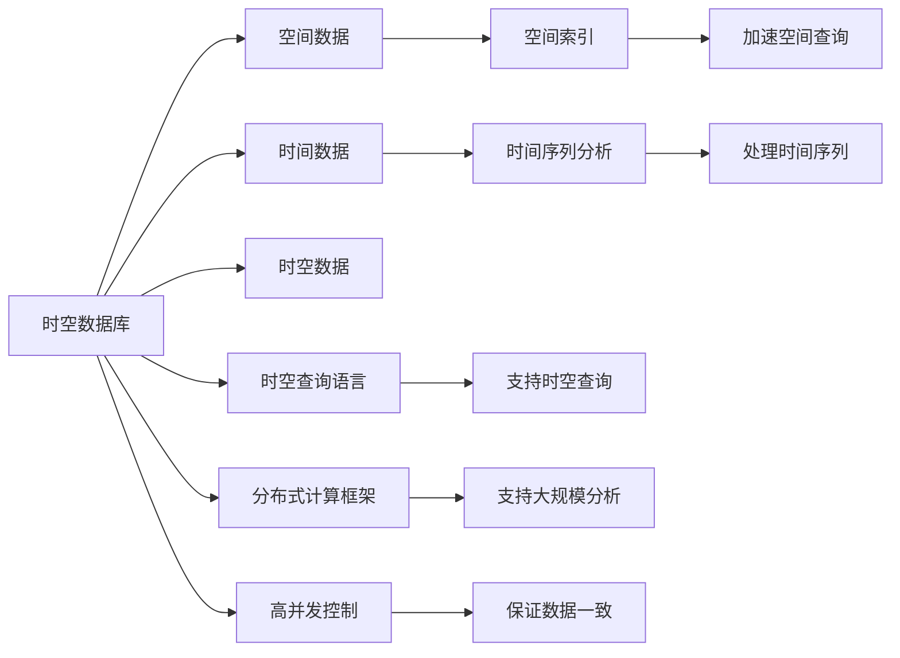

                 

# 时空数据库：管理地理位置和时间数据

> 关键词：时空数据库, 地理位置数据, 时间数据, 时序数据管理, 空间查询, 时间序列分析, 数据可视化, 数据库索引, 数据库并发控制, 数据一致性

## 1. 背景介绍

在当今数字化时代，地理位置和时间数据在各行各业中扮演着越来越重要的角色。从智能交通到精准农业，从城市规划到环境监测，都需要高效、准确地管理与分析这些数据。而时空数据库（Spatial-Temporal Database, STDB）作为管理地理位置和时间数据的重要工具，成为了支撑上述应用的关键。时空数据库集成了空间数据和时间数据的管理，能够实时、高效地处理与分析空间位置和时间序列信息，为决策提供坚实的科学依据。

本文将全面介绍时空数据库的概念、核心技术和应用场景，并通过一些实际案例，展示时空数据库在现实世界中的强大威力。通过深入理解时空数据库的理论基础和实践细节，读者将能够更好地应用这一工具，提升在空间和时间数据管理方面的能力和水平。

## 2. 核心概念与联系

时空数据库是一个同时处理地理位置和时间数据的数据库管理系统。它将空间数据和时间数据融合到一个统一的数据库中，以支持复杂的空间和时间分析任务。

### 2.1 核心概念概述

- **空间数据**：指描述地理空间特征的数据，如坐标点、多边形、线状特征等。
- **时间数据**：指描述事件发生时间或数据记录时间的数据，如时间戳、时间间隔、时间序列等。
- **时空数据**：同时包含空间和时间属性的数据，如地理现象的时序变化、环境监测的时空变化等。

时空数据库的核心技术包括：

- **空间索引**：用于加速空间数据的查询和分析。
- **时间序列分析**：用于处理和分析时间数据的趋势、周期、变化率等。
- **时空查询语言**：一种专门用于处理时空数据查询的SQL语言扩展。
- **分布式计算框架**：支持大规模时空数据处理和分析。
- **高并发控制**：保证多用户并发访问下的数据一致性和事务正确性。

这些核心技术构成了时空数据库的基础，使时空数据库能够高效地管理、查询和分析空间和时间数据。

### 2.2 核心概念原理和架构的 Mermaid 流程图



## 3. 核心算法原理 & 具体操作步骤

### 3.1 算法原理概述

时空数据库的核心算法包括空间索引构建、时间序列分析、时空查询处理和分布式计算框架。

**空间索引构建**：通过将空间数据分割成小块，创建多级索引，以提高查询效率。常见的空间索引包括R树、四叉树、空间分区等。

**时间序列分析**：通过算法处理时间数据，提取趋势、周期、变化率等特征，进行时间序列预测和异常检测。

**时空查询处理**：将空间查询和时间查询融合到一个统一的查询语言中，处理复杂的时空数据查询。

**分布式计算框架**：通过分布式计算技术，处理大规模时空数据，并支持大规模数据集的并行处理和分析。

### 3.2 算法步骤详解

时空数据库的算法步骤一般包括以下几个关键步骤：

**Step 1: 数据预处理**

对输入数据进行清洗、转换和标准化，确保数据的完整性和一致性。

**Step 2: 空间索引构建**

选择合适的空间索引算法，构建多级空间索引，加速查询。

**Step 3: 时间序列分析**

使用时间序列分析算法，处理时间数据，提取特征并进行预测和检测。

**Step 4: 时空查询处理**

使用时空查询语言，进行复杂的时空数据查询，获取结果。

**Step 5: 结果后处理**

对查询结果进行后处理，如聚合、计算统计量、可视化等。

**Step 6: 分布式计算优化**

对计算密集型的任务进行分布式计算优化，提高计算效率。

### 3.3 算法优缺点

时空数据库的优势在于能够高效管理大规模时空数据，支持复杂的时空查询，处理复杂的空间和时间数据。缺点则在于构建和维护多级空间索引、时间序列分析算法复杂，且时空查询语言相对复杂。

### 3.4 算法应用领域

时空数据库在多个领域中具有广泛的应用：

- **智能交通**：监控交通流量，优化交通信号灯控制，预测交通拥堵。
- **精准农业**：监测作物生长状况，优化灌溉和施肥策略，提高农业生产效率。
- **城市规划**：分析城市人口分布、交通流量，优化城市布局和基础设施建设。
- **环境监测**：监测空气质量、水质变化，预测环境污染趋势。
- **智能制造**：监控生产设备运行状态，预测设备故障，优化生产计划。

## 4. 数学模型和公式 & 详细讲解 & 举例说明

### 4.1 数学模型构建

时空数据库的数学模型主要包括空间索引、时间序列分析和时空查询语言。

**空间索引模型**：

- R树索引：用于快速检索空间数据，构建一棵R树，将空间数据分割成多个节点。
- 四叉树索引：将空间数据分割成四个子节点，构建一棵四叉树，加速空间查询。

**时间序列模型**：

- ARIMA模型：自回归积分滑动平均模型，用于时间序列预测和分析。
- Exponential Smoothing模型：指数平滑模型，用于时间序列的趋势预测。

**时空查询语言**：

- ST-SQL语言：基于SQL的时空查询语言，支持复杂的时空查询。

### 4.2 公式推导过程

**R树索引公式推导**：

- R树节点公式：
$$
\text{R-tree} = \{ (l,\text{child}) \mid l \in \text{Leaf}, \text{child} \in \text{R-tree} \}
$$
其中$l$为叶子节点，$\text{child}$为子节点。

- R树查询公式：
$$
\text{R-tree Query} = \bigcup_{l \in \text{Leaf}} (\text{Leaf} \cap \text{Query Region})
$$

**ARIMA模型公式推导**：

- ARIMA(p,d,q)模型：
$$
y_t = c + \sum_{i=1}^p \alpha_i y_{t-i} + \sum_{i=1}^q \beta_i \Delta^i y_t + \epsilon_t
$$
其中$y_t$为时间序列数据，$\Delta$为差分算子，$\epsilon_t$为随机误差项。

### 4.3 案例分析与讲解

**案例1：智能交通流量分析**

- **数据预处理**：收集城市交通流量数据，清洗异常值，填充缺失值。
- **空间索引构建**：使用R树索引，构建交通流量数据的空间索引。
- **时间序列分析**：使用ARIMA模型，预测交通流量趋势和周期性变化。
- **时空查询处理**：使用ST-SQL语言，查询特定路段的交通流量数据。
- **结果后处理**：对查询结果进行可视化，分析交通流量变化。

**案例2：精准农业灌溉策略优化**

- **数据预处理**：收集农田土壤湿度、气象数据，清洗、转换数据。
- **空间索引构建**：使用四叉树索引，构建农田土壤湿度数据的索引。
- **时间序列分析**：使用Exponential Smoothing模型，预测土壤湿度变化趋势。
- **时空查询处理**：使用ST-SQL语言，查询指定区域的土壤湿度数据。
- **结果后处理**：根据土壤湿度数据，优化灌溉策略，提高灌溉效率。

## 5. 项目实践：代码实例和详细解释说明

### 5.1 开发环境搭建

进行时空数据库的开发和实践，需要先搭建好开发环境。以下是Python开发环境搭建的详细步骤：

1. **安装Python**：从官网下载安装Python 3.7以上版本，并设置环境变量。
2. **安装MySQL**：从官网下载安装MySQL，安装并启动MySQL服务。
3. **安装Python MySQL驱动程序**：使用pip安装`mysql-connector-python`或`pymysql`，连接MySQL数据库。
4. **安装Geopandas**：使用pip安装`geopandas`，用于处理地理空间数据。
5. **安装shapely**：使用pip安装`shapely`，用于处理几何形状。
6. **安装Pandas**：使用pip安装`pandas`，用于数据处理和分析。

完成以上步骤后，即可在Python中使用时空数据库进行开发。

### 5.2 源代码详细实现

以下是使用Python和Geopandas实现时空数据库的示例代码。

```python
import geopandas as gpd
import mysql.connector
from shapely.geometry import Point
from shapely.ops import unary_union
from sklearn.preprocessing import MinMaxScaler

# 连接MySQL数据库
cnx = mysql.connector.connect(user='username', password='password',
                              host='127.0.0.1', database='database')
cursor = cnx.cursor()

# 查询交通流量数据
query = "SELECT * FROM traffic_flow WHERE date >= %s AND date <= %s"
params = ('2021-01-01', '2021-01-31')
cursor.execute(query, params)

# 将查询结果转换为DataFrame
df = gpd.GeoDataFrame(cursor.fetchall(), 
                     columns=['id', 'location', 'timestamp', 'flow'])

# 构建R树索引
r_tree = gpd.GeoDataFrame(df, crs=gpd.GeoDataFrame().crs)
r_tree = r_tree.set_index('id')
r_tree['location'] = r_tree['location'].apply(Point)

# 查询特定区域的交通流量数据
query_region = Point(101.12, 22.98)
query_region_crs = r_tree.crs
query_region = gpd.GeoSeries([query_region]).transform(query_region_crs)

result = r_tree.spatial_query(query_region)
print(result)

# 时间序列分析
df['flow'] = df['flow'].astype(float)
scaler = MinMaxScaler(feature_range=(0, 1))
scaled_flow = scaler.fit_transform(df[['flow']])
arima_model = sm.tsa.arima.ARIMA(scaled_flow, order=(5, 1, 0))
arima_results = arima_model.fit()
print(arima_results.summary())

# 时空查询处理
query_time = '2021-02-01'
query_region = Point(102.33, 23.12)
query_region_crs = r_tree.crs
query_region = gpd.GeoSeries([query_region]).transform(query_region_crs)

result = r_tree.spatial_query(query_region)
result['timestamp'] = result['timestamp'].apply(lambda x: pd.to_datetime(x))
result = result[(result['timestamp'] >= query_time) & (result['timestamp'] <= query_time)]

# 结果后处理
print(result)
```

### 5.3 代码解读与分析

**数据预处理**：使用MySQL查询交通流量数据，并将结果转换为Geopandas DataFrame。

**空间索引构建**：使用Geopandas的R树索引，构建交通流量数据的索引。

**时间序列分析**：使用sklearn的MinMaxScaler对流量数据进行归一化处理，然后使用ARIMA模型进行时间序列预测。

**时空查询处理**：使用Geopandas的spatial_query方法，查询特定区域的交通流量数据。

**结果后处理**：对查询结果进行筛选和打印输出。

通过以上代码，展示了如何使用Python和Geopandas实现时空数据库的基本功能，包括数据查询、空间索引、时间序列分析和结果后处理。

## 6. 实际应用场景

### 6.1 智能交通流量分析

在智能交通领域，时空数据库可以实时监控交通流量，优化交通信号灯控制，预测交通拥堵。通过时空数据库，可以快速获取特定区域、特定时间段的交通流量数据，进行分析与预测，从而优化交通管理策略，提升道路通行效率。

**案例1：交通信号灯控制优化**

- **数据来源**：城市交通流量监测数据。
- **数据处理**：清洗数据，提取地理位置、时间戳、流量数据。
- **空间索引构建**：使用R树索引，构建交通流量数据的空间索引。
- **时间序列分析**：使用ARIMA模型，预测交通流量趋势和周期性变化。
- **时空查询处理**：使用ST-SQL语言，查询特定路段的交通流量数据。
- **结果后处理**：根据查询结果，优化交通信号灯控制策略，减少交通拥堵。

### 6.2 精准农业灌溉策略优化

在精准农业领域，时空数据库可以监测农田土壤湿度、气象数据，优化灌溉和施肥策略，提高农业生产效率。通过时空数据库，可以实时获取农田的空间和时间数据，进行综合分析，制定科学的灌溉计划，减少水资源浪费，提升作物产量和质量。

**案例2：农田灌溉策略优化**

- **数据来源**：农田土壤湿度、气象数据监测设备。
- **数据处理**：清洗数据，提取地理位置、时间戳、土壤湿度数据。
- **空间索引构建**：使用四叉树索引，构建土壤湿度数据的索引。
- **时间序列分析**：使用Exponential Smoothing模型，预测土壤湿度变化趋势。
- **时空查询处理**：使用ST-SQL语言，查询指定区域的土壤湿度数据。
- **结果后处理**：根据土壤湿度数据，优化灌溉策略，提高灌溉效率。

## 7. 工具和资源推荐

### 7.1 学习资源推荐

为了帮助开发者系统掌握时空数据库的理论基础和实践技巧，这里推荐一些优质的学习资源：

1. 《时空数据库原理与实践》系列博文：由时空数据库技术专家撰写，深入浅出地介绍了时空数据库的原理、核心技术和应用场景。
2. SQL与GIS综合课程：Coursera《SQL for Data Science》课程，讲解如何使用SQL和GIS进行时空数据处理。
3. 《Spatial-Temporal Data Mining and Statistical Learning》书籍：时空数据挖掘和统计学习领域的经典教材，详细介绍了时空数据处理的算法和模型。
4. 时空数据库官方文档：各数据库厂商提供的时空数据库官方文档，包含丰富的使用案例和API文档。
5. 开源时空数据库项目：如GeoServer、PostGIS、TiDB等，提供了丰富的时空数据管理和分析功能，值得学习和借鉴。

通过对这些资源的学习实践，相信你一定能够快速掌握时空数据库的理论基础和实践细节，并用于解决实际的地理位置和时间数据管理问题。

### 7.2 开发工具推荐

高效的开发离不开优秀的工具支持。以下是几款用于时空数据库开发的常用工具：

1. MySQL：作为流行的关系型数据库，MySQL提供了高效的时空数据存储和管理功能。
2. PostGIS：PostgreSQL的地理空间扩展，提供了丰富的时空数据查询和管理功能。
3. ArcGIS：ESRI公司开发的GIS软件，提供了强大的时空数据分析和可视化功能。
4. QGIS：开源GIS软件，提供了丰富的地理空间数据处理和分析功能。
5. GeoPandas：Python的地理空间数据处理库，提供了便捷的空间数据处理功能。

合理利用这些工具，可以显著提升时空数据库的开发效率，加快创新迭代的步伐。

### 7.3 相关论文推荐

时空数据库的研究始于20世纪80年代，已有许多经典论文奠定了时空数据库的理论基础。以下是几篇奠基性的相关论文，推荐阅读：

1. Spatio-Temporal Database Management: A Survey（《时空数据库管理：综述》）：Int J Geogr Inf Sci，1999年，详细介绍了时空数据库的研究现状和发展方向。
2. Multi-Dimensional Time Series Data Warehousing（《多维时间序列数据仓库》）：IEEE Trans Knowl Data Eng，1996年，提出了一种多维时间序列数据仓库的存储结构。
3. Space-Time Data Mining and Statistical Learning（《时空数据挖掘和统计学习》）：SIGKDD，2011年，探讨了时空数据的挖掘和统计学习方法。
4. A Survey of Temporal Data Management Techniques（《时序数据管理技术综述》）：IEEE Trans Knowl Data Eng，2010年，详细介绍了时序数据管理的技术。

这些论文代表了时空数据库的研究前沿，提供了丰富的理论基础和实践经验。通过学习这些前沿成果，可以帮助研究者把握学科前进方向，激发更多的创新灵感。

## 8. 总结：未来发展趋势与挑战

### 8.1 总结

本文对时空数据库的概念、核心技术和应用场景进行了全面介绍。时空数据库作为一个同时处理地理位置和时间数据的数据库管理系统，在智能交通、精准农业、城市规划、环境监测等多个领域中具有广泛的应用。通过深入理解时空数据库的理论基础和实践细节，读者将能够更好地应用这一工具，提升在空间和时间数据管理方面的能力和水平。

时空数据库作为处理时空数据的关键技术，随着数据量的不断增长和应用场景的不断拓展，其研究和应用将越来越重要。未来，时空数据库将朝着更加高效、灵活、可靠的方向发展，为各行各业提供更加强大、便捷的数据管理解决方案。

### 8.2 未来发展趋势

展望未来，时空数据库的发展将呈现以下几个趋势：

1. **分布式计算和云存储**：随着数据量的不断增长，时空数据库将越来越多地依赖分布式计算和云存储，以提高数据存储和处理的效率。
2. **实时数据处理**：未来时空数据库将更加注重实时数据处理能力，能够快速响应实时数据流，实现更高效的数据分析。
3. **智能查询优化**：未来时空数据库将更加智能，能够自动优化查询计划，提高查询效率，降低资源消耗。
4. **多源数据融合**：未来时空数据库将更加灵活，能够处理多种数据源，如传感器数据、社交媒体数据、天气数据等，实现更全面的数据分析。
5. **可视化分析**：未来时空数据库将更加注重数据可视化，通过更直观的数据展示，帮助用户更好地理解和分析时空数据。

### 8.3 面临的挑战

尽管时空数据库已经取得了显著进展，但在迈向更加智能化、普适化应用的过程中，仍面临诸多挑战：

1. **数据量大、处理速度快**：时空数据通常包含大量时间戳和空间坐标，处理复杂度高，需要高效的算法和计算资源。
2. **空间索引构建复杂**：时空数据库需要构建多级空间索引，以提高查询效率，但索引构建过程复杂，且容易出错。
3. **时间序列分析算法多样**：不同的应用场景需要不同的时间序列分析算法，如何选择合适的算法，是一个重要的研究课题。
4. **时空查询语言复杂**：时空查询语言相对于传统SQL语言更加复杂，需要更多的学习和掌握。
5. **并发控制和一致性保证**：时空数据库需要高效处理并发访问，保证数据的一致性和事务的正确性，需要复杂的技术实现。

### 8.4 研究展望

面对时空数据库面临的挑战，未来的研究需要在以下几个方面寻求新的突破：

1. **高效数据存储和管理**：开发更高效的数据存储和管理算法，如分布式存储、数据压缩等，提高数据存储和处理的效率。
2. **智能查询优化**：开发更加智能的查询优化算法，自动生成最优查询计划，提高查询效率。
3. **多源数据融合**：研究多源数据融合算法，实现更全面的数据融合与分析。
4. **可视化分析**：开发更高效的数据可视化技术，提供更直观、便捷的数据展示。
5. **并发控制和一致性保证**：研究更高效的并发控制和一致性保证算法，保证时空数据库的高可用性和数据一致性。

时空数据库作为管理地理位置和时间数据的重要工具，在多个领域中具有广泛的应用前景。未来，通过不断优化时空数据库的核心技术，开发更高效、灵活、可靠的系统，时空数据库必将在各个行业领域中发挥更大的作用，助力数字化转型升级。

## 9. 附录：常见问题与解答

**Q1: 时空数据库和传统数据库有什么区别？**

A: 时空数据库主要处理地理位置和时间数据，支持复杂的时空查询和分析。传统数据库主要处理结构化数据，支持基本的CRUD操作。

**Q2: 如何选择合适的时空数据库？**

A: 需要根据具体应用场景和需求选择合适的时空数据库。例如，PostGIS适用于地理空间数据管理，GeoServer适用于WebGIS应用，TiDB适用于大规模时空数据处理。

**Q3: 时空数据库如何进行空间查询？**

A: 使用空间索引进行快速的空间查询，如R树索引、四叉树索引等。

**Q4: 时空数据库如何进行时间序列分析？**

A: 使用时间序列分析算法，如ARIMA、Exponential Smoothing等，提取时间数据的趋势、周期、变化率等特征。

**Q5: 如何实现时空查询语言？**

A: 使用SQL扩展语言，如ST-SQL，进行时空查询。

通过以上问题与解答，帮助读者更好地理解时空数据库的理论基础和实践细节，提升在空间和时间数据管理方面的能力和水平。

