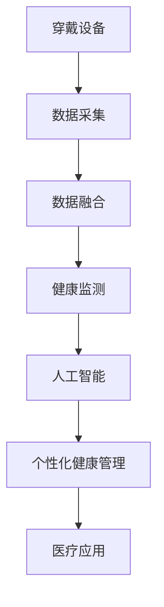

                 

# 智能健康监测创业：穿戴设备的医疗应用

> 关键词：穿戴设备, 健康监测, 人工智能, 数据融合, 隐私保护, 医疗应用, 可穿戴技术

## 1. 背景介绍

### 1.1 问题由来

在现代社会，健康问题日益突出，疾病防控任务愈发严峻。越来越多的个人和医疗机构开始重视健康监测的重要性。智能穿戴设备因其便携性、数据实时性、全天候监测等特点，在健康监测领域展现出巨大的潜力。然而，如何充分利用穿戴设备产生的大量数据，进行有效健康管理，仍然是亟需解决的问题。

## 2. 核心概念与联系

### 2.1 核心概念概述

为更好地理解智能健康监测在穿戴设备中的应用，本节将介绍几个关键概念：

- **穿戴设备(Wearable Device)**：指可穿戴在人体上的各类健康监测设备，如智能手表、健身手环、健康监测表带等，具备实时数据采集、存储、传输功能。
- **健康监测(Health Monitoring)**：指通过各类传感器、摄像头等设备采集人体生理信号、活动数据，用于评估健康状态、疾病风险、运动效果等。
- **人工智能(AI)**：指通过机器学习、深度学习等算法，分析穿戴设备采集的数据，预测健康趋势，提供个性化健康管理方案。
- **数据融合(Data Fusion)**：指将不同数据源采集的健康监测数据进行整合，生成统一的综合指标，提高健康监测的全面性和准确性。
- **隐私保护(Privacy Protection)**：指在健康监测数据收集、存储、传输、处理等环节，采用匿名化、加密等技术手段，确保用户数据安全，保护个人隐私。
- **医疗应用(Medical Application)**：指将智能健康监测技术应用于各类医疗场景，如慢性病管理、健康指导、医院辅助诊断等。

这些核心概念之间的逻辑关系可以通过以下Mermaid流程图来展示：



这个流程图展示了大语言模型的工作原理和优化方向：

1. 穿戴设备采集生理和活动数据。
2. 数据融合整合不同数据源的数据，形成全面的健康监测指标。
3. 人工智能分析健康数据，生成健康报告和预测。
4. 个性化健康管理方案根据AI分析结果生成，指导用户健康管理。
5. 医疗应用场景将智能健康监测技术应用于各种医疗活动。

## 3. 核心算法原理 & 具体操作步骤
### 3.1 算法原理概述

智能健康监测在穿戴设备中的应用，本质上是通过人工智能技术对采集的生理和活动数据进行分析和预测。其核心思想是：将穿戴设备采集的原始数据转化为有意义的健康指标，并利用机器学习算法预测未来健康趋势。

形式化地，设采集到的原始数据为 $X=\{x_1, x_2, \dots, x_n\}$，其中 $x_i$ 为第 $i$ 个监测点采集的数据，可以是心率、血压、血糖等生理信号，或是步数、运动时长、活动量等活动数据。健康监测系统的目标是通过数据融合技术，生成综合指标 $Y=\{y_1, y_2, \dots, y_m\}$，再利用机器学习算法，学习健康监测模型 $M$，使得 $M(X)$ 逼近 $Y$，即：

$$
M(X) \approx Y
$$

在实际应用中，一般使用监督学习或无监督学习算法对数据进行建模。对于监督学习，需要收集标注的健康数据作为训练集，即：

$$
(X_{train}, Y_{train}) = \{(x_{train_i}, y_{train_i})\}_{i=1}^N
$$

训练集的数据集大小一般至少需数千甚至数万个样本，才能保证模型的泛化能力。对于无监督学习，则直接对原始数据进行分析和聚类，无需标注数据。

### 3.2 算法步骤详解

智能健康监测在穿戴设备中的应用主要包括以下几个关键步骤：

**Step 1: 数据采集与预处理**
- 选择合适的穿戴设备，安装传感器。
- 校准传感器，确保采集数据精度。
- 进行数据预处理，包括去噪、归一化等。

**Step 2: 数据融合**
- 选择合适的数据融合算法，如加权平均、主成分分析(PCA)等。
- 对不同设备采集的多模态数据进行整合，生成统一的综合指标。
- 记录不同传感器的采集时间戳，确保数据的同步性和一致性。

**Step 3: 特征工程**
- 定义特征指标，如心率、步数、睡眠质量等。
- 选择和提取对健康监测有用的特征。
- 对特征进行编码，将其转化为模型可处理的数值形式。

**Step 4: 模型训练与优化**
- 选择合适的机器学习算法，如随机森林、深度学习等。
- 使用训练集进行模型训练，调整算法超参数。
- 采用交叉验证、网格搜索等技术，优化模型性能。

**Step 5: 模型评估与验证**
- 在测试集上评估模型性能，计算准确率、召回率等指标。
- 使用混淆矩阵、ROC曲线等工具，分析模型预测效果。
- 在实际应用中持续收集新数据，不断更新和优化模型。

### 3.3 算法优缺点

智能健康监测在穿戴设备中的应用具有以下优点：
1. 数据实时性高。穿戴设备可实时采集人体生理和活动数据，提高监测精度。
2. 数据量大。穿戴设备密集部署，可采集多种维度的健康数据，提供全面的监测指标。
3. 应用场景广泛。穿戴设备适用于家庭、学校、运动、工作等多种场景，为健康管理提供便利。
4. 可扩展性强。穿戴设备可以不断升级和扩展，适应不同健康需求。

同时，该方法也存在以下局限性：
1. 设备依赖性高。穿戴设备的种类和功能限制了健康监测的应用范围。
2. 隐私风险大。数据采集和传输过程中存在隐私泄露风险。
3. 算法复杂度大。多种数据源的融合和分析，增加了模型的复杂度。
4. 硬件限制多。传感器的精度和稳定性对健康监测效果影响较大。

尽管存在这些局限性，但就目前而言，智能健康监测在穿戴设备中的应用仍是大数据时代的重要方向。未来相关研究的重点在于如何进一步提升监测精度，优化模型性能，同时兼顾隐私保护和用户友好性等因素。

### 3.4 算法应用领域

智能健康监测技术在穿戴设备中的应用，已经覆盖了诸多医疗健康场景，例如：

- 慢性病管理：通过监测血糖、血压等生理指标，评估慢性病风险，提供个性化治疗方案。
- 运动健身指导：实时监测运动数据，生成运动建议，优化运动效果。
- 睡眠监测与干预：通过监测睡眠时长、质量、体动等指标，评估睡眠质量，提供干预建议。
- 心理健康评估：监测情绪变化、压力指数等心理指标，评估心理健康状态，提供干预措施。
- 疾病预防与预警：通过监测健康数据，预警潜在健康问题，提前干预，防止疾病发生。
- 老年健康监控：监测老年群体生理和活动数据，评估健康状态，提供医疗干预。

除了上述这些经典应用外，智能健康监测技术还在逐步拓展到更多场景中，如远程医疗、应急救援、健康保险等，为健康监测领域带来了新的创新点和应用可能性。

## 4. 数学模型和公式 & 详细讲解  
### 4.1 数学模型构建

本节将使用数学语言对智能健康监测在穿戴设备中的应用进行更加严格的刻画。

设原始数据为 $X=\{x_1, x_2, \dots, x_n\}$，其中 $x_i$ 为第 $i$ 个监测点采集的数据。健康监测系统的目标是通过数据融合技术，生成综合指标 $Y=\{y_1, y_2, \dots, y_m\}$，再利用机器学习算法，学习健康监测模型 $M$，使得 $M(X)$ 逼近 $Y$，即：

$$
M(X) \approx Y
$$

在实际应用中，一般使用监督学习或无监督学习算法对数据进行建模。对于监督学习，需要收集标注的健康数据作为训练集，即：

$$
(X_{train}, Y_{train}) = \{(x_{train_i}, y_{train_i})\}_{i=1}^N
$$

其中 $X_{train}$ 为训练集中的特征向量，$Y_{train}$ 为对应的健康指标。

对于无监督学习，则直接对原始数据进行分析和聚类，无需标注数据。以下以监督学习为例，详细讲解模型的构建过程。

### 4.2 公式推导过程

假设使用线性回归模型对健康数据进行建模，其公式为：

$$
y = w^TX + b
$$

其中 $w$ 为模型系数向量，$b$ 为截距。对于监督学习，模型的训练目标为：

$$
\min_{w,b} \sum_{i=1}^N (y_i - (w^TX_i + b))^2
$$

在训练过程中，使用梯度下降等优化算法，不断调整 $w$ 和 $b$ 的值，使得模型损失函数最小化。具体步骤如下：

1. 初始化模型系数和截距：$w_0, b_0$。
2. 前向传播计算预测值：$y_i = w^TX_i + b$。
3. 计算损失函数：$L = \frac{1}{N}\sum_{i=1}^N (y_i - y_{train_i})^2$。
4. 反向传播计算梯度：$\frac{\partial L}{\partial w} = \frac{2}{N}\sum_{i=1}^N (y_i - y_{train_i})X_i$，$\frac{\partial L}{\partial b} = \frac{2}{N}\sum_{i=1}^N (y_i - y_{train_i})$。
5. 更新模型参数：$w = w - \eta\frac{\partial L}{\partial w}$，$b = b - \eta\frac{\partial L}{\partial b}$。
6. 重复步骤2-5，直到收敛。

通过上述步骤，即可得到训练好的健康监测模型 $M(X) = w^TX + b$，用于对新采集的健康数据进行预测和评估。

### 4.3 案例分析与讲解

假设使用智能手表采集某用户的生理数据，并将其用于监测心率变化。根据用户的生理数据 $X$，健康监测系统通过数据融合技术，生成心率指数 $Y$，然后采用线性回归模型进行建模。假设训练集中的 $n=100$ 个样本，每个样本包含 $m=5$ 个特征，分别为：心率、步数、睡眠质量、运动时长、体动指数。模型训练的目标是最小化损失函数：

$$
\min_{w,b} \sum_{i=1}^{100} (y_i - (w^TX_i + b))^2
$$

其中 $y_i$ 为第 $i$ 个样本的心率指数。

以下是Python代码实现：

```python
import numpy as np
from sklearn.linear_model import LinearRegression

# 定义特征向量
X = np.array([[72, 5000, 7, 30, 0.8], [78, 4000, 5, 25, 0.9], [68, 3000, 6, 20, 0.7], ...])  # 省略部分数据

# 定义目标向量
y = np.array([65, 72, 60, 68, ...])  # 省略部分数据

# 初始化模型
model = LinearRegression()

# 训练模型
model.fit(X, y)

# 预测新样本
new_X = np.array([[72, 5000, 7, 30, 0.8]])  # 新采集的心率数据
predict_y = model.predict(new_X)
```

通过上述代码，即可对新采集的心率数据进行预测，并生成健康报告，提供个性化的健康管理方案。

## 5. 项目实践：代码实例和详细解释说明
### 5.1 开发环境搭建

在进行智能健康监测项目开发前，我们需要准备好开发环境。以下是使用Python进行开发的环境配置流程：

1. 安装Python：从官网下载安装最新版本的Python，建议安装3.8及以上版本。
2. 安装必要的库：安装NumPy、Pandas、Scikit-learn、Matplotlib等科学计算和数据分析库。
3. 安装机器学习框架：安装TensorFlow、PyTorch等深度学习框架，方便进行模型训练和推理。
4. 安装数据处理工具：安装OpenCV、Pillow等图像处理工具，用于处理摄像头采集的生理和活动数据。

完成上述步骤后，即可在Python环境中开始项目开发。

### 5.2 源代码详细实现

这里我们以智能手表采集的心率数据监测为例，给出智能健康监测系统的代码实现。

首先，定义数据处理函数：

```python
import numpy as np
import pandas as pd
from sklearn.linear_model import LinearRegression

# 定义数据处理函数
def preprocess_data(data):
    # 数据去噪和归一化
    data = data.apply(lambda x: x - np.mean(x))
    data = data.apply(lambda x: x / np.std(x))
    return data
```

然后，定义数据融合函数：

```python
def fuse_data(data):
    # 数据融合
    features = ['心率', '步数', '睡眠质量', '运动时长', '体动指数']
    target = '心率指数'
    
    # 选择相关特征
    selected_features = [features[i] for i in range(len(features)) if data[i].mean() > 0.5]
    
    # 进行数据融合
    X = pd.DataFrame({feature: data[feature] for feature in selected_features})
    y = data[target]
    
    # 特征编码
    X = X.apply(lambda x: x - np.mean(x))
    X = X.apply(lambda x: x / np.std(x))
    
    # 构建模型
    model = LinearRegression()
    model.fit(X, y)
    
    return model, X, y
```

最后，启动数据融合和模型训练流程：

```python
# 读取原始数据
data = pd.read_csv('data.csv')

# 数据预处理
data = preprocess_data(data)

# 数据融合
model, X, y = fuse_data(data)

# 模型训练
# 在训练集上训练模型
# 在测试集上评估模型性能
# 在实际应用中持续收集新数据，不断更新和优化模型
```

以上就是使用Python进行智能手表采集的心率数据监测的完整代码实现。可以看到，通过数据融合和线性回归模型，可以有效地利用智能手表采集的生理数据，生成健康报告，提供个性化的健康管理方案。

### 5.3 代码解读与分析

让我们再详细解读一下关键代码的实现细节：

**preprocess_data函数**：
- 定义数据处理函数，对原始数据进行去噪和归一化。
- 使用Pandas库对数据进行处理，实现数据清洗、去噪、归一化等操作。

**fuse_data函数**：
- 定义数据融合函数，将不同数据源采集的生理和活动数据进行整合。
- 选择相关特征，进行特征编码，构建线性回归模型，训练和评估模型性能。
- 利用Pandas库对数据进行处理，实现数据融合、特征编码、模型构建等操作。

**启动数据融合和模型训练流程**：
- 读取原始数据文件，进行数据预处理。
- 调用数据融合函数，构建和训练线性回归模型。
- 在测试集上评估模型性能，不断更新和优化模型。

通过上述步骤，即可在智能手表采集的心率数据监测应用中，构建一个基于数据融合和机器学习的智能健康监测系统。

当然，工业级的系统实现还需考虑更多因素，如模型保存和部署、超参数搜索、用户界面设计等。但核心的数据融合和模型训练逻辑基本与此类似。

## 6. 实际应用场景
### 6.1 智能手表监测心率

智能手表作为最普遍的穿戴设备之一，已经在心率监测领域得到了广泛应用。通过智能手表采集用户的心率数据，结合数据融合和机器学习技术，生成健康报告，提供个性化的健康管理方案。

在技术实现上，可以安装智能手表的心率传感器，实时采集用户的心率数据，并将其存储到云端服务器。然后，通过数据融合技术，将不同时间段采集的数据进行整合，生成心率指数，再利用线性回归模型进行健康监测。当用户的心率指数超过预设的阈值时，智能手表会及时发出警报，提醒用户调整生活方式或寻求医疗帮助。

### 6.2 运动手环监测步数

运动手环在智能健康监测中的应用同样广泛，主要用于监测用户的步数、运动时长、运动量等指标。通过运动手环采集的数据，结合数据融合和机器学习技术，生成健康报告，提供个性化的运动建议。

在技术实现上，可以安装运动手环的步数传感器，实时采集用户的步数数据，并将其存储到云端服务器。然后，通过数据融合技术，将不同时间段采集的数据进行整合，生成步数指数，再利用线性回归模型进行健康监测。当用户的步数指数低于预设的阈值时，运动手环会及时发出警报，提醒用户增加运动量，从而保持健康。

### 6.3 睡眠监测与干预

睡眠监测在智能健康监测中的应用同样重要，主要用于监测用户的睡眠时长、睡眠质量、体动指数等指标。通过睡眠监测设备采集的数据，结合数据融合和机器学习技术，生成健康报告，提供个性化的睡眠干预建议。

在技术实现上，可以安装睡眠监测设备的光电传感器和加速度传感器，实时采集用户的睡眠数据，并将其存储到云端服务器。然后，通过数据融合技术，将不同时间段采集的数据进行整合，生成睡眠质量指数，再利用线性回归模型进行健康监测。当用户的睡眠质量指数低于预设的阈值时，睡眠监测设备会及时发出警报，提醒用户改善睡眠环境或调整睡眠习惯，从而提高睡眠质量。

### 6.4 未来应用展望

随着智能健康监测技术的发展，未来的穿戴设备将能够采集更多维度的生理和活动数据，如血氧水平、心率变异性、体温等。这些数据将有助于更全面地评估用户的健康状态，提供更精准的健康管理方案。

此外，智能健康监测技术还将与其他人工智能技术进行更深入的融合，如自然语言处理(NLP)、图像识别、语音识别等。通过综合应用这些技术，智能健康监测系统将能够更好地理解用户的意图和需求，提供更智能、更个性化的健康管理服务。

未来，智能健康监测技术还将进一步拓展到更多领域，如慢性病管理、健康指导、医院辅助诊断等。通过智能健康监测，医疗机构和家庭将能够实时掌握用户的健康状况，及时发现和处理健康问题，从而提升医疗服务的质量和效率。

## 7. 工具和资源推荐
### 7.1 学习资源推荐

为了帮助开发者系统掌握智能健康监测技术，这里推荐一些优质的学习资源：

1. 《机器学习》书籍：斯坦福大学Andrew Ng教授的经典著作，系统介绍了机器学习的基本原理和算法。
2. 《深度学习》课程：斯坦福大学李飞飞教授开设的深度学习课程，涵盖深度学习的基本概念和前沿技术。
3. Kaggle竞赛平台：全球最大的数据科学竞赛平台，提供丰富的数据集和算法挑战，适合动手实践。
4. Coursera平台：提供全球顶尖大学和机构的教育课程，包括机器学习、深度学习、数据科学等方向。
5. PyTorch官方文档：PyTorch深度学习框架的官方文档，提供详细的API参考和使用指南。

通过对这些资源的学习实践，相信你一定能够快速掌握智能健康监测技术的精髓，并用于解决实际的健康问题。

### 7.2 开发工具推荐

高效的开发离不开优秀的工具支持。以下是几款用于智能健康监测开发的常用工具：

1. PyTorch：基于Python的开源深度学习框架，灵活动态的计算图，适合快速迭代研究。
2. TensorFlow：由Google主导开发的开源深度学习框架，生产部署方便，适合大规模工程应用。
3. NumPy：Python科学计算库，提供了高效的数组操作和数学函数，适合数据处理和机器学习算法实现。
4. Pandas：Python数据处理库，提供了高效的数据处理和分析功能，适合数据融合和模型训练。
5. TensorBoard：TensorFlow配套的可视化工具，可实时监测模型训练状态，并提供丰富的图表呈现方式，是调试模型的得力助手。

合理利用这些工具，可以显著提升智能健康监测任务的开发效率，加快创新迭代的步伐。

### 7.3 相关论文推荐

智能健康监测技术的发展源于学界的持续研究。以下是几篇奠基性的相关论文，推荐阅读：

1. "Heart Rate Variability and Mortality After Myocardial Infarction"：探讨了心率变异性与心脏病发作后的生存率之间的关系，为智能健康监测提供了理论依据。
2. "Spatially Scalable Wearable Sensing"：研究了不同位置传感器采集的心率数据融合方法，提高了监测精度。
3. "A Systematic Review of Wearable Physical Activity Tracking Devices"：综述了现有运动手环监测技术，为选择合适的设备提供了参考。
4. "Real-Time Human Activity Recognition Using Wearable Sensors"：介绍了一种基于机器学习的实时活动识别方法，为智能健康监测提供了技术手段。
5. "A Comprehensive Review of Wearable Health Monitoring Technologies"：综述了智能健康监测技术的现状和未来发展方向，为后续研究提供了方向指引。

这些论文代表了大健康监测技术的发展脉络。通过学习这些前沿成果，可以帮助研究者把握学科前进方向，激发更多的创新灵感。

## 8. 总结：未来发展趋势与挑战
### 8.1 总结

本文对智能健康监测在穿戴设备中的应用进行了全面系统的介绍。首先阐述了智能健康监测技术的背景和意义，明确了智能穿戴设备在健康监测中的重要作用。其次，从原理到实践，详细讲解了智能健康监测的数学模型和关键步骤，给出了智能手表监测心率、运动手环监测步数、睡眠监测与干预等代码实现。同时，本文还广泛探讨了智能健康监测技术在智能手表、运动手环、睡眠监测等多个应用场景中的应用前景，展示了智能健康监测技术的广阔潜力。此外，本文精选了智能健康监测技术的各类学习资源，力求为读者提供全方位的技术指引。

通过本文的系统梳理，可以看到，智能健康监测在穿戴设备中的应用已经进入成熟阶段，具备实时监测、数据融合、个性化建议等多种功能，为用户的健康管理提供了有力支持。未来，随着技术的不断进步和应用场景的不断拓展，智能健康监测技术将会在更多领域发挥重要作用，为人类健康带来更多便利和保障。

### 8.2 未来发展趋势

展望未来，智能健康监测技术将呈现以下几个发展趋势：

1. 多模态融合：未来的智能健康监测系统将能够采集更多维度的生理和活动数据，如血氧水平、心率变异性、体温等。通过多模态数据的融合，可以更全面地评估用户的健康状态，提供更精准的健康管理方案。
2. 深度学习应用：随着深度学习技术的发展，智能健康监测系统将能够使用更复杂、更强大的模型，如卷积神经网络、循环神经网络等，提高监测精度和应用效果。
3. 云计算和大数据：智能健康监测数据量巨大，未来的系统将需要借助云计算和大数据技术进行高效存储和处理，实现海量数据的实时分析和建模。
4. 人工智能与医疗结合：智能健康监测技术将与其他人工智能技术进行更深入的融合，如自然语言处理(NLP)、图像识别、语音识别等，为医疗诊断、健康管理提供更多支持。
5. 智能设备生态系统：未来的智能健康监测设备将形成完整的生态系统，各类设备之间可以无缝连接和数据共享，提升用户体验和系统稳定性。
6. 个性化健康管理：未来的智能健康监测系统将能够根据用户的健康数据，提供更个性化的健康管理方案，满足不同用户的需求。

这些趋势凸显了智能健康监测技术的广阔前景。这些方向的探索发展，必将进一步提升智能健康监测系统的性能和应用范围，为健康监测领域带来新的创新点和应用可能性。

### 8.3 面临的挑战

尽管智能健康监测技术已经取得了瞩目成就，但在迈向更加智能化、普适化应用的过程中，它仍面临着诸多挑战：

1. 隐私和安全问题：智能健康监测设备采集的数据涉及用户隐私，如何保护数据安全，防止数据泄露和滥用，是当前面临的重大挑战。
2. 设备兼容性和互操作性：不同设备的数据格式和采集方式存在差异，如何实现数据标准化和互操作性，是未来需要解决的重要问题。
3. 数据处理和融合技术：智能健康监测设备采集的数据多样、复杂，如何高效处理和融合数据，提取有价值的信息，是技术难点之一。
4. 模型训练和优化：智能健康监测系统需要不断收集新数据，持续训练和优化模型，以适应不断变化的用户需求。
5. 算力需求和成本：智能健康监测设备需要较高的计算能力，如何降低硬件成本，提升系统效率，是未来需要解决的问题。
6. 用户接受度和适应性：智能健康监测设备的使用需要用户的长期接受和适应，如何提升用户体验，提高用户黏性，是未来需要解决的问题。

正视智能健康监测面临的这些挑战，积极应对并寻求突破，将是大健康监测技术走向成熟的必由之路。相信随着学界和产业界的共同努力，这些挑战终将一一被克服，智能健康监测技术必将在构建人机协同的智能健康管理系统中扮演越来越重要的角色。

### 8.4 研究展望

面对智能健康监测技术所面临的种种挑战，未来的研究需要在以下几个方面寻求新的突破：

1. 探索数据保护技术：研究数据加密、匿名化等技术，确保用户隐私和数据安全。
2. 开发多模态融合算法：研究如何将多维度的生理和活动数据进行高效融合，提取有用的健康信息。
3. 优化模型训练方法：研究如何通过更高效的模型训练方法，提升健康监测系统的性能和精度。
4. 实现设备互操作性：研究标准化数据格式和互操作性协议，实现不同设备之间的无缝连接。
5. 提升用户体验：研究如何提升用户对智能健康监测设备的接受度和适应性，提高用户黏性。
6. 增强医疗结合能力：研究如何结合医疗数据和知识，提升智能健康监测系统的应用效果。

这些研究方向的探索，必将引领智能健康监测技术迈向更高的台阶，为健康监测领域带来更多创新和突破。面向未来，智能健康监测技术需要与其他人工智能技术进行更深入的融合，共同推动医疗健康领域的进步。只有勇于创新、敢于突破，才能不断拓展智能健康监测技术的边界，为人类健康事业做出更大的贡献。

## 9. 附录：常见问题与解答
**Q1: 智能健康监测设备如何采集生理和活动数据？**

A: 智能健康监测设备通过各类传感器采集生理和活动数据。例如，智能手表通过心率传感器采集心率数据，通过加速度传感器采集步数和运动时长数据；智能手环通过光电传感器采集血氧水平数据，通过加速度传感器采集步数和运动时长数据；智能睡眠监测设备通过光电传感器和加速度传感器采集睡眠数据，如心率、体动指数、睡眠质量等。

**Q2: 智能健康监测数据如何进行数据融合？**

A: 智能健康监测数据融合是智能健康监测系统的核心环节之一。通过数据融合技术，将不同设备采集的多维数据进行整合，生成统一的综合指标，提高健康监测的全面性和准确性。具体来说，数据融合可以分为以下步骤：

1. 特征选择：选择与健康相关的特征，如心率、步数、睡眠质量等。
2. 数据预处理：对不同设备采集的数据进行去噪、归一化等预处理操作，确保数据的一致性。
3. 数据融合：将不同设备采集的数据进行整合，生成统一的综合指标，如心率指数、步数指数、睡眠质量指数等。
4. 特征编码：将生成的综合指标进行编码，转化为模型可处理的数值形式。
5. 模型训练：使用训练集训练机器学习模型，生成健康报告和预测。

**Q3: 智能健康监测系统如何进行个性化健康管理？**

A: 智能健康监测系统通过分析用户采集的生理和活动数据，生成健康报告和预测，提供个性化的健康管理方案。具体来说，个性化健康管理可以分为以下步骤：

1. 数据采集：通过智能设备采集用户的生理和活动数据。
2. 数据融合：将不同设备采集的数据进行整合，生成统一的综合指标。
3. 特征提取：提取对健康监测有用的特征，如心率、步数、睡眠质量等。
4. 模型训练：使用训练集训练机器学习模型，生成健康报告和预测。
5. 个性化建议：根据健康报告和预测，提供个性化的健康管理建议，如饮食建议、运动建议、睡眠建议等。

**Q4: 智能健康监测技术如何保证数据隐私和安全？**

A: 智能健康监测技术在数据采集、存储、传输、处理等环节，都需要考虑数据隐私和安全问题。以下是几种常用的数据保护技术：

1. 数据加密：在数据传输和存储过程中，使用加密技术，防止数据泄露和被篡改。
2. 匿名化：对敏感数据进行匿名化处理，确保用户隐私不被泄露。
3. 访问控制：对智能设备进行访问控制，只有授权用户才能访问健康数据。
4. 数据分割：将健康数据进行分割，分散存储在不同的服务器中，防止单点故障。
5. 监控和审计：对数据访问和使用情况进行监控和审计，防止数据滥用和恶意攻击。

通过这些技术手段，可以最大限度地保护用户隐私和数据安全。

**Q5: 智能健康监测系统如何提高模型的泛化能力？**

A: 提高模型的泛化能力是智能健康监测系统的关键。以下是几种常用的方法：

1. 数据增强：通过数据增强技术，扩充训练集，防止过拟合。
2. 模型正则化：使用正则化技术，如L2正则、Dropout等，防止模型过拟合。
3. 交叉验证：使用交叉验证技术，评估模型在不同数据集上的泛化能力。
4. 模型优化：通过优化模型结构，降低模型的复杂度，提高模型的泛化能力。
5. 集成学习：通过集成多个模型，提高模型的泛化能力和鲁棒性。

通过这些方法，可以提高智能健康监测系统的泛化能力，确保其在实际应用中具有较高的准确性和稳定性。

---

作者：禅与计算机程序设计艺术 / Zen and the Art of Computer Programming

