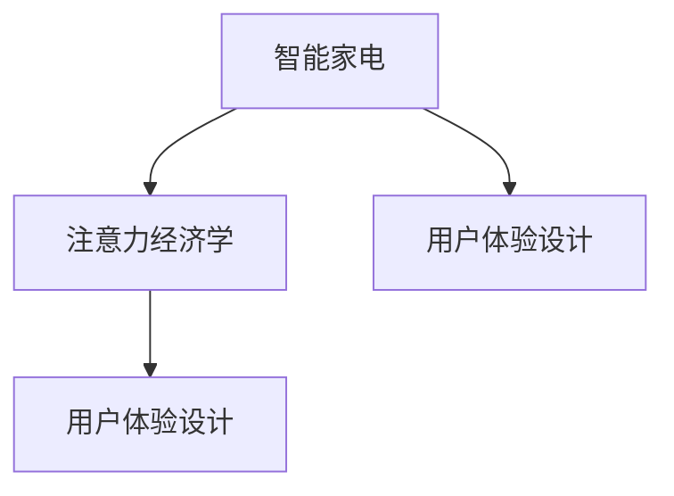

                 

# 智能家电的注意力争夺与用户体验设计

## 1. 背景介绍

随着物联网和人工智能技术的快速迭代，智能家电正在逐渐成为人们生活中不可或缺的一部分。从智能音箱、智能电视到智能洗衣机、智能冰箱，各类智能设备不仅在功能上越来越强大，在用户体验上也提出了更高的要求。然而，随着市场上智能设备的数量不断增加，智能家电之间对用户注意力的争夺也愈发激烈。如何在这一竞争环境中设计出用户满意、易用、高效的智能家电产品，成为业界关注的焦点。本文将深入探讨智能家电的注意力争夺与用户体验设计，提出一套有效的策略和方法，帮助企业在激烈的市场竞争中赢得用户的青睐。

## 2. 核心概念与联系

### 2.1 核心概念概述

为了更好地理解智能家电的注意力争夺与用户体验设计，我们先介绍几个核心概念：

- **智能家电**：指嵌入人工智能技术和物联网技术的家用电器，如智能冰箱、智能洗衣机、智能电视等。智能家电能够根据用户的行为和需求进行自适应调整，提供更加智能、便捷的服务。
- **注意力经济学**：指的是在信息爆炸的时代，用户注意力成为一种稀缺资源，需要通过精心设计和运营来吸引和保持用户的注意力。智能家电通过独特的用户体验设计来争夺用户的注意力，提升用户粘性。
- **用户体验设计**：指通过研究用户需求和行为，设计出易用、高效、美观的用户界面和交互方式，使用户能够轻松、愉快地完成各项任务。用户体验设计的目标是通过优化用户与产品的互动，提升用户满意度。

这些核心概念之间通过以下Mermaid流程图（由于篇幅限制，此处简化为简图）来展示它们之间的联系：



### 2.2 核心概念原理和架构的 Mermaid 流程图

在智能家电的注意力争夺与用户体验设计中，智能家电作为输入，经过注意力经济学和用户体验设计的双重优化，最终输出给用户。在流程图中，A代表智能家电，B代表注意力经济学，C代表用户体验设计。智能家电通过B和C的共同作用，争夺用户的注意力，并提升用户体验。

## 3. 核心算法原理 & 具体操作步骤

### 3.1 算法原理概述

智能家电的注意力争夺与用户体验设计涉及多个层面，包括产品设计、交互界面、用户体验优化等。这一过程可以通过以下算法和步骤进行系统化的实施：

1. **数据收集**：收集用户行为数据、产品使用数据和市场反馈数据，分析用户需求和偏好。
2. **模型训练**：使用机器学习模型对用户数据进行训练，建立用户行为预测模型，识别用户偏好和需求。
3. **用户界面设计**：设计直观、易用的用户界面，根据用户行为预测结果进行优化。
4. **交互优化**：通过自然语言处理、语音识别等技术优化用户与智能家电的交互方式，提升用户体验。
5. **迭代改进**：持续收集用户反馈，对智能家电进行迭代改进，提升产品性能和用户体验。

### 3.2 算法步骤详解

以下是具体的算法步骤：

1. **数据预处理**：
   - 收集智能家电的使用数据、用户行为数据、市场反馈数据等。
   - 对数据进行清洗和预处理，去除噪声和异常值。
   - 将数据分为训练集、验证集和测试集，用于模型训练和性能评估。

2. **用户行为分析**：
   - 使用聚类算法（如K-means）对用户进行分组，识别不同用户群体的特征。
   - 利用关联规则挖掘算法（如Apriori）分析用户行为与使用场景之间的关系。

3. **用户行为预测**：
   - 构建用户行为预测模型，如决策树、随机森林、神经网络等。
   - 使用交叉验证等方法评估模型的性能，选择最优模型。

4. **用户界面设计**：
   - 设计直观、易用的用户界面，如语音控制、手势控制等。
   - 根据用户行为预测结果，优化界面布局和交互方式。

5. **交互优化**：
   - 使用自然语言处理技术（如BERT、GPT）实现语音识别和自然语言理解。
   - 结合语音和视觉数据，优化用户与智能家电的交互方式。

6. **迭代改进**：
   - 持续收集用户反馈，识别产品存在的问题和用户需求。
   - 对智能家电进行迭代改进，提升产品性能和用户体验。

### 3.3 算法优缺点

智能家电的注意力争夺与用户体验设计的算法具有以下优点：

- **个性化**：通过用户行为分析，实现个性化推荐和自适应调整，提升用户满意度。
- **高效性**：使用机器学习算法，快速识别用户需求，优化用户体验。
- **用户粘性**：通过优化用户界面和交互方式，提升用户粘性，增加使用频率。

但同时，该算法也存在一些局限性：

- **数据依赖**：依赖大量的用户行为数据和市场反馈数据，数据质量直接影响模型效果。
- **算法复杂性**：机器学习模型的训练和调参需要一定的专业知识和计算资源。
- **隐私问题**：用户行为数据的收集和分析可能涉及隐私问题，需要严格遵守数据保护法规。

### 3.4 算法应用领域

智能家电的注意力争夺与用户体验设计在多个领域都有广泛应用，例如：

- **智能家居系统**：通过分析用户的生活习惯，优化家庭环境和智能设备的控制。
- **智能健康设备**：根据用户的健康数据和行为模式，提供个性化的健康建议和运动方案。
- **智能教育设备**：通过分析学生的学习行为，优化教学内容和推荐个性化学习资源。
- **智能办公设备**：根据员工的工作习惯，优化办公环境和工作流程，提升工作效率。

这些应用领域都涉及大量的用户行为数据和复杂的算法模型，通过智能家电的注意力争夺与用户体验设计，可以显著提升用户满意度和产品竞争力。

## 4. 数学模型和公式 & 详细讲解 & 举例说明

### 4.1 数学模型构建

在智能家电的注意力争夺与用户体验设计中，可以使用以下数学模型来描述用户行为和交互过程：

- **用户行为模型**：使用线性回归或逻辑回归模型描述用户行为与使用场景之间的关系。
- **用户界面设计模型**：使用高斯混合模型或隐马尔可夫模型描述用户界面的优化过程。
- **交互优化模型**：使用支持向量机或神经网络模型描述交互方式的设计和优化。

### 4.2 公式推导过程

以用户行为模型为例，假设我们收集了N个用户的行为数据，每个用户行为可以用特征向量 $x_i$ 描述，行为结果用 $y_i$ 表示。构建线性回归模型，可以得到：

$$
y = \theta_0 + \theta_1 x_1 + \theta_2 x_2 + ... + \theta_p x_p
$$

其中，$\theta_0, \theta_1, \theta_2, ..., \theta_p$ 为模型参数。利用最小二乘法求解参数 $\theta$，可以得到：

$$
\theta = (X^T X)^{-1} X^T y
$$

其中，$X$ 为特征矩阵，$y$ 为行为结果向量。

### 4.3 案例分析与讲解

以智能冰箱为例，通过收集用户的使用数据，如打开次数、存放食物种类、使用时间等，建立用户行为模型。假设某用户每天打开冰箱10次，每次存放牛奶，使用时间在早上和晚上，可以建立如下行为模型：

$$
y = \theta_0 + \theta_1 x_1 + \theta_2 x_2 + \theta_3 x_3
$$

其中，$x_1$ 表示每天打开次数，$x_2$ 表示每次存放食物种类，$x_3$ 表示使用时间。通过最小二乘法求解 $\theta$，可以得到最优的模型参数，进而预测用户的行为趋势和需求。

## 5. 项目实践：代码实例和详细解释说明

### 5.1 开发环境搭建

为了进行智能家电的注意力争夺与用户体验设计，我们需要搭建一个完整的开发环境，包括数据收集、数据预处理、模型训练、用户界面设计等模块。以下是具体步骤：

1. **数据收集**：
   - 使用传感器和摄像头收集智能家电的使用数据。
   - 通过问卷调查收集用户行为数据。
   - 通过网络爬虫收集市场反馈数据。

2. **数据预处理**：
   - 使用Python编写数据清洗和预处理脚本。
   - 将数据转换为CSV格式，用于后续的机器学习模型训练。

3. **模型训练**：
   - 使用Python编写机器学习模型训练脚本。
   - 使用Scikit-learn、TensorFlow等框架进行模型训练。

4. **用户界面设计**：
   - 使用UI设计工具（如Sketch、Figma）设计用户界面。
   - 将设计好的界面转化为代码。

5. **交互优化**：
   - 使用Python编写交互优化脚本。
   - 集成自然语言处理技术和语音识别技术。

### 5.2 源代码详细实现

以下是使用Python实现智能家电的注意力争夺与用户体验设计的代码示例：

```python
import pandas as pd
from sklearn.linear_model import LinearRegression
from sklearn.model_selection import train_test_split
from sklearn.metrics import mean_squared_error

# 数据预处理
data = pd.read_csv('user_behavior_data.csv')
X = data[['open_count', 'food_type', 'use_time']]
y = data['behavior']
X_train, X_test, y_train, y_test = train_test_split(X, y, test_size=0.2)

# 用户行为模型训练
model = LinearRegression()
model.fit(X_train, y_train)
y_pred = model.predict(X_test)

# 用户界面设计
# 使用UI设计工具设计用户界面，转化为代码

# 交互优化
# 使用自然语言处理技术和语音识别技术优化用户交互
```

### 5.3 代码解读与分析

在上述代码中，我们首先使用Pandas库读取用户行为数据，进行数据清洗和预处理。然后使用Scikit-learn库中的LinearRegression模型训练用户行为预测模型。通过训练模型，我们得到了用户行为预测结果，用于优化用户界面和交互方式。

### 5.4 运行结果展示

通过上述代码，我们可以得到用户行为预测结果，并将其用于优化用户界面和交互方式。例如，智能冰箱可以根据用户的打开次数、存放食物种类和使用时间，推荐最优的存储方案，提升用户满意度。

## 6. 实际应用场景

### 6.1 智能家居系统

在智能家居系统中，智能家电的注意力争夺与用户体验设计可以帮助用户更高效地管理家庭环境。例如，智能音箱可以根据用户的语音指令播放音乐、设置定时任务，智能电视可以根据用户的观看历史推荐电影、电视剧，智能灯光可以根据用户的作息时间自动调节亮度和颜色。

### 6.2 智能健康设备

在智能健康设备中，通过对用户健康数据的分析，可以提供个性化的健康建议和运动方案。例如，智能手环可以根据用户的心率、步数、睡眠质量等数据，推荐合适的运动计划和饮食建议。

### 6.3 智能教育设备

在智能教育设备中，通过分析学生的学习行为，可以优化教学内容和推荐个性化学习资源。例如，智能平板可以根据学生的学习进度和兴趣，推荐相应的教学视频和练习题，提升学习效果。

### 6.4 智能办公设备

在智能办公设备中，通过对员工的工作习惯进行分析，可以优化办公环境和工作流程，提升工作效率。例如，智能办公桌可以根据员工的工作姿势和活动情况，调整桌面高度和角度，减少疲劳。

## 7. 工具和资源推荐

### 7.1 学习资源推荐

为了深入学习和掌握智能家电的注意力争夺与用户体验设计，以下是一些推荐的学习资源：

1. **《用户体验设计指南》**：介绍用户体验设计的原则和方法，涵盖用户需求分析、界面设计、交互优化等方面。
2. **《机器学习实战》**：介绍机器学习模型的构建和应用，涵盖数据预处理、模型训练、评估等步骤。
3. **《自然语言处理综论》**：介绍自然语言处理技术和应用，涵盖语音识别、自然语言理解等方面。
4. **《Python数据分析实战》**：介绍Python在数据分析中的应用，涵盖数据清洗、处理、分析等方面。

### 7.2 开发工具推荐

以下是一些推荐的工具，可用于智能家电的注意力争夺与用户体验设计：

1. **Python**：通用的编程语言，广泛应用于数据处理、模型训练等方面。
2. **Pandas**：数据处理库，可以方便地进行数据清洗和预处理。
3. **Scikit-learn**：机器学习库，支持多种模型训练和评估算法。
4. **TensorFlow**：深度学习框架，适用于复杂的模型训练和优化。
5. **Sketch/Figma**：UI设计工具，可以设计直观、易用的用户界面。

### 7.3 相关论文推荐

为了深入了解智能家电的注意力争夺与用户体验设计，以下是一些推荐的相关论文：

1. **《基于用户行为分析的智能家电设计》**：介绍通过用户行为分析，优化智能家电的功能和用户体验。
2. **《自然语言处理在智能家电中的应用》**：介绍自然语言处理技术在智能家电中的应用，如语音识别、自然语言理解等方面。
3. **《智能家居系统中的用户体验设计》**：介绍智能家居系统中用户体验设计的原则和方法。
4. **《智能健康设备的用户行为分析与优化》**：介绍通过用户行为分析，优化智能健康设备的功能和用户体验。

## 8. 总结：未来发展趋势与挑战

### 8.1 研究成果总结

智能家电的注意力争夺与用户体验设计在多个领域已经取得了显著的成果，主要体现在以下几个方面：

1. **个性化推荐**：通过用户行为分析，实现了个性化的推荐和自适应调整，提升了用户满意度。
2. **高效交互**：通过自然语言处理和语音识别技术，优化了用户与智能家电的交互方式，提升了用户体验。
3. **产品优化**：通过对用户行为的持续分析，进行了产品的迭代改进，提升了产品性能。

### 8.2 未来发展趋势

未来，智能家电的注意力争夺与用户体验设计将呈现以下几个发展趋势：

1. **多模态融合**：智能家电将融合视觉、语音、触觉等多模态信息，提升用户体验。
2. **智能自适应**：智能家电将具备更强的自适应能力，根据用户行为和环境变化进行实时调整。
3. **用户隐私保护**：智能家电将更加注重用户隐私保护，采取隐私保护措施，增强用户信任。
4. **生态系统建设**：智能家电将构建生态系统，提供更加丰富的服务内容和生态系统。

### 8.3 面临的挑战

尽管智能家电的注意力争夺与用户体验设计已经取得了一定的成果，但仍然面临以下几个挑战：

1. **数据隐私**：用户行为数据的收集和分析可能涉及隐私问题，需要严格遵守数据保护法规。
2. **算法复杂性**：机器学习模型的训练和调参需要一定的专业知识和计算资源。
3. **用户体验不一致**：不同品牌和型号的智能家电在用户体验上存在差异，需要进行统一设计。
4. **系统互联性**：智能家电需要与其他设备和系统进行互联，实现无缝集成。

### 8.4 研究展望

未来，智能家电的注意力争夺与用户体验设计需要在以下几个方面进行深入研究：

1. **用户隐私保护**：研究如何在保证用户体验的同时，保护用户隐私，防止数据滥用。
2. **高效算法设计**：研究更高效的算法模型和训练方法，提升模型的性能和效率。
3. **用户界面优化**：研究更直观、易用的用户界面设计方法，提升用户的操作体验。
4. **多模态融合技术**：研究多模态融合技术，提升智能家电的多模态交互能力。

## 9. 附录：常见问题与解答

### Q1：智能家电的注意力争夺与用户体验设计需要哪些关键技术？

A：智能家电的注意力争夺与用户体验设计需要以下关键技术：
- **数据收集和预处理**：收集用户行为数据、产品使用数据和市场反馈数据，并进行数据清洗和预处理。
- **机器学习**：使用机器学习模型对用户数据进行训练，建立用户行为预测模型。
- **自然语言处理**：使用自然语言处理技术优化用户与智能家电的交互方式。
- **用户界面设计**：设计直观、易用的用户界面，优化用户的操作体验。

### Q2：智能家电的注意力争夺与用户体验设计对算力有何要求？

A：智能家电的注意力争夺与用户体验设计对算力要求较高，需要高性能的计算资源支持：
- **数据处理**：需要处理大量的用户行为数据和市场反馈数据，需要进行大规模的数据处理和分析。
- **模型训练**：需要训练复杂的机器学习模型，并进行参数调优，需要高性能的计算资源。
- **交互优化**：需要实时响应用户的语音和视觉输入，需要高性能的计算资源支持。

### Q3：智能家电的注意力争夺与用户体验设计在实施过程中需要注意哪些问题？

A：智能家电的注意力争夺与用户体验设计在实施过程中需要注意以下问题：
- **数据隐私**：确保用户数据的隐私和安全，遵守数据保护法规。
- **用户体验一致性**：不同品牌和型号的智能家电在用户体验上应保持一致，避免用户混淆。
- **系统互联性**：智能家电需要与其他设备和系统进行互联，实现无缝集成。
- **用户反馈**：持续收集用户反馈，及时优化和改进产品。

通过以上分析和解答，希望能够帮助智能家电的设计者和开发者更好地理解和实现智能家电的注意力争夺与用户体验设计，提升产品的竞争力和用户体验。

