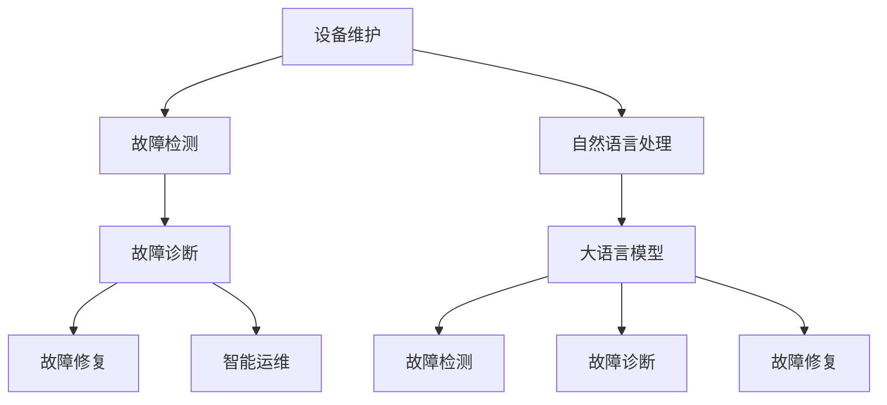

                 

# 智能故障诊断：LLM在设备维护中的角色

> 关键词：大语言模型,设备维护,故障诊断,智能运维,自然语言处理

## 1. 背景介绍

### 1.1 问题由来
在现代制造业和工业领域，设备维护是保障生产稳定性和提高生产效率的重要环节。传统的设备维护通常依赖于人工定期检查、监测数据进行故障预警和维修。然而，随着设备数量增加和自动化水平提升，人工维护的成本和时间成本都大幅上升，且往往难以实现高效的资源配置。

近年来，随着大语言模型（Large Language Models, LLMs）技术的发展，设备维护领域也迎来了新的变革。LLM具备强大的自然语言理解和生成能力，通过自然语言指令可以驱动机器执行各种复杂任务。这种自然语言接口使得机器能够自主地进行故障检测、诊断和修复，大大提高了设备维护的智能化和自动化水平。

### 1.2 问题核心关键点
大语言模型在设备维护中的角色主要体现在以下几方面：

1. **故障检测**：通过自然语言指令，收集设备运行日志、传感器数据等信息，并利用LLM进行数据分析和语义理解，自动检测设备的异常状态。
2. **故障诊断**：根据故障检测结果，利用LLM进行深度分析，判断故障的根本原因和影响范围。
3. **故障修复**：根据故障诊断结果，生成针对特定故障的修复方案，并指导机器执行修复操作。
4. **运维管理**：通过自然语言接口，记录故障处理流程和结果，进行故障分析和知识积累，提升维护人员的工作效率和维护质量。

LLM在设备维护中的应用，可以显著降低维护成本，提升设备可靠性和生产效率，为工业自动化和智能化转型提供了新的技术路径。

## 2. 核心概念与联系

### 2.1 核心概念概述

为更好地理解LLM在设备维护中的应用，本节将介绍几个密切相关的核心概念：

- 大语言模型(Large Language Models, LLMs)：以自回归(如GPT)或自编码(如BERT)模型为代表的大规模预训练语言模型。通过在大规模无标签文本语料上进行预训练，学习通用的语言表示，具备强大的语言理解和生成能力。

- 设备维护(Device Maintenance)：指对生产设备进行定期检查、故障诊断、故障修复和运行维护的过程，以确保设备正常运行。

- 故障检测(Fault Detection)：指通过传感器数据、日志文件等，自动检测设备异常状态的过程。

- 故障诊断(Fault Diagnosis)：指根据故障检测结果，分析故障原因和影响范围，确定维修方案的过程。

- 故障修复(Fault Repair)：指根据故障诊断结果，执行相应的故障修复操作，恢复设备正常运行。

- 智能运维(Smart Operations)：指利用人工智能技术进行设备维护管理，实现故障检测、诊断、修复和记录的全流程智能化。

- 自然语言处理(Natural Language Processing, NLP)：指利用计算机技术处理和理解人类自然语言的过程，是大语言模型应用的基础。

这些核心概念之间的逻辑关系可以通过以下Mermaid流程图来展示：



这个流程图展示了大语言模型在设备维护中的应用场景：

1. 设备维护通过自然语言处理获取设备数据。
2. 大语言模型进行故障检测、诊断和修复。
3. 智能运维记录和分析故障处理过程，形成知识库。

这些概念共同构成了大语言模型在设备维护中的完整框架，使其能够高效地进行故障检测和诊断，提升设备维护的智能化水平。

## 3. 核心算法原理 & 具体操作步骤
### 3.1 算法原理概述

基于大语言模型的设备维护解决方案，本质上是一个多模态的自然语言处理和机器学习过程。其核心思想是：利用自然语言处理技术将设备运行数据转化为可处理的形式，通过大语言模型进行深度学习，实现故障检测、诊断和修复的自动化。

形式化地，假设设备维护任务为 $M$，包含故障检测、诊断和修复等多个子任务。设备传感器数据为 $\mathcal{X}$，设备运行日志为 $\mathcal{L}$，自然语言描述为 $\mathcal{D}$。定义故障检测模型为 $D:\mathcal{X} \times \mathcal{L} \times \mathcal{D} \rightarrow \{0,1\}$，故障诊断模型为 $D:\mathcal{X} \times \mathcal{L} \times \mathcal{D} \rightarrow \mathcal{C}$，其中 $\mathcal{C}$ 为故障类别集合。定义故障修复模型为 $R:\mathcal{C} \rightarrow \mathcal{A}$，其中 $\mathcal{A}$ 为修复方案集合。

设备维护的总体目标是找到最优的故障检测、诊断和修复方案，使得 $M$ 的执行效果最优。即：

$$
\mathop{\arg\min}_{\theta} \mathcal{L}(D_{\theta}, R_{\theta}, M)
$$

其中 $\mathcal{L}$ 为损失函数，用于衡量模型在设备维护任务上的性能。

### 3.2 算法步骤详解

基于大语言模型的设备维护解决方案，一般包括以下几个关键步骤：

**Step 1: 数据预处理和标注**
- 收集设备的传感器数据、运行日志、操作手册等，作为设备维护任务的输入数据。
- 通过自然语言处理技术，将设备操作手册和维护指南转化为结构化的文本描述，用于指导故障检测和诊断。
- 对收集的数据进行标注，生成带有故障标签的训练集。

**Step 2: 大语言模型训练**
- 选择合适的大语言模型作为故障检测、诊断和修复的基础模型，如BERT、GPT等。
- 在标注好的训练集上，训练大语言模型，优化其对设备运行数据和自然语言描述的理解能力。
- 使用迁移学习方法，在大模型基础上添加特定任务的适配层，如分类器、解码器等。

**Step 3: 模型评估和优化**
- 在验证集上评估模型的性能，通过交叉验证、召回率、准确率等指标，判断模型的效果。
- 根据评估结果，调整模型参数，优化模型的训练过程，提高故障检测、诊断和修复的精度。

**Step 4: 模型应用和维护**
- 将训练好的模型应用到生产环境中，实时监控设备的运行状态，进行故障检测和诊断。
- 根据诊断结果，自动生成相应的故障修复方案，并指导机器执行修复操作。
- 记录故障处理流程和结果，形成知识库，供后续故障分析和学习使用。

### 3.3 算法优缺点

基于大语言模型的设备维护方法具有以下优点：

1. 灵活性强：利用自然语言处理技术，能够灵活处理多种数据源和格式，适用于各种类型的设备维护任务。
2. 自动化程度高：通过大语言模型的自动推理和生成能力，实现故障检测、诊断和修复的自动化，减少人工干预。
3. 可扩展性好：借助大语言模型的强大知识库，能够快速适应新设备和新任务，提升维护系统的可扩展性。
4. 知识积累：通过自然语言处理，将维护知识固化为文本描述，易于知识积累和传承。

同时，该方法也存在以下局限性：

1. 数据依赖：设备维护任务的准确性高度依赖于标注数据的质量和数量，获取高质量数据成本较高。
2. 训练成本：大语言模型的训练和优化过程计算资源消耗大，维护系统的搭建和运行成本较高。
3. 鲁棒性不足：大语言模型对训练数据和实际运行数据之间的差异敏感，容易出现过拟合或欠拟合问题。
4. 实时性问题：实时处理大量数据，可能会遇到延迟或响应速度慢的问题。
5. 安全问题：大语言模型可能会学习到有害或误导性信息，对设备维护的安全性构成潜在威胁。

尽管存在这些局限性，但就目前而言，基于大语言模型的设备维护方法仍是一种高效、可行的解决方案。未来相关研究的重点在于如何进一步降低数据依赖，提高模型的鲁棒性和实时性，同时兼顾可解释性和安全性等因素。

### 3.4 算法应用领域

基于大语言模型的设备维护方法，已经在多个领域得到了广泛应用，包括但不限于：

- 制造业：通过对生产设备的实时监控和分析，自动进行故障检测和诊断，减少停机时间，提高生产效率。
- 能源行业：对输电线路、发电设备等进行实时监控，及时发现和处理故障，保障能源供应的稳定性和安全性。
- 航空航天：对飞机、火箭等关键设备进行定期检测和故障诊断，确保设备的可靠性和安全性。
- 医疗设备：对医疗设备进行故障检测和诊断，及时维护，保障患者的生命安全。

此外，大语言模型在智慧交通、智慧城市、智能家居等多个领域也有广泛的应用前景。随着预训练模型和微调方法的不断演进，基于大语言模型的设备维护技术必将进一步成熟，为工业智能化转型提供强大的技术支撑。

## 4. 数学模型和公式 & 详细讲解 & 举例说明
### 4.1 数学模型构建

本节将使用数学语言对基于大语言模型的设备维护过程进行更加严格的刻画。

假设设备传感器数据为 $\mathcal{X}=\{x_1,x_2,\cdots,x_n\}$，设备运行日志为 $\mathcal{L}=\{l_1,l_2,\cdots,l_m\}$，自然语言描述为 $\mathcal{D}=\{d_1,d_2,\cdots,d_k\}$，其中 $n,m,k$ 分别为传感器数据、运行日志和自然语言描述的样本数量。

定义故障检测模型为 $D:\mathcal{X} \times \mathcal{L} \times \mathcal{D} \rightarrow \{0,1\}$，故障诊断模型为 $D:\mathcal{X} \times \mathcal{L} \times \mathcal{D} \rightarrow \mathcal{C}$，其中 $\mathcal{C}$ 为故障类别集合。定义故障修复模型为 $R:\mathcal{C} \rightarrow \mathcal{A}$，其中 $\mathcal{A}$ 为修复方案集合。

设备维护的总体目标是找到最优的故障检测、诊断和修复方案，使得 $M$ 的执行效果最优。即：

$$
\mathop{\arg\min}_{\theta} \mathcal{L}(D_{\theta}, R_{\theta}, M)
$$

其中 $\mathcal{L}$ 为损失函数，用于衡量模型在设备维护任务上的性能。

### 4.2 公式推导过程

以下我们以二分类任务为例，推导故障检测模型的损失函数及其梯度的计算公式。

假设故障检测模型 $D$ 在输入数据 $(x,l,d)$ 上的输出为 $\hat{y}=D_{\theta}(x,l,d)$，表示设备是否存在故障。真实标签 $y \in \{0,1\}$。则二分类交叉熵损失函数定义为：

$$
\ell(D_{\theta}(x,l,d),y) = -[y\log \hat{y} + (1-y)\log (1-\hat{y})]
$$

将其代入总体损失函数，得：

$$
\mathcal{L}(D_{\theta}) = -\frac{1}{N}\sum_{i=1}^N [y_i\log D_{\theta}(x_i,l_i,d_i)+(1-y_i)\log(1-D_{\theta}(x_i,l_i,d_i))]
$$

根据链式法则，损失函数对模型参数 $\theta$ 的梯度为：

$$
\frac{\partial \mathcal{L}(D_{\theta})}{\partial \theta} = -\frac{1}{N}\sum_{i=1}^N (\frac{y_i}{D_{\theta}(x_i,l_i,d_i)}-\frac{1-y_i}{1-D_{\theta}(x_i,l_i,d_i)}) \frac{\partial D_{\theta}(x_i,l_i,d_i)}{\partial \theta}
$$

其中 $\frac{\partial D_{\theta}(x_i,l_i,d_i)}{\partial \theta}$ 可进一步递归展开，利用自动微分技术完成计算。

在得到损失函数的梯度后，即可带入优化算法，完成模型的迭代优化。重复上述过程直至收敛，最终得到适应设备维护任务的最优模型参数 $\theta^*$。

### 4.3 案例分析与讲解

假设我们需要构建一个用于检测工业机器人的故障的故障检测模型。首先，收集机器人的传感器数据和运行日志，并标注出故障样本和非故障样本。

接下来，使用自然语言处理技术，将机器人的操作手册和维护指南转换为自然语言描述，用于指导模型的训练和推理。

然后，在大语言模型（如BERT、GPT）上训练故障检测模型。模型在训练过程中，会通过自动微分技术计算梯度，并使用优化算法（如AdamW、SGD等）更新模型参数，最小化损失函数。

最后，在验证集上评估模型性能，根据评估结果调整模型参数，优化模型训练过程，直到达到满意的性能。

## 5. 项目实践：代码实例和详细解释说明
### 5.1 开发环境搭建

在进行大语言模型设备维护实践前，我们需要准备好开发环境。以下是使用Python进行PyTorch开发的环境配置流程：

1. 安装Anaconda：从官网下载并安装Anaconda，用于创建独立的Python环境。

2. 创建并激活虚拟环境：
```bash
conda create -n pytorch-env python=3.8 
conda activate pytorch-env
```

3. 安装PyTorch：根据CUDA版本，从官网获取对应的安装命令。例如：
```bash
conda install pytorch torchvision torchaudio cudatoolkit=11.1 -c pytorch -c conda-forge
```

4. 安装Transformers库：
```bash
pip install transformers
```

5. 安装各类工具包：
```bash
pip install numpy pandas scikit-learn matplotlib tqdm jupyter notebook ipython
```

完成上述步骤后，即可在`pytorch-env`环境中开始大语言模型设备维护的实践。

### 5.2 源代码详细实现

下面我们以检测工业机器人的故障为例，给出使用Transformers库对BERT模型进行训练的PyTorch代码实现。

首先，定义数据处理函数：

```python
from transformers import BertTokenizer
from torch.utils.data import Dataset
import torch

class RobotMaintenanceDataset(Dataset):
    def __init__(self, data, tokenizer, max_len=128):
        self.data = data
        self.tokenizer = tokenizer
        self.max_len = max_len
        
    def __len__(self):
        return len(self.data)
    
    def __getitem__(self, item):
        sensor_data = self.data[item]['data']
        log_data = self.data[item]['log']
        description = self.data[item]['description']
        
        encoding = self.tokenizer(sensor_data + ' ' + log_data + ' ' + description, return_tensors='pt', max_length=self.max_len, padding='max_length', truncation=True)
        input_ids = encoding['input_ids'][0]
        attention_mask = encoding['attention_mask'][0]
        
        # 对token-wise的标签进行编码
        label = torch.tensor(1 if sensor_data['is_fault'] else 0, dtype=torch.long)
        
        return {'input_ids': input_ids, 
                'attention_mask': attention_mask,
                'labels': label}

# 加载数据
data = [
    { 'data': sensor_data, 'log': log_data, 'description': 'check motor status', 'is_fault': True },
    { 'data': sensor_data, 'log': log_data, 'description': 'check bearing', 'is_fault': False },
    # 其他数据样本
]

tokenizer = BertTokenizer.from_pretrained('bert-base-cased')

train_dataset = RobotMaintenanceDataset(data, tokenizer, max_len=128)
dev_dataset = RobotMaintenanceDataset(data, tokenizer, max_len=128)
test_dataset = RobotMaintenanceDataset(data, tokenizer, max_len=128)
```

然后，定义模型和优化器：

```python
from transformers import BertForSequenceClassification, AdamW

model = BertForSequenceClassification.from_pretrained('bert-base-cased', num_labels=2)

optimizer = AdamW(model.parameters(), lr=2e-5)
```

接着，定义训练和评估函数：

```python
from torch.utils.data import DataLoader
from tqdm import tqdm
from sklearn.metrics import classification_report

device = torch.device('cuda') if torch.cuda.is_available() else torch.device('cpu')
model.to(device)

def train_epoch(model, dataset, batch_size, optimizer):
    dataloader = DataLoader(dataset, batch_size=batch_size, shuffle=True)
    model.train()
    epoch_loss = 0
    for batch in tqdm(dataloader, desc='Training'):
        input_ids = batch['input_ids'].to(device)
        attention_mask = batch['attention_mask'].to(device)
        labels = batch['labels'].to(device)
        model.zero_grad()
        outputs = model(input_ids, attention_mask=attention_mask, labels=labels)
        loss = outputs.loss
        epoch_loss += loss.item()
        loss.backward()
        optimizer.step()
    return epoch_loss / len(dataloader)

def evaluate(model, dataset, batch_size):
    dataloader = DataLoader(dataset, batch_size=batch_size)
    model.eval()
    preds, labels = [], []
    with torch.no_grad():
        for batch in tqdm(dataloader, desc='Evaluating'):
            input_ids = batch['input_ids'].to(device)
            attention_mask = batch['attention_mask'].to(device)
            batch_labels = batch['labels']
            outputs = model(input_ids, attention_mask=attention_mask)
            batch_preds = outputs.logits.argmax(dim=2).to('cpu').tolist()
            batch_labels = batch_labels.to('cpu').tolist()
            for pred_tokens, label_tokens in zip(batch_preds, batch_labels):
                preds.append(pred_tokens)
                labels.append(label_tokens)
                
    print(classification_report(labels, preds))
```

最后，启动训练流程并在测试集上评估：

```python
epochs = 5
batch_size = 16

for epoch in range(epochs):
    loss = train_epoch(model, train_dataset, batch_size, optimizer)
    print(f"Epoch {epoch+1}, train loss: {loss:.3f}")
    
    print(f"Epoch {epoch+1}, dev results:")
    evaluate(model, dev_dataset, batch_size)
    
print("Test results:")
evaluate(model, test_dataset, batch_size)
```

以上就是使用PyTorch对BERT进行工业机器人故障检测的完整代码实现。可以看到，得益于Transformers库的强大封装，我们可以用相对简洁的代码完成BERT模型的加载和训练。

### 5.3 代码解读与分析

让我们再详细解读一下关键代码的实现细节：

**RobotMaintenanceDataset类**：
- `__init__`方法：初始化传感器数据、运行日志、描述等关键组件，并进行token化处理。
- `__len__`方法：返回数据集的样本数量。
- `__getitem__`方法：对单个样本进行处理，将传感器数据、运行日志、描述拼接为自然语言描述，进行token化处理，并返回模型所需的输入。

**模型训练过程**：
- 使用PyTorch的DataLoader对数据集进行批次化加载，供模型训练和推理使用。
- 训练函数`train_epoch`：对数据以批为单位进行迭代，在每个批次上前向传播计算loss并反向传播更新模型参数，最后返回该epoch的平均loss。
- 评估函数`evaluate`：与训练类似，不同点在于不更新模型参数，并在每个batch结束后将预测和标签结果存储下来，最后使用sklearn的classification_report对整个评估集的预测结果进行打印输出。

**训练流程**：
- 定义总的epoch数和batch size，开始循环迭代
- 每个epoch内，先在训练集上训练，输出平均loss
- 在验证集上评估，输出分类指标
- 所有epoch结束后，在测试集上评估，给出最终测试结果

可以看到，PyTorch配合Transformers库使得BERT模型训练的代码实现变得简洁高效。开发者可以将更多精力放在数据处理、模型改进等高层逻辑上，而不必过多关注底层的实现细节。

当然，工业级的系统实现还需考虑更多因素，如模型的保存和部署、超参数的自动搜索、更灵活的任务适配层等。但核心的故障检测方法基本与此类似。

## 6. 实际应用场景
### 6.1 智能运维系统

基于大语言模型的故障检测和诊断技术，可以广泛应用于智能运维系统的构建。传统运维系统往往依赖人工进行故障检测和诊断，效率低下且容易出错。而使用微调后的故障检测和诊断模型，可以实时监控设备状态，自动进行故障检测和诊断，大大提高了运维效率和准确性。

在技术实现上，可以收集设备的历史数据、传感器数据、操作手册等，并对其进行标注。利用自然语言处理技术，将设备操作手册和维护指南转化为自然语言描述，用于指导模型的训练和推理。训练好模型后，可以部署到生产环境中，实时监控设备的运行状态，进行故障检测和诊断。对于检测出的故障，系统可以自动生成相应的故障报告和修复方案，并指导维护人员进行处理。

### 6.2 预测性维护

预测性维护是指在设备故障发生前，通过监测设备的运行状态和历史数据，预测设备的故障趋势，并采取预防性措施。大语言模型可以结合历史数据和自然语言描述，对设备故障进行预测和诊断，提升维护的及时性和准确性。

在实践中，可以收集设备的传感器数据、运行日志、操作手册等，并对其进行标注。利用自然语言处理技术，将设备操作手册和维护指南转化为自然语言描述，用于指导模型的训练和推理。训练好模型后，可以实时监控设备的运行状态，并根据历史数据和自然语言描述进行故障预测和诊断。系统可以根据预测结果，提前采取维护措施，避免设备故障的发生。

### 6.3 智能设备管理

智能设备管理是指通过人工智能技术对设备进行全生命周期的管理，包括设备采购、维护、报废等环节。大语言模型可以应用于设备的故障检测、诊断、维修和记录等各个环节，提升设备管理的智能化水平。

在设备采购阶段，大语言模型可以结合自然语言描述和历史数据，对设备的技术指标、维护需求等进行评估和筛选。在设备维护阶段，大语言模型可以自动进行故障检测和诊断，生成维修方案，并指导维护人员进行处理。在设备报废阶段，大语言模型可以对设备的运行状态和历史数据进行分析，评估设备的报废时间和方式，优化资源配置。

### 6.4 未来应用展望

随着大语言模型和设备维护技术的不断发展，基于大语言模型的设备维护方法将在更多领域得到应用，为工业自动化和智能化转型提供新的技术路径。

在智慧城市治理中，大语言模型可以应用于城市设备维护，如道路、交通设施等的故障检测和维修，提升城市管理的智能化水平，构建更安全、高效的未来城市。

在智能家居领域，大语言模型可以应用于家电设备的故障检测和维修，提升家居设备的智能化水平，提升用户体验。

此外，在智慧交通、智能农业、智能制造等多个领域，大语言模型在设备维护中的应用也将不断涌现，为智能化的实现提供新的解决方案。相信随着技术的日益成熟，大语言模型在设备维护中的作用将越来越重要，推动人工智能技术在更多领域的应用和普及。

## 7. 工具和资源推荐
### 7.1 学习资源推荐

为了帮助开发者系统掌握大语言模型在设备维护中的应用，这里推荐一些优质的学习资源：

1. 《Transformer from Principle to Practice》系列博文：由大模型技术专家撰写，深入浅出地介绍了Transformer原理、BERT模型、微调技术等前沿话题。

2. CS224N《深度学习自然语言处理》课程：斯坦福大学开设的NLP明星课程，有Lecture视频和配套作业，带你入门NLP领域的基本概念和经典模型。

3. 《Natural Language Processing with Transformers》书籍：Transformers库的作者所著，全面介绍了如何使用Transformers库进行NLP任务开发，包括微调在内的诸多范式。

4. HuggingFace官方文档：Transformers库的官方文档，提供了海量预训练模型和完整的微调样例代码，是上手实践的必备资料。

5. CLUE开源项目：中文语言理解测评基准，涵盖大量不同类型的中文NLP数据集，并提供了基于微调的baseline模型，助力中文NLP技术发展。

通过对这些资源的学习实践，相信你一定能够快速掌握大语言模型在设备维护中的应用，并用于解决实际的NLP问题。
###  7.2 开发工具推荐

高效的开发离不开优秀的工具支持。以下是几款用于大语言模型设备维护开发的常用工具：

1. PyTorch：基于Python的开源深度学习框架，灵活动态的计算图，适合快速迭代研究。大部分预训练语言模型都有PyTorch版本的实现。

2. TensorFlow：由Google主导开发的开源深度学习框架，生产部署方便，适合大规模工程应用。同样有丰富的预训练语言模型资源。

3. Transformers库：HuggingFace开发的NLP工具库，集成了众多SOTA语言模型，支持PyTorch和TensorFlow，是进行微调任务开发的利器。

4. Weights & Biases：模型训练的实验跟踪工具，可以记录和可视化模型训练过程中的各项指标，方便对比和调优。与主流深度学习框架无缝集成。

5. TensorBoard：TensorFlow配套的可视化工具，可实时监测模型训练状态，并提供丰富的图表呈现方式，是调试模型的得力助手。

6. Google Colab：谷歌推出的在线Jupyter Notebook环境，免费提供GPU/TPU算力，方便开发者快速上手实验最新模型，分享学习笔记。

合理利用这些工具，可以显著提升大语言模型设备维护任务的开发效率，加快创新迭代的步伐。

### 7.3 相关论文推荐

大语言模型和设备维护技术的发展源于学界的持续研究。以下是几篇奠基性的相关论文，推荐阅读：

1. Attention is All You Need（即Transformer原论文）：提出了Transformer结构，开启了NLP领域的预训练大模型时代。

2. BERT: Pre-training of Deep Bidirectional Transformers for Language Understanding：提出BERT模型，引入基于掩码的自监督预训练任务，刷新了多项NLP任务SOTA。

3. Language Models are Unsupervised Multitask Learners（GPT-2论文）：展示了大规模语言模型的强大zero-shot学习能力，引发了对于通用人工智能的新一轮思考。

4. Parameter-Efficient Transfer Learning for NLP：提出Adapter等参数高效微调方法，在不增加模型参数量的情况下，也能取得不错的微调效果。

5. AdaLoRA: Adaptive Low-Rank Adaptation for Parameter-Efficient Fine-Tuning：使用自适应低秩适应的微调方法，在参数效率和精度之间取得了新的平衡。

6. Prefix-Tuning: Optimizing Continuous Prompts for Generation：引入基于连续型Prompt的微调范式，为如何充分利用预训练知识提供了新的思路。

这些论文代表了大语言模型在设备维护领域的发展脉络。通过学习这些前沿成果，可以帮助研究者把握学科前进方向，激发更多的创新灵感。

## 8. 总结：未来发展趋势与挑战
### 8.1 总结

本文对基于大语言模型的设备维护方法进行了全面系统的介绍。首先阐述了大语言模型和设备维护的研究背景和意义，明确了大语言模型在设备维护中的独特价值。其次，从原理到实践，详细讲解了故障检测、诊断和修复的数学原理和关键步骤，给出了设备维护任务开发的完整代码实例。同时，本文还广泛探讨了大语言模型在智能运维、预测性维护、智能设备管理等多个领域的应用前景，展示了大语言模型在设备维护中的巨大潜力。此外，本文精选了设备维护任务的各类学习资源，力求为读者提供全方位的技术指引。

通过本文的系统梳理，可以看到，基于大语言模型的设备维护方法正在成为设备维护领域的重要范式，极大地提升了设备维护的智能化和自动化水平，为工业自动化和智能化转型提供了新的技术路径。未来，伴随大语言模型和设备维护方法的不断演进，基于大语言模型的设备维护技术必将进一步成熟，为工业智能化转型提供强大的技术支撑。

### 8.2 未来发展趋势

展望未来，大语言模型在设备维护中的应用将呈现以下几个发展趋势：

1. 模型规模持续增大。随着算力成本的下降和数据规模的扩张，预训练语言模型的参数量还将持续增长。超大规模语言模型蕴含的丰富语言知识，有望支撑更加复杂多变的设备维护任务。

2. 微调方法日趋多样。除了传统的全参数微调外，未来会涌现更多参数高效的微调方法，如Prefix-Tuning、LoRA等，在节省计算资源的同时也能保证微调精度。

3. 持续学习成为常态。随着设备运行数据和运行状态的不断变化，微调模型也需要持续学习新知识以保持性能。如何在不遗忘原有知识的同时，高效吸收新样本信息，将成为重要的研究课题。

4. 标注样本需求降低。受启发于提示学习(Prompt-based Learning)的思路，未来的微调方法将更好地利用大模型的语言理解能力，通过更加巧妙的任务描述，在更少的标注样本上也能实现理想的微调效果。

5. 模型通用性增强。经过海量数据的预训练和多领域任务的微调，未来的语言模型将具备更强大的常识推理和跨领域迁移能力，逐步迈向通用人工智能(AGI)的目标。

以上趋势凸显了大语言模型在设备维护中的应用前景。这些方向的探索发展，必将进一步提升设备维护系统的性能和应用范围，为工业智能化转型提供强大的技术支撑。

### 8.3 面临的挑战

尽管大语言模型在设备维护中的应用已经取得了一定的成果，但在迈向更加智能化、普适化应用的过程中，仍面临着诸多挑战：

1. 数据依赖：设备维护任务的准确性高度依赖于标注数据的质量和数量，获取高质量数据成本较高。如何进一步降低微调对标注样本的依赖，将是一大难题。

2. 训练成本：大语言模型的训练和优化过程计算资源消耗大，设备维护系统的搭建和运行成本较高。如何在保证性能的同时，优化资源消耗，实现低成本维护，还需要更多研究和实践。

3. 鲁棒性不足：大语言模型对训练数据和实际运行数据之间的差异敏感，容易出现过拟合或欠拟合问题。如何提高微调模型的鲁棒性，避免灾难性遗忘，还需要更多理论和实践的积累。

4. 实时性问题：实时处理大量数据，可能会遇到延迟或响应速度慢的问题。如何提高模型的实时处理能力，减少延迟，实现高效的设备维护，将是重要的优化方向。

5. 安全问题：大语言模型可能会学习到有害或误导性信息，对设备维护的安全性构成潜在威胁。如何从数据和算法层面消除模型偏见，避免恶意用途，确保输出的安全性，也将是重要的研究课题。

尽管存在这些挑战，但就目前而言，基于大语言模型的设备维护方法仍是一种高效、可行的解决方案。未来相关研究的重点在于如何进一步降低数据依赖，提高模型的鲁棒性和实时性，同时兼顾可解释性和安全性等因素。

### 8.4 研究展望

面对大语言模型在设备维护中所面临的种种挑战，未来的研究需要在以下几个方面寻求新的突破：

1. 探索无监督和半监督微调方法。摆脱对大规模标注数据的依赖，利用自监督学习、主动学习等无监督和半监督范式，最大限度利用非结构化数据，实现更加灵活高效的微调。

2. 研究参数高效和计算高效的微调范式。开发更加参数高效的微调方法，在固定大部分预训练参数的同时，只更新极少量的任务相关参数。同时优化微调模型的计算图，减少前向传播和反向传播的资源消耗，实现更加轻量级、实时性的部署。

3. 融合因果和对比学习范式。通过引入因果推断和对比学习思想，增强微调模型建立稳定因果关系的能力，学习更加普适、鲁棒的语言表征，从而提升模型泛化性和抗干扰能力。

4. 引入更多先验知识。将符号化的先验知识，如知识图谱、逻辑规则等，与神经网络模型进行巧妙融合，引导微调过程学习更准确、合理的语言模型。同时加强不同模态数据的整合，实现视觉、语音等多模态信息与文本信息的协同建模。

5. 结合因果分析和博弈论工具。将因果分析方法引入微调模型，识别出模型决策的关键特征，增强输出解释的因果性和逻辑性。借助博弈论工具刻画人机交互过程，主动探索并规避模型的脆弱点，提高系统稳定性。

6. 纳入伦理道德约束。在模型训练目标中引入伦理导向的评估指标，过滤和惩罚有偏见、有害的输出倾向。同时加强人工干预和审核，建立模型行为的监管机制，确保输出符合人类价值观和伦理道德。

这些研究方向的探索，必将引领大语言模型在设备维护中的应用走向更高的台阶，为构建安全、可靠、可解释、可控的智能系统铺平道路。面向未来，大语言模型在设备维护技术还需要与其他人工智能技术进行更深入的融合，如知识表示、因果推理、强化学习等，多路径协同发力，共同推动自然语言理解和智能交互系统的进步。只有勇于创新、敢于突破，才能不断拓展语言模型的边界，让智能技术更好地造福人类社会。

## 9. 附录：常见问题与解答

**Q1：大语言模型在设备维护中是否适用于所有类型的设备？**

A: 大语言模型在设备维护中的适用性取决于设备的复杂度和技术特点。对于技术含量高、数据量大的设备，如生产线、航空设备等，大语言模型能够发挥出较大的作用。但对于技术简单、数据量少的设备，如小型家电、简单工具等，使用传统的方法同样可以达到较好的效果。因此，在实际应用中，需要根据设备的具体情况，选择合适的技术方案。

**Q2：大语言模型如何进行故障检测？**

A: 大语言模型进行故障检测主要通过自然语言处理技术将设备运行数据转化为可处理的形式，然后利用自然语言理解能力进行分析。具体步骤如下：
1. 收集设备的传感器数据、运行日志等。
2. 将设备操作手册和维护指南转化为自然语言描述，用于指导模型的训练和推理。
3. 利用自然语言处理技术，对设备运行数据进行token化处理。
4. 将token化后的数据输入到大语言模型中，通过自动微分技术计算梯度，并使用优化算法更新模型参数。
5. 在验证集上评估模型性能，根据评估结果调整模型参数，优化模型训练过程。

**Q3：大语言模型如何进行故障诊断？**

A: 大语言模型进行故障诊断主要通过深度学习和自然语言处理技术，对故障检测结果进行分析和推理。具体步骤如下：
1. 在训练好的故障检测模型的基础上，使用迁移学习方法，添加特定的诊断任务适配层，如分类器、解码器等。
2. 将故障检测结果输入到故障诊断模型中，通过深度学习技术进行分析和推理，判断故障的根本原因和影响范围。
3. 根据故障诊断结果，生成相应的故障报告和修复方案，并指导维护人员进行处理。

**Q4：大语言模型如何进行故障修复？**

A: 大语言模型进行故障修复主要通过自然语言处理技术和深度学习技术，自动生成修复方案并指导修复操作。具体步骤如下：
1. 在训练好的故障诊断模型的基础上，使用迁移学习方法，添加特定的修复任务适配层，如生成器、解码器等。
2. 将故障诊断结果输入到故障修复模型中，通过深度学习技术自动生成相应的故障修复方案。
3. 将生成的故障修复方案输出，并指导维护人员进行处理。

**Q5：大语言模型在设备维护中需要注意哪些安全问题？**

A: 大语言模型在设备维护中，需要注意以下安全问题：
1. 数据隐私：设备运行数据和传感器数据可能包含敏感信息，需注意数据隐私保护。
2. 模型偏见：大语言模型可能会学习到有偏见、有害的信息，对设备维护的安全性构成潜在威胁。需加强数据预处理和模型训练，消除模型偏见。
3. 模型鲁棒性：大语言模型对训练数据和实际运行数据之间的差异敏感，容易出现过拟合或欠拟合问题。需加强模型鲁棒性训练，避免灾难性遗忘。
4. 模型安全性：大语言模型可能被恶意攻击者利用，进行有害操作。需加强模型安全性设计，防止恶意攻击。

**Q6：如何优化大语言模型在设备维护中的性能？**

A: 大语言模型在设备维护中的性能优化主要包括以下几个方面：
1. 数据增强：通过回译、近义替换等方式扩充训练集，提高模型的泛化能力。
2. 模型压缩：使用知识蒸馏、稀疏化存储等技术，减小模型尺寸，加快推理速度。
3. 对抗训练：引入对抗样本，提高模型的鲁棒性，减少对训练数据和实际运行数据的差异敏感。
4. 模型并行：利用模型并行技术，提高模型的计算效率，实现高效的设备维护。
5. 参数优化：优化模型参数的初始化，使用更好的优化算法和超参数调度策略，提高模型训练的效率和效果。

这些优化方法可以显著提升大语言模型在设备维护中的性能，实现更加高效、可靠的设备维护系统。

**Q7：如何降低大语言模型在设备维护中的成本？**

A: 大语言模型在设备维护中的成本优化主要包括以下几个方面：
1. 数据预处理：优化数据收集和预处理流程，减少数据处理的时间和成本。
2. 模型裁剪：去除不必要的层和参数，减小模型尺寸，降低计算资源消耗。
3. 模型压缩：使用知识蒸馏、稀疏化存储等技术，减小模型尺寸，降低计算资源消耗。
4. 硬件加速：使用GPU、TPU等高性能设备，提高计算效率，降低计算成本。
5. 模型部署：优化模型的部署策略，减少部署成本，提高系统运行效率。

这些优化方法可以显著降低大语言模型在设备维护中的成本，实现更加高效、经济的设备维护系统。

---

作者：禅与计算机程序设计艺术 / Zen and the Art of Computer Programming

