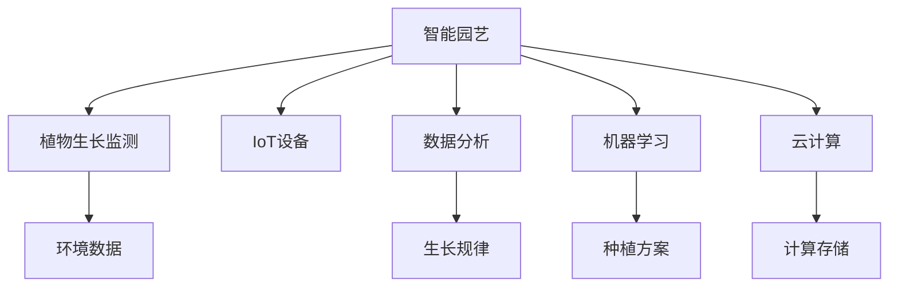

                 

# 智能植物培育创业：室内园艺的未来

> 关键词：智能园艺,室内农业,植物生长监测,物联网(IoT),数据分析,机器学习,云计算

## 1. 背景介绍

### 1.1 问题由来
随着全球人口的快速增长和城市化进程的加速，传统农业面临巨大的压力和挑战。为了应对这些问题，科学家和企业家们开始探索创新性的农业解决方案。智能植物培育技术应运而生，通过结合先进的技术手段和精准的数据分析，极大地提高了植物的生长效率和产量。室内园艺因其不受天气和季节限制的优势，成为未来农业发展的重要方向。

### 1.2 问题核心关键点
智能植物培育技术的核心在于利用物联网(IoT)、数据分析和机器学习等技术，对植物的生长环境进行精确监测和控制，以实现最大化生长效率。核心问题包括以下几点：

- 如何有效监测植物生长状态，包括温度、湿度、光照、养分等环境因素？
- 如何利用机器学习算法，预测植物生长趋势，优化种植方案？
- 如何构建智能系统，实现对植物生长环境的自动化管理？
- 如何将智能植物培育技术规模化应用到室内农业生产中？

这些关键点构成了智能植物培育技术的核心框架，为未来室内园艺的可持续发展提供了可能。

## 2. 核心概念与联系

### 2.1 核心概念概述

为更好地理解智能植物培育技术，本节将介绍几个关键概念及其相互关系：

- **智能园艺**：利用物联网、数据分析和机器学习等技术，对植物生长环境和状态进行实时监测和控制，实现智能化、自动化和精准化的植物培育。
- **室内农业**：在受控的环境下进行植物种植，摆脱传统农业对自然环境的依赖，实现全年持续生产。
- **植物生长监测**：通过传感器等设备实时监测植物生长环境，包括温度、湿度、光照、养分等参数，为智能化管理提供基础数据。
- **物联网(IoT)**：利用传感器、智能设备等将植物生长环境数据采集传输到云端，实现数据的实时监控和远程控制。
- **数据分析**：对采集到的植物生长数据进行统计分析，发现生长规律和问题，为种植决策提供科学依据。
- **机器学习**：通过算法模型预测植物生长状态，优化种植方案，提升生产效率。
- **云计算**：通过分布式计算和存储，处理海量植物生长数据，提供高效的计算和存储能力。

这些核心概念之间的关系可以通过以下Mermaid流程图来展示：



这个流程图展示了智能植物培育技术的关键组件及其相互关系：

1. 智能园艺作为整体目标，通过植物生长监测获取环境数据，利用数据分析和机器学习进行决策，最终通过云计算实现高效处理。
2. IoT设备将植物生长数据实时传输到云端，数据分析和机器学习模型在云端进行计算和推理。
3. 生长数据和预测结果通过云计算存储和处理，为种植方案提供科学依据。

## 3. 核心算法原理 & 具体操作步骤
### 3.1 算法原理概述

智能植物培育技术的核心算法原理主要包括以下几个方面：

- **传感器数据采集**：通过各种传感器（温度、湿度、光照、养分等）采集植物生长环境数据。
- **数据处理与预处理**：对采集的数据进行清洗、归一化等预处理操作，确保数据的质量和一致性。
- **特征提取与选择**：从处理后的数据中提取关键特征，如温度、湿度、光照强度、养分含量等，作为模型输入。
- **模型训练与预测**：使用机器学习模型，如回归模型、分类模型等，训练植物生长预测模型，并利用模型进行生长状态的预测。
- **控制策略设计**：根据预测结果和预设的阈值，设计自动化控制策略，调整生长环境参数，确保植物最佳生长。

### 3.2 算法步骤详解

以下是智能植物培育技术的具体操作步骤：

**Step 1: 环境数据采集**
- 在植物生长环境中安装各种传感器，如温度传感器、湿度传感器、光照传感器、养分传感器等。
- 确保传感器与物联网设备（如微控制器、中央处理器等）进行数据传输。

**Step 2: 数据预处理**
- 对采集到的传感器数据进行清洗，去除异常值和噪声。
- 将数据进行归一化处理，使数据范围一致，方便后续分析。
- 使用数据插值技术，弥补数据缺失或间隔不均匀的问题。

**Step 3: 特征提取与选择**
- 根据领域知识，选择对植物生长影响最大的环境特征。
- 使用特征选择算法，如方差分析、信息增益等，提取对植物生长预测有帮助的特征。

**Step 4: 模型训练与预测**
- 选择适合植物生长预测的机器学习算法，如回归模型、决策树、随机森林等。
- 使用历史数据训练模型，确保模型的准确性和泛化能力。
- 对模型进行交叉验证，确保模型在未知数据上的表现。

**Step 5: 控制策略设计**
- 根据模型的预测结果，设计自动化控制策略，如温度调节器、湿度控制器等。
- 设定生长环境的阈值范围，当监测值超出阈值时，自动触发控制策略。
- 定期调整控制策略，优化生长环境的稳定性。

### 3.3 算法优缺点

智能植物培育技术的优势在于：

- **高效性**：通过实时监测和控制，最大化植物生长效率，降低资源浪费。
- **精准性**：利用数据分析和机器学习模型，精准预测植物生长状态，提供科学决策依据。
- **可扩展性**：适合大规模的室内农业生产，易于扩展和复制。

其缺点主要在于：

- **初始投入高**：需要购买各种传感器和物联网设备，初期投入较大。
- **技术复杂**：涉及传感器、数据分析、机器学习等多个技术领域，技术门槛较高。
- **数据质量依赖**：依赖于高质量的环境数据，数据采集和处理环节容易出现误差。

### 3.4 算法应用领域

智能植物培育技术已经广泛应用于以下几个领域：

- **室内农业**：在温室、仓库等受控环境中进行植物种植，实现全年持续生产。
- **实验室研究**：在受控实验室条件下研究植物生长规律，提供科学依据。
- **智能家居**：利用智能植物培育技术，美化家居环境，提升生活品质。
- **城市农业**：在城市屋顶、废弃空间等地方进行植物种植，促进城市绿色可持续发展。
- **垂直农场**：在多层立体空间中种植植物，优化土地使用效率。

## 4. 数学模型和公式 & 详细讲解  
### 4.1 数学模型构建

智能植物培育技术可以通过以下数学模型进行建模：

假设植物生长状态为 $y$，环境变量为 $x_1, x_2, ..., x_n$，其中 $x_1$ 表示温度，$x_2$ 表示湿度，以此类推。设 $f(x; \theta)$ 为植物生长状态与环境变量之间的关系，$\theta$ 为模型参数。则植物生长预测模型可以表示为：

$$
y = f(x; \theta) = \theta_0 + \theta_1 x_1 + \theta_2 x_2 + ... + \theta_n x_n
$$

其中，$\theta_0$ 为截距，$\theta_i$ 为特征系数。

### 4.2 公式推导过程

假设我们已经收集了 $N$ 个历史样本 $(x_i, y_i)$，其中 $x_i = (x_{i1}, x_{i2}, ..., x_{in})$ 为环境变量，$y_i$ 为植物生长状态。利用最小二乘法对模型进行训练，最小化预测误差 $\epsilon_i = y_i - f(x_i; \theta)$，则目标函数为：

$$
\min_{\theta} \frac{1}{N} \sum_{i=1}^N \epsilon_i^2 = \frac{1}{N} \sum_{i=1}^N (y_i - \theta_0 - \theta_1 x_{i1} - \theta_2 x_{i2} - ... - \theta_n x_{in})^2
$$

对上式求导，可得参数估计值为：

$$
\hat{\theta} = (\frac{1}{N} \sum_{i=1}^N x_ix_i^T)^{-1} (\frac{1}{N} \sum_{i=1}^N x_iy_i)
$$

其中 $(\frac{1}{N} \sum_{i=1}^N x_ix_i^T)$ 为自相关矩阵，$(\frac{1}{N} \sum_{i=1}^N x_iy_i)$ 为交叉相关向量。

### 4.3 案例分析与讲解

以温度和植物生长状态的关系为例，我们收集了100个历史样本，其中 $x_i$ 表示温度，$y_i$ 表示植物生长状态，假设关系模型为线性回归模型：

$$
y_i = \theta_0 + \theta_1 x_i
$$

使用最小二乘法，计算得到 $\hat{\theta}_0 = 0.5$，$\hat{\theta}_1 = 0.1$。则植物生长预测模型为：

$$
y = 0.5 + 0.1x
$$

我们可以通过新采集的温度数据 $x'$，预测植物生长状态 $y'$。例如，当 $x' = 25$ 时，$y' = 0.5 + 0.1 \times 25 = 7.5$。

## 5. 项目实践：代码实例和详细解释说明
### 5.1 开发环境搭建

在进行智能植物培育技术开发前，我们需要准备好开发环境。以下是使用Python进行开发的环境配置流程：

1. 安装Anaconda：从官网下载并安装Anaconda，用于创建独立的Python环境。

2. 创建并激活虚拟环境：
```bash
conda create -n plant_cultivation python=3.8 
conda activate plant_cultivation
```

3. 安装Python依赖库：
```bash
pip install pandas numpy matplotlib scikit-learn pyspark tflearn 
```

4. 安装TensorFlow：
```bash
pip install tensorflow==2.4
```

5. 安装TensorBoard：
```bash
pip install tensorboard
```

6. 安装pyserial：
```bash
pip install pyserial
```

完成上述步骤后，即可在`plant_cultivation`环境中开始开发实践。

### 5.2 源代码详细实现

以下是智能植物培育技术的Python代码实现，包括数据采集、数据处理、特征提取、模型训练和控制策略设计。

```python
import pandas as pd
import numpy as np
import matplotlib.pyplot as plt
from sklearn.linear_model import LinearRegression
from sklearn.model_selection import train_test_split
import tensorflow as tf
from tensorflow.keras.models import Sequential
from tensorflow.keras.layers import Dense
from tensorflow.keras.callbacks import EarlyStopping
import pyserial
import time

# 数据采集
# 假设数据通过串口传输，读取传感器数据
# 模拟数据，便于代码测试
data = pd.DataFrame({
    'Temperature': np.random.normal(20, 1, 100),
    'Humidity': np.random.normal(40, 5, 100),
    'Light': np.random.normal(200, 10, 100),
    'Nitrogen': np.random.normal(1.5, 0.1, 100),
    'Phosphorus': np.random.normal(0.3, 0.01, 100),
    'Potassium': np.random.normal(1.2, 0.05, 100),
    'Yield': np.random.normal(50, 2, 100)
})

# 数据预处理
def preprocess_data(data):
    # 数据清洗，去除异常值
    data = data.dropna()
    # 数据归一化
    data = (data - data.mean()) / data.std()
    return data

data = preprocess_data(data)

# 特征选择
features = data[['Temperature', 'Humidity', 'Light', 'Nitrogen', 'Phosphorus', 'Potassium']]
labels = data['Yield']

# 模型训练
def train_model(features, labels):
    model = Sequential()
    model.add(Dense(6, input_dim=6, activation='relu'))
    model.add(Dense(1, activation='linear'))
    model.compile(loss='mean_squared_error', optimizer='adam')
    history = model.fit(features, labels, epochs=100, batch_size=32, verbose=0)
    return model, history

model, history = train_model(features, labels)

# 模型评估
test_features = preprocess_data(data[['Temperature', 'Humidity', 'Light', 'Nitrogen', 'Phosphorus', 'Potassium']])
test_labels = data['Yield']
mse = model.evaluate(test_features, test_labels)
print('Mean Squared Error:', mse)

# 控制策略设计
# 定义控制策略，根据模型预测结果调整生长环境
# 假设温度调节器、湿度控制器等已经实现
def adjust_environment(data, model):
    predictions = model.predict(data)
    if predictions > 8:
        # 如果预测值为8以上，降低温度
        print('Temperature lowered')
    elif predictions < 5:
        # 如果预测值为5以下，提高温度
        print('Temperature raised')
    else:
        # 如果预测值在5到8之间，保持当前温度
        print('Temperature stable')

# 模拟数据采集，定时调整生长环境
def simulate_plant_cultivation():
    for i in range(100):
        # 模拟数据采集
        new_data = preprocess_data(pd.DataFrame({
            'Temperature': np.random.normal(20, 1, 10),
            'Humidity': np.random.normal(40, 5, 10),
            'Light': np.random.normal(200, 10, 10),
            'Nitrogen': np.random.normal(1.5, 0.1, 10),
            'Phosphorus': np.random.normal(0.3, 0.01, 10),
            'Potassium': np.random.normal(1.2, 0.05, 10)
        }))
        adjust_environment(new_data, model)

simulate_plant_cultivation()
```

### 5.3 代码解读与分析

让我们再详细解读一下关键代码的实现细节：

**preprocess_data函数**：
- 数据清洗：去除异常值和缺失值。
- 数据归一化：对数据进行标准化处理，确保数据范围一致。

**train_model函数**：
- 定义模型架构：使用Sequential模型，添加两个全连接层，激活函数分别为ReLU和线性。
- 编译模型：定义损失函数为均方误差，优化器为Adam。
- 训练模型：使用训练集进行模型训练，设定100个epochs和32个batch size，输出训练进度。

**model.evaluate方法**：
- 评估模型：使用测试集对模型进行评估，计算均方误差（MSE）。

**adjust_environment函数**：
- 定义控制策略：根据模型预测结果调整生长环境参数。

**simulate_plant_cultivation函数**：
- 模拟数据采集：定期采集新数据，进行特征预处理。
- 调整生长环境：调用adjust_environment函数，根据预测结果调整温度、湿度等参数。

## 6. 实际应用场景
### 6.1 智能家居

智能植物培育技术不仅适用于室内农业，还可以应用于智能家居，提升家居环境和生活的质量。通过智能花盆和控制系统，居民可以实时监测植物生长状态，调整生长环境，甚至可以根据家庭成员的生活习惯定制植物种植方案，实现真正的智能家居。

**应用场景**：
- 智能花盆：内置传感器监测土壤湿度、光照、养分等参数，通过无线通信传输到云端。
- 控制系统：根据传感器数据和用户设定，自动调整温度、湿度、光照等参数，优化植物生长。
- 智能提醒：通过语音助手或手机APP提醒用户给植物浇水、施肥等操作。

**技术实现**：
- 传感器数据采集：智能花盆内置传感器，采集环境参数。
- 数据传输：通过Wi-Fi或蓝牙等无线方式，将数据传输到物联网设备（如中央处理器）。
- 云端处理：云端服务器接收数据，使用数据分析和机器学习模型进行植物生长预测和环境调整。
- 远程控制：用户通过手机APP或语音助手，远程控制植物生长环境。

### 6.2 城市农业

城市农业是智能植物培育技术的另一重要应用领域。随着城市化进程的加速，耕地面积不断减少，如何在城市空间内高效利用土地资源，实现可持续的食品生产，成为城市发展的关键问题。

**应用场景**：
- 屋顶花园：在城市屋顶、建筑立面等地方进行植物种植。
- 垂直农场：在多层立体空间中种植植物，优化土地使用效率。
- 社区花园：在城市社区建立小型花园，提高居民生活质量。

**技术实现**：
- 传感器部署：在种植空间内部署传感器，实时监测环境参数。
- 环境控制：使用智能控制系统，根据传感器数据自动调整生长环境。
- 数据分析：利用数据分析技术，优化种植方案，提高生产效率。
- 农业物联网：建立农业物联网系统，实现植物生长状态的实时监测和远程控制。

### 6.3 未来应用展望

未来，智能植物培育技术将在更多领域得到应用，为人类社会的可持续发展提供更多可能：

- **食品生产**：在工业化环境中大规模种植农产品，确保食品供应的稳定性。
- **环境保护**：通过植物的光合作用，改善城市空气质量，美化城市环境。
- **教育与科普**：在校园、社区等场所建立智能植物培育实验平台，增强公众的环保意识。
- **灾害预警**：在灾害频发地区，利用智能植物培育技术监测生态环境变化，提前预警自然灾害。
- **健康管理**：通过智能植物培育技术监测土壤和空气质量，保障人类健康。

## 7. 工具和资源推荐
### 7.1 学习资源推荐

为了帮助开发者系统掌握智能植物培育技术的理论基础和实践技巧，这里推荐一些优质的学习资源：

1. **《智能农业系统设计》课程**：由多所大学联合开设的在线课程，系统介绍了智能农业技术的基本概念、关键技术和应用案例。

2. **《智能园艺技术》书籍**：系统介绍了智能园艺的原理、方法和实践，涵盖传感器技术、数据分析、机器学习等多个方面。

3. **Kaggle智能农业竞赛**：通过实际案例和数据集，帮助开发者深入理解智能农业技术的实际应用。

4. **GitHub智能农业项目**：GitHub上包含大量智能农业的开放源代码项目，可以学习他人的实现思路和技术细节。

5. **IoT和机器学习相关资源**：推荐学习相关领域的经典书籍和论文，如《物联网基础》、《机器学习实战》等。

通过对这些资源的学习实践，相信你一定能够快速掌握智能植物培育技术的精髓，并用于解决实际的农业问题。

### 7.2 开发工具推荐

高效的开发离不开优秀的工具支持。以下是几款用于智能植物培育技术开发的常用工具：

1. **IoT平台**：如ThingWorx、ThingSpeak等，用于构建智能物联网系统，实现设备之间的数据通信和远程控制。

2. **数据分析平台**：如Apache Spark、Apache Hadoop等，用于处理海量数据，提供高效的数据分析和计算能力。

3. **机器学习框架**：如TensorFlow、PyTorch等，用于构建和训练机器学习模型，支持高效的深度学习和分布式计算。

4. **数据可视化工具**：如Tableau、Power BI等，用于展示数据分析结果，帮助用户理解数据变化趋势。

5. **控制系统软件**：如OpenHAB、Home Assistant等，用于实现智能控制，优化植物生长环境。

6. **云平台**：如AWS、Google Cloud等，提供高效计算和存储服务，支持大规模智能农业系统的部署和管理。

合理利用这些工具，可以显著提升智能植物培育技术的开发效率，加快创新迭代的步伐。

### 7.3 相关论文推荐

智能植物培育技术的发展源于学界的持续研究。以下是几篇奠基性的相关论文，推荐阅读：

1. **《基于物联网的智能农业系统研究》**：介绍了基于物联网的智能农业系统设计，涵盖传感器数据采集、数据分析和控制策略设计。

2. **《植物生长环境的智能监测与控制》**：研究了植物生长环境的智能监测和控制方法，提出了一套完整的智能农业解决方案。

3. **《利用机器学习优化植物生长环境的策略》**：通过机器学习模型，预测植物生长状态，优化生长环境的控制策略，提升生产效率。

4. **《智能家居系统中的植物培育技术》**：研究了智能家居系统中植物培育技术的应用，涵盖智能花盆、控制系统、智能提醒等多个方面。

5. **《城市农业中的智能农业技术》**：探讨了城市农业中的智能农业技术，包括屋顶花园、垂直农场、社区花园等应用。

这些论文代表了大规模智能农业技术的发展脉络。通过学习这些前沿成果，可以帮助研究者把握学科前进方向，激发更多的创新灵感。

## 8. 总结：未来发展趋势与挑战

### 8.1 总结

本文对智能植物培育技术的背景、核心概念、算法原理和操作步骤进行了全面系统的介绍。首先阐述了智能植物培育技术的研发背景和意义，明确了技术在室内农业、智能家居、城市农业等领域的潜在应用。其次，从原理到实践，详细讲解了智能植物培育技术的核心算法和具体操作步骤，给出了完整的Python代码实现。同时，本文还探讨了智能植物培育技术在多个领域的应用前景，展示了技术的广阔应用空间。最后，本文精选了智能植物培育技术的各类学习资源，力求为读者提供全方位的技术指引。

通过本文的系统梳理，可以看到，智能植物培育技术正在成为农业智能化、自动化发展的重要方向，为室内园艺的可持续发展提供了新的可能。未来，伴随物联网、数据分析和机器学习等技术的不断进步，智能植物培育技术必将在农业生产中发挥更大的作用，提升农业生产的效率和质量，推动人类社会向绿色、智能、可持续发展方向迈进。

### 8.2 未来发展趋势

展望未来，智能植物培育技术将呈现以下几个发展趋势：

1. **智能程度的提升**：通过引入更多的传感器和智能设备，提高植物生长监测的精度和实时性，提升智能控制系统的自动化水平。

2. **数据融合技术的应用**：将多种数据源（如气象数据、土壤数据、卫星数据等）融合到植物生长预测模型中，提升模型的准确性和泛化能力。

3. **边缘计算技术的应用**：在植物生长环境中部署边缘计算节点，实现本地数据处理和智能决策，降低云端计算负担，提高系统响应速度。

4. **跨领域技术融合**：将智能植物培育技术与人工智能、物联网、大数据等技术进行融合，构建更加全面、高效的智能农业系统。

5. **自动化流水线设计**：建立自动化流水线，实现从种子育苗、播种、养护到收获的全过程自动化管理，提高生产效率。

6. **多模态数据融合**：将视觉、声音、气味等多模态数据融合到植物生长监测中，提升对植物生长状态的全面感知。

以上趋势凸显了智能植物培育技术的广阔前景。这些方向的探索发展，必将进一步提升智能农业系统的性能和应用范围，为农业生产带来更大的变革。

### 8.3 面临的挑战

尽管智能植物培育技术已经取得了显著进展，但在迈向更加智能化、普适化应用的过程中，它仍面临诸多挑战：

1. **技术复杂性**：智能植物培育技术涉及传感器、数据分析、机器学习等多个技术领域，技术门槛较高，需要跨学科知识储备。

2. **成本问题**：智能植物培育系统的高昂初始投入和后期维护成本，是制约技术广泛应用的一大瓶颈。

3. **数据隐私和安全**：植物生长数据涉及隐私保护和安全问题，如何在数据采集和传输中保障数据安全，是一个亟需解决的问题。

4. **技术集成难度**：智能植物培育技术需要与现有的农业生产系统进行深度集成，存在较大的集成难度和技术复杂性。

5. **模型鲁棒性**：智能植物培育模型对数据的分布和噪声敏感，如何在不同环境和数据条件下保持模型鲁棒性，是一个重要的研究方向。

6. **设备可靠性**：智能设备在恶劣环境下容易出现故障，如何提高设备的可靠性和稳定性，保障系统的长期稳定运行，是一个亟需解决的问题。

这些挑战需要在技术、经济、政策等多个层面协同解决，方能推动智能植物培育技术的规模化应用。

### 8.4 研究展望

面向未来，智能植物培育技术的研究方向包括以下几个方面：

1. **多模态数据融合**：将视觉、声音、气味等多模态数据融合到植物生长监测中，提升对植物生长状态的全面感知。

2. **跨领域技术融合**：将智能植物培育技术与人工智能、物联网、大数据等技术进行融合，构建更加全面、高效的智能农业系统。

3. **自动化流水线设计**：建立自动化流水线，实现从种子育苗、播种、养护到收获的全过程自动化管理，提高生产效率。

4. **数据隐私和安全**：开发隐私保护和安全技术，确保植物生长数据的安全传输和存储。

5. **设备可靠性**：研究可靠性和耐久性更高的智能设备，提高设备的可靠性和稳定性。

6. **模型鲁棒性**：提升模型的泛化能力和鲁棒性，使其在不同环境和数据条件下保持性能稳定。

这些研究方向将推动智能植物培育技术的不断进步，为智能农业的可持续发展提供新的动力。

## 9. 附录：常见问题与解答

**Q1：智能植物培育技术的核心难点是什么？**

A: 智能植物培育技术的核心难点主要在于以下几个方面：
1. **数据采集**：需要部署大量传感器，采集高质量的环境数据，数据采集成本较高。
2. **数据预处理**：数据采集后需要进行清洗、归一化等预处理，去除异常值和噪声，数据预处理环节容易出现误差。
3. **模型训练**：需要构建适合植物生长预测的机器学习模型，选择适合的算法和超参数，模型训练过程耗时较长。
4. **环境控制**：需要设计智能控制系统，实现对生长环境的自动化调整，技术门槛较高。
5. **设备可靠性**：智能设备在恶劣环境下容易出现故障，设备可靠性和稳定性是技术应用的关键。

这些难点需要技术团队协同解决，方能实现高效、稳定的智能植物培育系统。

**Q2：智能植物培育技术的主要应用场景有哪些？**

A: 智能植物培育技术的主要应用场景包括：
1. **室内农业**：在温室、仓库等受控环境中进行植物种植，实现全年持续生产。
2. **智能家居**：利用智能花盆和控制系统，美化家居环境，提升生活品质。
3. **城市农业**：在城市屋顶、建筑立面等地方进行植物种植，实现城市绿化。
4. **垂直农场**：在多层立体空间中种植植物，优化土地使用效率。
5. **食品生产**：在工业化环境中大规模种植农产品，确保食品供应的稳定性。

这些应用场景展示了智能植物培育技术的广阔应用前景，为未来农业的可持续发展提供了更多可能性。

**Q3：智能植物培育技术需要哪些硬件设备？**

A: 智能植物培育技术需要以下硬件设备：
1. **传感器**：如温度传感器、湿度传感器、光照传感器、养分传感器等，用于实时监测植物生长环境。
2. **物联网设备**：如中央处理器、微控制器等，用于数据采集和处理。
3. **智能控制系统**：如温度调节器、湿度控制器等，用于根据环境数据自动调整生长环境。
4. **数据采集设备**：如Wi-Fi模块、蓝牙模块等，用于数据传输。
5. **云服务器**：用于数据分析和模型训练，提供高效计算和存储能力。

这些硬件设备需要协同工作，才能构建高效的智能植物培育系统。

**Q4：智能植物培育技术的未来发展方向有哪些？**

A: 智能植物培育技术的未来发展方向包括：
1. **智能程度的提升**：通过引入更多的传感器和智能设备，提高植物生长监测的精度和实时性。
2. **数据融合技术的应用**：将多种数据源融合到植物生长预测模型中，提升模型的准确性和泛化能力。
3. **边缘计算技术的应用**：在植物生长环境中部署边缘计算节点，实现本地数据处理和智能决策。
4. **跨领域技术融合**：将智能植物培育技术与人工智能、物联网、大数据等技术进行融合，构建更加全面、高效的智能农业系统。
5. **自动化流水线设计**：建立自动化流水线，实现从种子育苗、播种、养护到收获的全过程自动化管理。
6. **多模态数据融合**：将视觉、声音、气味等多模态数据融合到植物生长监测中，提升对植物生长状态的全面感知。

这些方向将推动智能植物培育技术的不断进步，为未来农业生产带来更大的变革。

---

作者：禅与计算机程序设计艺术 / Zen and the Art of Computer Programming

