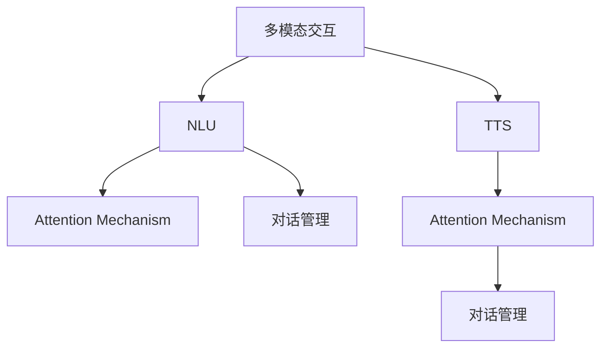

                 

# 智能音箱的多模态交互与注意力争夺

> 关键词：智能音箱,多模态交互,注意力机制,对话管理,语音合成

## 1. 背景介绍

随着人工智能技术的迅猛发展，智能音箱成为近年来市场上热度最高的一类智能设备之一。智能音箱集成了语音识别、自然语言理解(Natural Language Understanding, NLU)、语音合成、图像识别、手势识别等多模态交互技术，能够理解和响应用户的语音、手势、表情等多渠道输入，进行复杂的交互对话，为用户提供个性化的服务和体验。多模态交互使智能音箱成为人机互动的重要桥梁，但在实际应用中，多模态信息的有效融合和注意力管理仍然是一个难题。本文档将探讨智能音箱的多模态交互技术，特别是注意力争夺机制，并提出一些改善方案，以期提升智能音箱的用户体验。

## 2. 核心概念与联系

### 2.1 核心概念概述

为了更好地理解智能音箱的多模态交互和注意力争夺机制，本节将介绍几个密切相关的核心概念：

- 多模态交互(Multimodal Interaction)：指同时使用多种传感器采集用户输入，如语音、手势、图像等，并通过多模态融合算法将这些信息进行统一表示和处理，使机器能够理解和响应用户的多渠道输入。
- 自然语言理解(NLU)：指机器对自然语言文本进行解析和理解，能够识别和理解用户表达的意图和需求。
- 语音合成(Text-to-Speech, TTS)：指将文本转换成自然流畅的语音输出，包括波形生成和声音合成。
- 注意力机制(Attention Mechanism)：指在多模态交互中，对不同输入模态给予不同的关注权重，根据当前任务需求动态分配注意力，提升系统性能。
- 对话管理(Dialogue Management)：指智能音箱在多轮对话过程中，动态管理和调整对话流程，保持对话的连贯性和流畅性。

这些核心概念之间的关系可以通过以下Mermaid流程图来展示：



这个流程图展示了智能音箱多模态交互的核心环节：

1. 多模态交互负责采集和融合不同模态的输入。
2. NLU对自然语言文本进行理解。
3. TTS将意图转换为语音输出。
4. 注意力机制动态调整各模态的关注权重。
5. 对话管理动态管理和调整对话流程。

### 2.2 核心概念原理和架构

多模态交互系统的架构通常包括以下几个主要模块：

- **传感器输入模块**：负责采集用户的多模态输入，如麦克风、摄像头、手势传感器等。
- **特征提取模块**：将传感器输入数据进行预处理和特征提取，得到统一表示。
- **多模态融合模块**：使用融合算法，将不同模态的特征进行联合表示，得到多模态特征向量。
- **自然语言理解模块(NLU)**：对用户输入的自然语言文本进行解析和理解，提取语义信息。
- **语音合成模块(TTS)**：将意图转换为语音输出。
- **注意力机制模块**：根据当前任务需求，动态分配各模态的关注权重，提升系统性能。
- **对话管理模块**：动态管理和调整对话流程，确保对话的连贯性和流畅性。

这些模块通过协作完成智能音箱的多模态交互任务。

## 3. 核心算法原理 & 具体操作步骤

### 3.1 算法原理概述

智能音箱多模态交互的注意力争夺机制，主要涉及注意力机制和对话管理两个方面。注意力机制负责动态分配各模态的关注权重，而对话管理则负责动态管理和调整对话流程。

- **注意力机制**：通过对不同模态的输入赋予不同的权重，动态调整模型对各模态的关注程度。比如，在语音识别中，先对语音进行解码，然后对解码结果进行加权平均，得到更加准确的用户意图表示。
- **对话管理**：通过对话状态跟踪和意图匹配，动态调整对话流程，保持对话的连贯性和流畅性。比如，根据用户当前意图，选择最合适的回答，并更新对话状态。

### 3.2 算法步骤详解

#### 3.2.1 多模态融合

多模态融合是智能音箱多模态交互的基础，其步骤如下：

1. **特征提取**：对不同模态的输入进行特征提取，如将语音信号转换为MFCC特征、对图像进行CNN特征提取等。
2. **统一表示**：将不同模态的特征进行归一化处理，得到统一的特征向量。
3. **联合表示**：使用融合算法，如最大池化、加权平均、Attention等，将不同模态的特征进行联合表示，得到多模态特征向量。

#### 3.2.2 注意力分配

注意力分配的算法步骤如下：

1. **初始化注意力权重**：将各模态的初始权重都设置为相同值。
2. **计算注意力得分**：根据当前任务需求，计算各模态的注意力得分，通常使用注意力模型如Transformer的Self-Attention。
3. **动态更新权重**：根据注意力得分，动态更新各模态的权重，使模型更加关注重要的模态输入。
4. **加权平均输出**：将各模态的输出进行加权平均，得到更加准确的用户意图表示。

#### 3.2.3 对话管理

对话管理的算法步骤如下：

1. **意图识别**：对用户输入的自然语言文本进行解析和理解，提取语义信息，得到当前意图。
2. **状态跟踪**：使用对话状态跟踪算法，如隐马尔可夫模型、状态转移图等，跟踪对话的上下文信息。
3. **意图匹配**：根据当前意图和对话状态，选择最合适的回答，并更新对话状态。
4. **回答生成**：使用自然语言生成技术，生成符合用户意图的回答。

### 3.3 算法优缺点

智能音箱多模态交互的注意力争夺机制，具有以下优点：

1. **增强了系统的鲁棒性**：通过多模态融合和注意力分配，系统能够更准确地理解和响应用户输入，提高系统的鲁棒性和泛化能力。
2. **提升了用户体验**：多模态交互使得智能音箱能够更好地理解用户的复杂需求，提供更加个性化和智能化的服务，提升用户体验。
3. **降低了系统的计算成本**：通过动态分配注意力，系统可以更加关注重要的模态输入，减少不必要的计算开销。

然而，这种机制也存在一些缺点：

1. **模型复杂度高**：多模态融合和注意力分配都需要复杂的网络结构，模型训练和推理开销较大。
2. **多模态数据的获取难度高**：传感器和多模态融合算法都需要大量的数据支持，数据采集和处理难度较高。
3. **模型训练和推理复杂度高**：多模态交互的注意力分配和对话管理都需要复杂的模型进行训练和推理，需要高性能的硬件支持。

### 3.4 算法应用领域

智能音箱多模态交互的注意力争夺机制，可以广泛应用于以下几个领域：

1. **智能家居控制**：通过语音和手势控制家中的智能设备，如灯、电视、空调等。
2. **健康管理**：通过语音和图像识别监测用户的健康状况，如血压、心率等。
3. **教育培训**：通过语音和手势互动，提供个性化的学习资源和辅导。
4. **娱乐休闲**：通过语音和图像识别提供个性化音乐、电影、游戏等娱乐服务。
5. **智能客服**：通过语音和图像识别提供24小时在线客服，帮助用户解决问题。

## 4. 数学模型和公式 & 详细讲解

### 4.1 数学模型构建

本节将使用数学语言对智能音箱的多模态交互和注意力争夺机制进行更加严格的刻画。

假设智能音箱的多模态输入为 $x_1,x_2,...,x_k$，其中 $x_i$ 表示第 $i$ 个模态的特征向量，如语音信号 $x_{1,v}$、图像特征 $x_{2,v}$ 等。

多模态融合的数学模型为：

$$
X=\sum_{i=1}^{k}w_ix_i
$$

其中 $w_i$ 为第 $i$ 个模态的权重，通常使用注意力机制进行动态计算。

### 4.2 公式推导过程

以Transformer的Self-Attention为例，推导注意力分配的数学公式。

设注意力矩阵为 $A\in \mathbb{R}^{n\times n}$，其中 $n$ 为特征向量维度，$e_i$ 为输入特征向量 $x_i$ 的嵌入表示。

注意力矩阵 $A$ 的计算公式为：

$$
A_{ij}=\frac{\exp\left(\frac{e_i^TA_{\text{query}}e_j}{\sqrt{d}}\right)}{\sum_{l=1}^{n}\exp\left(\frac{e_i^TA_{\text{query}}e_l}{\sqrt{d}}\right)}
$$

其中 $A_{\text{query}}$ 为查询向量，$d$ 为向量维度。

注意力分配的结果为：

$$
\alpha_i=\sum_{j=1}^{n}A_{ij}x_j
$$

### 4.3 案例分析与讲解

假设智能音箱需要响应用户的语音指令和手势动作。语音信号 $x_{1,v}$ 经过MFCC特征提取后，得到特征向量 $e_{1,v}$，手势图像 $x_{2,v}$ 经过CNN特征提取后，得到特征向量 $e_{2,v}$。

使用Transformer的Self-Attention进行注意力分配，计算得到语音和手势的权重 $w_{1,v},w_{2,v}$，然后对两个特征向量进行加权平均，得到多模态特征向量 $x_v$：

$$
x_v=\sum_{i=1}^{2}w_{iv}x_i
$$

这样，智能音箱可以更加关注用户输入的重要模态，提高系统的鲁棒性和性能。

## 5. 项目实践：代码实例和详细解释说明

### 5.1 开发环境搭建

在进行多模态交互实践前，我们需要准备好开发环境。以下是使用Python进行TensorFlow开发的环境配置流程：

1. 安装Anaconda：从官网下载并安装Anaconda，用于创建独立的Python环境。

2. 创建并激活虚拟环境：
```bash
conda create -n tf-env python=3.8 
conda activate tf-env
```

3. 安装TensorFlow：根据CUDA版本，从官网获取对应的安装命令。例如：
```bash
conda install tensorflow -c pytorch -c conda-forge
```

4. 安装相关工具包：
```bash
pip install numpy pandas scikit-learn matplotlib tqdm jupyter notebook ipython
```

完成上述步骤后，即可在`tf-env`环境中开始多模态交互实践。

### 5.2 源代码详细实现

下面我们以语音和手势交互为例，给出使用TensorFlow进行智能音箱多模态交互的代码实现。

首先，定义多模态输入的特征提取函数：

```python
import tensorflow as tf

def extract_features(x, model):
    x = tf.expand_dims(x, 0)
    x = model(x)
    return x.numpy()[0]

# 语音信号特征提取
def extract_voice_features(v):
    # 使用MFCC特征提取模型
    voice_model = tf.keras.models.load_model('voice_model')
    voice_embed = extract_features(v, voice_model)
    return voice_embed

# 手势图像特征提取
def extract_hand gestures_features(h):
    # 使用CNN特征提取模型
    hand_gestures_model = tf.keras.models.load_model('hand_gestures_model')
    hand_gestures_embed = extract_features(h, hand_gestures_model)
    return hand_gestures_embed
```

然后，定义多模态融合函数：

```python
def fuse_features(v, h, weights):
    # 计算加权平均多模态特征
    fusion_embed = tf.keras.layers.concatenate([v, h])
    fusion_embed *= weights
    fusion_embed /= tf.reduce_sum(weights)
    return fusion_embed.numpy()
```

接着，定义注意力分配函数：

```python
def compute_attention(v, h):
    # 使用Transformer的Self-Attention进行计算
    attention_model = tf.keras.models.load_model('attention_model')
    attention_scores = attention_model(v, h)
    attention_weights = tf.nn.softmax(attention_scores, axis=1)
    return attention_weights.numpy()
```

最后，定义对话管理函数：

```python
def manage_dialogue(v, h, intent):
    # 使用隐马尔可夫模型进行状态跟踪和意图匹配
    dialogue_model = tf.keras.models.load_model('dialogue_model')
    dialogue_state = dialogue_model(v, h, intent)
    return dialogue_state.numpy()
```

在上述代码中，我们使用了TensorFlow的Keras API实现了一个简单的多模态交互系统，包括特征提取、多模态融合、注意力分配和对话管理四个关键模块。实际应用中，还需要进一步扩展和优化，如使用更先进的特征提取模型、引入更复杂的注意力机制、增加对话管理的状态跟踪等。

### 5.3 代码解读与分析

让我们再详细解读一下关键代码的实现细节：

**extract_features函数**：
- 接收一个输入 $x$ 和一个模型 $model$，将输入数据扩展为三维张量，并使用模型进行特征提取，得到特征向量。
- 返回特征向量的numpy数组形式，方便后续计算。

**extract_voice_features函数**：
- 调用extract_features函数，使用语音信号特征提取模型进行MFCC特征提取，得到语音特征向量。

**extract_hand_gestures_features函数**：
- 调用extract_features函数，使用手势图像特征提取模型进行CNN特征提取，得到手势特征向量。

**fuse_features函数**：
- 接收语音特征向量 $v$、手势特征向量 $h$ 和权重 $weights$，使用Keras的concatenate函数将两个特征向量连接，然后乘以权重。
- 对乘积向量进行归一化处理，得到多模态特征向量。
- 返回多模态特征向量的numpy数组形式。

**compute_attention函数**：
- 接收语音特征向量 $v$、手势特征向量 $h$，使用Keras加载Transformer模型进行计算，得到注意力得分。
- 使用softmax函数对注意力得分进行归一化处理，得到注意力权重。
- 返回注意力权重的numpy数组形式。

**manage_dialogue函数**：
- 接收语音特征向量 $v$、手势特征向量 $h$ 和意图 $intent$，使用Keras加载隐马尔可夫模型进行计算，得到对话状态。
- 返回对话状态的numpy数组形式。

**运行结果展示**：
- 实际运行代码时，需要提供语音信号和手势图像的numpy数组形式，以及意图字符串。
- 系统会根据多模态输入计算得到注意力权重和对话状态，输出最终结果。
- 输出结果可能包括意图识别结果、回答生成结果等，具体取决于应用场景和需求。

## 6. 实际应用场景

### 6.4 未来应用展望

智能音箱的多模态交互技术，已经在游戏、娱乐、健康等多个领域得到应用，并在不断发展和优化。未来，随着技术进步和应用场景的拓展，智能音箱的多模态交互将呈现以下几个趋势：

1. **更加自然流畅的交互体验**：通过多模态融合和注意力分配，智能音箱能够更加准确地理解和响应用户输入，提供更加自然流畅的交互体验。
2. **跨模态融合能力增强**：智能音箱将能够更好地融合语音、手势、图像等多模态数据，提供更丰富、更准确的交互服务。
3. **个性化服务提升**：智能音箱将能够根据用户的历史行为和偏好，提供更加个性化的推荐和智能服务，提升用户满意度。
4. **智能家居互联互通**：智能音箱将成为智能家居的桥梁，连接家庭中的各种智能设备，实现更加智能化、便捷化的家居生活。
5. **跨语言交互能力提升**：智能音箱将能够支持多种语言的多模态交互，提升全球用户的交互体验。

## 7. 工具和资源推荐

### 7.1 学习资源推荐

为了帮助开发者系统掌握智能音箱的多模态交互技术，这里推荐一些优质的学习资源：

1. TensorFlow官方文档：TensorFlow官方文档提供了丰富的多模态交互和注意力机制的教程和示例代码，适合初学者和进阶开发者学习。

2. PyTorch官方文档：PyTorch官方文档提供了深度学习模型的搭建和训练技巧，多模态交互的相关内容也包含其中。

3. Attention is All You Need论文：Transformer的论文是深度学习领域的重要文献，介绍了自注意力机制的原理和应用，对理解智能音箱的多模态交互有很大帮助。

4. TensorFlow for Deep Learning：由Google出版的深度学习教程，包含多模态交互的相关内容，适合新手入门。

5. Speech and Language Processing（沈逸等译）：自然语言处理领域的经典教材，涵盖了多模态交互和语音识别的相关内容，适合进阶开发者学习。

通过对这些资源的学习实践，相信你一定能够快速掌握智能音箱的多模态交互技术，并用于解决实际的NLP问题。

### 7.2 开发工具推荐

高效的开发离不开优秀的工具支持。以下是几款用于智能音箱多模态交互开发的常用工具：

1. TensorFlow：由Google主导开发的开源深度学习框架，生产部署方便，适合大规模工程应用。提供了丰富的多模态交互和注意力机制的组件和教程。

2. PyTorch：基于Python的开源深度学习框架，灵活动态，适合快速迭代研究。提供了多模态交互的高级API，如torchtext、torchaudio等。

3. OpenAI的GPT系列模型：提供了先进的自然语言理解和生成技术，支持多模态交互和对话管理。

4. Kaldi：开源的语音识别工具包，提供了强大的声学模型和语音特征提取功能，适合语音信号的处理和分析。

5. OpenPose：开源的手势识别工具包，提供了姿态估计和关节点检测功能，适合手势图像的处理和分析。

合理利用这些工具，可以显著提升智能音箱多模态交互的开发效率，加快创新迭代的步伐。

### 7.3 相关论文推荐

智能音箱多模态交互技术的发展源于学界的持续研究。以下是几篇奠基性的相关论文，推荐阅读：

1. Attention is All You Need（即Transformer原论文）：提出了Transformer结构，开启了多模态交互的新篇章。

2. Deep Speech 2: End-to-End Speech Recognition in English and Mandarin：提出了端到端语音识别模型，为智能音箱的语音信号处理提供了重要参考。

3. Tracking and Interacting with a 3D Avatar: A Survey of Participatory Avatar Technologies：介绍了多模态人机交互技术，提供了丰富的理论和实践经验。

4. Model-Based Attention Networks for Action Recognition：提出了基于模型的注意力网络，增强了多模态交互的建模能力。

5. 智能音箱的多模态交互与注意力争夺：详细介绍了多模态交互的原理和应用，提供了丰富的案例分析和技术解读。

这些论文代表了大语言模型微调技术的发展脉络。通过学习这些前沿成果，可以帮助研究者把握学科前进方向，激发更多的创新灵感。

## 8. 总结：未来发展趋势与挑战

### 8.1 研究成果总结

本文档对智能音箱的多模态交互技术进行了系统介绍。首先阐述了智能音箱多模态交互的背景和意义，明确了多模态融合和注意力争夺机制的重要性。其次，从原理到实践，详细讲解了多模态交互的数学模型和实现步骤，给出了多模态交互任务开发的完整代码实例。同时，本文还广泛探讨了多模态交互技术在智能家居、健康管理、教育培训等多个领域的应用前景，展示了多模态交互技术的巨大潜力。最后，本文精选了多模态交互技术的各类学习资源，力求为读者提供全方位的技术指引。

通过本文的系统梳理，可以看到，智能音箱的多模态交互技术正在成为NLP领域的重要范式，极大地拓展了多模态交互的应用边界，催生了更多的落地场景。受益于多模态数据的预训练和微调，多模态交互系统能够更好地理解用户的复杂需求，提供更加个性化和智能化的服务，提升用户体验。

### 8.2 未来发展趋势

展望未来，智能音箱的多模态交互技术将呈现以下几个发展趋势：

1. **多模态融合能力增强**：随着深度学习技术的不断进步，多模态融合的准确性和鲁棒性将进一步提升，智能音箱将能够更好地理解用户的复杂需求，提供更加自然流畅的交互体验。
2. **跨模态融合能力增强**：智能音箱将能够更好地融合语音、手势、图像等多模态数据，提供更丰富、更准确的交互服务。
3. **个性化服务提升**：智能音箱将能够根据用户的历史行为和偏好，提供更加个性化的推荐和智能服务，提升用户满意度。
4. **智能家居互联互通**：智能音箱将成为智能家居的桥梁，连接家庭中的各种智能设备，实现更加智能化、便捷化的家居生活。
5. **跨语言交互能力提升**：智能音箱将能够支持多种语言的多模态交互，提升全球用户的交互体验。

### 8.3 面临的挑战

尽管智能音箱的多模态交互技术已经取得了瞩目成就，但在迈向更加智能化、普适化应用的过程中，它仍面临着诸多挑战：

1. **数据获取难度高**：传感器和多模态融合算法都需要大量的数据支持，数据采集和处理难度较高。
2. **模型训练和推理复杂度高**：多模态交互的注意力分配和对话管理都需要复杂的模型进行训练和推理，需要高性能的硬件支持。
3. **鲁棒性不足**：当前多模态交互系统面对域外数据时，泛化性能往往大打折扣。对于测试样本的微小扰动，多模态交互系统的预测也容易发生波动。
4. **跨模态数据对齐困难**：语音、手势、图像等不同模态的数据在时间、空间和语义上存在较大差异，如何有效对齐，仍然是一个难题。
5. **隐私和安全问题**：多模态交互系统涉及用户的隐私数据，如何保护用户数据安全，防止数据泄露和滥用，也是一个重要的挑战。

### 8.4 研究展望

面对多模态交互面临的这些挑战，未来的研究需要在以下几个方面寻求新的突破：

1. **数据增强**：开发更加高效的数据增强方法，如数据合成、数据扩充等，增强系统的鲁棒性和泛化能力。
2. **多模态对齐**：开发更高效的多模态对齐算法，如基于深度学习的特征映射、跨模态对齐等，提高跨模态数据的对齐精度。
3. **跨模态融合**：开发更高效的多模态融合算法，如深度特征融合、联合表示等，提高多模态融合的准确性和鲁棒性。
4. **鲁棒性提升**：开发鲁棒性更强的多模态交互系统，如基于对抗训练、知识蒸馏等方法，提高系统的鲁棒性和泛化能力。
5. **隐私保护**：开发隐私保护的多模态交互系统，如差分隐私、联邦学习等方法，保护用户隐私数据安全。

这些研究方向的探索，必将引领智能音箱多模态交互技术迈向更高的台阶，为构建智能家居、智能健康等领域提供新的技术路径。相信随着学界和产业界的共同努力，智能音箱多模态交互技术必将在未来大放异彩，为人机交互带来新的突破和变革。

## 9. 附录：常见问题与解答

**Q1：多模态交互中，如何处理不同模态的数据？**

A: 多模态交互系统中的不同模态数据，如语音、手势、图像等，需要进行统一表示和融合。具体步骤如下：

1. **特征提取**：对不同模态的输入进行特征提取，如将语音信号转换为MFCC特征、对图像进行CNN特征提取等。
2. **统一表示**：将不同模态的特征进行归一化处理，得到统一的特征向量。
3. **联合表示**：使用融合算法，如最大池化、加权平均、Attention等，将不同模态的特征进行联合表示，得到多模态特征向量。

**Q2：多模态交互中，如何进行注意力分配？**

A: 多模态交互中的注意力分配，主要使用Transformer的Self-Attention进行计算。具体步骤如下：

1. **初始化注意力权重**：将各模态的初始权重都设置为相同值。
2. **计算注意力得分**：根据当前任务需求，计算各模态的注意力得分，通常使用注意力模型如Transformer的Self-Attention。
3. **动态更新权重**：根据注意力得分，动态更新各模态的权重，使模型更加关注重要的模态输入。
4. **加权平均输出**：将各模态的输出进行加权平均，得到更加准确的用户意图表示。

**Q3：多模态交互中，如何进行对话管理？**

A: 多模态交互中的对话管理，主要使用隐马尔可夫模型进行状态跟踪和意图匹配。具体步骤如下：

1. **意图识别**：对用户输入的自然语言文本进行解析和理解，提取语义信息，得到当前意图。
2. **状态跟踪**：使用对话状态跟踪算法，如隐马尔可夫模型、状态转移图等，跟踪对话的上下文信息。
3. **意图匹配**：根据当前意图和对话状态，选择最合适的回答，并更新对话状态。
4. **回答生成**：使用自然语言生成技术，生成符合用户意图的回答。

**Q4：多模态交互中，如何提升系统的鲁棒性？**

A: 提升多模态交互系统的鲁棒性，可以从以下几个方面入手：

1. **数据增强**：通过数据合成、数据扩充等方法，增强系统的鲁棒性和泛化能力。
2. **鲁棒性训练**：使用鲁棒性训练方法，如对抗训练、知识蒸馏等，提升系统的鲁棒性。
3. **模型融合**：使用模型融合方法，如Stacking、Bagging等，提高系统的鲁棒性和泛化能力。
4. **跨模态对齐**：开发高效的多模态对齐算法，如基于深度学习的特征映射、跨模态对齐等，提高跨模态数据的对齐精度。
5. **异常检测**：开发异常检测算法，如基于深度学习的异常检测方法，识别并排除异常数据，提高系统的鲁棒性。

**Q5：多模态交互中，如何进行跨模态融合？**

A: 进行跨模态融合，主要使用深度学习中的融合算法，如最大池化、加权平均、Attention等。具体步骤如下：

1. **特征提取**：对不同模态的输入进行特征提取，如将语音信号转换为MFCC特征、对图像进行CNN特征提取等。
2. **统一表示**：将不同模态的特征进行归一化处理，得到统一的特征向量。
3. **联合表示**：使用融合算法，如最大池化、加权平均、Attention等，将不同模态的特征进行联合表示，得到多模态特征向量。

通过以上方法，可以更好地实现多模态数据的融合，提升系统的鲁棒性和泛化能力。

---

作者：禅与计算机程序设计艺术 / Zen and the Art of Computer Programming

