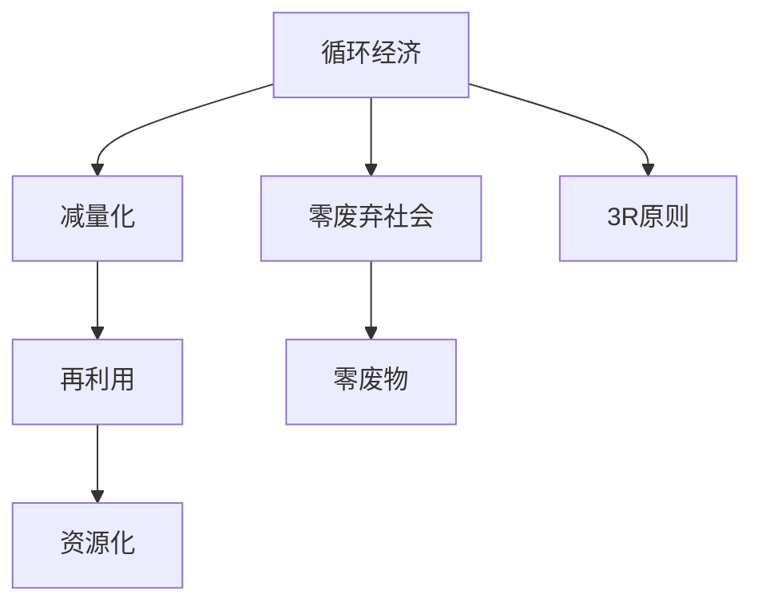

                 

# 未来的可持续发展：2050年的循环经济与零废弃社会

在科技迅猛发展的21世纪，人类面临着前所未有的挑战，包括气候变化、资源枯竭、环境污染等。这些全球性问题迫使我们重新思考现有的发展模式，探索一条可持续、和谐共生的道路。本文将围绕循环经济和零废弃社会两个核心概念，深入探讨其在2050年的未来愿景及其对社会的影响，并从技术、政策、公众意识等多角度剖析实现路径，展望其带来的变革性影响。

## 1. 背景介绍

### 1.1 问题由来

环境问题已经成为21世纪最为严峻的全球性挑战之一。传统的高污染、高消耗的工业化模式导致资源过度消耗和环境恶化，严重威胁到人类的生存和发展。为了应对这些挑战，循环经济和零废弃社会理念应运而生，旨在通过重新设计和优化生产与消费系统，实现资源的循环利用和高效利用，从而实现可持续发展的目标。

### 1.2 问题核心关键点

循环经济和零废弃社会强调资源的最大化利用，减少废物和污染，通过设计、生产和消费各个环节的优化，实现循环、减量和重用。其中，循环经济是以资源的高效利用为核心，通过延长产品生命周期、优化资源流动，实现经济、社会和环境的协调发展。而零废弃社会则是更加极端的概念，要求在生产、消费和回收过程中尽可能地消除废弃物，实现“零废物”的目标。

## 2. 核心概念与联系

### 2.1 核心概念概述

- **循环经济**：以资源的高效利用为核心，通过设计、生产和消费各个环节的优化，实现资源的最大化利用和循环利用，减少环境污染，促进可持续发展。
- **零废弃社会**：通过改变生产、消费和回收各个环节，实现尽可能少的废物产生，并尽可能地对废物进行再利用或回收处理，最终达到“零废物”的目标。
- **减量化、再利用、资源化**（3R原则）：循环经济和零废弃社会的核心原则，分别代表减少废物产生、再利用废弃物和资源化利用资源。

### 2.2 核心概念原理和架构的 Mermaid 流程图



这个流程图展示了循环经济和零废弃社会的基本结构：

- 从循环经济到零废弃社会，涵盖了减量化、再利用、资源化三大核心原则。
- 零废弃社会是循环经济的一个更高阶段，旨在实现“零废物”的目标。
- 3R原则是实现循环经济和零废弃社会的基石。

## 3. 核心算法原理 & 具体操作步骤

### 3.1 算法原理概述

循环经济和零废弃社会的核心算法原理是优化资源流动和消耗过程，以实现资源的最大化利用和废物的最小化产生。这涉及到设计、生产、消费、回收等多个环节的优化，其中数学模型和优化算法发挥了关键作用。

### 3.2 算法步骤详解

1. **需求分析**：通过对市场需求和资源状况的分析，确定优化目标和优化范围。
2. **建模**：建立资源流动和消耗的数学模型，描述生产、消费、回收等环节的资源流动关系。
3. **优化求解**：使用优化算法（如线性规划、动态规划等）对模型进行求解，找到最优的资源分配方案。
4. **评估与反馈**：评估优化方案的效果，收集反馈信息，进行模型修正和迭代优化。

### 3.3 算法优缺点

**优点**：
- 能够量化资源流动和消耗，提供科学依据进行优化。
- 能够通过数学模型评估不同方案的效果，选择最优方案。
- 可以处理大规模、复杂的系统，提供系统的整体解决方案。

**缺点**：
- 建模过程复杂，需要大量数据和专业知识。
- 优化过程可能面临非线性、不确定性等挑战，难以找到全局最优解。
- 模型中的假设和简化可能影响结果的准确性。

### 3.4 算法应用领域

循环经济和零废弃社会的算法原理广泛应用于能源、材料、制造、农业、建筑等各个领域。例如，在能源领域，通过优化能源的输入、转换和利用过程，实现能源的高效利用和废弃物的最小化；在材料领域，通过设计可循环利用材料，减少资源消耗和废弃物产生。

## 4. 数学模型和公式 & 详细讲解 & 举例说明

### 4.1 数学模型构建

在循环经济和零废弃社会中，数学模型通常包括以下几个部分：

- **资源流模型**：描述资源从输入到输出的整个过程，包括资源的采购、生产、消费、回收等环节。
- **需求模型**：根据市场和用户需求，确定资源的分配和使用方案。
- **环境影响模型**：评估资源流动对环境的影响，包括污染、能耗等。

### 4.2 公式推导过程

以一个简单的资源流模型为例，假设某工厂每年消耗A种资源，产出B种产品，其中部分产品A可回收再利用。可以建立如下线性规划模型：

$$
\begin{aligned}
& \text{目标函数：最小化} \sum_{i=1}^n c_i x_i \\
& \text{约束条件：} \\
& \quad A_i = a_i x_i + b_i y_i \\
& \quad \sum_{i=1}^m z_i = A \\
& \quad z_i \geq 0, x_i, y_i \geq 0
\end{aligned}
$$

其中，$c_i$为资源i的成本系数，$A_i$为资源i的消耗量，$x_i$为资源i的使用量，$y_i$为资源i的回收量，$z_i$为资源i的存储量，$A$为资源总量，$m$和$n$分别为资源和产品的种类数。

### 4.3 案例分析与讲解

假设某工厂每年消耗5000吨原料A，其中2000吨可用于回收再利用。根据上述模型，可以优化资源的使用和回收过程，最小化成本。通过求解该模型，可以得到最优的资源使用量和回收量，从而实现资源的高效利用。

## 5. 项目实践：代码实例和详细解释说明

### 5.1 开发环境搭建

在进行循环经济和零废弃社会的项目实践时，需要使用Python和相关的数学优化库，如PuLP、SciPy等。以下是一个简单的开发环境搭建流程：

1. 安装Python，确保版本为3.7及以上。
2. 安装PuLP库，使用以下命令：
   ```
   pip install pulp
   ```
3. 安装SciPy库，使用以下命令：
   ```
   pip install scipy
   ```

### 5.2 源代码详细实现

下面是一个简单的资源流模型优化代码实现，使用PuLP库：

```python
from pulp import LpProblem, LpVariable, lpSum

# 定义变量
x1, x2, y1 = LpVariable('x1', lowBound=0), LpVariable('x2', lowBound=0), LpVariable('y1', lowBound=0)

# 定义模型
prob = LpProblem('ResourceOptimization', 'Minimize')
prob.setObjective(lpSum(c1*x1 + c2*x2 + c3*y1))

# 定义约束条件
prob.addConstraint(x1 + x2 + y1 <= 5000)

# 解模型
prob.solve()

# 输出结果
print(f'最小成本为：{prob.objective.value()}, x1 = {x1.value()}, x2 = {x2.value()}, y1 = {y1.value()}')
```

### 5.3 代码解读与分析

上述代码实现了一个简单的资源流模型优化问题，目标是最小化总成本。通过定义变量和约束条件，使用PuLP库求解线性规划模型，并输出最优解。在实际应用中，需要根据具体问题调整变量和约束条件，以获得最优解。

### 5.4 运行结果展示

假设优化后的结果为最小成本为1000元，x1=2000，x2=3000，y1=1000，表示使用2000吨原料A，回收1000吨原料A，同时生产x2产品，消费x1产品，存储y1吨原料A。

## 6. 实际应用场景

### 6.1 智能制造

在智能制造领域，循环经济和零废弃社会通过优化生产流程，减少资源浪费，实现高效制造。例如，通过数据分析和预测，优化原材料的使用和生产计划，减少废品的产生，实现资源的最大化利用。

### 6.2 农业

在农业领域，循环经济和零废弃社会通过优化种植和养殖过程，减少化肥和农药的使用，提高作物和家畜的产量。例如，通过精量播种和精准施肥，减少资源的浪费，同时利用农业废弃物进行生物质能的转化，实现能源自给自足。

### 6.3 建筑

在建筑领域，循环经济和零废弃社会通过优化建筑设计和施工过程，减少资源的消耗和废弃物的产生。例如，使用可再生材料和节能设计，减少能源的消耗，同时将建筑废弃物进行回收再利用，实现零废弃目标。

## 7. 工具和资源推荐

### 7.1 学习资源推荐

1. **《循环经济理论与实践》**：一本全面介绍循环经济理论和方法的书籍，适合初学者和研究者阅读。
2. **《零废弃社会：实现可持续发展的路径》**：介绍零废弃社会的理念和实践案例，提供丰富的实例参考。
3. **Coursera的循环经济课程**：由英国帝国理工学院开设，提供系统的循环经济知识框架和实践技能。

### 7.2 开发工具推荐

1. **PuLP**：Python的线性规划库，支持大规模数学模型求解，适合优化问题求解。
2. **SciPy**：Python的科学计算库，提供丰富的数学函数和优化算法。
3. **MATLAB**：广泛用于数学建模和优化的工具，适合科研和工程应用。

### 7.3 相关论文推荐

1. **《循环经济与可持续发展：一种新型的经济模式》**：深入探讨循环经济的理论基础和实践应用。
2. **《零废弃社会的可行性分析》**：分析零废弃社会的可能性和实现路径。
3. **《基于循环经济的材料选择方法》**：提出基于循环经济的材料选择方法，优化材料设计和选择。

## 8. 总结：未来发展趋势与挑战

### 8.1 研究成果总结

循环经济和零废弃社会已经成为实现可持续发展的关键路径。通过优化资源流动和减少废物产生，实现经济、社会和环境的协调发展。目前，全球各国已经在这方面进行了积极的探索和实践，并取得了一定的成效。

### 8.2 未来发展趋势

1. **智能化和数字化**：利用大数据、人工智能等技术，进一步优化资源流动和废物处理过程，提高效率和精准度。
2. **跨领域融合**：循环经济和零废弃社会将与其他领域（如能源、交通、环境）深度融合，形成系统化的解决方案。
3. **政策支持和激励机制**：政府将进一步出台相关政策和激励措施，推动循环经济和零废弃社会的发展。

### 8.3 面临的挑战

1. **技术和经济障碍**：循环经济和零废弃社会需要大量的技术创新和资金投入，存在一定的技术和经济障碍。
2. **公众意识和行为**：公众对循环经济和零废弃社会的认识和参与度仍然较低，需要进一步提升公众意识。
3. **系统复杂性**：循环经济和零废弃社会涉及多个领域和环节，系统复杂性较高，难以进行整体优化。

### 8.4 研究展望

1. **技术创新**：进一步开发和优化循环经济和零废弃社会的技术和方法，提高效率和效果。
2. **跨学科研究**：与其他学科（如环境科学、能源科学、社会学等）进行深入合作，形成综合性解决方案。
3. **国际合作**：加强国际合作，共享技术和经验，共同推动全球可持续发展。

## 9. 附录：常见问题与解答

**Q1：循环经济和零废弃社会与传统的工业化模式有何不同？**

A: 循环经济和零废弃社会强调资源的最大化利用和废物的最小化产生，通过优化生产、消费和回收过程，实现经济、社会和环境的协调发展。与传统的工业化模式相比，循环经济和零废弃社会更加注重资源的高效利用和环境保护。

**Q2：如何评估循环经济和零废弃社会的效果？**

A: 评估循环经济和零废弃社会的效果可以从多个方面进行，包括资源的利用率、废物的产生量、环境影响等。具体方法包括：
- 建立资源流动和消耗的数学模型，通过优化求解找到最优方案。
- 收集和分析实际运行数据，评估模型的效果。
- 进行实地调查和监测，了解实施效果。

**Q3：循环经济和零废弃社会在实际应用中面临哪些挑战？**

A: 循环经济和零废弃社会在实际应用中面临的挑战包括：
- 技术和经济障碍：需要大量的技术创新和资金投入。
- 公众意识和行为：公众对循环经济和零废弃社会的认识和参与度较低。
- 系统复杂性：涉及多个领域和环节，系统复杂性较高，难以进行整体优化。

**Q4：循环经济和零废弃社会如何与其他领域结合？**

A: 循环经济和零废弃社会可以与其他领域进行深度融合，形成综合性解决方案，例如：
- 与能源领域结合，优化能源的生产和利用过程，实现能源的高效利用和废弃物的最小化。
- 与农业领域结合，优化种植和养殖过程，提高作物和家畜的产量，同时利用农业废弃物进行生物质能的转化。
- 与建筑领域结合，使用可再生材料和节能设计，减少能源的消耗，同时将建筑废弃物进行回收再利用。

**Q5：循环经济和零废弃社会在实施过程中需要注意哪些问题？**

A: 循环经济和零废弃社会在实施过程中需要注意以下问题：
- 确定合适的优化目标和范围，避免过度优化或不足优化。
- 建立完善的监测和评估机制，及时发现和解决问题。
- 加强公众教育，提升公众意识和参与度，形成良好的社会氛围。
- 与政府和相关部门合作，争取政策支持和资源投入。

---

作者：禅与计算机程序设计艺术 / Zen and the Art of Computer Programming

