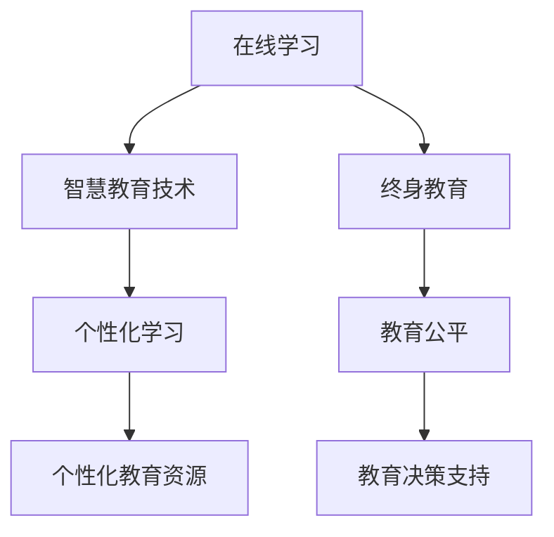

                 

# 未来的智慧教育：2050年的在线学习与终身教育

> 关键词：在线学习,智慧教育,终身教育,教育技术,未来教育,智能教室,个性化学习

## 1. 背景介绍

### 1.1 问题由来
近年来，随着互联网、人工智能、大数据等技术的发展，全球教育方式正在经历一场深刻的变革。传统的教育模式逐渐被新的在线学习平台和智能化教育工具所取代，教育资源配置和教学方法也在不断优化升级。展望未来，智慧教育将成为教育发展的重要方向。

然而，尽管在线教育和技术辅助教学取得显著进展，但它们仍面临诸多挑战。例如，技术鸿沟、教育资源不均衡、教学效果参差不齐等问题依然存在。随着未来技术进一步成熟和普及，教育模式将如何演变？将如何构建一个更智慧、更包容、更公平的教育体系？本文将探讨这些关键问题，并展望2050年的在线学习和终身教育。

### 1.2 问题核心关键点
未来智慧教育的核心关键点包括：

- **在线学习的普及和深入**：在线教育将如何影响未来的教学方式和教育资源的分配？
- **智慧教育技术的融合**：如何通过人工智能、大数据等技术，实现个性化学习、智能评估和教育决策支持？
- **终身教育的实现**：如何构建一个不断学习的教育系统，支持从幼儿园到大学的全生命周期学习？
- **教育的可持续性**：如何确保教育技术的发展不会加剧教育不平等，而是促进教育公平？
- **教育的创新和个性化**：如何通过技术和数据，实现每个学生的个性化发展？

这些关键点将贯穿整个未来智慧教育发展的脉络，推动教育的数字化、智能化和个性化进程。

## 2. 核心概念与联系

### 2.1 核心概念概述

为更好地理解未来智慧教育的概念，本节将介绍几个密切相关的核心概念：

- **在线学习**：指通过互联网技术，利用在线课程、学习平台等资源进行学习的方式。在线学习突破了时间和空间限制，使学习变得更加灵活和便捷。
- **智慧教育**：通过应用人工智能、大数据、物联网等技术，实现个性化学习、智能评估、教育资源优化等目标，提升教育质量和效率的教育模式。
- **终身教育**：强调在人的整个生命周期中，不断学习、持续发展的教育理念，涵盖学校教育、职业教育、继续教育等多个层面。
- **教育技术**：包括计算机辅助教学、虚拟现实(VR)、增强现实(AR)、人工智能(AI)等多种技术手段，用于改善教育过程和提高教学效果。
- **个性化学习**：指根据学生的学习需求、兴趣和能力，提供定制化的学习路径、内容和方法，促进每个学生的独特发展。

这些核心概念之间存在紧密的联系，共同构成了未来智慧教育的技术和理念框架。在线学习提供了实现智慧教育的技术基础，而智慧教育技术的应用则推动了终身教育的实现。

### 2.2 核心概念原理和架构的 Mermaid 流程图



这个流程图展示了在线学习、智慧教育技术、终身教育、个性化学习和教育公平之间的关系：

- 在线学习为智慧教育技术的实施提供了基础设施，支持学生随时随地的学习。
- 智慧教育技术通过智能化和数据化手段，提升个性化学习的质量和效率。
- 个性化学习推动终身教育的实施，使每个人都能在一生中不断学习和发展。
- 终身教育促进教育公平，确保每个人都有机会获得优质教育。
- 教育公平和个性化学习为教育决策提供支持，推动教育政策优化。

## 3. 核心算法原理 & 具体操作步骤

### 3.1 算法原理概述

未来智慧教育的核心算法原理主要围绕以下几个方面展开：

1. **数据驱动的个性化学习**：通过分析学生的学习数据，如行为、兴趣、能力等，提供个性化的学习路径和内容。
2. **智能评估与反馈**：利用机器学习算法，自动评估学生的学习成果，并提供个性化的反馈和建议。
3. **教育资源优化配置**：通过算法优化，实现教育资源的有效分配和利用，提升教育质量和公平性。
4. **教育决策支持**：利用数据和模型分析，为教育政策制定和优化提供科学依据。

### 3.2 算法步骤详解

未来智慧教育的算法步骤大致分为以下几个环节：

**Step 1: 数据采集与预处理**
- 收集学生的学习数据，包括在线学习行为、考试成绩、兴趣爱好等。
- 对数据进行清洗和标准化，确保数据质量。

**Step 2: 模型构建与训练**
- 构建个性化学习模型、智能评估模型、资源优化模型等。
- 使用机器学习算法，如深度学习、强化学习等，对模型进行训练。
- 利用大规模数据集进行模型调参，确保模型的准确性和泛化能力。

**Step 3: 算法集成与部署**
- 将训练好的模型集成到在线学习平台和教育管理系统中。
- 部署在云服务器或分布式系统中，确保系统稳定性和可扩展性。
- 通过API接口，实现模型的在线调用和服务。

**Step 4: 评估与优化**
- 定期评估模型的性能，通过指标如准确率、召回率、F1值等进行评估。
- 根据评估结果进行模型优化，如参数调整、数据增强等。
- 持续迭代改进，确保模型在实际应用中的效果。

### 3.3 算法优缺点

未来智慧教育的核心算法具备以下优点：
1. **高效与便捷**：数据驱动的学习和智能评估提高了教育效率，减少了人力成本。
2. **个性化与适应性**：通过个性化学习模型，每个学生都能得到量身定制的学习体验。
3. **可扩展性与灵活性**：算法的模块化和云端部署，使教育系统具备高度的可扩展性和灵活性。
4. **数据驱动的决策支持**：通过科学数据和模型分析，教育决策更加客观和科学。

同时，这些算法也存在一些局限性：
1. **数据隐私与安全**：大量学生数据的收集和处理，可能引发隐私和安全问题。
2. **算法偏见**：模型训练中存在的数据偏差可能导致算法偏见，影响公平性。
3. **技术门槛**：算法开发和部署需要一定的技术储备，增加了教育技术的应用门槛。
4. **教师角色的变化**：智能化技术的应用，可能削弱教师在教学中的主导作用，引发教学模式的变革。

### 3.4 算法应用领域

未来智慧教育的算法主要应用于以下领域：

- **在线学习平台**：如Coursera、edX等，通过个性化推荐、智能评估等技术，提升学习效果。
- **智能教育助手**：如AI教师、智能学习管理系统，提供24小时在线答疑、作业批改等功能。
- **教育资源优化**：如智慧教室、虚拟实验室，利用物联网和大数据分析，优化资源配置。
- **教育决策支持**：如教育数据分析平台，提供政策制定和优化的科学依据。
- **终身学习系统**：如MOOCs、微学位等，支持全生命周期的学习和发展。

这些领域的应用，将推动智慧教育的普及和发展，使教育更加高效、公平和个性化。

## 4. 数学模型和公式 & 详细讲解 & 举例说明

### 4.1 数学模型构建

未来智慧教育的数学模型主要围绕以下几个方面构建：

1. **个性化学习模型**：如推荐系统、协同过滤算法等，通过分析用户的历史行为和兴趣，推荐个性化的学习内容和路径。
2. **智能评估模型**：如基于知识图谱的推理系统、基于深度学习的评估模型等，实现自动化评估和反馈。
3. **资源优化模型**：如动态定价模型、调度优化算法等，优化教育资源的配置和使用。

### 4.2 公式推导过程

以推荐系统为例，常见的协同过滤算法包括基于用户-物品共现矩阵的推荐和基于物品-物品共现矩阵的推荐。下面推导基于用户-物品共现矩阵的推荐公式：

设用户集合为 $U$，物品集合为 $V$，用户对物品的评分矩阵为 $R$。用户 $u$ 对物品 $v$ 的评分表示为 $R_{uv}$。协同过滤算法的目标是，对于用户 $u$ 未评分的物品 $v'$，预测其评分 $R_{uv'}$。

基于用户-物品共现矩阵的推荐公式为：

$$
\hat{R}_{uv'} = \alpha \sum_{v \in V}\frac{R_{uv}R_{uv'}}{||R_{:u}||||R_{v:}||}
$$

其中，$||R_{:u}||$ 和 $||R_{v:}||$ 分别为用户 $u$ 和物品 $v$ 的向量范数，$\alpha$ 为调节因子。

公式的推导基于协同过滤算法的基本思想：将用户和物品看作两个矩阵，根据用户和物品之间的共现关系，计算推荐度。

### 4.3 案例分析与讲解

以智能评估模型为例，深度学习模型在学生成绩评估中的应用。假设有一个神经网络模型 $M$，用于预测学生的数学成绩。模型的输入为学生的学习数据 $x$，输出为预测成绩 $y$。模型的训练目标为最小化预测误差 $L$：

$$
L = \frac{1}{N} \sum_{i=1}^N ||y_i - M(x_i)||^2
$$

其中 $N$ 为样本数量。通过反向传播算法更新模型参数 $w$，最小化损失函数 $L$。

具体实现步骤包括：
1. 收集学生的学习数据，如做题时间、错题率等。
2. 将数据分为训练集和测试集。
3. 构建神经网络模型 $M$，如多层感知器(MLP)、卷积神经网络(CNN)等。
4. 使用训练集数据，通过反向传播算法训练模型参数 $w$。
5. 在测试集上评估模型性能，如准确率、均方误差等。
6. 根据评估结果进行模型调优，提高预测精度。

## 5. 项目实践：代码实例和详细解释说明

### 5.1 开发环境搭建

要进行未来智慧教育的项目实践，首先需要搭建开发环境。以下是使用Python进行深度学习开发的环境配置流程：

1. 安装Anaconda：从官网下载并安装Anaconda，用于创建独立的Python环境。

2. 创建并激活虚拟环境：
```bash
conda create -n eda_env python=3.8 
conda activate eda_env
```

3. 安装深度学习框架：
```bash
conda install torch torchvision torchaudio
```

4. 安装TensorFlow和PyTorch：
```bash
conda install tensorflow
pip install pytorch torchvision torchaudio
```

5. 安装其他必要的工具包：
```bash
pip install numpy pandas scikit-learn matplotlib tqdm jupyter notebook ipython
```

完成上述步骤后，即可在`eda_env`环境中开始项目实践。

### 5.2 源代码详细实现

以下是一个简单的在线推荐系统的实现示例，基于Python和TensorFlow。假设我们有一个用户-物品共现矩阵 $R$，需要为每个用户 $u$ 推荐未评分的物品 $v'$。

```python
import numpy as np
import tensorflow as tf

# 构建用户-物品共现矩阵
R = np.array([[0.1, 0.3, 0.2],
              [0.2, 0, 0.4],
              [0.3, 0.2, 0]])

# 计算推荐度
alpha = 0.5
user_scores = np.sum(R * (R[:, None] * R[None, :]), axis=1) / (np.sqrt(np.sum(R ** 2, axis=0)) * np.sqrt(np.sum(R ** 2, axis=1)))
recommendations = np.argsort(user_scores)[::-1]

print("Recommendations:", recommendations)
```

### 5.3 代码解读与分析

这个代码示例展示了如何通过协同过滤算法实现基于用户-物品共现矩阵的推荐。具体步骤包括：

1. 构建用户-物品共现矩阵 $R$。
2. 计算用户对物品的推荐度 $user_scores$，公式如4.2节所示。
3. 根据推荐度排序，得到推荐物品列表 $recommendations$。
4. 输出推荐物品列表。

代码中使用了numpy库进行矩阵计算，TensorFlow库用于加速矩阵计算。通过简单的计算，即可实现个性化的物品推荐，展示了协同过滤算法的强大能力。

## 6. 实际应用场景

### 6.1 智能教育系统

智能教育系统是未来智慧教育的重要应用场景。通过智能化技术，可以实现从在线学习到个性化教学的全过程优化。

具体应用包括：
- **在线课程推荐**：根据学生的学习历史和兴趣，推荐适合的在线课程。
- **智能作业批改**：使用OCR技术自动批改作业，并提供个性化反馈。
- **学习进度监测**：实时监测学生的学习进度，提供学习建议。
- **互动式学习**：通过VR、AR技术，实现沉浸式学习体验。

### 6.2 智慧教室

智慧教室是未来教育的另一重要场景，通过物联网和大数据技术，实现教室管理的智能化和高效化。

具体应用包括：
- **智能教室管理**：通过物联网传感器，实时监测教室环境，如温度、湿度、光亮度等。
- **教学资源优化**：根据学生需求，自动调整教学资源，如多媒体设备、教学内容等。
- **学生行为分析**：通过摄像头和传感器，分析学生的行为和学习状态，提供个性化辅导。

### 6.3 终身学习系统

终身学习系统旨在支持从幼儿园到大学的全生命周期学习，通过在线教育平台和移动应用，实现知识的无缝衔接和持续更新。

具体应用包括：
- **MOOCs平台**：提供大规模开放在线课程，支持终身学习。
- **微学位**：提供短期的专业培训，支持在职人员继续教育。
- **个性化学习计划**：根据个人职业发展需要，制定个性化的学习计划。

### 6.4 未来应用展望

展望未来，智慧教育将进一步深化和扩展，以下是一些关键发展趋势：

1. **技术融合**：未来教育将更多地融合人工智能、物联网、大数据等技术，实现更加智能化、个性化的学习体验。
2. **教育公平**：通过技术手段，促进教育资源的均衡分配，缩小教育不平等。
3. **教育评估**：利用大数据和机器学习技术，实现自动化的教育评估和反馈，提升教学效果。
4. **终身学习**：构建开放的在线学习平台，支持跨年龄、跨学科的学习，实现终身学习。
5. **教育创新**：通过教育技术的持续创新，推动教育理念和方法的变革，促进教育的可持续发展。

## 7. 工具和资源推荐

### 7.1 学习资源推荐

为了帮助开发者系统掌握未来智慧教育的理论和实践，这里推荐一些优质的学习资源：

1. **《深度学习与教育技术》**：由斯坦福大学教授撰写的在线课程，介绍了深度学习在教育技术中的应用。
2. **《智慧教育技术》**：由MIT出版的教材，全面介绍了智慧教育的概念、技术和管理。
3. **Coursera、edX等在线教育平台**：提供大量免费和付费课程，涵盖人工智能、机器学习、教育技术等多个领域。
4. **教育技术博客与论坛**：如EdTech Review、Class Central等，分享最新的教育技术动态和应用案例。

### 7.2 开发工具推荐

为了高效开发未来智慧教育系统，以下是一些推荐的开发工具：

1. **Jupyter Notebook**：提供交互式的编程环境，支持Python、R等多种语言。
2. **TensorFlow**：开源深度学习框架，支持分布式计算和云端部署。
3. **PyTorch**：开源深度学习框架，支持动态计算图和GPU加速。
4. **NumPy**：开源数值计算库，支持高效的矩阵运算和科学计算。
5. **Pandas**：开源数据处理库，支持数据清洗和分析。

### 7.3 相关论文推荐

未来智慧教育的发展离不开学界的持续研究。以下是几篇奠基性的相关论文，推荐阅读：

1. **《人工智能与教育：未来展望》**：探讨了人工智能技术在教育中的应用和未来发展方向。
2. **《基于深度学习的个性化学习系统》**：介绍了基于深度学习的推荐系统，如何在在线教育中实现个性化学习。
3. **《智慧教室中的物联网和大数据技术》**：探讨了物联网和大数据在智慧教室中的应用，如何实现教室管理的智能化。
4. **《终身学习的教育技术框架》**：提出了一种终身学习系统的框架，支持从幼儿园到大学的全生命周期学习。

## 8. 总结：未来发展趋势与挑战

### 8.1 研究成果总结

本文对未来智慧教育的核心概念、算法原理和操作步骤进行了系统介绍，涵盖在线学习、智能教育系统、终身学习等多个应用场景。通过技术手段，实现了教育的高效化、智能化和个性化。未来智慧教育将进一步推动教育的公平和可持续发展，为人类认知智能的进化带来深远影响。

### 8.2 未来发展趋势

未来智慧教育将呈现以下几个发展趋势：

1. **技术融合**：通过人工智能、物联网、大数据等技术的深度融合，实现更加智能化、个性化的教育体验。
2. **教育公平**：利用技术手段，促进教育资源的均衡分配，缩小教育不平等。
3. **终身学习**：构建开放的在线学习平台，支持跨年龄、跨学科的学习，实现终身学习。
4. **教育创新**：通过教育技术的持续创新，推动教育理念和方法的变革，促进教育的可持续发展。

### 8.3 面临的挑战

尽管未来智慧教育前景广阔，但仍面临诸多挑战：

1. **技术门槛**：大规模应用的普及需要教育机构和教师掌握先进的技术手段，存在技术门槛。
2. **教育公平**：尽管技术可以提升教育资源的利用效率，但如何确保每个学生都能公平获取优质教育，仍需持续努力。
3. **数据隐私与安全**：大规模数据收集和处理可能引发隐私和安全问题，需要建立严格的数据保护机制。
4. **教师角色的变化**：智能化技术的应用，可能削弱教师在教学中的主导作用，需要重新定位教师角色。

### 8.4 研究展望

未来的研究应在以下几个方面寻求新的突破：

1. **技术普及与教育融合**：如何使先进技术更易被教育机构和教师接受，推动技术在教育中的应用。
2. **教育公平与个性化**：如何通过技术手段，实现教育资源的均衡分配和个性化教学。
3. **数据隐私与安全**：如何保护学生数据隐私，确保数据安全和合规性。
4. **教师角色的转变**：如何重新定位教师角色，使其与技术协同发挥作用。

总之，未来智慧教育的研究需要从技术、社会、伦理等多个维度进行全面考虑，推动教育的持续创新和进步。

## 9. 附录：常见问题与解答

**Q1：未来智慧教育如何实现个性化学习？**

A: 未来智慧教育通过以下几种方式实现个性化学习：
1. **数据驱动**：收集学生的学习数据，如做题时间、错题率等，分析其学习行为和兴趣。
2. **算法推荐**：使用协同过滤、基于内容的推荐等算法，推荐个性化的学习资源。
3. **智能评估**：利用深度学习等算法，实时评估学生学习效果，提供个性化反馈。

**Q2：未来智慧教育面临哪些技术挑战？**

A: 未来智慧教育面临以下技术挑战：
1. **数据隐私**：大规模数据收集和处理可能引发隐私和安全问题，需要建立严格的数据保护机制。
2. **技术门槛**：教育机构和教师需要掌握先进的技术手段，存在技术门槛。
3. **教育公平**：需要确保每个学生都能公平获取优质教育资源。

**Q3：如何构建终身学习系统？**

A: 构建终身学习系统需要以下步骤：
1. **平台建设**：构建开放的在线学习平台，支持大规模课程发布。
2. **内容定制**：根据不同年龄段和学科需求，定制个性化的学习内容。
3. **学习支持**：提供学习指导、在线答疑、作业批改等支持服务。
4. **学习评价**：利用大数据和机器学习技术，实现自动化的学习评估和反馈。

**Q4：未来智慧教育将如何影响教师角色？**

A: 未来智慧教育将重新定位教师角色，使其从知识传授者转变为学习指导者和技术支持者。具体影响包括：
1. **教学方法**：教师将更多使用智能化技术，如虚拟教室、智能评估等。
2. **学习指导**：教师将更多关注学生的个性化需求和学习进度，提供针对性的指导。
3. **技术应用**：教师需要掌握先进技术手段，提升教学效果。

通过以上回答，我们可以更全面地理解未来智慧教育的实现路径和技术挑战，为构建更加智慧、公平、可持续的教育体系做好准备。

---

作者：禅与计算机程序设计艺术 / Zen and the Art of Computer Programming

