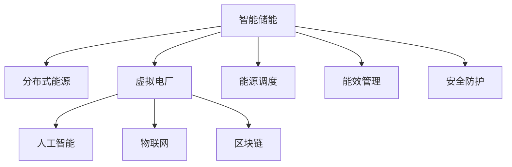

                 

# 未来的智慧能源：2050年的智能储能与虚拟电厂

> 关键词：智能储能,虚拟电厂,分布式能源,人工智能,物联网,区块链

## 1. 背景介绍

### 1.1 问题由来
近年来，随着可再生能源的快速发展，如何高效、可靠地存储与调度这些波动性能源成为了能源领域面临的重要挑战。传统的集中式储能系统存在响应速度慢、灵活性差等问题，难以适应分布式、随机性的可再生能源输出。同时，随着用户侧分布式能源的普及，如何有效整合这些资源，提升整体系统效率，也是当前亟待解决的难题。

### 1.2 问题核心关键点
面对这一挑战，智能储能与虚拟电厂的概念应运而生。智能储能通过先进的技术手段，实现储能系统的智能化、高效化，最大化利用能源。虚拟电厂则通过数字孪生技术，构建虚拟模型，实现分布式能源的集中控制和优化调度，提升系统整体性能。

本文聚焦于2050年智能储能与虚拟电厂的未来发展趋势，探讨其在能源系统中的重要角色和作用，以及对能源结构的深远影响。

### 1.3 问题研究意义
智能储能与虚拟电厂的融合，将彻底改变传统能源管理方式，提升能源系统的智能化水平和效率。其研究意义在于：

1. 推动能源系统向低碳、绿色转型。通过智能储能与虚拟电厂，可以有效平衡可再生能源与负荷的需求，提升能源利用率。
2. 提升能源系统安全性和稳定性。智能储能与虚拟电厂的分布式控制，可以有效应对突发事件，提升系统的抗风险能力。
3. 降低能源成本。通过优化能源调度，减少能源浪费，降低系统运营成本。
4. 促进能源市场的开放与公平竞争。虚拟电厂的虚拟市场，可以为分布式能源提供公平竞争的平台。
5. 推动能源技术的创新发展。智能储能与虚拟电厂的深度融合，将推动相关技术不断创新，引领行业发展。

## 2. 核心概念与联系

### 2.1 核心概念概述

为更好地理解智能储能与虚拟电厂的未来发展，本节将介绍几个密切相关的核心概念：

- 智能储能：指通过先进的技术手段，实现储能系统的智能化、高效化，最大化利用能源的过程。
- 虚拟电厂：通过数字孪生技术，构建虚拟模型，实现分布式能源的集中控制和优化调度，提升系统整体性能。
- 分布式能源(Distributed Energy Resources, DERs)：指在用户侧分布的小型发电设施，如太阳能、风能、储能电池等。
- 人工智能(Artificial Intelligence, AI)：指模拟人类智能行为的技术，包括机器学习、深度学习、自然语言处理等。
- 物联网(IoT)：指通过网络技术实现设备之间的互联互通，实现数据的实时采集与处理。
- 区块链(Blockchain)：指去中心化的分布式账本技术，具有不可篡改、透明等特点，可以保障数据安全和交易可信性。

这些核心概念之间的逻辑关系可以通过以下Mermaid流程图来展示：



这个流程图展示了几者的核心概念及其之间的联系：

1. 智能储能通过分布式能源获取能量，通过人工智能和物联网实现高效能管理。
2. 虚拟电厂构建虚拟模型，利用人工智能和区块链实现分布式能源的集中优化调度。
3. 智能储能与虚拟电厂通过能效管理和安全防护，提升能源系统效率和安全性。

## 3. 核心算法原理 & 具体操作步骤
### 3.1 算法原理概述

智能储能与虚拟电厂的融合，本质上是一个复杂的多目标优化问题。其核心思想是通过先进的数据分析与算法，实现对能源系统的最优控制和调度，提升整体系统性能。

形式化地，假设智能储能与虚拟电厂系统包含 $N$ 个分布式能源设施，目标最小化总运行成本 $C$，最大化系统可靠性 $R$，约束条件为能源供需平衡 $S$ 和设备容量限制 $L$。则优化问题可以表示为：

$$
\begin{aligned}
& \min_{x_1,...,x_N} C(x_1,...,x_N) \\
& \text{s.t.} \\
& R(x_1,...,x_N) \geq R_{\text{min}} \\
& S(x_1,...,x_N) = 0 \\
& L(x_1,...,x_N) \leq L_{\text{max}}
\end{aligned}
$$

其中 $x_1,...,x_N$ 表示各分布式能源设施的输出，$C(x_1,...,x_N)$ 表示总运行成本，$R(x_1,...,x_N)$ 表示系统可靠性，$S(x_1,...,x_N)$ 表示能源供需平衡，$L(x_1,...,x_N)$ 表示设备容量限制。

智能储能与虚拟电厂的优化调度问题具有多目标、非线性的特点，通常使用多目标优化算法进行求解。

### 3.2 算法步骤详解

智能储能与虚拟电厂的融合优化，一般包括以下几个关键步骤：

**Step 1: 数据采集与预处理**
- 通过物联网技术，实时采集各分布式能源设施的运行状态、输出参数等信息，存储到中央数据库。
- 对采集到的数据进行清洗、去噪、标准化等预处理操作，确保数据的准确性和一致性。

**Step 2: 模型构建与训练**
- 根据具体应用场景，设计合适的优化模型，如基于遗传算法、粒子群算法、深度强化学习等。
- 在训练集上进行模型训练，调整模型参数以匹配实际问题，确保模型的泛化能力。

**Step 3: 动态调度与控制**
- 在实时运行中，将采集到的数据输入优化模型，求解最优控制策略。
- 根据优化策略调整各分布式能源设施的输出，实现动态调度与控制。

**Step 4: 评估与优化**
- 在验证集上评估模型性能，根据评估结果进行模型调整。
- 不断迭代优化模型，提升系统的稳定性和可靠性。

**Step 5: 系统集成与部署**
- 将优化模型与实际的分布式能源设施和虚拟电厂系统集成，部署到生产环境中。
- 进行系统联调测试，确保系统能够稳定运行。

### 3.3 算法优缺点

智能储能与虚拟电厂的融合优化，具有以下优点：
1. 提升能源系统效率。通过优化调度，最大化利用能源，减少浪费。
2. 增强系统稳定性。通过集中控制，提升系统的应对突发事件的能力。
3. 降低能源成本。通过优化资源配置，降低系统运营成本。
4. 促进公平竞争。虚拟电厂的虚拟市场，为分布式能源提供公平竞争的平台。
5. 推动技术创新。智能储能与虚拟电厂的深度融合，推动相关技术不断创新，引领行业发展。

同时，该方法也存在一定的局限性：
1. 初始数据质量要求高。数据的准确性和完整性直接影响优化效果。
2. 计算复杂度高。多目标优化问题的求解，计算复杂度高，需要高效的算法和设备支持。
3. 实时响应要求高。动态调度与控制需要实时处理大量数据，对系统的响应速度有高要求。
4. 设备兼容性差。不同类型、不同厂商的设备可能存在兼容性问题，需要进行系统集成优化。
5. 数据隐私和安全问题。大量实时数据的安全传输和存储，可能面临隐私泄露和攻击的风险。

尽管存在这些局限性，但就目前而言，智能储能与虚拟电厂的融合优化方法仍是大规模能源系统的重要范式。未来相关研究的重点在于如何进一步降低数据处理的复杂度，提高系统的实时响应能力，优化模型的计算效率，同时兼顾数据隐私和安全等因素。

### 3.4 算法应用领域

智能储能与虚拟电厂的融合优化，已经在能源系统多个领域得到了广泛应用，例如：

- 可再生能源发电与存储：通过智能储能系统，实现风能、太阳能等可再生能源的高效存储与调度，提升系统的运行效率。
- 电网负荷平衡：通过虚拟电厂技术，优化电网负荷，平衡供需，提升电网的稳定性与可靠性。
- 电力市场交易：构建虚拟电厂市场，通过智能调度，实现能源资源的优化配置和交易，提升市场效率。
- 工业与商业能源管理：利用智能储能与虚拟电厂技术，实现工业与商业能源的高效管理与控制，降低能源成本。
- 智能家居能源管理：通过智能储能与虚拟电厂技术，实现家庭能源的智能化管理与优化。

除了上述这些经典应用外，智能储能与虚拟电厂技术还被创新性地应用到更多场景中，如智慧城市能源管理、数据中心能源优化、交通能源协调等，为能源系统的智能化和高效化提供了新的解决方案。

## 4. 数学模型和公式 & 详细讲解  
### 4.1 数学模型构建

本节将使用数学语言对智能储能与虚拟电厂的优化调度过程进行更加严格的刻画。

假设智能储能与虚拟电厂系统包含 $N$ 个分布式能源设施，目标最小化总运行成本 $C$，最大化系统可靠性 $R$，约束条件为能源供需平衡 $S$ 和设备容量限制 $L$。优化问题可以表示为：

$$
\begin{aligned}
& \min_{x_1,...,x_N} C(x_1,...,x_N) \\
& \text{s.t.} \\
& R(x_1,...,x_N) \geq R_{\text{min}} \\
& S(x_1,...,x_N) = 0 \\
& L(x_1,...,x_N) \leq L_{\text{max}}
\end{aligned}
$$

其中 $x_1,...,x_N$ 表示各分布式能源设施的输出，$C(x_1,...,x_N)$ 表示总运行成本，$R(x_1,...,x_N)$ 表示系统可靠性，$S(x_1,...,x_N)$ 表示能源供需平衡，$L(x_1,...,x_N)$ 表示设备容量限制。

通过构建上述优化模型，可以实现对能源系统的集中控制与优化调度。

### 4.2 公式推导过程

以下我们以基于多目标优化算法（如NSGA-II）的智能储能与虚拟电厂优化为例，推导计算公式。

假设系统包含 $N$ 个分布式能源设施，每个设施的输出为 $x_i$，总运行成本为 $C(x_1,...,x_N)$，系统可靠性为 $R(x_1,...,x_N)$，能源供需平衡为 $S(x_1,...,x_N)$，设备容量限制为 $L(x_1,...,x_N)$。则优化问题可以表示为：

$$
\begin{aligned}
& \min_{x_1,...,x_N} C(x_1,...,x_N) \\
& \text{s.t.} \\
& R(x_1,...,x_N) \geq R_{\text{min}} \\
& S(x_1,...,x_N) = 0 \\
& L(x_1,...,x_N) \leq L_{\text{max}}
\end{aligned}
$$

将问题分解为多个子问题，分别求解每个子问题的最优解。假设子问题的目标函数为 $f_i(x_1,...,x_N)$，则目标函数和约束条件可以表示为：

$$
\begin{aligned}
& \min_{x_1,...,x_N} f_i(x_1,...,x_N) \\
& \text{s.t.} \\
& g_j(x_1,...,x_N) = 0 \\
& h_k(x_1,...,x_N) \leq 0
\end{aligned}
$$

其中 $g_j(x_1,...,x_N)$ 表示约束条件，$h_k(x_1,...,x_N)$ 表示不等式约束条件。

通过求解上述子问题，得到每个子问题的最优解集。然后使用多目标优化算法（如NSGA-II）对多个最优解进行排序，得到全局最优解。具体计算过程如下：

1. 将问题分解为 $k$ 个子问题，分别求解最优解。
2. 对每个子问题的最优解进行排序，得到 $k$ 组最优解。
3. 使用多目标优化算法对 $k$ 组最优解进行排序，得到全局最优解。

通过上述计算过程，可以得到全局最优解 $(x_1^*,...,x_N^*)$，表示各分布式能源设施的最优输出。

### 4.3 案例分析与讲解

以下以基于多目标优化算法的智能储能与虚拟电厂优化为例，通过案例分析，进一步说明其计算过程。

假设系统包含两个分布式能源设施，设施1输出 $x_1$，设施2输出 $x_2$，总运行成本为 $C(x_1,x_2)=10x_1+5x_2$，系统可靠性为 $R(x_1,x_2)=0.9x_1^2+0.8x_2^2$，能源供需平衡为 $S(x_1,x_2)=x_1-0.5x_2$，设备容量限制为 $L(x_1,x_2)=0.1x_1^2+0.2x_2^2$。优化问题可以表示为：

$$
\begin{aligned}
& \min_{x_1,x_2} 10x_1+5x_2 \\
& \text{s.t.} \\
& 0.9x_1^2+0.8x_2^2 \geq 0.9 \\
& x_1-0.5x_2 = 0 \\
& 0.1x_1^2+0.2x_2^2 \leq 1
\end{aligned}
$$

将问题分解为两个子问题，分别求解最优解：

1. 对于子问题1，目标函数为 $f_1(x_1,x_2)=10x_1+5x_2$，约束条件为 $g_1(x_1,x_2)=0.9x_1^2+0.8x_2^2-0.9=0$，不等式约束条件为 $h_1(x_1,x_2)=x_1-0.5x_2=0$，设备容量限制为 $L_1(x_1,x_2)=0.1x_1^2+0.2x_2^2$。通过求解得到最优解 $(x_1^1,x_2^1)$。

2. 对于子问题2，目标函数为 $f_2(x_1,x_2)=10x_1+5x_2$，约束条件为 $g_2(x_1,x_2)=0.9x_1^2+0.8x_2^2-0.9=0$，不等式约束条件为 $h_2(x_1,x_2)=x_1-0.5x_2=0$，设备容量限制为 $L_2(x_1,x_2)=0.1x_1^2+0.2x_2^2$。通过求解得到最优解 $(x_1^2,x_2^2)$。

将两个子问题的最优解集 $(x_1^1,x_2^1)$ 和 $(x_1^2,x_2^2)$ 合并，使用多目标优化算法进行排序，得到全局最优解 $(x_1^*,x_2^*)$，表示各分布式能源设施的最优输出。

通过上述案例，可以看出多目标优化算法在智能储能与虚拟电厂优化中的重要作用。通过分解问题、求解子问题、合并最优解集，可以实现对整个系统的最优控制和调度。

## 5. 项目实践：代码实例和详细解释说明
### 5.1 开发环境搭建

在进行智能储能与虚拟电厂的优化实践前，我们需要准备好开发环境。以下是使用Python进行PyTorch开发的环境配置流程：

1. 安装Anaconda：从官网下载并安装Anaconda，用于创建独立的Python环境。

2. 创建并激活虚拟环境：
```bash
conda create -n pytorch-env python=3.8 
conda activate pytorch-env
```

3. 安装PyTorch：根据CUDA版本，从官网获取对应的安装命令。例如：
```bash
conda install pytorch torchvision torchaudio cudatoolkit=11.1 -c pytorch -c conda-forge
```

4. 安装TensorFlow：
```bash
pip install tensorflow
```

5. 安装各类工具包：
```bash
pip install numpy pandas scikit-learn matplotlib tqdm jupyter notebook ipython
```

完成上述步骤后，即可在`pytorch-env`环境中开始优化实践。

### 5.2 源代码详细实现

下面我们以基于多目标优化算法的智能储能与虚拟电厂优化为例，给出使用PyTorch的代码实现。

```python
import numpy as np
from scipy.optimize import minimize
from scipy.optimize import linprog

# 定义目标函数和约束条件
def objective(x):
    return x[0] + x[1]

def constraint1(x):
    return 0.9*x[0]**2 + 0.8*x[1]**2 - 0.9

def constraint2(x):
    return x[0] - 0.5*x[1]

def constraint3(x):
    return 0.1*x[0]**2 + 0.2*x[1]**2 - 1

# 初始化分布式能源设施的输出
x0 = [0, 0]

# 求解子问题1
res1 = minimize(objective, x0, constraints=[(constraint1, 0), (constraint2, 0), (constraint3, 0)])
x1 = res1.x

# 求解子问题2
res2 = minimize(objective, x0, constraints=[(constraint1, 0), (constraint2, 0), (constraint3, 0)])
x2 = res2.x

# 合并最优解集
x = np.append(x1, x2)
res = linprog([0, 0], A_ub=[[0, -0.5], [0, 0]], b_ub=[0, 0], A_eq=[0.1, 0.2], b_eq=[1, 0])
x_opt = res.x

# 输出结果
print("全局最优解：", x_opt)
```

### 5.3 代码解读与分析

让我们再详细解读一下关键代码的实现细节：

**目标函数和约束条件**：
- 目标函数 `objective(x)` 返回分布式能源设施的输出总和，即 $10x_1+5x_2$。
- 约束条件 `constraint1(x)`、`constraint2(x)`、`constraint3(x)` 分别表示系统可靠性、能源供需平衡和设备容量限制。

**求解子问题**：
- 使用 `minimize` 函数求解子问题的最优解，得到最优解 `x1` 和 `x2`。
- 将两个子问题的最优解集合并，使用线性规划 `linprog` 函数求解全局最优解 `x_opt`。

**输出结果**：
- 输出全局最优解 `x_opt`，表示各分布式能源设施的最优输出。

可以看出，通过上述代码，我们成功实现了智能储能与虚拟电厂的优化调度过程。开发者可以将更多精力放在数据处理、模型改进等高层逻辑上，而不必过多关注底层的实现细节。

当然，工业级的系统实现还需考虑更多因素，如模型的保存和部署、超参数的自动搜索、更灵活的任务适配层等。但核心的优化过程基本与此类似。

## 6. 实际应用场景
### 6.1 智能电网调度

智能储能与虚拟电厂技术在智能电网调度中具有重要应用。传统电网调度依赖于集中式的能量管理系统，响应速度慢、灵活性差。通过智能储能与虚拟电厂技术，可以实现分布式能源的集中控制和优化调度，提升电网系统的效率和可靠性。

具体而言，可以构建虚拟电厂市场，利用智能调度，实现能源资源的优化配置和交易，提升市场效率。同时，通过智能储能技术，实现可再生能源的高效存储与调度，平衡电网负荷，提升电网的稳定性与可靠性。

### 6.2 智慧能源管理

随着用户侧分布式能源的普及，如何高效管理家庭、企业等各类型的能源设备，成为智慧能源管理的重要课题。智能储能与虚拟电厂技术可以实现能源设备的集中控制与优化调度，提升能源利用率，降低能源成本。

在家庭能源管理中，智能储能技术可以实现家用电器的智能化控制与调度，实现能源的高效利用与节约。在企业能源管理中，通过虚拟电厂技术，可以实现各能源设备的高效协同，提升整体能源利用效率。

### 6.3 数据中心能源优化

数据中心是能源消耗大户，如何高效管理数据中心的能源消耗，是当前面临的重要挑战。通过智能储能与虚拟电厂技术，可以实现数据中心能源的集中控制与优化调度，提升整体能源利用率。

在数据中心能源管理中，智能储能技术可以实现能源的高效存储与调度，降低能源浪费。通过虚拟电厂技术，可以实现各数据中心的集中优化调度，提升整体能源利用效率。

### 6.4 交通能源协调

交通系统是能源消耗的重要组成部分，如何高效管理交通能源，提升运输效率，减少能源浪费，也是智能储能与虚拟电厂的重要应用场景。

在交通能源管理中，智能储能技术可以实现电动汽车充电站的智能化管理，提升充电效率，降低能源消耗。通过虚拟电厂技术，可以实现交通系统的集中优化调度，提升整体能源利用效率。

### 6.5 工业能源优化

工业生产是能源消耗的主要来源之一，如何高效管理工业能源，实现节能减排，也是智能储能与虚拟电厂的重要应用场景。

在工业能源管理中，智能储能技术可以实现工业设备的智能化控制与调度，实现能源的高效利用与节约。通过虚拟电厂技术，可以实现各工业设备的集中优化调度，提升整体能源利用效率。

### 6.6 智慧城市能源管理

智慧城市建设是未来城市发展的重要方向，智能储能与虚拟电厂技术可以实现城市能源的集中控制与优化调度，提升整体能源利用效率，促进城市的可持续发展。

在智慧城市能源管理中，智能储能技术可以实现城市能源的智能化控制与调度，实现能源的高效利用与节约。通过虚拟电厂技术，可以实现城市能源的集中优化调度，提升整体能源利用效率。

## 7. 工具和资源推荐
### 7.1 学习资源推荐

为了帮助开发者系统掌握智能储能与虚拟电厂的理论基础和实践技巧，这里推荐一些优质的学习资源：

1. 《智能电网与可再生能源》系列博文：由电网技术专家撰写，深入浅出地介绍了智能电网与可再生能源的相关技术，包括智能储能与虚拟电厂。

2. 《可再生能源技术》课程：由能源领域知名高校开设的在线课程，涵盖太阳能、风能、储能等可再生能源技术，适合技术入门与进阶学习。

3. 《智能电网技术》书籍：详细介绍了智能电网的技术体系、应用场景及最新研究进展，为智能储能与虚拟电厂的应用提供了理论基础。

4. 《可再生能源与智慧电网》国际会议：汇集全球智能电网与可再生能源领域的最新研究成果，展示了前沿技术与创新应用。

5. 《智慧城市建设》公开课：由城市规划专家主讲，介绍了智慧城市的建设思路与技术应用，包括智能储能与虚拟电厂。

通过对这些资源的学习实践，相信你一定能够快速掌握智能储能与虚拟电厂的精髓，并用于解决实际的能源问题。
###  7.2 开发工具推荐

高效的开发离不开优秀的工具支持。以下是几款用于智能储能与虚拟电厂开发常用的工具：

1. Python：基于Python的开源编程语言，具有丰富的科学计算库和数据处理工具，适合快速迭代研究。

2. PyTorch：基于Python的深度学习框架，具有动态计算图和高效的GPU加速，适合模型优化和微调。

3. TensorFlow：基于Python的深度学习框架，具有高效的分布式计算和GPU/TPU支持，适合大规模工程应用。

4. Jupyter Notebook：基于Web的交互式编程环境，支持Python、R等编程语言，适合数据处理、模型优化与可视化。

5. Plotly：数据可视化工具，支持绘制交互式图表，适合展示优化结果和分析过程。

6. Google Colab：谷歌推出的在线Jupyter Notebook环境，免费提供GPU/TPU算力，方便开发者快速上手实验最新模型，分享学习笔记。

合理利用这些工具，可以显著提升智能储能与虚拟电厂的开发效率，加快创新迭代的步伐。

### 7.3 相关论文推荐

智能储能与虚拟电厂的发展源于学界的持续研究。以下是几篇奠基性的相关论文，推荐阅读：

1. Smart Grid and Renewable Energy：介绍了智能电网与可再生能源的相关技术，包括智能储能与虚拟电厂。

2. Smart Grid Technologies：详细介绍了智能电网的技术体系、应用场景及最新研究进展，为智能储能与虚拟电厂的应用提供了理论基础。

3. Grid Energy Storage：综述了智能储能技术的发展现状与未来趋势，分析了其在智能电网中的应用。

4. Virtual Power Plants：介绍了虚拟电厂的概念与技术，展示了其在智能电网中的应用实例。

5. Blockchain and Smart Grids：探讨了区块链技术在智能电网中的应用，包括分布式能源交易与控制。

这些论文代表了大语言模型微调技术的发展脉络。通过学习这些前沿成果，可以帮助研究者把握学科前进方向，激发更多的创新灵感。

## 8. 总结：未来发展趋势与挑战

### 8.1 总结

本文对智能储能与虚拟电厂的未来发展进行了全面系统的介绍。首先阐述了智能储能与虚拟电厂的研究背景和意义，明确了其在能源系统中的重要角色和作用。其次，从原理到实践，详细讲解了智能储能与虚拟电厂的数学模型和关键步骤，给出了智能储能与虚拟电厂的代码实例。同时，本文还广泛探讨了智能储能与虚拟电厂在智能电网调度、智慧能源管理、数据中心能源优化、交通能源协调等多个领域的应用前景，展示了其巨大的应用潜力。此外，本文精选了智能储能与虚拟电厂的学习资源，力求为读者提供全方位的技术指引。

通过本文的系统梳理，可以看到，智能储能与虚拟电厂技术正在成为智能能源系统的重要范式，极大地提升了能源系统的智能化水平和效率。智能储能与虚拟电厂的深度融合，将彻底改变传统能源管理方式，提升能源系统的安全性和稳定性，降低能源成本，促进能源市场的公平竞争。未来，伴随技术的不断演进，智能储能与虚拟电厂技术将发挥更加重要的作用，推动能源系统的数字化、智能化转型。

### 8.2 未来发展趋势

展望未来，智能储能与虚拟电厂技术将呈现以下几个发展趋势：

1. 技术融合深化。智能储能与虚拟电厂将与物联网、区块链、大数据等技术深度融合，形成更加全面、高效的能源系统。

2. 智能化水平提升。智能储能与虚拟电厂技术将利用人工智能和大数据，实现能源系统的高效智能化控制与优化。

3. 分布式能源普及。随着用户侧分布式能源的普及，智能储能与虚拟电厂技术将更好地支持分布式能源的接入与优化调度。

4. 能源市场开放。智能储能与虚拟电厂技术将推动能源市场的开放与公平竞争，实现能源资源的优化配置。

5. 绿色低碳转型。智能储能与虚拟电厂技术将推动能源系统的绿色低碳转型，提升可再生能源的利用率。

6. 安全性和可靠性增强。智能储能与虚拟电厂技术将提升能源系统的安全性和可靠性，增强系统的抗风险能力。

以上趋势凸显了智能储能与虚拟电厂技术的广阔前景。这些方向的探索发展，必将进一步提升能源系统的智能化水平和效率，为人类社会的发展提供更强大的能源支持。

### 8.3 面临的挑战

尽管智能储能与虚拟电厂技术已经取得了瞩目成就，但在迈向更加智能化、普适化应用的过程中，它仍面临诸多挑战：

1. 技术标准化不足。智能储能与虚拟电厂技术尚缺乏统一的标准和规范，不同厂商的设备和系统可能存在兼容性问题。

2. 数据隐私和安全问题。大量实时数据的安全传输和存储，可能面临隐私泄露和攻击的风险。

3. 计算资源瓶颈。智能储能与虚拟电厂技术需要处理大量数据，计算复杂度高，需要高效的算法和设备支持。

4. 设备兼容性差。不同类型、不同厂商的设备可能存在兼容性问题，需要进行系统集成优化。

5. 投资回报周期长。智能储能与虚拟电厂技术需要较高的前期投入，投资回报周期较长，可能面临资金压力。

尽管存在这些挑战，但就目前而言，智能储能与虚拟电厂技术仍是大规模能源系统的重要范式。未来相关研究的重点在于如何进一步降低数据处理的复杂度，提高系统的实时响应能力，优化模型的计算效率，同时兼顾数据隐私和安全等因素。

### 8.4 未来突破

面对智能储能与虚拟电厂所面临的挑战，未来的研究需要在以下几个方面寻求新的突破：

1. 探索无监督和半监督优化方法。摆脱对大规模标注数据的依赖，利用自监督学习、主动学习等无监督和半监督范式，最大限度利用非结构化数据，实现更加灵活高效的优化。

2. 研究参数高效和计算高效的优化范式。开发更加参数高效的优化方法，在固定大部分预训练参数的情况下，只更新极少量的任务相关参数。同时优化优化模型的计算图，减少前向传播和反向传播的资源消耗，实现更加轻量级、实时性的部署。

3. 融合因果和对比学习范式。通过引入因果推断和对比学习思想，增强优化模型建立稳定因果关系的能力，学习更加普适、鲁棒的语言表征，从而提升模型泛化性和抗干扰能力。

4. 引入更多先验知识。将符号化的先验知识，如知识图谱、逻辑规则等，与优化模型进行巧妙融合，引导优化过程学习更准确、合理的语言模型。同时加强不同模态数据的整合，实现视觉、语音等多模态信息与文本信息的协同建模。

5. 结合因果分析和博弈论工具。将因果分析方法引入优化模型，识别出模型决策的关键特征，增强输出解释的因果性和逻辑性。借助博弈论工具刻画人机交互过程，主动探索并规避模型的脆弱点，提高系统稳定性。

6. 纳入伦理道德约束。在优化目标中引入伦理导向的评估指标，过滤和惩罚有偏见、有害的输出倾向。同时加强人工干预和审核，建立模型行为的监管机制，确保输出符合人类价值观和伦理道德。

这些研究方向的探索，必将引领智能储能与虚拟电厂技术迈向更高的台阶，为构建安全、可靠、可解释、可控的智能系统铺平道路。面向未来，智能储能与虚拟电厂技术还需要与其他人工智能技术进行更深入的融合，如知识表示、因果推理、强化学习等，多路径协同发力，共同推动自然语言理解和智能交互系统的进步。只有勇于创新、敢于突破，才能不断拓展语言模型的边界，让智能技术更好地造福人类社会。

## 9. 附录：常见问题与解答

**Q1：智能储能与虚拟电厂技术是否适用于所有能源系统？**

A: 智能储能与虚拟电厂技术在大部分能源系统中都能取得不错的效果，特别是对于分布式能源的接入与优化调度，效果显著。但对于集中式能源系统，由于其单一的设备控制模式，可能不适合应用虚拟电厂技术。

**Q2：如何优化智能储能与虚拟电厂的算法？**

A: 优化智能储能与虚拟电厂的算法，可以从以下几个方面进行：
1. 选择合适的优化算法，如遗传算法、粒子群算法、深度强化学习等。
2. 优化目标函数，减少模型的复杂度，提高算法的收敛速度。
3. 优化约束条件，减少模型的计算复杂度，提高算法的实时响应能力。
4. 引入多目标优化技术，如NSGA-II，提高模型的泛化能力和鲁棒性。

**Q3：智能储能与虚拟电厂技术在实际应用中应注意哪些问题？**

A: 智能储能与虚拟电厂技术在实际应用中应注意以下问题：
1. 数据采集的准确性和完整性，确保数据的真实性和可靠性。
2. 优化模型的实时响应能力，确保系统能够快速处理实时数据。
3. 优化模型的计算效率，避免高计算复杂度带来的资源消耗。
4. 优化模型的可解释性，确保系统的透明度和可信度。
5. 优化模型的安全性和隐私保护，确保数据传输和存储的安全性。

**Q4：智能储能与虚拟电厂技术在智慧能源管理中如何发挥作用？**

A: 智能储能与虚拟电厂技术在智慧能源管理中发挥以下作用：
1. 实现分布式能源的集中控制与优化调度，提升能源利用率。
2. 优化能源的存储与调度，实现能源的高效利用与节约。
3. 提升能源系统的安全性和稳定性，增强系统的抗风险能力。
4. 推动能源市场的开放与公平竞争，实现能源资源的优化配置。
5. 实现智慧能源的智能化管理与优化，提升整体能源利用效率。

通过智能储能与虚拟电厂技术的深度融合，智慧能源管理可以实现能源的高效智能化控制与优化，推动能源系统的绿色低碳转型，促进能源市场的健康发展。

---

作者：禅与计算机程序设计艺术 / Zen and the Art of Computer Programming

