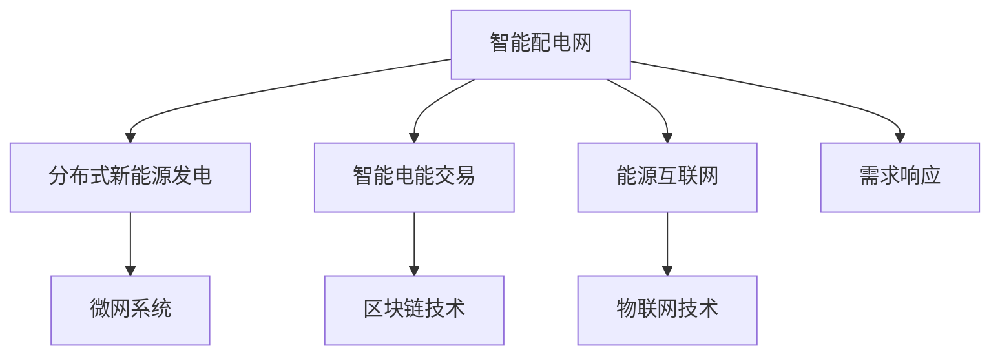
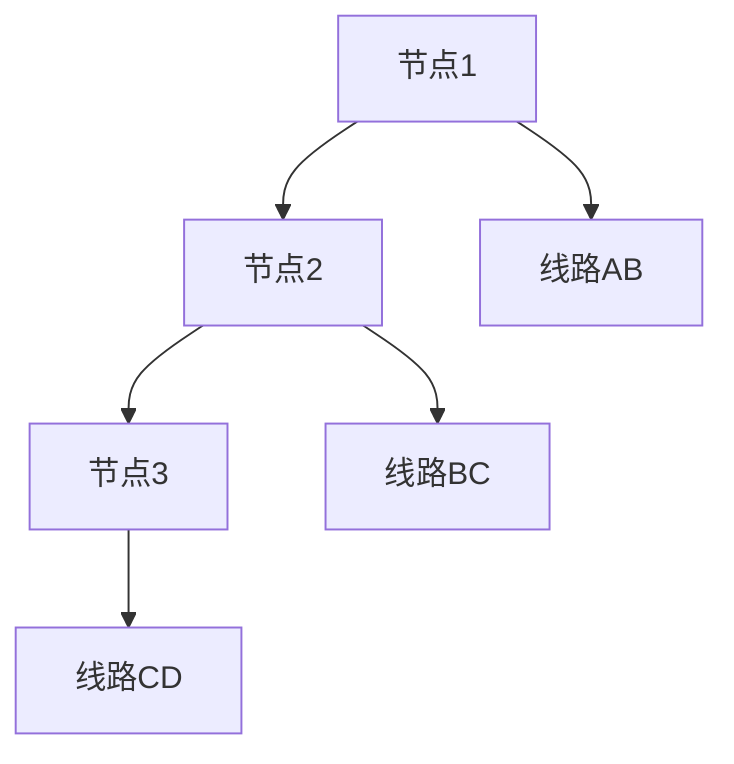

                 

# 未来的智慧能源：2050年的智能配电网与新能源交易

## 1. 背景介绍

### 1.1 问题由来

随着全球能源需求持续增长，传统化石能源面临枯竭危机，清洁、可再生能源成为未来的重要方向。然而，可再生能源的间歇性、不确定性以及分布式特性使得传统集中式能源体系面临巨大挑战。未来的能源系统需要实现以智能配电网为核心的高度灵活和可扩展的架构，同时结合分布式新能源发电与智能电网技术，促进能源的高效利用与交易。

### 1.2 问题核心关键点

1. **智能配电网**：利用先进的通信、计算和控制技术，优化电力网络的运行效率，提高电力系统的可靠性和稳定性。
2. **分布式新能源发电**：以太阳能、风能等分布式发电技术为基础，实现电力生产的分布化与本地化。
3. **智能电能交易**：通过区块链、智能合约等技术实现电能的智能交易，降低交易成本，提升市场透明度。
4. **碳中和目标**：实现全社会的碳排放达峰和碳中和，推动绿色低碳发展。
5. **能效提升**：通过智能控制技术提升能源使用效率，降低能耗，实现节能减排。

## 2. 核心概念与联系

### 2.1 核心概念概述

1. **智能配电网**：通过高级计量、信息通信、能源储存、先进控制等技术手段，实现对电网的智能化管理。
2. **分布式新能源发电**：在用户端通过太阳能光伏、风力发电等分散式发电方式，直接接入电网或独立供电。
3. **智能电能交易**：利用区块链技术实现去中心化的电能交易，保障交易透明、安全、高效。
4. **能源互联网**：融合信息通信技术与能源技术，构建开放的、互联互通的能源系统。
5. **需求响应**：通过智能系统激励用户参与能源管理，实现需求侧响应，提升电网效率。

这些概念之间相互关联，共同构成了未来智慧能源的架构：



## 3. 核心算法原理 & 具体操作步骤

### 3.1 算法原理概述

未来的智慧能源系统通过先进的信息通信技术、能量存储技术、分布式发电与智能配电网技术，实现对可再生能源的高效利用与智能交易。其核心算法包括以下几个方面：

1. **状态估计**：通过实时数据采集和高级计算技术，精确计算电网的运行状态，确保电力系统的稳定运行。
2. **预测与调度**：利用大数据、机器学习等技术，对未来的电力需求进行预测，优化电力资源的分配和调度。
3. **需求响应**：通过智能系统激励用户参与需求响应，实现动态负荷平衡和优化电力使用。
4. **交易与结算**：利用智能合约、区块链等技术，实现电能交易的自动化、透明化和安全化。

### 3.2 算法步骤详解

#### 3.2.1 智能配电网构建

1. **通信网络构建**：搭建高速、可靠的通信网络，包括光纤、5G、物联网等技术，实现电网各节点的信息互联互通。
2. **高级计量与监测**：在电网的关键节点部署高级计量装置，实时监测电能的流动情况。
3. **自愈与优化控制**：应用自愈技术，通过实时数据分析和算法优化，快速定位故障并自动恢复。

#### 3.2.2 分布式新能源发电接入

1. **接入技术**：通过智能电网接口技术，将分布式发电单元接入电网，实现并网和独立供电。
2. **能量储存与管理**：部署能量储存系统，如电池、超级电容器等，平滑能源供应，提高电网稳定性。
3. **需求响应管理**：利用智能算法和激励机制，鼓励用户参与需求响应，优化电网负荷。

#### 3.2.3 智能电能交易

1. **市场设计**：建立基于区块链的电能交易平台，设计合理的电能交易规则和激励机制。
2. **交易执行**：通过智能合约和分布式账本技术，实现电能交易的自动化执行和结算。
3. **市场监控与调整**：利用大数据和AI技术，实时监控市场动态，及时调整交易策略。

### 3.3 算法优缺点

**优点**：

1. **提高能源利用效率**：智能配电网和分布式发电技术实现了能源的高效利用，减少了能源浪费。
2. **增强系统可靠性**：高级计量与自愈技术提高了电网的稳定性和可靠性。
3. **降低交易成本**：智能合约和区块链技术降低了电能交易的成本，提高了市场透明度。
4. **促进环保**：分布式发电和智能控制技术减少了碳排放，推动了绿色低碳发展。

**缺点**：

1. **技术复杂度高**：涉及通信、计算、控制等多领域的复杂技术集成。
2. **初期投入大**：需要大量的基础设施投资和技术升级。
3. **安全风险**：智能系统可能面临网络攻击、数据泄露等安全威胁。
4. **标准不一致**：不同国家和地区的技术标准和规范可能存在差异。

### 3.4 算法应用领域

1. **智能建筑与社区**：结合智能配电网和分布式发电技术，实现社区能源的自给自足和智能化管理。
2. **工业与农业**：利用智能电网和分布式发电技术，优化工业和农业的能源使用，提升生产效率。
3. **交通与物流**：通过智能配电网和能源互联网技术，实现交通与物流的能源优化与协同。
4. **城市基础设施**：将智能配电网与城市基础设施整合，提升城市管理的智能化水平。

## 4. 数学模型和公式 & 详细讲解 & 举例说明

### 4.1 数学模型构建

1. **状态估计模型**：
   $$
   \mathcal{X} = \{ x_t \}_{t=1}^T \quad \text{其中} \quad x_t = (p_{i,t}, q_{i,t}, v_{i,t}, \theta_{i,t})
   $$
   表示电网在时间$t$的状态向量，包括节点电压$v_{i,t}$、支路功率$(p_{i,t}, q_{i,t})$和节点角度$\theta_{i,t}$。

2. **负荷预测模型**：
   $$
   \hat{y}_t = f(x_t; \theta) + \epsilon_t
   $$
   其中$f(x_t; \theta)$为负荷预测模型，$\epsilon_t$为预测误差。

3. **调度优化模型**：
   $$
   \min_{u_t} \left\{ c(u_t) + \delta(t, \delta t) \right\}
   $$
   其中$u_t$为时间$t$的调度决策向量，$c(u_t)$为成本函数，$\delta(t, \delta t)$为时间间隔$\delta t$的偏差。

4. **需求响应模型**：
   $$
   \min_{\delta u_t} \left\{ c(\delta u_t) + \delta(t, \delta t) \right\}
   $$
   其中$\delta u_t$为用户参与需求响应的决策变量。

### 4.2 公式推导过程

以负荷预测模型为例，使用历史负荷数据$x_1, x_2, \dots, x_N$，通过时间序列分析或机器学习算法，得到预测模型$f(x_t; \theta)$。假设存在$K$个训练样本，模型参数$\theta$为$\{w, b\}$，则预测模型可以表示为：
$$
f(x_t; \theta) = w^T x_t + b
$$
其中$w$为权重向量，$b$为偏置项。通过最小化预测误差$\epsilon_t$，得到最优参数$\theta^*$：
$$
\theta^* = \mathop{\arg\min}_{\theta} \sum_{t=1}^N \epsilon_t^2
$$
使用梯度下降等优化算法，迭代更新参数$\theta$，直到收敛。

### 4.3 案例分析与讲解

以一个智能配电网为例，假设电网结构如图1所示：



图1：智能配电网结构示意图

1. **状态估计**：通过实时监测节点电压、支路功率和节点角度，使用卡尔曼滤波器进行状态估计，得到电网实时运行状态。
2. **负荷预测**：利用历史负荷数据，通过时间序列分析或深度学习模型，预测未来负荷。
3. **调度优化**：根据负荷预测结果和实时状态，优化调度决策，分配发电资源，确保电网稳定运行。
4. **需求响应**：通过智能算法和激励机制，鼓励用户参与需求响应，优化电网负荷，提高效率。

## 5. 项目实践：代码实例和详细解释说明

### 5.1 开发环境搭建

1. **Python环境配置**：安装Python 3.x，配置虚拟环境。
2. **通信网络搭建**：使用TensorFlow、PyTorch等深度学习框架搭建通信网络。
3. **高级计量与监测**：部署高级计量装置，使用Pymetering等库进行实时数据采集和处理。
4. **自愈与优化控制**：使用OpfPy、PuLP等库进行电网优化控制和自愈算法。

### 5.2 源代码详细实现

以下是一个简单的智能配电网状态估计与负荷预测的Python代码实现：

```python
import numpy as np
from scipy.optimize import minimize
from sklearn.linear_model import LinearRegression

class SmartGrid:
    def __init__(self, N, T):
        self.N = N  # 节点数量
        self.T = T  # 时间步长
        self.x = np.zeros((N, T, 4))  # 状态向量

    def state_estimate(self, x):
        # 卡尔曼滤波器实现状态估计
        ...

    def load_forecast(self, x):
        # 时间序列分析或机器学习实现负荷预测
        ...

    def dispatch_optimization(self, x):
        # 基于模型预测和状态估计，进行调度优化
        ...

    def demand_response(self, x):
        # 激励机制和智能算法实现需求响应
        ...

# 初始化智能配电网
grid = SmartGrid(N=10, T=24)
# 实时数据采集与处理
x = grid.state_estimate(x)
# 负荷预测
y_hat = grid.load_forecast(x)
# 调度优化
grid.dispatch_optimization(x)
# 需求响应
grid.demand_response(x)
```

### 5.3 代码解读与分析

以上代码实现了一个简单的智能配电网系统，主要包含状态估计、负荷预测、调度优化和需求响应四个部分。

1. **状态估计**：通过卡尔曼滤波器实现实时状态估计，确保电网运行稳定。
2. **负荷预测**：利用时间序列分析或机器学习模型，预测未来负荷变化，为调度优化提供数据支持。
3. **调度优化**：根据负荷预测结果和实时状态，进行调度决策，优化资源分配。
4. **需求响应**：通过激励机制和智能算法，鼓励用户参与需求响应，提高电网效率。

## 6. 实际应用场景

### 6.1 智能建筑与社区

智能建筑与社区是未来智慧能源的重要应用场景。通过智能配电网和分布式发电技术，实现社区能源的自给自足和智能化管理。例如，小区内部的太阳能光伏系统、储能电池和智能电表，可以实时监测和优化能源使用，实现能源的高效利用和低碳发展。

### 6.2 工业与农业

工业与农业也是智慧能源的重要领域。通过智能配电网和分布式发电技术，优化工业和农业的能源使用，提升生产效率和能效。例如，工厂的分布式发电系统和工业园区的小型微网，可以实现节能减排和能源自给自足。

### 6.3 交通与物流

交通与物流是智慧能源的重要应用场景之一。通过智能配电网和能源互联网技术，实现交通与物流的能源优化与协同。例如，电动汽车充电站的智能管理，可以优化充电效率，减少能源浪费。

### 6.4 城市基础设施

城市基础设施也是智慧能源的重要应用领域。将智能配电网与城市基础设施整合，提升城市管理的智能化水平。例如，智能路灯、智能交通信号灯等，可以通过实时数据分析和智能控制，实现能源的高效利用和城市管理的智能化。

## 7. 工具和资源推荐

### 7.1 学习资源推荐

1. **《智能电网与能源互联网》**：介绍智能电网的基本概念和关键技术，涵盖通信、控制、优化等领域的知识。
2. **《可再生能源电力系统》**：介绍可再生能源电力系统的工作原理和优化方法，涵盖分布式发电、能量存储、智能配电网等技术。
3. **《区块链技术与应用》**：介绍区块链技术的基本原理和应用场景，涵盖智能合约、分布式账本等关键技术。
4. **《人工智能与大数据》**：介绍人工智能和大数据技术的基本原理和应用场景，涵盖机器学习、深度学习、大数据分析等技术。
5. **《能源互联网发展与未来》**：介绍能源互联网的发展历程和未来趋势，涵盖智能电网、分布式发电、能源交易等领域的知识。

### 7.2 开发工具推荐

1. **Python**：Python是智能配电网与新能源交易开发的主流语言，具有丰富的第三方库和社区支持。
2. **TensorFlow**：用于深度学习算法的实现，支持分布式计算和GPU加速。
3. **PyTorch**：用于深度学习算法的实现，支持动态图和GPU加速。
4. **OpfPy**：用于电力系统优化问题的建模和求解，支持大规模电力系统的优化计算。
5. **PuLP**：用于线性规划和优化问题的建模和求解，支持电力系统的优化控制。

### 7.3 相关论文推荐

1. **《智能配电网技术发展与趋势》**：综述智能配电网的关键技术和发展趋势，涵盖通信、控制、优化等领域的知识。
2. **《分布式发电与智能电网技术》**：介绍分布式发电与智能电网的关键技术，涵盖分布式发电、能量存储、智能配电网等技术。
3. **《区块链在能源交易中的应用》**：介绍区块链技术在能源交易中的应用，涵盖智能合约、分布式账本等关键技术。
4. **《人工智能在能源管理中的应用》**：介绍人工智能技术在能源管理中的应用，涵盖机器学习、深度学习、大数据分析等技术。
5. **《能源互联网与智慧能源系统》**：介绍能源互联网与智慧能源系统的关键技术和发展趋势，涵盖智能电网、分布式发电、能源交易等领域的知识。

## 8. 总结：未来发展趋势与挑战

### 8.1 总结

本文对未来的智慧能源系统进行了系统性介绍，介绍了智能配电网、分布式新能源发电和智能电能交易的核心算法和操作步骤。通过案例分析，展示了智能配电网在实际应用中的效果。同时，本文还推荐了相关的学习资源和开发工具，为读者提供了全面的技术支持。

通过本文的系统梳理，可以看到，未来的智慧能源系统具有广阔的发展前景，能够实现能源的高效利用与智能交易，推动绿色低碳发展。然而，在实现这一目标的过程中，仍面临诸多挑战，如技术复杂度、初期投入大、安全风险等。需要多领域的技术协作，不断探索和突破，才能实现智慧能源的可持续发展。

### 8.2 未来发展趋势

1. **技术融合与创新**：未来智慧能源系统将融合多种先进技术，如大数据、人工智能、物联网等，实现更为智能化和高效化的能源管理。
2. **分布式与集中式结合**：未来智慧能源系统将实现分布式与集中式的结合，实现能源的优化配置和高效利用。
3. **去中心化与自治化**：未来智慧能源系统将采用去中心化与自治化的设计，通过智能合约和区块链技术，实现电能交易的透明化和高效化。
4. **碳中和与可持续发展**：未来智慧能源系统将实现碳中和目标，推动绿色低碳发展，促进可持续发展。
5. **能效提升与智能化**：未来智慧能源系统将提升能源使用效率，实现智能化管理，优化资源配置。

### 8.3 面临的挑战

1. **技术复杂度**：未来智慧能源系统涉及多种先进技术的集成，技术复杂度较高，需要多领域的技术协作和创新。
2. **初期投入大**：未来智慧能源系统需要大量的基础设施投资和技术升级，初期投入较大。
3. **安全风险**：未来智慧能源系统面临网络攻击、数据泄露等安全威胁，需要加强安全防护和风险管理。
4. **标准不一致**：不同国家和地区的技术标准和规范可能存在差异，需要统一的国际标准和规范。
5. **市场机制不完善**：未来智慧能源系统需要建立完善的市场机制，保障电能交易的公平性和透明性。

### 8.4 研究展望

1. **多源数据融合**：未来智慧能源系统将融合多种数据源，实现更全面和精确的能源管理。
2. **智能算法优化**：未来智慧能源系统将优化智能算法，提升系统的效率和可靠性。
3. **分布式能源优化**：未来智慧能源系统将优化分布式能源的配置和利用，实现能源的高效利用和本地化。
4. **绿色低碳发展**：未来智慧能源系统将推动绿色低碳发展，实现碳中和目标。
5. **智能化管理**：未来智慧能源系统将实现智能化管理，提升能源使用的效率和安全性。

## 9. 附录：常见问题与解答

**Q1：智能配电网与传统配电网有何区别？**

A: 智能配电网与传统配电网的主要区别在于其智能化水平和自动化程度。智能配电网通过先进的通信、计算和控制技术，实现了对电网的实时监测、优化控制和自愈功能，提升了电网的稳定性和可靠性。

**Q2：分布式新能源发电的主要优势是什么？**

A: 分布式新能源发电的主要优势包括：
1. 可再生性：利用太阳能、风能等可再生能源，减少对化石能源的依赖。
2. 本地化供电：在用户端进行发电，减少输电损失，提高能源利用效率。
3. 降低碳排放：减少化石能源的使用，降低碳排放，推动绿色低碳发展。
4. 灵活性：根据负荷需求，动态调整发电容量，实现电力供需平衡。

**Q3：智能电能交易的主要优点是什么？**

A: 智能电能交易的主要优点包括：
1. 透明化：利用区块链技术，实现电能交易的透明化，保障交易的公平性和公正性。
2. 去中心化：基于分布式账本技术，实现去中心化的电能交易，降低交易成本，提高交易效率。
3. 安全性：通过加密和智能合约，保障电能交易的安全性，防止欺诈和滥用。
4. 灵活性：基于市场动态，实时调整交易策略，实现最优的交易结果。

**Q4：未来智慧能源系统的应用前景如何？**

A: 未来智慧能源系统具有广阔的应用前景，可以实现能源的高效利用与智能交易，推动绿色低碳发展。其应用领域包括：
1. 智能建筑与社区：通过智能配电网和分布式发电技术，实现社区能源的自给自足和智能化管理。
2. 工业与农业：利用智能配电网和分布式发电技术，优化工业和农业的能源使用，提升生产效率。
3. 交通与物流：通过智能配电网和能源互联网技术，实现交通与物流的能源优化与协同。
4. 城市基础设施：将智能配电网与城市基础设施整合，提升城市管理的智能化水平。

**Q5：未来智慧能源系统面临哪些挑战？**

A: 未来智慧能源系统面临的挑战包括：
1. 技术复杂度高：涉及多种先进技术的集成，技术复杂度较高，需要多领域的技术协作和创新。
2. 初期投入大：需要大量的基础设施投资和技术升级，初期投入较大。
3. 安全风险：面临网络攻击、数据泄露等安全威胁，需要加强安全防护和风险管理。
4. 标准不一致：不同国家和地区的技术标准和规范可能存在差异，需要统一的国际标准和规范。
5. 市场机制不完善：需要建立完善的市场机制，保障电能交易的公平性和透明性。

通过系统梳理未来智慧能源系统的核心概念和操作步骤，本文为读者提供了全面的技术支持和未来展望。相信随着技术的发展和应用的推广，未来智慧能源系统将实现能源的高效利用与智能交易，推动绿色低碳发展，为人类社会带来新的变革。

