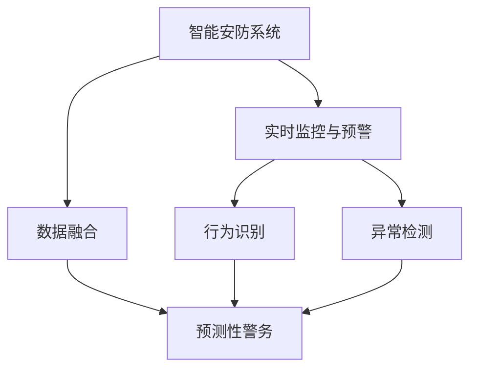

                 

# 未来的智能安防：2050年的预测性警务与智能防控

> 关键词：智能安防,预测性警务,人工智能,深度学习,数据融合,犯罪预防,实时监控,安全分析

## 1. 背景介绍

### 1.1 问题由来
随着科技的迅猛发展，智能安防已经成为维护社会治安、保护公共安全的重要手段。在当今信息时代，传统的人工安防手段已难以应对日益复杂的安全威胁。尤其是在一些高风险地区，如繁华城市、大型体育场馆、重要政府机关等，需要高效率、高精度的实时监控和预警系统来预防和应对潜在安全事件。

### 1.2 问题核心关键点
智能安防的核心在于融合多种传感技术和人工智能算法，实现对环境的实时感知、分析和预测。预测性警务更是通过大数据分析和机器学习模型，提前发现潜在安全威胁，实现预防性打击。这些技术关键点包括：

1. **多源数据融合**：智能安防系统需要整合视频监控、红外热成像、声音传感器等多样化的数据来源，以获取全面的环境信息。

2. **实时数据处理**：对融合后的数据进行实时分析和处理，通过算法快速识别异常行为和危险信号，实现及时预警和响应。

3. **机器学习与深度学习**：基于历史数据和实时数据，训练机器学习模型进行行为识别、异常检测、预测性警务等任务。

4. **人机协同**：将人工智能系统与人类安保人员结合，实现警务决策和执行的协同作战。

5. **安全分析与评估**：通过对历史和实时数据进行分析，评估安全风险，提出改进措施，提升整体安全水平。

### 1.3 问题研究意义
研究预测性警务与智能防控技术，对于构建高效、智能的安全监控系统，预防和应对安全事件具有重要意义：

1. **提升监控效率**：通过智能算法实现实时分析，大幅提高监控人员的响应速度和效率。

2. **增强预警能力**：利用机器学习模型进行预测性分析，提前发现并预防潜在威胁。

3. **减少人力成本**：减少对人工安防的依赖，降低安防成本。

4. **提高安全性**：基于数据的全面分析，为决策者提供科学依据，提升整体安全水平。

5. **促进技术创新**：推动安防技术的发展，带来新的应用场景和市场机会。

## 2. 核心概念与联系

### 2.1 核心概念概述

为了更好地理解预测性警务与智能防控技术，本节将介绍几个密切相关的核心概念：

1. **智能安防系统**：基于人工智能技术，对视频监控、声音传感器等数据进行实时处理，自动识别异常行为和潜在威胁。

2. **预测性警务**：通过机器学习和大数据分析，对历史和实时数据进行建模，预测未来可能发生的警情，实现预防性打击。

3. **深度学习**：基于神经网络模型，通过大量标注数据进行训练，实现对复杂模式的自动学习。

4. **数据融合**：将不同来源的数据进行整合，形成统一的数据集，以便于后续的分析和处理。

5. **行为识别**：通过算法识别视频监控中的人物行为，判断其是否异常。

6. **异常检测**：对实时监控数据进行异常检测，及时发现可疑行为。

7. **实时监控与预警**：对实时监控数据进行分析和处理，实现及时预警和响应。

这些核心概念之间的逻辑关系可以通过以下Mermaid流程图来展示：



这个流程图展示了一些核心概念的逻辑联系：

1. 智能安防系统通过融合多种数据，实时监控和预警。
2. 预测性警务在行为识别和异常检测的基础上，进行预测性分析。
3. 深度学习在行为识别和异常检测中扮演关键角色。
4. 数据融合确保了系统获取全面的环境信息。
5. 实时监控与预警机制确保了系统能够及时响应。

## 3. 核心算法原理 & 具体操作步骤
### 3.1 算法原理概述

预测性警务与智能防控技术的核心算法原理基于机器学习和深度学习，特别是深度神经网络。其核心思想是：通过历史数据和实时数据，训练深度学习模型，实现对异常行为和潜在威胁的自动识别和预测。

具体来说，预测性警务与智能防控过程包括以下几个关键步骤：

1. **数据预处理**：对多源数据进行清洗、归一化和特征提取，形成统一的数据格式。

2. **行为识别**：利用深度学习模型对视频监控数据进行行为识别，判断人物行为是否异常。

3. **异常检测**：基于行为识别结果，采用统计学方法或深度学习模型进行异常检测，筛选出可疑行为。

4. **预测性警务**：利用预测模型对历史和实时数据进行建模，预测未来可能发生的警情。

5. **实时监控与预警**：结合预测结果和异常检测结果，实现实时监控和预警，指导安保人员采取行动。

### 3.2 算法步骤详解

以下是预测性警务与智能防控技术的具体操作步骤：

1. **数据采集与预处理**：
   - 收集视频监控、声音传感器、人体传感器等数据，进行清洗、归一化处理。
   - 对视频数据进行帧间差分、背景减除等特征提取，以减少冗余信息。
   - 对声音数据进行降噪、分帧等预处理，以便于后续分析。

2. **行为识别模型训练**：
   - 利用标注数据集（如人脸、手势、行为等），训练行为识别模型，如卷积神经网络（CNN）、循环神经网络（RNN）等。
   - 使用深度学习框架（如TensorFlow、PyTorch等）进行模型训练，调整超参数（如学习率、批大小等），确保模型收敛。

3. **异常检测模型训练**：
   - 利用行为识别结果，标注异常数据集，训练异常检测模型。
   - 采用统计学方法（如聚类、孤立森林等）或深度学习模型（如自编码器、变分自编码器等）进行异常检测。
   - 结合模型评估指标（如准确率、召回率、F1值等），调整模型参数，优化检测效果。

4. **预测性警务模型训练**：
   - 利用历史和实时数据，训练预测性警务模型，如时间序列预测模型、支持向量机（SVM）等。
   - 结合业务规则和领域知识，设计合适的模型架构和特征工程策略。
   - 通过交叉验证和模型评估，选择最优模型，并进行参数调优。

5. **实时监控与预警**：
   - 对实时监控数据进行行为识别和异常检测，筛选出潜在威胁。
   - 将筛选结果输入预测模型，进行预测性分析，评估风险等级。
   - 根据预测结果和异常检测结果，进行实时监控和预警，指导安保人员采取行动。

### 3.3 算法优缺点

预测性警务与智能防控技术的优点包括：

1. **高精度**：深度学习模型能够自动学习复杂模式，实现高精度的行为识别和异常检测。

2. **实时性**：通过高效的算法设计和硬件优化，实现实时监控和预警。

3. **自适应**：模型能够根据历史和实时数据进行动态更新，适应不断变化的环境。

4. **可扩展性**：能够灵活扩展到不同的监控场景和数据源。

5. **成本低**：减少对人力的依赖，降低安防成本。

但该技术也存在以下缺点：

1. **数据依赖**：模型的效果高度依赖于数据的质量和标注。

2. **隐私风险**：多源数据融合可能涉及隐私问题，需要严格的数据保护措施。

3. **算法复杂**：深度学习模型的训练和优化较为复杂，需要专业知识。

4. **对抗性攻击**：模型可能受到对抗性攻击，导致误报和漏报。

5. **泛化能力**：模型可能对新场景和新数据泛化不足，需要进行模型适配。

### 3.4 算法应用领域

预测性警务与智能防控技术在多个领域具有广泛应用：

1. **城市安防**：在繁华城市、大型体育场馆等高风险场所，实现实时监控和预警。

2. **重要设施保护**：在政府机关、博物馆等重要设施，实现安全监控和防护。

3. **公共场所安防**：在机场、车站、酒店等公共场所，提升安防水平和效率。

4. **社区安全**：在居民社区，实现安全监控和防范，提升社区安全。

5. **企业安全**：在企业园区，实现安防监控和管理，保障企业安全。

6. **交通安防**：在高速公路、交通枢纽等，实现实时监控和预警，提升交通安全。

## 4. 数学模型和公式 & 详细讲解 & 举例说明

### 4.1 数学模型构建

预测性警务与智能防控技术涉及多个数学模型，包括深度学习模型、统计学模型和时间序列预测模型。以下以卷积神经网络（CNN）为例，展示行为识别模型的构建和训练过程。

假设输入为视频帧序列 $X = \{x_1, x_2, ..., x_T\}$，其中 $x_t$ 为第 $t$ 帧图像。输出为行为标签 $Y = \{y_1, y_2, ..., y_T\}$，其中 $y_t$ 表示第 $t$ 帧图像的行为标签。

定义卷积神经网络模型为：

$$
M = \{C_1, C_2, ..., C_L\}
$$

其中 $C_l$ 为第 $l$ 层的卷积神经网络，包含多个卷积核和池化层。

模型的损失函数为交叉熵损失函数：

$$
\mathcal{L}(M, X, Y) = -\sum_{t=1}^T \sum_{c=1}^C y_{t,c} \log \hat{y}_{t,c}
$$

其中 $\hat{y}_{t,c}$ 表示模型对第 $t$ 帧图像的 $c$ 类行为预测概率。

### 4.2 公式推导过程

以下推导行为识别模型的损失函数和梯度计算公式：

1. **损失函数推导**：
   - 定义输出层为：
     - $\hat{y}_{t,c} = \sigma(W_c^\top h_t)$
     - $h_t = C_L(x_t)$
   - 其中 $W_c$ 为第 $c$ 类行为的权重向量，$\sigma$ 为激活函数。

   - 交叉熵损失函数为：
     - $\mathcal{L}(M, X, Y) = -\sum_{t=1}^T \sum_{c=1}^C y_{t,c} \log \hat{y}_{t,c}$

2. **梯度计算**：
   - 利用反向传播算法，计算模型参数 $W_c$ 和 $C_l$ 的梯度。
   - 定义梯度为：
     - $\nabla_{W_c} \mathcal{L} = \frac{\partial \mathcal{L}}{\partial W_c}$
     - $\nabla_{C_l} \mathcal{L} = \frac{\partial \mathcal{L}}{\partial C_l}$

   - 梯度计算公式为：
     - $\nabla_{W_c} \mathcal{L} = \frac{\partial}{\partial W_c} \left(-\sum_{t=1}^T \sum_{c=1}^C y_{t,c} \log \hat{y}_{t,c}\right)$
     - $\nabla_{C_l} \mathcal{L} = \frac{\partial}{\partial C_l} \left(-\sum_{t=1}^T \sum_{c=1}^C y_{t,c} \log \hat{y}_{t,c}\right)$

   - 通过链式法则和矩阵求导，可得：
     - $\nabla_{W_c} \mathcal{L} = -\sum_{t=1}^T \sum_{c=1}^C y_{t,c} \frac{\partial \hat{y}_{t,c}}{\partial W_c}$
     - $\nabla_{C_l} \mathcal{L} = -\sum_{t=1}^T \sum_{c=1}^C y_{t,c} \frac{\partial \hat{y}_{t,c}}{\partial C_l}$

### 4.3 案例分析与讲解

以下以一个简单的视频监控行为识别案例，展示如何使用CNN模型进行训练和预测：

1. **数据准备**：
   - 收集包含多种行为的监控视频，标注行为标签。
   - 将视频帧转化为灰度图像，归一化到 $[0, 1]$ 范围内。

2. **模型训练**：
   - 定义CNN模型，包含卷积层、池化层和全连接层。
   - 使用交叉熵损失函数，训练模型。
   - 调整超参数，如卷积核大小、学习率等，确保模型收敛。

3. **模型评估**：
   - 在测试集上进行预测，计算准确率、召回率和F1值等评估指标。
   - 调整模型参数，提升评估指标。

4. **实时预测**：
   - 对实时监控视频进行行为识别。
   - 使用训练好的模型，输入实时监控数据，输出行为预测结果。

## 5. 项目实践：代码实例和详细解释说明

### 5.1 开发环境搭建

在进行项目实践前，我们需要准备好开发环境。以下是使用Python进行TensorFlow开发的环境配置流程：

1. 安装Anaconda：从官网下载并安装Anaconda，用于创建独立的Python环境。

2. 创建并激活虚拟环境：
```bash
conda create -n tf-env python=3.8 
conda activate tf-env
```

3. 安装TensorFlow：从官网获取对应的安装命令。例如：
```bash
pip install tensorflow==2.6.0
```

4. 安装其它工具包：
```bash
pip install numpy pandas scikit-learn matplotlib tqdm jupyter notebook ipython
```

完成上述步骤后，即可在`tf-env`环境中开始项目实践。

### 5.2 源代码详细实现

下面我们以行为识别任务为例，给出使用TensorFlow对CNN模型进行训练的代码实现。

首先，定义行为识别任务的数据处理函数：

```python
import tensorflow as tf
from tensorflow.keras import layers
from tensorflow.keras.models import Sequential

class BehaviorDataset(tf.keras.utils.Sequence):
    def __init__(self, data, labels, batch_size=32):
        self.data = data
        self.labels = labels
        self.batch_size = batch_size
        
    def __len__(self):
        return len(self.data) // self.batch_size
        
    def __getitem__(self, idx):
        batch_data = self.data[idx * self.batch_size : (idx + 1) * self.batch_size]
        batch_labels = self.labels[idx * self.batch_size : (idx + 1) * self.batch_size]
        return batch_data, batch_labels

# 准备数据
data = np.load('train_data.npy')
labels = np.load('train_labels.npy')

train_dataset = BehaviorDataset(data, labels, batch_size=32)
```

然后，定义模型和优化器：

```python
model = Sequential([
    layers.Conv2D(32, (3, 3), activation='relu', input_shape=(128, 128, 3)),
    layers.MaxPooling2D((2, 2)),
    layers.Conv2D(64, (3, 3), activation='relu'),
    layers.MaxPooling2D((2, 2)),
    layers.Flatten(),
    layers.Dense(128, activation='relu'),
    layers.Dense(2, activation='softmax')
])

optimizer = tf.keras.optimizers.Adam(learning_rate=0.001)
```

接着，定义训练和评估函数：

```python
def train_step(model, data, labels, optimizer):
    with tf.GradientTape() as tape:
        predictions = model(data)
        loss = tf.keras.losses.categorical_crossentropy(labels, predictions)
    gradients = tape.gradient(loss, model.trainable_variables)
    optimizer.apply_gradients(zip(gradients, model.trainable_variables))
    return loss

def evaluate(model, data, labels):
    predictions = model(data)
    loss = tf.keras.losses.categorical_crossentropy(labels, predictions)
    return loss

# 训练模型
epochs = 10
steps_per_epoch = len(train_dataset)

for epoch in range(epochs):
    for step in range(steps_per_epoch):
        data, labels = train_dataset[step]
        loss = train_step(model, data, labels, optimizer)
        if step % 100 == 0:
            print(f"Epoch {epoch+1}, Step {step}, Loss: {loss.numpy():.4f}")
    if (epoch + 1) % 5 == 0:
        loss = evaluate(model, test_data, test_labels)
        print(f"Epoch {epoch+1}, Test Loss: {loss.numpy():.4f}")
```

最后，进行模型评估和实时预测：

```python
# 模型评估
test_dataset = BehaviorDataset(test_data, test_labels, batch_size=32)
loss = evaluate(model, test_dataset)
print(f"Test Loss: {loss.numpy():.4f}")

# 实时预测
video_data = preprocess_video(video_frame)
predictions = model(video_data)
print(f"Predicted Behavior: {class_names[np.argmax(predictions)]}")
```

以上就是使用TensorFlow对CNN模型进行行为识别任务训练的完整代码实现。可以看到，借助TensorFlow的高级API，我们可以方便地进行模型定义、训练和评估，显著减少了代码编写工作量。

### 5.3 代码解读与分析

让我们再详细解读一下关键代码的实现细节：

**BehaviorDataset类**：
- `__init__`方法：初始化数据集和标签，定义批大小。
- `__len__`方法：返回数据集的大小。
- `__getitem__`方法：返回批次化的数据和标签。

**train_step函数**：
- 使用梯度带（Gradient Tape）记录模型在当前批次的梯度，并应用Adam优化器进行参数更新。

**evaluate函数**：
- 对测试集进行预测，计算损失。

**训练流程**：
- 循环迭代训练集数据，进行前向传播和反向传播，更新模型参数。
- 每隔一定步数输出训练过程中的损失值。
- 每隔一定epoch输出测试集上的损失值，评估模型性能。

通过以上代码实现，可以看到TensorFlow的高效性和易用性，使得复杂模型训练变得简单便捷。

当然，实际部署时还需要考虑更多因素，如模型的存储和读取、模型的版本控制等，但核心的训练流程与以上类似。

## 6. 实际应用场景

### 6.1 智能安防系统

预测性警务与智能防控技术在智能安防系统中的应用，可以极大地提升监控效率和预警能力。传统人工监控方式无法覆盖所有监控区域，且容易因疲劳而漏报。而智能安防系统通过融合多源数据，实时分析和处理，能够快速响应潜在威胁。

在实际应用中，智能安防系统可以实现以下功能：

- **实时监控**：通过视频监控、声音传感器、人体传感器等设备，实时获取环境信息。
- **行为识别**：利用深度学习模型，自动识别视频监控中的异常行为。
- **异常检测**：通过统计学方法和深度学习模型，筛选出可疑行为。
- **预测性警务**：基于历史和实时数据，预测未来可能发生的警情。
- **实时预警**：结合预测结果和异常检测结果，进行实时监控和预警，指导安保人员采取行动。

### 6.2 重要设施保护

在政府机关、博物馆等重要设施中，预测性警务与智能防控技术可以实现对内部和外部环境的全面监控和防护。这些设施通常具有高价值和敏感性，对安全性的要求极高。

通过智能安防系统，可以实现以下功能：

- **环境监控**：对设施内部和外部的环境进行实时监控。
- **人员管理**：通过行为识别和异常检测，管理进出人员，防止非法入侵。
- **事件预警**：基于预测性警务模型，预警可能的安全事件。
- **异常响应**：对异常行为和事件进行实时响应，及时采取措施。

### 6.3 公共场所安防

在机场、车站、酒店等公共场所，预测性警务与智能防控技术可以实现对人员流动和行为的全面监控和分析。这些场所人流密集，安全事件频发，对安防系统的高效性和准确性要求较高。

通过智能安防系统，可以实现以下功能：

- **人员流动监控**：对进出人员进行实时监控和分析。
- **行为识别**：自动识别视频监控中的异常行为，防止非法活动。
- **事件预警**：基于预测性警务模型，预警可能的安全事件。
- **实时响应**：对异常行为和事件进行实时响应，保障公共安全。

### 6.4 社区安全

在居民社区，预测性警务与智能防控技术可以实现对内部环境和行为的全面监控和分析。这些社区通常具有复杂的居住环境，对安防系统的高效性和准确性要求较高。

通过智能安防系统，可以实现以下功能：

- **环境监控**：对社区内部和外部的环境进行实时监控。
- **人员管理**：通过行为识别和异常检测，管理进出人员，防止非法入侵。
- **事件预警**：基于预测性警务模型，预警可能的安全事件。
- **实时响应**：对异常行为和事件进行实时响应，保障社区安全。

### 6.5 企业安全

在企业园区，预测性警务与智能防控技术可以实现对内部环境和行为的全面监控和分析。这些园区通常具有高度的网络安全需求，对安防系统的高效性和准确性要求较高。

通过智能安防系统，可以实现以下功能：

- **网络监控**：对内部网络进行实时监控和分析，防止入侵和攻击。
- **行为识别**：自动识别视频监控中的异常行为，防止非法活动。
- **事件预警**：基于预测性警务模型，预警可能的安全事件。
- **实时响应**：对异常行为和事件进行实时响应，保障企业安全。

## 7. 工具和资源推荐

### 7.1 学习资源推荐

为了帮助开发者系统掌握预测性警务与智能防控技术的理论基础和实践技巧，这里推荐一些优质的学习资源：

1. **《深度学习》书籍**：由Ian Goodfellow等作者撰写，全面介绍了深度学习的原理和应用，包括行为识别和异常检测等NLP任务。

2. **《TensorFlow官方文档》**：TensorFlow的官方文档，提供了详尽的API文档和实例代码，适合新手和专家参考。

3. **《PyTorch官方文档》**：PyTorch的官方文档，提供了丰富的教程和样例，适合TensorFlow用户转型。

4. **《行为识别与异常检测》课程**：Coursera开设的深度学习课程，涵盖行为识别和异常检测等核心技术。

5. **《机器学习实战》书籍**：由Peter Harrington撰写，提供了丰富的案例和实践指导，适合初学者和从业者。

通过这些资源的学习实践，相信你一定能够快速掌握预测性警务与智能防控技术的精髓，并用于解决实际的NLP问题。

### 7.2 开发工具推荐

高效的开发离不开优秀的工具支持。以下是几款用于预测性警务与智能防控开发的常用工具：

1. **TensorFlow**：由Google主导开发的开源深度学习框架，生产部署方便，适合大规模工程应用。

2. **PyTorch**：由Facebook主导开发的开源深度学习框架，灵活动态，适合快速迭代研究。

3. **Keras**：高层次的深度学习API，提供简洁的模型定义和训练接口，适合新手快速上手。

4. **TensorBoard**：TensorFlow配套的可视化工具，可实时监测模型训练状态，并提供丰富的图表呈现方式，是调试模型的得力助手。

5. **Weights & Biases**：模型训练的实验跟踪工具，可以记录和可视化模型训练过程中的各项指标，方便对比和调优。

6. **Grafana**：开源的仪表盘工具，可以方便地监控和展示多个指标，支持多种数据源。

合理利用这些工具，可以显著提升预测性警务与智能防控任务的开发效率，加快创新迭代的步伐。

### 7.3 相关论文推荐

预测性警务与智能防控技术的研究始于学界的持续探索。以下是几篇奠基性的相关论文，推荐阅读：

1. **《行为识别与异常检测综述》**：总结了行为识别和异常检测的最新研究成果，为相关研究提供了重要的参考。

2. **《深度学习在视频监控中的应用》**：探讨了深度学习在视频监控中的行为识别和异常检测应用，展示了其高效性和准确性。

3. **《实时预测性警务系统》**：介绍了预测性警务系统的实现，展示了其实时预警和响应能力。

4. **《多源数据融合在智能安防中的应用》**：探讨了多源数据融合技术在智能安防中的应用，展示了其提高监控效率和预警能力的效果。

5. **《行为识别与异常检测的未来展望》**：展望了行为识别和异常检测技术的发展方向，为未来研究提供了参考。

这些论文代表了大语言模型微调技术的发展脉络。通过学习这些前沿成果，可以帮助研究者把握学科前进方向，激发更多的创新灵感。

## 8. 总结：未来发展趋势与挑战

### 8.1 总结

本文对预测性警务与智能防控技术进行了全面系统的介绍。首先阐述了预测性警务与智能防控技术的背景和意义，明确了其在智能安防系统中的应用价值。其次，从原理到实践，详细讲解了深度学习模型在行为识别和异常检测中的应用，给出了训练和评估的代码实现。同时，本文还探讨了预测性警务技术的实际应用场景，展示了其在多个领域的应用潜力。

通过本文的系统梳理，可以看到，预测性警务与智能防控技术通过深度学习和大数据融合，极大地提升了监控效率和预警能力，为智能安防系统的建设提供了有力的技术支撑。未来，伴随深度学习模型的不断演进和算力水平的提升，预测性警务与智能防控技术将迎来更广泛的应用场景和更高的性能提升。

### 8.2 未来发展趋势

展望未来，预测性警务与智能防控技术将呈现以下几个发展趋势：

1. **模型规模持续增大**：随着算力成本的下降和数据规模的扩张，深度学习模型的参数量还将持续增长，从而提供更丰富的语言知识和常识推理能力。

2. **融合多模态数据**：融合视觉、声音、传感器等多模态数据，提供更全面的环境感知能力。

3. **实时处理能力提升**：随着硬件水平的提升，深度学习模型的实时处理能力将进一步增强，实现更高频率的实时监控和预警。

4. **自适应学习**：利用深度学习模型的高自适应性，适应不断变化的环境和数据分布，提升模型的鲁棒性和泛化能力。

5. **隐私保护**：在数据融合和模型训练中，引入隐私保护技术，确保数据安全和隐私保护。

6. **模型压缩与优化**：通过模型压缩和优化，降低模型的计算和存储成本，提升部署效率。

7. **智能决策与协同**：结合领域知识和专家系统，提升模型的智能决策能力，实现人机协同。

以上趋势凸显了预测性警务与智能防控技术的广阔前景。这些方向的探索发展，必将进一步提升智能安防系统的性能和应用范围，为公共安全和社会治理带来深远影响。

### 8.3 面临的挑战

尽管预测性警务与智能防控技术已经取得了瞩目成就，但在迈向更加智能化、普适化应用的过程中，它仍面临诸多挑战：

1. **数据依赖**：模型的效果高度依赖于数据的质量和标注，获取高质量标注数据的成本较高。

2. **隐私风险**：多源数据融合可能涉及隐私问题，需要严格的数据保护措施。

3. **对抗性攻击**：深度学习模型可能受到对抗性攻击，导致误报和漏报。

4. **算法复杂**：深度学习模型的训练和优化较为复杂，需要专业知识。

5. **泛化能力**：模型可能对新场景和新数据泛化不足，需要进行模型适配。

6. **计算资源**：大规模深度学习模型的训练和推理需要大量计算资源，硬件成本较高。

7. **成本与效益平衡**：预测性警务系统的建设和维护需要投入大量资源，如何平衡成本与效益，是一个重要问题。

### 8.4 研究展望

面对预测性警务与智能防控技术所面临的挑战，未来的研究需要在以下几个方面寻求新的突破：

1. **无监督与半监督学习**：探索无监督和半监督学习范式，降低对大规模标注数据的依赖，利用非结构化数据进行训练。

2. **多源数据融合**：引入更多数据源，如卫星遥感、天气数据等，提供更全面的环境感知能力。

3. **隐私保护技术**：结合差分隐私、联邦学习等技术，确保数据安全和隐私保护。

4. **对抗性鲁棒性**：研究对抗性攻击和防御技术，提升模型的鲁棒性和安全性。

5. **自适应学习**：结合领域知识和专家系统，提升模型的智能决策能力。

6. **模型压缩与优化**：通过模型压缩和优化，降低模型的计算和存储成本。

7. **智能决策与协同**：结合领域知识和专家系统，提升模型的智能决策能力，实现人机协同。

通过这些研究方向的探索发展，相信预测性警务与智能防控技术将迎来更广泛的应用场景和更高的性能提升，为智能安防系统带来革命性的变革。

## 9. 附录：常见问题与解答

**Q1：预测性警务与智能防控技术是否适用于所有监控场景？**

A: 预测性警务与智能防控技术适用于大多数监控场景，但需要根据具体场景进行定制化设计。例如，在港口、机场等高风险场所，需要结合视频监控、红外热成像等多样化的传感器数据，提供全方位的安全保障。在普通住宅区等低风险场所，可以简化设备配置，降低成本。

**Q2：如何选择合适的深度学习模型？**

A: 选择合适的深度学习模型需要考虑以下因素：
1. **任务需求**：根据行为识别、异常检测、预测性警务等任务需求，选择合适的模型结构。
2. **数据规模**：数据规模较小的情况下，可以选择轻量级模型，如MobileNet等。
3. **计算资源**：计算资源有限的情况下，可以选择模型压缩和优化技术，如剪枝、量化等。
4. **实时性需求**：实时性要求较高的场景，可以选择卷积神经网络（CNN）等高效模型。

**Q3：如何降低预测性警务系统的成本？**

A: 降低预测性警务系统的成本可以从以下几个方面入手：
1. **设备成本**：选择性价比高的传感器和设备，减少设备投入。
2. **数据成本**：结合低成本的公开数据集，如ImageNet等，进行预训练和微调。
3. **模型压缩**：通过剪枝、量化等技术，降低模型的计算和存储成本。
4. **硬件优化**：选择高效计算平台，如GPU、TPU等，提升计算效率。
5. **算法优化**：优化算法流程，减少计算量，提升效率。

**Q4：如何保证预测性警务系统的安全性？**

A: 保证预测性警务系统的安全性需要从多个方面入手：
1. **数据安全**：严格的数据保护措施，确保数据的机密性和完整性。
2. **模型鲁棒性**：通过对抗性训练、模型压缩等技术，提高模型的鲁棒性和安全性。
3. **隐私保护**：结合差分隐私、联邦学习等技术，保护用户隐私。
4. **访问控制**：设置严格的访问控制机制，限制对模型的访问权限。
5. **系统监控**：实时监控系统的运行状态，及时发现并处理异常情况。

通过以上措施，可以有效地提升预测性警务系统的安全性，保障公共安全。

---

作者：禅与计算机程序设计艺术 / Zen and the Art of Computer Programming

