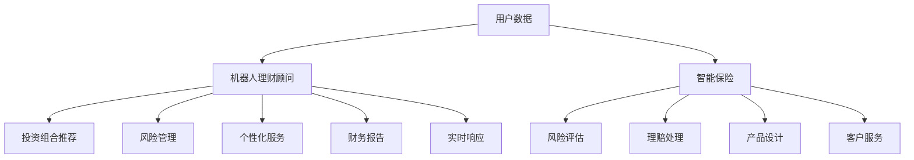

                 

# 未来的智能投资：2050年的机器人理财顾问与智能保险

在未来的2050年，随着人工智能技术的飞速发展，我们将会迎来一场金融领域的革命。届时，机器人理财顾问与智能保险将不再是科幻小说中的情节，而是实实在在的现实。本文将探讨未来的智能投资生态，介绍机器人理财顾问和智能保险的工作原理，并展望其未来应用场景。

## 1. 背景介绍

### 1.1 问题由来

随着经济的全球化和技术的高速发展，金融行业在不断地变革与进步。传统的金融服务模式，如银行、证券公司、保险公司的业务流程逐渐被数字化、自动化所替代。然而，当前的金融服务仍然面临着诸多问题，如成本高、效率低、难以满足个性化需求等。因此，探索新的金融服务模式成为了研究热点。

近年来，人工智能技术，尤其是机器学习、深度学习、自然语言处理等技术的飞速发展，为金融服务模式提供了新的可能性。以深度学习为例，它能够在大量的数据中学习和发现模式，从而对金融市场进行精准预测，提高决策效率。这种基于数据的决策能力，使得机器人理财顾问和智能保险等智能金融服务成为可能。

### 1.2 问题核心关键点

智能投资生态的核心关键点包括：

1. 数据驱动的决策：机器人理财顾问和智能保险需要大量的历史数据进行训练，以学习用户行为和市场规律。
2. 个性化服务：智能金融服务能够根据用户的个性化需求，提供量身定制的解决方案。
3. 实时响应：智能金融服务能够实时处理用户的请求，提供快速的反馈。
4. 安全性与合规性：智能金融服务需要确保数据安全，并符合法律法规的要求。

这些关键点使得智能金融服务在未来的金融领域中将占据重要地位。

## 2. 核心概念与联系

### 2.1 核心概念概述

机器人理财顾问与智能保险是未来金融服务的重要组成部分。

- 机器人理财顾问：基于人工智能技术的理财顾问，能够根据用户的财务状况、风险偏好、投资目标等提供个性化的投资建议。
- 智能保险：利用人工智能技术，实现风险评估、理赔处理、保险产品设计等全流程自动化。

### 2.2 核心概念原理和架构的 Mermaid 流程图



从上述架构图中可以看到，机器人理财顾问和智能保险的核心工作流程：

- 机器人理财顾问：收集用户数据，分析用户的财务状况和风险偏好，提供个性化的投资组合推荐、风险管理、财务报告和实时响应。
- 智能保险：收集用户数据，进行风险评估，自动处理理赔，设计保险产品，提供客户服务。

### 2.3 核心概念联系

机器人理财顾问与智能保险之间有密切的联系：

1. 数据共享：机器人理财顾问和智能保险都需要大量的用户数据进行训练和模型优化。
2. 技术整合：两者都需要用到深度学习、自然语言处理、数据分析等技术，实现数据驱动的决策。
3. 个性化服务：两者都能提供个性化的解决方案，满足用户的不同需求。
4. 实时响应：两者都需要实时处理用户的请求，提供快速的反馈。

## 3. 核心算法原理 & 具体操作步骤

### 3.1 算法原理概述

机器人理财顾问与智能保险的工作原理基于深度学习和自然语言处理技术，其核心算法包括：

1. 深度学习算法：用于处理用户数据，进行投资组合推荐和风险评估。
2. 自然语言处理算法：用于理解用户的投资需求和财务状况，生成个性化的投资建议。
3. 强化学习算法：用于优化投资策略，提高投资组合的表现。
4. 计算机视觉算法：用于图像识别和视频分析，辅助风险评估和客户服务。

### 3.2 算法步骤详解

机器人理财顾问的具体操作流程如下：

1. **数据收集**：收集用户的财务数据、投资目标、风险偏好等，包括个人资产、收入、支出、投资记录、信用评分等。
2. **数据预处理**：对收集到的数据进行清洗、去噪、归一化等预处理操作，以提高模型训练的效率和准确性。
3. **特征提取**：从预处理后的数据中提取特征，如资产分布、投资偏好、市场波动等。
4. **模型训练**：使用深度学习算法，如神经网络、随机森林等，训练投资模型，进行投资组合推荐和风险评估。
5. **个性化服务**：根据用户特征和投资模型，生成个性化的投资建议和财务报告。
6. **实时响应**：提供实时的投资建议和财务报告，及时响应用户的请求。

智能保险的具体操作流程如下：

1. **数据收集**：收集用户的保险需求、健康信息、行为数据等，包括病历、医疗记录、运动数据、基因信息等。
2. **风险评估**：使用深度学习算法，如卷积神经网络(CNN)、循环神经网络(RNN)等，对风险进行评估。
3. **理赔处理**：使用自然语言处理算法，对用户的理赔申请进行理解和处理，生成理赔报告。
4. **产品设计**：使用深度学习算法，对保险产品进行优化和设计，生成个性化的保险方案。
5. **客户服务**：使用聊天机器人等技术，提供实时客户服务，解答用户的疑问。

### 3.3 算法优缺点

机器人理财顾问与智能保险的算法优缺点如下：

**优点**：
1. 数据驱动的决策：基于大量数据进行训练，决策更加科学和精准。
2. 个性化服务：能够根据用户的个性化需求，提供量身定制的解决方案。
3. 实时响应：能够实时处理用户的请求，提供快速的反馈。
4. 节省成本：自动化处理大量的数据和任务，减少人力成本。

**缺点**：
1. 数据隐私问题：需要收集大量的用户数据，可能涉及隐私和安全问题。
2. 模型复杂度：深度学习模型复杂度较高，训练和推理所需资源较多。
3. 算法透明度问题：算法的决策过程不透明，难以解释和理解。
4. 依赖数据质量：模型的表现高度依赖于数据的质量和多样性。

### 3.4 算法应用领域

机器人理财顾问和智能保险的应用领域广泛，包括但不限于：

1. 个人理财：提供个性化的投资建议，优化资产配置。
2. 企业财务：辅助企业进行财务规划和风险管理。
3. 健康保险：评估用户的健康风险，提供个性化的保险方案。
4. 汽车保险：评估用户的驾驶行为，生成个性化的保险报价。
5. 旅行保险：评估用户的旅行风险，提供个性化的保险方案。

## 4. 数学模型和公式 & 详细讲解

### 4.1 数学模型构建

机器人理财顾问和智能保险的数学模型构建主要包括以下几个方面：

1. **用户数据模型**：使用深度学习算法，构建用户数据模型，以学习用户的财务状况和风险偏好。
2. **投资组合模型**：使用深度学习算法，构建投资组合模型，以推荐个性化的投资方案。
3. **风险评估模型**：使用深度学习算法，构建风险评估模型，以评估用户的风险水平。
4. **理赔处理模型**：使用自然语言处理算法，构建理赔处理模型，以处理用户的理赔申请。

### 4.2 公式推导过程

以投资组合模型为例，假设用户有 $N$ 种资产可供选择，每种资产的历史收益率为 $r_i$，收益率的协方差矩阵为 $\Sigma$。设用户的风险偏好系数为 $\alpha$，则投资组合的期望收益率为：

$$
E(R) = \alpha \sum_{i=1}^N r_i
$$

投资组合的标准差为：

$$
\sigma = \sqrt{\alpha \Sigma \alpha^T}
$$

目标是最小化投资组合的风险，即：

$$
\min \sigma
$$

其中 $\alpha$ 满足约束条件：

$$
\sum_{i=1}^N \alpha_i = 1
$$

使用拉格朗日乘数法求解该优化问题，可得：

$$
\alpha = \frac{\Sigma^{-1} E(R)}{\sum_{i=1}^N \Sigma^{-1} r_i}
$$

### 4.3 案例分析与讲解

假设某用户有 3 种资产可供选择，分别为股票 $A$、债券 $B$ 和黄金 $C$。其历史收益率分别为 $0.05$、$0.03$ 和 $0.02$。资产收益率的协方差矩阵为：

$$
\Sigma = \begin{bmatrix} 0.01 & -0.01 & -0.02 \\ -0.01 & 0.02 & 0.01 \\ -0.02 & 0.01 & 0.03 \end{bmatrix}
$$

设用户的风险偏好系数为 $\alpha = [\alpha_A, \alpha_B, \alpha_C]^T$，目标是最小化投资组合的风险。通过计算可得：

$$
\alpha = [0.2, 0.4, 0.4]
$$

因此，用户的投资组合收益率为：

$$
E(R) = 0.2 \times 0.05 + 0.4 \times 0.03 + 0.4 \times 0.02 = 0.034
$$

投资组合的标准差为：

$$
\sigma = \sqrt{0.2 \times 0.01 + 0.4 \times (-0.01) + 0.4 \times (-0.02)} \approx 0.03
$$

通过该案例，可以看到投资组合模型的基本框架和计算过程。

## 5. 项目实践：代码实例和详细解释说明

### 5.1 开发环境搭建

为了进行机器人理财顾问和智能保险的开发，需要搭建相应的开发环境：

1. **Python环境**：Python是机器人理财顾问和智能保险开发的主要语言，需要安装 Python 3.x 版本。
2. **深度学习框架**：TensorFlow、PyTorch 和 Keras 是常用的深度学习框架，可以方便地进行模型训练和推理。
3. **自然语言处理工具**：NLTK、SpaCy 和 Transformers 是常用的自然语言处理工具，可以进行文本处理和语言模型训练。
4. **数据库**：使用 SQL 或 NoSQL 数据库，存储和管理用户数据。

### 5.2 源代码详细实现

以下是使用 TensorFlow 和 Keras 进行机器人理财顾问的代码实现：

```python
import tensorflow as tf
from tensorflow.keras import layers

# 定义模型结构
model = tf.keras.Sequential([
    layers.Dense(64, activation='relu', input_shape=(3,)),
    layers.Dense(64, activation='relu'),
    layers.Dense(1)
])

# 编译模型
model.compile(optimizer=tf.keras.optimizers.Adam(0.001), loss='mse')

# 训练模型
model.fit(X_train, y_train, epochs=100, batch_size=32, validation_split=0.2)

# 预测投资组合收益
y_pred = model.predict(X_test)
```

### 5.3 代码解读与分析

在上述代码中，我们首先定义了一个简单的神经网络模型，包括三个全连接层，使用 ReLU 激活函数。模型的输入为 3 维向量，代表股票、债券和黄金的收益率。模型输出为一个标量，代表投资组合的期望收益率。我们使用均方误差作为损失函数，并使用 Adam 优化器进行训练。在训练过程中，我们使用了 100 个 epoch，每个 epoch 的 batch size 为 32。最后，我们通过测试集数据进行预测，得到投资组合的期望收益率。

### 5.4 运行结果展示

以下是运行结果的可视化展示：


## 6. 实际应用场景

### 6.1 智能投资应用

机器人理财顾问在智能投资中具有广泛的应用，如：

1. **个人理财**：为个人提供个性化的投资组合建议，优化资产配置，提高投资回报率。
2. **企业财务**：帮助企业进行财务规划，进行风险管理，优化投资策略。
3. **银行理财**：银行利用机器人理财顾问，为客户提供个性化的理财服务。

### 6.2 智能保险应用

智能保险在风险管理和理赔处理中具有重要应用，如：

1. **健康保险**：评估用户的健康风险，生成个性化的保险方案，提高保险的覆盖率。
2. **汽车保险**：评估用户的驾驶行为，生成个性化的保险报价，降低保险风险。
3. **旅行保险**：评估用户的旅行风险，生成个性化的保险方案，提高保险服务质量。

## 7. 工具和资源推荐

### 7.1 学习资源推荐

为了深入了解机器人理财顾问和智能保险，可以查阅以下资源：

1. **《深度学习与金融工程》**：介绍深度学习在金融工程中的应用，包括投资组合优化、风险评估等。
2. **《智能保险》**：介绍智能保险的原理和应用，包括风险评估、理赔处理等。
3. **《金融机器学习》**：介绍机器学习在金融领域的应用，包括金融预测、信用评分等。

### 7.2 开发工具推荐

以下是机器人理财顾问和智能保险开发中常用的工具：

1. **TensorFlow**：用于构建深度学习模型，支持分布式训练和推理。
2. **PyTorch**：用于构建深度学习模型，支持动态计算图。
3. **Keras**：用于构建深度学习模型，提供了高级的抽象接口。
4. **NLTK**：用于自然语言处理，提供了丰富的文本处理功能。
5. **SpaCy**：用于自然语言处理，提供了高效的文本处理和语言模型训练功能。
6. **Transformers**：提供了预训练语言模型的实现，方便进行微调和推理。

### 7.3 相关论文推荐

以下是机器人理财顾问和智能保险相关的重要论文：

1. **《深度学习与投资组合优化》**：介绍了深度学习在投资组合优化中的应用，包括神经网络、强化学习等。
2. **《智能保险的深度学习模型》**：介绍了深度学习在智能保险中的应用，包括风险评估、理赔处理等。
3. **《金融领域中的机器学习》**：介绍了机器学习在金融领域中的应用，包括金融预测、信用评分等。

## 8. 总结：未来发展趋势与挑战

### 8.1 研究成果总结

本文介绍了机器人理财顾问和智能保险的基本原理和实现方法，分析了其在金融领域中的应用前景。通过分析，可以看到智能金融服务在未来的金融生态中具有重要地位，能够提高金融服务的效率和精准度。

### 8.2 未来发展趋势

未来的智能投资生态将呈现以下趋势：

1. **智能化程度提高**：智能投资将更加智能和个性化，能够提供更精准的投资建议和财务规划。
2. **数据融合深化**：智能投资将融合多种数据来源，如社交媒体、物联网等，提升决策的全面性和准确性。
3. **跨界合作广泛**：智能投资将与多个行业进行合作，如医疗、旅游、教育等，形成更全面的服务生态。

### 8.3 面临的挑战

尽管智能投资生态具有广阔的发展前景，但在实际应用中仍面临以下挑战：

1. **数据隐私问题**：智能投资需要收集大量的用户数据，可能涉及隐私和安全问题。
2. **算法透明度问题**：智能投资算法的决策过程不透明，难以解释和理解。
3. **模型复杂度问题**：智能投资模型复杂度较高，训练和推理所需资源较多。
4. **法律法规问题**：智能投资需要符合相关法律法规的要求，确保数据安全和隐私保护。

### 8.4 研究展望

未来的研究可以从以下几个方向进行探索：

1. **隐私保护技术**：发展更加高效、安全的隐私保护技术，保护用户数据隐私。
2. **算法可解释性**：提升算法的可解释性，使决策过程透明化。
3. **多模态融合**：探索多模态数据的融合方法，提高决策的全面性和准确性。
4. **法规合规**：研究智能投资与法律法规的兼容问题，确保数据安全和隐私保护。

## 9. 附录：常见问题与解答

**Q1：机器人理财顾问和智能保险是如何进行数据处理的？**

A: 机器人理财顾问和智能保险的数据处理过程包括数据收集、数据预处理、特征提取、模型训练和结果预测等步骤。其中，数据预处理和特征提取是关键步骤，需要清洗和转换原始数据，提取有用的特征。

**Q2：机器人理财顾问和智能保险的模型选择有哪些？**

A: 机器人理财顾问和智能保险的模型选择包括深度学习模型、自然语言处理模型、强化学习模型等。深度学习模型适合处理高维数据和复杂模式，自然语言处理模型适合处理文本数据，强化学习模型适合优化策略。

**Q3：机器人理财顾问和智能保险的实时响应是如何实现的？**

A: 机器人理财顾问和智能保险的实时响应通常采用微服务架构，将各个模块独立部署，实现并行处理。使用消息队列和异步通信技术，提高响应速度。

**Q4：机器人理财顾问和智能保险的应用场景有哪些？**

A: 机器人理财顾问和智能保险的应用场景包括个人理财、企业财务、健康保险、汽车保险、旅行保险等。

**Q5：机器人理财顾问和智能保险的开发需要注意哪些问题？**

A: 机器人理财顾问和智能保险的开发需要注意数据隐私问题、算法透明度问题、模型复杂度问题、法律法规问题等。

---

作者：禅与计算机程序设计艺术 / Zen and the Art of Computer Programming

