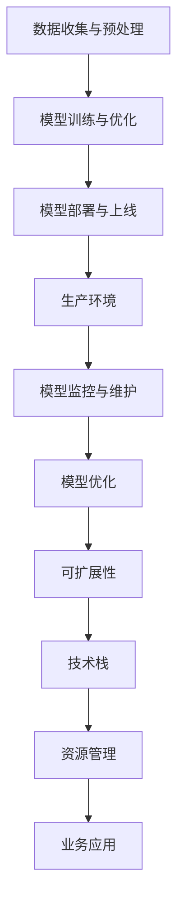

                 

# 机器学习模型部署：从开发到生产环境

> 关键词：机器学习模型,模型部署,生产环境,开发流程,模型优化,可扩展性,监控与维护,技术栈,资源管理

## 1. 背景介绍

随着机器学习技术的飞速发展，越来越多的企业开始借助其构建智能化、自动化的业务解决方案，从数据分析、风险控制、客户服务到智能制造，几乎所有领域都出现了基于机器学习的应用。然而，模型从开发到上线不仅需要精准的算法设计，还需要经过严谨的模型部署和运维过程，这其中任何一个环节的疏忽都可能导致模型失效或用户体验下降。因此，全面了解模型部署的关键环节，掌握模型从开发到生产的完整流程，对于构建可靠、高效的机器学习应用至关重要。

## 2. 核心概念与联系

### 2.1 核心概念概述

本节将介绍几个关键概念，并详细解释它们之间的联系：

- **机器学习模型**：指的是通过数据训练得出的能够预测、分类或推荐的数学模型，包括监督学习、无监督学习、强化学习等。
- **模型部署**：指将经过训练好的模型部署到生产环境中，使其能够实时处理数据、预测结果或执行决策。
- **生产环境**：指模型在实际业务场景中运行的环境，可以是云环境、本地服务器或边缘设备。
- **开发流程**：涉及数据收集与预处理、模型训练与优化、模型部署与运维等多个环节，确保模型能够有效服务于业务需求。
- **模型优化**：在模型上线后，通过监控反馈、持续学习等方式提升模型性能，确保模型在实际应用中表现稳定。
- **可扩展性**：指模型在面对业务需求变化时，能够快速适应和扩展的能力。
- **监控与维护**：指对模型运行状态进行实时监控，及时发现和解决模型问题，保证模型服务的稳定性。
- **技术栈**：指在模型部署过程中所需使用的工具、框架和语言等技术组合。
- **资源管理**：指在模型部署过程中，对计算、内存、存储等资源的有效管理，确保模型高效运行。

### 2.2 核心概念原理和架构的 Mermaid 流程图



这个流程图展示了机器学习模型从开发到生产的整个流程。数据收集与预处理是模型的基础，模型训练与优化是模型的核心，模型部署与上线是将模型应用于实际业务的起点，生产环境是模型服务运行的物理载体，模型监控与维护是模型服务稳定的保障，模型优化是模型不断提升性能的关键，可扩展性是模型应对业务变化的能力，技术栈是模型部署的基础设施，资源管理是确保模型高效运行的前提，业务应用是模型最终价值的体现。

## 3. 核心算法原理 & 具体操作步骤

### 3.1 算法原理概述

模型部署的核心在于将经过训练的模型参数和结构迁移到生产环境中，使其能够在实际业务场景中快速响应数据输入，并输出准确的结果。该过程通常包括模型转换、模型优化、模型部署、模型监控等多个步骤，其中每个步骤都直接影响模型的运行效率和效果。

### 3.2 算法步骤详解

#### 3.2.1 模型转换
模型转换是将训练好的模型从开发环境迁移到生产环境的过程。具体步骤包括：
1. **模型参数保存**：将训练好的模型参数保存为文件或数据库表，以便后续使用。
2. **模型结构保存**：保存模型的网络结构、超参数配置等信息，以便在生产环境中重构模型。
3. **模型兼容检查**：确保生产环境中的框架和工具与开发环境兼容，避免兼容性问题。

#### 3.2.2 模型优化
模型优化是指在模型上线后，通过监控反馈、持续学习等方式提升模型性能的过程。具体步骤包括：
1. **模型监控**：通过日志、指标等方式监控模型运行状态，及时发现异常和问题。
2. **模型更新**：根据监控结果和反馈数据，对模型进行微调或重训练，提升模型性能。
3. **模型压缩**：通过剪枝、量化等技术对模型进行压缩，降低模型大小，提高推理速度。

#### 3.2.3 模型部署
模型部署是将模型发布到生产环境中的过程。具体步骤包括：
1. **环境准备**：配置生产环境，包括计算资源、存储资源、网络环境等。
2. **模型安装**：将模型文件或代码部署到生产环境中，确保生产环境中的模型与开发环境一致。
3. **服务发布**：将模型封装成API或微服务，使其能够被其他系统调用。

#### 3.2.4 模型监控与维护
模型监控与维护是指对模型运行状态进行实时监控，及时发现和解决模型问题，保证模型服务的稳定性。具体步骤包括：
1. **监控指标设置**：根据业务需求和模型特点，设置监控指标，如准确率、召回率、响应时间等。
2. **异常检测**：通过实时数据流和历史数据流，检测模型运行是否异常，如模型输出是否偏离预期、是否发生异常服务宕机等。
3. **问题解决**：根据异常检测结果，及时解决模型问题，如重新训练、调整超参数等。

### 3.3 算法优缺点

**优点**：
- **高性能**：通过模型转换、模型优化、模型压缩等技术，可以显著提升模型的运行效率，满足实际应用的需求。
- **可扩展性**：模型部署过程灵活，可以根据业务需求调整资源配置，确保模型能够快速适应变化。
- **稳定性**：模型监控与维护机制完善，能够及时发现和解决模型问题，确保模型服务的稳定性。

**缺点**：
- **复杂性高**：模型部署涉及多个环节，每个环节都需要严谨的流程设计和工具支持。
- **资源消耗大**：模型部署和运行需要大量计算资源和存储资源，尤其是在处理大规模数据时，资源消耗较大。
- **技术门槛高**：需要具备较高的技术水平和经验，才能有效地完成模型部署和运维工作。

### 3.4 算法应用领域

模型部署技术广泛应用于以下几个领域：

- **金融风控**：通过机器学习模型对用户行为进行风险评估，实时监控模型输出，保证风险评估的准确性和稳定性。
- **电商推荐**：将训练好的推荐模型部署到电商平台上，实时推荐商品，提升用户购物体验。
- **医疗诊断**：通过机器学习模型对患者数据进行诊断，实时监控模型输出，确保诊断结果的准确性。
- **智能客服**：将训练好的客服模型部署到智能客服系统中，实时处理用户问题，提升客户服务质量。
- **自动驾驶**：将训练好的自动驾驶模型部署到车辆中，实时处理传感器数据，保证行车安全。

## 4. 数学模型和公式 & 详细讲解 & 举例说明

### 4.1 数学模型构建

在模型部署过程中，需要对模型进行数学建模，以便于在生产环境中进行优化和监控。以线性回归模型为例，其数学模型为：

$$
y = \beta_0 + \beta_1 x_1 + \beta_2 x_2 + \cdots + \beta_n x_n + \epsilon
$$

其中，$y$为预测值，$x_i$为特征值，$\beta_i$为特征系数，$\epsilon$为误差项。

### 4.2 公式推导过程

在线性回归模型的训练过程中，通过最小二乘法求解特征系数$\beta_i$，其公式为：

$$
\hat{\beta} = (X^TX)^{-1}X^Ty
$$

其中，$X$为特征矩阵，$y$为目标向量，$\hat{\beta}$为求解得到的特征系数。

### 4.3 案例分析与讲解

以电商推荐系统为例，假设我们要部署一个基于协同过滤的推荐模型。模型训练过程如下：
1. **数据收集与预处理**：收集用户行为数据，包括点击、购买、浏览等行为，进行数据清洗和特征提取。
2. **模型训练与优化**：使用协同过滤算法训练模型，通过交叉验证等技术进行模型优化。
3. **模型部署与上线**：将训练好的模型参数和结构部署到生产环境中，配置服务器环境，发布API接口。
4. **模型监控与维护**：通过API调用日志、推荐效果指标等方式监控模型运行状态，及时发现和解决模型问题。

## 5. 项目实践：代码实例和详细解释说明

### 5.1 开发环境搭建

在进行模型部署实践前，需要准备好开发环境。以下是使用Python进行模型部署的开发环境配置流程：

1. **安装Anaconda**：从官网下载并安装Anaconda，用于创建独立的Python环境。
2. **创建并激活虚拟环境**：
```bash
conda create -n py36 python=3.6
conda activate py36
```
3. **安装Python依赖库**：
```bash
pip install pandas numpy matplotlib scikit-learn
```

### 5.2 源代码详细实现

以下是一个使用TensorFlow实现模型部署的示例代码：

```python
import tensorflow as tf
import pandas as pd
from sklearn.model_selection import train_test_split
from sklearn.preprocessing import StandardScaler

# 数据加载
data = pd.read_csv('data.csv')
X = data.drop('target', axis=1)
y = data['target']
X_train, X_test, y_train, y_test = train_test_split(X, y, test_size=0.2, random_state=42)

# 数据标准化
scaler = StandardScaler()
X_train = scaler.fit_transform(X_train)
X_test = scaler.transform(X_test)

# 模型训练
model = tf.keras.models.Sequential([
    tf.keras.layers.Dense(64, activation='relu', input_shape=(X_train.shape[1],)),
    tf.keras.layers.Dense(1)
])
model.compile(optimizer=tf.keras.optimizers.Adam(0.01), loss='mse')

model.fit(X_train, y_train, epochs=100, validation_data=(X_test, y_test))

# 模型保存
model.save('model.h5')

# 模型加载
loaded_model = tf.keras.models.load_model('model.h5')

# 模型评估
test_loss, test_accuracy = loaded_model.evaluate(X_test, y_test)
print('Test loss:', test_loss)
print('Test accuracy:', test_accuracy)
```

### 5.3 代码解读与分析

**代码解读**：
1. **数据加载**：使用Pandas加载数据集，并将特征和目标变量分开。
2. **数据标准化**：使用Scikit-Learn的StandardScaler对数据进行标准化处理，以便于模型训练。
3. **模型训练**：使用TensorFlow定义和训练线性回归模型，使用Adam优化器和均方误差损失函数。
4. **模型保存**：将训练好的模型保存为H5格式文件，以便于后续加载和使用。
5. **模型加载**：使用TensorFlow加载保存的模型，进行模型评估。

**代码分析**：
1. **数据预处理**：数据预处理是模型训练的重要环节，标准化处理可以提升模型训练效果。
2. **模型定义**：使用TensorFlow定义模型结构，包括输入层、隐藏层和输出层。
3. **模型训练**：使用Adam优化器和均方误差损失函数训练模型，调整超参数以优化模型性能。
4. **模型保存**：将训练好的模型保存为H5文件，方便后续加载和部署。
5. **模型评估**：使用加载的模型进行测试，评估模型在测试集上的性能。

## 6. 实际应用场景

### 6.1 金融风控

在金融风控领域，机器学习模型被广泛应用于信用评分、反欺诈检测等任务。模型部署过程包括以下几个关键步骤：
1. **数据收集与预处理**：收集客户行为数据，包括交易记录、信用历史等，进行数据清洗和特征提取。
2. **模型训练与优化**：使用逻辑回归、决策树等算法训练模型，通过交叉验证等技术进行模型优化。
3. **模型部署与上线**：将训练好的模型参数和结构部署到风控系统中，配置计算资源和存储资源。
4. **模型监控与维护**：实时监控模型输出，及时发现和解决模型问题，确保模型服务稳定性。

### 6.2 电商推荐

在电商推荐领域，机器学习模型被广泛应用于商品推荐、个性化广告等任务。模型部署过程包括以下几个关键步骤：
1. **数据收集与预处理**：收集用户行为数据，包括点击、购买、浏览等行为，进行数据清洗和特征提取。
2. **模型训练与优化**：使用协同过滤、深度学习等算法训练模型，通过交叉验证等技术进行模型优化。
3. **模型部署与上线**：将训练好的模型参数和结构部署到电商系统中，配置计算资源和存储资源。
4. **模型监控与维护**：实时监控模型输出，及时发现和解决模型问题，确保模型服务稳定性。

### 6.3 医疗诊断

在医疗诊断领域，机器学习模型被广泛应用于疾病预测、影像识别等任务。模型部署过程包括以下几个关键步骤：
1. **数据收集与预处理**：收集患者数据，包括病历、影像等，进行数据清洗和特征提取。
2. **模型训练与优化**：使用深度学习算法训练模型，通过交叉验证等技术进行模型优化。
3. **模型部署与上线**：将训练好的模型参数和结构部署到医疗系统中，配置计算资源和存储资源。
4. **模型监控与维护**：实时监控模型输出，及时发现和解决模型问题，确保模型服务稳定性。

### 6.4 智能客服

在智能客服领域，机器学习模型被广泛应用于问题解答、客户意图识别等任务。模型部署过程包括以下几个关键步骤：
1. **数据收集与预处理**：收集客服对话数据，进行数据清洗和特征提取。
2. **模型训练与优化**：使用深度学习算法训练模型，通过交叉验证等技术进行模型优化。
3. **模型部署与上线**：将训练好的模型参数和结构部署到客服系统中，配置计算资源和存储资源。
4. **模型监控与维护**：实时监控模型输出，及时发现和解决模型问题，确保模型服务稳定性。

## 7. 工具和资源推荐

### 7.1 学习资源推荐

为了帮助开发者系统掌握模型部署的关键环节，这里推荐一些优质的学习资源：

1. **TensorFlow官方文档**：包含TensorFlow从入门到高级的详细教程和案例，是模型部署学习的必备资源。
2. **PyTorch官方文档**：包含PyTorch从入门到高级的详细教程和案例，是模型部署学习的可选资源。
3. **深度学习入门与实践**：由深度学习领域的专家编写，涵盖模型训练、模型部署等多个环节的详细讲解。
4. **Kubernetes官方文档**：Kubernetes是现代云平台的基础设施，掌握Kubernetes可以更好地部署和管理模型服务。
5. **Docker官方文档**：Docker是容器化技术的代表，掌握Docker可以更好地实现模型服务的打包和部署。

通过对这些资源的学习实践，相信你一定能够快速掌握模型部署的关键环节，并用于解决实际的业务问题。

### 7.2 开发工具推荐

高效的模型部署离不开优秀的工具支持。以下是几款用于模型部署开发的常用工具：

1. **TensorFlow**：基于Google的深度学习框架，支持多种平台和模型，是模型部署的首选工具。
2. **PyTorch**：基于Facebook的深度学习框架，支持动态计算图和模型，是模型部署的可选工具。
3. **Kubernetes**：开源容器编排平台，支持模型的部署和扩展，是模型部署的基础设施。
4. **Docker**：开源容器技术，支持模型的打包和部署，是模型部署的可选基础设施。
5. **Prometheus**：开源监控系统，支持实时监控模型服务，是模型监控的核心工具。

合理利用这些工具，可以显著提升模型部署的效率和质量，加快创新迭代的步伐。

### 7.3 相关论文推荐

模型部署技术的发展源于学界的持续研究。以下是几篇奠基性的相关论文，推荐阅读：

1. **TensorFlow部署技术**：Google论文“TensorFlow: A System for Large-Scale Machine Learning”，详细介绍TensorFlow的模型部署技术。
2. **PyTorch部署技术**：Facebook论文“PyTorch: Tensors and Dynamic neural networks in Python with strong GPU acceleration”，详细介绍PyTorch的模型部署技术。
3. **Kubernetes架构**：Google论文“Borg: Internal cluster resource management at Google”，详细介绍Kubernetes的架构设计。
4. **Docker容器技术**：Docker官方文档“Docker containers: The Future of Computing”，详细介绍Docker容器技术的原理和应用。
5. **模型监控技术**：Prometheus官方文档“Monitoring and alerting”，详细介绍Prometheus的监控和报警机制。

这些论文代表了大模型部署技术的发展脉络。通过学习这些前沿成果，可以帮助研究者把握学科前进方向，激发更多的创新灵感。

## 8. 总结：未来发展趋势与挑战

### 8.1 总结

本文对机器学习模型部署的关键环节进行了全面系统的介绍。首先阐述了模型部署的重要性和基本流程，详细讲解了模型转换、模型优化、模型部署、模型监控等多个关键步骤，并通过实际案例展示了模型部署的完整流程。通过本文的系统梳理，可以看到，模型部署是将模型应用于实际业务的关键环节，涉及数据预处理、模型训练、模型上线、模型监控等多个环节，每一步都需要严谨的流程设计和工具支持，才能确保模型在生产环境中高效运行。

### 8.2 未来发展趋势

展望未来，模型部署技术将呈现以下几个发展趋势：

1. **自动化部署**：随着自动化工具的发展，模型部署过程将更加自动化，能够快速应对业务需求的变化。
2. **云原生部署**：云计算技术的普及，将使得模型部署更加便捷、高效，能够快速扩展和优化资源配置。
3. **边缘计算部署**：边缘计算技术的发展，将使得模型部署更加灵活，能够实现在线实时推理，提升模型响应速度。
4. **联邦学习**：联邦学习技术的发展，将使得模型在分布式环境中进行联合训练和部署，提升模型隐私保护和分布式优化能力。
5. **模型版本管理**：模型版本管理技术的发展，将使得模型部署更加可控，能够方便地进行模型回滚和更新。

这些趋势将推动模型部署技术的不断演进，为模型在实际应用中的高效运行和灵活部署提供新的动力。

### 8.3 面临的挑战

尽管模型部署技术已经取得了一定的进展，但在迈向更加智能化、普适化应用的过程中，仍面临诸多挑战：

1. **资源消耗大**：模型部署和运行需要大量计算资源和存储资源，尤其是在处理大规模数据时，资源消耗较大。
2. **技术门槛高**：模型部署涉及多个环节，每个环节都需要严谨的流程设计和工具支持，技术门槛较高。
3. **稳定性不足**：模型在生产环境中运行时，容易受到网络、硬件等环境因素的影响，导致模型服务不稳定。
4. **安全风险高**：模型在生产环境中运行时，容易受到攻击和干扰，导致模型输出错误。
5. **模型更新困难**：模型在上线后，更新和优化过程复杂，需要考虑到模型服务的稳定性和兼容性。

这些挑战需要我们在模型部署过程中持续改进和优化，才能确保模型在生产环境中高效稳定地运行。

### 8.4 研究展望

面向未来，模型部署技术的研究还需要在以下几个方面寻求新的突破：

1. **模型压缩与优化**：开发更加高效的模型压缩和优化技术，提升模型的推理速度和存储效率。
2. **模型安全性**：研究模型对抗攻击和干扰的技术，提升模型的鲁棒性和安全性。
3. **模型自动调优**：研究模型自动调优技术，提升模型的性能和稳定性。
4. **模型联邦学习**：研究模型在分布式环境中的联合训练和优化技术，提升模型的隐私保护和分布式优化能力。
5. **模型版本管理**：研究模型版本管理技术，提升模型的可控性和可维护性。

这些研究方向将引领模型部署技术的不断演进，为模型在实际应用中的高效运行和灵活部署提供新的动力。

## 9. 附录：常见问题与解答

**Q1：模型部署过程中如何保证模型的稳定性和安全性？**

A: 保证模型的稳定性和安全性是模型部署的重要环节，以下是几个关键措施：
1. **数据预处理**：确保输入数据的质量和一致性，避免因数据问题导致模型输出错误。
2. **模型验证**：在模型上线前进行充分的验证和测试，确保模型的正确性和稳定性。
3. **监控机制**：建立实时监控机制，及时发现和解决模型问题，确保模型服务的稳定性。
4. **安全防护**：采用访问控制、数据加密等技术，保护模型和数据的安全性。
5. **版本管理**：采用模型版本管理技术，方便进行模型回滚和更新，保证模型的可控性和稳定性。

**Q2：模型部署过程中如何优化资源使用？**

A: 优化资源使用是模型部署的重要环节，以下是几个关键措施：
1. **资源配置**：根据模型需求，合理配置计算资源、存储资源和网络资源。
2. **资源池化**：将计算资源和存储资源进行池化，提高资源利用率和响应速度。
3. **资源优化**：使用资源优化技术，如剪枝、量化等，降低模型大小和计算复杂度。
4. **缓存机制**：使用缓存机制，减少重复计算和数据读取，提升模型推理速度。

**Q3：模型部署过程中如何保证模型的可扩展性？**

A: 保证模型的可扩展性是模型部署的重要环节，以下是几个关键措施：
1. **模块化设计**：将模型和服务进行模块化设计，便于扩展和升级。
2. **容器化技术**：使用容器化技术，方便模型的打包和部署。
3. **微服务架构**：采用微服务架构，实现模型的水平扩展和垂直扩展。
4. **自动化部署**：采用自动化部署工具，提高模型的部署效率和可靠性。

**Q4：模型部署过程中如何保证模型的低延迟和高可用性？**

A: 保证模型的低延迟和高可用性是模型部署的重要环节，以下是几个关键措施：
1. **模型压缩**：使用模型压缩技术，降低模型大小和计算复杂度，提升模型推理速度。
2. **缓存机制**：使用缓存机制，减少重复计算和数据读取，提升模型推理速度。
3. **负载均衡**：使用负载均衡技术，实现模型服务的水平扩展，提升模型可用性。
4. **冗余设计**：采用冗余设计，确保模型服务的高可用性。

**Q5：模型部署过程中如何保证模型的稳定性和安全性？**

A: 保证模型的稳定性和安全性是模型部署的重要环节，以下是几个关键措施：
1. **数据预处理**：确保输入数据的质量和一致性，避免因数据问题导致模型输出错误。
2. **模型验证**：在模型上线前进行充分的验证和测试，确保模型的正确性和稳定性。
3. **监控机制**：建立实时监控机制，及时发现和解决模型问题，确保模型服务的稳定性。
4. **安全防护**：采用访问控制、数据加密等技术，保护模型和数据的安全性。
5. **版本管理**：采用模型版本管理技术，方便进行模型回滚和更新，保证模型的可控性和稳定性。

通过这些措施，可以确保模型在生产环境中高效稳定地运行，同时保障模型的安全性。

---

作者：禅与计算机程序设计艺术 / Zen and the Art of Computer Programming

