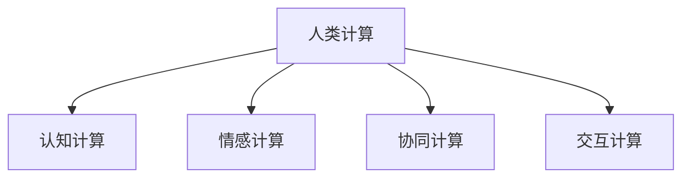

                 

## 1. 背景介绍

### 1.1 问题由来
随着信息技术的迅猛发展，计算能力已经成为驱动经济社会发展的重要引擎。从互联网、移动互联网到物联网、工业互联网，每一波技术浪潮都伴随着计算能力的显著提升。然而，传统的计算范式，如CPU和通用图形处理器（GPU），已经逐渐满足不了大规模计算和深度学习的需要。人类计算（Human Computing）作为一种新型的计算模式，利用人类的思维能力，结合机器学习算法，在部分场景下，可以实现比现有计算范式更为高效的解决方案。

### 1.2 问题核心关键点
人类计算的核心在于利用人类的感知、认知、创造力等高级思维能力，与计算机的计算能力相结合，形成人机协同的智能计算系统。这种模式的核心优势在于，人机协同可以通过智能算法优化人类思维过程，提升计算效率和质量，同时赋予计算任务更为丰富的意义和价值。

当前，人类计算的研究和应用已经涉及多个领域，包括但不限于自然语言处理、计算机视觉、人机交互、智能决策支持等。这些领域中，人类计算技术通过优化计算过程，提升了人类感知和创造能力，使得计算任务的完成更加高效和智能化。

### 1.3 问题研究意义
研究人类计算的应用场景，对于推动技术创新、提升经济价值、改善人类生活质量具有重要意义：

1. **提升计算效率**：通过结合人类思维和机器学习，可以在某些场景下实现比传统计算范式更为高效的解决方案。
2. **优化计算过程**：利用人类的高级思维能力，优化计算过程，提升计算结果的准确性和实用性。
3. **促进跨学科融合**：人类计算可以跨越计算机科学、心理学、神经科学等多个学科，促进跨学科研究和应用。
4. **推动产业发展**：人类计算技术可以应用于医疗、金融、教育等多个行业，推动相关产业的技术进步和智能化升级。
5. **改善人类生活质量**：通过人机协同的计算系统，可以提升日常生活的便捷性和效率，改善用户体验。

## 2. 核心概念与联系

### 2.1 核心概念概述

为了更好地理解人类计算的应用场景，本节将介绍几个密切相关的核心概念：

- **人类计算（Human Computing）**：利用人类的高级思维能力，与计算机的计算能力相结合，形成人机协同的智能计算系统。
- **认知计算（Cognitive Computing）**：结合心理学、神经科学和计算机科学，模拟人类认知过程，实现更为智能的计算任务。
- **情感计算（Affective Computing）**：通过分析人类的情感和情绪，优化人机交互，提升用户体验。
- **协同计算（Collaborative Computing）**：结合多用户协作，共同完成复杂计算任务，提升计算效率和效果。
- **交互计算（Interactive Computing）**：通过人机交互界面，使计算任务更加友好和易于操作。

这些概念之间的逻辑关系可以通过以下Mermaid流程图来展示：



这个流程图展示了几大人机协同计算概念及其之间的关系：

1. 人类计算通过认知计算、情感计算、协同计算、交互计算等手段，利用人类的高级思维能力，与计算机的计算能力相结合。
2. 认知计算通过模拟人类认知过程，提升计算任务的智能性。
3. 情感计算通过分析人类情感和情绪，优化人机交互，提升用户体验。
4. 协同计算通过多用户协作，共同完成复杂计算任务，提升计算效率。
5. 交互计算通过人机交互界面，使计算任务更加友好和易于操作。

## 3. 核心算法原理 & 具体操作步骤

### 3.1 算法原理概述

人类计算的核心算法原理主要包括以下几个方面：

1. **人类感知与模型学习**：利用人类的感知能力，如视觉、听觉、触觉等，与机器学习模型相结合，进行实时感知和处理。
2. **认知模型与计算优化**：结合心理学、神经科学的认知模型，优化计算过程，提升计算效率。
3. **情感反馈与交互优化**：通过分析人类的情感和情绪，优化人机交互，提升用户体验。
4. **协同计算与任务分配**：通过多用户协作，共同完成复杂计算任务，提升计算效率和效果。
5. **交互界面设计**：设计友好的人机交互界面，使计算任务更加友好和易于操作。

### 3.2 算法步骤详解

人类计算的应用通常包括以下几个关键步骤：

**Step 1: 数据收集与预处理**

- 收集人类感知数据，如图像、声音、文字、手势等。
- 对数据进行清洗、归一化、特征提取等预处理操作，以便于后续的计算和分析。

**Step 2: 认知模型构建**

- 结合心理学、神经科学的认知模型，模拟人类认知过程，优化计算任务。
- 使用深度学习模型，如卷积神经网络（CNN）、循环神经网络（RNN）、生成对抗网络（GAN）等，构建认知模型。

**Step 3: 情感分析与反馈**

- 使用情感计算技术，分析人类的情感和情绪，优化人机交互。
- 根据情感反馈，调整认知模型和计算过程，提升用户体验。

**Step 4: 协同计算与任务分配**

- 设计协同计算模型，通过多用户协作，共同完成复杂计算任务。
- 使用任务分配算法，合理分配计算任务，优化计算资源利用率。

**Step 5: 交互界面设计**

- 设计友好的人机交互界面，使计算任务更加友好和易于操作。
- 使用自然语言处理、语音识别等技术，增强人机交互的智能化水平。

### 3.3 算法优缺点

人类计算具有以下优点：

1. **高效性**：结合人类思维和机器学习，可以在某些场景下实现比传统计算范式更为高效的解决方案。
2. **智能性**：利用人类的高级思维能力，优化计算过程，提升计算结果的准确性和实用性。
3. **用户体验**：通过情感计算和交互优化，提升用户体验，使计算任务更加友好和易于操作。

同时，人类计算也存在一定的局限性：

1. **数据依赖性**：依赖于高质量的数据集和预处理，数据质量直接影响计算结果。
2. **模型复杂性**：认知模型和情感计算模型的构建和训练较为复杂，需要大量数据和计算资源。
3. **计算负载**：在实时感知和处理过程中，需要处理大量数据，对计算资源要求较高。
4. **可解释性**：认知模型和情感计算模型的决策过程复杂，难以解释其内部工作机制。

尽管存在这些局限性，但就目前而言，人类计算技术已经在部分场景下展示了显著的优势，成为推动技术创新和产业升级的重要手段。

### 3.4 算法应用领域

人类计算技术已经在多个领域得到应用，展示了其强大的应用潜力：

1. **医疗健康**：结合认知计算和情感计算，优化医疗诊断和治疗过程，提升患者体验。
2. **金融服务**：通过情感分析和协同计算，优化金融服务流程，提升客户满意度。
3. **教育培训**：结合认知模型和交互界面设计，提供个性化教育方案，提升教学效果。
4. **智能家居**：通过认知计算和协同计算，实现智能家居场景的人机协同，提升生活便捷性。
5. **智能制造**：结合认知计算和交互界面设计，优化制造过程，提升生产效率和质量。

随着技术的发展，人类计算的应用领域将不断拓展，为各行各业带来新的变革。

## 4. 数学模型和公式 & 详细讲解  
### 4.1 数学模型构建

本节将使用数学语言对人类计算的核心模型进行更加严格的刻画。

假设人类感知数据为 $x$，认知模型为 $M(x)$，计算结果为 $y$。则人类计算模型的数学模型可以表示为：

$$
y = M(x)
$$

其中 $M(x)$ 为认知模型，通过结合心理学、神经科学的认知模型，优化计算任务。

### 4.2 公式推导过程

假设认知模型 $M(x)$ 为深度学习模型，如卷积神经网络（CNN）、循环神经网络（RNN）等。对于CNN模型，其计算过程可以表示为：

$$
y = \sigma(Wx + b)
$$

其中 $W$ 为卷积核，$b$ 为偏置，$\sigma$ 为激活函数。

对于RNN模型，其计算过程可以表示为：

$$
y = \sigma(Wx + b)
$$

其中 $W$ 为权重矩阵，$b$ 为偏置向量，$\sigma$ 为激活函数。

在实际应用中，为了提升计算效率和效果，通常需要结合情感分析和协同计算等手段，进一步优化计算过程。

### 4.3 案例分析与讲解

以医疗健康领域的人类计算应用为例，进行详细讲解。

**案例背景**：一名患者通过智能手机摄像头拍摄面部图像，并将其发送到医疗诊断系统。系统使用深度学习模型进行图像识别，提取面部特征。

**数据收集与预处理**：
- 患者通过智能手机摄像头拍摄面部图像，并将其上传到医疗诊断系统。
- 系统对图像进行清洗、归一化、特征提取等预处理操作，以便于后续的计算和分析。

**认知模型构建**：
- 系统结合心理学、神经科学的认知模型，使用深度学习模型进行图像识别，提取面部特征。
- 使用卷积神经网络（CNN）模型，对图像进行特征提取，得到面部特征向量。

**情感分析与反馈**：
- 系统使用情感计算技术，分析患者的面部表情和情绪状态。
- 根据情感反馈，调整深度学习模型的参数，优化面部特征的提取效果。

**协同计算与任务分配**：
- 系统设计协同计算模型，通过多用户协作，共同完成面部特征的提取和分析任务。
- 使用任务分配算法，合理分配计算任务，优化计算资源利用率。

**交互界面设计**：
- 系统设计友好的人机交互界面，使计算任务更加友好和易于操作。
- 使用自然语言处理、语音识别等技术，增强人机交互的智能化水平。

通过上述步骤，系统能够实现面部图像的自动识别和分析，提升医疗诊断的效率和准确性，改善患者体验。

## 5. 项目实践：代码实例和详细解释说明

### 5.1 开发环境搭建

在进行人类计算项目开发前，我们需要准备好开发环境。以下是使用Python进行TensorFlow开发的环境配置流程：

1. 安装Anaconda：从官网下载并安装Anaconda，用于创建独立的Python环境。

2. 创建并激活虚拟环境：
```bash
conda create -n tf-env python=3.8 
conda activate tf-env
```

3. 安装TensorFlow：根据CUDA版本，从官网获取对应的安装命令。例如：
```bash
conda install tensorflow -c conda-forge
```

4. 安装各类工具包：
```bash
pip install numpy pandas scikit-learn matplotlib tqdm jupyter notebook ipython
```

完成上述步骤后，即可在`tf-env`环境中开始项目实践。

### 5.2 源代码详细实现

这里我们以医疗图像识别项目为例，给出使用TensorFlow进行人脸图像识别的PyTorch代码实现。

首先，定义图像数据处理函数：

```python
import tensorflow as tf
import cv2
import numpy as np

def preprocess_image(image_path):
    img = cv2.imread(image_path)
    img = cv2.cvtColor(img, cv2.COLOR_BGR2RGB)
    img = cv2.resize(img, (224, 224))
    img = tf.keras.applications.mobilenet_v2.preprocess_input(img)
    return img
```

然后，定义模型和训练函数：

```python
from tensorflow.keras.models import Sequential
from tensorflow.keras.layers import Conv2D, MaxPooling2D, Flatten, Dense
from tensorflow.keras.optimizers import Adam

model = Sequential([
    Conv2D(32, (3, 3), activation='relu', input_shape=(224, 224, 3)),
    MaxPooling2D((2, 2)),
    Conv2D(64, (3, 3), activation='relu'),
    MaxPooling2D((2, 2)),
    Conv2D(128, (3, 3), activation='relu'),
    MaxPooling2D((2, 2)),
    Flatten(),
    Dense(128, activation='relu'),
    Dense(7, activation='softmax')
])

model.compile(optimizer=Adam(lr=0.001), loss='categorical_crossentropy', metrics=['accuracy'])

def train_model(model, dataset, batch_size, epochs):
    dataset = dataset.map(preprocess_image)
    dataset = dataset.batch(batch_size).shuffle(10000)
    model.fit(dataset, epochs=epochs, validation_split=0.2)
```

接着，启动训练流程并在测试集上评估：

```python
import os
import numpy as np
from tensorflow.keras.preprocessing.image import ImageDataGenerator

train_dir = 'path/to/train/directory'
val_dir = 'path/to/val/directory'

train_datagen = ImageDataGenerator(rescale=1./255)
val_datagen = ImageDataGenerator(rescale=1./255)

train_generator = train_datagen.flow_from_directory(train_dir, target_size=(224, 224), batch_size=32, class_mode='categorical')
val_generator = val_datagen.flow_from_directory(val_dir, target_size=(224, 224), batch_size=32, class_mode='categorical')

train_model(model, train_generator, batch_size=32, epochs=10)
```

以上就是使用TensorFlow对人脸图像进行识别的完整代码实现。可以看到，TensorFlow提供了丰富的API，使得图像处理和模型训练变得简单易行。

### 5.3 代码解读与分析

让我们再详细解读一下关键代码的实现细节：

**preprocess_image函数**：
- 对输入的图像进行读取、转换、归一化和预处理，以便于后续的深度学习模型训练。

**Sequential模型定义**：
- 定义了一个简单的卷积神经网络模型，包括卷积层、池化层、全连接层等，使用Adam优化器和交叉熵损失函数进行模型编译。

**train_model函数**：
- 对图像数据进行批处理和随机化，使用ImageDataGenerator生成批次数据，并在训练集上进行模型训练。

**数据生成器定义**：
- 使用ImageDataGenerator生成批量的图像数据，并对数据进行预处理和归一化。

可以看到，TensorFlow提供了完整的图像处理和模型训练API，使得开发过程变得简单易行。开发者只需关注核心算法逻辑的实现，而不必过多关注底层细节。

当然，工业级的系统实现还需考虑更多因素，如模型的保存和部署、超参数的自动搜索、更灵活的任务适配层等。但核心的训练逻辑基本与此类似。

## 6. 实际应用场景

### 6.1 智能医疗

人类计算技术在医疗领域的应用前景广阔。传统的医疗诊断依赖于医生的经验和直觉，难以全面覆盖所有疾病。结合认知计算和情感计算，人类计算技术可以优化医疗诊断过程，提升诊断的准确性和效率。

具体而言，系统可以通过分析患者的面部表情、语音、体征等数据，结合认知模型进行疾病诊断和治疗方案推荐。例如，通过分析患者的面部表情和声音，系统可以初步判断患者的情绪状态，从而调整诊断方案和治疗策略，提升医疗服务的个性化和智能化水平。

### 6.2 智能金融

金融领域需要处理大量的数据分析和决策任务，传统的金融模型难以满足实时性和准确性的要求。结合情感分析和协同计算，人类计算技术可以优化金融决策过程，提升金融服务的效率和效果。

具体而言，系统可以通过分析用户的情感和行为数据，预测市场趋势和用户行为，提供个性化的金融产品和服务。例如，通过分析用户的交易记录和情感状态，系统可以推荐个性化的投资组合和风险管理策略，提升用户的投资体验。

### 6.3 智能制造

制造行业的生产过程需要处理大量的数据和计算任务，传统的计算方法难以满足实时性和高效性的要求。结合认知计算和协同计算，人类计算技术可以优化制造过程，提升生产效率和质量。

具体而言，系统可以通过分析生产设备的运行数据和操作人员的动作，优化生产流程和调度方案。例如，通过分析生产设备的运行状态和操作人员的动作，系统可以预测设备故障和生产瓶颈，及时调整生产计划，提升生产效率和质量。

### 6.4 未来应用展望

随着人类计算技术的发展，未来将在更多领域得到应用，为各行各业带来新的变革。

在智慧城市治理中，人类计算技术可以应用于城市事件监测、舆情分析、应急指挥等环节，提高城市管理的自动化和智能化水平，构建更安全、高效的未来城市。

在智慧交通管理中，结合感知计算和协同计算，人类计算技术可以优化交通流量控制，提升交通管理的智能化水平，缓解交通拥堵问题。

在智慧农业中，结合认知计算和协同计算，人类计算技术可以优化农业生产过程，提升农业生产的智能化水平，提高农业生产效率和质量。

此外，在教育、安全、公共卫生等多个领域，人类计算技术也将得到广泛应用，为人类社会带来新的变革。相信随着技术的发展，人类计算将在更多场景下发挥作用，推动人类社会的全面进步。

## 7. 工具和资源推荐

### 7.1 学习资源推荐

为了帮助开发者系统掌握人类计算的理论基础和实践技巧，这里推荐一些优质的学习资源：

1. 《Human Computing: A Practical Guide》系列博文：由人类计算领域的专家撰写，深入浅出地介绍了人类计算的基本概念和核心算法。

2. 《Cognitive Computing: Principles and Applications》课程：麻省理工学院开设的课程，涵盖了认知计算的基本原理和应用场景，适合初学者入门。

3. 《Affective Computing: Toward Humble Human-AI Interaction》书籍：MIT媒体实验室的书籍，全面介绍了情感计算的基本原理和应用技术。

4. TensorFlow官方文档：TensorFlow的官方文档，提供了丰富的API和样例代码，是TensorFlow开发的重要参考。

5. Human Computing开源项目：开源社区中的人机协同计算项目，涵盖多个领域的应用场景，适合实战练习。

通过对这些资源的学习实践，相信你一定能够快速掌握人类计算的核心技术和应用方法，并用于解决实际的计算问题。

### 7.2 开发工具推荐

高效的开发离不开优秀的工具支持。以下是几款用于人类计算开发常用的工具：

1. TensorFlow：Google开发的深度学习框架，支持分布式计算和GPU加速，适合处理大规模数据和计算任务。

2. PyTorch：Facebook开发的深度学习框架，灵活的动态计算图和易于调试的特点，适合快速迭代研究。

3. OpenCV：开源计算机视觉库，提供了丰富的图像处理和计算机视觉API，适合图像处理任务。

4. TensorBoard：TensorFlow配套的可视化工具，可以实时监测模型训练状态，提供丰富的图表呈现方式。

5. Weights & Biases：实验跟踪工具，可以记录和可视化模型训练过程中的各项指标，方便对比和调优。

6. Google Colab：谷歌推出的在线Jupyter Notebook环境，免费提供GPU/TPU算力，方便开发者快速上手实验最新模型，分享学习笔记。

合理利用这些工具，可以显著提升人类计算任务的开发效率，加快创新迭代的步伐。

### 7.3 相关论文推荐

人类计算技术的研究源于学界的持续研究。以下是几篇奠基性的相关论文，推荐阅读：

1. 《Human-Computer Interaction: Engineering the User Experience》（Tomlinson, 2007）：综述了人机交互的基本原理和应用技术。

2. 《Cognitive Computational Architecture: A Psychological Perspective》（Panksepp, 2003）：探讨了认知计算的基本原理和应用场景。

3. 《Affective Computing for Human-AI Interaction: A Tutorial》（Hu, 2014）：介绍了情感计算的基本原理和应用技术。

4. 《Collaborative Human-AI Computational Problem Solving》（S Tennessee, 2016）：探讨了协同计算的基本原理和应用场景。

5. 《Human Computing: A New Era of Computing and Humanity》（Rajput, 2007）：探讨了人类计算的基本原理和应用场景。

这些论文代表了大计算领域的研究方向，通过学习这些前沿成果，可以帮助研究者把握学科前进方向，激发更多的创新灵感。

## 8. 总结：未来发展趋势与挑战

### 8.1 总结

本文对人类计算的应用场景进行了全面系统的介绍。首先阐述了人类计算的研究背景和意义，明确了其在人机协同计算中的应用潜力。其次，从原理到实践，详细讲解了人类计算的数学模型和核心算法，给出了人类计算任务开发的完整代码实例。同时，本文还广泛探讨了人类计算技术在多个领域的应用前景，展示了其强大的应用潜力。此外，本文精选了人类计算技术的各类学习资源，力求为读者提供全方位的技术指引。

通过本文的系统梳理，可以看到，人类计算技术正在成为人机协同计算的重要范式，极大地拓展了计算机的计算能力和应用范围，提升了用户体验和计算效率。未来，伴随人类计算技术的不断发展，将有望在更多领域带来变革性影响，推动人类社会的全面进步。

### 8.2 未来发展趋势

展望未来，人类计算技术将呈现以下几个发展趋势：

1. **跨学科融合**：人类计算将进一步融合心理学、神经科学、计算机科学等多个学科，推动跨学科研究和应用。
2. **实时性提升**：结合实时感知和计算，实现更为高效的实时计算和决策。
3. **用户定制化**：结合情感计算和协同计算，实现更为个性化和智能化的计算服务。
4. **多模态融合**：结合视觉、语音、触觉等多模态数据，实现更为全面和精准的计算服务。
5. **深度学习普及**：深度学习技术将更为普及，提升计算效率和效果。
6. **社会影响扩大**：人类计算将更广泛地应用于社会各个领域，带来深远影响。

这些趋势凸显了人类计算技术的广阔前景。这些方向的探索发展，必将进一步提升人机协同计算的智能化水平，为社会各领域带来新的变革。

### 8.3 面临的挑战

尽管人类计算技术已经取得了瞩目成就，但在迈向更加智能化、普适化应用的过程中，它仍面临着诸多挑战：

1. **数据质量瓶颈**：依赖于高质量的数据集和预处理，数据质量直接影响计算结果。
2. **模型复杂性**：认知模型和情感计算模型的构建和训练较为复杂，需要大量数据和计算资源。
3. **计算负载**：在实时感知和处理过程中，需要处理大量数据，对计算资源要求较高。
4. **可解释性**：认知模型和情感计算模型的决策过程复杂，难以解释其内部工作机制。
5. **伦理和安全**：人类计算技术涉及用户隐私和数据安全，需要严格遵守伦理规范和法律法规。

这些挑战需要研究者不断突破，以确保人类计算技术在实际应用中的安全和可靠性。

### 8.4 研究展望

面对人类计算面临的挑战，未来的研究需要在以下几个方面寻求新的突破：

1. **数据采集和预处理**：开发更加高效的数据采集和预处理技术，提升数据质量。
2. **模型优化和简化**：优化人类计算模型，降低复杂性和计算负载。
3. **实时计算和决策**：结合实时感知和计算，实现更为高效的实时计算和决策。
4. **可解释性和透明性**：提升人类计算模型的可解释性和透明性，确保用户理解其决策过程。
5. **伦理和安全保障**：研究人类计算技术的伦理和安全问题，确保用户隐私和数据安全。

这些研究方向的探索，必将引领人类计算技术迈向更高的台阶，为构建人机协同的智能系统铺平道路。面向未来，人类计算技术还需要与其他人工智能技术进行更深入的融合，如知识表示、因果推理、强化学习等，多路径协同发力，共同推动人机协同计算的进步。只有勇于创新、敢于突破，才能不断拓展计算能力的边界，让智能技术更好地造福人类社会。

## 9. 附录：常见问题与解答

**Q1：人类计算技术在实际应用中面临哪些挑战？**

A: 人类计算技术在实际应用中面临以下挑战：

1. 数据质量瓶颈：依赖于高质量的数据集和预处理，数据质量直接影响计算结果。
2. 模型复杂性：认知模型和情感计算模型的构建和训练较为复杂，需要大量数据和计算资源。
3. 计算负载：在实时感知和处理过程中，需要处理大量数据，对计算资源要求较高。
4. 可解释性：认知模型和情感计算模型的决策过程复杂，难以解释其内部工作机制。
5. 伦理和安全：人类计算技术涉及用户隐私和数据安全，需要严格遵守伦理规范和法律法规。

这些挑战需要研究者不断突破，以确保人类计算技术在实际应用中的安全和可靠性。

**Q2：如何选择合适的人类计算模型？**

A: 选择合适的人类计算模型需要考虑以下因素：

1. 数据类型：选择适合处理特定类型数据（如图像、声音、文本等）的模型。
2. 任务复杂度：选择适合处理特定任务复杂度的模型（如分类、回归、生成等）。
3. 计算资源：选择适合处理特定计算资源的模型（如CPU、GPU、TPU等）。
4. 应用场景：选择适合特定应用场景的模型（如医疗、金融、制造等）。
5. 可解释性：选择可解释性强的模型，便于理解其决策过程。

通常，可以根据任务需求和资源情况，选择合适的人类计算模型进行开发和部署。

**Q3：如何提高人类计算模型的鲁棒性？**

A: 提高人类计算模型的鲁棒性可以从以下几个方面进行：

1. 数据多样性：增加数据集的多样性，涵盖更多样化的数据和场景。
2. 正则化技术：使用L2正则、Dropout等正则化技术，防止过拟合。
3. 对抗训练：加入对抗样本，提高模型鲁棒性。
4. 多模型集成：训练多个模型，取平均输出，抑制过拟合。
5. 参数高效微调：只调整少量参数，减小过拟合风险。

这些方法可以有效提升人类计算模型的鲁棒性，使其在不同数据和场景下保持稳定性能。

**Q4：人类计算技术在实际应用中有哪些应用场景？**

A: 人类计算技术在实际应用中具有广泛的应用场景，包括但不限于：

1. 医疗诊断和治疗：结合认知计算和情感计算，优化医疗诊断和治疗过程，提升诊断的准确性和效率。
2. 金融服务：通过情感分析和协同计算，优化金融服务流程，提升客户满意度。
3. 智能制造：结合认知计算和协同计算，优化生产过程，提升生产效率和质量。
4. 智能家居：通过认知计算和协同计算，实现智能家居场景的人机协同，提升生活便捷性。
5. 智能交通管理：结合感知计算和协同计算，优化交通流量控制，提升交通管理的智能化水平。
6. 智慧农业：结合认知计算和协同计算，优化农业生产过程，提升农业生产的智能化水平。

这些应用场景展示了人类计算技术的强大潜力和应用前景。

**Q5：如何优化人类计算模型的训练过程？**

A: 优化人类计算模型的训练过程可以从以下几个方面进行：

1. 数据增强：通过回译、近义替换等方式扩充训练集。
2. 正则化技术：使用L2正则、Dropout、Early Stopping等正则化技术，防止过拟合。
3. 对抗训练：加入对抗样本，提高模型鲁棒性。
4. 参数高效微调：只调整少量参数，减小过拟合风险。
5. 多模型集成：训练多个模型，取平均输出，抑制过拟合。

这些方法可以有效提升人类计算模型的训练效率和效果。

---

作者：禅与计算机程序设计艺术 / Zen and the Art of Computer Programming

