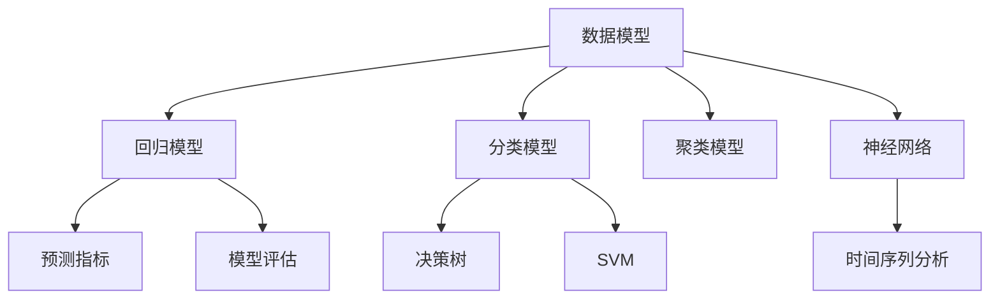

                 

# 模型思维在管理培训中的运用

> 关键词：模型思维,管理培训,数据分析,人工智能,决策制定,绩效评估,组织架构,预测模型

## 1. 背景介绍

### 1.1 问题由来
随着企业竞争的加剧，现代管理实践面临着前所未有的挑战。如何在纷繁复杂的商业环境中做出正确的决策，提升企业的绩效和竞争力？模型思维作为一种数据驱动的决策工具，为管理实践提供了新的视角和方法。通过引入模型思维，可以更好地量化和评估管理决策的效果，提升管理水平和业务表现。

### 1.2 问题核心关键点
模型思维是指通过建立和管理数据模型，辅助决策过程，提高组织效能的思维方式。在管理培训中，模型思维主要应用于以下几个关键点：

- 数据分析：通过数据挖掘和分析，洞察业务本质，发现潜在问题。
- 决策制定：建立预测模型，预测未来趋势，制定科学合理的决策方案。
- 绩效评估：使用模型评估员工和团队的绩效，提高考核的公平性和准确性。
- 组织架构：通过数据分析，优化组织架构，提高资源配置效率。
- 人力资源管理：使用模型预测员工流失，优化招聘和培训策略。

通过在管理培训中引入模型思维，可以系统地提升管理者的数据素养，使他们具备通过数据洞察和决策的能力。

### 1.3 问题研究意义
模型思维在管理培训中的运用，对于提升企业的管理水平、优化决策过程、提升组织效能具有重要意义：

1. 提升数据素养：模型思维强调数据在管理决策中的重要性，有助于管理者提高数据素养，培养基于数据的决策习惯。
2. 优化决策过程：模型思维提供了一种系统的、量化的决策框架，可以帮助管理者在复杂环境中做出更为精准的决策。
3. 提升组织效能：通过数据分析和模型评估，企业可以更科学地配置资源，优化管理流程，提升整体运营效率。
4. 促进人力资源管理：模型思维可以帮助企业预测员工流失，优化招聘和培训策略，提高员工满意度和留存率。
5. 推动管理创新：模型思维的引入可以激发管理者的创新思维，探索更多的管理策略和方法。

## 2. 核心概念与联系

### 2.1 核心概念概述

为更好地理解模型思维在管理培训中的应用，本节将介绍几个密切相关的核心概念：

- 数据模型(Data Model)：用于描述和管理数据的数学模型，包括描述性模型、预测模型等。
- 预测模型(Prediction Model)：通过历史数据训练，用于预测未来趋势或结果的模型。
- 回归模型(Regression Model)：用于预测连续型变量的模型，如线性回归、多项式回归等。
- 分类模型(Classification Model)：用于预测离散型变量的模型，如逻辑回归、决策树、随机森林等。
- 聚类模型(Clustering Model)：用于将数据分为不同类别的模型，如K-means、层次聚类等。
- 决策树(Decision Tree)：通过树形结构表示决策过程的模型。
- 支持向量机(Support Vector Machine, SVM)：用于分类和回归的强有力模型。
- 神经网络(Neural Network)：受人类神经系统启发，通过多层神经元网络实现复杂建模。
- 时间序列分析(Time Series Analysis)：用于处理时间依赖数据的模型，如ARIMA、LSTM等。
- 预测指标(Predictive Metrics)：用于评估模型预测性能的指标，如准确率、召回率、F1分数等。
- 模型评估(Model Evaluation)：通过测试数据集，评估模型预测性能的过程。

这些核心概念之间的逻辑关系可以通过以下Mermaid流程图来展示：



这个流程图展示了几类关键的数据模型及其相互关系：

1. 数据模型是基础，包括回归、分类、聚类等不同类型的模型。
2. 回归模型和分类模型是最常用的预测模型，分别用于连续型和离散型变量的预测。
3. 决策树和SVM是常用的经典模型，适用于不同场景下的分类和回归问题。
4. 神经网络是强大的模型，能够处理复杂的非线性关系，适用于大规模数据。
5. 时间序列分析针对时间依赖数据，能够捕捉数据的趋势和周期性。
6. 预测指标和模型评估用于评估模型的性能，指导模型的改进。

这些概念共同构成了模型思维在管理培训中的理论基础，使管理者能够基于数据模型进行科学决策。

## 3. 核心算法原理 & 具体操作步骤
### 3.1 算法原理概述

模型思维在管理培训中的应用，本质上是一个数据驱动的决策过程。其核心思想是通过建立和管理数据模型，辅助决策过程，提高组织效能。

形式化地，假设有一组历史数据 $D=\{(x_i,y_i)\}_{i=1}^N$，其中 $x_i$ 为输入变量，$y_i$ 为输出变量，即标签。模型的目标是通过历史数据训练一个映射函数 $f$，使得对于新的输入数据 $x$，模型能够预测输出 $y$。

具体地，模型通过以下步骤完成训练：

1. 数据准备：收集和管理历史数据，处理缺失值、异常值等，确保数据质量。
2. 特征工程：选择和构造合适的特征变量，提取有用的信息。
3. 模型选择：根据问题类型和数据特性，选择适合的模型类型，如线性回归、决策树、神经网络等。
4. 模型训练：使用训练数据集，通过优化算法训练模型，使其最小化预测误差。
5. 模型评估：使用测试数据集评估模型性能，选择合适的评估指标。
6. 模型应用：使用模型对新数据进行预测，辅助决策过程。

通过上述步骤，模型思维帮助管理者从数据中挖掘出潜在的规律和趋势，辅助决策制定，提高管理效率和效果。

### 3.2 算法步骤详解

以下详细解释模型思维在管理培训中应用的具体操作步骤：

**Step 1: 数据准备**
- 收集历史数据，包括输入变量 $x$ 和输出变量 $y$，确保数据完整性和准确性。
- 处理缺失值、异常值等，保证数据质量。
- 将数据划分为训练集和测试集，一般使用70%的数据用于训练，30%的数据用于测试。

**Step 2: 特征工程**
- 选择和构造合适的特征变量，提取有用的信息。
- 特征选择：根据领域知识和经验，选择对问题有较大影响的特征。
- 特征构造：通过数据转换、组合等方法，构造新的特征变量，提高模型的预测能力。
- 特征归一化：将特征变量标准化，防止某些特征对模型产生过大影响。

**Step 3: 模型选择**
- 根据问题类型和数据特性，选择合适的模型类型。
- 回归问题：选择线性回归、多项式回归等模型。
- 分类问题：选择逻辑回归、决策树、随机森林等模型。
- 时间序列问题：选择ARIMA、LSTM等模型。
- 聚类问题：选择K-means、层次聚类等模型。

**Step 4: 模型训练**
- 使用训练数据集，通过优化算法训练模型，使其最小化预测误差。
- 回归问题：使用最小二乘法、梯度下降等优化算法。
- 分类问题：使用交叉熵损失、对数损失等优化算法。
- 神经网络：使用反向传播算法、梯度下降等优化算法。
- 时间序列：使用梯度下降、LSTM等优化算法。

**Step 5: 模型评估**
- 使用测试数据集评估模型性能，选择合适的评估指标。
- 回归问题：使用均方误差(MSE)、均方根误差(RMSE)等指标。
- 分类问题：使用准确率、召回率、F1分数等指标。
- 神经网络：使用损失函数、梯度范数等指标。
- 时间序列：使用MAE、MAPE等指标。

**Step 6: 模型应用**
- 使用模型对新数据进行预测，辅助决策过程。
- 回归问题：预测未来趋势，制定业务策略。
- 分类问题：预测客户流失、员工绩效等。
- 神经网络：预测市场变化、客户行为等。
- 时间序列：预测销售趋势、库存需求等。

以上是模型思维在管理培训中应用的一般流程。在实际应用中，还需要根据具体问题进行优化设计，如改进模型选择策略、调整超参数等，以进一步提升模型性能。

### 3.3 算法优缺点

模型思维在管理培训中的应用具有以下优点：

1. 数据驱动：基于数据进行决策，提高决策的科学性和准确性。
2. 量化分析：通过数据模型，量化分析业务问题和变化趋势，提高分析效率。
3. 自动化决策：使用预测模型，自动化生成决策建议，减少人工干预。
4. 风险控制：通过模型评估，提前识别风险点，提高管理决策的鲁棒性。

同时，该方法也存在一些局限性：

1. 数据质量依赖：模型思维的效果高度依赖数据质量，数据缺失、异常值等会影响模型性能。
2. 模型复杂度高：一些复杂模型需要大量的计算资源和时间，可能不适用于实时性要求高的场景。
3. 模型解释性不足：某些高级模型如神经网络等，难以解释其内部工作机制，缺乏透明性。
4. 过度依赖数据：模型思维强调数据的重要性，但在数据质量不可靠或缺乏数据的情况下，可能无法发挥作用。
5. 模型误用风险：不合理的模型选择或超参数设置可能导致模型误用，产生错误的预测结果。

尽管存在这些局限性，但模型思维在管理培训中的应用，仍然具备显著的实用价值和潜力。

### 3.4 算法应用领域

模型思维在管理培训中的应用，已经广泛渗透到多个领域，涵盖了企业管理、运营、营销、人力资源等多个方面。

**企业管理**：
- 战略规划：通过数据分析，预测市场趋势，制定长期战略规划。
- 绩效管理：使用模型评估员工绩效，提供个性化的绩效反馈。
- 风险管理：识别和管理潜在风险，制定风险应对策略。

**运营管理**：
- 生产优化：通过数据分析，优化生产流程，提高生产效率。
- 供应链管理：预测供应链变化，优化库存和物流管理。
- 质量控制：使用模型预测产品质量，提升质量控制水平。

**营销管理**：
- 客户分析：通过客户数据分析，识别高价值客户，制定精准的营销策略。
- 市场预测：预测市场需求变化，优化营销预算分配。
- 广告优化：使用模型优化广告投放效果，提高广告转化率。

**人力资源管理**：
- 人才招聘：预测候选人流失率，优化招聘策略。
- 员工培训：使用模型预测员工学习效果，制定针对性的培训计划。
- 绩效考核：使用模型评估员工绩效，提高考核的公正性和效率。

此外，模型思维还在金融风险管理、产品开发、市场分析等多个领域得到了广泛应用，展示了其在管理实践中的强大生命力。

## 4. 数学模型和公式 & 详细讲解
### 4.1 数学模型构建

本节将使用数学语言对模型思维在管理培训中的应用进行更加严格的刻画。

假设有一组历史数据 $D=\{(x_i,y_i)\}_{i=1}^N$，其中 $x_i$ 为输入变量，$y_i$ 为输出变量，即标签。模型的目标是通过历史数据训练一个映射函数 $f$，使得对于新的输入数据 $x$，模型能够预测输出 $y$。

定义模型 $M_{\theta}$ 在输入 $x$ 上的预测结果为 $\hat{y}=M_{\theta}(x)$，其中 $\theta$ 为模型参数。则模型的损失函数定义为：

$$
\mathcal{L}(\theta) = \frac{1}{N} \sum_{i=1}^N \ell(y_i, M_{\theta}(x_i))
$$

其中 $\ell(y_i, M_{\theta}(x_i))$ 为损失函数，用于衡量模型预测结果与真实标签之间的差异。常见的损失函数包括均方误差损失、交叉熵损失等。

通过梯度下降等优化算法，模型 $M_{\theta}$ 不断更新参数 $\theta$，最小化损失函数 $\mathcal{L}(\theta)$，使得模型预测结果逼近真实标签。最终得到适应特定管理问题的最优模型参数 $\hat{\theta}$。

### 4.2 公式推导过程

以下我们以线性回归模型为例，推导其损失函数和梯度公式。

假设模型 $M_{\theta}$ 在输入 $x$ 上的预测结果为 $\hat{y}=M_{\theta}(x)=\theta_0+\theta_1x_1+\theta_2x_2+\ldots+\theta_nx_n$，其中 $\theta_0, \theta_1, \ldots, \theta_n$ 为模型参数。则均方误差损失函数定义为：

$$
\ell(y_i, M_{\theta}(x_i)) = (y_i - M_{\theta}(x_i))^2
$$

将损失函数代入经验风险公式，得：

$$
\mathcal{L}(\theta) = \frac{1}{N} \sum_{i=1}^N (y_i - M_{\theta}(x_i))^2
$$

对模型参数 $\theta$ 求偏导，得：

$$
\frac{\partial \mathcal{L}(\theta)}{\partial \theta_k} = -\frac{2}{N} \sum_{i=1}^N (y_i - M_{\theta}(x_i))x_{ki}
$$

其中 $k=0,1,\ldots,n$。根据梯度下降算法，模型参数更新公式为：

$$
\theta_k \leftarrow \theta_k - \eta \frac{\partial \mathcal{L}(\theta)}{\partial \theta_k}
$$

其中 $\eta$ 为学习率，控制模型参数更新的步长。

在得到损失函数的梯度后，即可带入参数更新公式，完成模型的迭代优化。重复上述过程直至收敛，最终得到适应管理问题的最优模型参数 $\hat{\theta}$。

## 5. 项目实践：代码实例和详细解释说明
### 5.1 开发环境搭建

在进行模型思维在管理培训中的应用实践前，我们需要准备好开发环境。以下是使用Python进行Scikit-learn开发的环境配置流程：

1. 安装Anaconda：从官网下载并安装Anaconda，用于创建独立的Python环境。

2. 创建并激活虚拟环境：
```bash
conda create -n sklearn-env python=3.8 
conda activate sklearn-env
```

3. 安装Scikit-learn：
```bash
pip install scikit-learn
```

4. 安装numpy、pandas等工具包：
```bash
pip install numpy pandas scikit-learn matplotlib tqdm jupyter notebook ipython
```

完成上述步骤后，即可在`sklearn-env`环境中开始模型思维的实践。

### 5.2 源代码详细实现

下面我们以线性回归模型在企业管理中的实际应用为例，给出使用Scikit-learn库进行模型训练的Python代码实现。

首先，定义数据处理函数：

```python
import pandas as pd
import numpy as np

def load_data(file_path):
    data = pd.read_csv(file_path)
    x = data[['feature1', 'feature2', 'feature3']]
    y = data['target']
    return x, y
```

然后，定义模型训练函数：

```python
from sklearn.linear_model import LinearRegression
from sklearn.metrics import mean_squared_error

def train_model(x_train, y_train, x_test, y_test):
    model = LinearRegression()
    model.fit(x_train, y_train)
    y_pred = model.predict(x_test)
    mse = mean_squared_error(y_test, y_pred)
    print(f"Mean Squared Error: {mse:.2f}")
```

接着，定义模型评估函数：

```python
from sklearn.model_selection import train_test_split

def evaluate_model(x, y):
    x_train, x_test, y_train, y_test = train_test_split(x, y, test_size=0.2, random_state=42)
    train_model(x_train, y_train, x_test, y_test)
```

最后，启动模型训练流程：

```python
data = load_data('data.csv')
evaluate_model(data[0], data[1])
```

以上就是使用Scikit-learn进行线性回归模型训练的完整代码实现。可以看到，得益于Scikit-learn的强大封装，我们可以用相对简洁的代码完成模型的训练和评估。

### 5.3 代码解读与分析

让我们再详细解读一下关键代码的实现细节：

**load_data函数**：
- 从CSV文件中加载数据，选择输入特征和输出目标变量。
- 返回数据集的分裂形式。

**train_model函数**：
- 定义线性回归模型，并使用训练数据集进行拟合。
- 使用测试数据集进行预测，并计算均方误差。
- 输出均方误差。

**evaluate_model函数**：
- 将数据集划分为训练集和测试集。
- 调用train_model函数进行模型训练和评估。

**训练流程**：
- 加载数据集。
- 调用evaluate_model函数进行模型评估。

可以看到，Scikit-learn提供了丰富的模型和算法接口，使模型思维的实践变得简洁高效。开发者可以将更多精力放在模型选择和评估上，而不必过多关注底层的实现细节。

当然，工业级的系统实现还需考虑更多因素，如模型的保存和部署、超参数的自动搜索、更灵活的特征工程等。但核心的模型训练和评估流程基本与此类似。

## 6. 实际应用场景
### 6.1 智能客服系统

模型思维在智能客服系统的应用中，可以显著提升客服服务的智能化水平。传统客服往往需要配备大量人力，高峰期响应缓慢，且一致性和专业性难以保证。通过模型思维，可以实现智能客服系统的构建，从而提升服务质量和效率。

具体而言，可以收集企业内部的历史客服对话记录，将问题和最佳答复构建成监督数据，在此基础上对线性回归等模型进行微调。微调后的模型能够自动理解用户意图，匹配最合适的答案模板进行回复。对于客户提出的新问题，还可以接入检索系统实时搜索相关内容，动态组织生成回答。如此构建的智能客服系统，能大幅提升客户咨询体验和问题解决效率。

### 6.2 金融舆情监测

在金融领域，模型思维可以用于舆情监测和风险管理。金融机构需要实时监测市场舆论动向，以便及时应对负面信息传播，规避金融风险。传统的人工监测方式成本高、效率低，难以应对网络时代海量信息爆发的挑战。通过模型思维，可以实现基于大数据的舆情监测和风险预警，提高金融机构的风险控制能力。

具体而言，可以收集金融领域相关的新闻、报道、评论等文本数据，并对其进行情感分析、主题分类等处理。在此基础上对线性回归、SVM等模型进行微调，使其能够自动判断文本属于何种主题，情感倾向是正面、中性还是负面。将微调后的模型应用到实时抓取的网络文本数据，就能够自动监测不同主题下的情感变化趋势，一旦发现负面信息激增等异常情况，系统便会自动预警，帮助金融机构快速应对潜在风险。

### 6.3 个性化推荐系统

模型思维在个性化推荐系统中，可以提供更为精准的推荐效果。当前的推荐系统往往只依赖用户的历史行为数据进行物品推荐，无法深入理解用户的真实兴趣偏好。通过模型思维，可以实现基于用户画像和行为数据的推荐，提升推荐系统的智能性和个性化程度。

在实践中，可以收集用户浏览、点击、评论、分享等行为数据，提取和用户交互的物品标题、描述、标签等文本内容。将文本内容作为模型输入，用户的后续行为（如是否点击、购买等）作为监督信号，在此基础上对线性回归、神经网络等模型进行微调。微调后的模型能够从文本内容中准确把握用户的兴趣点。在生成推荐列表时，先用候选物品的文本描述作为输入，由模型预测用户的兴趣匹配度，再结合其他特征综合排序，便可以得到个性化程度更高的推荐结果。

### 6.4 未来应用展望

随着模型思维和数据驱动决策范式的发展，其在企业管理中的应用前景将更加广阔。

在智慧制造领域，模型思维可以用于生产流程优化、设备维护预测等，提高生产效率和设备利用率。

在智能物流领域，模型思维可以用于路线优化、库存管理等，降低物流成本，提升配送效率。

在人力资源管理中，模型思维可以用于员工流失预测、绩效评估等，优化人力资源配置，提高员工满意度。

此外，在医疗健康、电子商务、智慧城市等众多领域，模型思维的应用也将不断深化，推动各行业的智能化转型。相信随着模型思维的不断发展，其在企业管理中的应用将更加广泛，为企业的数字化、智能化转型提供重要支持。

## 7. 工具和资源推荐
### 7.1 学习资源推荐

为了帮助开发者系统掌握模型思维在管理培训中的应用，这里推荐一些优质的学习资源：

1. 《Python数据科学手册》：一本详细介绍Python数据科学库（如NumPy、Pandas、Scikit-learn等）的书籍，适合初学者学习。

2. Kaggle竞赛平台：提供大量数据集和机器学习竞赛项目，可以实践和提升数据素养。

3. Coursera《数据科学》课程：由Johns Hopkins大学开设，系统介绍数据科学的基础知识和实践技能。

4. edX《机器学习》课程：由MIT等顶尖学府开设，深入浅出地讲解机器学习的基本原理和算法。

5. O'Reilly《模型思维》书籍：介绍模型思维的核心概念和方法，适合进阶学习。

通过对这些资源的学习实践，相信你一定能够快速掌握模型思维在管理培训中的应用，并用于解决实际的业务问题。

### 7.2 开发工具推荐

高效的开发离不开优秀的工具支持。以下是几款用于模型思维在管理培训中应用开发的常用工具：

1. Jupyter Notebook：交互式开发环境，支持Python代码编写和数据可视化，适合数据分析和模型开发。

2. Tableau：商业智能工具，支持数据可视化和报表生成，适合数据探索和业务洞察。

3. Python：强大的编程语言，适合数据科学和机器学习任务开发。

4. R语言：数据统计和分析工具，适合统计建模和数据可视化。

5. Scikit-learn：Python数据科学库，提供丰富的机器学习算法和工具，适合模型开发和评估。

6. TensorFlow：由Google主导开发的深度学习框架，适合大规模深度学习任务开发。

合理利用这些工具，可以显著提升模型思维在管理培训中的应用效率，加快创新迭代的步伐。

### 7.3 相关论文推荐

模型思维在管理培训中的应用，源于学界的持续研究。以下是几篇奠基性的相关论文，推荐阅读：

1. "The Elements of Statistical Learning"：由Tibshirani等人著作，详细介绍统计学习的基本概念和算法，是数据科学领域的经典之作。

2. "Pattern Recognition and Machine Learning"：由Christopher Bishop著作，详细介绍机器学习的基本原理和应用，适合进阶学习。

3. "Introduction to Statistical Learning"：由Gareth James等人著作，详细介绍统计学习的基本概念和算法，适合初学者学习。

4. "A Survey of Recent Advances in Machine Learning"：由Gérard Biau等人著作，系统回顾机器学习的最新进展，适合学术研究。

5. "The Power of Data Science"：由Susan Blackwell等人著作，介绍数据科学的基本概念和方法，适合非专业读者学习。

这些论文代表了大数据和机器学习在企业管理中的应用发展脉络，通过学习这些前沿成果，可以帮助研究者把握学科前进方向，激发更多的创新灵感。

## 8. 总结：未来发展趋势与挑战
### 8.1 总结

本文对模型思维在管理培训中的应用进行了全面系统的介绍。首先阐述了模型思维的理论基础和应用场景，明确了其在提升企业管理水平、优化决策过程、提高组织效能等方面的独特价值。其次，从原理到实践，详细讲解了模型思维在管理培训中应用的具体操作步骤，给出了模型训练的完整代码实例。同时，本文还广泛探讨了模型思维在多个行业领域的应用前景，展示了其强大的生命力。

通过本文的系统梳理，可以看到，模型思维在管理培训中的应用，已经成为推动企业管理智能化转型的一个重要手段。模型思维通过数据驱动的决策过程，为管理者提供了科学的决策工具和方法，使他们能够更加高效、精准地应对复杂的管理挑战。未来，随着大数据和机器学习技术的发展，模型思维将在更多领域得到应用，为各行各业带来深远的变革。

### 8.2 未来发展趋势

展望未来，模型思维在管理培训中的应用将呈现以下几个发展趋势：

1. 数据驱动的决策将成为管理实践的主流。随着数据量的不断增加和数据技术的不断进步，企业将更加依赖数据驱动的决策过程，实现业务的高效和精准管理。

2. 智能化的管理决策系统将成为常态。模型思维的应用将推动企业建设智能化的决策支持系统，提升决策的科学性和准确性。

3. 实时化的管理决策将成为可能。通过引入时间序列分析和在线预测模型，企业将能够实现实时化的管理决策，应对瞬息万变的市场变化。

4. 跨领域的应用将更加广泛。模型思维的应用将扩展到更多的领域，如金融、医疗、制造等，为各行业的智能化转型提供技术支持。

5. 数据素养将成为管理者的必备技能。随着数据在管理决策中的重要性日益凸显，数据素养将成为管理者必须具备的关键能力。

6. 模型的透明性和可解释性将得到重视。未来，模型思维的应用将更加关注模型的透明性和可解释性，提升管理决策的可信度和公平性。

以上趋势凸显了模型思维在管理培训中的重要地位和广阔前景，为企业管理智能化转型提供了新的方向。

### 8.3 面临的挑战

尽管模型思维在管理培训中的应用已经取得显著进展，但在实际应用过程中，仍面临诸多挑战：

1. 数据质量和安全问题。模型思维的效果高度依赖数据质量，数据缺失、异常值等会影响模型性能。同时，数据隐私和安全问题也需要引起重视。

2. 模型的复杂性和可解释性。一些高级模型如神经网络等，难以解释其内部工作机制，缺乏透明性。模型的复杂性也会增加管理决策的风险。

3. 模型的误用风险。不合理的模型选择或超参数设置可能导致模型误用，产生错误的预测结果。

4. 跨部门的数据整合问题。模型思维的应用需要跨部门的数据整合，但不同部门的数据格式和标准可能不一致，需要协调和规范。

5. 模型的动态维护问题。模型思维的应用需要持续的数据输入和模型更新，但如何保证模型的动态维护和持续优化，还需要进一步探索。

6. 管理者的数据素养问题。尽管数据素养将成为管理者的必备技能，但如何系统地提升管理者的数据素养，还需要更多的培训和教育。

正视这些挑战，积极应对并寻求突破，将是大数据和机器学习在企业管理中应用的必由之路。相信随着数据技术的不断进步和理论研究的持续深入，这些挑战终将一一被克服，模型思维在管理培训中的应用将更加成熟和高效。

### 8.4 研究展望

面对模型思维在管理培训中的诸多挑战，未来的研究需要在以下几个方面寻求新的突破：

1. 数据质量和安全的提升。通过数据清洗、异常值检测等方法，提升数据质量。同时，引入数据加密、隐私保护等技术，保障数据安全。

2. 模型透明性和可解释性的增强。开发更加透明、可解释的模型，如可解释的神经网络、决策树等，提高模型使用的可信度。

3. 模型的动态维护和优化。研究动态数据流管理技术，保证模型的动态维护和持续优化。

4. 跨部门的数据整合。制定统一的数据标准和规范，推动跨部门的数据整合。

5. 管理者的数据素养提升。通过系统化的培训和教育，提升管理者的数据素养，培养基于数据的管理习惯。

这些研究方向的探索，必将引领模型思维在管理培训中的应用迈向更高的台阶，为企业的智能化转型提供更坚实的技术基础。面向未来，模型思维需要与其他人工智能技术进行更深入的融合，如知识图谱、自然语言处理等，共同推动企业管理智能化进程。只有勇于创新、敢于突破，才能不断拓展模型思维的边界，让数据驱动的决策成为企业管理的新常态。

## 9. 附录：常见问题与解答

**Q1：模型思维是否适用于所有管理问题？**

A: 模型思维在许多管理问题上都有应用前景，但并非适用于所有问题。对于某些高度依赖人类直觉和经验的问题，模型思维可能难以提供有效的解决方案。因此，在应用模型思维时，需要根据具体情况进行判断和选择。

**Q2：模型思维如何处理数据质量问题？**

A: 模型思维的效果高度依赖数据质量，因此处理数据质量问题是关键。常见的处理方式包括：
1. 数据清洗：删除或修复缺失值、异常值等。
2. 数据增强：通过数据扩充、生成等方法，增加数据量。
3. 特征工程：选择和构造合适的特征变量，提高模型预测能力。
4. 数据标准化：将数据进行归一化、标准化等处理，提高模型鲁棒性。

**Q3：模型思维如何选择合适的模型类型？**

A: 选择合适的模型类型需要考虑多个因素，包括问题类型、数据特性、计算资源等。一般建议从简单的模型开始，逐步尝试更复杂的模型。常见的模型类型包括：
1. 线性回归：适用于预测连续型变量。
2. 逻辑回归：适用于预测离散型变量。
3. 决策树：适用于分类和回归问题。
4. 随机森林：适用于提高模型的泛化能力和稳定性。
5. 神经网络：适用于处理复杂的非线性关系。
6. 时间序列分析：适用于处理时间依赖数据。

**Q4：模型思维在管理培训中的学习资源推荐有哪些？**

A: 以下是一些推荐的模型思维学习资源：
1. 《Python数据科学手册》：详细讲解Python数据科学库的使用方法。
2. Kaggle竞赛平台：提供大量数据集和机器学习竞赛项目。
3. Coursera《数据科学》课程：系统介绍数据科学的基本知识和实践技能。
4. edX《机器学习》课程：深入浅出地讲解机器学习的基本原理和算法。
5. O'Reilly《模型思维》书籍：介绍模型思维的核心概念和方法。

**Q5：模型思维在企业管理中的开发工具推荐有哪些？**

A: 以下是一些推荐的模型思维在企业管理中的应用开发工具：
1. Jupyter Notebook：交互式开发环境，支持Python代码编写和数据可视化。
2. Tableau：商业智能工具，支持数据可视化和报表生成。
3. Python：强大的编程语言，适合数据科学和机器学习任务开发。
4. R语言：数据统计和分析工具，适合统计建模和数据可视化。
5. Scikit-learn：Python数据科学库，提供丰富的机器学习算法和工具。
6. TensorFlow：深度学习框架，适合大规模深度学习任务开发。

通过合理利用这些工具，可以显著提升模型思维在企业管理中的应用效率，加快创新迭代的步伐。

**Q6：模型思维在管理培训中的研究展望有哪些？**

A: 以下是一些推荐的模型思维在管理培训中的研究展望：
1. 数据质量和安全的提升：通过数据清洗、异常值检测等方法，提升数据质量。引入数据加密、隐私保护等技术，保障数据安全。
2. 模型透明性和可解释性的增强：开发更加透明、可解释的模型，如可解释的神经网络、决策树等。
3. 模型的动态维护和优化：研究动态数据流管理技术，保证模型的动态维护和持续优化。
4. 跨部门的数据整合：制定统一的数据标准和规范，推动跨部门的数据整合。
5. 管理者的数据素养提升：通过系统化的培训和教育，提升管理者的数据素养，培养基于数据的管理习惯。

通过这些研究方向的探索，模型思维在管理培训中的应用将更加成熟和高效，为企业管理智能化转型提供坚实的技术基础。

---

作者：禅与计算机程序设计艺术 / Zen and the Art of Computer Programming

