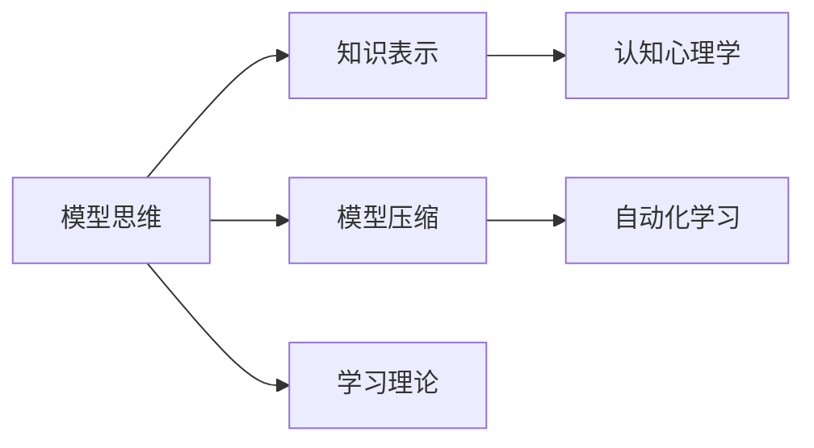

                 

# 模型思维的应用:快速掌握新知识

> 关键词：模型思维,知识表示,认知心理学,模型压缩,自动化,学习理论

## 1. 背景介绍

在现代社会中，知识的获取和应用已经成为了一项复杂而繁琐的任务。传统的知识获取方式，如阅读书籍、观看视频、听讲座等，往往需要耗费大量的时间和精力，且难以将知识真正内化为自己的认知能力。而在信息技术迅猛发展的今天，模型思维应运而生，通过构建知识模型，将复杂的知识表示为结构化的数据，可以快速、有效地掌握新知识。

模型思维的核心在于使用数学和算法模型来理解和表达知识。这种思维方式不仅能够帮助我们更加系统地理解复杂问题，还能大幅提升学习效率，让我们在新的领域内迅速掌握相关知识。本文将从模型思维的基本原理、核心概念与联系、核心算法和具体操作步骤等方面，深入探讨如何利用模型思维快速掌握新知识。

## 2. 核心概念与联系

### 2.1 核心概念概述

模型思维在知识表示和理解中的应用，涉及多个关键概念：

- **模型思维**：指通过构建数学或算法模型来理解和表达知识，以此为基础进行认知推理和知识迁移。
- **知识表示**：将知识组织成结构化、形式化的表达方式，如图、树、向量等，便于计算机处理和理解。
- **认知心理学**：研究人类认知过程及其在模型构建中的应用，包括感知、记忆、思维等。
- **模型压缩**：指在保持模型表达能力的同时，尽可能减少参数量，提高模型的计算效率和推理速度。
- **自动化学习**：利用机器学习算法，自动从数据中学习知识模型，减轻人工干预的负担。
- **学习理论**：研究学习过程的原理和算法，如强化学习、迁移学习等。

这些概念之间的联系通过以下Mermaid流程图展示：



从上述流程图中可以看出，模型思维通过认知心理学指导模型设计，将知识表示为结构化数据，应用自动化学习算法自动构建模型，并通过模型压缩提高效率，最终利用学习理论优化学习过程。

### 2.2 核心概念原理和架构

模型思维的核心在于构建数学或算法模型来表示和理解知识。常见的模型包括：

- **符号模型**：通过符号化表示知识，利用符号推理算法进行逻辑推断。
- **向量模型**：将知识表示为高维向量，通过向量空间中的运算进行知识推理和迁移。
- **神经网络模型**：利用神经元之间的连接，通过反向传播算法学习知识表示。
- **图模型**：通过节点和边的结构表示知识，利用图算法进行知识推理和迁移。

这些模型在表示形式上各不相同，但在知识推理和迁移中，都遵循类似的原理：利用模型内部结构化的表示方式，将复杂的问题简化为计算任务，实现知识的自动处理和迁移。

## 3. 核心算法原理 & 具体操作步骤

### 3.1 算法原理概述

模型思维的原理主要体现在以下几个方面：

- **知识表示**：通过符号化、向量化、神经元化、图结构化等方式，将知识表示为形式化的结构数据。
- **模型构建**：根据问题的特点，选择合适的模型架构，利用学习算法训练模型，学习知识表示。
- **知识推理**：通过模型的内部运算，实现对知识的推理和迁移。
- **模型评估**：利用评估指标，如准确率、召回率、F1-score等，评估模型的性能。
- **模型优化**：通过正则化、Dropout、参数共享等技术，优化模型的泛化能力和计算效率。

### 3.2 算法步骤详解

基于模型思维的学习过程，一般包括以下几个步骤：

**Step 1: 确定知识表示方式**

根据知识的特点和应用场景，选择合适的知识表示方式。常见的知识表示方式包括符号表示、向量表示、神经网络表示和图表示。

**Step 2: 构建知识模型**

选择合适的模型架构，如神经网络、图网络等，利用学习算法训练模型，学习知识表示。

**Step 3: 进行知识推理**

利用模型的内部运算，对知识进行推理和迁移，如分类、回归、聚类等。

**Step 4: 评估和优化模型**

利用评估指标，如准确率、召回率、F1-score等，评估模型的性能。通过正则化、Dropout、参数共享等技术，优化模型的泛化能力和计算效率。

### 3.3 算法优缺点

模型思维的学习过程具有以下优点：

- 系统性：通过结构化的知识表示，使学习过程更加系统化和规范。
- 可解释性：通过符号化表示，使知识推理过程可解释，便于理解。
- 自动化：利用机器学习算法，自动化地学习知识表示。
- 可迁移性：通过模型压缩和优化，提升模型的泛化能力和计算效率。

但模型思维也存在以下缺点：

- 复杂度高：模型的设计和构建过程复杂，需要丰富的领域知识和算法技能。
- 数据依赖：模型训练依赖大量高质量的数据，数据不足时难以发挥作用。
- 缺乏灵活性：模型固定，难以适应快速变化的环境和任务。
- 高计算资源需求：构建和训练模型需要大量计算资源，成本较高。

### 3.4 算法应用领域

模型思维在多个领域中得到了广泛应用，包括：

- **人工智能**：通过符号化表示、神经网络等模型，实现机器学习、自然语言处理、计算机视觉等任务。
- **数据科学**：通过数据驱动的知识表示和模型构建，进行数据分析、预测和挖掘。
- **决策支持**：通过构建决策模型，辅助决策过程，提高决策效率和准确性。
- **智能系统**：通过知识表示和模型推理，实现智能问答、智能推荐、智能控制等功能。
- **教育培训**：通过知识表示和自动化学习，构建个性化学习模型，提升学习效果。

这些应用领域展示了模型思维的广泛应用价值，其在各个领域的创新实践，将进一步推动科学和技术的发展。

## 4. 数学模型和公式 & 详细讲解

### 4.1 数学模型构建

在模型思维中，知识表示和模型构建通常涉及以下几个数学模型：

- **符号模型**：通过逻辑符号进行知识表示，如布尔逻辑、一阶逻辑等。
- **向量模型**：利用向量空间中的运算进行知识表示和推理，如词向量模型、卷积神经网络等。
- **神经网络模型**：通过神经元之间的连接和权重，进行知识表示和推理，如前馈神经网络、卷积神经网络、循环神经网络等。
- **图模型**：通过节点和边的结构，进行知识表示和推理，如图神经网络、图卷积网络等。

这些模型在形式和应用上各不相同，但其核心思想都是将知识表示为结构化的数据，利用算法模型进行推理和迁移。

### 4.2 公式推导过程

以向量模型为例，其核心思想是将知识表示为高维向量，通过向量空间中的运算进行知识推理。假设我们有一个二分类问题，输入特征为 $x \in \mathbb{R}^n$，目标输出为 $y \in \{0, 1\}$，则线性分类器的公式为：

$$
\hat{y} = \sigma(\mathbf{w} \cdot \mathbf{x} + b)
$$

其中，$\sigma$ 为激活函数，$\mathbf{w} \in \mathbb{R}^n$ 为权重向量，$b \in \mathbb{R}$ 为偏置项。利用训练数据 $D=\{(x_i, y_i)\}_{i=1}^N$，通过最小化交叉熵损失函数，训练得到最优参数 $\mathbf{w}^*$ 和 $b^*$：

$$
\min_{\mathbf{w}, b} \frac{1}{N} \sum_{i=1}^N L(y_i, \sigma(\mathbf{w} \cdot x_i + b))
$$

其中，$L$ 为交叉熵损失函数。通过训练得到模型后，对于新的输入 $x_{new}$，进行分类预测：

$$
\hat{y}_{new} = \sigma(\mathbf{w}^* \cdot x_{new} + b^*)
$$

利用向量模型，我们可以高效地进行分类、回归等任务。

### 4.3 案例分析与讲解

以神经网络模型为例，分析其知识表示和推理过程。假设我们有一个图像分类任务，输入为图像像素值 $\mathbf{x} \in \mathbb{R}^{n}$，目标输出为图像类别 $\mathbf{y} \in \{1, 2, ..., C\}$。利用卷积神经网络(CNN)进行分类，其结构如图1所示：


在CNN中，卷积层和池化层用于提取图像特征，全连接层用于分类。通过反向传播算法训练模型参数，最小化交叉熵损失函数：

$$
\min_{\theta} \frac{1}{N} \sum_{i=1}^N L(y_i, \sigma(\mathbf{w}_\theta \cdot \mathbf{x}_i + b_\theta))
$$

其中，$\sigma$ 为激活函数，$\mathbf{w}_\theta$ 和 $b_\theta$ 分别为可训练参数。训练过程中，通过梯度下降算法更新模型参数，优化模型性能。训练完成后，对于新的图像输入 $\mathbf{x}_{new}$，利用模型进行分类预测：

$$
\hat{y}_{new} = \arg\max_i \sigma(\mathbf{w}_\theta \cdot \mathbf{x}_{new} + b_\theta)
$$

利用神经网络模型，我们可以高效地进行图像分类、语音识别等任务。

## 5. 项目实践：代码实例和详细解释说明

### 5.1 开发环境搭建

在进行模型思维的实践之前，需要搭建好开发环境。以下是使用Python进行TensorFlow开发的环境配置流程：

1. 安装Anaconda：从官网下载并安装Anaconda，用于创建独立的Python环境。

2. 创建并激活虚拟环境：
```bash
conda create -n tensorflow-env python=3.8 
conda activate tensorflow-env
```

3. 安装TensorFlow：根据CUDA版本，从官网获取对应的安装命令。例如：
```bash
conda install tensorflow -c conda-forge -c pypi
```

4. 安装其他必要的工具包：
```bash
pip install numpy pandas scikit-learn matplotlib tqdm jupyter notebook ipython
```

完成上述步骤后，即可在`tensorflow-env`环境中开始模型思维的实践。

### 5.2 源代码详细实现

这里以一个简单的线性分类器为例，展示模型思维的代码实现。

首先，定义线性分类器的模型和优化器：

```python
import tensorflow as tf
from sklearn.model_selection import train_test_split
from sklearn.metrics import accuracy_score

# 定义模型
class LinearClassifier(tf.keras.Model):
    def __init__(self, input_dim, output_dim):
        super(LinearClassifier, self).__init__()
        self.dense = tf.keras.layers.Dense(output_dim, activation='sigmoid')
    
    def call(self, inputs):
        return self.dense(inputs)

# 定义优化器和损失函数
def create_model(input_dim, output_dim):
    model = LinearClassifier(input_dim, output_dim)
    optimizer = tf.keras.optimizers.Adam(learning_rate=0.01)
    loss_fn = tf.keras.losses.BinaryCrossentropy()
    
    return model, optimizer, loss_fn

# 创建模型
input_dim = 10
output_dim = 1
model, optimizer, loss_fn = create_model(input_dim, output_dim)
```

然后，准备数据集并进行模型训练：

```python
# 准备数据集
data = [[1.0, 2.0, 3.0, 4.0, 5.0, 6.0, 7.0, 8.0, 9.0, 10.0], 
        [11.0, 12.0, 13.0, 14.0, 15.0, 16.0, 17.0, 18.0, 19.0, 20.0], 
        [21.0, 22.0, 23.0, 24.0, 25.0, 26.0, 27.0, 28.0, 29.0, 30.0]]
labels = [0, 0, 0, 0, 0, 1, 1, 1, 1, 1]

# 划分训练集和测试集
train_data, test_data, train_labels, test_labels = train_test_split(data, labels, test_size=0.2)

# 模型训练
train_losses, test_losses = [], []
for epoch in range(1000):
    with tf.GradientTape() as tape:
        train_loss = loss_fn(model(train_data), train_labels)
    gradients = tape.gradient(train_loss, model.trainable_variables)
    optimizer.apply_gradients(zip(gradients, model.trainable_variables))
    
    if epoch % 100 == 0:
        test_loss = loss_fn(model(test_data), test_labels)
        train_losses.append(train_loss.numpy())
        test_losses.append(test_loss.numpy())

        print(f'Epoch: {epoch}, Train Loss: {train_loss.numpy()}, Test Loss: {test_loss.numpy()}')
```

最后，评估模型性能并进行输出：

```python
# 模型评估
train_accuracy = accuracy_score(train_labels, model.predict(train_data))
test_accuracy = accuracy_score(test_labels, model.predict(test_data))

print(f'Train Accuracy: {train_accuracy:.2f}, Test Accuracy: {test_accuracy:.2f}')
```

以上就是使用TensorFlow构建线性分类器的完整代码实现。可以看到，利用模型思维，通过TensorFlow等深度学习框架，可以高效地实现模型的构建和训练。

### 5.3 代码解读与分析

让我们再详细解读一下关键代码的实现细节：

**LinearClassifier类**：
- `__init__`方法：初始化模型，定义一层全连接层。
- `call`方法：定义模型的前向传播过程，通过全连接层进行线性变换和激活函数操作。

**create_model函数**：
- 创建线性分类器的模型、优化器和损失函数，方便后续调用。

**数据集准备**：
- 定义训练数据集和测试数据集，使用train_test_split函数进行划分。

**模型训练**：
- 通过tf.GradientTape进行梯度计算，使用Adam优化器更新模型参数。
- 在每个epoch结束时，计算训练集和测试集的损失，并在控制台上打印输出。

**模型评估**：
- 利用准确率指标，计算模型在训练集和测试集上的性能。

## 6. 实际应用场景

### 6.1 知识图谱构建

知识图谱是一种结构化的知识表示方式，通过节点和边的结构关系，表示实体和属性之间的关联。在知识图谱构建中，可以利用模型思维将文本、图像等非结构化数据转换为结构化数据，并通过图模型进行推理和迁移。

具体而言，可以收集各类领域的知识数据，如人物、组织、事件、属性等，构建知识图谱框架。然后利用自然语言处理技术，将文本数据转换为节点和边，构建知识图谱的初始结构。通过模型思维中的图神经网络(Graph Neural Network, GNN)进行训练，学习节点和边的特征表示，优化知识图谱的表达能力和推理能力。

### 6.2 个性化推荐系统

个性化推荐系统是推荐算法的重要应用领域，通过模型思维，可以高效地构建推荐模型，提升推荐效果。在推荐系统中，可以构建用户画像模型，利用神经网络、向量模型等进行表示。同时，可以构建物品特征模型，通过矩阵分解、协同过滤等方法进行推荐。

具体而言，可以收集用户的历史行为数据，如浏览记录、购买记录等，构建用户画像向量。然后收集物品的属性信息，如价格、类别、品牌等，构建物品特征向量。利用向量模型，将用户画像和物品特征进行匹配，计算相似度，进行推荐。通过模型思维的优化，可以进一步提升推荐模型的效果和效率。

### 6.3 决策支持系统

决策支持系统是辅助决策的重要工具，通过模型思维，可以构建结构化的决策模型，提高决策的效率和准确性。在决策支持系统中，可以构建因果关系模型，利用符号模型、神经网络等进行表示。通过因果推理，分析决策的影响因素，预测决策结果。

具体而言，可以收集决策相关的数据，如市场数据、历史数据、用户反馈等，构建因果关系图。然后利用符号模型或神经网络，构建决策模型。通过因果推理，分析决策的影响因素，预测决策结果。通过模型思维的优化，可以进一步提升决策模型的准确性和鲁棒性。

## 7. 工具和资源推荐

### 7.1 学习资源推荐

为了帮助开发者系统掌握模型思维的理论基础和实践技巧，这里推荐一些优质的学习资源：

1. 《深度学习》系列课程：由斯坦福大学、Coursera等机构开设，深入浅出地介绍了深度学习的基本概念和算法。
2. 《机器学习》书籍：由周志华等专家编写，全面介绍了机器学习的基本理论和应用。
3. 《TensorFlow官方文档》：详细介绍了TensorFlow的各个模块和API，适合深入学习和实践。
4. 《自然语言处理综述》：由清华大学自然语言处理实验室出版，全面介绍了NLP的基本技术和应用。
5. 《机器学习实战》书籍：由Peter Harrington编写，通过实例演示了机器学习的各个步骤。

通过对这些资源的学习实践，相信你一定能够快速掌握模型思维的精髓，并用于解决实际的机器学习问题。

### 7.2 开发工具推荐

高效的开发离不开优秀的工具支持。以下是几款用于模型思维开发的常用工具：

1. TensorFlow：由Google主导开发的深度学习框架，支持GPU和TPU加速，适合大规模工程应用。
2. PyTorch：基于Python的开源深度学习框架，支持动态计算图，适合快速迭代研究。
3. Weights & Biases：模型训练的实验跟踪工具，可以记录和可视化模型训练过程中的各项指标，方便对比和调优。
4. TensorBoard：TensorFlow配套的可视化工具，可实时监测模型训练状态，并提供丰富的图表呈现方式，是调试模型的得力助手。
5. Jupyter Notebook：开源的交互式开发环境，适合快速编写和调试代码。

合理利用这些工具，可以显著提升模型思维的开发效率，加快创新迭代的步伐。

### 7.3 相关论文推荐

模型思维的研究源于学界的持续研究。以下是几篇奠基性的相关论文，推荐阅读：

1. Deep Learning（Ian Goodfellow等）：深度学习领域的经典教材，详细介绍了深度学习的基本理论和算法。
2. Natural Language Processing（Christopher D. Manning等）：自然语言处理领域的经典教材，全面介绍了NLP的基本技术和应用。
3. Graph Neural Networks（Bruno Kim等）：图神经网络领域的奠基性论文，详细介绍了图神经网络的基本理论和应用。
4. Transfer Learning（Yann LeCun等）：迁移学习领域的经典论文，详细介绍了迁移学习的基本理论和算法。
5. Deep Learning for Graph Neural Networks（Nicolas Pachocki等）：深度学习与图神经网络结合的论文，详细介绍了两者结合的框架和方法。

这些论文代表了大模型思维的发展脉络。通过学习这些前沿成果，可以帮助研究者把握学科前进方向，激发更多的创新灵感。

## 8. 总结：未来发展趋势与挑战

### 8.1 总结

本文对模型思维的应用进行了全面系统的介绍。首先阐述了模型思维的基本原理和核心概念，明确了模型思维在知识表示、认知推理、自动化学习等方面的应用价值。其次，从模型构建、知识推理、模型评估等方面，详细讲解了模型思维的数学模型和具体实现。最后，通过实际应用场景和未来展望，展示了模型思维的广泛应用前景和潜在挑战。

通过本文的系统梳理，可以看到，模型思维作为人工智能领域的核心思想，在知识表示和认知推理中发挥着重要作用。利用模型思维，我们可以通过结构化的数据表示，高效地进行知识推理和迁移，提升学习效率和应用效果。未来，随着模型思维的不断发展和创新，相信其在人工智能领域的地位将更加稳固，为人类认知智能的进化带来深远影响。

### 8.2 未来发展趋势

展望未来，模型思维将呈现以下几个发展趋势：

1. 模型表示更加高效：未来的模型表示将更加高效，能够更好地适应大规模数据和复杂任务。
2. 自动化学习更加智能化：未来的自动化学习算法将更加智能化，能够自动发现和利用更多的知识特征。
3. 知识推理更加灵活：未来的知识推理将更加灵活，能够适应更多的任务和数据类型。
4. 模型优化更加精细：未来的模型优化将更加精细，能够更好地提升模型的泛化能力和计算效率。
5. 跨领域应用更加广泛：未来的模型思维将更加注重跨领域应用，能够将知识表示和推理技术应用于更多领域。

这些趋势展示了模型思维的发展潜力和应用前景，其不断演进将为人工智能技术带来新的突破。

### 8.3 面临的挑战

尽管模型思维已经取得了瞩目成就，但在迈向更加智能化、普适化应用的过程中，它仍面临着诸多挑战：

1. 数据依赖问题：模型思维对数据依赖性强，缺乏数据时难以发挥作用。
2. 模型复杂度高：模型设计和构建过程复杂，需要丰富的领域知识和算法技能。
3. 计算资源需求高：模型训练和推理需要大量计算资源，成本较高。
4. 可解释性不足：模型表示复杂，难以解释其内部工作机制和决策逻辑。
5. 安全性问题：模型可能学习到有偏见、有害的信息，带来安全隐患。

这些挑战需要研究者和开发者不断克服，以实现模型思维的更加普及和应用。

### 8.4 研究展望

未来的研究需要在以下几个方面寻求新的突破：

1. 数据增强技术：通过数据增强技术，增加模型对噪声和扰动的鲁棒性。
2. 参数高效模型：开发更加参数高效的模型，减少计算资源需求。
3. 解释性增强：利用可解释性技术，增强模型的可解释性和可信度。
4. 安全性保障：引入安全性技术，保障模型的公平性和可信度。
5. 跨领域融合：将模型思维与其他技术进行融合，实现更全面的知识表示和推理。

这些研究方向的探索，必将引领模型思维技术迈向更高的台阶，为构建安全、可靠、可解释、可控的智能系统铺平道路。面向未来，模型思维需要在数据、算法、工程、业务等多个维度协同发力，共同推动人工智能技术的进步。总之，模型思维的创新发展，将不断拓展人类认知智能的边界，推动人工智能技术在更多领域的应用。

## 9. 附录：常见问题与解答

**Q1: 模型思维与传统学习方法有何区别？**

A: 模型思维与传统学习方法的主要区别在于其知识表示和推理方式。模型思维通过构建数学或算法模型来表示和理解知识，使得学习过程更加系统和规范。而传统学习方法则主要依靠手工特征提取和经验积累，难以应对复杂和多变的任务。

**Q2: 模型思维如何应用于跨领域问题？**

A: 模型思维可以应用于跨领域问题，通过知识迁移的方式，将一个领域的学习经验应用到另一个领域。具体而言，可以通过以下方式实现跨领域迁移：
1. 领域适应：通过数据增强、迁移学习等方法，适应新领域的数据特征。
2. 结构化表示：利用结构化的知识表示方式，如符号模型、向量模型等，提高知识迁移的效率和准确性。
3. 参数共享：通过参数共享的方式，共享领域间的模型参数，减少模型构建的复杂度。

**Q3: 模型思维在实际应用中需要注意哪些问题？**

A: 模型思维在实际应用中需要注意以下问题：
1. 数据质量：高质量的数据是模型思维应用的基础，数据质量直接影响到模型的性能。
2. 模型复杂度：模型设计需要考虑到计算资源的限制，过于复杂的模型可能难以实现。
3. 模型可解释性：模型的内部表示难以解释，需要设计可解释性的表示方式，提高模型的可信度。
4. 安全性保障：模型可能学习到有偏见、有害的信息，需要引入安全性技术，保障模型的公平性和可信度。

通过解决这些问题，可以更好地利用模型思维进行知识表示和推理，提升其在实际应用中的效果和可靠性。

---

作者：禅与计算机程序设计艺术 / Zen and the Art of Computer Programming

