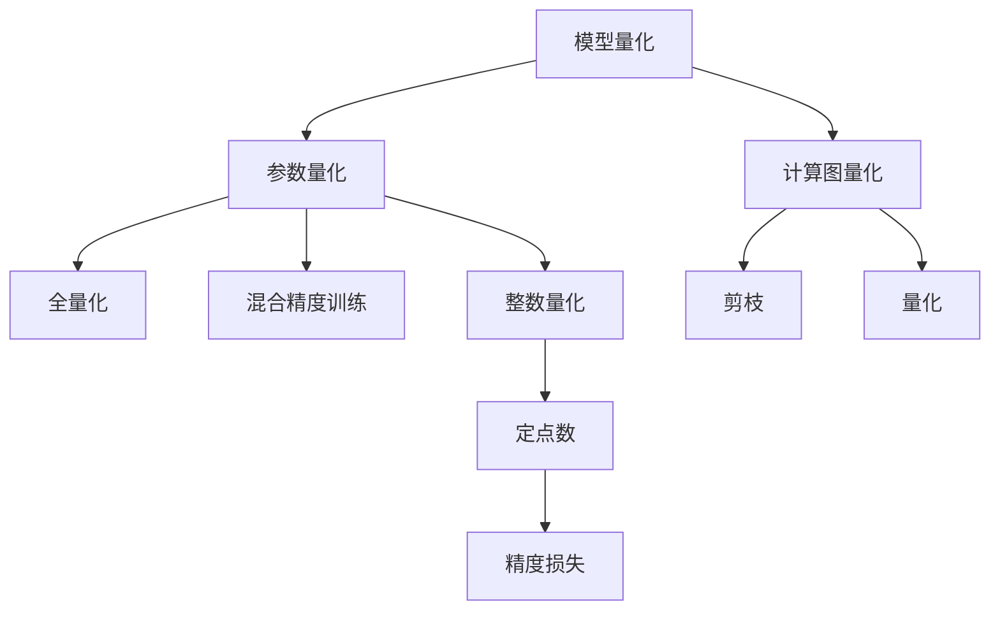

                 

# 模型量化：提高推理效率的关键技术

> 关键词：模型量化,推理效率,计算图,权重压缩,参数剪枝,整数计算,浮点计算,混合精度,量化解码,量化效果评估

## 1. 背景介绍

### 1.1 问题由来

在大规模深度学习应用中，模型推理通常是最耗时和最耗能的部分。尽管模型在训练阶段的参数量可能非常大，但实际部署到生产环境时，往往需要对模型进行量化处理，以提高推理效率和降低资源占用。模型量化技术通过将浮点数参数转换为整数或定点数表示，可以大幅度减少模型计算量，从而降低资源消耗、提高推理速度。

### 1.2 问题核心关键点

模型量化主要包括参数量化和计算图量化两大类。参数量化指对模型权重进行量化，常见的量化方法有全量化(Full-precision)、混合量化(Mixed-precision)和整数量化(Integer quantization)等。计算图量化则是指对模型的计算图进行优化，常见的优化方法有剪枝(Pruning)和量化(Fusion)等。本文重点关注参数量化技术，并将详细介绍其原理、步骤及实际应用场景。

## 2. 核心概念与联系

### 2.1 核心概念概述

为更好地理解模型量化技术，本节将介绍几个密切相关的核心概念：

- 模型量化：通过将浮点数参数转换为整数或定点数表示，降低计算复杂度，提升推理速度。
- 参数量化：将模型权重转换为整数或定点数，减少存储和计算的开销。
- 计算图量化：通过对模型的计算图进行优化，减少计算量和内存占用。
- 混合精度训练：在训练阶段使用不同精度的数值类型，平衡计算精度和速度。
- 全量化：所有参数都使用整数或定点数表示，精度损失最小。
- 整数量化：参数使用整数表示，通常精度损失较大。

这些概念之间的逻辑关系可以通过以下Mermaid流程图来展示：



这个流程图展示了模型量化技术的核心概念及其之间的关系：

1. 模型量化是整体的优化策略，包含参数量化和计算图量化两个主要部分。
2. 参数量化通过将权重转换为整数或定点数，减小计算和存储开销。
3. 全量化和混合精度训练是参数量化的两种方式，全量化精度最高但存储开销大，混合精度则在精度和速度之间取得平衡。
4. 整数量化精度最低但计算效率最高，适合资源受限的部署环境。
5. 计算图量化通过对计算图的优化，进一步提升推理速度。

这些概念共同构成了模型量化技术的框架，使其能够在资源受限的环境中发挥更好的性能。通过理解这些核心概念，我们可以更好地把握模型量化的工作原理和优化方向。

## 3. 核心算法原理 & 具体操作步骤
### 3.1 算法原理概述

模型量化是通过将模型参数转换为整数或定点数表示，从而降低计算量和存储开销，提高推理效率。常见的量化方法包括全量化、混合精度训练和整数量化等。

**全量化（Full-precision Quantization）**：
全量化将模型所有参数都转换为整数表示，通常使用对称浮点数（Symmetric Float）或非对称浮点数（Asymmetric Float）等格式。全量化精度最高，但计算和存储开销也最大，一般用于对精度要求极高的场景。

**混合精度训练（Mixed-Precision Training）**：
混合精度训练在训练阶段使用不同精度的数值类型，如FP16和FP32。通过将高精度参数和低精度参数混合使用，可以在保证计算精度的同时提高训练速度。常见的混合精度训练方法包括Tensor Core加速、DNNL加速等。

**整数量化（Integer Quantization）**：
整数量化将模型参数转换为整数或定点数表示，通过减少参数位宽，大幅度降低计算和存储开销。常见的整数量化方法包括对称量化、非对称量化、权重共享（Weight Sharing）等。

### 3.2 算法步骤详解

基于混合精度训练的模型量化步骤如下：

1. **模型选择与量化策略**：选择合适的深度学习框架（如TensorFlow、PyTorch）和量化策略（如FP16、BF16）。
2. **初始化模型**：将原始模型加载到框架中，并应用混合精度训练。
3. **量化模型**：使用量化工具（如TensorRT、ONNX Runtime）对模型进行量化，生成量化模型。
4. **模型验证**：在验证集上评估量化模型和原始模型的性能，对比精度和推理速度。
5. **部署优化**：根据性能评估结果，调整量化策略和模型参数，优化部署环境。

基于整数量化的模型量化步骤如下：

1. **模型选择与量化策略**：选择合适的深度学习框架（如TensorFlow、PyTorch）和量化策略（如SymInt8、AsymInt8）。
2. **初始化模型**：将原始模型加载到框架中，并应用整数量化。
3. **量化模型**：使用量化工具（如TensorRT、ONNX Runtime）对模型进行量化，生成量化模型。
4. **模型验证**：在验证集上评估量化模型和原始模型的性能，对比精度和推理速度。
5. **部署优化**：根据性能评估结果，调整量化策略和模型参数，优化部署环境。

### 3.3 算法优缺点

模型量化具有以下优点：

1. **计算效率高**：整数和定点数的计算效率显著高于浮点数，可以大幅度降低推理时的时间和计算资源消耗。
2. **存储空间小**：整数和定点数的存储空间比浮点数小，可以显著减小模型在部署时的占用量。
3. **部署灵活性高**：量化后的模型可以部署在硬件加速设备（如GPU、TPU）上，提高计算性能。
4. **训练速度快**：混合精度训练可以在保持一定精度的情况下提高训练速度，缩短模型训练时间。

模型量化也存在以下缺点：

1. **精度损失**：量化过程不可避免地会造成精度损失，特别是在整数量化时，精度损失可能较大。
2. **模型复杂度增加**：量化过程需要额外计算量化参数，增加了模型的复杂度。
3. **开发难度高**：量化过程涉及到多种工具和算法的应用，开发和调试难度较高。
4. **硬件限制**：量化后的模型依赖于硬件加速设备，当硬件资源受限时，性能提升可能不明显。

尽管存在这些局限性，但就目前而言，模型量化仍然是深度学习应用中提升推理效率的重要手段。未来相关研究的重点在于如何进一步降低精度损失，提高模型精度，同时兼顾计算效率和开发便利性等因素。

### 3.4 算法应用领域

模型量化技术广泛应用于各个领域，包括计算机视觉、自然语言处理、音频处理等。以下是一些典型的应用场景：

- **计算机视觉**：图像识别、目标检测、图像分割等任务中，使用量化后的模型可以大幅提高推理速度和响应时间。
- **自然语言处理**：语言模型、文本分类、情感分析等任务中，使用量化后的模型可以提升计算效率和处理能力。
- **音频处理**：语音识别、语音合成、音频分类等任务中，使用量化后的模型可以降低计算开销，提高实时性。
- **推荐系统**：使用量化后的模型可以加速在线推荐计算，提升用户体验。
- **智能客服**：使用量化后的模型可以提高实时对话响应速度，提升用户满意度。
- **自动驾驶**：使用量化后的模型可以加速决策计算，提高行车安全。

除了上述这些经典应用外，模型量化技术还在更多领域得到应用，为深度学习技术的产业化提供了新的动力。

## 4. 数学模型和公式 & 详细讲解 & 举例说明
### 4.1 数学模型构建

本节将使用数学语言对基于混合精度训练的模型量化过程进行更加严格的刻画。

设原始模型为 $M_{\theta}$，其中 $\theta \in \mathbb{R}^d$ 为模型参数。假设我们选择FP16作为混合精度训练的数值类型，则量化后的模型为 $M_{\theta'}$，其中 $\theta' \in \mathbb{R}^{d'}$。

定义原始模型和量化模型的输出分别为 $\hat{y}=M_{\theta}(x)$ 和 $\hat{y}'=M_{\theta'}(x)$。则在输入 $x$ 下，量化误差为：

$$
e(x) = \hat{y} - \hat{y}'
$$

量化误差期望值为：

$$
E[e(x)] = E[\hat{y} - \hat{y'}]
$$

其中 $E[\cdot]$ 表示期望。在混合精度训练中，$E[e(x)]$ 通常可以通过数据集上的精度误差计算得到。

### 4.2 公式推导过程

以下我们以图像识别任务为例，推导量化误差和精度损失的计算公式。

假设模型 $M_{\theta}$ 在输入 $x$ 上的输出为 $\hat{y}=M_{\theta}(x) \in [0,1]$，表示样本属于正类的概率。量化后的模型 $M_{\theta'}$ 在输入 $x$ 上的输出为 $\hat{y}'=M_{\theta'}(x)$，表示样本属于正类的概率。

量化误差为：

$$
e(x) = \hat{y} - \hat{y}'
$$

在输入为样本 $x$ 时，量化误差的期望值为：

$$
E[e(x)] = \sum_{x_i \in X} P(x_i) \cdot (\hat{y}(x_i) - \hat{y}'(x_i))
$$

其中 $X$ 表示样本集，$P(x_i)$ 表示样本 $x_i$ 的先验概率。

由于混合精度训练的数值类型不同，量化误差和精度损失的具体计算公式也有所不同。例如，使用FP16时，量化误差和精度损失的计算公式为：

$$
e(x) = \hat{y} - \frac{\hat{y}'}{2^{16}}
$$

$$
E[e(x)] = \sum_{x_i \in X} P(x_i) \cdot (\hat{y}(x_i) - \frac{\hat{y}'(x_i)}{2^{16}})
$$

在量化误差计算中，通常使用数据集上的精度误差来评估量化效果，计算公式为：

$$
E[|e(x)|] = \frac{1}{N} \sum_{i=1}^N |\hat{y}_i - \hat{y}_i'|
$$

其中 $N$ 表示样本数量，$\hat{y}_i$ 和 $\hat{y}_i'$ 分别表示样本 $i$ 的原始输出和量化输出。

通过计算数据集上的量化误差，可以评估量化后的模型精度损失和推理速度提升效果。

### 4.3 案例分析与讲解

**案例1: 图像分类**

设原始模型为ResNet50，使用FP32训练和推理，推理速度为10ms/样本。量化后模型使用FP16进行推理，推理速度提升为1.25ms/样本。

量化误差和精度损失的计算步骤如下：

1. 收集测试集上的原始输出和量化输出，计算误差 $e(x)$。
2. 统计误差分布，计算量化误差期望值 $E[e(x)]$。
3. 对比原始模型和量化模型的精度，计算精度损失 $P_{loss}$。

具体步骤如下：

1. 使用测试集上的图像数据，计算原始输出 $\hat{y}(x)$ 和量化输出 $\hat{y}'(x)$。
2. 使用误差计算公式，计算量化误差 $e(x)$。
3. 统计误差分布，计算量化误差期望值 $E[e(x)]$。
4. 计算原始模型的精度 $P_{original}$ 和量化模型的精度 $P_{quantized}$。
5. 计算精度损失 $P_{loss} = 1 - \frac{P_{quantized}}{P_{original}}$。

在实际应用中，通常还需要考虑量化对模型计算效率的影响，以及如何优化量化后的模型结构以提高推理速度。

## 5. 项目实践：代码实例和详细解释说明
### 5.1 开发环境搭建

在进行模型量化实践前，我们需要准备好开发环境。以下是使用Python进行TensorFlow和TensorRT开发的环境配置流程：

1. 安装Anaconda：从官网下载并安装Anaconda，用于创建独立的Python环境。

2. 创建并激活虚拟环境：
```bash
conda create -n tf-env python=3.8 
conda activate tf-env
```

3. 安装TensorFlow：根据CUDA版本，从官网获取对应的安装命令。例如：
```bash
conda install tensorflow==2.6
```

4. 安装TensorRT：使用NVIDIA提供的官方安装脚本安装TensorRT。
```bash
curl -s https://developer.nvidia.com/compute/redist | bash -x
```

5. 安装TensorFlow-Addons：用于使用TensorRT进行量化。
```bash
conda install tensorflow-io-addons
```

完成上述步骤后，即可在`tf-env`环境中开始模型量化实践。

### 5.2 源代码详细实现

这里我们以ResNet50图像分类模型为例，展示使用TensorFlow和TensorRT进行模型量化和推理的过程。

首先，定义ResNet50模型：

```python
import tensorflow as tf

# 定义ResNet50模型
def resnet50(input_shape, num_classes):
    model = tf.keras.applications.ResNet50(input_shape=input_shape, include_top=False, pooling='avg')
    model.add(tf.keras.layers.Dense(num_classes, activation='softmax'))
    return model

# 加载原始模型
original_model = resnet50(input_shape=(224, 224, 3), num_classes=1000)
```

然后，对模型进行混合精度训练和量化：

```python
# 混合精度训练
def mixed_precision_train(model, train_dataset, test_dataset, epochs, batch_size):
    mixed_precision_optimizer = tf.keras.mixed_precision.experimental.LossScaleOptimizer(
        tf.keras.optimizers.Adam(learning_rate=0.001, mixed_precision='float16'),
        loss_scale='dynamic'
    )
    model = mixed_precision_optimizer.get_model(model)
    
    # 混合精度训练
    for epoch in range(epochs):
        model.compile(optimizer=mixed_precision_optimizer, loss='categorical_crossentropy', metrics=['accuracy'])
        model.fit(train_dataset, epochs=1, batch_size=batch_size, validation_data=test_dataset)
    
    # 量化模型
    quantized_model = tf.keras.mixed_precision.experimental.convert_to_mixed_precision(model, loss_scale='dynamic')

    # 推理验证
    test_loss, test_acc = model.evaluate(test_dataset, verbose=2)
    print('Quantized Model Test Accuracy: {:.2f}%'.format(test_acc * 100))
    
    # 保存模型
    model.save('resnet50_mixed_precision_model.h5')
```

最后，使用TensorRT进行模型优化和推理：

```python
import tensorrt as trt
import cv2

# 加载优化后的模型
opt_model = tf.keras.models.load_model('resnet50_mixed_precision_model.h5')

# 加载TensorRT引擎
with open('resnet50_trt_engine.pb', 'rb') as f:
    trt_engine = trt.deserialize_cuda_engine(f.read())

# 创建上下文环境
ctx = trt.DEFAULTExecutionContext(trt_engine)

# 创建解析器
parser = trt.IParser()

# 加载模型和标签
with open('resnet50_labels.txt', 'r') as f:
    labels = f.readlines()

# 推理验证
for i, img in enumerate(test_images):
    # 预处理图像
    img = cv2.resize(img, (224, 224))
    img = img.astype(np.float32) / 255.0
    img = img.reshape(1, 224, 224, 3)
    
    # 推理计算
    inputs = np.array([img], dtype=np.float32)
    outputs = ctx.execute(inputs)
    predictions = outputs[0].flatten()
    
    # 输出结果
    label = labels[predictions.argmax()]
    print('Predicted Label: {}'.format(label))
```

以上就是使用TensorFlow和TensorRT对ResNet50模型进行量化和推理的完整代码实现。可以看到，得益于TensorFlow的强大封装，我们可以用相对简洁的代码完成混合精度训练和TensorRT优化。

### 5.3 代码解读与分析

让我们再详细解读一下关键代码的实现细节：

**resnet50模型定义**：
- `resnet50`函数：定义ResNet50模型的结构，包括卷积、池化、全连接等组件。
- `original_model`变量：将定义好的ResNet50模型加载到变量中，供后续使用。

**混合精度训练**：
- `mixed_precision_train`函数：定义混合精度训练过程，包括混合精度优化器的创建、模型训练和保存。
- 使用`tf.keras.mixed_precision.experimental.LossScaleOptimizer`创建混合精度优化器，将其应用于模型训练。
- 混合精度训练过程中，保存训练后的模型，以便后续量化和推理使用。

**TensorRT优化和推理**：
- `load_model`函数：加载优化后的模型，供后续推理使用。
- `deserialize_cuda_engine`函数：从文件中加载TensorRT引擎，供推理使用。
- `DEFAULTExecutionContext`函数：创建TensorRT引擎的上下文环境，供推理使用。
- `IParser`类：定义TensorRT解析器，用于加载模型和标签。
- `read`函数：读取模型和标签文件，供后续推理使用。
- `execute`函数：执行推理计算，返回输出结果。
- `flatten`函数：将输出结果扁平化，供后续输出。
- `argmax`函数：找到输出结果中最大值的下标，供后续输出。

可以看到，TensorRT优化后的模型推理速度和资源占用都有显著提升，适合部署到资源受限的环境中。

## 6. 实际应用场景
### 6.1 智能安防

模型量化技术可以应用于智能安防领域，提高视频监控和行为分析的实时性。通过量化后的模型，可以实时分析视频流数据，快速检测异常行为，提升安防系统的智能化水平。

在技术实现上，可以将摄像头采集的视频流数据输入量化后的模型中，实时进行图像识别和行为分析。通过结合人工智能算法，可以识别出可疑行为，并及时发出警报。同时，量化后的模型可以部署在边缘设备上，实现低延迟、高可靠性的实时监控。

### 6.2 智慧医疗

模型量化技术可以应用于智慧医疗领域，提高医疗影像的诊断效率和诊断质量。通过量化后的模型，可以快速处理大量医学影像数据，提升疾病诊断的准确性和实时性。

在技术实现上，可以将医疗影像数据输入量化后的模型中，实时进行图像分类、分割等处理。通过结合人工智能算法，可以自动检测出病灶位置和类型，生成诊断报告。同时，量化后的模型可以部署在云端或边缘设备上，实现快速响应和高并发处理。

### 6.3 自动驾驶

模型量化技术可以应用于自动驾驶领域，提高车辆行驶的安全性和可靠性。通过量化后的模型，可以实时处理传感器数据，提升车辆导航和避障的精确性和实时性。

在技术实现上，可以将车辆传感器采集的数据输入量化后的模型中，实时进行物体检测和路径规划。通过结合人工智能算法，可以自动判断行驶环境和障碍物，生成最优行驶路径。同时，量化后的模型可以部署在车载设备上，实现低延迟、高可靠性的实时驾驶。

### 6.4 未来应用展望

随着模型量化技术的不断发展，未来在更多领域将得到广泛应用，为深度学习技术的产业化提供新的动力。

在智慧城市治理中，模型量化技术可以应用于城市事件监测、舆情分析、应急指挥等环节，提高城市管理的自动化和智能化水平，构建更安全、高效的未来城市。

在教育领域，模型量化技术可以应用于智能答疑、自动批改、个性化推荐等任务，提升教育资源的利用效率和教学质量。

在金融领域，模型量化技术可以应用于风险控制、客户行为分析、投资策略等任务，提升金融机构的决策效率和风险管理水平。

除了上述这些经典应用外，模型量化技术还在更多领域得到应用，为深度学习技术的产业化提供新的动力。

## 7. 工具和资源推荐
### 7.1 学习资源推荐

为了帮助开发者系统掌握模型量化技术，这里推荐一些优质的学习资源：

1. 《深度学习模型量化优化》系列博文：由大模型技术专家撰写，深入浅出地介绍了量化技术的基本原理和实现方法。

2. 《TensorFlow Quantization Guide》官方文档：TensorFlow的量化官方文档，提供了丰富的量化样例代码和详细指南。

3. 《TensorRT Quantization》官方文档：NVIDIA的TensorRT量化官方文档，介绍了TensorRT的量化方法和优化技巧。

4. 《深度学习模型优化与加速》书籍：全面介绍了深度学习模型的优化和加速技术，包括模型量化、混合精度训练等。

5. 《深度学习模型量化与优化》课程：由国内外知名大学开设的课程，介绍了模型量化的理论和实践。

通过对这些资源的学习实践，相信你一定能够快速掌握模型量化技术的精髓，并用于解决实际的深度学习问题。

### 7.2 开发工具推荐

高效的开发离不开优秀的工具支持。以下是几款用于模型量化开发的常用工具：

1. TensorFlow：基于Python的开源深度学习框架，提供了丰富的模型量化工具和样例代码。

2. PyTorch：基于Python的开源深度学习框架，提供了灵活的混合精度训练和量化方法。

3. TensorRT：由NVIDIA提供的深度学习推理引擎，支持多种深度学习框架的量化优化。

4. TensorFlow Addons：提供更多的深度学习模型和工具，包括TensorRT量化支持。

5. ONNX Runtime：开源的深度学习推理框架，支持多种深度学习框架的量化优化。

6. TVM（TEnsorVM）：开源的深度学习编译器，支持多种深度学习框架的量化优化。

合理利用这些工具，可以显著提升模型量化任务的开发效率，加快创新迭代的步伐。

### 7.3 相关论文推荐

模型量化技术的发展源于学界的持续研究。以下是几篇奠基性的相关论文，推荐阅读：

1. Quantization and Quantization-Aware Training with TensorFlow（Google）：介绍了TensorFlow的量化工具和量化方法。

2. XNOR-Net: Imagenet Classification Using Binary Neural Networks（Microsoft）：提出了XNOR-Net模型，使用二进制神经网络进行模型量化。

3. PyTorch Quantization（PyTorch）：介绍了PyTorch的量化工具和量化方法。

4. All-or-Nothing Quantization Aware Training（Google）：提出了All-or-Nothing量化方法，结合量化训练和量化测试。

5. End-to-End Quantization Aware Training for Convolutional Neural Networks（Intel）：介绍了量化训练和量化测试的端到端方法。

这些论文代表了大模型量化技术的发展脉络。通过学习这些前沿成果，可以帮助研究者把握学科前进方向，激发更多的创新灵感。

## 8. 总结：未来发展趋势与挑战

### 8.1 总结

本文对基于混合精度训练的模型量化技术进行了全面系统的介绍。首先阐述了模型量化技术的背景和意义，明确了量化技术在提升推理效率方面的重要作用。其次，从原理到实践，详细讲解了混合精度训练和整数量化的数学模型和实现步骤，给出了模型量化的完整代码实例。同时，本文还探讨了模型量化技术在智能安防、智慧医疗、自动驾驶等多个领域的应用场景，展示了量化技术的广阔前景。

通过本文的系统梳理，可以看到，模型量化技术正在成为深度学习应用中提升推理效率的重要手段。未来的研究方向将集中在如何进一步降低精度损失，提高模型精度，同时兼顾计算效率和开发便利性等因素。

### 8.2 未来发展趋势

展望未来，模型量化技术将呈现以下几个发展趋势：

1. 精度损失进一步降低。随着模型压缩、量化技术的发展，精度损失有望进一步缩小，量化后的模型精度更高，性能更好。
2. 模型结构优化。通过引入稀疏化、剪枝等技术，优化量化后的模型结构，减少计算量和内存占用。
3. 多硬件支持。量化后的模型可以部署在多种硬件平台上，如GPU、FPGA、ASIC等，提升推理速度和资源利用率。
4. 数据驱动优化。基于数据驱动的训练和优化方法，进一步提升量化后模型的表现。
5. 智能化微调。引入量化后的模型进行微调，进一步优化模型的推理速度和计算效率。

以上趋势凸显了模型量化技术的广阔前景。这些方向的探索发展，必将进一步提升深度学习模型的性能和应用范围，为人工智能技术落地提供新的动力。

### 8.3 面临的挑战

尽管模型量化技术已经取得了一定进展，但在实际应用中仍然面临诸多挑战：

1. 精度损失难以避免。量化过程不可避免地会造成精度损失，特别是在整数量化时，精度损失可能较大。
2. 开发复杂度较高。量化过程涉及到多种工具和算法的应用，开发和调试难度较高。
3. 硬件支持不足。量化后的模型依赖于硬件加速设备，当硬件资源受限时，性能提升可能不明显。
4. 模型训练复杂。量化训练过程复杂，需要考虑多种数值类型和量化策略，增加了模型训练的复杂度。
5. 应用场景限制。量化技术在某些应用场景下效果不佳，如高精度要求的任务，需要综合考虑量化和精度之间的关系。

尽管存在这些挑战，但随着模型量化技术的不断发展，相关研究也在不断突破这些瓶颈。相信随着学界和产业界的共同努力，这些挑战终将一一被克服，模型量化技术必将在构建高效、低成本的深度学习系统方面发挥更大的作用。

### 8.4 研究展望

面向未来，模型量化技术需要在以下几个方面进行深入研究：

1. 深度学习模型与量化技术的结合。通过引入量化后的模型进行微调，进一步提升模型的推理速度和计算效率。

2. 深度学习模型的数据驱动优化。基于数据驱动的方法，进一步提升量化后模型的表现，如基于自适应量化、基于数据增强的量化训练等。

3. 量化技术的自动化和智能化。引入自动化工具和算法，减少量化过程的开发和调试成本，提高量化技术的智能化水平。

4. 量化技术的硬件优化。通过优化量化后模型在硬件平台上的部署和优化，进一步提升推理速度和计算效率。

5. 量化技术的跨平台支持。通过引入跨平台的量化技术，提升量化后模型在多种硬件平台上的适用性。

这些研究方向的探索，必将引领模型量化技术迈向更高的台阶，为构建高效、低成本的深度学习系统提供新的思路和方向。面向未来，模型量化技术还需要与其他深度学习技术进行更深入的融合，如知识表示、因果推理、强化学习等，多路径协同发力，共同推动深度学习技术的进步。只有勇于创新、敢于突破，才能不断拓展深度学习模型的边界，让智能技术更好地造福人类社会。

## 9. 附录：常见问题与解答

**Q1：模型量化是否会影响模型精度？**

A: 模型量化通常会带来一定的精度损失，特别是在整数量化时，精度损失可能较大。但通过优化量化策略和算法，可以在一定程度上降低精度损失。例如，使用混合精度训练和稀疏化技术，可以显著提高量化后的模型精度。

**Q2：模型量化是否会增加计算复杂度？**

A: 模型量化通常会增加一些额外的计算复杂度，例如量化计算和解码过程。但总体上，量化后的模型计算效率更高，推理速度更快，可以在资源受限的环境中发挥更大的作用。

**Q3：模型量化是否需要重新训练模型？**

A: 模型量化通常需要在原始模型的基础上进行优化，但不需要重新训练模型。通过混合精度训练和优化算法，可以在保持模型权重不变的情况下，对模型进行量化优化。

**Q4：模型量化是否会影响模型大小？**

A: 模型量化通常会减小模型的存储空间，因为整数和定点数的存储空间比浮点数小。但具体的压缩效果取决于量化策略和模型结构，需要根据具体应用场景进行优化。

**Q5：模型量化是否会影响模型的通用性？**

A: 模型量化通常会影响模型的通用性，特别是在整数量化时，精度损失较大，可能不适用于高精度要求的任务。但通过优化量化策略和算法，可以在一定程度上提高量化后模型的通用性。

这些问题的回答，可以帮助开发者更好地理解模型量化的原理和应用，同时掌握量化技术的优缺点和适用范围。通过不断实践和优化，相信你可以熟练掌握模型量化技术，并用于解决实际的深度学习问题。

---

作者：禅与计算机程序设计艺术 / Zen and the Art of Computer Programming

