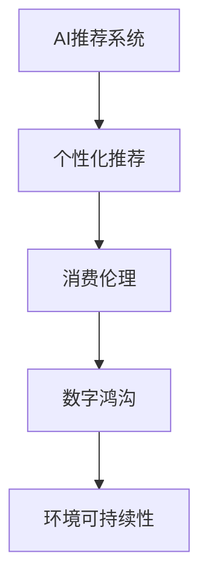

                 

# 欲望可持续性评估员：AI时代的消费伦理指南编撰者

## 1. 背景介绍

在数字化时代的浪潮下，人工智能（AI）技术正在深刻改变着我们的生活方式。从智能家居、电子商务到自动驾驶，AI的触角已经深入生活的方方面面。然而，随之而来的一系列伦理问题也不容忽视。特别是随着消费行为的数字化，AI在推动消费增长、促进商品流通的同时，也带来了新的道德困境和环境问题。

### 1.1 问题由来

随着电子商务和个性化推荐的兴起，AI技术已经成为推动消费增长的重要工具。然而，AI推荐系统的算法逻辑和用户隐私问题，引发了越来越多的关注和争议。过度消费、信息茧房、隐私泄露等现象，不仅对消费者的心理健康造成影响，也对社会资源的合理配置构成了挑战。

### 1.2 问题核心关键点

当前AI在消费领域的伦理问题主要集中在以下几方面：

- **算法透明度**：AI推荐系统的算法逻辑复杂，难以被普通消费者理解。这种"算法黑箱"现象，增加了消费者的信任危机。
- **隐私保护**：AI推荐系统通常需要收集和分析大量的用户数据，用户隐私问题难以保障。
- **消费引导**：AI推荐系统通过精确预测用户行为，引导消费者进行非理性消费，导致资源浪费。
- **环境影响**：AI在推广高销量商品时，可能会优先推荐高碳排放或资源消耗大的商品，加剧环境污染。

这些问题不仅涉及技术实现，还牵扯到伦理、法律、经济等多重维度。因此，研究和解决这些问题，不仅需要技术创新，还需要跨学科的合作与多方利益的平衡。

## 2. 核心概念与联系

### 2.1 核心概念概述

为更好地理解AI在消费领域的伦理问题，本节将介绍几个核心概念：

- **AI推荐系统**：利用机器学习和深度学习算法，对用户行为进行预测，并据此推荐商品的智能化系统。常见的推荐算法包括协同过滤、基于内容的推荐、深度学习推荐等。
- **个性化推荐**：基于用户的历史行为、兴趣偏好等个性化特征，为用户提供定制化商品推荐的策略。
- **消费伦理**：在消费过程中，消费者、商家、平台等各方应遵守的道德规范和行为准则。
- **数字鸿沟**：由于数字技术的普及和应用，不同社会群体之间的数字能力差异。数字鸿沟的存在，使得不同群体在享受AI技术带来的便利和收益上存在显著差异。
- **环境可持续性**：在资源有限的情况下，保持生态系统平衡，实现长期发展的能力。

这些核心概念之间的逻辑关系可以通过以下Mermaid流程图来展示：



这个流程图展示了个体AI推荐系统的实现、个性化推荐的应用，以及这些行为对消费伦理、数字鸿沟、环境可持续性的深远影响。

## 3. 核心算法原理 & 具体操作步骤
### 3.1 算法原理概述

AI推荐系统的核心在于通过机器学习算法，从用户的行为数据中提取特征，并基于这些特征预测用户未来的行为。其基本流程如下：

1. **数据采集**：收集用户的历史行为数据，如浏览记录、购买历史、评分反馈等。
2. **特征提取**：使用向量表示技术，将用户行为数据转化为算法能够处理的数值特征。
3. **模型训练**：构建推荐模型，使用历史数据训练模型参数。
4. **推荐生成**：输入新数据，使用训练好的模型预测用户可能感兴趣的商品，并根据预测结果进行推荐。

基于监督学习的推荐系统，其训练过程需要大量的标注数据。然而，这些标注数据的获取和处理往往伴随着用户的隐私泄露和数据安全问题。此外，算法模型难以解释，使得用户对其产生不信任。

### 3.2 算法步骤详解

以下以基于深度学习的推荐系统为例，详细讲解其推荐流程：

1. **数据预处理**：将原始用户行为数据清洗、归一化，并转化为模型可用的数值向量。
2. **模型选择**：根据任务特性选择合适的深度学习模型，如协同过滤、基于内容的推荐、序列推荐等。
3. **模型训练**：使用标注数据训练模型参数，并在验证集上进行调参和优化。
4. **推荐评估**：在测试集上评估推荐模型的效果，使用准确率、召回率、F1分数等指标衡量推荐性能。
5. **模型部署**：将训练好的模型部署到实际应用中，进行实时推荐。

### 3.3 算法优缺点

AI推荐系统的优点在于其高度个性化和精确度，能够显著提升用户体验和商家销售额。然而，其缺点也同样显著：

- **隐私泄露**：推荐系统需要大量用户数据，增加了隐私泄露的风险。
- **算法黑箱**：深度学习模型的复杂性使得用户难以理解其决策过程，降低了信任度。
- **信息茧房**：算法会不断推送用户感兴趣的内容，导致信息闭环和知识视野的局限。
- **资源浪费**：过度消费导致资源短缺，对环境产生负面影响。

### 3.4 算法应用领域

AI推荐系统已经在电商、新闻、视频等多个领域得到了广泛应用，成为推动消费增长的重要工具。然而，其在带来便利的同时，也引发了诸多伦理和环境问题。如何在技术进步和伦理责任之间找到平衡，成为亟待解决的重要课题。

## 4. 数学模型和公式 & 详细讲解  
### 4.1 数学模型构建

AI推荐系统的数学模型通常包括以下几个部分：

- **用户-商品矩阵**：用于描述用户对商品的态度，如购买、评分、浏览等。
- **用户特征向量**：提取用户的历史行为特征，作为推荐模型的输入。
- **商品特征向量**：提取商品的描述、属性等特征，用于推荐生成。
- **推荐算法模型**：基于用户和商品特征向量，预测用户对商品的态度。

### 4.2 公式推导过程

以协同过滤推荐系统为例，假设用户对商品的评分可以用一个实数矩阵 $U \in R^{N \times M}$ 表示，其中 $N$ 为商品数，$M$ 为用户数，$U_{ij}$ 表示用户 $i$ 对商品 $j$ 的评分。目标是为用户 $i$ 推荐商品 $j$，需最大化预测评分与实际评分之差的平方和，即最小化损失函数：

$$
L = \frac{1}{2N} \sum_{i,j} (U_{ij} - \hat{U}_{ij})^2
$$

其中 $\hat{U}_{ij}$ 为模型预测的用户 $i$ 对商品 $j$ 的评分。求解上述损失函数，得到推荐模型参数。

### 4.3 案例分析与讲解

假设有一个电商平台的推荐系统，使用协同过滤算法推荐商品。用户在平台上浏览了以下商品：

| 用户ID | 商品ID | 评分 |
| ------ | ------ | ---- |
| 1001   | 100    | 4    |
| 1001   | 101    | 3    |
| 1001   | 102    | 5    |
| 1002   | 100    | 5    |
| 1002   | 101    | 4    |

平台根据用户的浏览行为，预测用户对其他商品的评分，并推荐评分高的商品。具体实现步骤为：

1. 将用户的浏览评分转化为向量 $U$，商品标签转化为向量 $V$。
2. 计算用户和商品的相似度矩阵 $W$。
3. 根据相似度矩阵，预测用户对其他商品的评分。
4. 根据预测评分，推荐评分最高的商品。

## 5. 项目实践：代码实例和详细解释说明
### 5.1 开发环境搭建

在进行推荐系统开发前，我们需要准备好开发环境。以下是使用Python进行PyTorch开发的环境配置流程：

1. 安装Anaconda：从官网下载并安装Anaconda，用于创建独立的Python环境。

2. 创建并激活虚拟环境：
```bash
conda create -n pytorch-env python=3.8 
conda activate pytorch-env
```

3. 安装PyTorch：根据CUDA版本，从官网获取对应的安装命令。例如：
```bash
conda install pytorch torchvision torchaudio cudatoolkit=11.1 -c pytorch -c conda-forge
```

4. 安装TensorFlow：
```bash
conda install tensorflow
```

5. 安装各类工具包：
```bash
pip install numpy pandas scikit-learn matplotlib tqdm jupyter notebook ipython
```

完成上述步骤后，即可在`pytorch-env`环境中开始推荐系统开发。

### 5.2 源代码详细实现

下面我们以协同过滤推荐系统为例，给出使用PyTorch进行推荐开发的PyTorch代码实现。

首先，定义数据处理函数：

```python
import torch
from torch import nn

def load_data(path):
    # 从文件中加载用户-商品矩阵
    with open(path, 'r') as f:
        data = [line.strip().split() for line in f]
    U = torch.tensor([float(x) for x in data], dtype=torch.float)
    return U
```

然后，定义模型类：

```python
class CollaborativeFiltering(nn.Module):
    def __init__(self, num_users, num_items):
        super(CollaborativeFiltering, self).__init__()
        self.W = nn.Linear(num_users, num_items)
    
    def forward(self, user, item):
        W_u = self.W(user)
        return W_u @ item
```

接着，定义训练函数：

```python
def train_model(model, data, epochs, batch_size):
    optimizer = torch.optim.SGD(model.parameters(), lr=0.01)
    criterion = nn.MSELoss()
    
    for epoch in range(epochs):
        for user, item in data:
            optimizer.zero_grad()
            pred = model(user, item)
            loss = criterion(pred, target)
            loss.backward()
            optimizer.step()
```

最后，启动训练流程并在测试集上评估：

```python
U_train = load_data('train_data.txt')
U_test = load_data('test_data.txt')

model = CollaborativeFiltering(U_train.shape[0], U_train.shape[1])
train_model(model, U_train, 10, 32)

# 在测试集上评估
U_test = U_test.to('cpu')
preds = model(torch.tensor(U_test).to('cpu'))
print(criterion(preds, torch.tensor(U_test)).item())
```

以上就是使用PyTorch进行协同过滤推荐系统开发的完整代码实现。可以看到，由于TensorFlow提供了丰富的优化器和模型构建工具，使得推荐系统的开发变得更加高效。

### 5.3 代码解读与分析

让我们再详细解读一下关键代码的实现细节：

**load_data函数**：
- 从文件中加载用户-商品矩阵，将其转换为Tensor。

**CollaborativeFiltering类**：
- 继承自PyTorch的nn.Module类，定义了模型结构。
- 使用线性层作为模型核心，将用户向量与商品向量进行矩阵乘法，得到预测评分。

**train_model函数**：
- 定义了随机梯度下降优化器和均方误差损失函数。
- 循环迭代，对每个样本进行前向传播和反向传播，更新模型参数。

**训练流程**：
- 加载训练集和测试集数据。
- 创建并初始化模型。
- 在训练集上调用train_model函数进行模型训练。
- 在测试集上评估模型性能，输出均方误差。

可以看到，PyTorch和TensorFlow的简洁高效特性，使得推荐系统开发变得容易上手。开发者可以将更多精力放在算法优化和应用部署上，而不必过多关注底层实现细节。

## 6. 实际应用场景
### 6.1 电商平台推荐

AI推荐系统在电商平台中的应用最为广泛。通过深度学习算法，电商平台能够对用户的浏览、购买行为进行分析，推荐符合用户兴趣的商品，从而提升用户体验和销售额。例如，亚马逊、淘宝等大型电商平台，通过个性化推荐，已经实现了显著的销量增长。

### 6.2 新闻媒体推荐

新闻媒体平台通过AI推荐系统，能够根据用户的阅读历史和兴趣，推荐相关新闻内容，提升用户粘性和互动率。例如，今日头条、腾讯新闻等平台，通过AI推荐系统，显著提升了用户活跃度和新闻点击率。

### 6.3 视频平台推荐

视频平台通过AI推荐系统，能够根据用户的观看历史和评分，推荐符合用户兴趣的视频内容，提升用户的观看体验和平台留存率。例如，Netflix、YouTube等视频平台，通过AI推荐系统，显著提升了用户的观看量和平台用户留存。

### 6.4 未来应用展望

随着AI技术的不断发展，推荐系统将会在更多领域得到应用，为生产生活带来更多的便利和价值。例如：

- **医疗健康**：AI推荐系统能够根据患者的病历数据，推荐合适的诊疗方案和药品，提升医疗服务的个性化和精准度。
- **金融投资**：AI推荐系统能够根据用户的交易历史和风险偏好，推荐合适的投资组合，提升投资回报和风险控制。
- **教育培训**：AI推荐系统能够根据学生的学习行为和成绩，推荐合适的学习资源和课程，提升教育效果和学生满意度。

这些领域的应用，将进一步拓展AI推荐系统的应用边界，提升社会的智能化水平。

## 7. 工具和资源推荐
### 7.1 学习资源推荐

为了帮助开发者系统掌握AI推荐系统的理论基础和实践技巧，这里推荐一些优质的学习资源：

1. 《推荐系统基础与算法》书籍：系统介绍了推荐系统的基本原理和算法，适合初学者入门。
2. 《深度学习与推荐系统》课程：由斯坦福大学开设的推荐系统课程，深入讲解了推荐系统中的深度学习算法和模型优化。
3. 《Python推荐系统实战》书籍：结合实际应用案例，介绍了推荐系统在电商、新闻、视频等多个领域的应用。
4. Kaggle推荐系统竞赛：通过参与Kaggle的推荐系统竞赛，锻炼实践能力和算法创新思维。
5. HuggingFace官方文档：提供了丰富的推荐系统预训练模型和优化工具，适合快速上手实践。

通过对这些资源的学习实践，相信你一定能够快速掌握AI推荐系统的精髓，并用于解决实际的推荐问题。

### 7.2 开发工具推荐

高效的开发离不开优秀的工具支持。以下是几款用于AI推荐系统开发的常用工具：

1. PyTorch：基于Python的开源深度学习框架，灵活动态的计算图，适合快速迭代研究。
2. TensorFlow：由Google主导开发的开源深度学习框架，生产部署方便，适合大规模工程应用。
3. HuggingFace Transformers：集成了众多推荐系统预训练模型，支持PyTorch和TensorFlow，是进行推荐系统开发的利器。
4. Weights & Biases：模型训练的实验跟踪工具，可以记录和可视化模型训练过程中的各项指标，方便对比和调优。
5. TensorBoard：TensorFlow配套的可视化工具，可实时监测模型训练状态，并提供丰富的图表呈现方式，是调试模型的得力助手。

合理利用这些工具，可以显著提升AI推荐系统开发效率，加快创新迭代的步伐。

### 7.3 相关论文推荐

AI推荐系统的研究始于20世纪90年代，经历了从协同过滤到深度学习的演进。以下是几篇奠基性的相关论文，推荐阅读：

1. "Collaborative Filtering for Implicit Feedback Datasets"（Geng et al., 2009）：提出协同过滤算法的基本框架，是推荐系统领域的重要基础。
2. "Neural Collaborative Filtering"（He et al., 2017）：将深度神经网络引入推荐系统，大幅提升了推荐模型的性能。
3. "Wide & Deep Learning for Recommender Systems"（Covington et al., 2016）：提出结合宽模型和深度模型的混合推荐算法，进一步提升了推荐效果。
4. "Item-based Collaborative Filtering Recommendation Algorithm Based on Extreme Gradient Boosting"（Zhou et al., 2018）：提出基于极梯度提升的推荐算法，在保持模型复杂度的情况下提升了推荐性能。

这些论文代表了大数据推荐系统的发展脉络。通过学习这些前沿成果，可以帮助研究者把握学科前进方向，激发更多的创新灵感。

## 8. 总结：未来发展趋势与挑战
### 8.1 总结

本文对AI推荐系统的伦理问题进行了全面系统的介绍。首先阐述了AI推荐系统的背景、核心概念和关键步骤，明确了其在消费领域的应用价值和伦理挑战。其次，从原理到实践，详细讲解了推荐系统的数学模型和代码实现，给出了实际应用案例。同时，本文还探讨了推荐系统在电商、新闻、视频等多个领域的应用前景，展示了AI技术的强大潜力。此外，本文精选了推荐系统的各类学习资源，力求为读者提供全方位的技术指引。

通过本文的系统梳理，可以看到，AI推荐系统在推动消费增长、提升用户体验方面，已经展现出巨大的价值。然而，随之而来的隐私泄露、算法黑箱、信息茧房等问题，也需要我们深入思考和解决。只有在算法透明、隐私保护、资源可持续性等方面找到平衡，才能实现AI技术的可持续发展。

### 8.2 未来发展趋势

展望未来，AI推荐系统将呈现以下几个发展趋势：

1. **多模态融合**：除了文本数据，未来的推荐系统将更加注重图像、音频等多模态信息的融合，提升推荐模型的全面性和准确性。
2. **跨领域推荐**：推荐系统将跨越电商、新闻、视频等不同领域，实现更泛化的推荐服务。
3. **公平性优化**：推荐系统将更加注重公平性，避免算法偏见和信息垄断，保障所有用户的权益。
4. **实时推荐**：通过实时数据更新和推荐算法优化，提升推荐系统的响应速度和用户体验。
5. **社交推荐**：将社交关系引入推荐系统，提升推荐内容的个性化和互动性。
6. **个性化模型**：通过深度学习等技术，实现对用户兴趣的精准建模和预测。

这些趋势凸显了AI推荐系统在推动消费智能化和个性化的重要价值。未来，AI推荐系统将在更多领域得到应用，为社会带来更多便利和价值。

### 8.3 面临的挑战

尽管AI推荐系统已经取得了显著成果，但在实际应用中，仍然面临诸多挑战：

1. **隐私保护**：推荐系统需要大量用户数据，如何保护用户隐私成为关键问题。
2. **算法透明**：深度学习模型的复杂性使得用户难以理解其决策过程，增加了信任危机。
3. **信息茧房**：过度个性化推荐可能导致信息闭环，加剧用户的知识视野局限。
4. **资源浪费**：推荐系统可能过度推动消费，导致资源浪费和环境污染。
5. **公平性问题**：推荐算法可能存在偏见，对不同群体产生不公平的影响。
6. **系统鲁棒性**：推荐系统需要应对数据异常和模型攻击，保持稳定性和安全性。

这些挑战不仅涉及技术实现，还牵扯到伦理、法律、经济等多个维度。只有在各方面进行全面优化，才能真正实现AI推荐系统的可持续发展。

### 8.4 研究展望

面对AI推荐系统所面临的诸多挑战，未来的研究需要在以下几个方面寻求新的突破：

1. **隐私保护**：研究差分隐私、联邦学习等技术，保护用户隐私。
2. **算法透明**：研究可解释AI（XAI）技术，提高推荐系统的透明度和可理解性。
3. **信息过滤**：研究推荐系统如何过滤低价值和有害内容，避免信息茧房。
4. **资源优化**：研究推荐系统如何优化资源配置，降低对环境的负面影响。
5. **公平性优化**：研究推荐系统如何避免算法偏见，提升公平性。
6. **系统鲁棒性**：研究推荐系统如何应对异常数据和攻击，提升鲁棒性。

这些研究方向将引领AI推荐系统迈向更高的台阶，为构建公平、透明、可持续的推荐系统提供坚实保障。

## 9. 附录：常见问题与解答
**Q1：AI推荐系统如何避免算法偏见？**

A: AI推荐系统算法偏见主要来源于数据偏见和模型训练过程。为了避免算法偏见，可以采取以下措施：

- **数据采样**：在数据采样时，尽量保证不同群体的数据平衡，避免样本偏斜。
- **模型选择**：选择公平性更好的算法，如Debiasing模型等。
- **规则约束**：在模型训练过程中，加入公平性约束，确保不同群体用户得到公平的推荐。
- **后期处理**：在推荐结果生成后，进行公平性评估和调整，去除不合理的推荐内容。

**Q2：如何评估AI推荐系统的公平性？**

A: AI推荐系统的公平性评估可以从以下几个方面进行：

- **数据公平性**：评估数据集是否具有代表性，是否存在样本偏斜。
- **算法公平性**：评估推荐模型是否存在歧视，是否对不同群体用户产生不公平的影响。
- **结果公平性**：评估推荐结果是否均衡，是否对不同群体用户产生不公平的推荐。
- **指标设计**：使用多种公平性指标，如Demographic Parity、Equal Opportunity、Equalized Odds等。

**Q3：如何设计公平的AI推荐系统？**

A: 设计公平的AI推荐系统需要从数据、算法和模型等多个环节进行优化：

- **数据采集**：保证数据的多样性和代表性，避免样本偏见。
- **算法选择**：选择公平性更好的算法，如Debiasing模型等。
- **模型训练**：在模型训练过程中，加入公平性约束，确保不同群体用户得到公平的推荐。
- **规则调整**：在推荐结果生成后，进行公平性评估和调整，去除不合理的推荐内容。

**Q4：AI推荐系统如何应对异常数据？**

A: 异常数据可能来源于数据噪声、数据缺失、数据错误等多种原因，对推荐系统的性能和鲁棒性造成影响。应对异常数据的方法包括：

- **数据清洗**：对数据进行预处理，去除噪声、填补缺失值、修正错误值。
- **模型鲁棒性**：使用鲁棒性更好的算法，如鲁棒回归、鲁棒神经网络等。
- **异常检测**：设计异常检测算法，识别并剔除异常数据。
- **模型更新**：定期更新推荐模型，保持模型的适应性。

**Q5：AI推荐系统如何提升实时性？**

A: 提升AI推荐系统的实时性需要从以下几个方面进行优化：

- **数据流处理**：使用流处理技术，实时处理新数据。
- **模型优化**：使用轻量级模型，减少计算资源消耗。
- **分布式计算**：使用分布式计算框架，提升计算效率。
- **缓存机制**：使用缓存机制，减少重复计算。

这些优化措施将帮助AI推荐系统提升响应速度，提升用户体验。

---

作者：禅与计算机程序设计艺术 / Zen and the Art of Computer Programming

