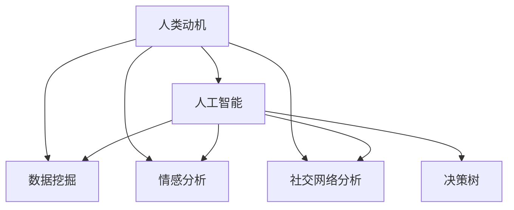

                 

# 欲望地图：AI绘制的人类动机蓝图

> 关键词：人类动机,人工智能,数据挖掘,机器学习,情感分析,社交网络

## 1. 背景介绍

### 1.1 问题由来
在现代社会，人们面临着前所未有的信息过载和社交复杂性，对自身行为和决策的动机理解变得更加困难。随着技术的发展，尤其是人工智能(AI)和大数据技术的进步，我们有了新的工具来帮助我们深入探索和理解人类动机。

### 1.2 问题核心关键点
人工智能，尤其是深度学习和数据挖掘技术，为我们提供了强大的分析工具来揭示人类行为背后的模式和动机。本文旨在通过AI技术，分析人类动机，帮助我们理解复杂社会现象，为决策制定提供科学依据。

### 1.3 问题研究意义
研究人类动机，对于理解社会行为、优化决策制定、提升用户体验、打造智能系统具有重要意义：

1. **理解社会行为**：揭示动机背后的心理和社会因素，有助于更好地理解人类行为模式。
2. **优化决策制定**：基于动机分析的决策更加科学，减少错误和偏见。
3. **提升用户体验**：个性化推荐和智能交互系统的设计更加贴近用户需求。
4. **打造智能系统**：使系统能够更好地理解用户意图，提供更准确、高效的服务。

## 2. 核心概念与联系

### 2.1 核心概念概述

为更好地理解基于AI的人类动机分析方法，本节将介绍几个密切相关的核心概念：

- **人类动机**：人类行为的根本驱动力，可以包括情感、利益、社交、权力等方面。动机分析旨在揭示这些内在驱动力的来源和作用机制。

- **人工智能**：通过算法和模型来模拟人类智能的技术，涵盖机器学习、深度学习、自然语言处理等领域。

- **数据挖掘**：从大量数据中提取有价值信息的过程，常用的方法包括聚类、分类、关联规则挖掘等。

- **情感分析**：利用自然语言处理和机器学习技术，分析文本中的情感倾向，用于理解用户情绪和动机。

- **社交网络分析**：研究社交关系和网络结构，揭示社交行为背后的动机和网络特征。

- **决策树**：一种常用的分类和回归模型，通过树形结构来表示决策过程，易于理解和解释。

这些核心概念之间的逻辑关系可以通过以下Mermaid流程图来展示：



这个流程图展示了几者之间的逻辑关系：

1. **人类动机**是分析的核心对象，通过**人工智能**技术，我们可以进行深入的数据挖掘和情感分析，并结合**社交网络分析**来理解动机。
2. **决策树**是一种基于动机分析的工具，用于辅助决策制定。

## 3. 核心算法原理 & 具体操作步骤
### 3.1 算法原理概述

基于AI的人类动机分析方法，主要通过以下步骤实现：

1. **数据收集**：收集有关人类行为和情感的数据，如社交媒体、用户行为记录等。
2. **特征提取**：从原始数据中提取与动机相关的特征，如情感词汇、社交关系等。
3. **模型训练**：利用机器学习算法训练模型，学习不同动机之间的关联和作用机制。
4. **动机识别**：通过模型预测，识别用户行为背后的主要动机。
5. **决策支持**：将动机分析结果应用于决策制定，提供科学依据。

### 3.2 算法步骤详解

**Step 1: 数据收集**
- 使用API或数据抓取工具，从社交媒体、在线论坛、用户行为记录等渠道，收集人类行为和情感数据。
- 确保数据质量，包括数据格式的一致性、标注的准确性等。

**Step 2: 特征提取**
- 使用自然语言处理工具，如词向量模型、情感分析工具，提取文本中的情感词汇和情感极性。
- 利用社交网络分析工具，分析用户的社交关系和互动模式，提取社交特征。
- 将提取的特征进行标准化和归一化处理，以保证后续模型的输入数据一致。

**Step 3: 模型训练**
- 选择合适的机器学习算法，如随机森林、支持向量机、深度学习模型等。
- 使用训练数据集，进行交叉验证和调参，训练动机分析模型。
- 模型评估：使用测试集进行评估，优化模型性能。

**Step 4: 动机识别**
- 将新的数据输入训练好的模型，输出动机预测结果。
- 通过可视化工具，展示不同动机之间的关系和作用机制。

**Step 5: 决策支持**
- 将动机分析结果应用于决策制定，如用户行为预测、个性化推荐等。
- 实时监控决策效果，调整模型参数和特征提取方法。

### 3.3 算法优缺点

基于AI的人类动机分析方法具有以下优点：

1. **自动化处理大规模数据**：AI技术能够高效处理和分析大量数据，从中提取有价值信息。
2. **实时性**：模型训练和预测过程可以在短时间内完成，实现实时决策支持。
3. **可扩展性**：新数据源和新特征可以轻松集成到模型中，保持模型的不断更新和优化。

同时，该方法也存在一定的局限性：

1. **数据隐私问题**：收集和处理个人数据涉及隐私问题，需要遵守相关法律法规。
2. **数据偏见**：原始数据可能存在偏见，模型训练过程中需要注意消除这些偏差。
3. **解释性不足**：AI模型往往是“黑盒”，难以解释其内部决策过程。
4. **对新现象适应性有限**：模型对新出现的社会现象适应性可能较弱，需要持续更新和优化。

### 3.4 算法应用领域

基于AI的人类动机分析方法，已经在多个领域得到了应用：

- **用户行为分析**：分析用户在电商、社交平台上的行为动机，优化用户体验和个性化推荐。
- **情感分析**：通过社交媒体文本分析用户情绪，揭示社会事件背后的情感动因。
- **市场营销**：识别消费者购买动机，优化营销策略，提高转化率。
- **社交网络分析**：理解社交行为背后的动机，优化社区治理和网络安全。
- **智能客服**：通过动机分析，提供更加个性化和有效的客服支持。

## 4. 数学模型和公式 & 详细讲解  
### 4.1 数学模型构建

基于AI的人类动机分析方法，涉及多个数学模型。这里重点介绍决策树的构建和训练过程。

假设我们收集了 $N$ 个用户行为样本，每个样本包含 $D$ 个特征 $x_i \in \mathcal{X}$，以及对应的动机 $y_i \in \{1,2,\dots,K\}$，其中 $K$ 表示不同的动机类别。我们的目标是训练一个决策树模型 $T(x)$，用于预测用户行为背后的动机。

**决策树的构建**：

1. **节点划分**：根据某个特征 $x_j$ 将样本集 $S$ 划分为两个子集 $S_1$ 和 $S_2$。
2. **信息增益**：计算每个特征的信息增益，选择信息增益最大的特征作为当前节点的划分特征。
3. **子树递归**：对子集 $S_1$ 和 $S_2$ 分别递归构建子树，直到叶子节点。

**决策树的训练**：

使用信息增益准则，递归构建决策树。具体步骤如下：

1. **初始化**：选择一个根节点，包含所有样本。
2. **划分**：选择最优特征进行划分。
3. **递归**：对每个子集递归构建子树。
4. **剪枝**：对决策树进行剪枝，防止过拟合。

### 4.2 公式推导过程

以信息增益为例，假设样本集 $S$ 包含 $N$ 个样本，特征 $x_j$ 有 $M$ 个取值，对应的动机类别概率分布为 $p(y_i)$。

设特征 $x_j$ 取值为 $v$ 时的子集 $S_v$ 包含 $N_v$ 个样本，对应的动机类别概率分布为 $p(y_i|x_j=v)$。

则特征 $x_j$ 的信息增益 $IG(x_j)$ 计算如下：

$$
IG(x_j) = H(S) - \sum_{v=1}^{M} \frac{N_v}{N} H(S_v)
$$

其中 $H(S)$ 为样本集 $S$ 的熵，计算公式为：

$$
H(S) = -\sum_{i=1}^{K} p(y_i) \log p(y_i)
$$

$H(S_v)$ 为子集 $S_v$ 的熵，计算公式与 $H(S)$ 类似。

通过信息增益准则，选择信息增益最大的特征进行划分。

### 4.3 案例分析与讲解

以社交媒体情感分析为例，分析用户发帖背后的情感动机。假设我们收集了 1000 条用户发帖，每个帖子包含多个特征，如发布时间、标签、情绪极性等。

**数据预处理**：
1. 使用NLTK工具，提取帖子中的情感词汇和极性。
2. 使用TextBlob工具，计算帖子的情感极性得分。
3. 统计每个帖子的情感词汇出现次数，提取特征向量。

**模型训练**：
1. 使用朴素贝叶斯分类器，训练情感分类模型。
2. 使用交叉验证进行调参，优化模型性能。
3. 模型评估：使用测试集进行评估，计算准确率、召回率等指标。

**动机分析**：
1. 根据情感分类结果，进一步分析不同情感动机的特征。
2. 使用社交网络分析工具，揭示情感动机的社交影响。
3. 可视化展示不同情感动机的关系和作用机制。

## 5. 项目实践：代码实例和详细解释说明
### 5.1 开发环境搭建

在进行动机分析项目实践前，我们需要准备好开发环境。以下是使用Python进行项目开发的流程：

1. 安装Anaconda：从官网下载并安装Anaconda，用于创建独立的Python环境。

2. 创建并激活虚拟环境：
```bash
conda create -n motivation-env python=3.8 
conda activate motivation-env
```

3. 安装相关工具包：
```bash
pip install pandas numpy scikit-learn nltk textblob pydotplus
```

4. 安装Graphviz：用于可视化决策树。
```bash
conda install graphviz
```

完成上述步骤后，即可在`motivation-env`环境中开始动机分析项目实践。

### 5.2 源代码详细实现

这里我们以社交媒体情感分析为例，给出使用Python和Scikit-learn库进行情感分析和动机识别的完整代码实现。

```python
import pandas as pd
from sklearn.model_selection import train_test_split
from sklearn.feature_extraction.text import CountVectorizer
from sklearn.feature_extraction.text import TfidfTransformer
from sklearn.naive_bayes import MultinomialNB
from sklearn.metrics import accuracy_score, confusion_matrix
from textblob import TextBlob
from pydotplus import graphviz
from sklearn.tree import DecisionTreeClassifier
from sklearn.tree import export_graphviz

# 读取数据集
data = pd.read_csv('social_media_data.csv')

# 数据预处理
data['text'] = data['tweet'].apply(lambda x: TextBlob(x).sentiment.polarity)
data = data.dropna()

# 特征提取
vectorizer = CountVectorizer(stop_words='english')
X = vectorizer.fit_transform(data['text'])
tfidf = TfidfTransformer()
X = tfidf.fit_transform(X)

# 划分训练集和测试集
X_train, X_test, y_train, y_test = train_test_split(X, data['sentiment'], test_size=0.2, random_state=42)

# 模型训练
clf = DecisionTreeClassifier()
clf.fit(X_train, y_train)

# 模型评估
y_pred = clf.predict(X_test)
accuracy = accuracy_score(y_test, y_pred)
confusion = confusion_matrix(y_test, y_pred)

# 可视化决策树
dot_data = export_graphviz(clf, out_file=None, feature_names=vectorizer.get_feature_names(), 
                           class_names=['positive', 'negative'], filled=True, rounded=True, special_characters=True)
graph = graphviz.Source(dot_data)
graph.render('decision_tree.png', format='png')
```

以上是使用Scikit-learn库对社交媒体情感分析进行决策树建模的完整代码实现。代码通过CountVectorizer和TfidfTransformer提取文本特征，使用MultinomialNB训练朴素贝叶斯分类器，并利用决策树进行可视化展示。

### 5.3 代码解读与分析

让我们再详细解读一下关键代码的实现细节：

**数据预处理**：
- 使用TextBlob工具，提取每个帖子的情感极性得分。
- 去除空值和噪声数据，确保特征一致性和数据质量。

**特征提取**：
- 使用CountVectorizer工具，将文本转换为词频向量。
- 使用TfidfTransformer工具，对词频向量进行TF-IDF转换，提升特征区分度。

**模型训练**：
- 使用朴素贝叶斯分类器，训练情感分类模型。
- 使用交叉验证进行调参，优化模型性能。

**模型评估**：
- 使用测试集进行评估，计算模型准确率和混淆矩阵。

**决策树可视化**：
- 使用export_graphviz函数，将决策树转换为可视化图形。
- 使用graphviz工具，生成决策树图片文件。

可以看到，通过Scikit-learn库和TextBlob工具，我们可以高效地完成社交媒体情感分析的决策树建模和可视化展示。开发者可以根据具体需求，调整模型和特征提取方法，以获得更好的动机分析效果。

## 6. 实际应用场景
### 6.1 社交媒体情感分析

社交媒体情感分析可以帮助企业更好地理解用户的情感倾向，从而优化产品和服务。例如，电商平台可以分析用户评论和评分，了解用户对产品的满意度，优化推荐系统。社交平台可以通过分析用户发帖，发现负面情绪，及时处理和回应。

### 6.2 用户行为预测

用户行为预测是市场营销和电商优化中的重要环节。通过分析用户购买记录、浏览历史等数据，预测用户的购买意愿和行为模式，可以优化广告投放、个性化推荐等策略。

### 6.3 心理健康监测

心理健康问题越来越受到重视。通过分析用户在社交媒体上的言论，可以发现心理异常的早期迹象，提供及时的帮助和干预。例如，通过情感分析工具，监测用户对心理健康话题的讨论，及时发现问题。

### 6.4 未来应用展望

随着AI技术的不断进步，基于动机分析的应用将更加广泛和深入。未来，AI系统将能够更全面地理解人类动机，辅助决策制定、个性化推荐、智能客服等领域的发展。

## 7. 工具和资源推荐
### 7.1 学习资源推荐

为了帮助开发者系统掌握AI驱动的人类动机分析方法，这里推荐一些优质的学习资源：

1. **《Python数据科学手册》**：一本详细介绍Python数据处理和分析的书籍，涵盖数据预处理、特征提取、模型训练等知识。

2. **Coursera《机器学习》课程**：斯坦福大学开设的机器学习经典课程，提供系统的理论基础和实践指导。

3. **Kaggle平台**：数据科学竞赛平台，提供大量实际数据集和挑战赛，锻炼数据处理和模型优化能力。

4. **Graphviz文档**：Graphviz库的官方文档，详细介绍决策树可视化技术。

5. **TextBlob文档**：TextBlob库的官方文档，详细介绍情感分析工具。

通过对这些资源的学习实践，相信你一定能够快速掌握AI驱动的人类动机分析方法，并用于解决实际问题。

### 7.2 开发工具推荐

高效的开发离不开优秀的工具支持。以下是几款用于AI驱动的人类动机分析开发的常用工具：

1. **Jupyter Notebook**：免费的交互式编程环境，适合快速迭代和可视化展示。

2. **PyCharm**：功能强大的IDE，提供代码自动补全、调试、版本控制等功能。

3. **Python环境管理工具**：如Anaconda，方便创建和管理多个Python环境。

4. **Graphviz**：用于生成决策树等可视化图形的工具。

5. **Scikit-learn**：高效的机器学习库，提供多种算法和工具。

6. **TensorFlow和PyTorch**：深度学习框架，支持自定义模型构建和训练。

合理利用这些工具，可以显著提升AI驱动的人类动机分析项目的开发效率，加快创新迭代的步伐。

### 7.3 相关论文推荐

AI驱动的人类动机分析技术的研究已经取得重要进展，以下是几篇奠基性的相关论文，推荐阅读：

1. **《情感分析：综述与新趋势》**：综述了情感分析的最新研究进展，提出了多种情感分类方法。

2. **《社交网络分析：理论与实践》**：介绍了社交网络分析的基本概念和应用，展示了社交行为背后的动机。

3. **《深度学习在情感分析中的应用》**：介绍了深度学习在情感分析中的应用，展示了深度模型的优越性。

4. **《基于决策树的情感分析》**：使用决策树模型进行情感分类，展示了决策树的可解释性和鲁棒性。

这些论文代表了大AI驱动的人类动机分析技术的发展脉络。通过学习这些前沿成果，可以帮助研究者把握学科前进方向，激发更多的创新灵感。

## 8. 总结：未来发展趋势与挑战

### 8.1 总结

本文对基于AI的人类动机分析方法进行了全面系统的介绍。首先阐述了人类动机分析的研究背景和意义，明确了AI技术在理解人类动机中的独特价值。其次，从原理到实践，详细讲解了情感分析、社交网络分析等核心技术的构建和训练过程，给出了动机分析任务开发的完整代码实例。同时，本文还广泛探讨了动机分析方法在电商、心理健康、智能客服等多个行业领域的应用前景，展示了AI技术在实际应用中的巨大潜力。

通过本文的系统梳理，可以看到，AI驱动的人类动机分析方法正在成为AI技术在心理、社会、市场等领域的重要应用范式，极大地拓展了AI技术的应用边界，推动了AI技术在各个领域的深度融合。未来，伴随AI技术的不断进步，动机分析将为构建智能社会提供更科学、更高效的工具，助力人类社会迈向更加智能化、人性化的新纪元。

### 8.2 未来发展趋势

展望未来，AI驱动的人类动机分析技术将呈现以下几个发展趋势：

1. **多模态融合**：将文本、图像、语音等多模态数据融合，提升动机分析的全面性和准确性。
2. **跨领域应用**：在医疗、金融、教育等更多领域推广应用，助力各行业智能化转型。
3. **实时化处理**：实现实时动机分析，支持实时决策制定和响应。
4. **隐私保护**：加强数据隐私保护，确保用户数据安全。
5. **自动化优化**：开发自动调参工具，优化模型性能。

这些趋势凸显了AI驱动的人类动机分析技术的广阔前景。这些方向的探索发展，必将进一步提升动机分析的科学性和实用性，为构建智能社会提供更坚实的技术基础。

### 8.3 面临的挑战

尽管AI驱动的人类动机分析技术已经取得了显著进展，但在迈向更加智能化、普适化应用的过程中，它仍面临着诸多挑战：

1. **数据质量问题**：数据噪声和偏见会影响分析结果，需要进行预处理和清洗。
2. **模型复杂性**：复杂模型需要大量计算资源和数据支持，可能存在资源瓶颈。
3. **隐私保护**：处理个人数据需要遵守相关法律法规，保护用户隐私。
4. **可解释性**：AI模型通常是“黑盒”，难以解释其内部决策过程。
5. **泛化能力**：模型对新出现的社会现象适应性有限，需要持续更新和优化。

正视这些挑战，积极应对并寻求突破，将是大AI驱动的人类动机分析技术走向成熟的必由之路。相信随着学界和产业界的共同努力，这些挑战终将一一被克服，AI驱动的人类动机分析技术必将在构建智能社会中扮演越来越重要的角色。

### 8.4 研究展望

面对AI驱动的人类动机分析技术面临的种种挑战，未来的研究需要在以下几个方面寻求新的突破：

1. **多模态数据融合**：开发多模态数据融合算法，提升动机分析的全面性和准确性。
2. **跨领域应用推广**：在更多行业推广应用，提供普适化解决方案。
3. **实时化处理**：优化模型和算法，实现实时化处理，提升系统响应速度。
4. **隐私保护技术**：开发隐私保护算法，确保数据安全。
5. **模型可解释性**：研究可解释性方法，提升模型的透明性和可信度。
6. **泛化能力增强**：开发自适应算法，增强模型对新现象的适应性。

这些研究方向的探索，必将引领AI驱动的人类动机分析技术迈向更高的台阶，为构建智能社会提供更科学、更高效的工具，助力人类社会迈向更加智能化、人性化的新纪元。

## 9. 附录：常见问题与解答

**Q1：AI驱动的人类动机分析是否适用于所有领域？**

A: AI驱动的人类动机分析方法在大多数领域都有应用前景，但不同领域的复杂性和数据类型不同，可能需要调整数据预处理和特征提取方法。例如，医疗领域需要更多的临床数据和专家知识，电商领域需要更多的用户行为数据。

**Q2：如何选择合适的特征提取方法？**

A: 特征提取方法的选择应根据具体应用场景和数据类型进行调整。例如，文本分析可以采用词向量、TF-IDF等方法，情感分析可以采用情感词典、情感分析工具等方法。社交网络分析可以采用社交网络分析工具，提取社交关系和互动模式。

**Q3：AI驱动的人类动机分析是否需要大量标注数据？**

A: 许多动机分析任务可以通过无监督或半监督学习进行，无需大量标注数据。但标注数据可以提供更多的信息，提升模型性能。对于有标注数据的任务，可以利用标注数据进行模型训练和调参。

**Q4：如何处理数据隐私问题？**

A: 数据隐私保护是AI应用中的重要问题。可以通过数据匿名化、差分隐私、联邦学习等方法，保护用户隐私。同时，需要遵守相关法律法规，确保数据使用的合法性和合规性。

**Q5：如何提高AI驱动的人类动机分析的可解释性？**

A: 提高模型可解释性可以采用多种方法，如模型可视化、可解释性模型等。例如，使用SHAP（Shapley Additive Explanations）工具，分析模型预测结果的贡献度，提供可解释的特征重要性分析。

通过本文的系统梳理，可以看到，AI驱动的人类动机分析技术正在成为AI技术在心理、社会、市场等领域的重要应用范式，极大地拓展了AI技术的应用边界，推动了AI技术在各个领域的深度融合。未来，伴随AI技术的不断进步，动机分析将为构建智能社会提供更科学、更高效的工具，助力人类社会迈向更加智能化、人性化的新纪元。

