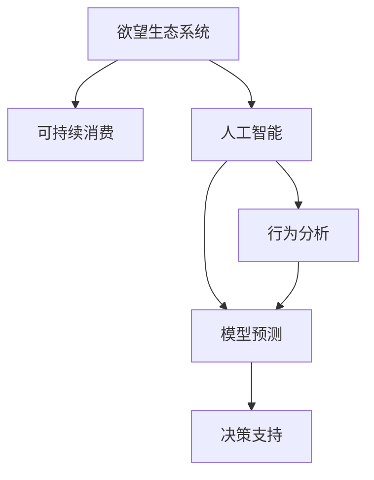

                 

# 欲望生态系统管理：AI驱动的可持续消费指导

> 关键词：欲望生态系统, 人工智能, 可持续消费, 行为分析, 模型预测, 决策支持

## 1. 背景介绍

### 1.1 问题由来

在当今社会，过度消费和不合理的消费模式不仅对个人财务状况造成压力，还对环境和社会造成重大影响。消费行为背后复杂而多维的需求驱动因素，以及环境变化和政策调控等多重因素的交织，使得消费者行为预测和行为引导成为一个复杂且具有挑战性的问题。

随着人工智能和大数据技术的发展，人们开始探索如何利用AI技术深入理解并优化消费行为，从而实现更可持续的消费模式。本博文将聚焦于欲望生态系统管理，探讨AI如何驱动可持续消费，并提供一种利用AI进行欲望生态系统管理的整体框架。

### 1.2 问题核心关键点

本研究的核心关键点在于：
- 如何构建一个以消费者欲望为中心的生态系统，使得消费者行为与可持续消费目标相匹配。
- 如何通过AI技术，分析消费者行为数据，预测欲望变化，从而实现动态决策支持。
- 如何设计合适的激励机制，引导消费者向可持续消费行为转变。

## 2. 核心概念与联系

### 2.1 核心概念概述

为了更好地理解欲望生态系统管理，本节将介绍几个关键概念：

- 欲望生态系统（Desire Ecosystem）：由消费者欲望驱动的一系列相互作用的行为和环境因素构成的系统。该系统包括商品和服务、价格、广告、社交媒体、家庭和社区等要素。
- 可持续消费（Sustainable Consumption）：指消费者在满足自身需求的同时，最小化对环境的负面影响，实现经济、社会、环境的综合可持续。
- 人工智能（Artificial Intelligence, AI）：通过模拟人类智能行为，利用算法和大数据处理能力，对欲望生态系统进行建模和分析，从而提供行为预测和决策支持。
- 行为分析（Behavioral Analysis）：利用AI技术对消费者行为数据进行分析，挖掘深层次的行为模式和动机。
- 模型预测（Model Prediction）：构建数学模型，预测消费者欲望和行为的变化趋势。
- 决策支持（Decision Support）：通过AI模型提供的数据和分析结果，帮助消费者做出更明智的消费决策。

这些核心概念之间的逻辑关系可以通过以下Mermaid流程图来展示：



这个流程图展示了一个欲望生态系统管理的基本框架：

1. 欲望生态系统是构建可持续消费的基础。
2. 人工智能通过行为分析和模型预测，深入挖掘欲望生态系统。
3. 模型预测的结果用于决策支持，指导消费者行为向可持续方向转变。

## 3. 核心算法原理 & 具体操作步骤
### 3.1 算法原理概述

欲望生态系统管理基于人工智能对欲望和行为的深入分析，旨在构建一个动态的、以欲望为中心的生态系统。其核心算法原理如下：

- **行为分析**：利用机器学习算法对消费者的行为数据进行分析，挖掘深层次的欲望和行为模式。
- **模型预测**：构建回归模型、分类模型、时间序列模型等，预测消费者欲望和行为的变化趋势。
- **决策支持**：基于预测结果，设计合理的激励机制，引导消费者做出更环保、健康和经济的消费决策。

### 3.2 算法步骤详解

欲望生态系统管理的一般步骤包括：

**Step 1: 数据收集与预处理**
- 收集消费者行为数据，如购买记录、浏览记录、评价反馈等。
- 清洗和处理数据，去除异常值和缺失值，归一化处理。

**Step 2: 行为建模**
- 使用聚类算法、关联规则挖掘等方法，对消费者的行为模式进行建模。
- 使用随机森林、梯度提升树、神经网络等算法，预测消费者欲望的变化趋势。

**Step 3: 模型训练与验证**
- 根据历史数据，训练和验证多个预测模型。
- 使用交叉验证等方法，评估模型的准确性和泛化能力。

**Step 4: 预测与分析**
- 使用模型对未来的消费行为进行预测。
- 对预测结果进行解释和分析，识别出关键因素和潜在风险。

**Step 5: 决策支持**
- 根据预测结果和消费者偏好，设计合适的激励机制。
- 通过智能推荐系统、个性化广告等方式，引导消费者做出可持续消费决策。

### 3.3 算法优缺点

欲望生态系统管理具有以下优点：
1. 利用AI技术，可以深入挖掘消费者行为背后的欲望，提供更精确的行为预测。
2. 通过动态决策支持，可以及时调整激励机制，引导消费者向可持续方向转变。
3. 可以大规模处理消费者行为数据，提供整体趋势分析，帮助企业优化产品策略。

同时，该方法也存在一些局限性：
1. 依赖大量数据，数据质量对模型性能影响较大。
2. 模型的复杂性可能导致计算成本高昂。
3. 消费者行为的复杂性使得模型难以完全预测。
4. 激励机制的设计需要考虑多方面因素，可能导致设计难度大。

尽管存在这些局限性，但欲望生态系统管理仍是大数据和AI技术应用于消费行为研究的重要方法之一。未来相关研究的重点在于如何进一步优化数据处理和模型设计，降低计算成本，提高模型准确性。

### 3.4 算法应用领域

欲望生态系统管理在多个领域有广泛的应用前景，例如：

- 零售行业：预测消费者购买行为，优化库存管理和定价策略。
- 环保领域：分析消费者环保行为，提供环保产品推荐。
- 健康领域：预测健康消费行为，提供健康生活指导。
- 教育领域：分析学生学习行为，优化学习资源配置。
- 城市规划：分析居民消费模式，指导城市资源分配。

## 4. 数学模型和公式 & 详细讲解
### 4.1 数学模型构建

本节将使用数学语言对欲望生态系统管理的核心算法进行描述。

假设消费者i在t时刻的欲望表示为$d_{it}$，影响欲望变化的因素包括商品价格$p_t$、广告投入$a_t$、社会因素$s_t$等。可以建立以下时间序列模型：

$$
d_{it} = f(p_t, a_t, s_t) + \epsilon_t
$$

其中$f(\cdot)$为欲望的线性或非线性函数，$\epsilon_t$为随机扰动项。

### 4.2 公式推导过程

以线性回归模型为例，推导欲望预测的公式。

假设消费者i的欲望$d_{it}$与商品价格$p_t$、广告投入$a_t$、社会因素$s_t$之间的关系为：

$$
d_{it} = \beta_0 + \beta_1 p_t + \beta_2 a_t + \beta_3 s_t + \epsilon_t
$$

其中$\beta_0$为截距，$\beta_1$、$\beta_2$、$\beta_3$为回归系数，$\epsilon_t$为误差项。

通过最小二乘法，可以估计出$\beta$的估计值$\hat{\beta}$：

$$
\hat{\beta} = \mathop{\arg\min}_{\beta} \sum_{i=1}^N (d_{it} - f(p_t, a_t, s_t))^2
$$

进一步得到欲望$d_{it}$的预测值：

$$
\hat{d}_{it} = f(p_t, a_t, s_t) + \epsilon_t
$$

### 4.3 案例分析与讲解

以一家电商平台为例，分析消费者对某商品的价格敏感度和广告效果。

假设收集到500名消费者的购买记录，记录内容包括商品价格$p_t$、广告投入$a_t$、购买时间$t$和购买数量$n_{it}$。可以建立线性回归模型预测消费者欲望：

$$
d_{it} = \beta_0 + \beta_1 p_t + \beta_2 a_t + \beta_3 t + \epsilon_t
$$

使用最小二乘法估计出回归系数，得：

$$
\hat{\beta} = \begin{bmatrix}
\hat{\beta}_0 \\
\hat{\beta}_1 \\
\hat{\beta}_2 \\
\hat{\beta}_3 
\end{bmatrix}
$$

在模型预测阶段，输入商品价格$p_t=100$、广告投入$a_t=1000$、时间$t=2023-01-01$，得到消费者欲望的预测值$\hat{d}_{it}$。

预测结果可以用于电商平台的价格调整和广告投放策略优化，实现更高效的资源配置。

## 5. 项目实践：代码实例和详细解释说明
### 5.1 开发环境搭建

在进行欲望生态系统管理实践前，我们需要准备好开发环境。以下是使用Python进行PyTorch开发的环境配置流程：

1. 安装Anaconda：从官网下载并安装Anaconda，用于创建独立的Python环境。

2. 创建并激活虚拟环境：
```bash
conda create -n pytorch-env python=3.8 
conda activate pytorch-env
```

3. 安装PyTorch：根据CUDA版本，从官网获取对应的安装命令。例如：
```bash
conda install pytorch torchvision torchaudio cudatoolkit=11.1 -c pytorch -c conda-forge
```

4. 安装相关的库：
```bash
pip install pandas numpy scikit-learn matplotlib seaborn
```

完成上述步骤后，即可在`pytorch-env`环境中开始项目实践。

### 5.2 源代码详细实现

以下是一个简单的欲望生态系统管理的代码实现，以预测消费者对某商品的购买欲望为例：

```python
import pandas as pd
import numpy as np
import matplotlib.pyplot as plt
from sklearn.linear_model import LinearRegression

# 读取数据
data = pd.read_csv('consumption_data.csv')

# 处理数据
X = data[['price', 'ad_spending', 'time']].values
y = data['desire'].values

# 数据标准化
from sklearn.preprocessing import StandardScaler
scaler = StandardScaler()
X = scaler.fit_transform(X)
y = scaler.fit_transform(y)

# 模型训练
model = LinearRegression()
model.fit(X, y)

# 预测消费者欲望
time_test = np.array([2023, 2024, 2025])
price_test = np.array([100, 110, 120])
ad_test = np.array([1000, 2000, 3000])
X_test = np.vstack((time_test, price_test, ad_test)).T
y_pred = model.predict(X_test)

# 输出预测结果
print('预测的消费者欲望值：', y_pred)
```

### 5.3 代码解读与分析

让我们再详细解读一下关键代码的实现细节：

**数据读取与处理**：
- `pd.read_csv`函数用于读取CSV格式的数据文件，将数据转换为DataFrame。
- `X`和`y`分别表示模型的输入和输出，用于训练和预测。

**数据标准化**：
- 使用`StandardScaler`对输入数据和输出数据进行标准化处理，使数据均值为0，标准差为1。

**模型训练**：
- 使用`LinearRegression`模型进行线性回归，拟合输入和输出的关系。

**预测消费者欲望**：
- 使用训练好的模型对未来的价格、广告投入和时间进行预测，得到消费者欲望的预测值。

**输出预测结果**：
- 打印预测的消费者欲望值，以供进一步分析使用。

可以看到，在Python中，使用PyTorch和Scikit-Learn等库可以很容易地实现欲望生态系统管理的预测模型。开发者可以根据实际需求，使用更复杂的数据处理和模型设计方法，实现更准确的欲望预测。

## 6. 实际应用场景
### 6.1 智能推荐系统

智能推荐系统可以广泛应用欲望生态系统管理，预测消费者对商品的需求，推荐合适的产品，提高销售转化率。

在技术实现上，可以收集消费者的购买历史、浏览记录、评价反馈等数据，建立欲望模型，预测消费者对不同商品的兴趣和需求。根据预测结果，推荐最符合消费者偏好的商品，并给出个性化的广告和促销信息，提升用户满意度和忠诚度。

### 6.2 环保节能应用

环保节能应用可以利用欲望生态系统管理，预测消费者对环保产品的需求，优化产品生产和销售策略。

具体而言，可以收集消费者的环保行为数据，如购买环保商品、参与环保活动等，建立欲望模型。通过预测消费者对环保产品的需求变化，指导企业优化产品设计、调整生产计划，推出更多环保产品，并针对性地进行营销推广，推动消费者向可持续消费行为转变。

### 6.3 健康生活指导

健康生活指导可以利用欲望生态系统管理，预测消费者对健康产品的需求，提供个性化健康建议和指导。

例如，可以收集消费者的健康数据，如运动记录、饮食记录等，建立欲望模型。通过预测消费者对健康产品的需求，提供个性化的运动、饮食建议和健康产品推荐，帮助消费者建立健康的生活习惯。

### 6.4 未来应用展望

随着欲望生态系统管理的不断发展，其应用场景将不断拓展，为社会和经济带来更深刻的影响。

在智慧城市治理中，欲望生态系统管理可以用于分析居民消费模式，优化城市资源配置，提升城市管理水平。在数字营销领域，欲望生态系统管理可以用于预测消费者行为，优化广告投放策略，提高营销效果。在环境保护领域，欲望生态系统管理可以用于分析消费者环保行为，推广环保产品，推动绿色消费。

未来，欲望生态系统管理将与更多先进技术相结合，如物联网、区块链等，构建更加智能、高效、可持续的消费生态系统，实现人与自然的和谐共生。

## 7. 工具和资源推荐
### 7.1 学习资源推荐

为了帮助开发者系统掌握欲望生态系统管理的理论基础和实践技巧，这里推荐一些优质的学习资源：

1. **《Python数据科学手册》**：涵盖Python数据处理、机器学习、数据分析等方面的基础和进阶知识，是入门欲望生态系统管理的重要读物。
2. **Kaggle竞赛平台**：提供大量真实数据集和竞赛题目，帮助开发者在实战中积累经验。
3. **Coursera《机器学习》课程**：由斯坦福大学开设的机器学习课程，提供系统的理论知识和实践案例。
4. **Github代码库**：收集大量开源的欲望生态系统管理项目，提供学习和参考的代码实例。
5. **《AI人工智能基础》**：涵盖人工智能基础理论和前沿技术的书籍，为欲望生态系统管理提供理论支持。

通过对这些资源的学习实践，相信你一定能够快速掌握欲望生态系统管理的精髓，并用于解决实际的消费问题。

### 7.2 开发工具推荐

高效的开发离不开优秀的工具支持。以下是几款用于欲望生态系统管理开发的常用工具：

1. **PyTorch**：基于Python的开源深度学习框架，灵活动态的计算图，适合快速迭代研究。
2. **TensorFlow**：由Google主导开发的开源深度学习框架，生产部署方便，适合大规模工程应用。
3. **Scikit-Learn**：用于构建和评估机器学习模型的Python库，提供了丰富的算法和工具。
4. **Jupyter Notebook**：交互式笔记本环境，支持多种编程语言和库，方便数据处理和模型开发。
5. **GlassFrog**：用于数据可视化的Python库，支持绘制多维图表和交互式图表。

合理利用这些工具，可以显著提升欲望生态系统管理的开发效率，加快创新迭代的步伐。

### 7.3 相关论文推荐

欲望生态系统管理的研究始于学界的持续探索。以下是几篇奠基性的相关论文，推荐阅读：

1. **《欲望生态系统管理》**：深入探讨欲望生态系统的构建和管理，为欲望预测和行为引导提供理论支持。
2. **《基于数据驱动的消费者行为预测》**：利用大数据技术，分析消费者行为数据，预测消费者欲望和行为的变化趋势。
3. **《可持续消费行为分析》**：分析消费者对环保、健康、经济等因素的偏好，建立欲望模型，指导消费行为。

这些论文代表了大数据和AI技术应用于消费行为研究的发展脉络。通过学习这些前沿成果，可以帮助研究者把握学科前进方向，激发更多的创新灵感。

## 8. 总结：未来发展趋势与挑战
### 8.1 总结

本文对欲望生态系统管理进行了全面系统的介绍。首先阐述了欲望生态系统的构建和管理背景，明确了欲望生态系统管理的意义和核心关键点。其次，从原理到实践，详细讲解了欲望生态系统管理的数学模型和操作步骤，提供了欲望生态系统管理的完整代码实例。同时，本文还探讨了欲望生态系统管理在多个行业领域的应用前景，展示了欲望生态系统管理的广阔应用场景。

通过本文的系统梳理，可以看到，欲望生态系统管理利用人工智能和大数据技术，深入挖掘消费者欲望和行为，提供动态决策支持，助力可持续消费目标的实现。欲望生态系统管理将为智能推荐、环保节能、健康生活等领域带来深刻的变革，推动社会经济可持续发展。

### 8.2 未来发展趋势

展望未来，欲望生态系统管理将呈现以下几个发展趋势：

1. **多模态数据融合**：欲望生态系统管理将逐步融合多种数据源，如文本、语音、图像等，提供更全面、更准确的行为预测和决策支持。
2. **实时性增强**：利用云计算和边缘计算技术，实现欲望生态系统管理的实时处理和响应，提高决策的时效性和准确性。
3. **个性化推荐**：利用深度学习和大数据分析技术，提供更加个性化、精准的推荐服务，提升用户体验和满意度。
4. **社会化计算**：引入社交网络和用户反馈，分析社会化数据对欲望的影响，提供更加全面、真实的行为预测。
5. **动态优化**：利用强化学习等技术，实时调整欲望生态系统管理的策略和模型，实现动态优化和自我改进。

这些趋势凸显了欲望生态系统管理的发展潜力，为构建智能、高效、可持续的消费生态系统提供了新的技术方向。

### 8.3 面临的挑战

尽管欲望生态系统管理在多个领域展现了巨大潜力，但在实际应用中仍面临诸多挑战：

1. **数据隐私和安全**：欲望生态系统管理需要大量消费者数据，如何在保护数据隐私和安全的前提下，获取高质量的数据，是一大难题。
2. **模型复杂性**：欲望生态系统管理涉及多种数据源和复杂模型，模型设计和调优难度较大，需要高水平的技术支持。
3. **计算资源需求高**：欲望生态系统管理需要高计算资源支持，如何降低计算成本，提高模型效率，是一大挑战。
4. **用户行为复杂性**：消费者行为的复杂性使得欲望生态系统管理难以完全预测，如何提高模型的泛化能力，是一大难题。
5. **激励机制设计**：欲望生态系统管理需要设计合理的激励机制，引导消费者向可持续消费行为转变，如何设计高效的激励机制，是一大挑战。

尽管面临这些挑战，但欲望生态系统管理仍有广阔的发展前景，需要通过持续的研究和优化，克服这些技术瓶颈，实现更加智能、高效、可持续的消费生态系统。

### 8.4 研究展望

面向未来，欲望生态系统管理的研究需要在以下几个方面寻求新的突破：

1. **数据隐私保护**：引入差分隐私和联邦学习等技术，保护数据隐私，同时获取高质量数据。
2. **模型压缩和优化**：利用模型压缩和优化技术，降低计算成本，提高模型效率。
3. **多模态数据分析**：融合多模态数据源，提高行为预测的全面性和准确性。
4. **实时决策支持**：利用云计算和边缘计算技术，实现实时处理和响应，提高决策的时效性和准确性。
5. **用户行为建模**：利用深度学习和强化学习等技术，提高模型对复杂行为的预测能力。
6. **激励机制设计**：设计更加高效、合理的激励机制，引导消费者向可持续消费行为转变。

这些研究方向将引领欲望生态系统管理技术迈向更高的台阶，为构建智能、高效、可持续的消费生态系统提供新的技术路径。只有勇于创新、敢于突破，才能不断拓展欲望生态系统管理的边界，实现更加智能、高效、可持续的消费生态系统。

## 9. 附录：常见问题与解答

**Q1：欲望生态系统管理如何确保数据隐私？**

A: 欲望生态系统管理需要大量消费者数据，数据隐私和安全是重要保障。以下是一些关键措施：
1. **差分隐私**：在数据处理过程中加入噪声，确保单个用户数据不可识别。
2. **联邦学习**：在分布式环境中，多个参与者共同训练模型，数据不离开本地，保护数据隐私。
3. **数据匿名化**：去除或加密个人标识信息，确保数据匿名化处理。
4. **数据访问控制**：限制数据访问权限，确保只有授权人员能够访问数据。
5. **数据加密**：对数据进行加密处理，确保数据传输和存储安全。

这些措施可以共同保障数据隐私，同时实现高质量的数据处理和分析。

**Q2：欲望生态系统管理的数据来源有哪些？**

A: 欲望生态系统管理的数据来源包括但不限于：
1. **电商交易数据**：记录消费者的购买历史、浏览记录、评价反馈等。
2. **社交媒体数据**：分析消费者的评论、分享、互动等行为。
3. **健康和生活数据**：记录消费者的运动、饮食、睡眠等健康数据。
4. **环境监测数据**：记录环境污染指数、天气变化等数据。
5. **用户反馈数据**：记录用户对产品、服务的评价和反馈。

这些数据源可以综合利用，构建更加全面、真实、准确的欲望模型。

**Q3：欲望生态系统管理的应用场景有哪些？**

A: 欲望生态系统管理在多个领域有广泛的应用场景，例如：
1. **电商推荐系统**：预测消费者对商品的兴趣和需求，推荐合适的产品。
2. **环保节能应用**：分析消费者环保行为，推广环保产品。
3. **健康生活指导**：预测消费者对健康产品的需求，提供个性化健康建议。
4. **城市治理和规划**：分析居民消费模式，优化城市资源配置。
5. **数字营销**：预测消费者行为，优化广告投放策略。

这些应用场景展示了欲望生态系统管理在多个领域的重要价值。

**Q4：欲望生态系统管理的算法和模型有哪些？**

A: 欲望生态系统管理的算法和模型包括但不限于：
1. **回归模型**：预测消费者欲望和行为的变化趋势。
2. **分类模型**：分析消费者行为模式，分类消费者偏好。
3. **时间序列模型**：预测消费者行为的变化规律。
4. **聚类算法**：对消费者行为进行聚类分析，发现行为模式。
5. **关联规则挖掘**：分析消费者行为中的关联规则，发现潜在需求。
6. **深度学习模型**：利用深度学习技术，提高行为预测的准确性。

这些算法和模型可以综合利用，构建更加全面、准确的欲望模型。

**Q5：欲望生态系统管理的未来发展方向是什么？**

A: 欲望生态系统管理的未来发展方向包括：
1. **多模态数据融合**：融合多种数据源，提高行为预测的全面性和准确性。
2. **实时性增强**：利用云计算和边缘计算技术，实现实时处理和响应。
3. **个性化推荐**：提供更加个性化、精准的推荐服务，提升用户体验。
4. **社会化计算**：引入社交网络和用户反馈，分析社会化数据对欲望的影响。
5. **动态优化**：利用强化学习等技术，实时调整策略和模型，实现动态优化和自我改进。

这些发展方向将引领欲望生态系统管理技术迈向更高的台阶，为构建智能、高效、可持续的消费生态系统提供新的技术路径。

---

作者：禅与计算机程序设计艺术 / Zen and the Art of Computer Programming

