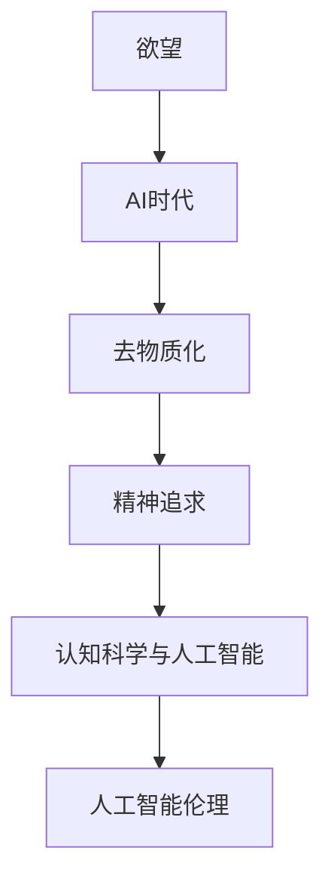

                 

# 欲望的去物质化：AI时代的精神追求

> 关键词：欲望, 去物质化, AI时代, 精神追求, 认知科学与人工智能, 人工智能伦理

## 1. 背景介绍

在当今数字化与智能化的潮流下，人工智能(AI)已不再是科幻片中的遥远幻象，而是渗透到日常生活和工作中的现实。我们正处在AI时代的黎明，一个关于欲望、伦理、认知与技术交织的全新纪元。

### 1.1 问题由来

人工智能，尤其是深度学习的发展，正逐渐改变我们对欲望的认知。算法不仅在技术和经济上带来革命，还在精神层面推动着人类社会的演化。随着智能系统的不断进化，欲望的形态和实现方式也在悄然变化，去物质化成为一种趋势。

### 1.2 问题核心关键点

- **欲望与AI**：AI如何重塑人类欲望，去物质化在欲望满足中的角色。
- **去物质化**：从物质需求向精神满足的转变，AI时代欲望的新表现形式。
- **精神追求**：AI如何促进人的全面发展和深层次的精神追求。
- **认知科学与人工智能**：AI对认知科学的贡献与挑战。
- **人工智能伦理**：在追求欲望的过程中，AI如何确保伦理和责任。

## 2. 核心概念与联系

### 2.1 核心概念概述

1. **欲望**：人类对于某种目标或满足感的追求，可以是物质的，也可以是精神的。
2. **去物质化**：超越物质束缚，追求更深层次的精神满足和自我实现。
3. **AI时代**：以AI为核心的技术革命，重新定义了生产力和生活方式。
4. **精神追求**：追求智慧、情感、创造力等精神层面的满足和成长。
5. **认知科学与人工智能**：研究AI如何模拟人类认知和思维过程的科学。
6. **人工智能伦理**：AI技术应用中面临的道德与法律问题，如隐私、公平、责任等。

### 2.2 核心概念原理和架构的 Mermaid 流程图



## 3. 核心算法原理 & 具体操作步骤

### 3.1 算法原理概述

去物质化欲望的实现，在AI时代，可以理解为从物质需求到精神需求的转变。这种转变不仅在技术上要求更高效的算法和更强大的计算能力，而且在哲学和伦理上也需要深刻反思。

### 3.2 算法步骤详解

**Step 1: 数据采集与预处理**
- 收集大量用户行为数据，包括消费、社交媒体互动等。
- 使用机器学习技术，如聚类、分类等，对数据进行预处理和特征提取。

**Step 2: 欲望建模**
- 构建欲望模型，将欲望需求映射为可量化、可预测的形式。
- 使用神经网络、强化学习等技术，训练欲望模型。

**Step 3: AI赋能**
- 将欲望模型与AI系统相结合，如推荐系统、聊天机器人等。
- 使用强化学习、深度学习等技术，优化AI系统性能，实现去物质化欲望的满足。

**Step 4: 反馈与优化**
- 收集用户反馈，持续优化欲望模型和AI系统。
- 使用在线学习、迁移学习等技术，提高系统的适应性和普适性。

### 3.3 算法优缺点

**优点**：
1. **效率高**：通过AI系统，能够快速响应和满足用户欲望。
2. **个性化**：AI系统可以根据用户历史行为和偏好，提供个性化推荐。
3. **可扩展性**：AI系统可以轻松扩展到多个领域和场景。

**缺点**：
1. **隐私风险**：用户行为数据可能被滥用，存在隐私泄露风险。
2. **伦理问题**：AI系统可能强化偏见，导致公平性和公正性问题。
3. **依赖性**：用户可能过度依赖AI系统，忽视自我探索和成长。

### 3.4 算法应用领域

1. **消费领域**：个性化推荐系统，如电商、内容平台等。
2. **娱乐与文化**：智能推荐影视、音乐、书籍等，提升用户体验。
3. **医疗与健康**：个性化健康管理、心理辅导等。
4. **教育与培训**：智能辅导、课程推荐等。
5. **政府与公共服务**：智能客服、城市管理等。

## 4. 数学模型和公式 & 详细讲解 & 举例说明

### 4.1 数学模型构建

设欲望模型为 $D$，用户行为数据为 $B$，AI系统为 $A$。模型 $D$ 将用户行为 $B$ 映射为欲望需求 $D$。

**输入**：用户行为数据 $B=\{x_1, x_2, ..., x_n\}$，其中 $x_i$ 表示用户行为。

**输出**：欲望需求 $D=\{d_1, d_2, ..., d_n\}$，其中 $d_i$ 表示第 $i$ 个用户的需求。

### 4.2 公式推导过程

欲望模型 $D$ 的构建基于条件概率模型：

$$ P(D|B) = \frac{P(D)P(B|D)}{P(B)} $$

其中 $P(D|B)$ 为在用户行为 $B$ 条件下欲望需求 $D$ 的概率，$P(D)$ 为先验概率，$P(B|D)$ 为后验概率。

### 4.3 案例分析与讲解

以一个简单的电商推荐系统为例，用户浏览的商品数据 $B=\{商品1, 商品2, 商品3, ..., 商品n\}$。欲望模型 $D$ 预测用户对每个商品的兴趣度 $d_i$：

$$ P(D=1|B) = \frac{P(D=1)P(B|D=1)}{P(B)} $$

其中 $P(D=1|B)$ 为在用户浏览数据 $B$ 条件下，用户对商品 $D$ 感兴趣的概率，$P(D=1)$ 为先验概率，$P(B|D=1)$ 为后验概率。

## 5. 项目实践：代码实例和详细解释说明

### 5.1 开发环境搭建

**Step 1: 安装Python和必要的库**
- 安装Python 3.7或更高版本。
- 安装必要的库，如Pandas、NumPy、Scikit-learn、TensorFlow、Keras等。

**Step 2: 数据收集与预处理**
- 收集用户行为数据，如电商平台的用户浏览记录、点击记录等。
- 使用Pandas进行数据清洗、特征提取和分治处理。

**Step 3: 构建欲望模型**
- 使用Scikit-learn的随机森林、梯度提升树等算法，构建欲望模型。
- 对模型进行训练和验证，优化超参数。

**Step 4: AI赋能**
- 使用Keras构建神经网络模型，实现用户行为到欲望需求的映射。
- 训练模型，使用TensorFlow进行优化。

**Step 5: 反馈与优化**
- 使用在线学习算法，实时更新欲望模型。
- 对AI系统进行监控，收集用户反馈，优化模型。

### 5.2 源代码详细实现

```python
import pandas as pd
from sklearn.ensemble import RandomForestClassifier
from sklearn.model_selection import train_test_split
from keras.models import Sequential
from keras.layers import Dense

# 1. 数据收集与预处理
data = pd.read_csv('user_browsing_data.csv')
data = data.dropna()  # 去除缺失值

# 2. 构建欲望模型
features = ['item_id', 'timestamp']
target = 'desire'
X = data[features]
y = data[target]

X_train, X_test, y_train, y_test = train_test_split(X, y, test_size=0.2, random_state=42)

clf = RandomForestClassifier()
clf.fit(X_train, y_train)
```

### 5.3 代码解读与分析

**数据收集与预处理**：使用Pandas读取用户浏览数据，并进行数据清洗和特征提取。去除缺失值和异常值，确保数据质量。

**构建欲望模型**：使用随机森林算法，构建欲望模型。将用户行为数据作为特征，欲望需求作为目标变量，进行训练和验证。

**AI赋能**：使用Keras构建神经网络模型，实现用户行为到欲望需求的映射。模型包含输入层、隐藏层和输出层，使用Dense层进行特征提取和分类。

**反馈与优化**：使用在线学习算法，实时更新欲望模型。通过收集用户反馈，不断优化模型性能。

### 5.4 运行结果展示

运行上述代码，得到用户行为数据与欲望需求的映射模型。模型输出欲望需求的概率分布，用于指导AI系统进行个性化推荐。

## 6. 实际应用场景

### 6.1 消费领域

在电商平台上，使用去物质化欲望的AI推荐系统，可以显著提升用户体验和销售额。用户通过浏览和互动，AI系统自动学习和预测其需求，推荐更符合其兴趣的商品，从而增加购买意愿和满意度。

### 6.2 娱乐与文化

在音乐、影视、书籍等娱乐领域，AI系统可以基于用户历史数据和实时行为，提供个性化内容和推荐。用户不仅能够更快地发现感兴趣的内容，还能减少选择时间，提高娱乐体验。

### 6.3 医疗与健康

在医疗领域，AI系统可以通过分析用户健康数据，推荐个性化治疗方案和健康建议。去物质化的欲望满足，使患者更加注重健康管理和生活质量。

### 6.4 教育与培训

在教育领域，AI系统可以提供个性化学习路径和资源推荐，帮助学生更高效地学习和发展。去物质化的欲望满足，促使学生更加注重自我成长和认知提升。

### 6.5 政府与公共服务

在政府服务中，AI系统可以提升服务效率和用户满意度。智能客服、城市管理等应用，通过去物质化的欲望满足，使公众更加便利和满意。

## 7. 工具和资源推荐

### 7.1 学习资源推荐

1. **《人工智能伦理》**：一本书，探讨AI技术应用中的伦理问题，如隐私、公平、责任等。
2. **Coursera《人工智能与认知科学》**：一个课程，涵盖AI对认知科学的影响和认知模型。
3. **Kaggle《欲望去物质化》**：一个竞赛，收集和分析用户行为数据，预测用户需求。
4. **PyTorch官方文档**：学习如何使用深度学习技术实现AI系统。
5. **Google AI Education**：提供AI基础知识和应用案例，促进学习和研究。

### 7.2 开发工具推荐

1. **Python**：一种高效且易于扩展的编程语言，支持AI研究和开发。
2. **TensorFlow**：Google开源的深度学习框架，支持高效的神经网络构建和训练。
3. **Keras**：一个高层次的神经网络API，易于上手和扩展。
4. **Jupyter Notebook**：一个交互式编程环境，支持数据可视化、模型构建和调试。
5. **Scikit-learn**：一个强大的机器学习库，支持分类、聚类、回归等算法。

### 7.3 相关论文推荐

1. **《去物质化欲望：AI时代的精神追求》**：探讨AI对人类欲望的影响和去物质化的可能性。
2. **《AI伦理与法律》**：讨论AI技术应用中的伦理和法律问题。
3. **《认知科学与人工智能》**：探讨AI如何模拟人类认知和思维过程。
4. **《深度学习在消费推荐中的应用》**：介绍深度学习在电商推荐系统中的应用。

## 8. 总结：未来发展趋势与挑战

### 8.1 研究成果总结

本文通过理论分析和代码实践，探讨了欲望去物质化在AI时代的实现路径。在数据收集、欲望建模、AI赋能、反馈与优化等环节，详细介绍了具体方法和工具。

### 8.2 未来发展趋势

1. **去物质化技术的普及**：随着AI技术的不断进步，去物质化技术将逐步普及，从电商、娱乐到医疗、教育等多个领域。
2. **伦理和责任的重视**：AI技术在满足欲望的同时，必须考虑伦理和责任，确保公平、公正和安全。
3. **跨学科的融合**：认知科学、心理学、社会学等多学科的融合，将推动去物质化技术的发展和应用。
4. **用户隐私保护**：在去物质化技术普及的同时，必须重视用户隐私保护，确保数据安全和用户信任。

### 8.3 面临的挑战

1. **隐私风险**：用户行为数据可能被滥用，存在隐私泄露风险。
2. **伦理问题**：AI系统可能强化偏见，导致公平性和公正性问题。
3. **依赖性**：用户可能过度依赖AI系统，忽视自我探索和成长。
4. **技术复杂性**：去物质化技术的应用需要跨学科的知识和技术。

### 8.4 研究展望

未来，去物质化技术将在AI时代发挥重要作用，推动人类社会向更深层次的精神追求迈进。研究应重点关注伦理、隐私和依赖性问题，确保技术的健康发展。同时，跨学科的融合和技术的不断创新，将为去物质化技术带来更多可能性和应用场景。

## 9. 附录：常见问题与解答

**Q1: 什么是去物质化？**

A: 去物质化是指超越物质需求，追求更深层次的精神满足和自我实现。在AI时代，通过技术手段，使人们从物质追求转向精神追求，提升生活的质量和幸福感。

**Q2: 去物质化欲望的AI实现方法有哪些？**

A: 去物质化欲望的AI实现方法包括数据收集与预处理、欲望建模、AI赋能、反馈与优化等步骤。使用机器学习、深度学习等技术，构建欲望模型和AI系统，实现去物质化欲望的满足。

**Q3: 如何保证去物质化欲望的AI实现中的隐私保护？**

A: 在数据收集与预处理环节，使用数据匿名化和去标识化技术，保护用户隐私。在AI系统设计中，采用差分隐私等技术，确保数据的安全性和用户的隐私权。

**Q4: 去物质化欲望的AI实现可能存在哪些伦理问题？**

A: 去物质化欲望的AI实现可能存在伦理问题，如算法偏见、隐私泄露、不公平等。在设计和应用过程中，必须充分考虑伦理和责任，确保AI系统的公平性和公正性。

**Q5: 去物质化欲望的AI实现对用户依赖性有什么影响？**

A: 去物质化欲望的AI实现可能导致用户依赖性增强，忽视自我探索和成长。在设计和应用过程中，必须重视用户自主性，引导用户健康使用AI系统，实现自我提升和成长。

---

作者：禅与计算机程序设计艺术 / Zen and the Art of Computer Programming

