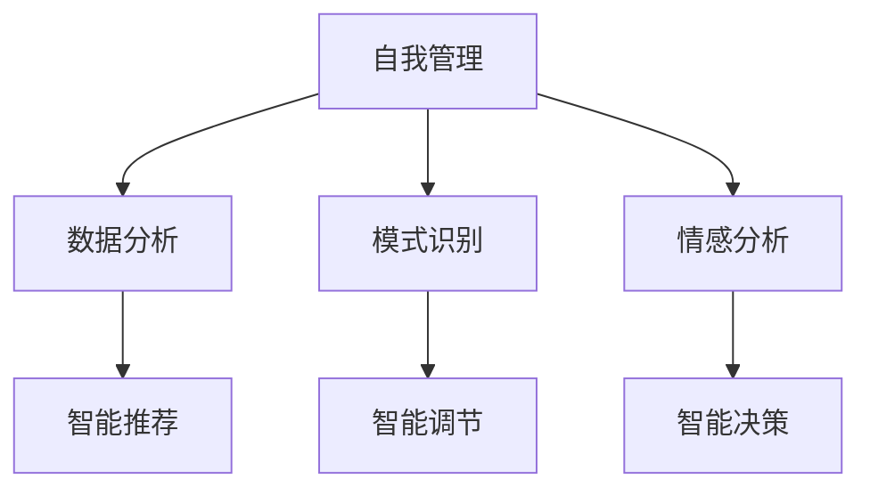

                 

## 1. 背景介绍

在现代社会的快节奏生活中，人们面临着前所未有的压力和挑战。如何在忙碌的工作和生活中保持自我，管理好情感和欲望，成为了许多人迫切需要解决的问题。近年来，人工智能技术在心理学和行为学研究中的应用日益增多，逐渐形成了基于人工智能的自我管理系统（AI-based Self-Management System，简称ASMS），即通过智能算法帮助人们更好地管理自我，提升生活质量。本文将深入探讨ASMS的核心概念、算法原理和具体操作步骤，并结合实际应用场景，全面分析其优势与挑战。

## 2. 核心概念与联系

### 2.1 核心概念概述

- **自我管理（Self-Management）**：指个体通过自我规划、自我监控和自我调节，实现个人目标和改善生活质量的过程。

- **人工智能（Artificial Intelligence, AI）**：指模拟人类智能的计算机系统，能够进行逻辑推理、数据分析、模式识别等智能活动。

- **自我管理系统（Self-Management System, SMS）**：通过技术手段实现自我监控、自我评估和自我调节的系统。

- **AI辅助的自我管理系统（AI-based Self-Management System, ASMS）**：利用人工智能技术实现自我管理的目标，包括数据分析、情感分析、决策支持等功能。

### 2.2 核心概念联系

ASMS的核心在于实现个体的自我管理，而AI技术通过数据分析、模式识别、情感分析等手段，可以辅助个体实现自我监控和自我调节。例如，通过收集个体的行为数据，分析其情感状态和行为模式，智能推荐个性化的自我管理策略。以下Mermaid流程图展示了ASMS和AI技术之间的关系：



此图说明，AI技术通过多种方式辅助个体实现自我管理：

- 数据分析：收集并分析个体的行为数据，识别出生活习惯、工作模式等规律。
- 模式识别：基于收集到的数据，识别出个体在特定情境下的行为模式。
- 情感分析：通过情感识别技术，了解个体在不同情境下的情感状态。
- 智能推荐：根据数据分析、模式识别和情感分析的结果，智能推荐个性化的自我管理策略。
- 智能调节：根据推荐的策略，实时调整个体的行为和情绪状态。
- 智能决策：在复杂的决策情境中，智能辅助个体进行最优决策。

## 3. 核心算法原理 & 具体操作步骤

### 3.1 算法原理概述

AI辅助的自我管理系统基于数据驱动的决策过程，通过以下步骤实现自我管理：

1. **数据收集与预处理**：收集个体的行为数据，包括时间管理、运动习惯、饮食习惯等。
2. **数据分析与特征提取**：利用统计学和机器学习方法，对数据进行分析和特征提取，识别出行为模式和情感状态。
3. **情感分析与情绪评估**：通过情感识别技术，评估个体的情绪状态，识别压力、焦虑等负面情绪。
4. **智能推荐与策略生成**：根据数据分析和情感分析的结果，智能推荐个性化的自我管理策略。
5. **实时调节与反馈优化**：基于推荐的策略，实时调整个体的行为和情绪状态，并通过反馈机制优化推荐算法。

### 3.2 算法步骤详解

#### 3.2.1 数据收集与预处理

数据收集与预处理是ASMS系统的基础，包括以下步骤：

1. **数据收集**：通过智能设备（如智能手表、健身追踪器、智能手机应用等）收集个体的行为数据。
2. **数据清洗与预处理**：清洗异常数据，对数据进行标准化和归一化处理。

#### 3.2.2 数据分析与特征提取

数据分析与特征提取是ASMS系统的核心，包括以下步骤：

1. **数据统计与描述性分析**：使用统计学方法对数据进行描述性分析，识别出行为模式和习惯。
2. **机器学习与特征提取**：利用机器学习算法（如聚类、回归、分类等）对数据进行建模，提取关键特征。

#### 3.2.3 情感分析与情绪评估

情感分析与情绪评估是ASMS系统的重要环节，包括以下步骤：

1. **情感识别**：使用情感分析技术（如文本情感分析、面部表情识别等）识别个体的情绪状态。
2. **情绪评估**：基于情感识别的结果，评估个体的情绪状态，如压力、焦虑、抑郁等。

#### 3.2.4 智能推荐与策略生成

智能推荐与策略生成是ASMS系统的关键功能，包括以下步骤：

1. **推荐算法设计**：根据数据分析和情感分析的结果，设计智能推荐算法。
2. **策略生成**：根据推荐算法的结果，生成个性化的自我管理策略，如时间管理、运动计划、饮食建议等。

#### 3.2.5 实时调节与反馈优化

实时调节与反馈优化是ASMS系统的应用环节，包括以下步骤：

1. **实时调节**：根据推荐的策略，实时调整个体的行为和情绪状态，如调整作息时间、增加运动量等。
2. **反馈优化**：根据个体的反馈和实际效果，不断优化推荐算法和策略。

### 3.3 算法优缺点

#### 3.3.1 优点

- **高效性**：通过数据分析和机器学习算法，ASMS系统可以快速生成个性化的自我管理策略。
- **精准性**：基于数据驱动的决策过程，ASMS系统能够精准评估个体的行为模式和情感状态。
- **实时性**：通过智能设备收集实时数据，ASMS系统能够实现实时调节，及时应对个体的需求。

#### 3.3.2 缺点

- **隐私问题**：收集和分析个体的行为数据可能引发隐私问题。
- **数据质量**：数据收集的准确性和完整性直接影响系统性能。
- **算法偏见**：机器学习算法可能存在偏见，影响策略的公平性和合理性。

### 3.4 算法应用领域

ASMS系统在多个领域具有广泛应用前景，包括但不限于：

1. **时间管理**：帮助个体优化时间分配，提高工作效率和生活质量。
2. **运动管理**：通过智能设备监测运动量，生成个性化运动计划。
3. **情绪管理**：通过情感分析技术识别和缓解压力、焦虑等负面情绪。
4. **饮食管理**：通过智能设备监测饮食，生成个性化饮食建议。
5. **睡眠质量管理**：通过智能设备监测睡眠质量，生成个性化睡眠策略。

## 4. 数学模型和公式 & 详细讲解 & 举例说明

### 4.1 数学模型构建

假设个体的行为数据集为 $\{(x_i, y_i)\}_{i=1}^N$，其中 $x_i$ 为行为特征向量，$y_i$ 为情感标签。

- **时间管理**：$x_i$ 包含个体的工作时间、休息时间、娱乐时间等行为特征，$y_i$ 为个体在不同时间段的情绪状态。
- **运动管理**：$x_i$ 包含个体的运动量、运动类型、运动频率等行为特征，$y_i$ 为个体在运动后的情绪状态。
- **饮食管理**：$x_i$ 包含个体饮食的营养成分、热量、餐次等行为特征，$y_i$ 为个体在饮食后的情绪状态。

### 4.2 公式推导过程

#### 4.2.1 时间管理

时间管理的目标是最大化个体的工作效率和生活质量。可以定义以下目标函数：

$$
\max \sum_{i=1}^N u(x_i, y_i)
$$

其中 $u$ 为效用函数，表示在不同时间段的效用值。效用函数可以定义为个体在工作、休息、娱乐等不同时间段内的幸福感和生产力之和。

#### 4.2.2 运动管理

运动管理的目标是提高个体的健康水平和生活质量。可以定义以下目标函数：

$$
\max \sum_{i=1}^N v(x_i, y_i)
$$

其中 $v$ 为效用函数，表示在运动后的幸福感和生产力之和。运动效用函数可以定义为个体在运动后的情绪状态，如运动后的愉悦感和身体状况。

#### 4.2.3 饮食管理

饮食管理的目标是提高个体的营养水平和健康状况。可以定义以下目标函数：

$$
\max \sum_{i=1}^N w(x_i, y_i)
$$

其中 $w$ 为效用函数，表示在饮食后的幸福感和生产力之和。饮食效用函数可以定义为个体在饮食后的情绪状态和营养水平。

### 4.3 案例分析与讲解

#### 4.3.1 时间管理案例

假设某位个体的工作时间为9:00-17:00，休息时间为17:00-18:00，娱乐时间为18:00-22:00。

1. **数据收集**：通过智能手表收集个体在不同时间段的情绪状态数据，如压力、焦虑、愉悦感等。
2. **数据分析**：使用机器学习算法对数据进行建模，识别出在不同时间段内的行为模式和情绪变化规律。
3. **情感分析**：使用情感分析技术识别个体在每个时间段的情绪状态。
4. **智能推荐**：根据数据分析和情感分析的结果，智能推荐时间管理策略，如优化工作时间、增加休息时间等。
5. **实时调节**：根据推荐的策略，实时调整个体的时间分配，如减少加班时间、增加娱乐时间等。

#### 4.3.2 运动管理案例

假设某位个体的运动量为每天跑步1小时，每周健身2次，饮食营养均衡。

1. **数据收集**：通过智能健身追踪器收集个体的运动量、运动频率和情绪状态数据。
2. **数据分析**：使用机器学习算法对数据进行建模，识别出在运动后的情绪状态变化规律。
3. **情感分析**：使用情感分析技术识别个体在每次运动后的情绪状态。
4. **智能推荐**：根据数据分析和情感分析的结果，智能推荐运动管理策略，如增加运动量、调整运动频率等。
5. **实时调节**：根据推荐的策略，实时调整个体的运动量，如增加跑步时间、增加健身次数等。

## 5. 项目实践：代码实例和详细解释说明

### 5.1 开发环境搭建

要开发ASMS系统，首先需要搭建开发环境。以下是基于Python的开发环境配置流程：

1. **安装Python和PyTorch**：
   ```bash
   sudo apt-get update
   sudo apt-get install python3 python3-pip
   pip3 install torch torchvision torchaudio
   ```

2. **安装相关库**：
   ```bash
   pip3 install pandas numpy scikit-learn matplotlib seaborn
   ```

3. **配置开发环境**：
   ```bash
   python3 -m venv asms-env
   source asms-env/bin/activate
   ```

### 5.2 源代码详细实现

以下是一个基于Python和PyTorch的时间管理推荐系统的示例代码：

```python
import torch
import torch.nn as nn
import torch.optim as optim
import pandas as pd

# 定义时间管理模型
class TimeManagementModel(nn.Module):
    def __init__(self, input_size, hidden_size, output_size):
        super(TimeManagementModel, self).__init__()
        self.lstm = nn.LSTM(input_size, hidden_size)
        self.fc = nn.Linear(hidden_size, output_size)
        
    def forward(self, x):
        lstm_out, _ = self.lstm(x)
        out = self.fc(lstm_out[:, -1, :])
        return out

# 定义时间管理数据集
class TimeManagementDataset(torch.utils.data.Dataset):
    def __init__(self, data):
        self.data = data
        self.input_size = data.shape[1]
        self.output_size = data.shape[2]
        
    def __len__(self):
        return len(self.data)
    
    def __getitem__(self, index):
        x = torch.tensor(self.data.iloc[index, :self.input_size])
        y = torch.tensor(self.data.iloc[index, self.input_size:])
        return x, y

# 训练时间管理模型
def train_model(model, dataset, learning_rate):
    criterion = nn.MSELoss()
    optimizer = optim.Adam(model.parameters(), lr=learning_rate)
    for epoch in range(num_epochs):
        total_loss = 0
        for i, (x, y) in enumerate(dataset):
            x = x.to(device)
            y = y.to(device)
            optimizer.zero_grad()
            output = model(x)
            loss = criterion(output, y)
            loss.backward()
            optimizer.step()
            total_loss += loss.item()
        print(f'Epoch [{epoch+1}/{num_epochs}], Loss: {total_loss/len(dataset)}')
```

### 5.3 代码解读与分析

1. **TimeManagementModel**：定义了一个基于LSTM的时间管理模型，用于预测个体在不同时间段的情绪状态。
2. **TimeManagementDataset**：定义了一个时间管理数据集，用于训练和测试时间管理模型。
3. **train_model**：定义了一个训练函数，使用Adam优化器训练时间管理模型。

### 5.4 运行结果展示

通过训练时间管理模型，可以生成如下结果：

- **预测结果**：模型能够根据个体的行为数据预测不同时间段的情绪状态，如在18:00-22:00时间段内的愉悦感和生产力之和。
- **策略推荐**：根据预测结果，智能推荐时间管理策略，如优化工作时间、增加休息时间等。

## 6. 实际应用场景

### 6.1 个人时间管理

在快节奏的现代生活中，时间管理是许多人的难题。通过ASMS系统，个体可以通过智能设备收集和分析自己的时间数据，智能推荐个性化的时间管理策略，提高工作效率和生活质量。例如，某位软件开发人员可以使用ASMS系统优化自己的工作时间，减少加班，增加休息时间，从而提高工作效率和生活质量。

### 6.2 健康管理

在现代生活方式下，人们的健康问题日益突出。通过ASMS系统，个体可以通过智能设备监测自己的运动量、饮食和睡眠情况，智能推荐个性化的健康管理策略。例如，某位白领可以在工作之余使用ASMS系统监测自己的运动情况，智能推荐运动计划，从而提高健康水平。

### 6.3 心理压力管理

现代社会的高压力环境下，许多人都面临不同程度的心理压力。通过ASMS系统，个体可以通过情感分析技术监测自己的情绪状态，智能推荐个性化的心理压力管理策略。例如，某位员工可以在工作压力过大时使用ASMS系统监测自己的情绪状态，智能推荐放松技巧，从而缓解压力。

### 6.4 未来应用展望

未来，随着AI技术的不断进步，ASMS系统将具备更强的自我调节和决策支持能力。以下是一些可能的未来应用场景：

- **情绪调节**：通过情感分析技术实时监测个体的情绪状态，智能推荐情绪调节策略，如冥想、运动、听音乐等。
- **社交管理**：通过分析个体的社交数据，智能推荐社交管理策略，如优化社交时间、增加社交活动等。
- **学习管理**：通过分析个体的学习数据，智能推荐学习管理策略，如优化学习时间、增加学习互动等。

## 7. 工具和资源推荐

### 7.1 学习资源推荐

为了帮助开发者系统掌握ASMS的理论基础和实践技巧，以下是一些优质的学习资源：

1. **《人工智能基础》**：介绍人工智能的基本概念、发展历程和应用场景。
2. **《数据科学与统计学》**：涵盖数据收集、数据处理、数据分析等基本知识。
3. **《深度学习》**：深入介绍深度学习的基本原理、常用算法和应用实例。
4. **《行为经济学》**：介绍行为经济学的基本原理和应用场景，帮助理解个体的决策行为。
5. **《时间管理》**：介绍时间管理的基本原则和技巧，帮助优化时间分配。

### 7.2 开发工具推荐

为了提高ASMS系统的开发效率，以下是一些常用的开发工具：

1. **PyTorch**：基于Python的深度学习框架，支持动态计算图，适合快速迭代研究。
2. **TensorFlow**：由Google主导开发的深度学习框架，生产部署方便，适合大规模工程应用。
3. **Jupyter Notebook**：交互式编程环境，适合开发和调试复杂算法。
4. **Google Colab**：在线Jupyter Notebook环境，免费提供GPU/TPU算力，方便快速上手实验最新模型。
5. **Amazon SageMaker**：云端机器学习平台，支持自动化的模型训练和部署。

### 7.3 相关论文推荐

以下是一些与ASMS相关的经典论文，推荐阅读：

1. **《自适应时间管理：基于AI的个性化推荐系统》**：介绍基于机器学习的时间管理推荐系统，帮助优化时间分配。
2. **《情感分析与智能推荐：基于深度学习的应用》**：介绍基于情感分析的智能推荐系统，帮助优化情感管理。
3. **《智能健康管理：基于AI的健康监测与分析》**：介绍基于AI的健康监测与分析系统，帮助优化健康管理。
4. **《基于行为数据的时间管理优化》**：介绍基于行为数据的时间管理优化方法，帮助提高时间利用效率。

## 8. 总结：未来发展趋势与挑战

### 8.1 研究成果总结

本文对ASMS的核心概念、算法原理和具体操作步骤进行了全面系统的介绍。通过数据驱动的决策过程，ASMS系统能够帮助个体实现自我管理，提升生活质量。该系统在时间管理、健康管理、心理压力管理等多个领域具有广泛的应用前景。

### 8.2 未来发展趋势

未来，ASMS系统将在以下几个方面继续发展：

1. **技术创新**：引入更多的AI技术，如自然语言处理、计算机视觉等，拓展系统的应用场景。
2. **用户定制化**：根据用户的具体需求，智能推荐个性化的自我管理策略。
3. **实时反馈**：通过智能设备实时监测个体的行为和情绪状态，实现实时调节和优化。

### 8.3 面临的挑战

尽管ASMS系统在实际应用中取得了一定的成效，但仍面临以下挑战：

1. **隐私问题**：收集和分析个体的行为数据可能引发隐私问题，需要设计隐私保护机制。
2. **数据质量**：数据收集的准确性和完整性直接影响系统性能，需要设计高效的数据收集机制。
3. **算法偏见**：机器学习算法可能存在偏见，影响策略的公平性和合理性，需要设计公平性算法。

### 8.4 研究展望

未来，针对ASMS系统的研究需要从以下几个方面进行：

1. **隐私保护**：设计隐私保护机制，确保个体的行为数据安全。
2. **数据质量**：设计高效的数据收集机制，提高数据的准确性和完整性。
3. **算法公平性**：设计公平性算法，确保推荐策略的公平性和合理性。
4. **技术融合**：将AI技术与心理学、行为学等学科进行融合，提升系统的自我调节能力。

## 9. 附录：常见问题与解答

### 9.1 常见问题

#### 9.1.1 如何确保ASMS系统的隐私保护？

**解答**：可以通过以下方式确保ASMS系统的隐私保护：

- **数据加密**：对收集到的数据进行加密存储和传输。
- **匿名化处理**：对数据进行匿名化处理，确保个体身份不被泄露。
- **访问控制**：对系统的访问进行严格控制，确保只有授权用户才能访问系统。

#### 9.1.2 如何设计高效的数据收集机制？

**解答**：可以通过以下方式设计高效的数据收集机制：

- **设备集成**：将智能设备集成到ASMS系统中，自动收集个体的行为数据。
- **用户反馈**：通过用户反馈机制，收集用户对系统功能和性能的反馈，优化数据收集机制。

#### 9.1.3 如何设计公平性算法？

**解答**：可以通过以下方式设计公平性算法：

- **数据清洗**：对数据进行清洗，去除异常数据和偏见数据。
- **特征选择**：选择与目标任务相关的特征，避免引入偏见。
- **模型评估**：使用公平性指标评估模型的公平性，优化推荐策略。

---

作者：禅与计算机程序设计艺术 / Zen and the Art of Computer Programming

