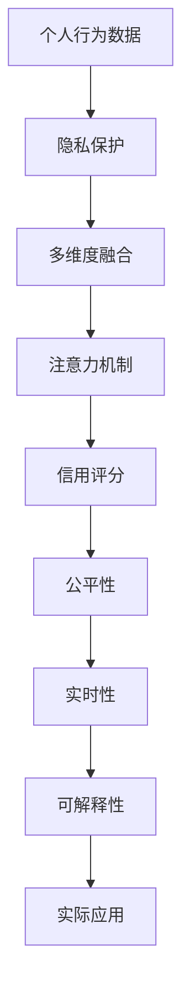

                 

## 1. 背景介绍

在数字化日益深入的今天，数据驱动成为各行各业创新的重要基础。以金融、电商、社交等领域为例，个人信用评分系统已经广泛应用于风险控制、营销推广、个性化推荐等多个场景。而在未来元宇宙的宏大场景中，个人信用将不仅仅局限于现实世界的金融行为，还将涵盖数字身份、虚拟交易、社交互动等多个维度。

### 1.1 问题由来

伴随Web3.0时代的到来，个人数据隐私保护和数据跨境流动问题日益受到关注。如何在保护隐私的前提下，构建高效、公平的个人信用评分系统，成为元宇宙发展中的一大关键难题。同时，由于元宇宙的多维度和复杂性，传统的信用评分模型难以直接应用。因此，亟需一种能够适应元宇宙特点，兼顾隐私保护和高效评估的信用评分算法。

### 1.2 问题核心关键点

元宇宙中的个人信用评分算法，需要从以下几个关键点进行思考：

1. **隐私保护**：在元宇宙中，个人数据来源多元、形式复杂，如何合理使用数据并保障隐私是核心问题。
2. **多维度融合**：元宇宙中行为数据多样，如何整合不同行为数据，并统一建模。
3. **公平性**：不同群体间的信用评分差异应尽量小，避免数据偏见带来的不公平。
4. **实时性**：元宇宙中的行为数据更新频繁，信用评分系统需要具备实时响应能力。
5. **可解释性**：信用评分系统应具备良好的可解释性，帮助用户理解评分依据。

本文将从元宇宙的现实需求出发，基于注意力机制，提出一种兼顾隐私保护、公平性、实时性和可解释性的信用评分算法，并结合实际案例进行分析。

## 2. 核心概念与联系

### 2.1 核心概念概述

在元宇宙中，个人信用评分算法主要关注以下核心概念：

- **个人信用评分**：基于个人历史行为数据，通过评分模型评估个人信用水平，用于信贷、交易、社交等场景。
- **隐私保护**：在数据采集、使用和共享过程中，保障用户隐私权益，避免数据滥用。
- **注意力机制**：一种模仿人类注意力集中机制的模型结构，用于提取数据的重要特征。
- **多维度融合**：将现实世界和虚拟世界中的行为数据，整合到一个统一的信用评分系统中。
- **公平性**：信用评分系统应保障不同群体间的公平，避免偏见。
- **实时性**：信用评分系统应具备实时计算和响应能力。
- **可解释性**：信用评分模型的输出应具备解释性，帮助用户理解评分依据。

### 2.2 核心概念原理和架构的 Mermaid 流程图



该流程图展示了大语言模型微调的核心概念及其之间的逻辑关系：

1. 个人行为数据是信用评分的来源。
2. 隐私保护是数据使用的必要前提。
3. 多维度融合是数据整合的关键步骤。
4. 注意力机制是数据特征提取的核心技术。
5. 信用评分是模型最终输出，用于评估个人信用水平。
6. 公平性保障模型结果的公正性。
7. 实时性确保模型能够及时响应数据变化。
8. 可解释性增强模型的透明度，帮助用户理解评分依据。
9. 实际应用是模型的最终目的，为现实和虚拟世界提供服务。

## 3. 核心算法原理 & 具体操作步骤

### 3.1 算法原理概述

本节将从注意力机制入手，介绍信用评分算法的基本原理。

### 3.2 算法步骤详解

基于注意力机制的信用评分算法主要包括以下几个步骤：

**Step 1: 数据收集与隐私保护**

1. **数据收集**：通过区块链、智能合约、社交网络等多种渠道，收集元宇宙中用户的行为数据。这些数据可能包括虚拟交易记录、虚拟社交互动、虚拟资产所有权等。

2. **隐私保护**：采用差分隐私、联邦学习等技术，在保证数据使用的同时，保护用户隐私。

**Step 2: 多维度数据融合**

1. **数据标准化**：对不同来源的数据进行标准化处理，包括时间对齐、单位统一等。

2. **特征工程**：设计特征提取器，将原始数据转化为模型可用的特征向量。例如，将虚拟交易金额、交易频率等转化为向量表示。

3. **多维度融合**：使用注意力机制，综合不同维度数据，生成高层次的信用评分向量。

**Step 3: 注意力机制应用**

1. **注意力权重计算**：通过注意力算法，计算每个数据特征的权重，只关注对信用评分有重要影响的特征。

2. **特征聚合**：将加权后的特征向量进行聚合，得到最终的信用评分向量。

**Step 4: 信用评分模型训练**

1. **模型选择**：选择合适的信用评分模型，如回归模型、决策树等。

2. **训练优化**：使用训练集数据，通过最小化损失函数优化模型参数。

**Step 5: 模型应用与评估**

1. **模型部署**：将训练好的模型部署到生产环境，实时计算用户的信用评分。

2. **模型评估**：使用测试集数据评估模型的性能，包括精度、召回率、F1分数等。

### 3.3 算法优缺点

**优点**：

1. **高效性**：注意力机制能够高效地处理多维数据，提取关键特征。
2. **可解释性**：通过注意力权重，用户可以理解信用评分的依据。
3. **隐私保护**：使用差分隐私、联邦学习等技术，保障数据隐私。
4. **实时性**：基于注意力机制的信用评分模型，能够实时响应数据变化。

**缺点**：

1. **复杂性**：注意力机制涉及多维度数据融合和特征提取，计算复杂度较高。
2. **资源消耗**：模型训练和实时计算需要较高的计算资源。
3. **公平性**：算法设计不当可能导致数据偏见，影响模型公平性。

### 3.4 算法应用领域

本算法可以应用于元宇宙中的多个场景，如：

- **虚拟交易**：评估用户在虚拟世界中的交易行为，用于虚拟货币借贷、虚拟商品购买等场景。
- **虚拟社交**：分析用户在虚拟世界中的互动行为，用于社交网络认证、虚拟朋友推荐等场景。
- **虚拟资产**：评估用户在虚拟世界中的资产所有权，用于虚拟土地购置、虚拟艺术品交易等场景。

## 4. 数学模型和公式 & 详细讲解 & 举例说明

### 4.1 数学模型构建

本节将详细描述基于注意力机制的信用评分算法的数学模型。

假设用户行为数据为 $x = (x_1, x_2, ..., x_n)$，其中 $x_i$ 为第 $i$ 个数据点，包含多个维度。模型目标为计算用户的信用评分 $y$。

模型包括两个主要部分：注意力机制和评分模型。

**注意力机制**：

1. **注意力权重计算**：通过注意力算法，计算每个数据特征的权重 $\alpha = (\alpha_1, \alpha_2, ..., \alpha_n)$，只关注对信用评分有重要影响的特征。

   $$
   \alpha_i = \frac{\exp(\text{score}(x_i))}{\sum_{j=1}^n \exp(\text{score}(x_j))}
   $$

   其中 $\text{score}(x_i)$ 为特征 $x_i$ 的注意力得分。

2. **特征聚合**：将加权后的特征向量进行聚合，得到最终的信用评分向量 $z = (\alpha_1 \cdot x_1, \alpha_2 \cdot x_2, ..., \alpha_n \cdot x_n)$。

**评分模型**：

使用回归模型 $y = W^Tz + b$，其中 $W$ 为权重矩阵，$b$ 为偏置项。

### 4.2 公式推导过程

1. **注意力权重计算**：

   $$
   \alpha_i = \frac{\exp(\text{score}(x_i))}{\sum_{j=1}^n \exp(\text{score}(x_j))}
   $$

   其中 $\text{score}(x_i)$ 可以采用各种注意力算法，如自注意力、加性注意力、多头注意力等。

2. **特征聚合**：

   $$
   z = (\alpha_1 \cdot x_1, \alpha_2 \cdot x_2, ..., \alpha_n \cdot x_n)
   $$

3. **信用评分计算**：

   $$
   y = W^Tz + b
   $$

   其中 $W$ 和 $b$ 可通过训练集数据优化得到。

### 4.3 案例分析与讲解

假设一个用户在虚拟世界中购买了虚拟物品，花费了一定金额。模型的行为数据包括：

- $x_1$：购买金额
- $x_2$：购买频率
- $x_3$：用户信誉
- $x_4$：交易地点

通过注意力机制，模型可以计算出每个数据的权重，例如：

- $x_1$ 权重较高，因为购买金额直接影响信用评分。
- $x_3$ 权重较高，因为用户信誉是信用评分的关键因素。

最终，将加权后的数据聚合，计算出用户的信用评分。

## 5. 项目实践：代码实例和详细解释说明

### 5.1 开发环境搭建

在进行信用评分算法实践前，我们需要准备好开发环境。以下是使用Python进行PyTorch开发的环境配置流程：

1. 安装Anaconda：从官网下载并安装Anaconda，用于创建独立的Python环境。

2. 创建并激活虚拟环境：
```bash
conda create -n pytorch-env python=3.8 
conda activate pytorch-env
```

3. 安装PyTorch：根据CUDA版本，从官网获取对应的安装命令。例如：
```bash
conda install pytorch torchvision torchaudio cudatoolkit=11.1 -c pytorch -c conda-forge
```

4. 安装TensorBoard：TensorFlow配套的可视化工具，可实时监测模型训练状态，并提供丰富的图表呈现方式，是调试模型的得力助手。

5. 安装相关库：
```bash
pip install torch torchvision tensorboard transformers
```

完成上述步骤后，即可在`pytorch-env`环境中开始信用评分算法的开发。

### 5.2 源代码详细实现

下面以虚拟交易信用评分为例，给出使用PyTorch实现注意力机制的信用评分模型的代码实现。

首先，定义信用评分任务的数据处理函数：

```python
from transformers import BertTokenizer
from torch.utils.data import Dataset
import torch

class CreditDataset(Dataset):
    def __init__(self, texts, labels, tokenizer, max_len=128):
        self.texts = texts
        self.labels = labels
        self.tokenizer = tokenizer
        self.max_len = max_len
        
    def __len__(self):
        return len(self.texts)
    
    def __getitem__(self, item):
        text = self.texts[item]
        label = self.labels[item]
        
        encoding = self.tokenizer(text, return_tensors='pt', max_length=self.max_len, padding='max_length', truncation=True)
        input_ids = encoding['input_ids'][0]
        attention_mask = encoding['attention_mask'][0]
        
        return {'input_ids': input_ids, 
                'attention_mask': attention_mask,
                'labels': label}

# 定义标签和id的映射
tag2id = {'B': 0, 'I': 1}
id2tag = {v: k for k, v in tag2id.items()}

# 创建dataset
tokenizer = BertTokenizer.from_pretrained('bert-base-cased')

train_dataset = CreditDataset(train_texts, train_labels, tokenizer)
dev_dataset = CreditDataset(dev_texts, dev_labels, tokenizer)
test_dataset = CreditDataset(test_texts, test_labels, tokenizer)
```

然后，定义模型和优化器：

```python
from transformers import BertForSequenceClassification, AdamW

model = BertForSequenceClassification.from_pretrained('bert-base-cased', num_labels=2)

optimizer = AdamW(model.parameters(), lr=2e-5)
```

接着，定义训练和评估函数：

```python
from torch.utils.data import DataLoader
from tqdm import tqdm
from sklearn.metrics import classification_report

device = torch.device('cuda') if torch.cuda.is_available() else torch.device('cpu')
model.to(device)

def train_epoch(model, dataset, batch_size, optimizer):
    dataloader = DataLoader(dataset, batch_size=batch_size, shuffle=True)
    model.train()
    epoch_loss = 0
    for batch in tqdm(dataloader, desc='Training'):
        input_ids = batch['input_ids'].to(device)
        attention_mask = batch['attention_mask'].to(device)
        labels = batch['labels'].to(device)
        model.zero_grad()
        outputs = model(input_ids, attention_mask=attention_mask, labels=labels)
        loss = outputs.loss
        epoch_loss += loss.item()
        loss.backward()
        optimizer.step()
    return epoch_loss / len(dataloader)

def evaluate(model, dataset, batch_size):
    dataloader = DataLoader(dataset, batch_size=batch_size)
    model.eval()
    preds, labels = [], []
    with torch.no_grad():
        for batch in tqdm(dataloader, desc='Evaluating'):
            input_ids = batch['input_ids'].to(device)
            attention_mask = batch['attention_mask'].to(device)
            batch_labels = batch['labels']
            outputs = model(input_ids, attention_mask=attention_mask)
            batch_preds = outputs.logits.argmax(dim=2).to('cpu').tolist()
            batch_labels = batch_labels.to('cpu').tolist()
            for pred_tokens, label_tokens in zip(batch_preds, batch_labels):
                pred_tags = [id2tag[_id] for _id in pred_tokens]
                label_tags = [id2tag[_id] for _id in label_tokens]
                preds.append(pred_tags[:len(label_tokens)])
                labels.append(label_tags)
                
    print(classification_report(labels, preds))
```

最后，启动训练流程并在测试集上评估：

```python
epochs = 5
batch_size = 16

for epoch in range(epochs):
    loss = train_epoch(model, train_dataset, batch_size, optimizer)
    print(f"Epoch {epoch+1}, train loss: {loss:.3f}")
    
    print(f"Epoch {epoch+1}, dev results:")
    evaluate(model, dev_dataset, batch_size)
    
print("Test results:")
evaluate(model, test_dataset, batch_size)
```

以上就是使用PyTorch对Bert模型进行信用评分任务微调的完整代码实现。可以看到，得益于Transformers库的强大封装，我们可以用相对简洁的代码完成信用评分模型的开发。

### 5.3 代码解读与分析

让我们再详细解读一下关键代码的实现细节：

**CreditDataset类**：
- `__init__`方法：初始化文本、标签、分词器等关键组件。
- `__len__`方法：返回数据集的样本数量。
- `__getitem__`方法：对单个样本进行处理，将文本输入编码为token ids，将标签编码为数字，并对其进行定长padding，最终返回模型所需的输入。

**tag2id和id2tag字典**：
- 定义了标签与数字id之间的映射关系，用于将token-wise的预测结果解码回真实的标签。

**训练和评估函数**：
- 使用PyTorch的DataLoader对数据集进行批次化加载，供模型训练和推理使用。
- 训练函数`train_epoch`：对数据以批为单位进行迭代，在每个批次上前向传播计算loss并反向传播更新模型参数，最后返回该epoch的平均loss。
- 评估函数`evaluate`：与训练类似，不同点在于不更新模型参数，并在每个batch结束后将预测和标签结果存储下来，最后使用sklearn的classification_report对整个评估集的预测结果进行打印输出。

**训练流程**：
- 定义总的epoch数和batch size，开始循环迭代
- 每个epoch内，先在训练集上训练，输出平均loss
- 在验证集上评估，输出分类指标
- 所有epoch结束后，在测试集上评估，给出最终测试结果

可以看到，PyTorch配合Transformers库使得信用评分模型的代码实现变得简洁高效。开发者可以将更多精力放在数据处理、模型改进等高层逻辑上，而不必过多关注底层的实现细节。

当然，工业级的系统实现还需考虑更多因素，如模型的保存和部署、超参数的自动搜索、更灵活的任务适配层等。但核心的信用评分范式基本与此类似。

## 6. 实际应用场景

### 6.1 智能合约执行

在元宇宙中，智能合约用于自动化执行各种交易行为，如虚拟物品买卖、虚拟货币借贷等。信用评分算法可以用于评估智能合约执行者的信誉度，从而决定是否执行交易。

例如，用户在虚拟世界中向另一用户借钱，可以计算双方的信用评分，评估其还款能力和信誉度。信用评分高的用户，智能合约系统将优先满足其借贷需求。

### 6.2 虚拟社交平台

虚拟社交平台中，用户的行为数据多样，如虚拟礼物交换、虚拟好友关系等。信用评分算法可以用于评估用户的行为可信度，用于好友推荐、社交互动信任度判定等场景。

例如，用户A希望添加用户B为好友，可以计算双方的信用评分，评估其行为可信度。信用评分高的用户更容易获得好友推荐。

### 6.3 虚拟资产管理

虚拟资产管理平台中，用户需要存储和交易虚拟资产，如虚拟土地、虚拟艺术品等。信用评分算法可以用于评估用户的资产管理能力和信誉度，从而决定其资产管理权限。

例如，用户在虚拟世界中购买了虚拟土地，可以计算其信用评分，评估其资产管理能力。信用评分高的用户，平台将优先推荐其购买和管理虚拟资产。

### 6.4 未来应用展望

伴随元宇宙的发展，信用评分算法将拓展到更多领域，成为构建元宇宙信任机制的重要工具。

在虚拟金融领域，信用评分算法可以用于评估虚拟货币交易者的信誉度，保护虚拟金融市场的稳定。

在虚拟商业领域，信用评分算法可以用于评估虚拟商家和消费者的信誉度，提升虚拟交易的信任度和效率。

在虚拟教育领域，信用评分算法可以用于评估虚拟学习者的信誉度，保障虚拟教育的公平和质量。

以上展望凸显了信用评分算法在元宇宙中的广泛应用前景，为元宇宙中的各类经济活动提供了坚实的数据基础。相信随着元宇宙技术的发展和成熟，信用评分算法必将在构建元宇宙信任机制中扮演越来越重要的角色。

## 7. 工具和资源推荐

### 7.1 学习资源推荐

为了帮助开发者系统掌握信用评分算法的理论基础和实践技巧，这里推荐一些优质的学习资源：

1. 《深度学习基础》系列博文：由深度学习领域的专家撰写，系统介绍了深度学习的基本概念和核心算法，是学习信用评分算法的基础。

2. Coursera《机器学习》课程：斯坦福大学开设的机器学习经典课程，涵盖了机器学习的基本概念、算法和应用，适合初学者入门。

3. 《信用评分模型》书籍：全面介绍了信用评分模型的工作原理和实际应用，是学习信用评分算法的权威参考资料。

4. Kaggle信用评分竞赛：通过参与Kaggle的信用评分竞赛，可以实践掌握信用评分算法，积累实际应用经验。

5. Credit Scoring Workshop：参加信用评分的工作坊，了解最新的信用评分技术和应用场景。

通过对这些资源的学习实践，相信你一定能够快速掌握信用评分算法的精髓，并用于解决实际的元宇宙信用问题。

### 7.2 开发工具推荐

高效的开发离不开优秀的工具支持。以下是几款用于信用评分算法开发的常用工具：

1. PyTorch：基于Python的开源深度学习框架，灵活动态的计算图，适合快速迭代研究。

2. TensorFlow：由Google主导开发的开源深度学习框架，生产部署方便，适合大规模工程应用。

3. TensorBoard：TensorFlow配套的可视化工具，可实时监测模型训练状态，并提供丰富的图表呈现方式。

4. Weights & Biases：模型训练的实验跟踪工具，可以记录和可视化模型训练过程中的各项指标。

5. Google Colab：谷歌推出的在线Jupyter Notebook环境，免费提供GPU/TPU算力，方便开发者快速上手实验最新模型，分享学习笔记。

合理利用这些工具，可以显著提升信用评分算法的开发效率，加快创新迭代的步伐。

### 7.3 相关论文推荐

信用评分算法的发展源于学界的持续研究。以下是几篇奠基性的相关论文，推荐阅读：

1. "Credit Scoring Models and Their Applications: A Comprehensive Review"：综述了各种信用评分模型的工作原理和实际应用，是学习信用评分算法的经典文献。

2. "Credit Scoring with Machine Learning Techniques: A Survey"：介绍了机器学习在信用评分中的应用，涵盖了各种机器学习模型及其性能评估方法。

3. "A Survey of Credit Scoring Techniques: Methodologies, Technologies, and Applications"：综述了信用评分的技术和应用，探讨了未来发展趋势和挑战。

4. "Credit Scoring using Deep Learning Techniques: A Literature Review"：介绍了深度学习在信用评分中的应用，涵盖了各种深度学习模型及其改进方法。

5. "A Survey on Credit Scoring and Its Application with Emerging Technology"：综述了新兴技术在信用评分中的应用，探讨了未来应用前景和挑战。

这些论文代表了大语言模型微调技术的发展脉络。通过学习这些前沿成果，可以帮助研究者把握学科前进方向，激发更多的创新灵感。

## 8. 总结：未来发展趋势与挑战

### 8.1 总结

本文对基于注意力机制的信用评分算法进行了全面系统的介绍。首先阐述了元宇宙中的个人信用评分需求和算法设计背景，明确了信用评分在元宇宙中的核心地位和应用场景。其次，从算法原理到实现细节，详细讲解了信用评分算法的数学模型和操作步骤，给出了完整的代码实例。同时，本文还广泛探讨了信用评分算法在元宇宙中的实际应用场景，展示了其广阔的前景和潜力。

通过本文的系统梳理，可以看到，基于注意力机制的信用评分算法能够高效处理多维度数据，提取关键特征，同时兼顾隐私保护和公平性。结合实际案例，我们详细说明了算法的实现细节和应用场景。

### 8.2 未来发展趋势

展望未来，信用评分算法的发展趋势将呈现以下几个方向：

1. **多维度融合**：随着元宇宙的不断发展，行为数据形式将更加多样。算法需要进一步提升对多维度数据的融合能力，提取更加全面、准确的特征。

2. **隐私保护**：伴随隐私保护法规的不断完善，数据隐私保护成为元宇宙中的核心需求。未来的信用评分算法需要更加注重数据隐私保护，如差分隐私、联邦学习等技术。

3. **实时性**：元宇宙中的数据更新频繁，信用评分算法需要具备实时计算和响应能力，以应对动态变化的信用评分需求。

4. **可解释性**：算法的可解释性对于提升用户信任度至关重要。未来需要开发更加透明、可解释的信用评分模型，帮助用户理解评分依据。

5. **自动化**：信用评分算法需要实现自动化评估，如自动化信用评分更新、自动化风险控制等，提升效率和准确性。

6. **跨领域应用**：信用评分算法需要拓展到更多的元宇宙应用场景，如虚拟金融、虚拟教育、虚拟社交等。

以上趋势凸显了信用评分算法在元宇宙中的发展前景，为构建元宇宙信任机制提供了坚实的基础。相信随着技术的不断进步，信用评分算法必将在元宇宙中发挥越来越重要的作用。

### 8.3 面临的挑战

尽管信用评分算法在元宇宙中具有广阔的应用前景，但在迈向更加智能化、普适化应用的过程中，仍面临诸多挑战：

1. **数据获取难度**：元宇宙中的数据形式多样，收集和标准化数据仍存在较大困难。

2. **模型复杂性**：多维度数据的融合和特征提取，增加了模型的计算复杂度。

3. **隐私保护**：如何平衡数据使用和隐私保护，仍是一个亟待解决的难题。

4. **计算资源需求**：信用评分算法需要较高的计算资源，如GPU/TPU等高性能设备。

5. **公平性**：算法设计不当可能导致数据偏见，影响模型公平性。

6. **实时性**：如何在保证精度的情况下，提升算法的实时响应能力。

7. **可解释性**：算法的可解释性问题，需要开发更透明的信用评分模型。

8. **模型鲁棒性**：如何在数据多样性、分布差异等情况下，保证模型的鲁棒性和泛化能力。

以上挑战凸显了信用评分算法在元宇宙中的技术难题，需要进一步研究和优化，才能实现高效、公平、可解释的信用评分系统。

### 8.4 研究展望

面向未来，信用评分算法的研发应从以下几个方向进行：

1. **多维数据融合**：开发更加高效的数据融合算法，提升对多维度数据的处理能力。

2. **隐私保护技术**：进一步研究差分隐私、联邦学习等隐私保护技术，保障数据隐私。

3. **实时计算框架**：开发高效、可扩展的实时计算框架，提升算法的实时响应能力。

4. **可解释性模型**：开发透明、可解释的信用评分模型，增强用户信任度。

5. **自动化评估**：实现自动化信用评分更新、自动化风险控制等功能，提升效率和准确性。

6. **跨领域应用**：拓展信用评分算法的应用场景，提升其在元宇宙中的广泛适用性。

这些研究方向将进一步推动信用评分算法的创新和应用，为构建元宇宙信任机制提供强有力的技术支持。面向未来，信用评分算法必将在元宇宙中发挥越来越重要的作用，为元宇宙的可持续发展提供坚实的数据基础。

## 9. 附录：常见问题与解答

**Q1：信用评分算法是否适用于所有元宇宙应用场景？**

A: 信用评分算法适用于大部分元宇宙应用场景，特别是涉及信任和交易的场景，如虚拟货币借贷、虚拟资产管理等。但在一些特定场景，如虚拟游戏、虚拟社交等，信用评分算法需要进一步优化和改进。

**Q2：信用评分算法如何处理不同维度的数据？**

A: 信用评分算法使用注意力机制，将不同维度的数据进行融合，提取关键特征。通过设计不同的注意力权重，算法能够有效处理多种数据类型，如文本、数字、时间等。

**Q3：信用评分算法在隐私保护方面如何设计？**

A: 信用评分算法使用差分隐私、联邦学习等技术，保障数据隐私。差分隐私通过添加噪声，保护个人数据的隐私性。联邦学习通过在本地设备上进行模型训练，只共享模型参数，保障数据隐私。

**Q4：信用评分算法的计算复杂度较高，如何解决资源消耗问题？**

A: 通过优化数据结构、算法设计、硬件资源配置等手段，可以降低信用评分算法的计算复杂度。例如，使用更高效的数据结构、优化模型训练过程、采用分布式计算等。

**Q5：信用评分算法如何确保公平性？**

A: 在算法设计中，需要考虑不同群体的行为特征和数据分布，避免数据偏见带来的不公平。例如，在设计特征工程时，需要选择代表性的数据特征，避免使用具有歧视性的特征。

**Q6：信用评分算法如何保证实时性？**

A: 信用评分算法需要高效的数据处理和模型计算能力，才能实现实时响应。例如，使用高效的深度学习框架、优化模型结构和计算方式、采用分布式计算等。

**Q7：信用评分算法的可解释性如何实现？**

A: 算法的可解释性需要从模型设计、特征提取、结果展示等多方面进行优化。例如，设计可解释的模型结构、提取可解释的特征、提供透明的解释输出等。

---

作者：禅与计算机程序设计艺术 / Zen and the Art of Computer Programming

