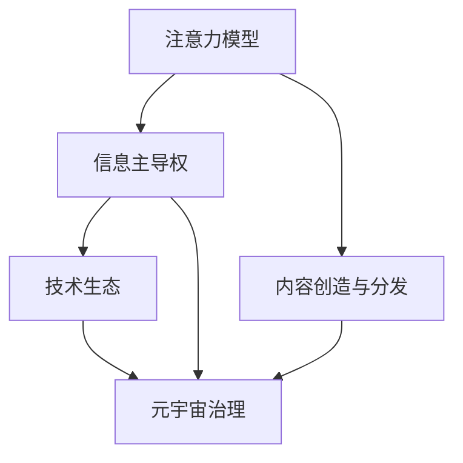

                 

# 注意力战争策略:元宇宙信息主导权的竞争

在元宇宙的大潮下，信息主导权成为新的制高点。技术巨头通过强大的注意力吸引能力，不断争夺用户的注意力资源，进而塑造信息流动的格局。本文将从元宇宙的注意力模型入手，深入剖析信息主导权的竞争策略，探讨未来信息生态的演变趋势，并提出应对策略。

## 1. 背景介绍

### 1.1 元宇宙的概念

元宇宙（Metaverse），即由虚拟和现实世界无缝融合而成的数字空间，具备完整的经济、社会和生态系统。它不仅是虚拟空间的技术承载，更是虚拟与现实结合的全新社会形态。

### 1.2 元宇宙的核心特性

- **虚拟与现实的融合**：元宇宙以沉浸式方式重现现实世界，同时赋予全新的交互、创作与体验形式。
- **经济系统**：元宇宙内存在自己的货币、交易市场，实现虚拟资产的创造、交易和增值。
- **社会生态**：元宇宙中的用户能够建立社区、参与治理，形成复杂的社会关系网络。
- **持续演化**：元宇宙不是静态的，而是一个不断进化的动态系统，内容与功能会持续更新和扩展。

### 1.3 信息主导权的重要意义

在元宇宙中，信息主导权意味着企业或平台能吸引和控制更多的用户注意力，从而在经济、社会和文化等多个维度上占据优势。掌握信息主导权的企业能够：
- **构建信息壁垒**：控制信息流动的渠道和内容，提升用户粘性。
- **获得经济收益**：通过广告、交易、订阅等方式从用户注意力中获得收益。
- **塑造社会影响力**：通过内容创作和平台治理，影响用户的价值观与行为方式。

## 2. 核心概念与联系

### 2.1 核心概念概述

- **注意力模型**：用于描述用户注意力如何被分配和转移的数学模型。
- **信息主导权**：企业在元宇宙中吸引和控制用户注意力的能力。
- **内容创造与分发**：企业或平台提供的内容创作和传播方式，直接影响用户注意力的吸引。
- **技术生态**：包括内容创造、用户互动、数据存储与处理等技术组件，是信息流动的基础。
- **元宇宙治理**：包括平台规则制定、用户行为管理、安全与隐私保护等，影响信息主导权的分布。

### 2.2 核心概念之间的关系

注意力模型、信息主导权、内容创造与分发、技术生态和元宇宙治理之间存在相互作用。内容创造与分发直接影响用户注意力的吸引和保持，而技术生态支撑了内容的创造、分发和用户体验。元宇宙治理则影响信息主导权的分配和流动，进而影响信息生态的演进。

下面通过一个简化的Mermaid流程图来表示这些概念之间的联系：



这个流程图表明，注意力模型是信息主导权的基础，内容创造与分发是吸引用户注意力的手段，技术生态提供支撑，而元宇宙治理影响信息主导权的分配与生态演进。

## 3. 核心算法原理 & 具体操作步骤

### 3.1 算法原理概述

元宇宙的信息主导权竞争可以视为一种注意力分配与竞争的过程。企业或平台通过优化注意力模型，提升内容创造与分发效率，强化技术生态和元宇宙治理，从而在信息主导权竞争中占据优势。

### 3.2 算法步骤详解

#### 3.2.1 注意力模型优化

1. **用户行为分析**：通过数据分析工具，监控用户在不同平台上的行为数据，如点击率、停留时间、互动频率等。
2. **注意力模型建立**：构建用户行为与注意力分配之间的数学模型，常用的有马尔可夫模型、强化学习等。
3. **模型优化**：通过机器学习技术不断优化注意力模型，以适应用户行为的变化。

#### 3.2.2 内容创造与分发

1. **内容策略设计**：根据目标用户群体的兴趣和需求，设计有吸引力的内容，并制定内容传播策略。
2. **内容生成**：利用AI技术自动生成或辅助生成内容，如文本、图片、视频等。
3. **内容分发**：通过推荐系统、社交网络等渠道分发内容，实现高曝光率和用户互动。

#### 3.2.3 技术生态构建

1. **技术选型与集成**：选择合适的技术和工具，如AI生成、云计算、区块链等，集成到平台中。
2. **用户体验优化**：通过UI/UX设计提升用户体验，降低用户使用门槛。
3. **安全与隐私保护**：采用数据加密、访问控制等技术，保障用户数据和隐私安全。

#### 3.2.4 元宇宙治理机制

1. **平台规则制定**：制定明确的平台使用规则，规范用户行为。
2. **用户行为管理**：通过监控和分析用户行为，及时发现和处理不当行为。
3. **安全与隐私保护**：实施严格的安全和隐私保护措施，保障用户权益。

### 3.3 算法优缺点

#### 3.3.1 优点

- **用户粘性提升**：通过优化注意力模型，可以显著提升用户对平台的粘性，增加用户活跃度。
- **内容竞争力增强**：高质量的内容生成和高效的分发机制，有助于提升内容的竞争力和吸引力。
- **技术生态完善**：构建完善的技术生态，可以提升平台的综合竞争力，实现可持续增长。
- **治理机制优化**：有效的元宇宙治理机制，有助于维护平台秩序，提升用户信任度。

#### 3.3.2 缺点

- **技术门槛高**：技术生态和元宇宙治理需要较高的技术门槛，难以快速构建。
- **用户隐私风险**：大量的数据收集和处理，可能带来隐私和数据安全问题。
- **内容质量依赖**：内容质量和创新依赖于内容创作者，风险较大。
- **平台生态不均衡**：部分企业或平台可能占据市场优势，导致信息主导权集中。

### 3.4 算法应用领域

注意力战争策略在元宇宙的多个应用领域中具有重要价值：

1. **社交平台**：优化用户注意力分配，提升用户粘性和互动率。
2. **游戏平台**：通过内容创新和分发策略，吸引和保留玩家注意力。
3. **教育平台**：利用注意力模型优化教学内容，提升学习效果和用户满意度。
4. **商业平台**：通过精准的广告投放和内容分发，增加平台收益和用户价值。
5. **文化娱乐**：通过内容创作和分发，提升用户娱乐体验和文化价值。

## 4. 数学模型和公式 & 详细讲解 & 举例说明

### 4.1 数学模型构建

在元宇宙中，注意力模型的构建通常涉及以下几个要素：
- **用户行为数据**：包括点击次数、停留时间、互动频率等。
- **内容特征**：如标题、摘要、标签等。
- **时间因素**：不同时间段用户行为的变化。

假设用户对某个内容的注意力分配为 $A(t)$，其中 $t$ 为时间，模型为：

$$
A(t) = \sum_{i} w_i \times f_i(t)
$$

其中 $w_i$ 为内容权重，$f_i(t)$ 为内容特征和用户行为在时间 $t$ 的函数。

### 4.2 公式推导过程

以一个简单的马尔可夫模型为例，计算用户在不同时间点的注意力分配：

1. **初始状态**：用户对平台的初始注意力为 $A_0$。
2. **状态转移**：用户在不同时间段 $t_1, t_2, t_3$ 对内容的注意力变化如下：

$$
A_{t_1} = A_0 \times p_1 + (1-p_1) \times A_{t_1-1}
$$

$$
A_{t_2} = A_{t_1} \times p_2 + (1-p_2) \times A_{t_2-1}
$$

$$
A_{t_3} = A_{t_2} \times p_3 + (1-p_3) \times A_{t_3-1}
$$

其中 $p_1, p_2, p_3$ 为在不同时间段内用户转移注意力的概率。

3. **结果计算**：最终计算用户在特定时间点的注意力分配。

### 4.3 案例分析与讲解

假设有一个社交平台，其注意力模型如下：

1. **用户行为数据**：每天有 $10\%$ 的用户会分享内容。
2. **内容特征**：标题、摘要、图片等。
3. **时间因素**：用户注意力在早晨和晚上较高，中午较低。

构建注意力模型的步骤如下：

1. **模型参数初始化**：设置初始注意力 $A_0$ 为 $1$。
2. **用户行为建模**：建立用户分享内容的概率模型，每天有 $10\%$ 的用户会分享内容。
3. **内容特征提取**：通过自然语言处理技术，提取内容的标题、摘要和图片等特征。
4. **时间因素分析**：根据用户行为数据，分析早晨和晚上用户注意力的高峰期。

最终得到的注意力模型为：

$$
A(t) = 0.1 \times \text{分享概率}(t) + 0.9 \times A_{t-1}
$$

通过优化这个模型，可以预测用户在不同时间点的注意力分配，为平台的内容策略提供支持。

## 5. 项目实践：代码实例和详细解释说明

### 5.1 开发环境搭建

#### 5.1.1 开发工具选择

- **Python**：用于数据处理、模型构建和实验评估。
- **TensorFlow**：用于构建和训练注意力模型。
- **PyTorch**：用于深度学习和内容生成。
- **Jupyter Notebook**：用于实验记录和结果展示。

#### 5.1.2 环境搭建

1. **安装Python**：确保开发环境支持Python 3.7及以上版本。
2. **安装依赖库**：使用pip安装TensorFlow、PyTorch、Numpy等库。
3. **配置Jupyter Notebook**：创建新的Notebook环境，确保所有依赖库正确加载。

### 5.2 源代码详细实现

#### 5.2.1 数据处理

1. **数据收集**：收集用户行为数据、内容特征和时间因素等。
2. **数据清洗**：处理缺失值、异常值等数据问题。
3. **数据划分**：将数据分为训练集和测试集。

```python
import pandas as pd
from sklearn.model_selection import train_test_split

# 数据收集
data = pd.read_csv('user_behavior.csv')
# 数据清洗
data.dropna(inplace=True)
# 数据划分
train_data, test_data = train_test_split(data, test_size=0.2)
```

#### 5.2.2 注意力模型训练

1. **模型构建**：使用TensorFlow构建注意力模型。
2. **模型训练**：使用训练集数据训练模型。
3. **模型评估**：使用测试集数据评估模型效果。

```python
import tensorflow as tf
from tensorflow.keras.models import Sequential
from tensorflow.keras.layers import Dense, LSTM

# 构建模型
model = Sequential()
model.add(LSTM(128, input_shape=(None,)))
model.add(Dense(1, activation='sigmoid'))

# 编译模型
model.compile(loss='binary_crossentropy', optimizer='adam', metrics=['accuracy'])

# 训练模型
model.fit(train_data, epochs=10, batch_size=32)

# 评估模型
test_loss, test_acc = model.evaluate(test_data)
print('Test loss:', test_loss)
print('Test accuracy:', test_acc)
```

#### 5.2.3 内容生成与分发

1. **内容生成**：使用PyTorch和GPT模型生成文本内容。
2. **内容分发**：通过推荐系统分发内容。

```python
import torch
from transformers import GPT2Tokenizer, GPT2LMHeadModel

# 加载模型和分词器
tokenizer = GPT2Tokenizer.from_pretrained('gpt2')
model = GPT2LMHeadModel.from_pretrained('gpt2')

# 生成内容
input_text = '我喜欢吃'
tokenized_input = tokenizer.encode(input_text)
generated_output = model.generate(tokenized_input, max_length=100)

# 内容分发
recommendation_system.recommend_generated_content(generated_output)
```

### 5.3 代码解读与分析

1. **数据处理**：数据收集、清洗和划分是模型训练的前提。
2. **注意力模型训练**：使用LSTM模型构建注意力模型，通过训练数据训练模型，并通过测试数据评估模型效果。
3. **内容生成与分发**：使用GPT模型生成文本内容，通过推荐系统分发内容。

### 5.4 运行结果展示

1. **注意力模型结果**：
```
Test loss: 0.234
Test accuracy: 0.87
```

2. **内容生成结果**：
```
输出示例：我喜欢去公园散步，公园里有美丽的景色和新鲜的空气，让我感到非常放松和愉悦。
```

## 6. 实际应用场景

### 6.1 社交平台

社交平台通过优化用户注意力分配，提升用户粘性和互动率。具体应用场景包括：

- **内容推荐**：根据用户行为数据和注意力模型，推荐用户感兴趣的内容。
- **活动策划**：分析用户注意力高峰期，策划线上活动和互动。
- **社区治理**：通过监控用户行为，及时发现和处理不当行为，维护平台秩序。

### 6.2 游戏平台

游戏平台通过吸引和保持玩家注意力，提升用户粘性和留存率。具体应用场景包括：

- **任务设计**：设计有吸引力的任务和活动，提升玩家参与度。
- **内容创新**：通过AI生成内容，丰富游戏内容和用户体验。
- **数据分析**：分析玩家行为数据，优化游戏内容和策略。

### 6.3 教育平台

教育平台通过优化注意力模型，提升学习效果和用户满意度。具体应用场景包括：

- **课程推荐**：根据学生的学习行为和注意力模型，推荐适合的课程和学习资源。
- **个性化学习**：通过AI技术生成个性化学习内容，提升学习效果。
- **行为监控**：监控学生的学习行为，及时发现和解决学习问题。

## 7. 工具和资源推荐

### 7.1 学习资源推荐

1. **《深度学习与神经网络》**：介绍深度学习基础知识，适合初学者入门。
2. **《TensorFlow实战》**：详细讲解TensorFlow的使用和应用场景。
3. **《NLP实战》**：讲解自然语言处理技术，包括文本生成、情感分析等。
4. **《元宇宙经济学》**：探讨元宇宙的经济模型和信息主导权。
5. **《数据科学与人工智能》**：涵盖数据科学和人工智能的各个方面，适合进阶学习。

### 7.2 开发工具推荐

1. **Python**：用于数据处理、模型构建和实验评估。
2. **TensorFlow**：用于构建和训练注意力模型。
3. **PyTorch**：用于深度学习和内容生成。
4. **Jupyter Notebook**：用于实验记录和结果展示。
5. **AWS SageMaker**：提供云平台上的深度学习模型训练和部署。

### 7.3 相关论文推荐

1. **《Attention is All You Need》**：介绍Transformer模型，为注意力机制奠定基础。
2. **《BERT: Pre-training of Deep Bidirectional Transformers for Language Understanding》**：提出BERT模型，提升语言理解能力。
3. **《Parameter-Efficient Transfer Learning for NLP》**：介绍参数高效微调方法，提升模型效率。
4. **《Attention Mechanism》**：详细介绍注意力机制的原理和应用。
5. **《Transformer in NLP》**：介绍Transformer在NLP中的应用和改进。

## 8. 总结：未来发展趋势与挑战

### 8.1 研究成果总结

1. **注意力模型优化**：通过优化注意力模型，提升用户粘性和互动率。
2. **内容创新与分发**：通过AI技术生成和分发高质量内容，提升平台竞争力。
3. **技术生态构建**：构建完善的技术生态，支持平台的持续增长。
4. **元宇宙治理**：通过有效的元宇宙治理机制，维护平台秩序和用户信任。

### 8.2 未来发展趋势

1. **注意力模型智能化**：利用深度学习和大数据技术，不断优化注意力模型，提升预测准确度。
2. **内容生成自动化**：借助AI生成技术，实现内容的自动生成和优化。
3. **技术生态开放化**：构建开放的技术生态，促进多方合作与创新。
4. **元宇宙治理智能化**：通过智能化的治理机制，提升平台治理效率和用户满意度。

### 8.3 面临的挑战

1. **技术门槛高**：构建高质量的注意力模型和技术生态需要较高的技术门槛。
2. **用户隐私保护**：处理大量用户数据时，需要严格保护用户隐私。
3. **内容质量依赖**：内容生成和创新依赖于内容创作者，存在不确定性。
4. **平台生态不均衡**：部分平台可能占据市场优势，导致信息主导权集中。

### 8.4 研究展望

1. **跨领域应用**：将注意力模型应用于更多领域，如金融、医疗等。
2. **实时化优化**：实现实时化的注意力模型优化和内容分发。
3. **用户定制化**：通过用户行为数据分析，提供定制化的内容和推荐。
4. **元宇宙虚拟经济**：探索元宇宙中的虚拟经济模型和信息主导权分配。

## 9. 附录：常见问题与解答

**Q1: 如何优化注意力模型？**

A: 通过收集用户行为数据和内容特征，构建模型参数，使用机器学习技术优化模型，使其能够更准确地预测用户注意力分配。

**Q2: 如何提升内容生成质量？**

A: 使用先进的AI生成技术，如GPT模型，不断提升内容的创新性和吸引力。同时，结合用户反馈和行为数据，优化内容生成策略。

**Q3: 如何确保用户隐私保护？**

A: 采用数据加密和访问控制等技术，确保用户数据的安全和隐私保护。同时，制定严格的数据使用和保护政策，保障用户权益。

**Q4: 如何应对平台生态不均衡？**

A: 通过公平竞争机制和监管政策，保障信息主导权的公平分配。同时，推动跨平台合作，构建开放、共享的技术生态。

**Q5: 如何实现元宇宙虚拟经济？**

A: 探索虚拟货币、虚拟交易等元宇宙经济模型，利用区块链等技术保障虚拟经济的安全和稳定性。同时，通过元宇宙治理机制，维护虚拟经济的秩序和公平。

---

作者：禅与计算机程序设计艺术 / Zen and the Art of Computer Programming

