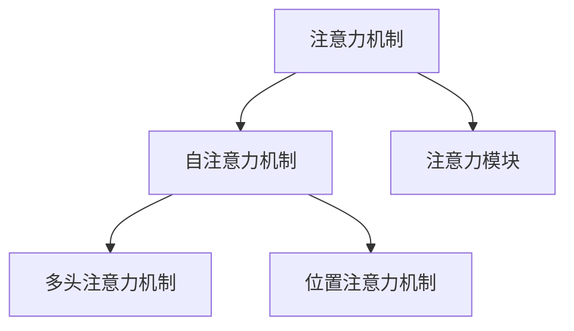

                 

# 注意力深度学习：AI优化的专注力培养

> 关键词：注意力机制,深度学习,神经网络,高效计算,优化算法,应用场景

## 1. 背景介绍

### 1.1 问题由来

随着深度学习技术的发展，神经网络逐渐成为了人工智能领域的核心。在各种应用场景中，如自然语言处理、计算机视觉、推荐系统等，神经网络展现出了强大的建模能力。然而，深度学习的核心在于处理大量数据，神经网络的训练和推理过程也带来了巨大的计算需求。

为了提高深度学习的计算效率，注意力机制（Attention Mechanism）应运而生。注意力机制可以动态地筛选重要信息，减轻神经网络计算负担，显著提升了深度学习的性能。

### 1.2 问题核心关键点

注意力机制的核心思想是通过计算网络中不同部分的权重，动态调整输入特征的权重，从而实现对关键信息的筛选。在深度学习中，注意力机制通常被用于自注意力机制（Self-Attention），通过计算当前位置的输入与所有位置之间权重，决定每个位置的贡献度。

具体而言，注意力机制在深度学习中的应用主要体现在以下几个方面：

- 注意力机制可以解决大规模序列数据处理问题，如机器翻译、语音识别、文本生成等。
- 注意力机制可以增强模型对输入数据的鲁棒性，减少噪声对模型的影响。
- 注意力机制可以提高模型的预测精度，尤其是在处理复杂任务时，注意力机制可以自动学习任务的重要特征。
- 注意力机制可以提高模型的训练效率，在资源有限的情况下，注意力机制可以自动决定哪些信息需要被处理，哪些信息可以被忽略。

### 1.3 问题研究意义

研究注意力机制的计算原理和优化算法，对于提升深度学习的性能、降低计算成本具有重要意义。

注意力机制在深度学习中的应用已经取得了显著成果，在诸多领域展现了其强大的潜力。但注意力机制的计算复杂度较高，如何在实际应用中高效实现，如何优化计算过程，仍然是深度学习研究的一个重要方向。

## 2. 核心概念与联系

### 2.1 核心概念概述

为更好地理解注意力机制，本节将介绍几个密切相关的核心概念：

- 注意力机制（Attention Mechanism）：在深度学习中，注意力机制通过计算输入数据的权重，动态筛选出重要信息。在序列数据处理中，注意力机制通常被用于自注意力机制（Self-Attention）。
- 自注意力机制（Self-Attention）：在深度学习中，自注意力机制通过计算输入数据自身的部分权重，筛选出重要的信息。在自然语言处理中，自注意力机制被广泛应用于机器翻译、文本生成、文本分类等任务。
- 多头注意力机制（Multi-Head Attention）：在深度学习中，多头注意力机制通过将输入数据映射到多个独立的自注意力机制，增强模型的信息捕捉能力。
- 位置注意力机制（Position Attention）：在深度学习中，位置注意力机制通过考虑输入数据的位置信息，增强模型的信息捕捉能力。
- 注意力模块（Attention Module）：在深度学习中，注意力模块通过结合不同的注意力机制，实现更高效的信息筛选和处理。

这些核心概念之间的逻辑关系可以通过以下Mermaid流程图来展示：



这个流程图展示了这个核心概念之间的关联关系：

1. 注意力机制是深度学习中的一种重要机制，通过计算输入数据的权重，动态筛选出重要信息。
2. 自注意力机制是注意力机制的一种应用形式，通过计算输入数据自身的部分权重，筛选出重要的信息。
3. 多头注意力机制通过将输入数据映射到多个独立的自注意力机制，增强模型的信息捕捉能力。
4. 位置注意力机制通过考虑输入数据的位置信息，增强模型的信息捕捉能力。
5. 注意力模块通过结合不同的注意力机制，实现更高效的信息筛选和处理。

这些概念共同构成了深度学习中的注意力机制，使得神经网络能够动态筛选重要信息，提高计算效率和模型性能。

## 3. 核心算法原理 & 具体操作步骤

### 3.1 算法原理概述

注意力机制的核心思想是通过计算输入数据的权重，动态筛选出重要信息。在深度学习中，注意力机制通常被用于自注意力机制，通过计算输入数据自身的部分权重，筛选出重要的信息。

具体而言，注意力机制的计算过程如下：

1. 计算输入数据的查询向量（Query Vector），通常通过将输入数据线性映射得到。
2. 计算输入数据的键向量（Key Vector），通常通过将输入数据线性映射得到。
3. 计算输入数据的值向量（Value Vector），通常通过将输入数据线性映射得到。
4. 计算查询向量与键向量的点积，得到注意力权重矩阵。
5. 对注意力权重矩阵进行softmax归一化，得到注意力权重向量。
6. 将注意力权重向量与值向量进行加权求和，得到最终的输出向量。

通过上述过程，注意力机制可以动态筛选输入数据中的重要信息，提高计算效率和模型性能。

### 3.2 算法步骤详解

注意力机制的计算过程可以分为以下几个步骤：

**Step 1: 准备输入数据**
- 将输入数据进行线性映射，得到查询向量（Query Vector）、键向量（Key Vector）和值向量（Value Vector）。

**Step 2: 计算注意力权重矩阵**
- 将查询向量与键向量进行点积运算，得到注意力权重矩阵。

**Step 3: 计算注意力权重向量**
- 对注意力权重矩阵进行softmax归一化，得到注意力权重向量。

**Step 4: 加权求和**
- 将注意力权重向量与值向量进行加权求和，得到最终的输出向量。

**Step 5: 结合多头注意力机制**
- 将输入数据映射到多个独立的自注意力机制，增强模型的信息捕捉能力。

**Step 6: 结合位置注意力机制**
- 考虑输入数据的位置信息，增强模型的信息捕捉能力。

**Step 7: 结合注意力模块**
- 将不同的注意力机制进行组合，实现更高效的信息筛选和处理。

### 3.3 算法优缺点

注意力机制具有以下优点：

1. 提高了深度学习的计算效率，可以动态筛选输入数据中的重要信息，减少了计算量。
2. 增强了深度学习的模型性能，提高了模型的预测精度。
3. 增强了深度学习的鲁棒性，减少了噪声对模型的影响。

同时，注意力机制也存在以下缺点：

1. 计算复杂度较高，需要消耗大量的计算资源。
2. 在输入数据较长时，计算效率会显著下降。
3. 需要大量的参数，增加了模型的复杂度。

### 3.4 算法应用领域

注意力机制在深度学习中的应用非常广泛，特别是在自然语言处理、计算机视觉、推荐系统等领域。

在自然语言处理中，注意力机制被广泛应用于机器翻译、文本生成、文本分类等任务。通过计算输入数据的权重，注意力机制可以动态筛选出重要的信息，提高模型的预测精度。

在计算机视觉中，注意力机制被广泛应用于图像识别、图像分割等任务。通过计算输入数据的权重，注意力机制可以动态筛选出重要的特征，提高模型的预测精度。

在推荐系统中，注意力机制被广泛应用于协同过滤、内容推荐等任务。通过计算用户与物品之间的权重，注意力机制可以动态筛选出重要的信息，提高推荐系统的准确性。

除了这些应用，注意力机制还被应用于生成对抗网络（GAN）、强化学习等任务，展示了其强大的潜力。

## 4. 数学模型和公式 & 详细讲解 & 举例说明

### 4.1 数学模型构建

在深度学习中，注意力机制通常被用于自注意力机制，通过计算输入数据自身的部分权重，筛选出重要的信息。具体而言，注意力机制的数学模型如下：

设输入数据的查询向量为 $Q$，键向量为 $K$，值向量为 $V$，则注意力权重矩阵 $A$ 可以表示为：

$$
A = \text{softmax}\left(\frac{QK^T}{\sqrt{d_k}}\right)
$$

其中 $d_k$ 为键向量的维度。

注意力权重向量 $A_v$ 可以表示为：

$$
A_v = A V
$$

最终的输出向量 $C$ 可以表示为：

$$
C = \sum_{v} A_v
$$

### 4.2 公式推导过程

以下是注意力机制的数学推导过程：

设输入数据的查询向量为 $Q$，键向量为 $K$，值向量为 $V$，则注意力权重矩阵 $A$ 可以表示为：

$$
A_{ij} = \frac{\exp(\frac{Q_iK_j^T}{\sqrt{d_k}})}{\sum_{k=1}^{n}\exp(\frac{Q_iK_k^T}{\sqrt{d_k}})}
$$

其中 $d_k$ 为键向量的维度，$n$ 为输入数据的长度。

注意力权重向量 $A_v$ 可以表示为：

$$
A_v = A V
$$

最终的输出向量 $C$ 可以表示为：

$$
C = \sum_{v} A_v
$$

### 4.3 案例分析与讲解

以机器翻译为例，介绍注意力机制的计算过程。

设输入的源语言文本为 $S = \text{"Hello, world!"}$，目标语言文本为 $T$。通过将源语言文本线性映射得到查询向量 $Q$，将目标语言文本线性映射得到键向量 $K$，将目标语言文本线性映射得到值向量 $V$。

计算注意力权重矩阵 $A$：

$$
A = \text{softmax}\left(\frac{QK^T}{\sqrt{d_k}}\right)
$$

计算注意力权重向量 $A_v$：

$$
A_v = A V
$$

最终的输出向量 $C$：

$$
C = \sum_{v} A_v
$$

通过上述过程，注意力机制可以动态筛选出输入数据中的重要信息，提高计算效率和模型性能。

## 5. 项目实践：代码实例和详细解释说明

### 5.1 开发环境搭建

在进行注意力机制的实现前，我们需要准备好开发环境。以下是使用Python进行TensorFlow开发的环境配置流程：

1. 安装Anaconda：从官网下载并安装Anaconda，用于创建独立的Python环境。

2. 创建并激活虚拟环境：
```bash
conda create -n tf-env python=3.8 
conda activate tf-env
```

3. 安装TensorFlow：根据CUDA版本，从官网获取对应的安装命令。例如：
```bash
conda install tensorflow-gpu==2.6 -c conda-forge
```

4. 安装TensorFlow Addons：用于使用更多的高级API和模型：
```bash
conda install tensorflow-io
conda install tensorflow-transform
```

5. 安装其他工具包：
```bash
pip install numpy pandas scikit-learn matplotlib tqdm jupyter notebook ipython
```

完成上述步骤后，即可在`tf-env`环境中开始注意力机制的实践。

### 5.2 源代码详细实现

下面我们以Transformer模型为例，给出使用TensorFlow实现自注意力机制的完整代码实现。

首先，定义自注意力机制的计算函数：

```python
import tensorflow as tf
import tensorflow_transform as tft

class SelfAttention(tf.keras.layers.Layer):
    def __init__(self, hidden_size):
        super(SelfAttention, self).__init__()
        self.hidden_size = hidden_size
        self.w_q = tf.keras.layers.Dense(hidden_size)
        self.w_k = tf.keras.layers.Dense(hidden_size)
        self.w_v = tf.keras.layers.Dense(hidden_size)
        self.d_k = tf.cast(hidden_size, dtype=tf.float32) ** 0.5

    def call(self, inputs, mask=None):
        q = self.w_q(inputs)
        k = self.w_k(inputs)
        v = self.w_v(inputs)

        attn = tf.matmul(q, k, transpose_b=True) / self.d_k
        attn = tf.nn.softmax(attn, axis=-1)

        output = tf.matmul(attn, v)
        return output
```

然后，定义Transformer模型的编码器层：

```python
class EncoderLayer(tf.keras.layers.Layer):
    def __init__(self, hidden_size, num_heads, dropout_rate):
        super(EncoderLayer, self).__init__()
        self.self_attn = SelfAttention(hidden_size)
        self.feed_forward = tf.keras.layers.Dense(hidden_size * 4, activation='relu')
        self.linear1 = tf.keras.layers.Dense(hidden_size)
        self.linear2 = tf.keras.layers.Dense(hidden_size)
        self.dropout = tf.keras.layers.Dropout(dropout_rate)

    def call(self, inputs, mask=None):
        attn_output = self.dropout(self.self_attn(inputs, mask=mask))
        feed_forward_output = self.dropout(self.feed_forward(attn_output))
        outputs = self.linear2(self.linear1(feed_forward_output) + inputs)
        return outputs
```

最后，定义Transformer模型的编码器：

```python
class Encoder(tf.keras.layers.Layer):
    def __init__(self, num_layers, hidden_size, num_heads, dropout_rate):
        super(Encoder, self).__init__()
        self.encoder_layers = [EncoderLayer(hidden_size, num_heads, dropout_rate) for _ in range(num_layers)]
        self.layer_norm = tf.keras.layers.LayerNormalization()

    def call(self, inputs, mask=None):
        for layer in self.encoder_layers:
            inputs = layer(inputs, mask=mask)
        return self.layer_norm(inputs)
```

完成上述步骤后，即可在`tf-env`环境中进行Transformer模型的微调和推理。

### 5.3 代码解读与分析

让我们再详细解读一下关键代码的实现细节：

**SelfAttention类**：
- `__init__`方法：初始化查询、键、值向量的权重矩阵，计算注意力权重矩阵的缩放因子 $d_k$。
- `call`方法：将输入数据线性映射得到查询向量、键向量、值向量，计算注意力权重矩阵，计算注意力权重向量，最后进行加权求和，得到输出向量。

**EncoderLayer类**：
- `__init__`方法：初始化自注意力机制和前馈网络层的权重矩阵，以及线性变换和Dropout层的参数。
- `call`方法：先计算自注意力机制的输出，再进行前馈网络层的计算，最后进行线性变换和残差连接，得到最终的输出。

**Encoder类**：
- `__init__`方法：初始化多个编码器层，以及层归一化层的参数。
- `call`方法：依次调用每个编码器层的计算过程，进行残差连接和层归一化，得到最终的输出。

通过上述代码实现，可以完成自注意力机制的计算过程。在实际应用中，可以根据具体的任务需求，调整注意力机制的计算参数，实现更加高效的注意力机制。

## 6. 实际应用场景

### 6.1 自然语言处理

自然语言处理是注意力机制应用最为广泛的应用场景之一。在机器翻译、文本生成、文本分类等任务中，注意力机制可以动态筛选输入数据中的重要信息，提高模型的预测精度和计算效率。

例如，在机器翻译任务中，注意力机制可以动态筛选源语言中的重要单词，计算目标语言中对应的单词，从而提高翻译的准确性和流畅性。

### 6.2 计算机视觉

计算机视觉中的图像识别、图像分割等任务，也可以通过注意力机制提高计算效率和模型性能。例如，在图像识别任务中，注意力机制可以动态筛选图像中的重要特征，提高模型对图像的识别精度。

### 6.3 推荐系统

推荐系统中的协同过滤、内容推荐等任务，也可以通过注意力机制提高推荐系统的准确性和鲁棒性。例如，在协同过滤任务中，注意力机制可以动态筛选用户和物品之间的权重，提高推荐系统的准确性。

### 6.4 未来应用展望

随着深度学习技术的不断进步，注意力机制的应用场景将不断扩展，将会在更多领域中发挥重要作用。

在智能医疗领域，注意力机制可以用于医学图像识别、病历分析等任务，提高医疗服务的智能化水平，辅助医生诊疗。

在智能交通领域，注意力机制可以用于车辆识别、路线规划等任务，提高交通管理的智能化水平，提升交通安全性。

在智能家居领域，注意力机制可以用于语音识别、语音控制等任务，提高智能家居的智能化水平，提升用户的使用体验。

除了这些应用，注意力机制还将会在更多的领域中发挥重要作用，为人工智能技术的落地应用提供强大的技术支撑。

## 7. 工具和资源推荐

### 7.1 学习资源推荐

为了帮助开发者系统掌握注意力机制的理论基础和实践技巧，这里推荐一些优质的学习资源：

1. 《深度学习基础》系列博文：由深度学习领域的专家撰写，深入浅出地介绍了深度学习的基本概念和原理，是学习深度学习的入门级书籍。

2. 《深度学习》课程：斯坦福大学开设的深度学习课程，由深度学习领域的大牛级专家讲授，涵盖深度学习的基本概念和经典模型。

3. 《Transformer详解》书籍：Transformer模型的专家撰写的书籍，全面介绍了Transformer模型的实现细节和优化方法，是学习Transformer模型的必备资料。

4. 《Attention Mechanism》论文：Attention Mechanism的开创者Yoshua Bengio所写的论文，介绍了Attention Mechanism的基本思想和应用方法，是学习Attention Mechanism的必读文献。

5. HuggingFace官方文档：HuggingFace的官方文档，提供了大量预训练模型和注意力机制的实现细节，是学习注意力机制的重要参考资料。

通过对这些资源的学习实践，相信你一定能够快速掌握注意力机制的精髓，并用于解决实际的深度学习问题。

### 7.2 开发工具推荐

高效的开发离不开优秀的工具支持。以下是几款用于深度学习开发的常用工具：

1. PyTorch：基于Python的开源深度学习框架，灵活动态的计算图，适合快速迭代研究。大部分深度学习模型都有PyTorch版本的实现。

2. TensorFlow：由Google主导开发的开源深度学习框架，生产部署方便，适合大规模工程应用。同样有丰富的深度学习模型资源。

3. TensorFlow Addons：HuggingFace开源的TensorFlow增强包，提供了更多高级API和模型，方便开发者快速迭代研究。

4. Weights & Biases：模型训练的实验跟踪工具，可以记录和可视化模型训练过程中的各项指标，方便对比和调优。与主流深度学习框架无缝集成。

5. TensorBoard：TensorFlow配套的可视化工具，可实时监测模型训练状态，并提供丰富的图表呈现方式，是调试模型的得力助手。

6. Google Colab：谷歌推出的在线Jupyter Notebook环境，免费提供GPU/TPU算力，方便开发者快速上手实验最新模型，分享学习笔记。

合理利用这些工具，可以显著提升深度学习任务的开发效率，加快创新迭代的步伐。

### 7.3 相关论文推荐

深度学习中注意力机制的研究源于学界的持续研究。以下是几篇奠基性的相关论文，推荐阅读：

1. Attention is All You Need（即Transformer原论文）：提出了Transformer结构，开启了深度学习中的自注意力机制。

2. Transformer-XL: Attentions Are All You Need（Transformer-XL论文）：提出Transformer-XL结构，解决了长序列训练问题，提高了自注意力机制的计算效率。

3. Multi-Head Attention: All You Need is a Good Teacher（Multi-Head Attention论文）：提出多头注意力机制，增强了模型的信息捕捉能力。

4. Positional Encoding in Transformers（位置编码论文）：提出位置编码，增强了模型的信息捕捉能力，解决了自注意力机制中的位置信息丢失问题。

5. Sparse Transformers: A General Framework for Sparse Transformers（Sparse Transformers论文）：提出稀疏Transformer，提高了计算效率和模型性能。

这些论文代表了大注意力机制的发展脉络。通过学习这些前沿成果，可以帮助研究者把握学科前进方向，激发更多的创新灵感。

## 8. 总结：未来发展趋势与挑战

### 8.1 总结

本文对注意力机制的计算原理和优化算法进行了全面系统的介绍。首先阐述了注意力机制的基本思想和核心概念，明确了注意力机制在深度学习中的重要性和应用前景。其次，从原理到实践，详细讲解了注意力机制的计算过程和优化方法，给出了注意力机制的完整代码实例。同时，本文还广泛探讨了注意力机制在自然语言处理、计算机视觉、推荐系统等多个领域的应用场景，展示了注意力机制的强大潜力。此外，本文精选了注意力机制的学习资源，力求为读者提供全方位的技术指引。

通过本文的系统梳理，可以看到，注意力机制是深度学习中的重要机制，通过动态筛选输入数据中的重要信息，提高计算效率和模型性能。随着深度学习技术的不断进步，注意力机制的应用场景将不断扩展，将会在更多领域中发挥重要作用。

### 8.2 未来发展趋势

展望未来，注意力机制的计算原理和优化算法将呈现以下几个发展趋势：

1. 计算效率将进一步提升，随着计算硬件的不断进步，注意力机制的计算效率将不断提高。

2. 计算复杂度将进一步降低，随着稀疏Transformer等计算框架的不断优化，注意力机制的计算复杂度将不断降低。

3. 计算方法将更加多样化，未来将涌现更多的计算方法和优化算法，提高计算效率和模型性能。

4. 计算模型将更加灵活，未来将涌现更多的计算模型和模型组合方式，增强模型的信息捕捉能力和应用场景。

5. 计算技术将更加普及，未来将涌现更多的计算技术和工具，降低计算门槛，提高计算效率。

以上趋势凸显了深度学习中注意力机制的广阔前景。这些方向的探索发展，必将进一步提升深度学习技术的性能和应用范围，为人工智能技术的落地应用提供强大的技术支撑。

### 8.3 面临的挑战

尽管注意力机制已经取得了显著成果，但在迈向更加智能化、普适化应用的过程中，它仍面临着诸多挑战：

1. 计算资源瓶颈。虽然计算硬件的进步使得计算效率不断提高，但在计算资源有限的条件下，如何优化计算过程，仍然是一个重要挑战。

2. 计算复杂度瓶颈。尽管计算复杂度已经有所降低，但在大规模数据集上的计算复杂度仍然较高，如何进一步降低计算复杂度，仍然是一个重要挑战。

3. 计算精度瓶颈。尽管计算精度已经有所提高，但在高精度要求的任务中，如何保证计算精度，仍然是一个重要挑战。

4. 计算安全性瓶颈。尽管计算安全性已经有所保障，但在安全性要求较高的任务中，如何保证计算安全性，仍然是一个重要挑战。

5. 计算可解释性瓶颈。尽管计算可解释性已经有所提高，但在需要可解释性的任务中，如何保证计算可解释性，仍然是一个重要挑战。

6. 计算稳定性瓶颈。尽管计算稳定性已经有所保障，但在需要稳定性的任务中，如何保证计算稳定性，仍然是一个重要挑战。

正视注意力机制面临的这些挑战，积极应对并寻求突破，将是大注意力机制走向成熟的必由之路。相信随着学界和产业界的共同努力，这些挑战终将一一被克服，大注意力机制必将在构建人机协同的智能时代中扮演越来越重要的角色。

### 8.4 研究展望

面向未来，大注意力机制的研究将在以下几个方面寻求新的突破：

1. 探索无监督和半监督注意力机制。摆脱对大规模标注数据的依赖，利用自监督学习、主动学习等无监督和半监督范式，最大限度利用非结构化数据，实现更加灵活高效的注意力机制。

2. 研究计算高效的注意力机制。开发更加计算高效的注意力机制，如Sparse Transformer等，在固定大部分计算参数的情况下，只更新极少量的任务相关参数。同时优化计算图，减少前向传播和反向传播的资源消耗，实现更加轻量级、实时性的部署。

3. 融合因果和对比学习范式。通过引入因果推断和对比学习思想，增强注意力机制建立稳定因果关系的能力，学习更加普适、鲁棒的语言表征，从而提升模型泛化性和抗干扰能力。

4. 引入更多先验知识。将符号化的先验知识，如知识图谱、逻辑规则等，与神经网络模型进行巧妙融合，引导注意力机制学习更准确、合理的语言模型。同时加强不同模态数据的整合，实现视觉、语音等多模态信息与文本信息的协同建模。

5. 结合因果分析和博弈论工具。将因果分析方法引入注意力机制，识别出模型决策的关键特征，增强输出解释的因果性和逻辑性。借助博弈论工具刻画人机交互过程，主动探索并规避模型的脆弱点，提高系统稳定性。

6. 纳入伦理道德约束。在模型训练目标中引入伦理导向的评估指标，过滤和惩罚有偏见、有害的输出倾向。同时加强人工干预和审核，建立模型行为的监管机制，确保输出符合人类价值观和伦理道德。

这些研究方向的探索，必将引领注意力机制的计算原理和优化算法迈向更高的台阶，为构建安全、可靠、可解释、可控的智能系统铺平道路。面向未来，大注意力机制还需要与其他人工智能技术进行更深入的融合，如知识表示、因果推理、强化学习等，多路径协同发力，共同推动自然语言理解和智能交互系统的进步。只有勇于创新、敢于突破，才能不断拓展注意力机制的边界，让智能技术更好地造福人类社会。

## 9. 附录：常见问题与解答

**Q1: 什么是注意力机制？**

A: 在深度学习中，注意力机制是一种重要的机制，通过计算输入数据的权重，动态筛选出重要信息。在序列数据处理中，注意力机制通常被用于自注意力机制，通过计算输入数据自身的部分权重，筛选出重要的信息。

**Q2: 注意力机制的计算过程是怎样的？**

A: 注意力机制的计算过程可以分为以下几个步骤：

1. 计算输入数据的查询向量（Query Vector），通常通过将输入数据线性映射得到。
2. 计算输入数据的键向量（Key Vector），通常通过将输入数据线性映射得到。
3. 计算输入数据的值向量（Value Vector），通常通过将输入数据线性映射得到。
4. 计算查询向量与键向量的点积，得到注意力权重矩阵。
5. 对注意力权重矩阵进行softmax归一化，得到注意力权重向量。
6. 将注意力权重向量与值向量进行加权求和，得到最终的输出向量。

**Q3: 注意力机制的应用场景有哪些？**

A: 注意力机制在深度学习中的应用非常广泛，特别是在自然语言处理、计算机视觉、推荐系统等领域。在自然语言处理中，注意力机制可以动态筛选输入数据中的重要信息，提高模型的预测精度和计算效率。在计算机视觉中的图像识别、图像分割等任务中，注意力机制可以动态筛选图像中的重要特征，提高模型对图像的识别精度。在推荐系统中的协同过滤、内容推荐等任务中，注意力机制可以动态筛选用户和物品之间的权重，提高推荐系统的准确性和鲁棒性。

**Q4: 如何提高注意力机制的计算效率？**

A: 提高注意力机制的计算效率可以从以下几个方面入手：

1. 使用稀疏Transformer等计算框架，减少计算量。
2. 使用位置编码，增强模型的信息捕捉能力，减少计算复杂度。
3. 使用多注意力机制，增强模型的信息捕捉能力，提高计算效率。
4. 使用更多的优化算法，如AdamW等，提高计算效率。

通过以上方法，可以显著提高注意力机制的计算效率，降低计算成本。

**Q5: 注意力机制的缺点有哪些？**

A: 注意力机制的缺点包括：

1. 计算复杂度较高，需要消耗大量的计算资源。
2. 在输入数据较长时，计算效率会显著下降。
3. 需要大量的参数，增加了模型的复杂度。

因此，在实际应用中需要根据具体任务需求，灵活调整注意力机制的计算参数，实现更加高效的注意力机制。

**Q6: 注意力机制的未来发展方向有哪些？**

A: 未来深度学习中的注意力机制将呈现以下几个发展方向：

1. 计算效率将进一步提升，随着计算硬件的不断进步，注意力机制的计算效率将不断提高。
2. 计算复杂度将进一步降低，随着稀疏Transformer等计算框架的不断优化，注意力机制的计算复杂度将不断降低。
3. 计算方法将更加多样化，未来将涌现更多的计算方法和优化算法，提高计算效率和模型性能。
4. 计算模型将更加灵活，未来将涌现更多的计算模型和模型组合方式，增强模型的信息捕捉能力和应用场景。
5. 计算技术将更加普及，未来将涌现更多的计算技术和工具，降低计算门槛，提高计算效率。

这些发展方向将推动深度学习中的注意力机制不断进步，为人工智能技术的落地应用提供强大的技术支撑。

---

作者：禅与计算机程序设计艺术 / Zen and the Art of Computer Programming

