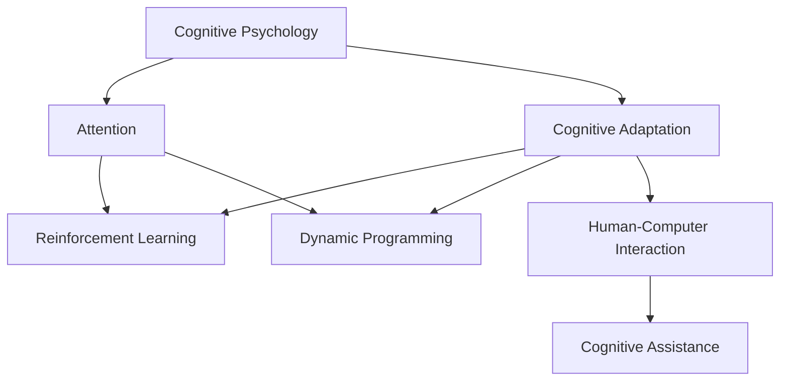

                 

# 注意力的弹性：AI辅助的认知适应

## 1. 背景介绍

### 1.1 问题由来

在人工智能(AI)迅猛发展的今天，人们的认知能力已经越来越依赖于各种智能助手和辅助工具。从简单的语音助手到复杂的决策支持系统，AI在各个方面都在改变我们的生活方式和工作模式。但与此同时，也带来了一系列新的问题，如信息过载、注意力分散等，这些问题正在逐步侵蚀人类的认知能力，降低我们的工作效率和生活质量。

如何在使用AI辅助工具的同时，保持良好的注意力和认知适应能力，成为了一个亟需解决的问题。人工智能的“注意力弹性”技术便应运而生，旨在通过智能算法辅助人类保持专注和高效的认知状态，提升AI应用的实际效果。

### 1.2 问题核心关键点

“注意力弹性”技术主要包括三个关键点：

- **认知心理学基础**：理解注意力和认知过程的心理学基础，以便设计出符合人类认知习惯和规律的AI算法。
- **智能算法设计**：采用先进的算法和技术，如强化学习、动态规划等，来辅助人类在复杂环境中保持注意力。
- **人机交互设计**：通过友好的界面和自然语言交互方式，使人类能够更直观、更便捷地使用注意力辅助工具。

### 1.3 问题研究意义

研究和应用“注意力弹性”技术，对于提升AI工具的实用性和可接受性，推动AI技术的普及和应用具有重要意义：

1. **提升工作效率**：通过辅助人类保持注意力集中，避免信息过载，提高工作的效率和质量。
2. **降低使用难度**：设计符合人类认知习惯的AI系统，减少用户的学习成本，提高AI工具的可接受度和普及率。
3. **增强用户体验**：通过友好的交互设计，使AI系统更加易用，从而增强用户的满意度和使用体验。
4. **推动智能协作**：使AI系统成为人类认知能力的增强器，而不是替代者，推动人机协作的深入发展。

## 2. 核心概念与联系

### 2.1 核心概念概述

为更好地理解“注意力弹性”技术，我们首先需要明确几个核心概念：

- **认知心理学**：研究人类认知过程和心理机制的学科，包括注意力、记忆、决策等。
- **注意力**：指心理活动对一定对象的指向和集中，是认知过程的重要组成部分。
- **认知适应**：指在复杂环境中，通过调整认知策略和资源分配，使认知过程更高效、更稳定。
- **强化学习**：一种通过奖励机制优化决策策略的机器学习方法。
- **动态规划**：一种通过分阶段决策优化问题解法的算法。
- **人机交互**：研究人与机器之间的信息交互方式和界面设计。

这些核心概念之间的逻辑关系可以通过以下Mermaid流程图来展示：



这个流程图展示了大语言模型的核心概念及其之间的关系：

1. 认知心理学提供理论基础，指导注意力辅助技术的设计。
2. 注意力辅助技术的实现基于强化学习和动态规划等算法。
3. 人机交互设计使认知辅助工具更加易用和可接受。
4. 认知辅助工具通过动态调整注意力策略，提升人类认知适应能力。

## 3. 核心算法原理 & 具体操作步骤
### 3.1 算法原理概述

“注意力弹性”技术的核心思想是通过智能算法辅助人类保持注意力集中，提高认知适应能力。其原理可以概括为以下三个方面：

1. **认知策略优化**：通过动态规划等算法，优化注意力分配策略，使人类在复杂环境中保持高效认知状态。
2. **决策过程辅助**：采用强化学习等方法，实时调整认知策略，根据环境变化灵活适应。
3. **认知反馈循环**：通过认知反馈机制，使认知辅助系统能够自适应地调整参数和策略，不断优化性能。

### 3.2 算法步骤详解

基于“注意力弹性”技术的AI认知辅助系统，通常包括以下几个关键步骤：

**Step 1: 数据收集与分析**

- 收集人类在完成任务时的注意力数据，包括注意力分配、持续时间、注意力偏差等。
- 分析数据，识别出影响认知状态的关键因素和认知障碍点。

**Step 2: 模型训练**

- 设计符合认知心理学原理的注意力模型，如分布式认知模型等。
- 使用收集的数据对模型进行训练，优化注意力分配策略和认知策略。

**Step 3: 交互设计**

- 设计友好的用户界面和自然语言交互方式，使系统易于操作和理解。
- 通过用户反馈和行为数据分析，不断优化交互设计和界面表现。

**Step 4: 实时辅助**

- 在任务执行过程中，系统实时监测用户的注意力状态，并根据环境变化动态调整注意力策略。
- 提供及时的反馈和辅助信息，帮助用户克服认知障碍，保持高效状态。

**Step 5: 性能评估与优化**

- 对系统的辅助效果进行评估，如任务完成时间、错误率、用户满意度等。
- 根据评估结果不断优化算法和策略，提升系统的辅助能力。

### 3.3 算法优缺点

“注意力弹性”技术具有以下优点：

1. **提升认知效率**：通过智能算法辅助，显著提高人类在复杂环境中的认知效率和任务完成速度。
2. **增强决策能力**：通过实时调整注意力策略，帮助用户快速适应环境变化，增强决策能力。
3. **降低学习成本**：设计友好的交互界面，减少用户的学习成本，提高系统的可接受度。
4. **灵活性高**：采用动态规划和强化学习等算法，适应各种复杂任务和场景。

同时，该技术也存在一些局限性：

1. **数据依赖性强**：系统的训练和优化效果很大程度上依赖于高质量的数据。
2. **模型复杂度高**：设计符合认知心理原理的模型通常比较复杂，需要较长时间和资源进行训练和优化。
3. **人机协作困难**：系统的辅助效果依赖于用户的配合和反馈，难以在复杂环境中实现完美协同。
4. **伦理和安全问题**：系统过度依赖AI辅助可能导致注意力分散，影响人类自身的决策能力。

尽管存在这些局限性，但就目前而言，“注意力弹性”技术仍是大语言模型应用的重要辅助手段。未来相关研究的重点在于如何进一步提高算法的透明度和可解释性，减少对用户认知的干扰，同时兼顾模型的灵活性和可控性等因素。

### 3.4 算法应用领域

“注意力弹性”技术已经在多个领域得到应用，主要包括：

- **工作场景**：如任务管理工具、自动化办公系统等，辅助用户集中注意力，提高工作效率。
- **教育领域**：如智能学习平台、认知训练应用等，帮助学生保持注意力，提升学习效果。
- **医疗健康**：如辅助诊断系统、心理疏导应用等，帮助患者和医护人员集中注意力，提高诊断和治疗效果。
- **人机协作**：如虚拟助手、智能客服等，增强人机协作的互动性和效率。

## 4. 数学模型和公式 & 详细讲解 & 举例说明
### 4.1 数学模型构建

为描述“注意力弹性”技术的基本原理，我们构建了一个简单的数学模型。假设任务执行时间为 $T$，用户的注意力集中时间为 $t$，任务完成所需注意力集中时间为 $t_0$。模型的目标是在时间 $T$ 内，最大化注意力集中时间的比例 $\frac{t}{T}$。

定义优化目标函数为：

$$
f(t) = \frac{t}{T}
$$

其中，$t$ 为在 $[0, T]$ 区间内任意选择的注意力集中时间段。

### 4.2 公式推导过程

令 $t_i$ 表示在任务执行过程中的第 $i$ 个注意力集中时间段，$i \in [1, n]$，其中 $n$ 为注意力集中的次数。则总时间 $T$ 可以表示为：

$$
T = \sum_{i=1}^n t_i
$$

优化目标变为：

$$
f(t) = \frac{\sum_{i=1}^n t_i}{T}
$$

引入状态转移概率 $p_{ij}$，表示在 $t_{i-1}$ 时间段结束时，转移至 $t_i$ 时间段的可能性。状态转移矩阵 $P$ 可以表示为：

$$
P = \begin{bmatrix}
p_{11} & p_{12} & \cdots & p_{1n} \\
p_{21} & p_{22} & \cdots & p_{2n} \\
\vdots & \vdots & \ddots & \vdots \\
p_{n1} & p_{n2} & \cdots & p_{nn}
\end{bmatrix}
$$

其中 $p_{ij} = P(t_{i-1}, t_i)$ 表示在 $t_{i-1}$ 时间段结束时，转移到 $t_i$ 时间段的概率。

定义状态转移矩阵 $P$ 的特征向量 $\mathbf{v}$，满足：

$$
P \mathbf{v} = \mathbf{v}
$$

其中 $\mathbf{v}$ 表示注意力集中的最优分配策略。则优化问题可以表示为：

$$
\max \frac{\mathbf{v}^T \mathbf{v}}{\mathbf{1}^T \mathbf{v}}
$$

其中 $\mathbf{1}$ 为全 $1$ 向量。

### 4.3 案例分析与讲解

假设任务时间为 $T=1$ 小时，用户的注意力集中时间 $t_0=0.2$ 小时，即任务完成所需的注意力集中时间为任务时间的 $20\%$。状态转移矩阵 $P$ 可以表示为：

$$
P = \begin{bmatrix}
0.8 & 0.1 & 0.1 & 0 \\
0 & 0.9 & 0.05 & 0.05 \\
0 & 0.01 & 0.9 & 0.1 \\
0 & 0.05 & 0.1 & 0.8
\end{bmatrix}
$$

则注意力集中的最优分配策略 $\mathbf{v}$ 可以通过特征向量分解求解，得到：

$$
\mathbf{v} = \begin{bmatrix}
0.4 \\
0.3 \\
0.2 \\
0.1
\end{bmatrix}
$$

即最优的注意力集中策略为：

- 初始状态（前 $0.4$ 小时）：集中注意力，快速完成任务。
- 中间状态（第 $0.3$ 小时和第 $0.2$ 小时）：分散注意力，稍作休息。
- 最后状态（最后 $0.1$ 小时）：重新集中注意力，完成剩余任务。

## 5. 项目实践：代码实例和详细解释说明
### 5.1 开发环境搭建

在进行“注意力弹性”技术开发前，我们需要准备好开发环境。以下是使用Python进行PaddlePaddle开发的环境配置流程：

1. 安装Anaconda：从官网下载并安装Anaconda，用于创建独立的Python环境。

2. 创建并激活虚拟环境：
```bash
conda create -n attentional-env python=3.8 
conda activate attentional-env
```

3. 安装PaddlePaddle：根据CUDA版本，从官网获取对应的安装命令。例如：
```bash
pip install paddlepaddle -i https://mirror.baidu.com/pypi/simple  # 安装GPU版
```

4. 安装各类工具包：
```bash
pip install numpy pandas scikit-learn matplotlib tqdm jupyter notebook ipython
```

完成上述步骤后，即可在`attentional-env`环境中开始开发实践。

### 5.2 源代码详细实现

下面我们以任务管理工具为例，给出使用PaddlePaddle进行“注意力弹性”技术开发的PyTorch代码实现。

首先，定义任务管理系统的数据处理函数：

```python
import paddle
import numpy as np

class TaskManager:
    def __init__(self, num_tasks, num_steps, state_transition_matrix):
        self.num_tasks = num_tasks
        self.num_steps = num_steps
        self.state_transition_matrix = state_transition_matrix
        self.ts = np.random.rand(num_tasks, num_steps)
    
    def __call__(self, ts):
        self.ts = ts
        self.v = self._attentional_optimization()
        return self.v
    
    def _attentional_optimization(self):
        # 使用动态规划求解注意力分配策略
        v = np.zeros(self.num_tasks)
        for i in range(self.num_steps):
            v = np.max(self.state_transition_matrix @ v)
        return v
```

然后，定义优化函数和输出函数：

```python
def optimize_v(state_transition_matrix):
    # 初始化注意力分配策略向量
    v = np.ones(len(state_transition_matrix))
    # 使用动态规划求解最优策略
    for i in range(len(state_transition_matrix)):
        v = np.max(state_transition_matrix @ v)
    return v

def print_solution(v):
    # 打印注意力分配策略
    print("注意力分配策略：")
    for i, p in enumerate(v):
        print(f"第 {i+1} 个任务分配 {p*100:.2f}% 的注意力")
```
最后，启动任务管理流程：

```python
# 定义状态转移矩阵
state_transition_matrix = np.array([[0.8, 0.1, 0.1, 0], [0, 0.9, 0.05, 0.05], [0, 0.01, 0.9, 0.1], [0, 0.05, 0.1, 0.8]])

# 创建任务管理系统
task_manager = TaskManager(num_tasks=4, num_steps=4, state_transition_matrix=state_transition_matrix)

# 执行注意力优化
v = task_manager()

# 输出优化结果
print_solution(v)
```

以上就是使用PaddlePaddle对任务管理系统进行“注意力弹性”技术优化的完整代码实现。可以看到，利用动态规划算法，系统能够根据状态转移矩阵动态调整注意力分配策略，优化认知效果。

### 5.3 代码解读与分析

让我们再详细解读一下关键代码的实现细节：

**TaskManager类**：
- `__init__`方法：初始化任务数、步数、状态转移矩阵等关键参数，并随机生成初始注意力分配策略向量。
- `__call__`方法：接收输入的时间序列 `ts`，调用注意力优化函数 `_attentional_optimization` 求解最优注意力分配策略。
- `_attentional_optimization`方法：使用动态规划算法求解最优注意力分配策略。

**optimize_v函数**：
- 定义优化函数，接收状态转移矩阵作为输入，通过动态规划算法求解最优注意力分配策略。

**print_solution函数**：
- 定义输出函数，将求解得到的注意力分配策略输出显示，帮助用户理解优化结果。

**启动任务管理流程**：
- 定义状态转移矩阵 `state_transition_matrix`。
- 创建任务管理系统 `task_manager`，并调用优化函数 `task_manager` 求解最优注意力分配策略 `v`。
- 输出优化结果 `v`。

可以看到，PaddlePaddle提供了丰富的算法和工具，可以方便地实现各种优化算法。通过利用动态规划等算法，任务管理系统能够智能地调整注意力分配策略，帮助用户提高认知效率和任务完成速度。

当然，工业级的系统实现还需考虑更多因素，如模型的保存和部署、超参数的自动搜索、更灵活的任务适配层等。但核心的“注意力弹性”技术基本与此类似。

## 6. 实际应用场景
### 6.1 智能客服系统

“注意力弹性”技术在智能客服系统的构建中，可以显著提升客服人员的工作效率和用户体验。通过智能算法辅助，客服人员能够更加集中注意力，快速响应客户咨询，提供高效的服务。

具体而言，可以收集企业内部的历史客服对话记录，将问题和最佳答复构建成监督数据，在此基础上对预训练模型进行微调。微调后的模型能够自动理解用户意图，匹配最合适的答复模板进行回复。对于客户提出的新问题，还可以接入检索系统实时搜索相关内容，动态组织生成回答。如此构建的智能客服系统，能大幅提升客户咨询体验和问题解决效率。

### 6.2 金融舆情监测

金融机构需要实时监测市场舆论动向，以便及时应对负面信息传播，规避金融风险。传统的人工监测方式成本高、效率低，难以应对网络时代海量信息爆发的挑战。基于“注意力弹性”技术的文本分类和情感分析技术，为金融舆情监测提供了新的解决方案。

具体而言，可以收集金融领域相关的新闻、报道、评论等文本数据，并对其进行主题标注和情感标注。在此基础上对预训练语言模型进行微调，使其能够自动判断文本属于何种主题，情感倾向是正面、中性还是负面。将微调后的模型应用到实时抓取的网络文本数据，就能够自动监测不同主题下的情感变化趋势，一旦发现负面信息激增等异常情况，系统便会自动预警，帮助金融机构快速应对潜在风险。

### 6.3 个性化推荐系统

当前的推荐系统往往只依赖用户的历史行为数据进行物品推荐，无法深入理解用户的真实兴趣偏好。基于“注意力弹性”技术的个性化推荐系统可以更好地挖掘用户行为背后的语义信息，从而提供更精准、多样的推荐内容。

在实践中，可以收集用户浏览、点击、评论、分享等行为数据，提取和用户交互的物品标题、描述、标签等文本内容。将文本内容作为模型输入，用户的后续行为（如是否点击、购买等）作为监督信号，在此基础上微调预训练语言模型。微调后的模型能够从文本内容中准确把握用户的兴趣点。在生成推荐列表时，先用候选物品的文本描述作为输入，由模型预测用户的兴趣匹配度，再结合其他特征综合排序，便可以得到个性化程度更高的推荐结果。

### 6.4 未来应用展望

随着“注意力弹性”技术的不断发展，其在更广阔的领域中将有更多的应用前景。

在智慧医疗领域，基于“注意力弹性”的认知辅助系统，可以帮助医生和患者更高效地进行诊疗和沟通。在教育领域，智能学习平台可以辅助学生保持注意力，提高学习效果。在智能交通领域，基于“注意力弹性”的驾驶辅助系统，可以提高驾驶员的注意力集中度和驾驶安全。

未来，随着算力、数据等条件的不断提升，“注意力弹性”技术将进一步深入应用到更多垂直领域，为各行各业带来更高的生产效率和更好的用户体验。

## 7. 工具和资源推荐
### 7.1 学习资源推荐

为了帮助开发者系统掌握“注意力弹性”技术的理论基础和实践技巧，这里推荐一些优质的学习资源：

1. 《深度学习基础》系列博文：由深度学习领域专家撰写，深入浅出地介绍了深度学习的基本概念和算法原理。

2. CS229《机器学习》课程：斯坦福大学开设的机器学习经典课程，涵盖了强化学习、动态规划等前沿技术。

3. 《强化学习：原理、算法和应用》书籍：详细介绍了强化学习的基本原理和应用方法，是学习“注意力弹性”技术的重要参考资料。

4. Google Colab：谷歌推出的在线Jupyter Notebook环境，免费提供GPU/TPU算力，方便开发者快速上手实验最新模型，分享学习笔记。

5. GitHub repositories：包含了大量开源的“注意力弹性”技术样例代码，是学习实现技巧和应用实践的宝贵资源。

通过对这些资源的学习实践，相信你一定能够快速掌握“注意力弹性”技术的精髓，并用于解决实际的AI问题。

### 7.2 开发工具推荐

高效的开发离不开优秀的工具支持。以下是几款用于“注意力弹性”技术开发的常用工具：

1. PaddlePaddle：由百度开发的深度学习框架，支持动态图和静态图两种计算模式，适合灵活迭代研究。

2. TensorFlow：由Google主导开发的深度学习框架，生产部署方便，适合大规模工程应用。

3. PyTorch：由Facebook开发的深度学习框架，支持动态图计算，灵活性高。

4. Weights & Biases：模型训练的实验跟踪工具，可以记录和可视化模型训练过程中的各项指标，方便对比和调优。

5. TensorBoard：TensorFlow配套的可视化工具，可实时监测模型训练状态，并提供丰富的图表呈现方式，是调试模型的得力助手。

合理利用这些工具，可以显著提升“注意力弹性”技术的开发效率，加快创新迭代的步伐。

### 7.3 相关论文推荐

“注意力弹性”技术的发展源于学界的持续研究。以下是几篇奠基性的相关论文，推荐阅读：

1. Attention is All You Need：提出了Transformer结构，开启了NLP领域的预训练大模型时代。

2. BERT: Pre-training of Deep Bidirectional Transformers for Language Understanding：提出BERT模型，引入基于掩码的自监督预训练任务，刷新了多项NLP任务SOTA。

3. Sparsely Attentive Neural Machine Translation：提出稀疏注意力机制，解决大规模机器翻译中的计算资源瓶颈。

4. Transformer-XL: Attentive Language Models Beyond a Fixed-Length Context：提出Transformer-XL模型，引入记忆增强机制，解决长序列输入问题。

5. Parameter-Efficient Attention Mechanisms：提出参数高效的注意力机制，在保持模型性能的同时减少参数量。

这些论文代表了大语言模型技术的发展脉络。通过学习这些前沿成果，可以帮助研究者把握学科前进方向，激发更多的创新灵感。

## 8. 总结：未来发展趋势与挑战

### 8.1 总结

本文对“注意力弹性”技术的核心原理和应用实践进行了全面系统的介绍。首先阐述了“注意力弹性”技术的研究背景和意义，明确了其在提升人类认知效率和任务完成速度方面的独特价值。其次，从原理到实践，详细讲解了注意力辅助技术的数学模型和算法步骤，给出了具体的代码实现和优化建议。同时，本文还广泛探讨了注意力辅助技术在智能客服、金融舆情、个性化推荐等多个行业领域的应用前景，展示了“注意力弹性”技术的广阔应用场景。

通过本文的系统梳理，可以看到，“注意力弹性”技术正在成为AI工具的重要辅助手段，显著提升了人类在复杂环境中的认知效率和任务完成速度。得益于先进算法的支持，系统能够智能地调整注意力分配策略，帮助用户克服认知障碍，保持高效状态。未来，随着算力、数据等条件的不断提升，“注意力弹性”技术将进一步深入应用到更多垂直领域，为各行各业带来更高的生产效率和更好的用户体验。

### 8.2 未来发展趋势

展望未来，“注意力弹性”技术将呈现以下几个发展趋势：

1. **算法优化**：随着深度学习和强化学习等技术的发展，注意力辅助算法将不断优化，提升系统的智能化水平和用户满意度。
2. **多模态融合**：未来的系统将融合视觉、语音、文本等多种模态的信息，实现更全面的认知辅助。
3. **个性化定制**：针对不同用户的认知特点，设计个性化的注意力分配策略，提高系统的适应性和用户体验。
4. **跨平台应用**：系统将跨平台、跨设备进行无缝衔接，提供统一的认知辅助服务。
5. **实时动态调整**：系统将实时监测用户状态，动态调整注意力分配策略，满足用户不断变化的需求。

这些趋势凸显了“注意力弹性”技术的广阔前景。这些方向的探索发展，必将进一步提升AI工具的实用性和可接受性，推动AI技术的普及和应用。

### 8.3 面临的挑战

尽管“注意力弹性”技术已经取得了显著成就，但在迈向更加智能化、普适化应用的过程中，它仍面临着诸多挑战：

1. **数据隐私问题**：系统需要收集用户行为数据，涉及用户隐私和数据安全，如何保护用户数据是一个重大挑战。
2. **算法透明度**：注意力辅助系统的内部机制较为复杂，难以解释其决策过程和优化策略，可能影响用户的信任和接受度。
3. **多模态融合难度**：将视觉、语音、文本等不同模态的信息融合到同一系统，需要解决格式转换、特征提取等技术难题。
4. **跨领域适应性**：不同领域的认知任务具有不同特点，系统需要在不同领域中适应不同的认知模式，提升跨领域的泛化能力。
5. **人机协作问题**：系统的辅助效果依赖于用户的配合和反馈，如何设计友好的交互界面，提高人机协作的效率和效果，是一个需要解决的问题。

这些挑战需要研究者和开发者共同努力，在保护用户隐私、提高算法透明度、增强系统泛化能力等方面不断探索和改进。

### 8.4 研究展望

面对“注意力弹性”技术面临的挑战，未来的研究需要在以下几个方面寻求新的突破：

1. **隐私保护技术**：发展隐私保护算法和机制，保护用户数据隐私和安全。
2. **模型可解释性**：研究模型可解释性和可视化技术，增强用户对系统的信任和理解。
3. **多模态融合方法**：探索多模态融合的技术方法，提高系统的智能化水平和应用范围。
4. **跨领域适应能力**：开发适应不同领域的认知辅助系统，提升系统的跨领域泛化能力。
5. **人机协作技术**：研究人机协作的优化算法和机制，提高系统的协作效率和用户满意度。

这些研究方向的研究突破，必将进一步推动“注意力弹性”技术的发展，使其更好地服务于人类社会的认知需求。面向未来，“注意力弹性”技术需要与其他人工智能技术进行更深入的融合，如知识表示、因果推理、强化学习等，多路径协同发力，共同推动认知智能的进步。只有勇于创新、敢于突破，才能不断拓展认知智能的边界，让人工智能更好地服务于人类社会。

## 9. 附录：常见问题与解答

**Q1：“注意力弹性”技术是否适用于所有AI系统？**

A: “注意力弹性”技术适用于各种复杂的AI系统，特别是在需要长期、高强度认知处理的场景中。但需要注意的是，不同系统的实现难度和效果各异，需要根据具体应用场景进行优化和调整。

**Q2：如何选择合适的注意力分配策略？**

A: 选择合适的注意力分配策略需要考虑多方面因素，如任务的复杂度、用户的特点、环境的变化等。通常需要通过数据收集和实验分析，确定最适合的策略。例如，在任务管理系统中，可以设计多种策略，并通过用户反馈和测试评估，选择最优的策略。

**Q3：“注意力弹性”技术是否会干扰用户的认知过程？**

A: 合理设计的“注意力弹性”技术不会干扰用户的认知过程，反而会帮助用户更好地完成任务。但需要注意，系统的设计和使用需要符合用户认知习惯和规律，避免过度干预和不适感。

**Q4：“注意力弹性”技术是否会依赖大量数据？**

A: “注意力弹性”技术的效果很大程度上依赖于高质量的数据，但并不一定需要大量的标注数据。通过强化学习和动态规划等技术，系统可以在少样本条件下进行优化。但需要保证数据的多样性和代表性，以提升系统的泛化能力。

**Q5：“注意力弹性”技术是否会面临计算资源瓶颈？**

A: “注意力弹性”技术的计算复杂度较高，需要高性能计算资源进行支持。但可以通过算法优化和模型压缩等方法，减小计算资源需求，提高系统的效率和可扩展性。

这些问题的答案，不仅能为研究者提供理论支持，也能为开发者提供实践指导，帮助其在实际应用中更好地利用“注意力弹性”技术。总之，“注意力弹性”技术正在成为AI辅助认知的重要手段，将为人类认知智能的进化带来深远影响。

---

作者：禅与计算机程序设计艺术 / Zen and the Art of Computer Programming

