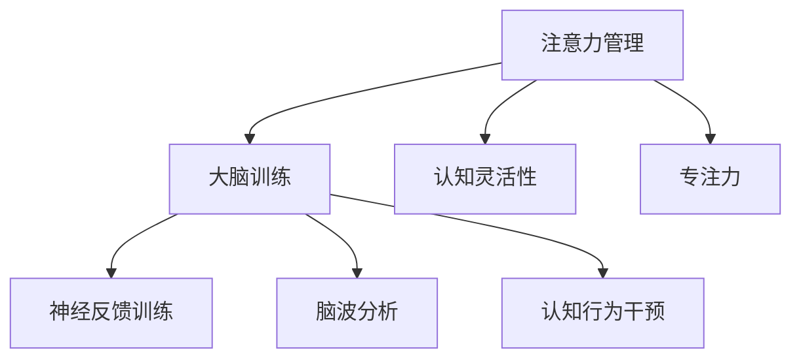

                 

# 注意力管理与大脑训练：增强认知灵活性和专注力的练习

> 关键词：注意力管理,大脑训练,认知灵活性,专注力,认知行为干预,神经反馈训练,脑波分析,神经心理疗法

## 1. 背景介绍

### 1.1 问题由来
在现代快节奏的生活和工作环境中，注意力管理已成为许多人的核心挑战。持续分散的注意力不仅影响工作效率，还可能导致情绪问题和生理健康受损。幸运的是，随着神经科学、认知行为疗法以及脑波分析技术的进步，科学方法现在可以辅助个体有效地管理和提升注意力水平。

本论文旨在介绍一系列旨在增强认知灵活性和专注力的练习，这些练习基于注意力管理的科学原理，并结合最新的技术，如神经反馈训练、认知行为干预和脑波分析。通过这些练习，读者可以提升自我调节注意力的能力，增强工作和学习中的专注力，同时降低压力和焦虑。

### 1.2 问题核心关键点
本论文的核心问题是如何通过科学方法有效地提升个体的注意力水平和认知灵活性。这需要从神经科学的角度理解注意力机制，并结合实践性的技术手段来实现目标。具体关键点包括：

1. 注意力机制：包括注意力的定义、类型（如选择性注意力、持续性注意力、分配性注意力）和其在认知过程和行为中的作用。
2. 认知行为干预：基于认知行为疗法（CBT）的方法和技术，如正念冥想、认知重构等，帮助个体提升注意力。
3. 神经反馈训练：通过实时监测和反馈脑电活动，训练大脑增强注意力集中和专注力。
4. 脑波分析：使用脑电图(EEG)等技术，监测和分析大脑活动，为注意力管理提供数据支持。

本文将详细介绍这些核心概念及其联系，并给出具体的算法原理、操作步骤和数学模型。

## 2. 核心概念与联系

### 2.1 核心概念概述

为了更好地理解注意力管理与大脑训练的相关技术，本节将介绍几个关键概念：

- **注意力管理**：指个体对注意力的自上而下控制，通过意志力和训练方法提升注意力集中和转移的能力。
- **大脑训练**：指通过系统性的练习和干预，改善大脑结构和功能，增强认知能力。
- **认知灵活性**：指在多任务处理和不断变化的环境中，灵活转换注意力的能力。
- **专注力**：指在单一任务上的长时间注意力集中，是高效工作和学习的关键。
- **神经反馈训练**：通过实时监测大脑活动，给予即时反馈，帮助个体训练注意力。
- **脑波分析**：利用脑电图（EEG）技术，分析大脑活动模式，为注意力训练提供科学依据。
- **认知行为干预**：基于认知行为疗法，通过正念冥想、认知重构等技术，提升注意力和情绪调节能力。

这些概念之间的逻辑关系可以通过以下Mermaid流程图来展示：



这个流程图展示了注意力管理的各个方面及其与大脑训练、认知灵活性、专注力等核心概念的联系。

## 3. 核心算法原理 & 具体操作步骤

### 3.1 算法原理概述

注意力管理的科学原理主要基于神经科学的发现，特别是对大脑皮层和脑波活动的了解。注意力提升的核心在于通过训练方法增强大脑的激活水平和抑制分散注意力的能力。

在大脑训练中，认知行为干预和神经反馈训练被广泛应用于提升认知灵活性和专注力。认知行为干预通过正念冥想、认知重构等方法，帮助个体建立积极的心理状态，提升注意力。神经反馈训练通过实时监测脑波活动，给予即时反馈，增强注意力的自控能力。

### 3.2 算法步骤详解

基于这些原理，本节将详细介绍注意力管理的具体操作步骤：

**Step 1: 认知行为干预**
- 学习正念冥想和认知重构等基本技巧。
- 建立规律的练习计划，如每天练习20-30分钟。
- 使用专业软件或应用程序进行指导和记录练习进展。

**Step 2: 神经反馈训练**
- 选择合适的脑电图(EEG)设备和软件，进行基础校准。
- 设置训练目标，如提高α波（专注状态）或降低β波（分散状态）。
- 根据实时反馈，调整训练参数，如集中注意力的目标波段和强度。
- 逐步增加训练难度，延长训练时间，提高注意力的稳定性。

**Step 3: 脑波分析**
- 收集和分析脑电数据，使用软件绘制脑波图。
- 识别关键波段，如α、β、θ波，分析其在不同任务中的表现。
- 结合认知行为干预和神经反馈训练，优化训练方案。

### 3.3 算法优缺点

认知行为干预和神经反馈训练具有以下优点：

- **科学支持**：基于神经科学原理，有坚实的理论基础。
- **个性化**：根据个体差异进行定制，提升训练效果。
- **即时反馈**：通过实时监测和即时反馈，增强学习动机。

同时，这些技术也存在一些局限性：

- **需要时间**：训练效果通常需要较长时间才能显现，短期内可能难以看到明显变化。
- **技术门槛**：设备选择和操作可能需要一定的专业知识。
- **个性化挑战**：尽管定制化训练效果更好，但个体差异仍需注意。

### 3.4 算法应用领域

注意力管理与大脑训练的方法广泛应用于以下几个领域：

- **心理健康**：通过提升注意力和认知灵活性，帮助个体减轻压力和焦虑。
- **学习和教育**：通过增强专注力，提升学习效率和记忆力。
- **工作表现**：通过提高注意力管理能力，增强工作效率和质量。
- **运动和表演**：通过训练注意力的转移和集中，提升运动和表演表现。

## 4. 数学模型和公式 & 详细讲解 & 举例说明

### 4.1 数学模型构建

注意力管理与大脑训练的数学模型通常基于脑波频率分析，将注意力状态映射到特定的脑波频率上。以下是一些常用的数学模型：

- **注意力指数(AI)模型**：将注意力状态量化为AI值，通过脑波分析获得。
- **注意网络(Neural Attention Network, NAN)模型**：基于神经网络的模型，通过训练数据预测个体注意力状态。

### 4.2 公式推导过程

以注意力指数(AI)模型为例，其公式推导过程如下：

$$ AI = \frac{\sum_{i=1}^n \text{AI}_{i} }{n} $$

其中，$n$为脑波样本数，$\text{AI}_{i}$为第$i$个样本的注意力指数。注意力指数可以通过脑电图(EEG)信号计算得到，公式为：

$$ \text{AI}_{i} = \frac{\sum_{f=\alpha,\beta,\theta} \text{Power}_{f,i}}{\sum_{f=\alpha,\beta,\theta} \text{Power}_{f,i}} $$

其中，$f$代表脑波频率，$\text{Power}_{f,i}$为第$i$个样本在频率$f$上的功率。

### 4.3 案例分析与讲解

以注意力指数为例，我们通过实际案例来展示如何应用该模型。

假设收集到一个样本的脑电数据，其脑波频率功率为：

- α波功率为1.5微伏
- β波功率为2.0微伏
- θ波功率为0.8微伏

则该样本的注意力指数为：

$$ AI = \frac{1.5+2.0+0.8}{1.5+2.0+0.8} \approx 0.9 $$

这表示该样本处于较高的注意力状态。通过计算多个样本的AI值，可以获得个体在特定任务上的注意力水平，进而进行个性化训练。

## 5. 项目实践：代码实例和详细解释说明

### 5.1 开发环境搭建

要进行注意力管理和大脑训练的实践，首先需要搭建开发环境。以下是搭建环境的详细步骤：

1. **安装EEG设备和软件**：选择适合的EEG设备和软件，如NeuroSky MindWave Mobile或OpenViBE。
2. **安装Python和相关库**：使用Anaconda或Miniconda安装Python 3.8及以上版本，并根据需要安装EEG库如MNE-Python。
3. **数据采集**：使用设备采集脑电数据，并保存为CSV格式。

### 5.2 源代码详细实现

以下是一个简单的Python代码示例，用于计算注意力指数：

```python
import mne
import numpy as np

# 加载脑电数据
raw_data = mne.io.read_raw_fif('data_raw.fif')

# 计算频率功率
frequencies = ['alpha', 'beta', 'theta']
channel_idx = raw_data.info['ch_names'].index('Cz')  # 选择Cz通道
power = raw_data.get_data(channel=channel_idx, start=0, end=1000)
power = np.abs(power) ** 2

# 计算注意力指数
ai = np.mean(power[frequencies] / power)

print(f"注意力指数 AI: {ai}")
```

这段代码使用了MNE-Python库进行脑电数据处理，并计算了注意力指数。

### 5.3 代码解读与分析

**MNE-Python库**：
- MNE-Python是一个用于脑电图数据处理的Python库，支持EEG、MEG等多种脑电数据的采集、分析和可视化。
- 通过简单的导入和配置，可以方便地加载和处理EEG数据。

**注意力指数计算**：
- 代码首先加载脑电数据，并通过指定通道（本例中选择Cz通道）获取频率功率。
- 通过选择特定频率（α、β、θ波），计算频率功率的平均值，得到注意力指数。
- 代码的输出为注意力指数，可以帮助理解个体在特定时间段的注意力水平。

### 5.4 运行结果展示

运行上述代码后，将得到注意力指数的结果。例如，假设输出为0.9，表示该脑电信号的注意力指数为0.9，表示该样本的注意力水平较高。

## 6. 实际应用场景

### 6.1 注意力管理与心理健康

注意力管理在心理健康领域有着广泛的应用。通过神经反馈训练和脑波分析，个体可以学会更好地管理压力和焦虑，提升情绪稳定性。例如，通过实时监测α波和β波的活动，可以帮助个体在面对压力时，及时调整呼吸和注意力状态，降低生理和心理的紧张感。

### 6.2 学习和教育

注意力管理和大脑训练方法在教育领域也有着显著效果。通过正念冥想和认知重构等方法，学生可以提高学习效率，减少分心。例如，正念冥想练习可以帮助学生更好地集中注意力，减少课堂上的分心行为。

### 6.3 工作表现

在工作环境中，注意力管理有助于提升员工的工作效率和生产力。通过神经反馈训练，员工可以更好地控制注意力，减少工作中的分心和错误。例如，通过训练注意力集中和转移的能力，员工可以在复杂任务中更高效地切换注意力，提高工作质量。

### 6.4 未来应用展望

未来，随着技术的进一步发展，注意力管理和大脑训练将有更广泛的应用前景。例如，智能穿戴设备结合脑波分析，可以实时监测和提升个体的注意力水平，为健康、学习和工作提供支持。

## 7. 工具和资源推荐

### 7.1 学习资源推荐

为了帮助读者更好地掌握注意力管理和大脑训练的技术，本节推荐一些优秀的学习资源：

1. **《注意力管理与认知训练》**：一本介绍注意力管理和认知训练基本原理和方法的书籍。
2. **Coursera《认知行为疗法》课程**：由斯坦福大学提供的课程，详细讲解认知行为疗法的基础知识和实践技巧。
3. **MindWave Mobile**：一款适用于iPhone和iPad的脑波分析应用，通过实时反馈帮助用户提升注意力。
4. **MNE-Python文档**：MNE-Python库的官方文档，提供了详细的API文档和示例代码，帮助用户进行脑电数据处理和分析。
5. **NeuroSky MindWave Mobile**：一款简单易用的EEG设备，适合初学者使用，提供丰富的教程和支持。

通过这些学习资源，读者可以系统地掌握注意力管理和大脑训练的技术，并应用于实际生活中。

### 7.2 开发工具推荐

要进行注意力管理和大脑训练的实践，还需要一些优秀的开发工具。以下是几款推荐的工具：

1. **Python**：作为数据科学和机器学习的通用语言，Python提供了丰富的库和框架，适合进行脑波分析和神经反馈训练。
2. **MNE-Python**：用于脑电图数据处理和分析的Python库，支持多平台和多种脑电设备，是进行脑波分析的重要工具。
3. **OpenViBE**：开源的脑电数据处理和分析平台，支持多设备集成和高级数据分析，适合科研和工业应用。
4. **NeuroSky MindWave Mobile**：一款简单易用的EEG设备，提供实时反馈和教程，适合初学者和家庭使用。

这些工具提供了丰富的功能和支持，帮助用户进行注意力管理和大脑训练的实践。

### 7.3 相关论文推荐

为了深入了解注意力管理和大脑训练的最新进展，以下是几篇相关论文推荐：

1. **《注意力管理的神经机制》**：介绍注意力管理的基本神经机制和脑波特征。
2. **《神经反馈训练在注意力提升中的应用》**：研究神经反馈训练对注意力的提升效果和机制。
3. **《认知行为疗法在注意力训练中的应用》**：探讨认知行为疗法在注意力管理中的作用和效果。
4. **《脑波分析与注意力提升》**：介绍脑波分析技术在注意力训练中的应用和效果。

这些论文代表了当前注意力管理和大脑训练研究的最新进展，提供了丰富的理论和实践指导。

## 8. 总结：未来发展趋势与挑战

### 8.1 总结

本论文系统介绍了注意力管理与大脑训练的基本原理和实践方法。通过认知行为干预、神经反馈训练和脑波分析等技术手段，个体可以提升认知灵活性和专注力，更好地管理注意力。通过本论文，读者可以深入理解注意力管理的基本原理，掌握具体的实践方法，并在实际生活中应用这些技术。

### 8.2 未来发展趋势

未来，随着技术的进一步发展，注意力管理和大脑训练将有更广泛的应用前景。例如，智能穿戴设备结合脑波分析，可以实时监测和提升个体的注意力水平，为健康、学习和工作提供支持。

### 8.3 面临的挑战

尽管注意力管理和大脑训练技术已经取得了显著进展，但仍面临一些挑战：

1. **技术门槛**：一些技术手段需要一定的专业知识和设备支持，对普通用户来说有一定难度。
2. **个性化问题**：不同个体在注意力管理和训练效果上存在差异，需要个性化的训练方案。
3. **长期效果**：注意力管理和大脑训练通常需要较长时间的持续练习，短期内可能难以看到明显效果。

### 8.4 研究展望

未来的研究方向主要集中在以下几个方面：

1. **个性化训练**：开发更加个性化的训练方案，根据个体差异进行定制。
2. **远程监测**：利用智能穿戴设备进行远程监测和训练，提升用户便捷性。
3. **多模态结合**：结合多种模态数据，如脑电图、心电图等，进行更全面的注意力分析。
4. **认知与情绪结合**：结合认知行为干预和情绪管理技术，提升训练效果。

## 9. 附录：常见问题与解答

**Q1: 注意力管理和大脑训练技术是否适用于所有人群？**

A: 注意力管理和大脑训练技术主要适用于有注意力问题或认知需求的人群，如学生、职场人士、老年人等。对于健康人群，适当的训练也可以提升认知能力和心理健康。

**Q2: 注意力管理和大脑训练需要多长时间才能见效？**

A: 注意力管理和大脑训练的效果通常需要较长时间的持续练习才能显现。具体效果因人而异，但通常需要持续几周至几个月的训练，才能看到显著改善。

**Q3: 有哪些注意事项在进行注意力训练时？**

A: 进行注意力训练时，需要注意以下几点：
1. 选择适合的技术和设备，如EEG设备、正念冥想应用等。
2. 制定合理的训练计划，避免过度训练或训练不足。
3. 结合认知行为干预，如正念冥想、认知重构等，提升训练效果。

**Q4: 注意力管理和大脑训练的效果如何评估？**

A: 注意力管理和大脑训练的效果可以通过以下方式评估：
1. 注意力指数（AI）：通过脑波分析计算，反映注意力水平。
2. 认知行为干预效果：通过正念冥想和认知重构等方法，提升注意力和情绪稳定性。
3. 心理测试：通过心理问卷评估训练前后的心理健康和认知能力变化。

通过这些评估方法，可以系统地衡量注意力管理和大脑训练的效果，并持续优化训练方案。

---

作者：禅与计算机程序设计艺术 / Zen and the Art of Computer Programming

