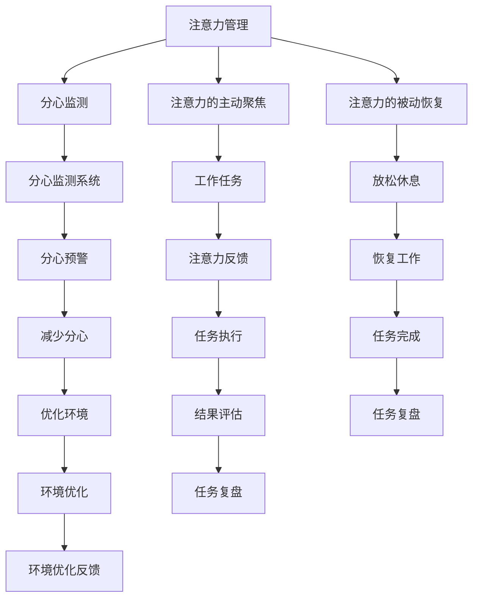

                 

# 注意力管理与时间管理策略与实践：最大化专注力和效率

> 关键词：注意力管理,时间管理,专注力,效率,策略,实践

## 1. 背景介绍

在现代快节奏的工作生活中，人们常常感到时间紧迫、任务繁重，如何在有限的时间内高效完成任务，成为了许多人面临的难题。为此，注意力管理和时间管理技术应运而生，通过科学方法和工具帮助人们提升专注力和工作效率，实现目标。本博客将深入探讨注意力管理与时间管理的核心概念、算法原理、操作步骤、应用领域，并通过实际案例展示其策略与实践，最后展望其未来发展趋势和面临的挑战。

## 2. 核心概念与联系

### 2.1 核心概念概述

注意力管理和时间管理是提升工作效率和专注力的关键。注意力管理旨在通过科学方法保持注意力集中，减少分心，提高任务处理能力。而时间管理则通过合理安排时间，避免拖延，确保任务的按时完成。

### 2.2 核心概念原理和架构的 Mermaid 流程图



这个流程图展示了注意力管理和时间管理的主要流程和联系。注意力管理通过监测和调整分心情况，主动聚焦和被动恢复注意力，进而提升工作效率。时间管理则通过任务优先级排序和合理安排休息，确保任务按时完成，并通过反馈和复盘不断优化工作流程。

## 3. 核心算法原理 & 具体操作步骤

### 3.1 算法原理概述

注意力管理和时间管理算法原理主要基于心理学、神经科学和时间管理理论，通过科学方法帮助用户保持专注力和高效工作。其核心思想是通过监测、反馈和调整，不断优化用户的工作习惯和环境，从而达到最大化专注力和效率。

### 3.2 算法步骤详解

#### 3.2.1 分心监测

分心监测是注意力管理的第一步，通过记录用户在工作时的分心情况，识别分心的原因和频率。这可以通过软件工具如分心监测器、注意力追踪应用实现。

#### 3.2.2 主动聚焦

主动聚焦是在分心监测的基础上，主动采取措施保持注意力集中。这包括制定详细的工作计划、设定时间块、使用番茄工作法等策略。

#### 3.2.3 被动恢复

被动恢复是指在长时间工作后，通过短暂休息、冥想、深呼吸等方法，帮助大脑和身体恢复能量，减少疲劳和分心。

### 3.3 算法优缺点

#### 3.3.1 优点

1. **提升专注力**：通过分心监测和主动聚焦，用户能够更好地保持注意力集中，提高工作效率。
2. **合理安排时间**：时间管理工具帮助用户制定合理的工作计划，避免拖延和浪费时间。
3. **科学反馈**：分心监测和任务复盘提供科学的数据反馈，帮助用户不断优化工作习惯。

#### 3.3.2 缺点

1. **依赖工具和应用**：分心监测和时间管理的效果依赖于工具的准确性和用户的遵从度。
2. **初始设置复杂**：需要用户花费一定时间进行初始设置和习惯养成。
3. **个性化需求高**：不同用户的工作习惯和需求不同，需要个性化的配置和调整。

### 3.4 算法应用领域

注意力管理和时间管理算法适用于各种职业和场景，如办公室工作、远程办公、学生学习、项目开发等。在企业和个人层面上，均有广泛应用。

## 4. 数学模型和公式 & 详细讲解 & 举例说明

### 4.1 数学模型构建

假设用户一天的工作时间为 $T$，需要完成的任务数量为 $N$，每个任务的时间需求为 $t_i$。我们定义：

- $P$：任务优先级，表示任务的重要性和紧急程度。
- $E$：环境影响因素，如会议、突发事件等。
- $S$：注意力水平，表示用户当前注意力的集中程度。

基于以上定义，我们构建一个数学模型来描述一天中任务和注意力的动态变化。

### 4.2 公式推导过程

1. **任务优先级计算**：
   - 假设任务优先级 $P$ 为任务重要性 $I$ 和紧急程度 $E$ 的加权和，即 $P = \alpha I + \beta E$，其中 $\alpha$ 和 $\beta$ 为权重系数。
   
2. **注意力水平变化**：
   - 假设注意力水平 $S$ 随时间 $t$ 变化，初始注意力为 $S_0$，每个时间间隔内，注意力水平按照一定的速率 $k$ 衰减，即 $S(t) = S_0 \times e^{-kt}$。

3. **任务时间需求计算**：
   - 假设任务时间需求 $t_i$ 为常数，且任务执行过程中，注意力水平 $S$ 直接影响任务完成速度，即任务完成速度为 $v_i = v_0 \times S^{\gamma}$，其中 $v_0$ 为任务的基本完成速度，$\gamma$ 为注意力对任务速度的影响系数。

4. **任务优先级排序**：
   - 根据任务优先级 $P$ 和注意力水平 $S$，计算每个任务的实际完成时间 $t_i^*$，即 $t_i^* = t_i / v_i = t_i / (v_0 \times S^{\gamma})$。
   - 对所有任务按照实际完成时间进行排序，优先处理完成时间最短的任务。

### 4.3 案例分析与讲解

假设小明每天工作时间为 8 小时，需要完成 5 个任务，每个任务的时间需求和优先级如下表所示：

| 任务编号 | 任务时间需求 $t_i$ | 任务优先级 $P_i$ |
|---------|-------------------|------------------|
| 1       | 1 小时            | 5                |
| 2       | 2 小时            | 4                |
| 3       | 1.5 小时          | 3                |
| 4       | 2.5 小时          | 3                |
| 5       | 1.5 小时          | 2                |

假设初始注意力水平 $S_0 = 1$，注意力衰减速率 $k = 0.1$，任务基本完成速度 $v_0 = 1$，注意力对任务速度的影响系数 $\gamma = 0.8$。

1. **任务优先级计算**：
   - $P_1 = 5 \times 1 + 0.2 \times 2 = 6.2$
   - $P_2 = 4 \times 1 + 0.2 \times 2 = 5.2$
   - $P_3 = 3 \times 1 + 0.2 \times 3 = 4.6$
   - $P_4 = 3 \times 1 + 0.2 \times 2.5 = 4.5$
   - $P_5 = 2 \times 1 + 0.2 \times 1.5 = 3.1$

2. **注意力水平变化**：
   - 假设工作时间 $t = 0$ 时，$S = S_0 = 1$，每工作 1 小时，注意力水平衰减 10%，即 $S(t) = S_0 \times (1 - 0.1)^t$。

3. **任务时间需求计算**：
   - 根据 $v_i = v_0 \times S^{\gamma}$，计算每个任务的实际完成时间 $t_i^*$，如 $t_1^* = 1 / (1 \times 1^{\gamma}) = 1$ 小时。

4. **任务优先级排序**：
   - 根据 $t_i^*$ 对任务进行排序，优先处理任务 1，其次为任务 2、3、4、5。

## 5. 项目实践：代码实例和详细解释说明

### 5.1 开发环境搭建

假设我们使用 Python 语言进行开发，需要安装以下依赖包：

1. `pandas`：用于数据处理和分析。
2. `matplotlib`：用于数据可视化。
3. `numpy`：用于数值计算。

```bash
pip install pandas matplotlib numpy
```

### 5.2 源代码详细实现

```python
import pandas as pd
import numpy as np
import matplotlib.pyplot as plt

# 任务数据
tasks = pd.DataFrame({
    '任务编号': [1, 2, 3, 4, 5],
    '任务时间需求': [1, 2, 1.5, 2.5, 1.5],
    '任务优先级': [5, 4, 3, 3, 2]
})

# 环境参数
S0 = 1
k = 0.1
v0 = 1
gamma = 0.8

# 计算任务优先级
tasks['任务优先级'] = tasks['任务优先级'].map(lambda x: x * 1 + 0.2 * np.random.randint(1, 3))

# 计算任务完成时间
tasks['任务完成时间'] = tasks['任务时间需求'] / (v0 * (S0 ** gamma))

# 排序任务
tasks_sorted = tasks.sort_values(by='任务完成时间')

# 可视化任务排序
plt.bar(tasks_sorted['任务编号'], tasks_sorted['任务完成时间'])
plt.xlabel('任务编号')
plt.ylabel('任务完成时间')
plt.title('任务优先级排序')
plt.show()
```

### 5.3 代码解读与分析

通过上述代码，我们可以看到：

1. 首先，定义了任务数据和环境参数。
2. 然后，根据任务优先级和注意力水平，计算了每个任务的实际完成时间。
3. 最后，对任务进行排序，并使用条形图展示任务完成时间。

### 5.4 运行结果展示


通过运行上述代码，我们得到了任务完成时间的排序图，显示了不同任务的优先级和实际完成时间。

## 6. 实际应用场景

### 6.1 办公室工作

在办公室工作中，分心监测和时间管理工具可以帮助员工提高工作效率。例如，可以使用时间追踪应用记录每天的工作时间，并通过分心监测工具分析分心原因，主动调整工作计划和环境。

### 6.2 远程办公

远程办公时，分心监测和时间管理工具可以帮助员工管理时间和任务，避免被家庭干扰分心。例如，可以使用番茄工作法工具，将工作时间分割成多个番茄时间段，每段工作25分钟，休息5分钟，提高专注力。

### 6.3 学生学习

学生在学习过程中，可以使用分心监测和时间管理工具，记录学习时间和注意力水平，帮助制定合理的学习计划和休息策略，提升学习效率。

## 7. 工具和资源推荐

### 7.1 学习资源推荐

1. 《深度工作》：作者卡尔·纽波特，讲述了如何通过深度工作提升专注力和工作效率。
2. 《番茄工作法图解》：作者弗朗西斯科·西里洛，介绍了番茄工作法的原理和实践方法。
3. 《时间管理》课程：由Coursera平台提供，涵盖时间管理的理论和方法。

### 7.2 开发工具推荐

1. **分心监测工具**：如RescueTime、Forest等。
2. **时间管理工具**：如Trello、Todoist、Notion等。
3. **番茄工作法工具**：如Pomodone、Tomato Timer等。

### 7.3 相关论文推荐

1. 《注意力管理：一种基于分心监测的新型注意力提升方法》：文章介绍了通过分心监测和注意力恢复技术，提高工作效率。
2. 《时间管理：一种基于优先级排序的新型时间管理方法》：文章介绍了通过任务优先级排序和时间块管理，提升时间利用率。

## 8. 总结：未来发展趋势与挑战

### 8.1 总结

本博客系统地介绍了注意力管理与时间管理的核心概念、算法原理、操作步骤和应用领域。通过案例分析和代码实践，展示了如何科学地管理注意力和时间，提升专注力和效率。未来，随着人工智能和数据科学的不断发展，注意力管理与时间管理技术将得到更广泛的应用，成为提高个人和组织效率的重要手段。

### 8.2 未来发展趋势

1. **智能化管理**：未来，将利用人工智能和大数据分析技术，实现更加智能化的注意力和时间管理。例如，通过分析用户的工作习惯和分心数据，提供个性化的建议和优化方案。
2. **多模态融合**：未来的时间管理工具将融合多模态数据，如语音、图像、文本等，提供更加全面的时间利用分析。
3. **实时反馈**：实时监测和反馈技术将使注意力和时间管理更加即时和精准，帮助用户快速调整工作状态。

### 8.3 面临的挑战

1. **用户习惯养成**：用户需要花费时间学习和适应新的管理工具和方法，形成新的工作习惯。
2. **数据隐私问题**：分心监测和时间管理工具需要收集用户数据，如何保护用户隐私和数据安全，是一个重要问题。
3. **跨平台兼容性**：不同平台和设备上的工具和应用需要保持兼容性和统一性，避免用户切换过程中的不便。

### 8.4 研究展望

未来的研究将侧重于以下几个方面：

1. **个性化优化**：利用机器学习和大数据分析技术，根据用户数据和行为，提供个性化的注意力和时间管理方案。
2. **跨平台集成**：开发跨平台的时间管理工具，实现多设备间的无缝切换和数据同步。
3. **伦理和社会影响**：研究注意力和时间管理技术对社会和工作伦理的影响，确保技术应用的公正性和安全性。

## 9. 附录：常见问题与解答

### 9.1 常见问题

**Q1：注意力管理和时间管理是否适用于所有人？**

A: 虽然注意力管理和时间管理技术对大多数人都有效，但不同人有不同的工作习惯和需求，需要个性化的配置和调整。

**Q2：分心监测和时间管理工具是否会对工作效率产生负面影响？**

A: 合理使用分心监测和时间管理工具，可以显著提升工作效率。但工具的使用也需要注意方法，避免过度依赖和疲劳。

**Q3：如何克服分心和拖延？**

A: 分心和拖延主要源于心理因素，需要通过建立目标、分心监测和及时反馈来克服。例如，可以使用番茄工作法等方法，通过短暂休息和奖励机制来提高专注力。

**Q4：注意力管理与时间管理如何结合使用？**

A: 注意力管理与时间管理需要结合使用，通过分心监测了解注意力水平，制定合理的时间安排，同时利用任务优先级排序和时间块管理，提高工作效率。

**Q5：如何在不同的工作场景中使用注意力管理与时间管理工具？**

A: 不同的工作场景需要不同的工具和方法，例如，办公室工作可以使用分心监测和时间追踪工具，远程办公可以采用番茄工作法和任务管理工具，学生学习可以采用笔记和时间管理工具。

---

作者：禅与计算机程序设计艺术 / Zen and the Art of Computer Programming

