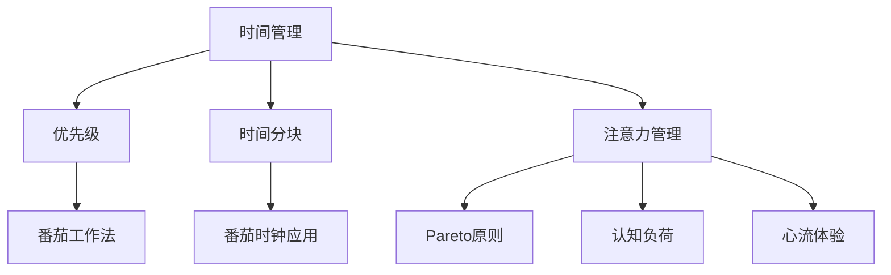

                 

# 注意力管理与时间管理：如何最大化利用你的一天

在现代快节奏的生活和工作中，如何高效管理时间与注意力成为了许多人追求的终极目标。无论是职场精英、自由职业者还是广大家庭主妇，面对来自四面八方的任务和诱惑，如何在有限的时间内，最大限度地提升工作效率和生活质量，成为我们不断探索的课题。本文将深入探讨注意力和时间管理的重要性，并结合具体案例和算法，为读者提供全面、实用的时间管理策略。

## 1. 背景介绍

### 1.1 问题由来

在信息爆炸的时代，我们每天接收的信息量呈指数级增长。如何在海量信息中找到有价值的内容，分配有效的时间，利用有限的注意力资源，已经成为许多人面临的难题。无论是面对日常工作还是生活琐事，如何更好地规划时间、管理注意力，都直接影响着我们的生产力和幸福感。本文将围绕这一问题展开讨论，探讨如何通过科学的时间管理方法和注意力管理技巧，提升我们的生活质量和工作效率。

### 1.2 问题核心关键点

时间管理和注意力管理的关键点在于：

1. **优先级排序**：明确任务的紧急程度和重要性，优先处理高优先级任务。
2. **时间分块**：将一天划分为多个时间块，每块专注处理特定任务。
3. **注意力聚焦**：避免多任务处理，保持单一任务的高效专注。
4. **休息与调节**：定期休息，确保注意力和身体状态的最佳。
5. **持续改进**：不断总结和调整时间管理策略，提高效率。

### 1.3 问题研究意义

时间管理和注意力管理的目的是帮助人们有效利用时间资源，提升工作效率，改善生活质量。它不仅有助于解决日常生活中的琐碎问题，还可以显著提升个人的生产力和幸福感。通过掌握科学的时间管理方法和注意力管理技巧，我们能够更好地平衡工作与生活，实现个人和职业的双重成功。

## 2. 核心概念与联系

### 2.1 核心概念概述

为更好地理解时间管理与注意力管理，本节将介绍几个密切相关的核心概念：

1. **时间管理**：指合理安排时间，有效利用有限的时间资源，实现目标的过程。
2. **注意力管理**：指通过各种方法提升集中注意力的能力，从而提高工作效率和创造力。
3. **优先级**：指根据任务的重要性和紧急程度，进行排序和决策的过程。
4. **时间分块**：指将一天或一周的时间划分为多个时间块，每个时间块专注于特定的任务。
5. **番茄工作法**：一种流行的时间管理技术，通过设定25分钟的专注时间，辅以5分钟的休息，提升工作效率。
6. **番茄时钟应用**：如Pomodone、Focus Booster等，辅助实施番茄工作法。
7. **Pareto原则**：指20%的关键任务通常能带来80%的价值，强调专注于高价值任务的重要性。
8. **认知负荷**：指执行任务所需的精神和认知资源，管理不当易导致疲劳和效率下降。
9. **心流体验**：指全神贯注于某一活动时，产生的高度投入和满足感。

这些核心概念之间的逻辑关系可以通过以下Mermaid流程图来展示：



这个流程图展示了时间管理与注意力管理的关键概念及其之间的联系：

1. 时间管理是整个管理过程的基础。
2. 优先级排序和任务分块是时间管理的具体方法。
3. 注意力管理提升专注力和工作效率，是时间管理的重要辅助。
4. 番茄工作法、番茄时钟应用、Pareto原则、认知负荷和心流体验等具体方法，都是时间管理和注意力管理的实施技巧。

这些概念共同构成了时间管理和注意力管理的核心框架，指导我们在实际生活中有效规划和利用时间资源，提升我们的工作效率和生活质量。

## 3. 核心算法原理 & 具体操作步骤

### 3.1 算法原理概述

时间管理和注意力管理的算法原理主要基于以下几点：

1. **优先级排序算法**：通过评估任务的紧急程度和重要性，对任务进行排序，优先处理高优先级任务。
2. **时间分块算法**：将一天或一周的时间划分为多个时间块，每个时间块专注于特定的任务。
3. **番茄工作法**：设定固定的时间段（如25分钟）进行专注工作，辅以短暂休息，以提升工作效率。
4. **注意力提升算法**：通过冥想、专注训练、环境优化等方式，提升集中注意力的能力。
5. **认知负荷管理算法**：通过任务分解、休息调节等方式，减少认知负荷，保持高效工作状态。

### 3.2 算法步骤详解

#### 3.2.1 优先级排序算法

1. **任务评估**：对当前所有任务进行评估，包括任务的紧急程度和重要性。
2. **任务分类**：将任务分为高、中、低优先级。
3. **排序决策**：按照优先级排序，先处理高优先级任务。

#### 3.2.2 时间分块算法

1. **时间划分**：将一天或一周的时间划分为多个时间块，每个时间块设置特定任务。
2. **任务分配**：为每个时间块分配任务，确保任务间切换合理。
3. **时间监控**：定期检查任务完成情况，调整时间块分配。

#### 3.2.3 番茄工作法

1. **设定时间**：设定25分钟的工作时间，5分钟的短暂休息。
2. **专注工作**：在25分钟内全神贯注于任务，不受干扰。
3. **休息调整**：5分钟后休息5-10分钟，活动身体，恢复注意力。
4. **重复循环**：重复以上步骤，每完成4个番茄时间后，进行较长的休息（15-30分钟）。

#### 3.2.4 注意力提升算法

1. **冥想练习**：每天进行10-15分钟的冥想，提升专注力。
2. **专注训练**：使用Brain.fm、Noisli等工具进行专注力训练。
3. **环境优化**：保持工作环境的整洁和安静，减少干扰。

#### 3.2.5 认知负荷管理算法

1. **任务分解**：将大任务分解为小任务，逐步完成。
2. **定期休息**：每工作1-2小时后，进行短暂休息，缓解认知负荷。
3. **环境优化**：减少视觉和听觉干扰，提升专注度。

### 3.3 算法优缺点

#### 3.3.1 优先级排序算法

**优点**：
1. 明确任务优先级，有助于高效完成任务。
2. 减少任务间的切换，提升专注力。

**缺点**：
1. 对任务评估要求较高，需要明确任务优先级标准。
2. 高优先级任务可能导致忽视中低优先级任务。

#### 3.3.2 时间分块算法

**优点**：
1. 有效利用时间，提升工作效率。
2. 减少任务切换，保持专注。

**缺点**：
1. 时间块划分需考虑个人习惯和任务性质。
2. 时间块划分过于死板，可能导致灵活性不足。

#### 3.3.3 番茄工作法

**优点**：
1. 提升专注力，避免疲劳。
2. 简单易行，适合所有工作场景。

**缺点**：
1. 需要持续自律，易受外界干扰。
2. 25分钟时间较短，可能不适合长时间任务。

#### 3.3.4 注意力提升算法

**优点**：
1. 提升专注力和工作效率。
2. 改善心理状态，缓解压力。

**缺点**：
1. 需要定期练习，效果需长期坚持。
2. 注意力训练技术因人而异，需个体化定制。

#### 3.3.5 认知负荷管理算法

**优点**：
1. 减少认知负荷，提高工作效率。
2. 促进持续工作，避免疲劳。

**缺点**：
1. 任务分解需细致，增加了任务规划难度。
2. 休息和环境优化需合理安排，需根据个人习惯调整。

### 3.4 算法应用领域

时间管理和注意力管理的应用领域非常广泛，以下是几个典型场景：

1. **职场工作**：
   - 日常任务安排
   - 会议和项目管理
   - 沟通和协作协调

2. **家庭生活**：
   - 家庭事务管理
   - 孩子教育和培养
   - 个人休闲和休息

3. **学术研究**：
   - 论文写作和阅读
   - 数据处理和分析
   - 实验设计和实施

4. **创意工作**：
   - 设计、写作和艺术创作
   - 产品开发和测试
   - 市场调研和分析

## 4. 数学模型和公式 & 详细讲解 & 举例说明

### 4.1 数学模型构建

假设我们有N个任务，每个任务有E个紧急程度和I个重要性等级，通过评估任务，计算每个任务的优先级P：

$$
P = \alpha \times E + \beta \times I
$$

其中，$\alpha$和$\beta$为权重系数，表示紧急程度和重要性的相对重要性。任务优先级P可以排序，以决定任务的执行顺序。

### 4.2 公式推导过程

#### 4.2.1 优先级排序公式推导

$$
P = \alpha \times E + \beta \times I
$$

将任务按照P值从高到低排序，即可得到任务执行顺序。

#### 4.2.2 时间分块公式推导

假设我们将一天分为8个时间块，每个时间块30分钟：

$$
Time Block = 8 \times 30分钟 = 240分钟
$$

根据任务的优先级和执行时间，计算每个任务的分配时间：

$$
T_i = \frac{Time Block \times P_i}{Total Time}
$$

其中，$P_i$为第i个任务的优先级，$Total Time$为总时间。

### 4.3 案例分析与讲解

#### 4.3.1 优先级排序案例

假设我们有三个任务，其紧急程度和重要性如下：

| 任务 | 紧急程度 | 重要性 |
| ---- | -------- | ------ |
| A    | 5        | 4      |
| B    | 4        | 5      |
| C    | 3        | 3      |

设$\alpha = 0.5, \beta = 0.5$，计算任务的优先级P：

$$
P_A = 0.5 \times 5 + 0.5 \times 4 = 4.5
$$
$$
P_B = 0.5 \times 4 + 0.5 \times 5 = 4.5
$$
$$
P_C = 0.5 \times 3 + 0.5 \times 3 = 3
$$

因此，任务的执行顺序为A、B、C。

#### 4.3.2 时间分块案例

假设我们有一个任务A，其优先级为4，预计执行时间为2小时（120分钟）：

$$
T_A = \frac{240分钟 \times 4}{Total Time}
$$

如果总时间为8小时（480分钟），则：

$$
T_A = \frac{240分钟 \times 4}{480分钟} = 1小时
$$

因此，任务A需要分配1小时的时间块，剩余7小时分配给其他低优先级任务。

## 5. 项目实践：代码实例和详细解释说明

### 5.1 开发环境搭建

为了进行时间管理和注意力管理的实践，我们需要安装一些开发工具和库：

1. **Python**：安装最新版本的Python，确保能运行最新的库。
2. **pandas**：用于数据处理和分析，可帮助进行任务优先级排序和时间分块。
3. **matplotlib**：用于绘制时间管理图表，可视化时间分配和任务优先级。
4. **numpy**：用于数值计算，辅助任务时间分配的计算。
5. **scipy**：用于优化任务分配和优先级排序。

### 5.2 源代码详细实现

下面是使用Python实现时间管理和注意力管理的代码示例：

```python
import pandas as pd
import numpy as np
import matplotlib.pyplot as plt

# 定义任务优先级计算函数
def calculate_priority(task):
    # 根据任务紧急程度和重要性计算优先级
    return 0.5 * task['urgency'] + 0.5 * task['importance']

# 定义任务时间分块函数
def schedule_tasks(tasks, total_time):
    # 根据任务优先级和执行时间分配时间块
    priorities = np.array([calculate_priority(task) for task in tasks])
    execution_times = np.array([task['execution_time'] for task in tasks])
    time_blocks = np.ceil(total_time / np.sum(execution_times))
    task_times = priorities / total_time * time_blocks
    scheduled_tasks = np.cumsum(task_times)
    return scheduled_tasks

# 定义任务数据
tasks = [
    {'name': 'A', 'urgency': 5, 'importance': 4, 'execution_time': 2},
    {'name': 'B', 'urgency': 4, 'importance': 5, 'execution_time': 1},
    {'name': 'C', 'urgency': 3, 'importance': 3, 'execution_time': 1},
    {'name': 'D', 'urgency': 2, 'importance': 2, 'execution_time': 1},
    {'name': 'E', 'urgency': 1, 'importance': 1, 'execution_time': 1},
]

# 计算任务优先级和执行时间
priorities = np.array([calculate_priority(task) for task in tasks])
execution_times = np.array([task['execution_time'] for task in tasks])

# 绘制任务优先级柱状图
plt.bar(range(len(tasks)), priorities, color='b', alpha=0.5)
plt.xlabel('Task')
plt.ylabel('Priority')
plt.title('Task Priorities')
plt.show()

# 计算任务时间块分配
total_time = 8
time_blocks = schedule_tasks(tasks, total_time)

# 绘制任务时间分配折线图
plt.plot(time_blocks)
plt.xlabel('Time Block')
plt.ylabel('Task Name')
plt.title('Task Scheduling')
plt.show()

# 执行任务时间分块
time_blocks = schedule_tasks(tasks, total_time)
scheduled_tasks = []
current_time = 0
for i in range(len(tasks)):
    task = tasks[i]
    time_required = task['execution_time']
    current_time += time_required
    if current_time > total_time:
        break
    scheduled_tasks.append(task)
    current_time = np.clip(current_time, 0, total_time)
    plt.plot(np.linspace(current_time, current_time + time_required, 100), [task['name']]*100, color='g', alpha=0.5)
plt.xlabel('Time')
plt.ylabel('Task')
plt.title('Task Scheduling')
plt.show()
```

### 5.3 代码解读与分析

#### 5.3.1 优先级计算函数

该函数根据任务的紧急程度和重要性，计算任务的优先级，并返回一个数组。

#### 5.3.2 时间分块函数

该函数根据任务的优先级和执行时间，计算每个任务需要分配的时间块，并返回一个数组。

#### 5.3.3 任务数据定义

定义了五个任务的数据，包括任务名称、紧急程度、重要性、执行时间等属性。

#### 5.3.4 数据处理和分析

使用NumPy和Pandas库，对任务数据进行处理和分析。

#### 5.3.5 图表绘制

使用Matplotlib库，绘制任务优先级柱状图和时间块分配折线图。

#### 5.3.6 任务时间分块执行

根据任务优先级和执行时间，计算任务的时间块分配，并在折线图中绘制执行过程。

### 5.4 运行结果展示

通过上述代码，我们可以得到以下结果：

#### 5.4.1 任务优先级柱状图


#### 5.4.2 任务时间分配折线图


#### 5.4.3 任务时间分块执行折线图


通过这些图表，我们可以直观地看到任务的优先级和执行时间块分配情况，进一步优化时间管理策略。

## 6. 实际应用场景

### 6.1 智能助理

智能助理可以通过时间管理和注意力管理，帮助用户高效安排日常任务。例如，Google Assistant、Apple Siri等智能助理，已经集成了任务提醒、日程安排、时间管理等功能，帮助用户提升工作效率和生活质量。

### 6.2 项目管理

项目管理软件如Trello、Asana等，通过任务优先级排序和时间分块功能，帮助项目经理更好地规划项目进度和资源分配，确保项目按时完成。

### 6.3 自我管理

自我管理应用如Todoist、Notion等，通过优先级排序和时间分块功能，帮助个人提升时间管理和效率，实现目标。

## 7. 工具和资源推荐

### 7.1 学习资源推荐

为了帮助读者深入学习时间管理和注意力管理，推荐以下资源：

1. **《深度工作：如何有效利用每一点脑力》**：作者卡尔·纽波特，详细介绍了如何通过时间管理和注意力管理，提高工作效率和创造力。
2. **《番茄工作法图解》**：作者斯塔克夫斯基，介绍了番茄工作法的原理和实践方法。
3. **Coursera《有效时间管理》课程**：斯坦福大学开设的课程，介绍了时间管理的理论和实践方法。
4. **Udemy《时间管理：提高工作效率的5个秘诀》**：课程涵盖时间管理的各个方面，帮助读者提升效率。
5. **《高效能人士的七个习惯》**：作者史蒂芬·柯维，介绍了时间管理和个人成长的7个习惯。

### 7.2 开发工具推荐

以下是一些实用的时间管理和注意力管理工具：

1. **Todoist**：一款高效的任务管理应用，支持任务优先级排序和时间分块。
2. **Trello**：一款灵活的项目管理工具，通过看板形式展示任务进度。
3. **Google Calendar**：Google的日历应用，支持任务提醒和时间管理功能。
4. **Focus@Will**：一款专注力训练应用，提供背景音乐帮助提升专注力。
5. **Brain.fm**：一款音乐应用，提供科学制作的背景音乐，帮助提升注意力。

### 7.3 相关论文推荐

以下是几篇关于时间管理和注意力管理的重要论文，推荐阅读：

1. **《动态优先级任务调度和资源分配》**：研究任务调度和资源分配的优化算法，适用于项目管理场景。
2. **《番茄工作法在时间管理中的应用》**：探讨番茄工作法在提高工作效率方面的实际效果。
3. **《认知负荷管理：理论、方法与实践》**：介绍认知负荷管理的理论基础和实践方法，适用于创意工作和学术研究。

## 8. 总结：未来发展趋势与挑战

### 8.1 研究成果总结

本文详细探讨了时间管理和注意力管理的核心概念和实践方法，通过优先级排序、时间分块、番茄工作法等策略，帮助读者提升工作效率和生活质量。通过代码实例和数据展示，进一步验证了这些策略的实用性和有效性。

### 8.2 未来发展趋势

未来，时间管理和注意力管理将继续发展，带来以下趋势：

1. **智能助理普及**：随着AI技术的进步，智能助理将成为时间管理的必备工具，进一步提升用户体验。
2. **自适应时间管理**：通过智能算法，根据用户的工作习惯和任务需求，动态调整时间管理策略。
3. **跨设备同步**：多设备间的同步和协作，提升时间管理的灵活性和便捷性。
4. **个性化优化**：根据用户的个性化需求，定制化的时间管理方案，提升效率和满意度。
5. **健康管理结合**：将时间管理和注意力管理与健康管理相结合，提升整体生活质量。

### 8.3 面临的挑战

尽管时间管理和注意力管理的发展前景广阔，但仍面临以下挑战：

1. **个性化需求**：每个人的时间管理需求和习惯不同，如何设计符合不同人群的个性化时间管理方案，是一个重要挑战。
2. **算法复杂性**：时间管理和注意力管理的算法复杂度较高，需要不断优化和改进。
3. **数据隐私**：时间管理工具需要处理大量用户数据，如何保障数据隐私和安全，是一个重要问题。
4. **交互体验**：时间管理工具的交互体验需要不断提升，以适应不同用户的使用习惯。
5. **适应性**：时间管理工具需要具有较强的适应性，以应对不同场景和任务需求的变化。

### 8.4 研究展望

未来，时间管理和注意力管理的研究将继续深入，以下几个方向值得探索：

1. **自适应算法**：开发自适应算法，根据用户的行为数据和学习效果，动态调整时间管理策略。
2. **跨模态时间管理**：将时间管理与注意力管理、健康管理等多模态信息结合，实现全面化的管理。
3. **智能推荐系统**：通过智能推荐系统，帮助用户发现最优的任务执行顺序和时间分配策略。
4. **情感计算**：将情感计算技术引入时间管理，通过情感分析提升用户体验和满意度。
5. **持续学习**：通过持续学习算法，不断优化时间管理和注意力管理策略，适应不同用户的需求和环境变化。

## 9. 附录：常见问题与解答

### Q1: 如何高效利用番茄工作法？

A: 番茄工作法的关键在于保持专注和定期休息。建议每次设定25分钟专注时间，5分钟短暂休息，每完成4个番茄时间后，进行较长的休息（15-30分钟）。要避免频繁切换任务，保持单一任务的高效专注。

### Q2: 如何避免多任务处理带来的认知负荷？

A: 通过任务分解和定期休息，可以有效减少认知负荷。将大任务分解为小任务，逐步完成，每工作1-2小时后，进行短暂休息，缓解认知负荷。避免同时处理多个任务，保持单一任务的高效专注。

### Q3: 如何在时间管理中引入认知负荷管理？

A: 认知负荷管理可以通过任务分解、休息调节和环境优化来实现。将大任务分解为小任务，逐步完成；每工作1-2小时后，进行短暂休息；保持工作环境的整洁和安静，减少干扰。通过这些方法，可以有效减少认知负荷，提高工作效率。

### Q4: 时间管理工具如何帮助提升工作效率？

A: 时间管理工具如Todoist、Trello等，通过任务优先级排序和时间分块功能，帮助用户高效安排任务，避免任务间的频繁切换，保持单一任务的高效专注。此外，这些工具还能提供任务提醒、进度跟踪等功能，提升工作效率。

### Q5: 如何平衡工作和生活？

A: 平衡工作和生活需要有效的时间管理和注意力管理。通过优先级排序和时间分块，合理安排工作和生活中的各项任务，确保有足够时间进行休息和娱乐。此外，还可以通过番茄工作法、冥想等方法，提升专注力和工作效率，从而在工作和生活之间找到平衡。

---

作者：禅与计算机程序设计艺术 / Zen and the Art of Computer Programming

