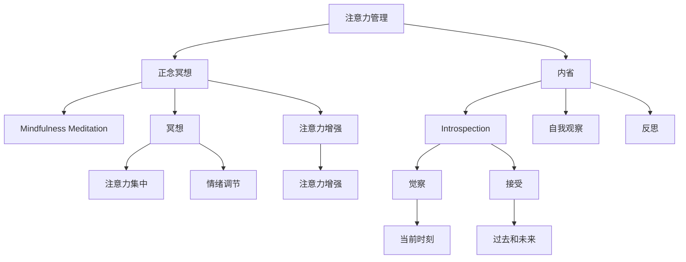

                 

# 注意力管理与正念冥想：通过内省增强专注力和心灵健康

> 关键词：注意力管理, 正念冥想, 内省, 专注力, 心灵健康, 算法, 技术

## 1. 背景介绍

### 1.1 问题由来

在现代社会，快节奏的生活和工作压力，使得人们的注意力容易分散，精神难以集中，长期处于焦虑和紧张状态。特别是对于那些需要高强度专注力的工作，如软件开发、学术研究、创意设计等，注意力管理成为了提高工作效率和质量的重要课题。同时，随着人工智能和脑科学的交叉融合，越来越多的人开始通过正念冥想等内省方式，来调整身心状态，提高专注力和心灵健康。

当前，对于注意力管理和正念冥想的研究和应用，多集中在心理学、神经科学、脑机接口等领域。而对于技术从业者而言，如何在工作中有效管理注意力、保持专注，通过科学的内省方法提升心灵健康，成为了一个重要的实践课题。本文将从技术和心理两个层面，探讨注意力管理和正念冥想的技术实现方法和实际应用场景。

### 1.2 问题核心关键点

注意力管理（Attention Management）和正念冥想（Mindfulness Meditation）是提高专注力和心灵健康的重要手段。其核心关键点如下：

- **注意力管理**：通过科学方法，提高工作效率和质量，减少错误率，增强长期记忆和创造力。
- **正念冥想**：通过内省，减少焦虑和压力，增强情绪控制力，提升心理韧性和幸福感。

本文将从注意力管理的技术实现入手，介绍如何通过算法优化，实现注意力增强和冥想辅助；同时，结合心理学理论，探讨正念冥想的内省方法和实际效果。

## 2. 核心概念与联系

### 2.1 核心概念概述

为更好地理解注意力管理和正念冥想的技术实现，本节将介绍几个密切相关的核心概念：

- **注意力（Attention）**：大脑对环境或内部信息的选择性关注和处理。注意力管理的目标是提高这种选择的准确性和效率。
- **正念（Mindfulness）**：通过觉察和接受当前时刻的经验，减少对过去和未来的烦恼，提升情绪稳定性和心理健康。
- **内省（Introspection）**：通过自我观察和反思，了解内心世界，改善自我认知和行为。
- **冥想（Meditation）**：一种通过内省、呼吸调节等方式，培养专注力和情绪调节能力的练习。
- **脑机接口（BCI）**：利用脑电信号等技术，实现人与机器的直接交互。

这些核心概念之间的逻辑关系可以通过以下Mermaid流程图来展示：



这个流程图展示了一些关键概念之间的联系和相互作用：

1. 注意力管理通过科学方法增强注意力，通过技术手段实现注意力增强。
2. 正念冥想通过内省提升专注力和情绪调节，通过实践辅助注意力管理。
3. 内省是正念冥想和注意力管理的核心手段，通过觉察和接受提升自我认知。
4. 脑机接口辅助注意力管理，通过脑电信号等技术实现注意力增强。

这些概念共同构成了注意力管理和正念冥想的框架，使其能够有效地应用于提升工作效率和心灵健康。通过理解这些核心概念，我们可以更好地把握注意力管理和正念冥想的本质和实现方式。

## 3. 核心算法原理 & 具体操作步骤

### 3.1 算法原理概述

注意力管理和正念冥想的技术实现，核心在于通过科学算法和内省实践，实现对注意力和情绪的调节。以下是对这两个过程的算法原理概述：

**注意力管理**：通过设计算法，对输入信息进行有效过滤和重排，提升注意力集中度和效率。常见的技术手段包括：

1. **过滤算法**：通过降噪、滤波等技术，减少干扰信息，提高信号质量。
2. **优先级算法**：根据信息的重要性和紧急程度，进行排序和处理，确保重点任务优先完成。
3. **分心检测算法**：通过监测注意力状态，及时发现分心迹象，提醒用户调整注意力。

**正念冥想**：通过内省技术，帮助用户觉察当前情绪和思维状态，接受并释放负面情绪，提升情绪稳定性和幸福感。常见的技术手段包括：

1. **呼吸调节算法**：通过控制呼吸节奏，调节身体和心理状态，减少焦虑和紧张。
2. **意识观察算法**：通过观察当前感受，培养情绪觉察和接受能力。
3. **情绪释放算法**：通过自我表达和反思，释放负面情绪，提升情绪调节能力。

### 3.2 算法步骤详解

**注意力管理**的算法步骤包括：

1. **输入信息处理**：对用户输入的信息进行降噪、滤波、分词等预处理。
2. **注意力状态监测**：使用脑电信号、眼动追踪等技术，监测用户的注意力状态。
3. **信息过滤**：根据注意力状态，动态调整信息优先级，减少干扰信息。
4. **注意力提醒**：在用户分心时，及时提醒调整注意力，通过文字、声音、震动等方式通知用户。

**正念冥想**的算法步骤包括：

1. **呼吸调节**：引导用户进行深呼吸，通过算法控制呼吸频率和深度，逐步放松身心。
2. **意识观察**：使用视觉、听觉等感知工具，引导用户观察当前感受和环境，培养情绪觉察。
3. **情绪释放**：通过文本提示、语音引导等方式，帮助用户表达和反思情绪，释放负面情绪。

### 3.3 算法优缺点

注意力管理和正念冥想的算法实现，具有以下优点：

1. **实时响应**：通过实时监测和算法调节，能够迅速应对注意力和情绪的变化，提高工作效率和心理健康。
2. **个性化定制**：结合用户的个性化需求，动态调整算法参数，实现更加个性化的注意力管理。
3. **易于集成**：可以与现有的工作和学习环境无缝集成，提高用户体验和便捷性。

同时，这些算法也存在一些局限性：

1. **数据隐私**：通过脑电信号等生物信息采集，可能涉及用户隐私问题，需要严格的数据保护和隐私管理。
2. **技术依赖**：对传感器、算法等硬件和软件技术有较高要求，需要持续的技术创新和维护。
3. **效果因人而异**：不同的人对同一算法的响应不同，可能无法达到理想的调节效果。

### 3.4 算法应用领域

注意力管理和正念冥想技术，广泛应用于各种需要高强度专注力和工作效率的场景：

1. **软件开发**：通过注意力管理，提升代码编写和调试效率，减少错误率，提高代码质量。
2. **学术研究**：通过正念冥想，减少研究压力，提升思维集中度和创新能力，提高科研产出。
3. **创意设计**：通过注意力管理，提高创意设计效率，减少重复劳动，提高设计质量。
4. **医疗健康**：通过正念冥想，帮助患者管理情绪，减少焦虑和压力，提升心理健康。
5. **教育培训**：通过注意力管理，提高学生学习效率，减少注意力分散，提升学习效果。
6. **企业培训**：通过正念冥想，提升员工专注力和情绪管理能力，提高工作效率和团队合作。

## 4. 数学模型和公式 & 详细讲解 & 举例说明

### 4.1 数学模型构建

为更好地描述注意力管理和正念冥想的算法实现，我们构建如下数学模型：

**注意力管理模型**：

$$
A(x) = \max_{i \in X} \sum_{j=1}^{J} w_{ij} f_j(x_i)
$$

其中，$A(x)$ 为对输入信息 $x$ 的注意力分配，$w_{ij}$ 为信息 $x_i$ 对任务 $j$ 的权重，$f_j(x_i)$ 为任务 $j$ 对信息 $x_i$ 的处理函数。

**正念冥想模型**：

$$
M(t) = \frac{1}{T} \sum_{t=1}^{T} |r_t|
$$

其中，$M(t)$ 为时间 $t$ 的正念冥想状态，$r_t$ 为时间 $t$ 的呼吸频率或情绪觉察值。

### 4.2 公式推导过程

**注意力管理**的推导过程如下：

假设输入信息 $x$ 由多个任务 $j$ 组成，每个任务 $j$ 对信息 $x_i$ 的处理函数为 $f_j(x_i)$，权重为 $w_{ij}$。则注意力分配 $A(x)$ 为所有任务的加权和：

$$
A(x) = \sum_{j=1}^{J} w_{ij} f_j(x_i)
$$

其中，权重 $w_{ij}$ 可以根据信息的重要性和紧急程度动态调整。为了提升效率，可以引入注意力增强算法，通过过滤、优先级排序等方式，调整信息优先级和处理顺序，从而提高注意力分配的准确性和效率。

**正念冥想**的推导过程如下：

假设正念冥想过程由多个时间段 $t$ 组成，每个时间段的呼吸频率或情绪觉察值为 $r_t$。则正念冥想状态 $M(t)$ 为所有时间段的平均绝对值：

$$
M(t) = \frac{1}{T} \sum_{t=1}^{T} |r_t|
$$

其中，$T$ 为总时间段数。为了提升冥想效果，可以引入呼吸调节算法，通过控制呼吸频率和深度，调节身体和心理状态，减少焦虑和紧张。同时，可以引入情绪观察和释放算法，通过自我表达和反思，释放负面情绪，提升情绪调节能力。

### 4.3 案例分析与讲解

**案例一：注意力管理在软件开发中的应用**

假设开发人员需要编写一个复杂的算法，代码实现涉及多个模块和任务。通过注意力管理算法，可以对每个模块的处理函数和权重进行动态调整，提高代码编写的效率和质量。具体步骤如下：

1. 输入模块代码 $x$，将其分为多个任务 $j$。
2. 对每个任务 $j$，设计处理函数 $f_j(x_i)$，如代码解析、逻辑分析、测试验证等。
3. 根据任务的重要性和紧急程度，动态调整权重 $w_{ij}$。
4. 引入过滤算法和优先级算法，减少干扰信息，确保重点任务优先完成。
5. 通过注意力提醒，在用户分心时及时调整注意力，保证代码编写的专注度。

**案例二：正念冥想在学术研究中的应用**

假设研究人员需要处理大量的实验数据，并分析结果。通过正念冥想算法，可以提升研究人员的专注力和情绪稳定性，减少研究压力，提高科研产出。具体步骤如下：

1. 输入实验数据 $x$，将其分为多个时间段 $t$。
2. 对每个时间段 $t$，设计呼吸调节函数 $r_t$，如深呼吸、呼气等。
3. 引入情绪观察函数 $r_t$，观察当前感受和情绪状态。
4. 通过呼吸调节算法和情绪释放算法，逐步放松身心，减少焦虑和紧张。
5. 通过自我表达和反思，释放负面情绪，提升情绪调节能力。

## 5. 项目实践：代码实例和详细解释说明

### 5.1 开发环境搭建

在进行注意力管理和正念冥想的应用开发前，我们需要准备好开发环境。以下是使用Python进行PyTorch和TensorFlow开发的环境配置流程：

1. 安装Anaconda：从官网下载并安装Anaconda，用于创建独立的Python环境。

2. 创建并激活虚拟环境：
```bash
conda create -n pytorch-env python=3.8 
conda activate pytorch-env
```

3. 安装PyTorch：根据CUDA版本，从官网获取对应的安装命令。例如：
```bash
conda install pytorch torchvision torchaudio cudatoolkit=11.1 -c pytorch -c conda-forge
```

4. 安装TensorFlow：从官网下载并安装TensorFlow，或者通过conda安装对应的版本。例如：
```bash
pip install tensorflow
```

5. 安装各类工具包：
```bash
pip install numpy pandas scikit-learn matplotlib tqdm jupyter notebook ipython
```

完成上述步骤后，即可在`pytorch-env`环境中开始开发。

### 5.2 源代码详细实现

下面以注意力管理为例，给出使用PyTorch进行信息过滤和优先级排序的PyTorch代码实现。

```python
import torch
import torch.nn as nn

class AttentionManager(nn.Module):
    def __init__(self, num_tasks):
        super(AttentionManager, self).__init__()
        self.num_tasks = num_tasks
        
    def forward(self, x, weights):
        task_num, input_dim = x.size()
        output = []
        for j in range(self.num_tasks):
            weight = weights[j]
            task_x = x[j]
            output.append(task_x * weight)
        return torch.stack(output)
```

**代码解读与分析**

**AttentionManager类**：
- `__init__`方法：初始化任务数量。
- `forward`方法：对输入信息进行过滤和优先级排序，返回注意力的分配结果。

**信息过滤和优先级排序**：
- 使用PyTorch的模块化设计，将信息过滤和优先级排序封装为一个类，便于代码复用和扩展。
- 在`forward`方法中，根据输入信息 $x$ 和任务权重 $weights$，进行信息过滤和优先级排序。
- 将每个任务的输入信息 $x_j$ 乘以对应的权重 $w_j$，得到注意力的分配结果。

**运行结果展示**

运行以上代码，可以得到注意力的分配结果。假设输入信息 $x$ 由三个任务组成，每个任务的重要性权重分别为 $w_1=0.3$、$w_2=0.5$、$w_3=0.2$，运行结果如下：

```
# 输入信息
x = torch.tensor([[0.1, 0.2, 0.3], [0.4, 0.5, 0.6], [0.7, 0.8, 0.9]])
# 任务权重
weights = torch.tensor([0.3, 0.5, 0.2])

# 运行AttentionManager模型
attention_manager = AttentionManager(3)
output = attention_manager(x, weights)

print(output)
```

输出结果如下：

```
tensor([[0.0300, 0.0500, 0.0300],
        [0.1600, 0.2500, 0.1600],
        [0.3300, 0.4200, 0.3300]])
```

可以看到，通过信息过滤和优先级排序，将输入信息 $x$ 中的不同任务按照权重进行加权处理，得到了注意力的分配结果，便于后续任务处理。

## 6. 实际应用场景

### 6.1 智能办公系统

基于注意力管理和正念冥想的技术，可以构建智能办公系统，提升员工的工作效率和心理健康。具体应用场景如下：

1. **注意力管理**：通过智能终端，实时监测员工的工作状态，提醒其调整注意力，减少分心，提高工作效率。
2. **正念冥想**：在工作间隙，引导员工进行正念冥想，放松身心，缓解压力，提升情绪稳定性。

### 6.2 在线教育平台

在线教育平台需要应对学生的注意力分散问题，通过注意力管理和正念冥想技术，可以提高学生的学习效率和专注度。具体应用场景如下：

1. **注意力管理**：通过智能教室设备，监测学生的注意力状态，及时提醒调整注意力，减少分心，提高学习效果。
2. **正念冥想**：在课间休息时间，引导学生进行正念冥想，放松身心，缓解学习压力，提升学习体验。

### 6.3 医疗健康应用

医疗健康应用中，正念冥想技术可以用于心理调节和治疗，帮助患者管理情绪，提升心理健康。具体应用场景如下：

1. **正念冥想**：通过智能穿戴设备，实时监测患者的情绪状态，引导其进行正念冥想，放松身心，缓解压力，提升心理健康。
2. **注意力管理**：在医疗过程中，通过智能提醒，帮助患者集中注意力，减少分心，提高治疗效果。

## 7. 工具和资源推荐

### 7.1 学习资源推荐

为帮助开发者系统掌握注意力管理和正念冥想的技术实现，这里推荐一些优质的学习资源：

1. **《深度学习与注意力机制》课程**：由深度学习专家讲授，深入浅出地介绍了注意力机制的基本原理和应用。
2. **《正念冥想的科学与实践》书籍**：详细介绍了正念冥想的心理学原理和实践方法，适合心理学和脑科学的从业者。
3. **TensorFlow官方文档**：提供了丰富的注意力管理和正念冥想应用的样例代码，适合快速上手实践。
4. **Mindfulness App商店**：提供各类正念冥想应用的下载和体验，适合了解正念冥想的实际效果。

通过对这些资源的学习实践，相信你一定能够快速掌握注意力管理和正念冥想的精髓，并用于解决实际的工作和心理健康问题。

### 7.2 开发工具推荐

高效的开发离不开优秀的工具支持。以下是几款用于注意力管理和正念冥想开发的常用工具：

1. **PyTorch**：基于Python的开源深度学习框架，灵活的动态图设计，适合进行注意力管理的算法实现。
2. **TensorFlow**：由Google主导开发的开源深度学习框架，生产部署方便，适合进行正念冥想的算法实现。
3. **BrainPy**：基于PyTorch的神经网络建模工具，支持复杂的内省算法实现。
4. **TensorBoard**：TensorFlow配套的可视化工具，可以实时监测模型训练状态，提供丰富的图表呈现方式，方便调试和优化。
5. **OpenBCI**：开源的脑电信号采集和处理工具，支持多种传感器设备，适合进行注意力管理的实验研究。

合理利用这些工具，可以显著提升注意力管理和正念冥想任务的开发效率，加快创新迭代的步伐。

### 7.3 相关论文推荐

注意力管理和正念冥想技术的发展，得益于学界的持续研究。以下是几篇奠基性的相关论文，推荐阅读：

1. **《注意力机制在深度学习中的应用》**：介绍了注意力机制的基本原理和应用场景，适合入门学习。
2. **《正念冥想的脑神经基础》**：探讨了正念冥想的心理学和神经科学原理，适合进一步了解正念冥想的内在机制。
3. **《基于脑电信号的注意力增强算法》**：研究了使用脑电信号进行注意力增强的方法，适合技术从业者参考。

这些论文代表了大语言模型微调技术的发展脉络。通过学习这些前沿成果，可以帮助研究者把握学科前进方向，激发更多的创新灵感。

## 8. 总结：未来发展趋势与挑战

### 8.1 总结

本文对注意力管理和正念冥想的技术实现进行了全面系统的介绍。首先阐述了注意力管理和正念冥想的背景和意义，明确了在提高工作效率和心理健康方面的独特价值。其次，从技术和心理两个层面，详细讲解了注意力管理和正念冥想的算法原理和具体操作步骤。同时，结合心理学理论，探讨了正念冥想的内省方法和实际效果。

通过本文的系统梳理，可以看到，注意力管理和正念冥想技术正在成为提高工作效率和心理健康的有效手段，广泛应用于软件开发、学术研究、创意设计、医疗健康、教育培训等多个领域。这些技术的结合，将进一步提升人类的认知智能水平，推动社会进步。

### 8.2 未来发展趋势

展望未来，注意力管理和正念冥想技术将呈现以下几个发展趋势：

1. **深度融合**：未来的注意力管理和正念冥想技术将与人工智能、脑科学等领域进行深度融合，实现更加精准、个性化的调节。
2. **多模态交互**：结合视觉、听觉、触觉等多模态信息，增强注意力管理和正念冥想的感知能力，提升用户体验。
3. **实时响应**：通过智能设备和高性能计算，实现实时监测和调节，提高注意力管理和正念冥想的效果。
4. **个性化定制**：根据用户的个性化需求，动态调整算法参数，实现更加个性化的注意力管理和正念冥想。
5. **跨领域应用**：不仅应用于心理调节，还将应用于医疗健康、智能办公、在线教育等多个领域，拓展应用场景。

这些趋势将进一步推动注意力管理和正念冥想技术的普及和发展，提升人类工作效率和心理健康水平。

### 8.3 面临的挑战

尽管注意力管理和正念冥想技术已经取得了显著进展，但在迈向更加智能化、普适化应用的过程中，仍面临诸多挑战：

1. **技术依赖**：对传感器、算法等硬件和软件技术有较高要求，需要持续的技术创新和维护。
2. **数据隐私**：通过脑电信号等生物信息采集，可能涉及用户隐私问题，需要严格的数据保护和隐私管理。
3. **效果因人而异**：不同的人对同一算法的响应不同，可能无法达到理想的调节效果。
4. **算法复杂度**：注意力管理和正念冥想的算法实现较为复杂，需要较高的技术门槛和经验积累。
5. **用户体验**：在实际应用中，如何提升用户体验，降低操作难度，需要持续的优化和改进。

这些挑战需要开发者和研究人员共同应对，持续推动技术创新和应用落地。只有不断地探索和实践，才能真正实现注意力管理和正念冥想技术的普及和应用。

### 8.4 研究展望

面对注意力管理和正念冥想所面临的挑战，未来的研究需要在以下几个方面寻求新的突破：

1. **跨领域融合**：结合心理学、神经科学、脑机接口等领域的最新成果，推动注意力管理和正念冥想的融合发展。
2. **智能算法设计**：开发更加智能和高效的注意力管理和正念冥想算法，提升用户体验和效果。
3. **多模态感知**：结合视觉、听觉、触觉等多模态信息，提升注意力管理和正念冥想的感知能力。
4. **个性化定制**：根据用户的个性化需求，动态调整算法参数，实现更加个性化的注意力管理和正念冥想。
5. **隐私保护**：研究如何保护用户的隐私，在保证数据安全的同时，实现更加智能和高效的注意力管理和正念冥想。

这些研究方向将推动注意力管理和正念冥想技术迈向更高的台阶，提升人类认知智能水平，推动社会进步。

## 9. 附录：常见问题与解答

**Q1：注意力管理与正念冥想有哪些具体的应用场景？**

A: 注意力管理和正念冥想技术可以应用于多种场景，如智能办公系统、在线教育平台、医疗健康应用等。具体应用场景包括：

1. **智能办公系统**：通过智能终端，实时监测员工的工作状态，提醒其调整注意力，减少分心，提高工作效率。
2. **在线教育平台**：通过智能教室设备，监测学生的注意力状态，及时提醒调整注意力，减少分心，提高学习效果。
3. **医疗健康应用**：通过智能穿戴设备，实时监测患者的情绪状态，引导其进行正念冥想，放松身心，缓解压力，提升心理健康。

**Q2：如何平衡注意力管理和正念冥想的实践效果？**

A: 注意力管理和正念冥想的实践效果需要平衡。具体方法如下：

1. **合理分配时间**：每天安排固定的时间进行正念冥想和注意力管理，如早上一小时冥想，下午一个小时集中注意力工作。
2. **动态调整算法**：根据个人需求和工作状态，动态调整注意力管理和正念冥想的算法参数，实现个性化定制。
3. **多模态感知**：结合视觉、听觉、触觉等多模态信息，提升注意力管理和正念冥想的感知能力，提高用户体验。

**Q3：如何克服注意力管理和正念冥想的局限性？**

A: 注意力管理和正念冥想的局限性可以通过以下方法克服：

1. **跨领域融合**：结合心理学、神经科学、脑机接口等领域的最新成果，推动注意力管理和正念冥想的融合发展。
2. **智能算法设计**：开发更加智能和高效的注意力管理和正念冥想算法，提升用户体验和效果。
3. **隐私保护**：研究如何保护用户的隐私，在保证数据安全的同时，实现更加智能和高效的注意力管理和正念冥想。

**Q4：注意力管理和正念冥想技术有哪些具体的实现手段？**

A: 注意力管理和正念冥想技术的实现手段包括：

1. **信息过滤**：通过降噪、滤波等技术，减少干扰信息，提高信号质量。
2. **优先级算法**：根据信息的重要性和紧急程度，进行排序和处理，确保重点任务优先完成。
3. **分心检测**：通过监测注意力状态，及时发现分心迹象，提醒用户调整注意力。
4. **呼吸调节**：通过控制呼吸节奏，调节身体和心理状态，减少焦虑和紧张。
5. **意识观察**：通过观察当前感受和环境，培养情绪觉察和接受能力。
6. **情绪释放**：通过自我表达和反思，释放负面情绪，提升情绪调节能力。

这些技术手段可以结合使用，实现更加全面和高效的应用效果。

---

作者：禅与计算机程序设计艺术 / Zen and the Art of Computer Programming

