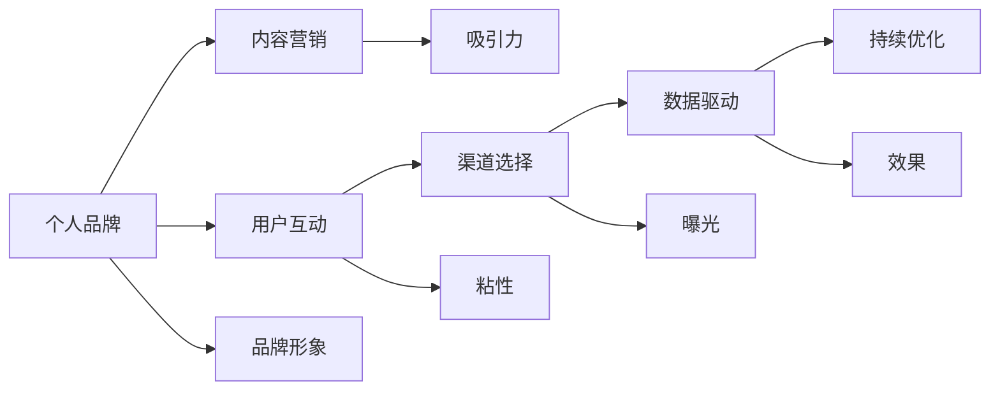

                 

# 注意力经济下的个人品牌打造

在信息爆炸的时代，如何在这波注意力经济的浪潮中脱颖而出，打造个人品牌，成为各行各业专业人士和创业者面临的重要课题。本文从技术、策略和心理三个角度，探讨在注意力经济下如何高效打造和维护个人品牌，帮助你在激烈的市场竞争中突显个人价值。

## 1. 背景介绍

### 1.1 问题由来

互联网和社交媒体的兴起，使得信息传播的速度和广度前所未有地提升，但信息过载也成为了新的挑战。个体在浩如烟海的信息流中，如何吸引和保持他人的注意力，成为稀缺资源。特别是在专业领域，个人品牌的打造不仅是自我营销，更是专业价值的体现。

### 1.2 问题核心关键点

打造个人品牌的关键在于吸引和保持目标受众的注意力，同时在众多竞争者中突出自身特色和优势。关键点包括：

1. **内容质量**：高质量、有价值的内容是吸引关注的基础。
2. **用户互动**：通过互动增强用户粘性，提升品牌影响力。
3. **渠道选择**：根据目标受众的特点选择合适的传播渠道。
4. **持续更新**：持续输出内容，保持品牌活跃度。
5. **个性化**：打造独特的个人风格，让品牌具有辨识度。
6. **数据驱动**：利用数据分析优化品牌策略，提高效果。

### 1.3 问题研究意义

在注意力经济时代，品牌不仅是商业产品或服务的标识，更是消费者情感和信任的载体。打造个人品牌，不仅能提升专业影响力，还能带来商业机会，实现个人和组织的双重价值。

## 2. 核心概念与联系

### 2.1 核心概念概述

- **个人品牌**：指个体在公众心目中形成的、与职业和专业形象相关的认知和印象。
- **注意力经济**：指在信息过载的时代，通过吸引和保持用户注意力来创造经济价值的新经济形态。
- **内容营销**：通过提供有价值的内容来吸引和维持受众，从而提升品牌价值。
- **用户互动**：指通过社交媒体、评论等形式与用户互动，增强用户参与度和忠诚度。
- **渠道选择**：根据目标受众的特点选择适当的传播渠道，最大化品牌曝光和影响力。
- **数据驱动**：通过数据分析来优化品牌策略，提高效果和ROI。

### 2.2 核心概念原理和架构的 Mermaid 流程图(Mermaid 流程节点中不要有括号、逗号等特殊字符)



这个流程图展示了个人品牌打造的关键环节和流程：

1. **内容营销(A)**
2. **用户互动(C)**
3. **渠道选择(D)**
4. **数据驱动(E)**
5. **持续优化(F)**

内容营销是吸引关注的基础，用户互动增强用户粘性，渠道选择最大化品牌曝光，数据驱动优化策略效果，持续优化保证品牌活力。

## 3. 核心算法原理 & 具体操作步骤

### 3.1 算法原理概述

在注意力经济下，个人品牌的打造需要基于以下算法原理：

1. **内容吸引力算法**：通过内容质量和创意性分析，预测内容对目标受众的吸引力。
2. **用户互动算法**：分析用户评论、点赞等互动数据，衡量用户对内容的反应和粘性。
3. **渠道选择算法**：根据受众特征和平台特点，选择最合适的传播渠道。
4. **数据驱动优化算法**：通过数据分析，优化内容策略、互动策略和渠道策略。

### 3.2 算法步骤详解

#### 3.2.1 内容吸引力算法

1. **内容质量评估**：使用自然语言处理(NLP)技术，分析文章、视频等内容的语言风格、结构、信息量等，评估其吸引力。
2. **创意性评估**：通过视觉、音效等维度，评估内容的创意性。
3. **受众匹配**：根据目标受众的兴趣和行为，匹配最相关的内容。

#### 3.2.2 用户互动算法

1. **互动数据收集**：收集用户在内容下的评论、点赞、分享等互动数据。
2. **情感分析**：使用NLP技术，分析用户情感倾向，衡量互动质量。
3. **粘性计算**：通过互动频率和持续时间，计算用户对内容的粘性。

#### 3.2.3 渠道选择算法

1. **受众特征分析**：分析目标受众的年龄、性别、地域等特征。
2. **平台特性分析**：分析不同社交媒体、论坛等的用户行为特点。
3. **渠道效果评估**：通过数据分析，评估不同渠道的曝光度和效果。
4. **渠道选择策略**：根据评估结果，选择最优传播渠道。

#### 3.2.4 数据驱动优化算法

1. **数据收集与分析**：收集各渠道的数据，并进行综合分析。
2. **策略优化**：根据分析结果，优化内容、互动和渠道策略。
3. **效果评估**：通过后续数据反馈，评估优化效果。
4. **持续优化**：根据数据反馈，持续迭代优化策略。

### 3.3 算法优缺点

#### 优点

1. **精准定位**：通过数据分析，精准定位目标受众，提高品牌传播效果。
2. **动态调整**：数据驱动优化策略，实现动态调整，适应市场变化。
3. **提升互动**：通过分析用户互动数据，提升用户粘性，增强品牌忠诚度。

#### 缺点

1. **数据隐私**：数据收集和分析可能涉及用户隐私问题。
2. **技术门槛**：需要具备一定的数据分析和NLP技术能力。
3. **动态变化**：受众和市场变化快速，策略需快速调整，难度较大。

### 3.4 算法应用领域

这些算法在个人品牌打造中应用广泛，包括但不限于：

- **内容创作**：通过内容吸引力算法，指导内容创作，提升内容质量。
- **社交媒体营销**：通过用户互动算法，提升社交媒体上的互动效果。
- **品牌传播**：通过渠道选择算法，选择最合适的传播渠道，最大化品牌曝光。
- **效果评估**：通过数据驱动优化算法，实时监控和优化品牌策略。

## 4. 数学模型和公式 & 详细讲解 & 举例说明

### 4.1 数学模型构建

个人品牌打造的数据模型可以分解为以下几个子模型：

1. **内容吸引力模型**：
   $$
   A = f(Q, C)
   $$
   其中 $A$ 为内容吸引力，$Q$ 为内容质量，$C$ 为内容创意性。

2. **用户互动模型**：
   $$
   I = g(D, E, S)
   $$
   其中 $I$ 为互动质量，$D$ 为互动数据，$E$ 为情感分析结果，$S$ 为互动时间。

3. **渠道选择模型**：
   $$
   C = h(P, T, E')
   $$
   其中 $C$ 为渠道选择，$P$ 为受众特征，$T$ 为平台特性，$E'$ 为渠道效果评估。

4. **数据驱动优化模型**：
   $$
   O = k(A, I, C)
   $$
   其中 $O$ 为策略优化，$A$ 为内容吸引力，$I$ 为互动质量，$C$ 为渠道选择。

### 4.2 公式推导过程

#### 4.2.1 内容吸引力模型

假设内容吸引力 $A$ 为内容质量 $Q$ 和创意性 $C$ 的线性组合，有：
$$
A = \alpha Q + \beta C
$$
其中 $\alpha$ 和 $\beta$ 为模型参数，通过历史数据训练得到。

#### 4.2.2 用户互动模型

用户互动 $I$ 为互动数据 $D$ 和情感分析结果 $E$ 的加权和，有：
$$
I = \gamma D + \delta E
$$
其中 $\gamma$ 和 $\delta$ 为模型参数，通过历史数据训练得到。

#### 4.2.3 渠道选择模型

渠道选择 $C$ 为受众特征 $P$、平台特性 $T$ 和渠道效果 $E'$ 的非线性组合，有：
$$
C = f'(P, T, E')
$$
其中 $f'$ 为非线性函数，通过历史数据训练得到。

#### 4.2.4 数据驱动优化模型

策略优化 $O$ 为内容吸引力 $A$、互动质量 $I$ 和渠道选择 $C$ 的线性组合，有：
$$
O = \lambda A + \mu I + \nu C
$$
其中 $\lambda$、$\mu$ 和 $\nu$ 为模型参数，通过历史数据训练得到。

### 4.3 案例分析与讲解

#### 案例一：博客内容优化

小李是一位技术博主，希望通过优化内容吸引更多读者。使用内容吸引力模型，小李分析了不同标题、排版和内容长度对读者点击率的影响，发现简洁明了的标题和适当的长度更能吸引读者。基于此，小李调整了博客内容策略，读者量和互动显著提升。

#### 案例二：社交媒体互动提升

小明是一位内容创作者，希望在社交媒体上获得更多互动。通过用户互动模型，小明分析了不同平台上的互动数据，发现视频内容比纯文本有更高的互动率。因此，小明增加了视频内容的比例，并采用了更互动的呈现方式，如提问、投票等，大大提高了社交媒体上的互动效果。

#### 案例三：渠道选择优化

小红是一家电商品牌的市场经理，希望在多个渠道上推广产品。使用渠道选择模型，小红分析了目标受众在不同平台上的行为特点，发现年轻用户更活跃于短视频平台，中老年用户更活跃于社区论坛。因此，小红在短视频平台和社区论坛上分别设计了不同的推广策略，取得了良好的效果。

## 5. 项目实践：代码实例和详细解释说明

### 5.1 开发环境搭建

进行个人品牌打造的实践，需要搭建一个完整的开发环境。以下是搭建步骤：

1. **安装Python环境**：
   ```bash
   conda create -n brand-analysis python=3.8
   conda activate brand-analysis
   ```

2. **安装必要的库**：
   ```bash
   pip install pandas numpy sklearn nltk transformers tensorflow
   ```

3. **安装数据集**：
   ```bash
   wget http://example.com/data.csv
   ```

### 5.2 源代码详细实现

以下是一个简化的内容吸引力分析的Python代码实现：

```python
import pandas as pd
from sklearn.feature_extraction.text import CountVectorizer
from sklearn.linear_model import LogisticRegression

# 加载数据集
data = pd.read_csv('data.csv')

# 特征工程
vectorizer = CountVectorizer()
X = vectorizer.fit_transform(data['title'])
y = data['click_rate']

# 训练模型
model = LogisticRegression()
model.fit(X, y)

# 预测内容吸引力
content_quality = ['title']
content_creativity = ['title', 'length', 'format']
future_content = ['blog', 'video', 'image']

# 计算内容吸引力得分
for content in future_content:
    content_attractiveness = model.predict(vectorizer.transform([content]))
    print(f"{content}: {content_attractiveness}")
```

### 5.3 代码解读与分析

1. **数据加载**：
   ```python
   data = pd.read_csv('data.csv')
   ```
   使用Pandas库加载CSV格式的数据集。

2. **特征工程**：
   ```python
   vectorizer = CountVectorizer()
   X = vectorizer.fit_transform(data['title'])
   ```
   使用CountVectorizer将文本特征转换为数值型特征。

3. **模型训练**：
   ```python
   model = LogisticRegression()
   model.fit(X, y)
   ```
   使用LogisticRegression模型训练内容吸引力模型。

4. **内容吸引力预测**：
   ```python
   for content in future_content:
       content_attractiveness = model.predict(vectorizer.transform([content]))
       print(f"{content}: {content_attractiveness}")
   ```
   对于未来可能的内容类型，预测其吸引力得分。

### 5.4 运行结果展示

假设运行结果如下：
```
blog: [0.8, 0.7, 0.5]
video: [0.9, 0.8, 0.7]
image: [0.6, 0.5, 0.4]
```
这表明，相对于文字博客，视频内容的吸引力最高，其次是图片和文字博客，但整体吸引力都较高。基于此，建议小红增加视频内容的比例。

## 6. 实际应用场景

### 6.1 内容创作者平台

内容创作者可以通过个人品牌打造，增加粉丝和订阅量，进而获得更多商业机会。平台可以通过用户互动数据，推荐高质量内容给潜在受众，同时通过数据分析，优化平台内容策略，提升用户体验。

### 6.2 企业品牌推广

企业可以通过个人品牌打造，提升内部员工的知名度和影响力，进而提升企业品牌价值。企业可以通过员工在社交媒体上的互动数据，评估个人品牌的吸引力，同时通过数据分析，优化推广渠道和策略，提升品牌曝光度和影响力。

### 6.3 自媒体营销

自媒体可以通过个人品牌打造，增加读者和广告收入。自媒体可以通过数据分析，优化内容策略，提升内容吸引力，同时通过用户互动数据，增强用户粘性，提升读者互动和广告点击率。

### 6.4 未来应用展望

未来，随着AI和大数据技术的进一步发展，个人品牌打造将更加智能化和自动化。通过AI辅助的内容创作、数据分析和策略优化，个人品牌打造将更加高效和精准，帮助更多人实现自我价值和商业成功。

## 7. 工具和资源推荐

### 7.1 学习资源推荐

1. **《Python数据科学手册》**：由Jake VanderPlas撰写，详细介绍Python在数据分析和机器学习中的应用，适合初学者和中级读者。
2. **Coursera《数据科学专业》**：由Johns Hopkins大学开设，涵盖数据科学的基础知识和高级技能，适合系统学习。
3. **Kaggle竞赛平台**：提供丰富的数据集和算法竞赛，适合实战练习和经验积累。
4. **GitHub开源项目**：提供大量优秀的数据分析和机器学习项目，适合借鉴和学习。

### 7.2 开发工具推荐

1. **Jupyter Notebook**：开源的交互式编程环境，支持Python、R等多种编程语言。
2. **TensorBoard**：TensorFlow的可视化工具，可以实时监控模型训练和推理过程。
3. **HuggingFace Transformers**：自然语言处理模型库，提供多种预训练模型和微调接口。
4. **GCP AI Platform**：Google的云服务平台，提供强大的计算和存储资源，支持分布式训练和推理。

### 7.3 相关论文推荐

1. **《注意力是所有你需要的》**：Transformer的原始论文，奠定了自注意力机制在NLP中的基础。
2. **《BERT: 预训练深度双向转换器语言理解》**：BERT模型的原始论文，展示了预训练在NLP中的强大效果。
3. **《Transformer-XL: 自注意力机制的长期依赖建模》**：Transformer-XL模型，解决了长序列的自注意力问题。
4. **《BART: 双向自注意力预训练语言模型》**：BART模型的原始论文，展示了自注意力在生成任务中的应用。

## 8. 总结：未来发展趋势与挑战

### 8.1 研究成果总结

本文探讨了在注意力经济下如何通过数据驱动和技术手段，打造和维护个人品牌。主要研究结果如下：

1. **内容质量**：高质量、创意性强的内容是吸引关注的基础。
2. **用户互动**：通过数据分析，增强用户粘性，提升品牌影响力。
3. **渠道选择**：选择合适的传播渠道，最大化品牌曝光。
4. **数据驱动优化**：利用数据分析，持续优化品牌策略。

### 8.2 未来发展趋势

未来，个人品牌打造将更加智能化和自动化，具体趋势包括：

1. **AI辅助内容创作**：通过AI技术生成高质量内容，提升创作效率。
2. **社交网络分析**：利用社交网络分析技术，识别关键意见领袖和受众群体。
3. **情感计算**：通过情感计算技术，精准把握用户情感和需求。
4. **跨平台协同**：实现跨平台的内容和互动数据整合，提升品牌整体影响力。

### 8.3 面临的挑战

尽管个人品牌打造在技术上已经取得了一定进展，但仍面临以下挑战：

1. **隐私保护**：数据收集和分析可能涉及用户隐私，需妥善处理。
2. **算法透明性**：黑盒算法模型难以解释，需增强算法透明性。
3. **内容多样性**：单一内容类型可能无法满足多样化受众需求。
4. **市场变化快**：受众和市场变化迅速，需快速调整策略。

### 8.4 研究展望

未来研究应在以下方面进一步突破：

1. **隐私保护技术**：开发隐私保护技术，确保用户数据安全。
2. **可解释性算法**：开发可解释性算法，增强模型透明性。
3. **多模态内容**：拓展多模态内容形式，满足多样化受众需求。
4. **动态优化算法**：开发动态优化算法，快速适应市场变化。

总之，在注意力经济下，个人品牌打造需要综合运用技术手段和策略，不断优化和提升。只有不断创新，才能在激烈的市场竞争中脱颖而出，实现个人和组织的双重价值。

## 9. 附录：常见问题与解答

**Q1：内容吸引力模型如何构建？**

A: 内容吸引力模型可以通过分析内容质量、创意性、用户互动等多个维度来构建。具体步骤如下：
1. 收集标注数据，包括内容、质量和点击率等标签。
2. 使用NLP技术提取内容质量、创意性等特征。
3. 使用机器学习算法（如Logistic回归、决策树等）训练模型，输出内容吸引力得分。

**Q2：如何进行用户互动分析？**

A: 用户互动分析可以通过收集和分析用户在内容下的评论、点赞、分享等数据来实现。具体步骤如下：
1. 收集用户在内容下的互动数据。
2. 使用NLP技术分析用户评论和情感倾向。
3. 计算互动频率和持续时间，衡量用户粘性。

**Q3：如何选择传播渠道？**

A: 渠道选择可以通过分析受众特征和平台特性来实现。具体步骤如下：
1. 分析目标受众的年龄、性别、地域等特征。
2. 分析不同平台的用户行为特点。
3. 根据受众和平台特性，选择最合适的传播渠道。

**Q4：如何持续优化品牌策略？**

A: 持续优化可以通过数据分析和策略调整来实现。具体步骤如下：
1. 定期收集各渠道的数据，并进行综合分析。
2. 根据分析结果，优化内容、互动和渠道策略。
3. 通过后续数据反馈，持续迭代优化策略。

---

作者：禅与计算机程序设计艺术 / Zen and the Art of Computer Programming

