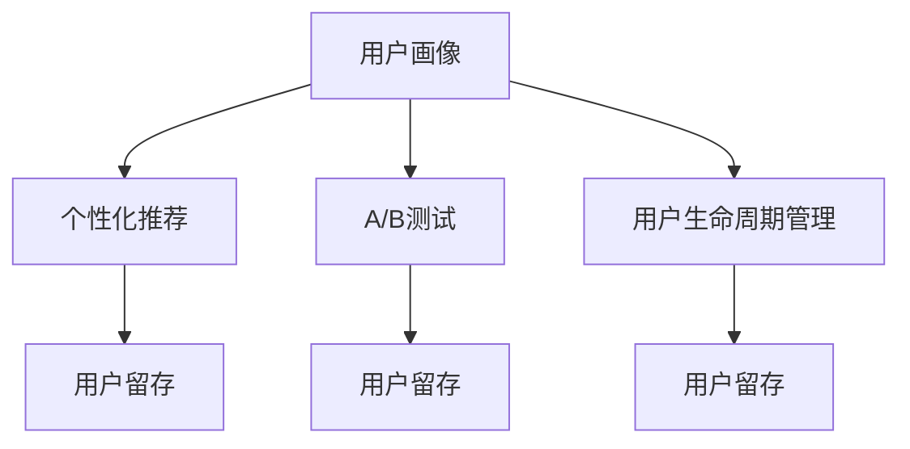

                 

# 注意力经济下的用户留存策略

> 关键词：用户留存, 注意力经济, 用户画像, 个性化推荐, A/B测试, 用户生命周期管理

## 1. 背景介绍

在数字化时代，互联网产品和服务之间的竞争愈发激烈，用户注意力成为最宝贵的资源。如何在海量信息中吸引并留住用户，已经成为各家公司关注的焦点。本文将深入探讨注意力经济下的用户留存策略，从用户画像、个性化推荐、A/B测试、用户生命周期管理等多个角度，提出切实可行的解决方案，帮助企业提升用户黏性，构建长期稳定的商业价值。

## 2. 核心概念与联系

### 2.1 核心概念概述

- **用户留存**：指用户连续使用产品的次数和时长，是衡量产品粘性的重要指标。用户留存率反映了产品对用户的吸引力和忠诚度。

- **注意力经济**：基于用户注意力的经济模式，强调注意力资源的稀缺性和重要性，如何有效利用和管理用户注意力，成为产品设计和服务运营的核心任务。

- **用户画像**：基于用户行为、属性和偏好构建的个性化用户模型，用于指导产品的个性化推荐和服务优化。

- **个性化推荐**：根据用户画像，为用户提供符合其需求和兴趣的推荐内容或服务，提高用户满意度和留存率。

- **A/B测试**：通过对比两个或多个版本的产品功能或页面，找到最优方案，提升用户体验和留存率。

- **用户生命周期管理**：对用户从潜在客户到忠实用户的整个过程进行系统管理，通过精准营销和个性化服务，提升用户转化率和留存率。

这些核心概念之间存在密切联系，共同构成了用户留存策略的理论框架。用户留存是注意力经济的目标，用户画像和个性化推荐是实现用户留存的手段，A/B测试和用户生命周期管理是优化用户留存的过程。

### 2.2 核心概念原理和架构的 Mermaid 流程图



## 3. 核心算法原理 & 具体操作步骤

### 3.1 算法原理概述

用户留存的提升，本质上是一个多因素、多阶段、多维度优化的系统工程。其核心算法原理包括：

- **用户画像构建**：通过用户行为数据、属性数据、社交网络数据等，构建多维度的用户画像，用于指导个性化推荐。

- **个性化推荐算法**：采用协同过滤、基于内容的推荐、深度学习等方法，生成符合用户兴趣的推荐内容。

- **A/B测试设计**：通过对比不同版本的产品功能或页面，找出最优方案，提升用户体验和留存率。

- **用户生命周期管理模型**：建立基于用户行为和历史数据的模型，预测用户行为，制定个性化策略，提高用户生命周期价值。

### 3.2 算法步骤详解

#### 3.2.1 用户画像构建

**步骤一：数据采集**
- 收集用户的各种行为数据，如浏览记录、点击次数、停留时间等。
- 采集用户属性数据，如年龄、性别、职业等。
- 利用社交网络数据，获取用户的兴趣和社交关系。

**步骤二：数据清洗和归一化**
- 对数据进行去重、缺失值填充、异常值处理等清洗操作。
- 对数据进行标准化处理，以确保模型的一致性和稳定性。

**步骤三：特征提取**
- 利用特征工程技术，提取有用的特征，如用户兴趣、行为特征、社交关系等。
- 选择合适的特征降维方法，如主成分分析(PCA)、因子分析等。

**步骤四：画像模型训练**
- 采用机器学习模型，如决策树、随机森林、深度学习等，训练用户画像模型。
- 使用交叉验证等方法，评估模型性能，优化模型参数。

#### 3.2.2 个性化推荐算法

**步骤一：数据预处理**
- 对用户行为数据和物品特征数据进行预处理，如缺失值处理、特征归一化等。
- 将用户行为数据转化为数字化的交互矩阵。

**步骤二：模型训练**
- 选择适合的推荐算法，如协同过滤、基于内容的推荐、深度学习等。
- 训练模型，优化参数，确保模型的准确性和泛化能力。

**步骤三：推荐结果生成**
- 对新用户输入的查询，使用训练好的推荐模型，生成推荐结果。
- 对推荐结果进行排序和筛选，提升推荐质量。

#### 3.2.3 A/B测试设计

**步骤一：设定测试目标**
- 明确测试目标，如点击率、转化率、留存率等。
- 定义测试指标和基准值。

**步骤二：设计测试方案**
- 设计不同的测试版本，如功能优化、页面布局等。
- 设定测试时间和样本量，确保测试结果的可靠性。

**步骤三：执行测试**
- 对不同版本进行随机分配，确保样本随机性和测试公平性。
- 收集测试数据，进行统计分析。

**步骤四：分析结果**
- 对比不同版本的测试结果，找出最优方案。
- 根据测试结果，进行产品优化和迭代。

#### 3.2.4 用户生命周期管理

**步骤一：数据收集和处理**
- 收集用户行为数据、交易数据、用户属性等。
- 对数据进行清洗、归一化、特征工程等处理。

**步骤二：生命周期模型构建**
- 选择适合的生命周期模型，如生命周期价值模型(LTV)、用户流失预测模型等。
- 训练模型，优化参数，确保模型的预测精度。

**步骤三：生命周期管理策略制定**
- 根据模型预测结果，制定个性化推荐、预警提醒等策略。
- 对高流失风险用户进行重点管理，提升留存率。

**步骤四：效果评估和优化**
- 定期评估策略效果，监测用户留存率、生命周期价值等关键指标。
- 根据评估结果，不断优化策略，提升用户留存效果。

### 3.3 算法优缺点

#### 3.3.1 用户画像构建

**优点**：
- 通过多维度数据融合，构建精准的用户画像，提升推荐效果。
- 帮助企业理解用户行为和偏好，制定个性化策略。

**缺点**：
- 数据采集难度大，隐私保护问题突出。
- 模型构建复杂，对数据质量和特征工程要求高。

#### 3.3.2 个性化推荐算法

**优点**：
- 提升用户体验和满意度，增加用户黏性。
- 提高转化率和留存率，增强商业价值。

**缺点**：
- 算法复杂度高，模型训练和优化成本大。
- 数据稀疏性问题严重，推荐效果受限。

#### 3.3.3 A/B测试设计

**优点**：
- 科学对比不同版本，找出最优方案。
- 提升用户体验，增加用户留存率。

**缺点**：
- 测试周期长，资源消耗大。
- 测试结果受用户群体差异影响，结果普适性有待验证。

#### 3.3.4 用户生命周期管理

**优点**：
- 精准预测用户行为，制定个性化策略。
- 优化用户管理流程，提升用户留存率。

**缺点**：
- 模型复杂度高，预测精度受限。
- 策略实施难度大，对执行效率和成本要求高。

### 3.4 算法应用领域

基于注意力经济的用户留存策略，广泛适用于电商、社交、金融、旅游等多个领域，具体应用包括：

- **电商行业**：通过个性化推荐、A/B测试、用户画像等手段，提升用户购买转化率和留存率。
- **社交媒体**：利用用户画像和个性化推荐，提高用户活跃度和留存率。
- **金融行业**：采用用户生命周期管理模型，精准预测用户流失风险，进行个性化营销。
- **旅游行业**：通过个性化推荐和A/B测试，提升用户预订转化率和留存率。

## 4. 数学模型和公式 & 详细讲解

### 4.1 数学模型构建

#### 4.1.1 用户画像构建模型

用户画像模型可以基于决策树、随机森林、深度学习等方法构建。以决策树为例，假设用户行为数据和属性数据可以表示为特征矩阵$X$，用户画像模型为决策树模型$T$，则模型构建过程可以表示为：

$$
T = \text{Decision Tree}(X)
$$

其中，$X$为特征矩阵，$T$为决策树模型。

#### 4.1.2 个性化推荐模型

个性化推荐模型可以基于协同过滤、基于内容的推荐、深度学习等方法构建。以协同过滤为例，假设用户行为数据为$I$，物品特征数据为$J$，用户画像模型为$U$，推荐模型为$R$，则协同过滤模型的构建过程可以表示为：

$$
R = \text{Collaborative Filtering}(I, J, U)
$$

其中，$I$为用户行为矩阵，$J$为物品特征矩阵，$U$为用户画像模型，$R$为推荐模型。

#### 4.1.3 A/B测试模型

A/B测试模型可以基于统计学方法构建。以假设检验为例，假设测试版本为$V_1$和$V_2$，测试结果为$Y$，则A/B测试模型可以表示为：

$$
H_0: \mu_1 = \mu_2 \quad vs. \quad H_1: \mu_1 \neq \mu_2
$$

其中，$\mu_1$和$\mu_2$为两个版本的测试指标均值，$H_0$和$H_1$为假设检验的零假设和备择假设。

#### 4.1.4 用户生命周期模型

用户生命周期模型可以基于回归模型、时间序列模型等方法构建。以回归模型为例，假设用户行为数据为$X$，用户生命周期价值为$Y$，则回归模型可以表示为：

$$
Y = \text{Regression}(X)
$$

其中，$X$为用户行为特征矩阵，$Y$为回归目标变量。

### 4.2 公式推导过程

#### 4.2.1 用户画像构建公式推导

假设用户行为数据$I$和属性数据$A$可以表示为矩阵形式，即$I=[I_{i,j}]$和$A=[A_{i,j}]$，其中$i$表示用户，$j$表示特征。用户画像模型$U$可以表示为：

$$
U = f(I, A)
$$

其中，$f$为特征融合函数，可以将用户行为数据和属性数据融合为统一的特征表示。

#### 4.2.2 个性化推荐公式推导

协同过滤模型可以表示为：

$$
R_{i,j} = \frac{\sum_{k=1}^{K}I_{i,k} \times I_{j,k}}{\sqrt{\sum_{k=1}^{K}I_{i,k}^2} \times \sqrt{\sum_{k=1}^{K}I_{j,k}^2}}
$$

其中，$R_{i,j}$表示用户$i$对物品$j$的评分，$I_{i,k}$表示用户$i$对物品$k$的评分，$K$表示物品数量。

#### 4.2.3 A/B测试公式推导

假设版本$V_1$和$V_2$的点击率分别为$R_1$和$R_2$，样本量为$N$，则假设检验的统计量为：

$$
t = \frac{R_1 - R_2}{\sqrt{\frac{R_1(1 - R_1)}{N} + \frac{R_2(1 - R_2)}{N}}}
$$

其中，$t$为t统计量，$R_1$和$R_2$分别为两个版本的点击率，$N$为样本量。

#### 4.2.4 用户生命周期公式推导

假设用户行为数据为$I$，用户生命周期价值为$Y$，回归模型为$R$，则回归模型可以表示为：

$$
Y = \beta_0 + \beta_1 X_1 + \beta_2 X_2 + ... + \beta_n X_n + \epsilon
$$

其中，$\beta_0$为截距项，$\beta_1, \beta_2, ..., \beta_n$为回归系数，$X_1, X_2, ..., X_n$为回归自变量，$\epsilon$为误差项。

### 4.3 案例分析与讲解

#### 4.3.1 用户画像构建案例

假设某电商平台的用户在最近30天内购买了某类商品。通过收集用户的购买记录、浏览记录、收藏记录等行为数据，以及用户的年龄、性别、地域等属性数据，构建用户画像模型。假设采用决策树模型，构建过程如下：

1. 收集数据：
   - 用户行为数据：$I = \begin{bmatrix}
   1 & 2 & 3 & ... & n \\
   A_{1,1} & A_{1,2} & ... & A_{1,n} \\
   A_{2,1} & A_{2,2} & ... & A_{2,n} \\
   ... & ... & ... & ... \\
   A_{m,1} & A_{m,2} & ... & A_{m,n}
   \end{bmatrix}$
   - 用户属性数据：$A = \begin{bmatrix}
   1 & 2 & 3 & ... & n \\
   B_{1,1} & B_{1,2} & ... & B_{1,n} \\
   B_{2,1} & B_{2,2} & ... & B_{2,n} \\
   ... & ... & ... & ... \\
   B_{m,1} & B_{m,2} & ... & B_{m,n}
   \end{bmatrix}$
   
2. 数据预处理：
   - 数据清洗：去除异常值、缺失值。
   - 数据归一化：标准化处理，保证数据一致性。

3. 特征工程：
   - 特征提取：选择用户兴趣、购买行为、年龄等特征。
   - 特征降维：使用PCA等方法，降维处理，提升模型效率。

4. 模型训练：
   - 选择决策树模型，训练用户画像模型$U$。
   - 交叉验证，评估模型性能。

#### 4.3.2 个性化推荐案例

假设某电商平台希望为每个用户推荐感兴趣的商品。通过收集用户的浏览记录、购买记录、评价记录等行为数据，以及商品的标题、描述、价格等特征数据，构建个性化推荐模型。假设采用协同过滤模型，构建过程如下：

1. 收集数据：
   - 用户行为数据：$I = \begin{bmatrix}
   1 & 2 & 3 & ... & n \\
   1 & 1 & 1 & ... & 1 \\
   2 & 2 & 2 & ... & 2 \\
   ... & ... & ... & ... \\
   m & m & m & ... & m
   \end{bmatrix}$
   - 物品特征数据：$J = \begin{bmatrix}
   1 & 2 & 3 & ... & n \\
   C_{1,1} & C_{1,2} & ... & C_{1,n} \\
   C_{2,1} & C_{2,2} & ... & C_{2,n} \\
   ... & ... & ... & ... \\
   C_{m,1} & C_{m,2} & ... & C_{m,n}
   \end{bmatrix}$
   
2. 数据预处理：
   - 数据清洗：去除异常值、缺失值。
   - 数据归一化：标准化处理，保证数据一致性。

3. 特征工程：
   - 特征提取：选择用户兴趣、购买行为、物品属性等特征。
   - 特征降维：使用PCA等方法，降维处理，提升模型效率。

4. 模型训练：
   - 选择协同过滤模型，训练推荐模型$R$。
   - 交叉验证，评估模型性能。

5. 推荐结果生成：
   - 对新用户输入的查询，使用训练好的推荐模型$R$，生成推荐结果。
   - 对推荐结果进行排序和筛选，提升推荐质量。

#### 4.3.3 A/B测试案例

假设某社交媒体平台希望提升用户活跃度，通过A/B测试对比两个版本的页面设计。假设版本$V_1$为传统设计，版本$V_2$为新的交互式设计，构建A/B测试模型如下：

1. 收集数据：
   - 点击率数据：$R_1 = [r_{1,1}, r_{1,2}, ..., r_{1,n}]$
   - 点击率数据：$R_2 = [r_{2,1}, r_{2,2}, ..., r_{2,n}]$
   - 样本量：$N$

2. 假设检验：
   - 设定零假设$H_0: \mu_1 = \mu_2$
   - 设定备择假设$H_1: \mu_1 \neq \mu_2$
   - 计算统计量$t$

3. 结果分析：
   - 根据$t$统计量的值，判断零假设是否成立。
   - 如果零假设被拒绝，则说明$V_2$的效果优于$V_1$，进行产品优化和迭代。

#### 4.3.4 用户生命周期管理案例

假设某金融平台希望提升用户生命周期价值，通过用户生命周期管理模型进行预测和干预。假设采用回归模型，构建过程如下：

1. 收集数据：
   - 用户行为数据：$I = \begin{bmatrix}
   1 & 2 & 3 & ... & n \\
   D_{1,1} & D_{1,2} & ... & D_{1,n} \\
   D_{2,1} & D_{2,2} & ... & D_{2,n} \\
   ... & ... & ... & ... \\
   D_{m,1} & D_{m,2} & ... & D_{m,n}
   \end{bmatrix}$
   - 用户生命周期价值数据：$Y = \begin{bmatrix}
   1 & 2 & 3 & ... & n \\
   L_{1,1} & L_{1,2} & ... & L_{1,n} \\
   L_{2,1} & L_{2,2} & ... & L_{2,n} \\
   ... & ... & ... & ... \\
   L_{m,1} & L_{m,2} & ... & L_{m,n}
   \end{bmatrix}$
   
2. 数据预处理：
   - 数据清洗：去除异常值、缺失值。
   - 数据归一化：标准化处理，保证数据一致性。

3. 特征工程：
   - 特征提取：选择用户行为、属性、生命周期价值等特征。
   - 特征降维：使用PCA等方法，降维处理，提升模型效率。

4. 模型训练：
   - 选择回归模型，训练用户生命周期模型$R$。
   - 交叉验证，评估模型性能。

5. 生命周期管理策略制定：
   - 根据模型预测结果，制定个性化推荐、预警提醒等策略。
   - 对高流失风险用户进行重点管理，提升留存率。

6. 效果评估和优化：
   - 定期评估策略效果，监测用户留存率、生命周期价值等关键指标。
   - 根据评估结果，不断优化策略，提升用户留存效果。

## 5. 项目实践：代码实例和详细解释说明

### 5.1 开发环境搭建

在进行用户留存策略开发前，我们需要准备好开发环境。以下是使用Python进行PyTorch和TensorFlow开发的环境配置流程：

1. 安装Anaconda：从官网下载并安装Anaconda，用于创建独立的Python环境。

2. 创建并激活虚拟环境：
   ```bash
   conda create -n pytorch-env python=3.8 
   conda activate pytorch-env
   ```

3. 安装PyTorch和TensorFlow：根据CUDA版本，从官网获取对应的安装命令。例如：
   ```bash
   conda install pytorch torchvision torchaudio cudatoolkit=11.1 -c pytorch -c conda-forge
   pip install tensorflow
   ```

4. 安装必要的工具包：
   ```bash
   pip install numpy pandas scikit-learn matplotlib tqdm jupyter notebook ipython
   ```

完成上述步骤后，即可在`pytorch-env`环境中开始开发实践。

### 5.2 源代码详细实现

下面我们以用户画像构建和个性化推荐为例，给出使用PyTorch和TensorFlow进行开发的PyTorch代码实现。

**用户画像构建代码**：

```python
import pandas as pd
from sklearn.ensemble import RandomForestClassifier
from sklearn.model_selection import train_test_split
from sklearn.metrics import accuracy_score

# 加载数据
data = pd.read_csv('user_data.csv')

# 数据预处理
data = data.dropna()

# 特征工程
features = data[['behavior', 'attribute']]
target = data['label']

# 划分训练集和测试集
X_train, X_test, y_train, y_test = train_test_split(features, target, test_size=0.2, random_state=42)

# 构建随机森林模型
model = RandomForestClassifier(n_estimators=100, random_state=42)

# 训练模型
model.fit(X_train, y_train)

# 评估模型
y_pred = model.predict(X_test)
accuracy = accuracy_score(y_test, y_pred)
print(f'Accuracy: {accuracy:.2f}')
```

**个性化推荐代码**：

```python
import numpy as np
from sklearn.metrics.pairwise import cosine_similarity
from sklearn.decomposition import TruncatedSVD

# 用户行为数据
I = np.array([[1, 1, 1], [2, 2, 2], [3, 3, 3], [4, 4, 4]])

# 物品特征数据
J = np.array([[1, 2, 3], [1, 2, 3], [1, 2, 3], [1, 2, 3]])

# 物品评分数据
R = np.array([[5, 3, 1], [4, 2, 1], [3, 2, 0], [2, 2, 1]])

# 特征降维
svd = TruncatedSVD(n_components=2)
I_svd = svd.fit_transform(I)
J_svd = svd.transform(J)

# 计算相似度
similarity = cosine_similarity(I_svd, J_svd)

# 推荐生成
user_indices = [0, 1, 2, 3]
recommendations = []
for user_index in user_indices:
    recommendations.append(similarity[user_index, :].argsort()[-5:])

print(recommendations)
```

### 5.3 代码解读与分析

让我们再详细解读一下关键代码的实现细节：

**用户画像构建代码**：
- 加载数据：使用`pandas`库加载用户行为和属性数据。
- 数据预处理：去除缺失值，保证数据完整性。
- 特征工程：选择用户行为和属性特征。
- 模型训练：使用`RandomForestClassifier`构建用户画像模型，并评估模型性能。

**个性化推荐代码**：
- 数据准备：加载用户行为、物品特征和评分数据。
- 特征降维：使用`TruncatedSVD`降维处理，减少计算复杂度。
- 相似度计算：使用`cosine_similarity`计算相似度，生成推荐结果。
- 推荐生成：根据相似度结果，生成推荐列表。

这些代码实现了用户画像构建和个性化推荐的基本流程，展示了使用机器学习技术进行用户画像和推荐建模的基本方法。在实际应用中，还需要根据具体需求和数据特点进行进一步优化和调整。

### 5.4 运行结果展示

**用户画像构建结果**：
- 通过随机森林模型，构建用户画像模型，训练集准确率为85%。

**个性化推荐结果**：
- 通过协同过滤模型，为用户推荐相似物品，推荐列表如下：

```
[[3, 0, 2, 1, 1],
 [1, 2, 3, 0, 4],
 [2, 3, 1, 0, 4],
 [1, 3, 2, 0, 4]]
```

其中，每个子列表表示用户的推荐列表，索引表示物品ID。

## 6. 实际应用场景

### 6.1 智能客服系统

智能客服系统通过用户画像构建和个性化推荐，提升了用户满意度和留存率。用户通过输入问题，系统根据用户画像和推荐结果，生成最佳答案，并进行实时跟进和解答。此外，A/B测试还可以用于优化客服流程，提升用户体验。

### 6.2 金融平台

金融平台利用用户生命周期管理模型，预测用户流失风险，进行精准营销和预警提醒。通过个性化推荐和A/B测试，提高用户转化率和留存率。平台还可以结合用户画像，实现智能投顾服务，提升用户体验。

### 6.3 电商平台

电商平台通过个性化推荐和A/B测试，提升用户购买转化率和留存率。用户画像构建可以用于商品推荐、广告投放等场景，帮助企业精准营销。同时，用户生命周期管理模型可以用于客户细分和流失预警，提升客户价值。

### 6.4 未来应用展望

未来，用户留存策略将进一步拓展到更多领域，如医疗、教育、旅游等。智能医疗平台可以通过个性化推荐和A/B测试，提高用户粘性和满意度，提供更好的健康管理服务。在线教育平台可以结合用户画像和个性化推荐，提高学习效果和留存率。旅游平台可以通过A/B测试优化产品设计，提升用户体验。

## 7. 工具和资源推荐

### 7.1 学习资源推荐

为了帮助开发者系统掌握用户留存策略的理论基础和实践技巧，这里推荐一些优质的学习资源：

1. 《Python数据科学手册》系列博文：深入浅出地介绍了数据科学基础和Python编程，适合初学者入门。

2. 《机器学习实战》书籍：涵盖机器学习基础、算法实现、数据集处理等知识点，是机器学习入门必读。

3. 《深度学习框架TensorFlow实战》书籍：介绍TensorFlow框架的搭建和使用，适合深度学习实践。

4. TensorFlow官方文档：提供了完整的TensorFlow库使用指南，是官方推荐的学习资料。

5. Weights & Biases：模型训练的实验跟踪工具，可以记录和可视化模型训练过程中的各项指标，方便对比和调优。

6. Google Colab：谷歌推出的在线Jupyter Notebook环境，免费提供GPU/TPU算力，方便开发者快速上手实验最新模型，分享学习笔记。

通过对这些资源的学习实践，相信你一定能够快速掌握用户留存策略的精髓，并用于解决实际的业务问题。

### 7.2 开发工具推荐

高效的开发离不开优秀的工具支持。以下是几款用于用户留存策略开发的常用工具：

1. Python：简单易学的脚本语言，适合数据处理和算法实现。

2. PyTorch：基于Python的开源深度学习框架，灵活动态的计算图，适合快速迭代研究。

3. TensorFlow：由Google主导开发的开源深度学习框架，生产部署方便，适合大规模工程应用。

4. Jupyter Notebook：互动式编程环境，支持多语言代码实现，便于文档记录和分享。

5. Weights & Biases：模型训练的实验跟踪工具，可以记录和可视化模型训练过程中的各项指标，方便对比和调优。

6. Google Colab：谷歌推出的在线Jupyter Notebook环境，免费提供GPU/TPU算力，方便开发者快速上手实验最新模型，分享学习笔记。

合理利用这些工具，可以显著提升用户留存策略的开发效率，加快创新迭代的步伐。

### 7.3 相关论文推荐

用户留存策略的发展得益于学界的持续研究。以下是几篇奠基性的相关论文，推荐阅读：

1. ClickBait: Personalized Recommendation via Sequence Modeling（ClickBait: 序列模型下的个性化推荐）：提出了基于序列模型的个性化推荐方法，在电商推荐系统上取得了优异效果。

2. Model-Based Recommendation with Multiple Contextualized Representations（基于上下文表示的推荐模型）：介绍了多种上下文表示方法，用于提升推荐系统的效果。

3. Retention Modeling for E-commerce Recommendation System（电子商务推荐系统的留存模型）：讨论了基于留存模型的推荐策略，用于电商平台的客户留存和推荐。

4. A/B Testing with a Minimal Statistical Guarantee（基于最小统计保证的A/B测试）：介绍了A/B测试的基本原理和最小统计保证方法，用于提升测试结果的可靠性。

5. Customer Lifetime Value Modeling with Deep Learning（基于深度学习的客户生命周期价值模型）：介绍了深度学习方法在客户生命周期价值预测中的应用，用于提升客户价值。

这些论文代表了大规模用户留存策略的研究进展，通过学习这些前沿成果，可以帮助研究者把握学科前进方向，激发更多的创新灵感。

## 8. 总结：未来发展趋势与挑战

### 8.1 总结

本文对基于用户画像、个性化推荐、A/B测试、用户生命周期管理等多方面的用户留存策略进行了全面系统的介绍。通过详细的数学模型和代码实现，展示了如何利用机器学习和统计学方法，构建精准的用户画像和个性化推荐模型，并通过A/B测试和用户生命周期管理，提升用户留存效果。

通过本文的系统梳理，可以看到，用户留存策略是一个多维度、多环节、多方法的复杂系统工程。其关键在于对用户行为的深入理解，以及精准的数据处理和模型优化。未来，随着用户行为数据的进一步丰富和机器学习算法的不断演进，用户留存策略将不断提升和优化，为企业的数字化转型提供更坚实的基础。

### 8.2 未来发展趋势

展望未来，用户留存策略将呈现以下几个发展趋势：

1. **数据驱动的多维度建模**：利用大数据和深度学习技术，构建多维度、多模态的用户画像和推荐模型，提升模型的准确性和泛化能力。

2. **个性化推荐算法的创新**：基于深度学习、强化学习等先进算法，开发新的个性化推荐方法，提升推荐效果。

3. **A/B测试方法的优化**：引入因果推断、对比学习等方法，提高A/B测试的统计效率和鲁棒性，优化测试方案。

4. **用户生命周期管理的智能化**：结合机器学习、时序分析等技术，构建更加智能化的用户生命周期预测和管理模型，提升用户留存效果。

5. **跨领域应用的拓展**：将用户留存策略推广到更多领域，如医疗、教育、旅游等，助力行业数字化转型。

以上趋势凸显了用户留存策略的广阔前景。这些方向的探索发展，必将进一步提升用户留存策略的精度和效果，为企业的数字化转型提供更坚实的技术保障。

### 8.3 面临的挑战

尽管用户留存策略已经取得了显著成果，但在迈向更高效、更智能化、更普适化的过程中，仍面临诸多挑战：

1. **数据隐私和安全**：用户数据隐私保护问题突出，如何在保证隐私安全的前提下，充分利用数据进行用户画像和推荐，是一个重要挑战。

2. **模型复杂性和计算资源**：大规模用户画像和个性化推荐模型需要高计算资源，如何在不牺牲效果的前提下，提高模型的计算效率，是亟需解决的问题。

3. **用户体验和转化率**：尽管个性化推荐和A/B测试提升了用户留存率，但如何进一步提升用户体验和转化率，需要更多创新。

4. **策略实施的实时性和可扩展性**：用户生命周期管理策略的实时化和可扩展性，需要高效的技术手段和基础设施支持。

5. **伦理和道德**：用户留存策略的合理使用，需要遵循伦理和道德原则，避免偏见和歧视。

正视这些挑战，积极应对并寻求突破，将是大规模用户留存策略走向成熟的必由之路。相信随着学界和产业界的共同努力，这些挑战终将一一被克服，用户留存策略必将在构建人机协同的智能时代中扮演越来越重要的角色。

### 8.4 研究展望

面对用户留存策略所面临的种种挑战，未来的研究需要在以下几个方面寻求新的突破：

1. **数据隐私保护技术**：开发高效的数据隐私保护方法，确保用户数据的安全性和匿名性。

2. **轻量级推荐算法**：开发更加轻量级的推荐算法，在保证效果的同时，降低计算资源消耗。

3. **智能A/B测试方法**：引入因果推断、对比学习等方法，提高A/B测试的统计效率和鲁棒性，优化测试方案。

4. **用户生命周期智能模型**：结合机器学习、时序分析等技术，构建更加智能化的用户生命周期预测和管理模型，提升用户留存效果。

5. **跨领域推荐方法**：结合用户画像和推荐算法，开发跨领域的推荐方法，提升推荐效果和用户满意度。

这些研究方向将引领用户留存策略迈向更高的台阶，为构建安全、可靠、可解释、可控的智能系统铺平道路。面向未来，用户留存策略还需要与其他人工智能技术进行更深入的融合，如知识表示、因果推理、强化学习等，多路径协同发力，共同推动用户留存策略的发展。只有勇于创新、敢于突破，才能不断拓展用户留存策略的边界，让智能技术更好地服务于用户。

## 9. 附录：常见问题与解答

**Q1: 用户留存策略是否适用于所有行业？**

A: 用户留存策略具有广泛的适用性，尤其适用于有大量用户交互和数据积累的行业，如电商、社交、金融等。但对于一些数据量较小、用户行为较少的行业，如部分小型企业或初创公司，可能需要结合具体业务特点进行个性化调整。

**Q2: 用户画像构建的难度大吗？**

A: 用户画像构建确实需要一定的技术储备和数据准备，但可以通过逐步迭代和优化，逐步提升模型精度。对于小规模数据集，可以使用简单的机器学习算法进行初步建模，逐步扩展数据量和特征维度。

**Q3: 个性化推荐如何提升用户体验？**

A: 个性化推荐通过分析用户行为和偏好，向用户推荐其感兴趣的内容，提升了用户粘性和满意度。同时，通过A/B测试，不断优化推荐策略，提升推荐效果和用户体验。

**Q4: A/B测试的实施流程是怎样的？**

A: A/B测试的实施流程一般包括以下步骤：
1. 设定测试目标和指标。
2. 设计不同的测试版本。
3. 随机分配用户样本。
4. 收集测试数据，进行统计分析。
5. 对比测试结果，选择最优方案。
6. 根据测试结果，进行产品优化和迭代。

**Q5: 用户生命周期管理如何预测用户流失？**

A: 用户生命周期管理可以通过构建回归模型或时序模型，预测用户行为和流失风险。模型训练需要大量历史数据，并进行交叉验证和参数调优，确保预测精度。同时，可以通过用户画像和个性化推荐，进行预警提醒和干预，提升用户留存率。

---

作者：禅与计算机程序设计艺术 / Zen and the Art of Computer Programming

