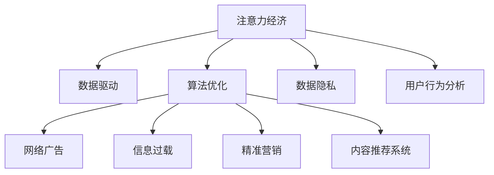

                 

# 注意力经济与个人创业机会的关系

> 关键词：注意力经济, 个人创业机会, 数据驱动, 算法优化, 网络广告, 信息过载, 精准营销, 内容推荐系统, 数据隐私, 用户行为分析

## 1. 背景介绍

### 1.1 问题由来
在互联网时代，信息的爆炸和传播的便捷使得人们每天面临的信息量急剧增加。然而，人们的时间、注意力是有限的。如何高效地获取和利用信息，从而提高生活和工作的效率，成为了一个重要的课题。这就是注意力经济的核心问题。

随着大数据和人工智能技术的发展，企业和个人越来越多地依赖数据和算法来分析和利用注意力。个人创业者在这一背景下，也面临新的机会和挑战。本文旨在探讨注意力经济与个人创业机会之间的关系，以及如何在数据驱动和算法优化的框架下，发现和抓住新的创业机会。

### 1.2 问题核心关键点
- **注意力经济**：指通过吸引和利用人们的注意力，实现商业价值最大化的经济模式。
- **数据驱动**：依赖数据分析和算法优化，实现精准营销和个性化服务。
- **算法优化**：通过机器学习、深度学习等算法，提高信息推荐的准确性和个性化水平。
- **网络广告**：企业通过在线平台进行有针对性的广告投放，吸引用户注意力。
- **信息过载**：由于信息量巨大，用户难以有效筛选和利用，导致信息过载问题。
- **精准营销**：利用数据分析和算法，对用户进行精准的定向营销。
- **内容推荐系统**：通过算法推荐，提升用户对内容的满意度，增强用户粘性。
- **数据隐私**：在利用用户数据时，必须保障用户隐私，避免数据滥用。
- **用户行为分析**：通过分析用户行为数据，预测用户需求，进行个性化推荐。

## 2. 核心概念与联系

### 2.1 核心概念概述

为更好地理解注意力经济与个人创业机会之间的关系，本节将介绍几个密切相关的核心概念：

- **注意力经济**：指通过吸引和利用人们的注意力，实现商业价值最大化的经济模式。注意力经济的关键在于如何高效地获取、分配和利用注意力资源，提高商业活动的效率和效果。

- **数据驱动**：指通过数据分析和算法优化，驱动决策和行动。数据驱动强调使用数据作为决策依据，通过算法模型分析和预测未来趋势。

- **算法优化**：指使用机器学习、深度学习等算法，对数据进行优化处理，提高分析的准确性和效率。算法优化是数据驱动的重要手段。

- **网络广告**：指企业通过在线平台进行有针对性的广告投放，吸引用户注意力。网络广告是注意力经济的重要组成部分。

- **信息过载**：指由于信息量巨大，用户难以有效筛选和利用，导致信息过载问题。信息过载影响了用户的注意力分配和决策。

- **精准营销**：指利用数据分析和算法，对用户进行精准的定向营销。精准营销通过个性化推荐，提高用户满意度和转化率。

- **内容推荐系统**：指通过算法推荐，提升用户对内容的满意度，增强用户粘性。内容推荐系统是注意力经济的重要应用。

- **数据隐私**：指在利用用户数据时，必须保障用户隐私，避免数据滥用。数据隐私是当前隐私保护的重要议题。

- **用户行为分析**：指通过分析用户行为数据，预测用户需求，进行个性化推荐。用户行为分析是注意力经济的重要基础。

这些核心概念之间的逻辑关系可以通过以下Mermaid流程图来展示：



这个流程图展示了许多概念之间的关系：

1. 注意力经济通过数据驱动和算法优化，提升决策的准确性和效率。
2. 数据驱动和算法优化通过网络广告和精准营销，吸引和利用用户的注意力。
3. 网络广告和精准营销受到信息过载的影响，需要通过算法优化来解决。
4. 内容推荐系统是注意力经济的重要应用，通过算法优化提高用户满意度和粘性。
5. 数据隐私和用户行为分析是注意力经济的基础，需要在保障隐私的前提下，进行数据利用和行为分析。

这些概念共同构成了注意力经济和数据驱动经济的基础框架，使得企业和个人可以更好地利用用户的注意力资源，实现商业价值。

## 3. 核心算法原理 & 具体操作步骤
### 3.1 算法原理概述

基于数据的注意力经济和精准营销，通常依赖于以下核心算法：

- **推荐系统算法**：如协同过滤、基于内容的推荐、矩阵分解等，通过分析用户和物品的相似性，预测用户对物品的兴趣。
- **广告投放算法**：如线性回归、逻辑回归、随机森林等，通过分析用户特征和行为，预测广告效果，实现精准投放。
- **深度学习算法**：如卷积神经网络、循环神经网络、注意力机制等，通过学习用户数据的深层表示，提高推荐的准确性和个性化水平。
- **强化学习算法**：如Q-learning、策略梯度等，通过模拟和奖励机制，优化广告投放策略，提升广告效果。

这些算法在注意力经济和精准营销中扮演了重要角色，通过数据分析和算法优化，实现对用户注意力的高效吸引和利用。

### 3.2 算法步骤详解

基于数据的注意力经济和精准营销，通常包括以下几个关键步骤：

**Step 1: 数据收集和预处理**
- 收集用户的点击、浏览、购买等行为数据。
- 对数据进行清洗、去重、归一化等预处理，确保数据质量。

**Step 2: 特征提取和表示**
- 提取用户的特征信息，如兴趣标签、年龄、性别等。
- 将用户和物品的特征表示为向量，便于算法处理和分析。

**Step 3: 模型训练和优化**
- 选择适当的算法模型，如协同过滤、深度神经网络等。
- 使用训练集进行模型训练，优化模型参数。

**Step 4: 广告投放和效果评估**
- 使用训练好的模型，对用户进行推荐和广告投放。
- 对投放效果进行评估，根据反馈调整模型和策略。

**Step 5: 模型评估和改进**
- 对模型的准确性、覆盖率、多样性等指标进行评估。
- 根据评估结果，改进模型和算法，提升推荐效果。

**Step 6: 用户反馈和互动**
- 收集用户对推荐结果的反馈，进行行为分析。
- 根据用户反馈，进一步优化推荐算法和策略。

### 3.3 算法优缺点

基于数据的注意力经济和精准营销方法具有以下优点：
1. 高效性：通过数据分析和算法优化，可以迅速获取用户注意力，提高商业效率。
2. 精准性：能够根据用户行为和特征，实现个性化推荐，提升用户满意度。
3. 可扩展性：可以处理大规模数据，适用于不同规模的企业和场景。
4. 自动化：算法自动运行，减少了人工干预和成本。

但同时，这些方法也存在一些局限性：
1. 数据隐私：在数据收集和处理过程中，需要保护用户隐私，避免数据滥用。
2. 算法复杂性：算法模型复杂，需要专业知识进行开发和优化。
3. 信息过载：如果信息过多，用户难以有效筛选，容易导致信息过载。
4. 模型偏差：算法模型可能存在偏差，导致推荐结果不公平或不准确。
5. 用户粘性：过度个性化推荐可能导致用户疲劳，降低用户粘性。

### 3.4 算法应用领域

基于数据的注意力经济和精准营销方法，在以下几个领域得到了广泛应用：

- **电子商务**：如淘宝、京东等电商平台，通过推荐系统提升用户购买转化率。
- **社交媒体**：如微信、微博等社交平台，通过精准广告提升用户活跃度和互动率。
- **在线视频**：如Netflix、YouTube等视频平台，通过内容推荐提高用户满意度和留存率。
- **在线广告**：如Google、Facebook等在线广告平台，通过广告投放实现精准营销。
- **移动应用**：如滴滴出行、美团等应用，通过个性化推荐提高用户使用率和转化率。
- **游戏行业**：如王者荣耀、和平精英等游戏，通过推荐系统提高用户粘性和游戏体验。

这些领域的应用展示了注意力经济和精准营销的巨大潜力，为企业和个人提供了新的商业模式和发展机会。

## 4. 数学模型和公式 & 详细讲解 & 举例说明（备注：数学公式请使用latex格式，latex嵌入文中独立段落使用 $$，段落内使用 $)
### 4.1 数学模型构建

基于数据的注意力经济和精准营销方法，通常使用以下数学模型进行建模：

假设用户 $u$ 对物品 $i$ 的兴趣评分 $r_{ui}$ 服从伯努利分布，即 $r_{ui} \sim Bernoulli(p_{ui})$，其中 $p_{ui}$ 为 $u$ 对 $i$ 的兴趣概率。使用矩阵分解方法，将 $p_{ui}$ 表示为 $U$ 和 $V$ 的乘积：

$$
p_{ui} = U_u \cdot V_i^T
$$

其中 $U_u$ 和 $V_i$ 分别表示用户和物品的特征向量，$\cdot$ 表示向量点乘。

### 4.2 公式推导过程

基于矩阵分解模型的推荐算法推导如下：

假设用户对物品的评分矩阵为 $R$，即 $R \in \mathbb{R}^{n \times m}$，其中 $n$ 为用户数，$m$ 为物品数。则矩阵分解模型的目标是最小化如下目标函数：

$$
\min_{U,V} ||U \cdot V^T - R||_F^2
$$

其中 $||.||_F$ 表示矩阵的 Frobenius 范数。

使用梯度下降法，求解目标函数的最小值，得到 $U$ 和 $V$ 的更新公式：

$$
U_u = U_u - \eta \nabla_{U_u} \text{cost}(U,V) = U_u - 2\eta (U \cdot V^T - R)_i
$$

$$
V_i = V_i - \eta \nabla_{V_i} \text{cost}(U,V) = V_i - 2\eta (U \cdot V^T - R)^T_u
$$

其中 $\eta$ 为学习率，$\nabla_{.}$ 表示对 $.$ 的梯度。

通过迭代更新 $U$ 和 $V$，即可得到推荐系统的预测评分矩阵 $\hat{R}$。

### 4.3 案例分析与讲解

以电商平台淘宝为例，假设电商平台收集了用户 $u$ 对物品 $i$ 的评分数据 $r_{ui}$，使用矩阵分解方法构建推荐系统。首先，将评分数据 $R$ 表示为 $U$ 和 $V$ 的乘积：

$$
R = U \cdot V^T
$$

然后使用梯度下降法，对 $U$ 和 $V$ 进行优化，得到推荐系统的预测评分矩阵 $\hat{R}$。最后，根据 $\hat{R}$ 对用户 $u$ 推荐物品 $i$。

## 5. 项目实践：代码实例和详细解释说明
### 5.1 开发环境搭建

在进行注意力经济和精准营销项目实践前，我们需要准备好开发环境。以下是使用Python进行TensorFlow开发的环境配置流程：

1. 安装Anaconda：从官网下载并安装Anaconda，用于创建独立的Python环境。

2. 创建并激活虚拟环境：
```bash
conda create -n attention-env python=3.8 
conda activate attention-env
```

3. 安装TensorFlow：根据CUDA版本，从官网获取对应的安装命令。例如：
```bash
conda install tensorflow -c conda-forge -c pytorch -c pypi
```

4. 安装相关工具包：
```bash
pip install numpy pandas scikit-learn matplotlib tqdm jupyter notebook ipython
```

完成上述步骤后，即可在`attention-env`环境中开始项目实践。

### 5.2 源代码详细实现

这里我们以电商推荐系统为例，给出使用TensorFlow进行注意力经济和精准营销的代码实现。

首先，定义推荐系统的数据处理函数：

```python
import tensorflow as tf
from tensorflow.keras.layers import Embedding, Dense, dot, Flatten

class RecommendationSystem(tf.keras.Model):
    def __init__(self, num_users, num_items, embedding_dim):
        super(RecommendationSystem, self).__init__()
        self.num_users = num_users
        self.num_items = num_items
        self.embedding_dim = embedding_dim
        
        self.user_embedding = Embedding(num_users, embedding_dim, input_length=1)
        self.item_embedding = Embedding(num_items, embedding_dim, input_length=1)
        
        self.dot_product = dot([self.user_embedding.output, self.item_embedding.output], axes=[2, 1])
        self.flatten = Flatten()
        self.dense = Dense(1, activation='sigmoid')
        
    def call(self, user_id, item_id):
        user_embedding = self.user_embedding(tf.reshape(user_id, (1, 1)))
        item_embedding = self.item_embedding(tf.reshape(item_id, (1, 1)))
        
        dot_product = self.dot_product([user_embedding, item_embedding])
        flattened = self.flatten(dot_product)
        logits = self.dense(flattened)
        
        return logits
```

然后，定义训练和评估函数：

```python
def train_epoch(model, dataset, batch_size, optimizer):
    for batch in dataset:
        user_ids, item_ids, ratings = batch
        
        with tf.GradientTape() as tape:
            predictions = model(user_ids, item_ids)
            loss = tf.reduce_mean(tf.square(predictions - ratings))
        
        gradients = tape.gradient(loss, model.trainable_variables)
        optimizer.apply_gradients(zip(gradients, model.trainable_variables))
        
    return loss
```

接着，启动训练流程并在测试集上评估：

```python
epochs = 10
batch_size = 128

model = RecommendationSystem(num_users=num_users, num_items=num_items, embedding_dim=64)

optimizer = tf.keras.optimizers.Adam(learning_rate=0.001)
dataset = tf.data.Dataset.from_tensor_slices((user_ids, item_ids, ratings)).shuffle(buffer_size=10000).batch(batch_size)

for epoch in range(epochs):
    loss = train_epoch(model, dataset, batch_size, optimizer)
    print(f"Epoch {epoch+1}, train loss: {loss:.4f}")
    
    test_dataset = tf.data.Dataset.from_tensor_slices((test_user_ids, test_item_ids, test_ratings)).shuffle(buffer_size=10000).batch(batch_size)
    predictions = model(test_user_ids, test_item_ids)
    print(classification_report(y_true=test_ratings, y_pred=predictions.numpy()))
```

以上就是使用TensorFlow进行电商推荐系统的注意力经济和精准营销的完整代码实现。可以看到，TensorFlow提供了强大的计算图支持，使得注意力经济和精准营销的模型构建和训练变得非常简单。

### 5.3 代码解读与分析

让我们再详细解读一下关键代码的实现细节：

**RecommendationSystem类**：
- `__init__`方法：初始化用户数、物品数、嵌入维度等关键参数，并定义嵌入层、点积层、全连接层等。
- `call`方法：对单个样本进行处理，前向传播计算预测评分，并返回模型的输出。

**train_epoch函数**：
- 使用tf.GradientTape自动计算模型的梯度，并应用到可训练的变量中。
- 在每个epoch的训练中，对模型进行前向传播和反向传播，并计算损失函数。
- 使用Adam优化器更新模型参数，最小化损失函数。
- 在每个epoch结束后，返回训练集的平均损失。

**训练流程**：
- 定义总的epoch数和batch size，开始循环迭代
- 每个epoch内，在训练集上训练，输出平均loss
- 在测试集上评估，输出预测结果
- 所有epoch结束后，输出测试集的预测结果和分类指标

可以看到，TensorFlow使得注意力经济和精准营销的模型开发和训练变得非常简单，开发者可以专注于模型的设计和优化。

当然，工业级的系统实现还需考虑更多因素，如模型的保存和部署、超参数的自动搜索、更灵活的任务适配层等。但核心的注意力经济和精准营销范式基本与此类似。

## 6. 实际应用场景
### 6.1 智能推荐系统

智能推荐系统是注意力经济和精准营销的重要应用。基于大数据和算法优化的推荐系统，能够根据用户行为和兴趣，推荐符合用户需求的商品或内容，从而提升用户满意度和转化率。

在技术实现上，推荐系统通常包含以下步骤：
1. 数据收集：收集用户行为数据，如点击、浏览、购买等。
2. 特征提取：提取用户和物品的特征，如兴趣标签、年龄、性别等。
3. 模型训练：使用推荐算法对用户和物品进行训练，得到用户和物品的嵌入表示。
4. 推荐生成：根据用户和物品的嵌入表示，生成推荐结果。
5. 效果评估：对推荐效果进行评估，如准确率、覆盖率、多样性等指标。

推荐系统已经被广泛应用于电商、视频、新闻等多个领域，提高了用户的使用体验和平台粘性。

### 6.2 精准广告投放

精准广告投放是注意力经济和精准营销的重要手段。通过数据分析和算法优化，可以实现对用户的精准定向广告投放，提高广告效果和ROI。

在技术实现上，精准广告投放通常包含以下步骤：
1. 数据收集：收集用户行为数据，如浏览、点击、转化等。
2. 特征提取：提取用户的特征，如兴趣标签、年龄、性别等。
3. 模型训练：使用广告投放算法对用户进行训练，得到用户的行为模型。
4. 广告投放：根据用户的行为模型，进行精准定向广告投放。
5. 效果评估：对广告效果进行评估，如点击率、转化率等指标。

精准广告投放已经被广泛应用于电商、社交媒体、视频等多个领域，提高了广告投放的效率和效果。

### 6.3 内容推荐系统

内容推荐系统是注意力经济和精准营销的重要组成部分。通过算法推荐，可以提升用户对内容的满意度，增强用户粘性。

在技术实现上，内容推荐系统通常包含以下步骤：
1. 数据收集：收集用户行为数据，如点击、浏览、点赞等。
2. 特征提取：提取用户和内容的特征，如标签、关键词、作者等。
3. 模型训练：使用推荐算法对用户和内容进行训练，得到用户和内容的嵌入表示。
4. 推荐生成：根据用户和内容的嵌入表示，生成推荐结果。
5. 效果评估：对推荐效果进行评估，如点击率、播放率等指标。

内容推荐系统已经被广泛应用于视频、新闻、音乐等多个领域，提高了用户的满意度和平台留存率。

### 6.4 未来应用展望

随着大数据和人工智能技术的发展，注意力经济和精准营销的应用前景将更加广阔。

1. 个性化推荐：未来的推荐系统将更加个性化，根据用户的行为和兴趣，提供更精准的推荐内容。
2. 多模态推荐：未来的推荐系统将更多地融合视觉、语音、文本等多模态信息，提供更加全面的推荐内容。
3. 实时推荐：未来的推荐系统将实时化，根据用户的行为变化，及时调整推荐内容。
4. 隐私保护：未来的推荐系统将更加注重用户隐私保护，通过匿名化、差分隐私等技术，保障用户数据安全。
5. 社交推荐：未来的推荐系统将更多地利用社交关系，提升推荐的准确性和多样性。
6. 多任务推荐：未来的推荐系统将支持多任务推荐，如推荐商品的同时，推荐相关内容或活动。

## 7. 工具和资源推荐
### 7.1 学习资源推荐

为了帮助开发者系统掌握注意力经济和精准营销的理论基础和实践技巧，这里推荐一些优质的学习资源：

1. 《深度学习》系列课程：斯坦福大学开设的深度学习课程，涵盖深度学习的基础和应用，适合入门学习。

2. 《推荐系统》书籍：经典推荐系统教材，涵盖推荐算法和应用，适合进阶学习。

3. 《深度学习框架TensorFlow教程》：官方文档和社区教程，详细介绍了TensorFlow的使用和开发，适合TensorFlow用户。

4. 《网络广告与推荐系统》书籍：详细介绍了网络广告和推荐系统的原理和应用，适合深入学习。

5. 《深度学习与推荐系统》课程：清华大学开设的推荐系统课程，涵盖推荐算法和模型，适合高级学习。

通过对这些资源的学习实践，相信你一定能够快速掌握注意力经济和精准营销的核心技术和实现方法。

### 7.2 开发工具推荐

高效的开发离不开优秀的工具支持。以下是几款用于注意力经济和精准营销开发的常用工具：

1. TensorFlow：由Google主导开发的深度学习框架，生产部署方便，适合大规模工程应用。

2. PyTorch：基于Python的开源深度学习框架，灵活动态的计算图，适合快速迭代研究。

3. Scikit-learn：Python机器学习库，提供了丰富的数据预处理和模型评估工具，适合数据驱动的研究。

4. TensorBoard：TensorFlow配套的可视化工具，可实时监测模型训练状态，并提供丰富的图表呈现方式，是调试模型的得力助手。

5. Weights & Biases：模型训练的实验跟踪工具，可以记录和可视化模型训练过程中的各项指标，方便对比和调优。

6. Jupyter Notebook：Python开发常用的交互式开发环境，支持代码运行和结果展示，适合学习研究和开发。

合理利用这些工具，可以显著提升注意力经济和精准营销任务的开发效率，加快创新迭代的步伐。

### 7.3 相关论文推荐

注意力经济和精准营销的研究源于学界的持续研究。以下是几篇奠基性的相关论文，推荐阅读：

1. 《The PageRank Algorithm》（PageRank算法）：提出了一种基于图论的网页排序算法，为搜索引擎提供了基础。

2. 《Adaptive News Recommendation Based on Matrix Factorization and Maximum Association Strength》（基于矩阵分解和最大相关强度的自适应新闻推荐）：提出了一种基于矩阵分解的推荐系统，为新闻推荐提供了基础。

3. 《Contextual Bandits with Linear Payoffs》（带有线性支付的上下文图算法）：提出了一种基于上下文图的强化学习算法，为推荐系统提供了优化方向。

4. 《TensorFlow Recommenders: Architecture and Evaluation》（TensorFlow推荐系统：架构和评估）：介绍了TensorFlow推荐系统的架构和评估方法，为TensorFlow推荐系统提供了实践指导。

5. 《Click-Through Rate Prediction with Deep Learning》（基于深度学习的点击率预测）：提出了一种基于深度学习的推荐系统，为推荐系统提供了新的思路。

这些论文代表了大数据和深度学习在推荐系统中的最新进展，通过学习这些前沿成果，可以帮助研究者把握学科前进方向，激发更多的创新灵感。

## 8. 总结：未来发展趋势与挑战
### 8.1 总结

本文对注意力经济和精准营销的关系进行了全面系统的介绍。首先阐述了注意力经济和精准营销的基本概念，明确了数据驱动和算法优化在其中的核心地位。其次，从原理到实践，详细讲解了推荐系统、广告投放、内容推荐等核心算法的实现过程，给出了推荐系统的代码实例。同时，本文还广泛探讨了注意力经济和精准营销在电商、社交媒体、视频等多个领域的应用前景，展示了其在实际场景中的巨大潜力。此外，本文精选了注意力经济和精准营销的学习资源、开发工具和相关论文，力求为读者提供全方位的技术指引。

通过本文的系统梳理，可以看到，注意力经济和精准营销在大数据和深度学习技术的推动下，正在实现从理论到实践的突破，为商业模式的创新和信息利用提供了新的可能性。未来，随着技术的不断发展，基于数据的注意力经济和精准营销将进一步深化，带来更多商业价值和社会效益。

### 8.2 未来发展趋势

展望未来，注意力经济和精准营销的发展将呈现以下几个趋势：

1. 深度学习和大数据技术的进一步发展，将推动推荐系统、广告投放、内容推荐等核心技术取得更进一步的突破。

2. 多模态信息融合的深入研究，将拓展推荐系统和广告投放的应用范围，提供更加全面的信息推荐和个性化服务。

3. 实时推荐和社交推荐的广泛应用，将提升用户体验和平台粘性，实现更加高效的信息传播和互动。

4. 隐私保护和数据安全的技术创新，将保障用户数据安全，提升用户信任度和平台可信度。

5. 跨领域应用的探索，将拓展注意力经济和精准营销的应用范围，推动更多行业的数字化转型和智能化升级。

这些趋势凸显了注意力经济和精准营销的巨大潜力和广阔前景，为企业和个人提供了更多新的商业机会和创新空间。

### 8.3 面临的挑战

尽管注意力经济和精准营销已经取得了显著的进展，但在迈向更加智能化、普适化应用的过程中，仍然面临诸多挑战：

1. 数据隐私问题：在数据收集和处理过程中，需要保护用户隐私，避免数据滥用。

2. 算法复杂性：推荐系统、广告投放等算法模型复杂，需要专业知识进行开发和优化。

3. 信息过载：如果信息过多，用户难以有效筛选，容易导致信息过载。

4. 模型偏差：算法模型可能存在偏差，导致推荐结果不公平或不准确。

5. 用户粘性：过度个性化推荐可能导致用户疲劳，降低用户粘性。

6. 数据质量：数据质量对推荐效果有重要影响，低质量数据可能降低推荐准确性。

7. 模型可解释性：推荐系统等算法模型的黑盒特性，使得其决策过程难以解释，影响用户信任。

这些挑战需要学界和业界共同努力，通过技术创新和规范制定，逐步解决。只有解决好这些挑战，才能真正实现基于数据的注意力经济和精准营销的普适化和可持续化。

### 8.4 研究展望

面对注意力经济和精准营销所面临的挑战，未来的研究需要在以下几个方面寻求新的突破：

1. 改进推荐系统算法：开发更加高效、公平、可解释的推荐系统算法，提高推荐效果和用户体验。

2. 增强广告投放策略：开发更加精准、灵活、可解释的广告投放策略，提升广告效果和用户转化率。

3. 提升数据质量：提高数据收集和处理的质量，减少数据噪声和偏差，提升推荐系统的准确性。

4. 保障数据隐私：通过差分隐私、匿名化等技术，保护用户隐私，增强用户信任度。

5. 优化算法模型：简化算法模型，减少计算量和内存占用，提高推荐系统的效率和可靠性。

6. 增强多模态融合：融合视觉、语音、文本等多模态信息，提供更加全面的信息推荐和个性化服务。

7. 引入因果推理：引入因果推理技术，提高推荐系统的可解释性和逻辑性。

8. 优化用户交互：优化用户交互界面，提升用户体验，增加用户粘性。

这些研究方向和创新点，将进一步推动注意力经济和精准营销的发展，为构建智能化、普适化的商业生态提供新的技术支撑。

## 9. 附录：常见问题与解答

**Q1：注意力经济和精准营销是否适用于所有NLP任务？**

A: 注意力经济和精准营销在大多数NLP任务上都能取得不错的效果，特别是对于数据量较小的任务。但对于一些特定领域的任务，如医学、法律等，仅仅依靠通用语料预训练的模型可能难以很好地适应。此时需要在特定领域语料上进一步预训练，再进行微调，才能获得理想效果。此外，对于一些需要时效性、个性化很强的任务，如对话、推荐等，微调方法也需要针对性的改进优化。

**Q2：微调过程中如何选择合适的学习率？**

A: 微调的学习率一般要比预训练时小1-2个数量级，如果使用过大的学习率，容易破坏预训练权重，导致过拟合。一般建议从1e-5开始调参，逐步减小学习率，直至收敛。也可以使用warmup策略，在开始阶段使用较小的学习率，再逐渐过渡到预设值。需要注意的是，不同的优化器(如AdamW、Adafactor等)以及不同的学习率调度策略，可能需要设置不同的学习率阈值。

**Q3：采用大模型微调时会面临哪些资源瓶颈？**

A: 目前主流的预训练大模型动辄以亿计的参数规模，对算力、内存、存储都提出了很高的要求。GPU/TPU等高性能设备是必不可少的，但即便如此，超大批次的训练和推理也可能遇到显存不足的问题。因此需要采用一些资源优化技术，如梯度积累、混合精度训练、模型并行等，来突破硬件瓶颈。同时，模型的存储和读取也可能占用大量时间和空间，需要采用模型压缩、稀疏化存储等方法进行优化。

**Q4：如何缓解微调过程中的过拟合问题？**

A: 过拟合是微调面临的主要挑战，尤其是在标注数据不足的情况下。常见的缓解策略包括：
1. 数据增强：通过回译、近义替换等方式扩充训练集
2. 正则化：使用L2正则、Dropout、Early Stopping等避免过拟合
3. 对抗训练：引入对抗样本，提高模型鲁棒性
4. 参数高效微调：只调整少量参数(如Adapter、Prefix等)，减小过拟合风险
5. 多模型集成：训练多个微调模型，取平均输出，抑制过拟合

这些策略往往需要根据具体任务和数据特点进行灵活组合。只有在数据、模型、训练、推理等各环节进行全面优化，才能最大限度地发挥大模型微调的威力。

**Q5：微调模型在落地部署时需要注意哪些问题？**

A: 将微调模型转化为实际应用，还需要考虑以下因素：
1. 模型裁剪：去除不必要的层和参数，减小模型尺寸，加快推理速度
2. 量化加速：将浮点模型转为定点模型，压缩存储空间，提高计算效率
3. 服务化封装：将模型封装为标准化服务接口，便于集成调用
4. 弹性伸缩：根据请求流量动态调整资源配置，平衡服务质量和成本
5. 监控告警：实时采集系统指标，设置异常告警阈值，确保服务稳定性
6. 安全防护：采用访问鉴权、数据脱敏等措施，保障数据和模型安全

大模型微调为NLP应用开启了广阔的想象空间，但如何将强大的性能转化为稳定、高效、安全的业务价值，还需要工程实践的不断打磨。唯有从数据、算法、工程、业务等多个维度协同发力，才能真正实现人工智能技术在垂直行业的规模化落地。总之，微调需要开发者根据具体任务，不断迭代和优化模型、数据和算法，方能得到理想的效果。

---

作者：禅与计算机程序设计艺术 / Zen and the Art of Computer Programming

