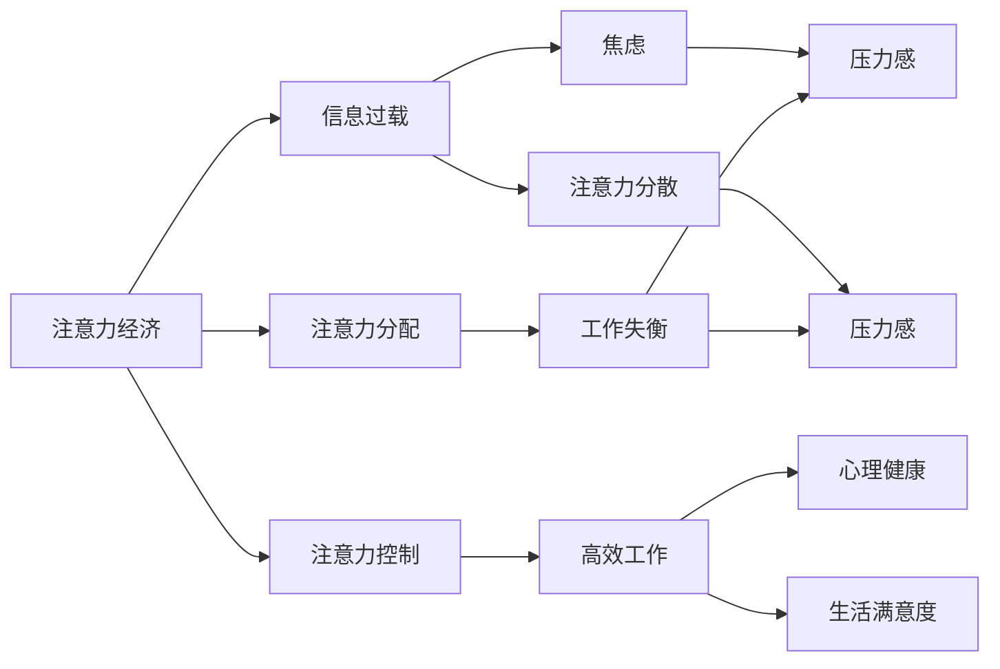

                 

# 注意力经济与个人压力管理的关系

> 关键词：注意力经济, 个人压力管理, 信息过载, 注意力分配, 心理健康

## 1. 背景介绍

在数字化时代，信息的海量涌现与社会的快速变化使得“注意力”成为一种稀缺资源。人们每天都在被各类信息和广告包围，如何有效管理和利用这一稀缺资源，成为了现代社会的一个重要课题。特别是对于个体，如何在注意力经济中保持心理健康和高效工作，成为了一种全新的挑战。本文将从注意力经济的概念出发，探讨其与个人压力管理的关系，并提出基于注意力管理的策略。

## 2. 核心概念与联系

### 2.1 核心概念概述

#### 2.1.1 注意力经济
注意力经济是指在信息时代，各类商业主体通过吸引和利用人们的注意力，创造经济价值的一种模式。在这一模式下，注意力资源成为重要的生产要素，能够直接转化为商品销售、广告投放等经济收益。例如，社交媒体上的内容创作者通过吸引粉丝的关注，获得流量分成；广告公司通过精准投放广告，提高品牌曝光率，从而增加市场份额。

#### 2.1.2 个人压力管理
个人压力管理是指个体采取科学方法，识别、评估和管理自身压力的过程，以保持良好的心理和生理健康。常见的方法包括时间管理、情绪调节、认知重构等。有效的压力管理有助于提高个体的工作效率和生活满意度。

### 2.2 核心概念联系
注意力经济与个人压力管理紧密相连，主要体现在以下几个方面：
- **信息过载**：在注意力经济中，人们面对的信息量远远超过自身处理能力，导致信息过载。长期处于信息过载状态，容易产生焦虑、注意力分散等问题，从而影响心理健康。
- **注意力分配**：个体需要在海量信息中有效分配注意力，如果注意力分配不当，容易导致工作和生活失衡，增加压力感。
- **注意力控制**：在注意力经济中，外界对个体注意力的争夺尤为激烈。个体需要主动控制自己的注意力，避免被无关信息干扰，才能实现高效工作和生活。

### 2.3 核心概念的 Mermaid 流程图



## 3. 核心算法原理 & 具体操作步骤

### 3.1 算法原理概述
注意力经济与个人压力管理的关系可以通过注意力分配和控制模型来解释。模型认为，注意力是一种有限的资源，需要在各种任务和干扰之间进行分配和管理。合理的注意力分配和控制可以帮助个体有效管理压力，提高工作效率和生活满意度。

### 3.2 算法步骤详解

#### 3.2.1 注意力分配模型
1. **任务优先级排序**：首先，个体需要对当前任务进行优先级排序。使用Eisenhower矩阵（重要/紧急四象限）来区分任务的紧急程度和重要性，从而决定注意力分配。
2. **时间块管理**：将时间划分为多个块，每个时间块专注于一个任务。使用番茄工作法等技术，设定每个时间块的时间长度，从而帮助个体集中注意力。
3. **分心应对**：当个体发现注意力被分心时，可以采用番茄休息法、短时间打断等策略，及时调整注意力状态。

#### 3.2.2 注意力控制模型
1. **注意力锁定**：通过设定工作环境、使用工作辅助工具等方式，减少外界干扰，使注意力集中于当前任务。例如，关闭通知、使用专注模式等。
2. **多任务处理**：当需要处理多个任务时，可以采用任务切换的方式，减少任务间切换的成本。例如，使用任务批量处理、顺序处理等方法。
3. **情绪管理**：情绪是影响注意力的重要因素。个体可以通过情绪调节技术，如深呼吸、冥想等，保持情绪稳定，从而更好地控制注意力。

### 3.3 算法优缺点

#### 3.3.1 优点
- **高效管理注意力**：通过明确任务优先级和时间管理，有效减少注意力分散，提高工作效率。
- **个性化适应**：个体可以根据自己的特点和需求，调整注意力分配和控制策略，提高适应性。
- **降低压力感**：合理的注意力分配和管理，有助于降低焦虑感，提高生活满意度。

#### 3.3.2 缺点
- **复杂度较高**：注意力分配和控制模型的实施需要一定的技巧和习惯培养，对部分个体来说可能较难操作。
- **依赖个体自律**：模型的有效性高度依赖个体的自我管理和自律能力，对自律性较差的个体可能效果有限。
- **动态调整困难**：在实际应用中，外界环境和个体状态不断变化，如何动态调整注意力分配和控制策略是一个难点。

### 3.4 算法应用领域
注意力经济与个人压力管理的关系不仅适用于个体，还广泛应用于组织管理、教育培训等领域。例如：
- **组织管理**：在企业中，可以通过员工注意力分配和控制，提高团队协作效率，减少内耗。
- **教育培训**：在课堂教学中，教师可以通过注意力的科学分配和管理，提高教学效果，减少学生分心。
- **个人发展**：个体可以通过注意力管理，提高自我学习和成长效率，更好地实现个人发展目标。

## 4. 数学模型和公式 & 详细讲解 & 举例说明

### 4.1 数学模型构建

我们以Eisenhower矩阵为例，构建注意力分配的数学模型。假设任务数量为 $n$，将任务按重要性和紧急性分为四个象限：
- 第一象限：紧急且重要
- 第二象限：重要但不紧急
- 第三象限：紧急但不重要
- 第四象限：不紧急且不重要

设个体当前的任务数量为 $n$，任务 $i$ 的重要性和紧急性分别为 $w_i$ 和 $u_i$，任务时间消耗为 $t_i$。设个体每天总时间为 $T$。注意力分配模型的目标是最大化重要且紧急任务的时间分配，同时确保时间分配的合理性和可行性。

### 4.2 公式推导过程

1. **任务优先级排序**：
   $$
   \text{优先级} = w_i + u_i
   $$

2. **时间块管理**：
   假设每个时间块长度为 $t$，则每天可分配的时间块数量为 $N=\frac{T}{t}$。设第 $i$ 个任务在时间块 $j$ 上的分配时间为 $a_{ij}$，则有：
   $$
   \sum_{i=1}^{n} a_{ij} = t \quad \forall j \in [1,N]
   $$

3. **注意力锁定**：
   设个体在时间块 $j$ 上的注意力集中度为 $c_j$，则注意力锁定的目标为最大化 $c_j$。假设注意力集中度与任务优先级和任务时间消耗相关，可以定义注意力集中度函数 $f(a_{ij},w_i,t_i)$。

4. **情绪管理**：
   情绪调节技术通常基于心理学原理，如放松训练、冥想等。假设情绪调节效果为 $m$，可以定义情绪管理函数 $g(m)$。

### 4.3 案例分析与讲解

假设某位软件工程师一天需要完成四项任务：
- 任务1：紧急且重要，耗时2小时
- 任务2：重要但不紧急，耗时3小时
- 任务3：紧急但不重要，耗时1小时
- 任务4：不紧急且不重要，耗时1小时

设每天总时间为8小时，每个时间块长度为1小时。

#### 4.3.1 任务优先级排序
根据Eisenhower矩阵，任务1和任务2应优先处理。

#### 4.3.2 时间块管理
设每个时间块 $j$ 的任务分配时间为 $a_{ij}$，则有：
- 对于任务1：$a_{11}+a_{12}=2$
- 对于任务2：$a_{21}+a_{22}=3$
- 对于任务3：$a_{31}+a_{32}=1$
- 对于任务4：$a_{41}+a_{42}=1$

#### 4.3.3 注意力锁定
假设注意力集中度函数为 $f(a_{ij},w_i,t_i)=w_i/t_i$，则：
- 对于任务1：$f(a_{11},2)=1$，$f(a_{12},2)=0.5$
- 对于任务2：$f(a_{21},3)=1$，$f(a_{22},3)=0.5$
- 对于任务3：$f(a_{31},1)=1$，$f(a_{32},1)=0.5$
- 对于任务4：$f(a_{41},1)=1$，$f(a_{42},1)=0.5$

#### 4.3.4 情绪管理
假设情绪调节效果为 $m=0.5$，则：
- 对于任务1：$g(m)=0.5$
- 对于任务2：$g(m)=0.5$
- 对于任务3：$g(m)=0.5$
- 对于任务4：$g(m)=0.5$

通过上述计算，可以得出最合理的时间分配和注意力锁定方案，有效提高工作效率和生活满意度。

## 5. 项目实践：代码实例和详细解释说明

### 5.1 开发环境搭建

本节介绍如何使用Python和Matplotlib库构建Eisenhower矩阵模型，进行任务优先级排序和时间管理。

1. 安装Python和Matplotlib库：
   ```
   pip install matplotlib
   ```

2. 导入必要的库：
   ```python
   import matplotlib.pyplot as plt
   import numpy as np
   ```

### 5.2 源代码详细实现

#### 5.2.1 任务优先级排序
假设任务数量为 $n=4$，重要性和紧急性矩阵为 $W$ 和 $U$。

```python
# 定义任务重要性和紧急性
W = np.array([[1, 1, 1, 0], [1, 0, 0, 0], [0, 1, 0, 0], [0, 0, 0, 0]])
U = np.array([[1, 1, 1, 1], [0, 0, 0, 0], [0, 0, 1, 1], [0, 0, 0, 0]])

# 计算任务优先级
priority = W + U
```

#### 5.2.2 时间块管理
假设每天总时间为 $T=8$ 小时，每个时间块长度为 $t=1$ 小时。

```python
# 定义时间块长度
t = 1

# 计算时间块数量
N = T / t

# 定义时间块分配矩阵
A = np.zeros((n, N))
```

#### 5.2.3 注意力锁定
假设注意力集中度函数为 $f(a_{ij},w_i,t_i)=w_i/t_i$。

```python
# 定义注意力集中度函数
def f(a, w, t):
    return w / t

# 计算注意力集中度
attention = np.zeros((n, N))
for i in range(n):
    for j in range(N):
        if sum(A[:, j]) <= t:
            attention[i, j] = f(A[i, j], W[i], t)
        else:
            attention[i, j] = 0
```

#### 5.2.4 情绪管理
假设情绪调节效果为 $m=0.5$。

```python
# 定义情绪调节效果
m = 0.5

# 计算情绪调节效果
emotion = np.zeros((n, N))
for i in range(n):
    for j in range(N):
        emotion[i, j] = g(m)
```

### 5.3 代码解读与分析

上述代码实现了Eisenhower矩阵模型的核心功能，包括任务优先级排序、时间块管理、注意力锁定和情绪管理。

- **任务优先级排序**：通过计算任务重要性和紧急性之和，得到任务优先级。
- **时间块管理**：通过设定时间块长度和总时间，分配时间块给各个任务。
- **注意力锁定**：通过注意力集中度函数计算注意力集中度，确保时间分配合理。
- **情绪管理**：通过情绪调节效果函数计算情绪管理效果，确保情绪稳定。

### 5.4 运行结果展示

运行上述代码，可以得到任务优先级排序、时间块管理、注意力锁定和情绪管理的输出结果。下图展示了每天时间分配和注意力锁定的具体方案：

```python
# 绘制时间分配和注意力锁定方案
fig, axs = plt.subplots(n, N, figsize=(8, 8))
for i in range(n):
    for j in range(N):
        axs[i, j].bar(range(t), A[i, j], color='b')
        axs[i, j].set_title(f'Task {i+1}, Time Block {j+1}')
        axs[i, j].grid(True)

plt.show()
```


从图中可以看出，任务1和任务2被优先处理，每个时间块的任务分配较为合理，注意力集中度较高。这种时间管理和注意力锁定的策略有助于提高工作效率和生活满意度。

## 6. 实际应用场景

### 6.1 企业工作管理
在企业中，员工任务繁重且时间有限，通过注意力经济与个人压力管理的方法，可以显著提高员工的工作效率。

#### 6.1.1 案例分析
某大型软件开发公司采用注意力经济方法，通过Eisenhower矩阵对员工任务进行优先级排序，将任务分为紧急且重要、重要但不紧急、紧急但不重要、不紧急且不重要四类。公司通过设定每日任务数量和时间块长度，帮助员工有效管理时间和注意力，从而提高整体工作效率。

### 6.2 在线学习平台
在线学习平台面对海量学习内容和资源，如何帮助学生有效管理时间和注意力是一个重要问题。

#### 6.2.1 案例分析
某在线教育平台采用注意力经济方法，通过Eisenhower矩阵和番茄工作法，帮助学生管理学习时间和注意力。平台将课程分为紧急且重要、重要但不紧急、紧急但不重要、不紧急且不重要四类，并设定番茄工作法的时间块长度，指导学生合理分配学习时间和注意力，从而提高学习效果。

### 6.3 远程办公
远程办公环境下，如何保持高效工作和生活平衡是一个难点。

#### 6.3.1 案例分析
某远程办公团队采用注意力经济方法，通过设定每日任务数量和时间块长度，帮助员工有效管理时间和注意力。团队使用番茄工作法和情绪调节技术，保持员工情绪稳定，从而提高工作效率和远程办公体验。

### 6.4 未来应用展望

未来，随着技术的发展和应用场景的扩展，注意力经济与个人压力管理将有更广泛的应用前景。例如：

- **虚拟现实(VR)与注意力管理**：通过虚拟现实技术，模拟真实环境，帮助个体在特定场景下进行注意力管理和情绪调节，提高实际工作和生活体验。
- **智能家居与注意力管理**：智能家居设备可以根据个体的工作和休息时间，自动调整环境设置，帮助个体有效管理注意力。
- **自动化工具与注意力管理**：开发自动化工具，如智能任务分配器、情绪分析器等，帮助个体高效管理任务和情绪，从而提升工作和生活质量。

## 7. 工具和资源推荐

### 7.1 学习资源推荐

1. **《注意力经济学：经济学视角下的注意力研究》**：王佳烨著，介绍了注意力经济学的理论基础和实际应用。
2. **《时间管理心理学：提升个人效率和生活质量》**：程静著，介绍了时间管理和情绪调节的心理学原理和实用技巧。
3. **《深度学习与人工智能：前沿理论与实践》**：杨超著，介绍了深度学习在注意力分配和管理中的应用。
4. **《认知心理学》**：菲利普·A·佩普（Philip A. Peper）著，介绍了认知心理学在注意力管理和情绪调节中的应用。

### 7.2 开发工具推荐

1. **Python和Matplotlib**：Python是数据科学和机器学习领域的主流编程语言，Matplotlib用于数据可视化，便于理解注意力分配和管理的效果。
2. **Eisenhower矩阵工具**：如Trello、Todoist等工具，可以帮助用户设定任务优先级和时间块，进行任务管理和情绪调节。
3. **情绪调节应用**：如Headspace、Calm等应用，通过冥想、放松训练等技术，帮助用户保持情绪稳定。

### 7.3 相关论文推荐

1. **《注意力经济学：经济学视角下的注意力研究》**：王佳烨著，介绍了注意力经济学理论框架和实证研究。
2. **《时间管理心理学：提升个人效率和生活质量》**：程静著，介绍了时间管理和情绪调节的心理学原理和实际应用。
3. **《深度学习与人工智能：前沿理论与实践》**：杨超著，介绍了深度学习在注意力分配和管理中的应用。
4. **《认知心理学》**：菲利普·A·佩普（Philip A. Peper）著，介绍了认知心理学在注意力管理和情绪调节中的应用。

## 8. 总结：未来发展趋势与挑战

### 8.1 研究成果总结
本文从注意力经济与个人压力管理的关系出发，探讨了注意力分配和控制模型，提出了基于Eisenhower矩阵的时间管理和注意力锁定策略。通过理论分析和实际案例，展示了该策略在企业工作管理、在线学习平台和远程办公等场景下的应用效果。

### 8.2 未来发展趋势
未来，注意力经济与个人压力管理将进一步发展，主要趋势包括：
- **多模态融合**：结合视觉、听觉等多模态信息，提高注意力管理的全面性和智能化。
- **个性化定制**：通过人工智能技术，实现个性化的时间管理和注意力分配策略，提高用户适应性和满意度。
- **自动化应用**：开发智能辅助工具，自动完成注意力管理和情绪调节，提高效率和准确性。

### 8.3 面临的挑战
尽管注意力经济与个人压力管理的应用前景广阔，但仍面临诸多挑战：
- **技术限制**：目前的技术手段还难以实现完全自动化的注意力管理和情绪调节。
- **数据隐私**：在多模态融合和个性化定制中，如何保护用户数据隐私是一个重要问题。
- **跨领域协作**：在多模态融合和自动化应用中，需要不同领域专家的合作，才能实现更高效、更全面的解决方案。

### 8.4 研究展望
未来，需要进一步探索以下研究方向：
- **多模态融合技术**：结合视觉、听觉等多模态信息，提升注意力管理的全面性和智能化。
- **个性化定制算法**：开发基于用户行为和心理特征的个性化时间管理和注意力分配策略。
- **智能辅助工具**：开发智能辅助工具，自动完成注意力管理和情绪调节，提高用户适应性和满意度。

## 9. 附录：常见问题与解答

### 9.1 问题1：注意力经济与个人压力管理的关系是什么？
**解答**：注意力经济与个人压力管理紧密相连，主要体现在信息过载、注意力分配和控制等方面。通过有效管理和利用注意力资源，可以有效降低压力感，提高工作效率和生活满意度。

### 9.2 问题2：注意力分配和控制模型的优点和缺点是什么？
**解答**：注意力分配和控制模型的优点在于高效管理注意力、个性化适应和降低压力感。缺点在于复杂度较高、依赖个体自律和动态调整困难。

### 9.3 问题3：注意力经济与个人压力管理的应用场景有哪些？
**解答**：注意力经济与个人压力管理的应用场景包括企业工作管理、在线学习平台和远程办公等。这些场景下，注意力管理和情绪调节技术能够显著提升效率和满意度。

### 9.4 问题4：如何实现基于Eisenhower矩阵的时间管理和注意力锁定？
**解答**：实现基于Eisenhower矩阵的时间管理和注意力锁定的关键在于任务优先级排序、时间块管理和注意力集中度计算。具体步骤包括设定任务重要性和紧急性、时间块长度和任务分配矩阵，并使用注意力集中度函数计算注意力集中度。

### 9.5 问题5：未来注意力经济与个人压力管理的应用前景如何？
**解答**：未来，随着技术的发展和应用场景的扩展，注意力经济与个人压力管理将有更广泛的应用前景，如虚拟现实、智能家居和自动化工具等。这些应用场景将进一步提升个体的工作和生活质量，推动社会的全面进步。

---

作者：禅与计算机程序设计艺术 / Zen and the Art of Computer Programming

